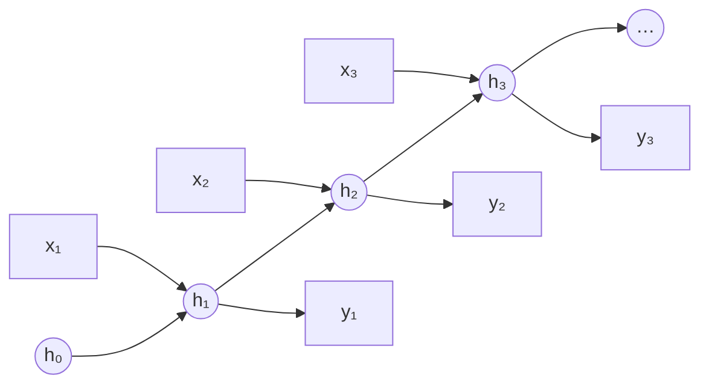
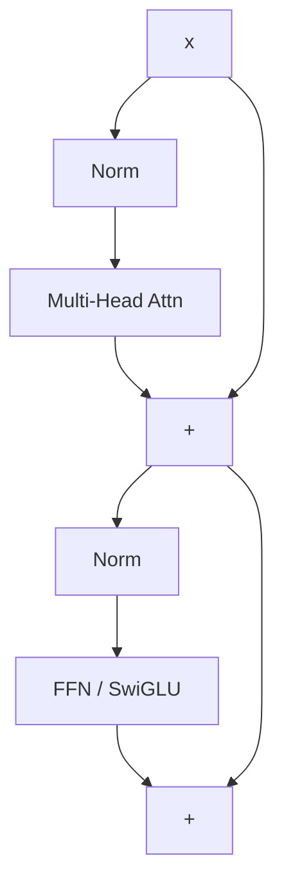
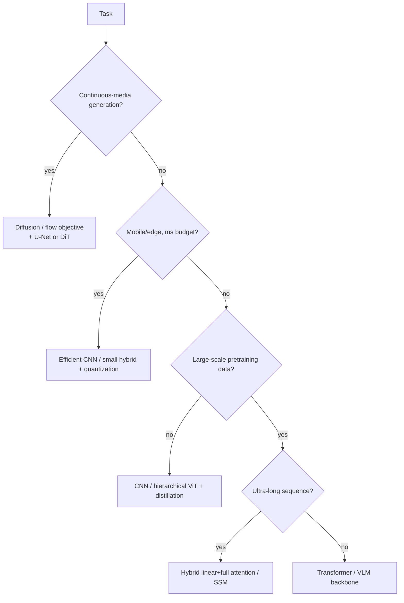

# CNNs, RNNs & Transformers

<div class="tag-row"><span class="tag">inductive bias</span><span class="tag">receptive field</span><span class="tag">self-attention</span><span class="tag">RoPE</span><span class="tag">ViT</span><span class="tag">hybrid attention</span></div>

> [!NOTE] Goals of this chapter
> The MLP in [Neural Networks from First Principles](#/foundations/neural-networks-basics) treats every input alike. Real data, however, has **structure**: neighboring pixels are related in space, sentences have temporal order, and distant words in a long document may depend on each other. This chapter develops the three representative architectures designed around those structures—**CNNs, RNNs, and Transformers**—in the order intuition → diagram → equations.

## Which architecture for which data?

Begin with one intuition: **the more of the data's structure you build into the architecture, the more efficiently it can learn from limited data; the fewer assumptions you hard-code, the more data and compute it needs, but the more flexible and powerful it can become.** These built-in assumptions are called **inductive bias**.

<dl class="kv">
<dt>CNN (images and grids)</dt><dd>Hard-codes <b>locality</b> and <b>translation equivariance</b>. Parameter sharing makes it data-efficient and strong on-device.</dd>
<dt>RNN/LSTM (sequences and streaming)</dt><dd>Hard-codes <b>recurrence</b>: one step at a time with $O(n)$ memory. It is difficult to parallelize and weak on extremely long dependencies.</dd>
<dt>Transformer (general purpose and long context)</dt><dd>Hard-codes very little and connects every position directly through <b>attention</b>. It is fully parallel, but incurs $O(n^2)$ cost and needs positional information.</dd>
</dl>

> [!TIP] One-line interview answer
> *“With enough data and compute, a Transformer replaces hand-built bias with learned bias. When data or latency is tight, a CNN's built-in bias can still win.”* Architecture questions test whether you can reason about the **inductive-bias vs scale** trade-off, not whether you can recite a diagram.

> [!NOTE] See these move
> Many concepts become much clearer in motion: [convolution GIFs](https://github.com/vdumoulin/conv_arithmetic) · [CNN Explainer](https://poloclub.github.io/cnn-explainer/) · [The Illustrated Transformer](https://jalammar.github.io/illustrated-transformer/) · [Transformer Explainer (live)](https://poloclub.github.io/transformer-explainer/) · [Understanding LSTMs](https://colah.github.io/posts/2015-08-Understanding-LSTMs/) · [A Visual Guide to Mamba](https://newsletter.maartengrootendorst.com/p/a-visual-guide-to-mamba-and-state). Curated list → [Visual explainers](#/resources/open-source).

---

## 1 · CNN (Convolutional Neural Network)

### Intuition: slide a small filter across an image

A cat's ear is still a cat's ear wherever it appears in an image. Instead of assigning separate weights to every pixel as an MLP does, a CNN **slides one small filter, or kernel, across the entire image** to find the same pattern. This **parameter sharing** uses far fewer parameters and detects a feature even when it moves.

<figure>
<svg viewBox="0 0 460 240" xmlns="http://www.w3.org/2000/svg" font-family="Inter, sans-serif" font-size="12">
  <text x="115" y="28" text-anchor="middle" fill="#0ea5e9" font-weight="700">Input (5×5)</text>
  <text x="365" y="28" text-anchor="middle" fill="#12a150" font-weight="700">Output (3×3)</text>
  <!-- input grid 5x5, cell 30, origin 40,40 -->
  <rect x="40" y="40" width="150" height="150" fill="none" stroke="#3a4657" stroke-width="1.2"/>
  <g stroke="#3a4657" stroke-width="1">
    <line x1="70" y1="40" x2="70" y2="190"/><line x1="100" y1="40" x2="100" y2="190"/><line x1="130" y1="40" x2="130" y2="190"/><line x1="160" y1="40" x2="160" y2="190"/>
    <line x1="40" y1="70" x2="190" y2="70"/><line x1="40" y1="100" x2="190" y2="100"/><line x1="40" y1="130" x2="190" y2="130"/><line x1="40" y1="160" x2="190" y2="160"/>
  </g>
  <!-- sliding kernel 3x3 = 90px -->
  <rect width="90" height="90" rx="3" fill="rgba(224,83,63,.20)" stroke="#e0533f" stroke-width="2.5">
    <animate attributeName="x" calcMode="discrete" dur="4.5s" repeatCount="indefinite" values="40;70;100;40;70;100;40;70;100"/>
    <animate attributeName="y" calcMode="discrete" dur="4.5s" repeatCount="indefinite" values="40;40;40;70;70;70;100;100;100"/>
  </rect>
  <!-- arrow -->
  <path d="M200 115 H285" stroke="#98a3b2" stroke-width="1.5" marker-end="url(#cv)"/>
  <text x="242" y="106" text-anchor="middle" fill="#98a3b2" font-size="10">Σ(filter · region)</text>
  <!-- output grid 3x3, cell 26, origin 300,72 -->
  <rect x="300" y="72" width="78" height="78" fill="none" stroke="#3a4657" stroke-width="1.2"/>
  <g stroke="#3a4657" stroke-width="1"><line x1="326" y1="72" x2="326" y2="150"/><line x1="352" y1="72" x2="352" y2="150"/><line x1="300" y1="98" x2="378" y2="98"/><line x1="300" y1="124" x2="378" y2="124"/></g>
  <rect width="26" height="26" fill="rgba(18,161,80,.55)">
    <animate attributeName="x" calcMode="discrete" dur="4.5s" repeatCount="indefinite" values="300;326;352;300;326;352;300;326;352"/>
    <animate attributeName="y" calcMode="discrete" dur="4.5s" repeatCount="indefinite" values="72;72;72;98;98;98;124;124;124"/>
  </rect>
  <defs><marker id="cv" markerWidth="8" markerHeight="8" refX="6" refY="3" orient="auto"><path d="M0 0 L6 3 L0 6" fill="#98a3b2"/></marker></defs>
</svg>
<figcaption>The 3×3 kernel (red) slides over the input. At each location, the <b>dot product of the overlapping region and filter</b> produces one output cell (green). Reusing the same filter keeps the parameter count small.</figcaption>
</figure>

Each output pixel is the dot product of the filter and the region beneath it (shown here in 1-D):

$$
y_i=\sum_{m} w_m\, x_{i+d\cdot m}
$$

### Try it yourself — 1D convolution

Use code to build intuition for the sliding dot product. In the lab below, implement valid 1D cross-correlation for two short arrays. The output length is `len(x) - len(w) + 1`. The full 2D implementation continues in [Implement Conv & Pooling](#/ml-coding/conv-pooling).

<div class="widget" data-widget="code">
<script type="application/json" class="code-config">
{"func":"conv1d","packages":["numpy"],"approx":true,"starter":"def conv1d(x, w):\n    # x and w are lists of numbers. Slide filter w over x one position at a time,\n    # compute the dot product of the overlap and w at each position, and return a list.\n    # Output length = len(x) - len(w) + 1\n    pass","tests":[{"args":[[1,2,3,4],[1,0]],"expect":[1.0,2.0,3.0]},{"args":[[1,2,3,4],[1,1]],"expect":[3.0,5.0,7.0]},{"args":[[1,2,3],[1,-1]],"expect":[-1.0,-1.0]},{"args":[[0,1,0,0,1],[1,1,1]],"expect":[1.0,1.0,1.0]}],"solution":"import numpy as np\n\ndef conv1d(x, w):\n    x = np.asarray(x, float); w = np.asarray(w, float)\n    n = len(x) - len(w) + 1\n    return [float(np.dot(x[i:i+len(w)], w)) for i in range(n)]"}
</script>
</div>

### Receptive field & dilation

The **receptive field (RF)** is the input region one output unit depends on. Stacking, striding, and dilation grow it. For a 1-D dilated conv with kernel $k$ and dilation $d$, the effective coverage is $\approx d(k-1)+1$.

Dilated (atrous) convs (DeepLab/ASPP) enlarge RF **without** losing resolution or adding parameters — but too-aggressive dilation causes *gridding artifacts* (kernel taps sample the input too sparsely). Note the **effective** RF is smaller and more Gaussian than the theoretical one, so "big RF" ≠ "sees everything."

### Depthwise-separable convolution — where the savings come from

Split a standard $K\times K$ conv into two cheaper steps:
1. **Depthwise**: one $K\times K$ filter *per input channel* — mixes **space**, not channels.
2. **Pointwise**: a $1\times1$ conv mixing channels $C_{in}\to C_{out}$ — mixes **channels**, not space.

Count the multiply–adds for an $H\times W$ output:

$$
\underbrace{H W\, C_{in} C_{out} K^2}_{\text{standard}}
\;\longrightarrow\;
\underbrace{H W\, C_{in} K^2}_{\text{depthwise}}+\underbrace{H W\, C_{in} C_{out}}_{\text{pointwise}}
= H W\, C_{in}\,(K^2+C_{out})
$$

so the cost (and parameter) ratio is

$$
\frac{C_{in}(K^2+C_{out})}{C_{in} C_{out} K^2}=\frac{1}{C_{out}}+\frac{1}{K^2}.
$$

**Why it's cheaper (intuition):** a standard conv mixes space *and* channels **simultaneously**, costing $C_{in}C_{out}K^2$ per pixel. Depthwise-separable **factorizes** that into "mix space, then mix channels," and $K^2+C_{out}$ is far smaller than $K^2 C_{out}$. For $K=3$ and large $C_{out}$ the ratio $\to \tfrac19$ — roughly **8–9× fewer FLOPs and params**. Core trick behind MobileNet/EfficientNet on-device models. **Caveat:** slightly less expressive per layer, and depthwise/pointwise ops are often **memory-bandwidth-bound** on real hardware (low FLOPs ≠ automatically fast) — see [Mixed Precision & Efficiency](#/foundations/mixed-precision-efficiency).

### Residual connections — the gradient view of why vanishing stops

ResNet's $y=x+F(x)$ adds an **identity path**. The payoff shows up in the **backward pass**. For one block,

$$
\frac{\partial \mathcal L}{\partial x}=\frac{\partial \mathcal L}{\partial y}\Big(I+\frac{\partial F}{\partial x}\Big)
$$

— the gradient reaching the input is the upstream gradient times $\big(I+\partial F/\partial x\big)$. That $I$ is a term that is **not** multiplied by the block's Jacobian. Now stack $L$ blocks:

- **Plain net:** $\dfrac{\partial \mathcal L}{\partial x_0}=\dfrac{\partial \mathcal L}{\partial x_L}\prod_{\ell=1}^{L}\dfrac{\partial F_\ell}{\partial x_{\ell-1}}$ — a product of $L$ Jacobians. If their singular values sit below 1 the product **shrinks geometrically → vanishing gradient**; above 1 → exploding.
- **Residual net:** $\dfrac{\partial \mathcal L}{\partial x_0}=\dfrac{\partial \mathcal L}{\partial x_L}\prod_{\ell=1}^{L}\Big(I+\dfrac{\partial F_\ell}{\partial x_{\ell-1}}\Big)$ — expanding the product always yields the **identity term $I$** (a clean "1" path) plus higher-order corrections.

This identity contribution tends to improve gradient propagation and conditioning relative to a deep plain network, and it substantially alleviated ResNet's **degradation** problem, in which deeper plain networks performed *worse* than shallower ones. It does not guarantee that gradient magnitude is always preserved, because the other Jacobian terms can still cancel or amplify it. The Transformer's **residual stream** follows the same design principle, while Pre-LN stability also depends on normalization placement, initialization, and residual scaling. See [Normalization & Stability](#/foundations/normalization-stability).

> **PyTorch-style pseudocode — data flow through the residual path**

```python
def pre_norm_block(x):                 # x: [batch, tokens, d_model]
    skip = x                           # same identity path, not a copy
    x = skip + attention(norm1(x))     # shapes must match for addition
    skip = x
    x = skip + mlp(norm2(x))
    return x                           # gradient flows through both add paths
```

> [!NOTE] Activation functions
> The choice of nonlinearity interacts with depth and normalization. Transformers use smooth **GELU/SiLU**, while latency-sensitive systems often use **ReLU**; saturating sigmoid and tanh are generally avoided in deep hidden layers. For formulas, saturation behavior, dead ReLUs, and an interactive widget covering ReLU, LeakyReLU, Sigmoid, Tanh, and GELU, see [Neural Networks from First Principles](#/foundations/neural-networks-basics).

<details class="qa"><summary>What does dilation buy you over stride/pooling for growing the receptive field?</summary>
<div class="qa-body">

**Short:** dilation enlarges RF while *keeping* spatial resolution; stride/pooling enlarge RF by *throwing resolution away*.

**Deep:** For dense prediction (segmentation, matting) you need per-pixel outputs, so downsampling hurts boundary quality. Dilated convs (ASPP with multiple rates) capture multi-scale context at full resolution. The cost: gridding artifacts and irregular memory access. Stride/pooling are cheaper and add useful invariance for classification, but discard the fine detail dense tasks need. **Follow-ups:** *Deformable conv?* — learns sampling offsets, adapting RF to object shape. *Why is effective RF smaller than theoretical?* — center taps dominate; contributions decay outward.
</div></details>

---

## 2 · RNNs, LSTMs, GRUs — and why attention displaced them

### Intuition: carry memory forward

When reading a sentence, we remember earlier words to understand the next one. An RNN imitates this directly: it carries a small memory called the **hidden state**, reads one word at a time, and updates that memory. Over long sequences, early information fades through vanishing gradients, and processing only one step at a time is slow.

### Vanilla RNN
Carries a single hidden state forward, one step at a time:

$$h_t=\tanh(W_h h_{t-1}+W_x x_t+b),\qquad y_t=W_y h_t$$



Backpropagation through time repeatedly multiplies not only by the recurrent weights but also by each activation Jacobian. The singular-value structure of this product causes vanishing or exploding gradients; the spectral radius of $W_h$ alone cannot decide every case. Vanilla RNNs clearly tend to struggle with long dependencies, but their memory length cannot be fixed universally at “tens of steps.”

### LSTM — a gated cell-state highway
Adds a gated **cell state** with an additive path:

$$
\begin{aligned}
f_t&=\sigma(W_f[h_{t-1},x_t]) & i_t&=\sigma(W_i[h_{t-1},x_t])\\
\tilde c_t&=\tanh(W_c[h_{t-1},x_t]) & c_t&=f_t\odot c_{t-1}+i_t\odot\tilde c_t\\
o_t&=\sigma(W_o[h_{t-1},x_t]) & h_t&=o_t\odot\tanh(c_t)
\end{aligned}
$$

The key is the **additive** update $c_t=f_t\odot c_{t-1}+i_t\odot\tilde c_t$: when the forget gate $f_t\approx1$, the cell (and its gradient) flows forward nearly unchanged — a **residual highway through time**, the same trick as ResNet above.

<figure>
<svg viewBox="0 0 500 168" font-family="Inter, sans-serif" font-size="12">
  <line x1="34" y1="52" x2="466" y2="52" stroke="#e0533f" stroke-width="2.6"/>
  <text x="30" y="42" fill="#f4917f">cₜ₋₁</text><text x="452" y="42" fill="#f4917f">cₜ</text>
  <circle cx="165" cy="52" r="15" fill="none" stroke="#6366f1" stroke-width="1.8"/><text x="165" y="57" text-anchor="middle" fill="#a5b4fc">×</text>
  <text x="165" y="26" text-anchor="middle" fill="#98a3b2">forget fₜ</text>
  <circle cx="300" cy="52" r="15" fill="none" stroke="#12a150" stroke-width="1.8"/><text x="300" y="58" text-anchor="middle" fill="#34d399">+</text>
  <text x="300" y="26" text-anchor="middle" fill="#98a3b2">input iₜ⊙c̃ₜ</text>
  <line x1="385" y1="52" x2="385" y2="108" stroke="#98a3b2"/>
  <rect x="348" y="108" width="74" height="26" rx="5" fill="none" stroke="#0ea5e9"/><text x="385" y="125" text-anchor="middle" fill="#7dd3fc">tanh · oₜ</text>
  <text x="385" y="156" text-anchor="middle" fill="#f2f6fb">hₜ (output)</text>
  <text x="232" y="86" text-anchor="middle" fill="#6b7686">cell state passes through mostly-additively → gradient preserved</text>
</svg>
<figcaption>The top <b>cell state</b> only meets a multiply (forget) and an add (input); with <code>fₜ≈1</code> it is a residual highway along the time axis.</figcaption>
</figure>

### GRU — a lighter gate set
$$
\begin{aligned}
z_t&=\sigma(W_z[h_{t-1},x_t]) & r_t&=\sigma(W_r[h_{t-1},x_t])\\
\tilde h_t&=\tanh\!\big(W_h[\,r_t\odot h_{t-1},\,x_t]\big) & h_t&=(1-z_t)\odot h_{t-1}+z_t\odot\tilde h_t
\end{aligned}
$$

GRU merges the cell and hidden state and uses **2 gates** (update $z$, reset $r$) instead of LSTM's 3 → ~25% fewer parameters, often comparable accuracy, slightly faster.

### Pros / cons
| | Vanilla RNN | LSTM | GRU |
| --- | --- | --- | --- |
| Gates | 0 | 3 (forget/input/output) | 2 (update/reset) |
| Long-range memory | poor | strong | strong |
| Params / speed | fewest / — | most / slowest | middle / faster |
| Use when | almost never | long dependencies, more capacity | similar, less data/compute |

### Why the field moved to attention
1. Recurrence is inherently **sequential** → poor GPU utilization; Transformers run the whole sequence **in parallel**.
2. A **fixed-size state** bottlenecks long context; even LSTMs fade over very long range.
3. Attention gives every token **direct, one-hop access** to every other token.

RNN/SSM ideas survive where **streaming, low latency, or $O(n)$ memory** matter—motivating the hybrid designs and **Mamba** in §6 below.

---

## 3 · Transformer

### Intuition: every word can look directly at every other word

An RNN carries memory forward one step at a time. A Transformer instead lets **every token look directly at every other token at once**. To determine what “it” refers to, the token compares its relevance, or attention weight, with every word in the sentence and gathers more information from the most relevant ones. This is **self-attention**: it is parallel rather than sequential and connects distant positions in one hop.

<figure>
<svg viewBox="0 0 560 150" xmlns="http://www.w3.org/2000/svg" font-family="Inter, sans-serif" font-size="12">
  <!-- tokens -->
  <g text-anchor="middle">
    <rect x="30" y="90" width="70" height="30" rx="6" fill="none" stroke="#0ea5e9" stroke-width="1.5"/><text x="65" y="110" fill="currentColor">The</text>
    <rect x="150" y="90" width="70" height="30" rx="6" fill="#6366f1"/><text x="185" y="110" fill="#fff">animal</text>
    <rect x="270" y="90" width="70" height="30" rx="6" fill="none" stroke="#0ea5e9" stroke-width="1.5"/><text x="305" y="110" fill="currentColor">was</text>
    <rect x="390" y="90" width="70" height="30" rx="6" fill="none" stroke="#0ea5e9" stroke-width="1.5"/><text x="425" y="110" fill="currentColor">tired</text>
    <rect x="480" y="90" width="60" height="30" rx="6" fill="#e0533f"/><text x="510" y="110" fill="#fff">it</text>
  </g>
  <!-- attention arrows from "it" to all, thickness = weight -->
  <path d="M500 90 C 430 30, 250 30, 185 88" fill="none" stroke="#e0533f" stroke-width="3.2" marker-end="url(#at)"/>
  <path d="M498 90 C 440 45, 120 45, 65 88" fill="none" stroke="#e0533f" stroke-width="1" opacity="0.5" marker-end="url(#at)"/>
  <path d="M504 90 C 470 55, 340 55, 305 88" fill="none" stroke="#e0533f" stroke-width="1" opacity="0.5" marker-end="url(#at)"/>
  <path d="M508 90 C 490 60, 450 60, 425 88" fill="none" stroke="#e0533f" stroke-width="1.4" opacity="0.5" marker-end="url(#at)"/>
  <text x="185" y="20" text-anchor="middle" fill="#e0533f" font-size="11">thicker means stronger attention → “it” = “animal”</text>
  <defs><marker id="at" markerWidth="7" markerHeight="7" refX="5" refY="3" orient="auto"><path d="M0 0 L5 3 L0 6" fill="#e0533f"/></marker></defs>
</svg>
<figcaption>“it” (red) looks at every token and scores relevance; its connection to “animal” is the thickest. This all-to-all connection is the core of self-attention. To manipulate it directly, use the interactive widget in [Attention From Scratch](#/ml-coding/attention).</figcaption>
</figure>

### Architecture (recreating the original paper's figure)

The encoder–decoder stack from *Attention Is All You Need* — inputs enter bottom-left, output probabilities exit top-right; the **encoder's output feeds the decoder's cross-attention as K, V**.

<figure>
<svg viewBox="0 0 540 520" font-family="Inter, sans-serif" font-size="10.5">
  <defs><marker id="ah" markerWidth="8" markerHeight="8" refX="6" refY="3" orient="auto"><path d="M0 0 L6 3 L0 6" fill="#98a3b2"/></marker></defs>
  <!-- helper styles inline -->
  <!-- ENCODER outer -->
  <rect x="70" y="150" width="170" height="185" rx="8" fill="none" stroke="#3a4657" stroke-dasharray="4 3"/>
  <text x="60" y="245" fill="#98a3b2" transform="rotate(-90 60,245)">N×</text>
  <!-- encoder inner boxes (top→bottom) -->
  <rect x="88" y="163" width="134" height="20" rx="4" fill="rgba(217,119,6,.14)" stroke="#d97706"/><text x="155" y="177" text-anchor="middle" fill="#fbbf24">Add &amp; Norm</text>
  <rect x="88" y="190" width="134" height="26" rx="4" fill="rgba(18,161,80,.16)" stroke="#12a150"/><text x="155" y="207" text-anchor="middle" fill="#34d399">Feed Forward</text>
  <rect x="88" y="224" width="134" height="20" rx="4" fill="rgba(217,119,6,.14)" stroke="#d97706"/><text x="155" y="238" text-anchor="middle" fill="#fbbf24">Add &amp; Norm</text>
  <rect x="88" y="251" width="134" height="26" rx="4" fill="rgba(99,102,241,.18)" stroke="#6366f1"/><text x="155" y="268" text-anchor="middle" fill="#a5b4fc">Multi-Head Attention</text>
  <!-- DECODER outer -->
  <rect x="300" y="90" width="170" height="245" rx="8" fill="none" stroke="#3a4657" stroke-dasharray="4 3"/>
  <text x="484" y="215" fill="#98a3b2" transform="rotate(-90 484,215)">N×</text>
  <rect x="318" y="103" width="134" height="20" rx="4" fill="rgba(217,119,6,.14)" stroke="#d97706"/><text x="385" y="117" text-anchor="middle" fill="#fbbf24">Add &amp; Norm</text>
  <rect x="318" y="130" width="134" height="26" rx="4" fill="rgba(18,161,80,.16)" stroke="#12a150"/><text x="385" y="147" text-anchor="middle" fill="#34d399">Feed Forward</text>
  <rect x="318" y="164" width="134" height="20" rx="4" fill="rgba(217,119,6,.14)" stroke="#d97706"/><text x="385" y="178" text-anchor="middle" fill="#fbbf24">Add &amp; Norm</text>
  <rect x="318" y="191" width="134" height="26" rx="4" fill="rgba(99,102,241,.18)" stroke="#6366f1"/><text x="385" y="208" text-anchor="middle" fill="#a5b4fc">Multi-Head Attention</text>
  <rect x="318" y="225" width="134" height="20" rx="4" fill="rgba(217,119,6,.14)" stroke="#d97706"/><text x="385" y="239" text-anchor="middle" fill="#fbbf24">Add &amp; Norm</text>
  <rect x="318" y="252" width="134" height="26" rx="4" fill="rgba(99,102,241,.18)" stroke="#6366f1"/><text x="385" y="269" text-anchor="middle" fill="#a5b4fc">Masked Multi-Head Attn</text>
  <!-- embeddings + PE -->
  <rect x="88" y="360" width="134" height="24" rx="4" fill="none" stroke="#0ea5e9"/><text x="155" y="376" text-anchor="middle" fill="#7dd3fc">Input Embedding</text>
  <rect x="318" y="360" width="134" height="24" rx="4" fill="none" stroke="#0ea5e9"/><text x="385" y="376" text-anchor="middle" fill="#7dd3fc">Output Embedding</text>
  <circle cx="155" cy="330" r="10" fill="none" stroke="#e0533f"/><text x="155" y="334" text-anchor="middle" fill="#f4917f">+</text>
  <circle cx="385" cy="330" r="10" fill="none" stroke="#e0533f"/><text x="385" y="334" text-anchor="middle" fill="#f4917f">+</text>
  <text x="250" y="333" text-anchor="middle" fill="#6b7686" font-size="9.5">Positional Encoding</text>
  <!-- bottom labels -->
  <text x="155" y="405" text-anchor="middle" fill="#d6dde6">Inputs</text>
  <text x="385" y="405" text-anchor="middle" fill="#d6dde6">Outputs (shifted right)</text>
  <!-- top: Linear / Softmax / Probs -->
  <rect x="335" y="55" width="100" height="22" rx="4" fill="none" stroke="#e0533f"/><text x="385" y="70" text-anchor="middle" fill="#f4917f">Linear</text>
  <rect x="335" y="26" width="100" height="22" rx="4" fill="none" stroke="#e0533f"/><text x="385" y="41" text-anchor="middle" fill="#f4917f">Softmax</text>
  <text x="385" y="14" text-anchor="middle" fill="#d6dde6">Output Probabilities</text>
  <!-- arrows -->
  <line x1="155" y1="398" x2="155" y2="386" stroke="#98a3b2" marker-end="url(#ah)"/>
  <line x1="155" y1="360" x2="155" y2="342" stroke="#98a3b2" marker-end="url(#ah)"/>
  <line x1="155" y1="320" x2="155" y2="279" stroke="#98a3b2" marker-end="url(#ah)"/>
  <line x1="385" y1="398" x2="385" y2="386" stroke="#98a3b2" marker-end="url(#ah)"/>
  <line x1="385" y1="360" x2="385" y2="342" stroke="#98a3b2" marker-end="url(#ah)"/>
  <line x1="385" y1="320" x2="385" y2="280" stroke="#98a3b2" marker-end="url(#ah)"/>
  <line x1="385" y1="90" x2="385" y2="79" stroke="#98a3b2" marker-end="url(#ah)"/>
  <line x1="385" y1="55" x2="385" y2="50" stroke="#98a3b2" marker-end="url(#ah)"/>
  <!-- encoder output → decoder cross-attention (K,V) -->
  <path d="M240,255 C 270,255 270,205 316,204" fill="none" stroke="#e0533f" stroke-width="1.6" stroke-dasharray="4 3" marker-end="url(#ah)"/>
  <text x="270" y="228" fill="#f4917f" font-size="9.5">K, V</text>
  <line x1="155" y1="150" x2="155" y2="150" stroke="#98a3b2"/>
</svg>
<figcaption>Encoder (left, ×N) and decoder (right, ×N). Each sublayer is wrapped by a residual <b>Add &amp; Norm</b>. The decoder adds a <b>masked</b> self-attention (can't peek ahead) and a <b>cross-attention</b> that reads the encoder output as K, V. Decoder-only LLMs (GPT/LLaMA) keep just the right column without cross-attention.</figcaption>
</figure>

Inside **one** sublayer's residual wrapper (modern **Pre-LN** placement):



*(Original paper puts Norm **after** the residual add (Post-LN); modern LLMs use **Pre-LN** for stability — see [Normalization & Stability](#/foundations/normalization-stability).)*

### Scaled dot-product attention

$$
\mathrm{Attention}(Q,K,V)=\mathrm{softmax}\!\Big(\frac{QK^\top}{\sqrt{d_k}}\Big)V
$$

Intuition: every token produces three vectors—a **query $q$**, **key $k$**, and **value $v$**. The dot product between one token's query and another token's key measures relevance; softmax turns those scores into weights used to mix the values. Including projections, standard dense attention costs $O(nd^2+n^2d)$ computation. A naive implementation that materializes scores and weights uses an additional $O(n^2)$ memory. FlashAttention computes the same attention in tiles, avoiding storage of the quadratic score matrix in HBM. For an implementation, see [Attention From Scratch](#/ml-coding/attention).

### FFN and modern recipe

$$
\mathrm{FFN}(x)=\phi(xW_1+b_1)W_2+b_2
$$

Frontier LLM decoders converge on a near-standard recipe: **RMSNorm + Pre-LN + RoPE + SwiGLU + GQA**, often with QK-Norm for logit stability. Variants split by attention scope: **encoder-only** (BERT — bidirectional, understanding), **decoder-only** (GPT/LLaMA — causal, generation), **encoder–decoder** (T5 — cross-attention over encoder memory). See [LLM Fundamentals](#/llm/fundamentals).

### Positional encodings

Self-attention is **permutation-equivariant**: reordering the input merely reorders the output, so the operation itself does not know sequence order. Position must therefore be injected explicitly; otherwise “the cat sat” and “sat cat the” would be indistinguishable. The two broad families are **absolute** encodings, which assign each position its own sinusoidal or learned vector, and **relative** encodings, which represent the query–key offset $i-j$ and often extrapolate better for language. Modern LLMs predominantly use **RoPE**, which rotates Q and K by position-dependent angles so their dot product encodes relative offset and can be extended with NTK/YaRN scaling, or **ALiBi**, which adds a distance-based logit bias. For formulas, tables, derivations, and interactive implementations of sinusoidal encoding, RoPE, and ALiBi, see [Positional Encoding & RoPE](#/ml-coding/positional-encoding-rope).

<details class="qa"><summary>Why divide attention logits by √d_k, and why does multi-head beat one big head?</summary>
<div class="qa-body">

**Short:** the divisor controls logit variance so softmax stays in a well-conditioned regime; multiple heads let the model attend to several relations *simultaneously* in different subspaces.

**Deep:** The variance derivation for $\sqrt{d_k}$ scaling appears in [Attention From Scratch](#/ml-coding/attention): without scaling, large-$d_k$ logits push softmax toward one-hot and shrink gradients. One head of size $d$ can form only one attention distribution per query; $h$ heads of size $d/h$ form $h$ distributions at the *same* parameter/FLOP budget—for example, one head may track syntax and another coreference. **Follow-ups:** *GQA/MQA?* Share K/V across query heads to shrink the KV cache at inference; see [Efficiency](#/foundations/mixed-precision-efficiency). *Can attention maps be used as explanations?* Cautiously: attention weight ≠ causal importance.
</div></details>

---

## 4 · Vision Transformers (ViT)

ViT tokenizes an image into $P\times P$ patches → linear embeddings → `[CLS]` + position → Transformer encoder → head. It trades locality bias for scale.

| | CNN | ViT |
| --- | --- | --- |
| Locality bias | strong | weak early |
| Translation equivariance | strong | weak (learned) |
| Global context | needs depth | layer 1 |
| Small-data regime | strong | weak (needs pretraining/distillation) |
| Resolution flexibility | natural | patch/memory-bound |

Hierarchical successors add back useful bias: **Swin** (shifted-window local attention), **ConvNeXt** (a modernized pure CNN matching ViTs), **CoAtNet/hybrid stems** (conv early, attention late). For CV foundation work the live choice is **pure ViT vs. hybrid** under a **resolution × latency × pretraining-data** budget — exactly the trade-off in high-res segmentation/matting and SAM-style heavy-encoder + light-decoder designs.

<details class="qa"><summary>ViT underperforms a ResNet on your small dataset. What's happening and what do you do?</summary>
<div class="qa-body">

**Short:** ViT lacks CNN's built-in locality/translation bias, so with little data it overfits or fails to learn spatial structure. Fixes: pretrain/distill, add convolutional bias, or use a hierarchical variant.

**Deep:** concretely — (1) initialize from a large pretrained ViT (ImageNet-21k/LAION) instead of training from scratch; (2) use **DeiT-style distillation** from a CNN teacher; (3) add a **convolutional stem** or use **Swin/hybrid** to reintroduce locality; (4) strong augmentation/regularization. The deeper point: ViT's advantage is *asymptotic* in data — below the crossover point the CNN's inductive bias is genuinely better, and saying so signals maturity. **Follow-up:** *Patch size effect?* — smaller patches → more tokens → higher accuracy but quadratic cost.
</div></details>

---

## 5 · Diffusion and Flow Matching — learning the generation process

CNNs and Transformers are **function backbones**. Diffusion and flow matching instead specify the **training objective and generation path** from noise to data. “Diffusion or Transformer?” is therefore a false choice: an image-diffusion denoiser may be a U-Net or a DiT, a Diffusion Transformer operating on patch tokens.

### Diffusion: reverse noise step by step

The DDPM forward process mixes a clean sample $x_0$ with Gaussian noise at time $t$. Given cumulative noise schedule $\bar\alpha_t$, any time can be sampled directly:

$$
x_t=\sqrt{\bar\alpha_t}\,x_0+\sqrt{1-\bar\alpha_t}\,\epsilon,
\qquad \epsilon\sim\mathcal N(0,I)
$$

The network $\epsilon_\theta(x_t,t,c)$ receives time $t$ and an optional condition $c$, such as text or a class, and learns to predict the injected noise:

$$
\mathcal L_{\text{simple}}
=\mathbb E_{x_0,t,\epsilon}\left[\|\epsilon-\epsilon_\theta(x_t,t,c)\|_2^2\right]
$$

An implementation may target the noise $\epsilon$, the clean sample $x_0$, or a mixture of the two called **$v$-prediction**. Their parameterizations and weightings differ, so the configuration must match what the checkpoint and scheduler expect. Generation starts from noise and integrates a learned reverse SDE or Markov chain, or its corresponding ODE, over multiple steps. DDIM, higher-order ODE solvers, and distillation shift the trade-off between step count and quality.

> **PyTorch-style pseudocode — diffusion training and sampling run in opposite directions**

```python
# train: sample one arbitrary noise level and regress the target
x0, cond = next(batch)                         # x0: [B, C, H, W]
t = sample_timesteps(B)                        # t: [B]
noise = torch.randn_like(x0)
xt = scheduler.add_noise(x0, noise, t)
loss = mse(denoiser(xt, t, cond), noise)       # epsilon-prediction example
loss.backward()                                # scheduler and noise need no gradients

# sample: iterate from T -> 0 under eval/no_grad
denoiser.eval()
with torch.no_grad():
    x = torch.randn(B, C, H, W, device=device)
    for t in scheduler.timesteps:
        pred = denoiser(x, t, cond)
        x = scheduler.step(pred, t, x).prev_sample
```

<dl class="kv">
<dt>Pixel vs latent diffusion</dt><dd>Pixel space is direct but expensive at high resolution. Latent diffusion first compresses with an autoencoder, generates in latent space, then decodes, reducing cost while also inheriting the autoencoder's losses and biases.</dd>
<dt>U-Net vs DiT</dt><dd>U-Net offers multi-scale skip connections and strong convolutional locality. DiT uses a Transformer over latent patches to pursue scaling benefits. Both are backbones for a diffusion objective.</dd>
<dt>Classifier-free guidance</dt><dd>Combines conditional and unconditional predictions as $\hat\epsilon=\epsilon_{\emptyset}+s(\epsilon_c-\epsilon_{\emptyset})$. Increasing $s$ can improve condition adherence but hurt diversity and naturalness, and may require two evaluations.</dd>
</dl>

### Flow matching: directly match a velocity field

Consider the simplest straight path. Pair $x_0\sim p_{\text{noise}}$ with $x_1\sim p_{\text{data}}$ and define

$$
x_t=(1-t)x_0+t x_1,\qquad u_t=x_1-x_0
$$

The network then regresses the velocity at an intermediate point:

$$
\mathcal L_{\text{FM}}=\mathbb E_{t,x_0,x_1}
\left[\|v_\theta(x_t,t,c)-u_t\|_2^2\right]
$$

At generation time, start from $x(0)\sim p_{\text{noise}}$ and integrate the ODE $\frac{dx}{dt}=v_\theta(x,t,c)$ from $t=0$ to $1$. In practice, **conditional flow matching** chooses trainable probability paths and couplings rather than simple independent pairs, while rectified-flow methods try to straighten paths so fewer solver steps suffice. Diffusion score models can also be represented through a probability-flow ODE, but this relationship does **not** make their training targets and paths automatically identical.

> [!TIP] Axes for an interview answer
> Separate what the model predicts ($\epsilon/x_0/v$/velocity), where it trains (pixel/latent), which backbone it uses (U-Net/DiT), which sampler and step count it uses, and how conditioning and guidance work. Distribution metrics such as FID cannot alone represent prompt alignment, diversity, human and text errors, and latency, so pair them with task-specific human, semantic, and safety evaluation.

---

## 6 · Hybrid linear/full attention and state-space models

For long sequences, the full-attention score matrix grows quadratically with length. State-space models and linear attention offer a different cost point, such as linear time and a fixed-size recurrent state. Some models mix these layers with full attention to trade throughput against content-lookup ability. This is a promising design family, not a single consensus solution for every task.

### How a state-space model (Mamba) works

An **SSM** processes a sequence through a small recurrent hidden state $h_t$ — like an RNN, but *linear*:

$$
h_t = A\,h_{t-1} + B\,x_t,\qquad y_t = C\,h_t
$$

- Because a classical SSM is **linear time-invariant**, with fixed $A,B,C$, the same operation can be unfolded as a convolution for parallel training or run recurrently at inference. The S4 family uses structured state matrices derived from HiPPO to help learn long dependencies.
- **Mamba's key idea — selectivity.** It makes $B$, $C$, and the step size $\Delta$ input-dependent, controlling what each token writes to and reads from the state. This breaks time invariance, so the operation is no longer a simple fixed convolution; Mamba uses a hardware-aware scan for GPU efficiency.

**Cost profile:** sequence mixing is linear in length $n$ and can train with a parallel scan. At autoregressive inference, each layer's recurrent state has fixed size independent of context length, and there is no attention KV cache. Total model memory and runtime still depend on batch size, layer count, state dimension, and kernel implementation.

<div class="proscons">
<div><div class="pros-t">Mamba / SSM — Pros</div>
Linear time, constant inference memory, no KV cache → cheap ultra-long context + streaming; strong on audio, DNA, and long signal sequences.
</div>
<div><div class="cons-t">Cons vs Transformer</div>
Weaker at <b>exact recall</b> / copying / in-context retrieval (history is compressed into a fixed-size state); less mature ecosystem; one-hop content lookups that attention does trivially are hard.
</div>
</div>

This trade-off is why some designs **interleave full-attention layers** for tasks that require exact copying and retrieval. The ratios below are examples from particular public models, not universal optima.

<dl class="kv">
<dt>Mamba / Mamba-2</dt><dd>Selective state-space models with linear-time sequence mixing. Mamba-2's <b>SSD</b> framework explains a mathematical connection between structured state-space layers and certain forms of linear attention.</dd>
<dt>Nemotron-H family</dt><dd>A hybrid example combining many Mamba-family layers with some attention layers. Reported throughput must be interpreted together with model size, hardware, batch, and context conditions.</dd>
<dt>Qwen3-Next</dt><dd>~3:1 hybrid — Gated DeltaNet (linear attention) + periodic full attention, ultra-sparse MoE, multi-token prediction.</dd>
<dt>MiniMax-01</dt><dd>"Lightning attention" at ~7:1 linear:full ratio for ultra-long context.</dd>
</dl>

**Why retain *any* full attention?** Compressing history into a fixed-size state can bottleneck exact token-to-token lookup. Full attention supplies a direct path to every earlier token representation while linear mixing layers handle the rest of the computation. The recall disadvantage and the value of a hybrid must still be verified experimentally for the data, training setup, and model scale. See [LLM Fundamentals](#/llm/fundamentals) and [Efficiency](#/foundations/mixed-precision-efficiency).

<details class="qa"><summary>Why are labs shipping 3:1 / 7:1 hybrid layouts instead of pure Mamba?</summary>
<div class="qa-body">

**Short:** linear-attention/SSM layers are $O(n)$ and fast but lose exact long-range recall; a minority of full-attention layers restores it, giving near-Transformer quality at a fraction of the attention cost.

**Deep:** SSMs summarize the past in a bounded state, which can bottleneck exact copying from distant positions. Some hybrid models supplement that retrieval path with a few full-attention layers and use many linear layers to lower compute. The layer ratio is a model-specific design variable. **Follow-up:** *How does this interact with the KV cache?* Full-attention layers have a KV cache that grows with context, while recurrent SSM layers keep a fixed-size state.
</div></details>

---

## Choosing an architecture (decision guide)



## Cheat-sheet

| Question | One-line summary |
| --- | --- |
| Which architecture? | grid→CNN, sequence→RNN, long context/general purpose→Transformer. More bias is data-efficient; less bias is powerful but data-hungry. |
| Receptive field | Region an output depends on; grow via stack/stride/dilation; effective RF < theoretical. |
| Depthwise-separable | Depthwise + pointwise; ~$1/C_{out}+1/K^2$ of a standard conv's cost. |
| Residual | $y=x+F(x)$; the identity gradient path alleviates the degradation problem and is widely useful. |
| LSTM gate | Additive cell state with $f\!\approx\!1$ acts as a gradient highway. |
| Why attention won | Parallel over sequence, one-hop global access; RNNs are sequential + bottlenecked. |
| Attention | $\mathrm{softmax}(QK^\top/\sqrt{d_k})V$; $O(n^2)$; MHA = parallel relations. |
| RoPE vs ALiBi | RoPE rotates Q/K (relative, YaRN-extendable); ALiBi = distance-bias, free extrapolation. |
| ViT vs CNN | ViT is strong with large-scale pretraining; CNN locality can help in small-data and low-latency settings. Compare under the actual budget. |
| Positional encoding | Attention is order-blind; inject position. Absolute (sinusoidal/learned) vs relative (RoPE/ALiBi). |
| Diffusion | Add noise to $x_0$, then predict $\epsilon/x_0/v$ to generate through a reverse process. U-Net and DiT are backbones. |
| Flow matching | Regress the velocity field of a noise→data probability path and integrate an ODE. Path, coupling, and solver matter. |
| Mamba / SSM | Linear recurrence $h_t=Ah_{t-1}+Bx_t$; **selective** through input-dependent $B,C,\Delta$; fixed-size inference state and no KV cache, but weaker exact recall. |
| Hybrid sequence model | Mix recurrent/linear layers with some full attention to trade state cost against direct lookup; the ratio is model-specific. |

**Next:** [Normalization & Stability](#/foundations/normalization-stability) · [Attention From Scratch](#/ml-coding/attention) · [Implement Conv & Pooling](#/ml-coding/conv-pooling) · [LLM Fundamentals](#/llm/fundamentals) · [Mixed Precision & Efficiency](#/foundations/mixed-precision-efficiency)

**Related:** [Optimization](#/foundations/optimization) · [Distributed Training](#/foundations/distributed-training)
