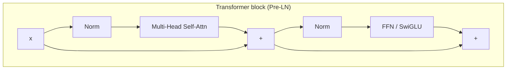
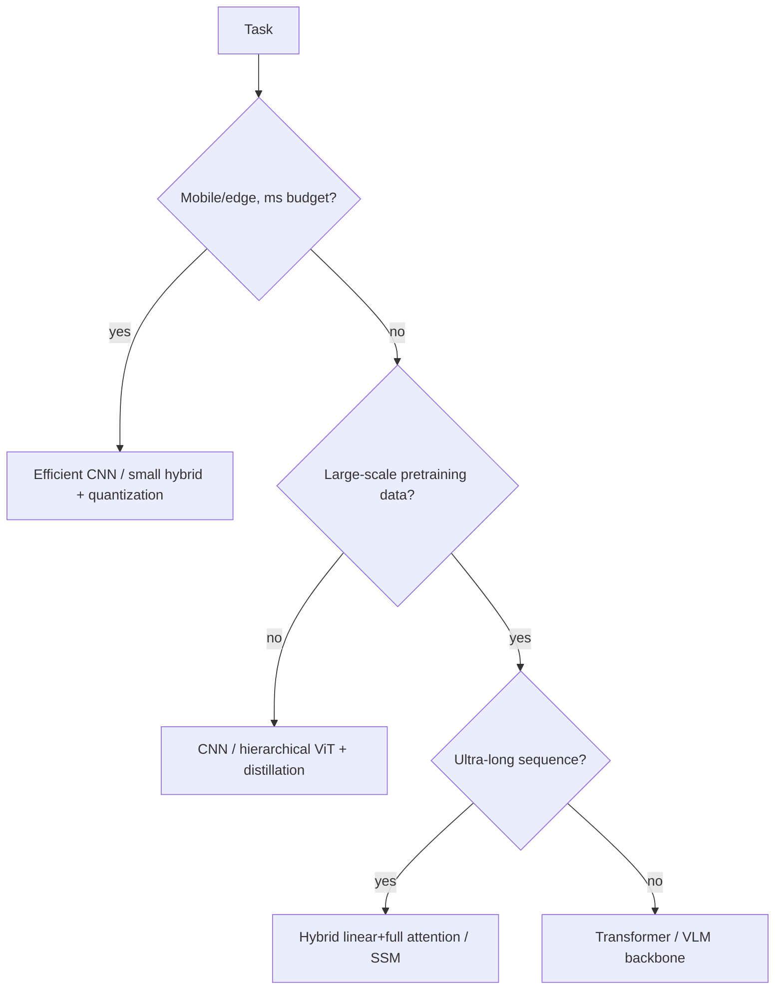

# CNNs, RNNs & Transformers

inductive biasreceptive fieldself-attentionRoPEViThybrid attention

> [!TIP] Say this first
> Architecture questions are rarely "recite the diagram." They test whether you can reason about **inductive bias vs. scale**, complexity, data efficiency, and *when to pick what*. The one-liner that wins the room: *"With enough data and compute, a Transformer replaces hand-built bias with learned bias; when data or latency is tight, a CNN's built-in bias still wins."*

## The mental model: bias ↔ scale

Every backbone is a bet about structure. CNNs hard-code **locality + translation equivariance**; RNNs hard-code **sequential recurrence**; Transformers hard-code **almost nothing** and pay for it with data and $O(n^2)$ attention. The 2026 frontier (below) mixes them deliberately.

<dl class="kv">
<dt>CNN</dt><dd>Strong locality, translation equivariance, parameter sharing. Data-efficient; great for grids and on-device.</dd>
<dt>RNN/LSTM</dt><dd>Sequential state, $O(n)$ memory, streaming-friendly. Hard to parallelize; long-range gradient issues.</dd>
<dt>Transformer</dt><dd>Global token mixing via attention, fully parallel over sequence, weak spatial bias → needs scale + positional encodings.</dd>
</dl>

---

## 1 · Convolutional networks

### Receptive field & dilation

The **receptive field (RF)** is the input region one output unit depends on. Stacking, striding, and dilation grow it. For a 1-D dilated conv with kernel $k$ and dilation $d$, the effective coverage is $\approx d(k-1)+1$:

$$
y_i=\sum_{m} w_m\, x_{i+d\cdot m}
$$

Dilated (atrous) convs (DeepLab/ASPP) enlarge RF **without** losing resolution or adding parameters — but too-aggressive dilation causes *gridding artifacts* (kernel taps sample the input too sparsely). Note the **effective** RF is smaller and more Gaussian than the theoretical one, so "big RF" ≠ "sees everything."

### Depthwise-separable convolution

Split a standard conv into a per-channel spatial conv (**depthwise**) + a $1\times1$ channel mix (**pointwise**). Cost ratio vs. standard $K\times K$ conv is roughly $\tfrac{1}{C_{out}}+\tfrac{1}{K^2}$ — the core trick behind MobileNet-class on-device models (see [Mixed Precision & Efficiency](#/foundations/mixed-precision-efficiency)).

### Residual connections — why depth became trainable

ResNet's $y=x+F(x)$ adds an **identity path** so gradients flow directly and each block only learns a *residual correction*. This fixed the **degradation** problem (deeper plain nets underperforming shallower ones) and is now universal — the Transformer's residual stream is the same idea.

> [!NOTE] Activation functions live here
> Nonlinearity choice interacts with depth and normalization. Play with saturation and dead-ReLU behavior below.

What does dilation buy you over stride/pooling for growing the receptive field?

**Short:** dilation enlarges RF while *keeping* spatial resolution; stride/pooling enlarge RF by *throwing resolution away*.

**Deep:** For dense prediction (segmentation, matting) you need per-pixel outputs, so downsampling hurts boundary quality. Dilated convs (ASPP with multiple rates) capture multi-scale context at full resolution. The cost: gridding artifacts and irregular memory access. Stride/pooling are cheaper and add useful invariance for classification, but discard the fine detail dense tasks need. **Follow-ups:** *Deformable conv?* — learns sampling offsets, adapting RF to object shape. *Why is effective RF smaller than theoretical?* — center taps dominate; contributions decay outward.

---

## 2 · RNNs, LSTMs, and why attention displaced them

A vanilla RNN, $h_t=\tanh(W_h h_{t-1}+W_x x_t+b)$, propagates gradient through repeated multiplication by $W_h$. Spectral radius $<1$ → **vanishing**; $>1$ → **exploding**. LSTMs add a gated **cell state** with an additive path:

$$
\begin{aligned}
f_t&=\sigma(W_f[h_{t-1},x_t]) & i_t&=\sigma(W_i[h_{t-1},x_t])\\
\tilde c_t&=\tanh(W_c[h_{t-1},x_t]) & c_t&=f_t\odot c_{t-1}+i_t\odot\tilde c_t\\
o_t&=\sigma(W_o[h_{t-1},x_t]) & h_t&=o_t\odot\tanh(c_t)
\end{aligned}
$$

When $f_t\approx1$ the cell behaves like a residual highway, preserving gradient. GRUs merge gates for fewer parameters. **Why the field moved to attention:** (1) recurrence is inherently *sequential* → poor GPU utilization; Transformers process the whole sequence in parallel. (2) LSTMs still struggle with very long range and information bottleneck through a fixed-size state. (3) Attention gives every token direct access to every other token in one hop. RNN/SSM ideas survive where **streaming, low latency, or $O(n)$ memory** matter — which motivates the 2026 hybrids below.

---

## 3 · The Transformer

### Block structure

*(Original paper is Post-LN; modern LLMs are Pre-LN — see [Normalization & Stability](#/foundations/normalization-stability).)*

### Scaled dot-product attention

$$
\mathrm{Attention}(Q,K,V)=\mathrm{softmax}\!\Big(\frac{QK^\top}{\sqrt{d_k}}\Big)V
$$

The $\sqrt{d_k}$ divisor keeps logits from growing with dimension (which would saturate softmax and kill gradients). **Multi-head attention** runs $h$ independent projections in parallel and concatenates, letting different heads capture different relations. Complexity is $O(n^2 d)$ time and memory in sequence length $n$ — the central scaling pain point.

### FFN and modern recipe

$$
\mathrm{FFN}(x)=\phi(xW_1+b_1)W_2+b_2
$$

Frontier LLM decoders converge on a near-standard recipe: **RMSNorm + Pre-LN + RoPE + SwiGLU + GQA**, often with QK-Norm for logit stability. Variants split by attention scope: **encoder-only** (BERT — bidirectional, understanding), **decoder-only** (GPT/LLaMA — causal, generation), **encoder–decoder** (T5 — cross-attention over encoder memory). See [LLM Fundamentals](#/llm/fundamentals).

### Positional encodings

Self-attention is **permutation-equivariant**, so position must be injected.

| Scheme | Idea | Extrapolation |
| --- | --- | --- |
| Sinusoidal (abs) | fixed $\sin/\cos$ of position | limited |
| Learned absolute | trainable per-position vector (ViT) | poor beyond trained length |
| **RoPE** | rotate Q/K by position-dependent angle → dot product encodes *relative* offset | good, and extendable (NTK/YaRN scaling) |
| **ALiBi** | add a linear distance penalty to attention logits (no embeddings) | strong length extrapolation |

RoPE is the LLaMA-era default; ALiBi trades a little modeling power for clean long-context extrapolation. Sinusoidal absolute:

$$
PE_{(pos,2i)}=\sin(pos/10000^{2i/d}),\quad PE_{(pos,2i+1)}=\cos(pos/10000^{2i/d})
$$

Why divide attention logits by √d_k, and why does multi-head beat one big head?

**Short:** the divisor controls logit variance so softmax stays in a well-conditioned regime; multiple heads let the model attend to several relations *simultaneously* in different subspaces.

**Deep:** if $q,k$ have unit-variance entries, $q\cdot k$ has variance $\approx d_k$; without scaling, large-$d_k$ logits push softmax toward one-hot, shrinking gradients. One head of size $d$ can only form one attention distribution per query; $h$ heads of size $d/h$ form $h$ distributions at the *same* parameter/FLOP budget — e.g., one head tracks syntax, another coreference. **Follow-ups:** *GQA/MQA?* — share K/V across query heads to shrink the KV cache at inference (see [Efficiency](#/foundations/mixed-precision-efficiency)). *Can attention maps be used as explanations?* — cautiously; attention weight ≠ causal importance.

RoPE vs ALiBi — when would you choose each, and how do you extend context?

**Short:** RoPE encodes relative position by rotating Q/K and is the general-purpose default; ALiBi biases logits by distance and extrapolates to unseen lengths almost for free.

**Deep:** RoPE keeps full expressivity and, with **NTK-aware / YaRN** scaling of its base frequency, extends a model trained at 4K to far longer contexts *post hoc* — the standard recipe behind 128K–1M-token models. ALiBi needs no positional embeddings and generalizes to longer sequences naturally, but the fixed linear bias is a weaker prior. In practice most 2025–2026 LLMs ship RoPE + a scaling scheme. **Follow-up:** *Why do CNNs need no explicit PE?* — local kernels + weight sharing bake in translation structure and relative position implicitly.

---

## 4 · Vision Transformers (ViT)

ViT tokenizes an image into $P\times P$ patches → linear embeddings → `[CLS]` + position → Transformer encoder → head. It trades locality bias for scale.

| | CNN | ViT |
| --- | --- | --- |
| Locality bias | strong | weak early |
| Translation equivariance | strong | weak (learned) |
| Global context | needs depth | layer 1 |
| Small-data regime | strong | weak (needs pretraining/distillation) |
| Resolution flexibility | natural | patch/memory-bound |

Hierarchical successors add back useful bias: **Swin** (shifted-window local attention), **ConvNeXt** (a modernized pure CNN matching ViTs), **CoAtNet/hybrid stems** (conv early, attention late). For CV foundation work the live choice is **pure ViT vs. hybrid** under a **resolution × latency × pretraining-data** budget — exactly the trade-off in high-res segmentation/matting and SAM-style heavy-encoder + light-decoder designs.

ViT underperforms a ResNet on your small dataset. What's happening and what do you do?

**Short:** ViT lacks CNN's built-in locality/translation bias, so with little data it overfits or fails to learn spatial structure. Fixes: pretrain/distill, add convolutional bias, or use a hierarchical variant.

**Deep:** concretely — (1) initialize from a large pretrained ViT (ImageNet-21k/LAION) instead of training from scratch; (2) use **DeiT-style distillation** from a CNN teacher; (3) add a **convolutional stem** or use **Swin/hybrid** to reintroduce locality; (4) strong augmentation/regularization. The deeper point: ViT's advantage is *asymptotic* in data — below the crossover point the CNN's inductive bias is genuinely better, and saying so signals maturity. **Follow-up:** *Patch size effect?* — smaller patches → more tokens → higher accuracy but quadratic cost.

---

## 5 · 2026 direction — hybrid linear/full attention 2026

Pure Transformers pay $O(n^2)$; pure state-space models (SSMs) are $O(n)$ but weaker at precise recall. The 2026 consensus is **neither pure Transformer nor pure Mamba — mix them.**

<dl class="kv">
<dt>Mamba / Mamba-2</dt><dd>Selective state-space models; linear-time sequence mixing. Mamba-2's <b>SSD</b> framework formally links SSMs and attention. verifiable</dd>
<dt>Nemotron-H</dt><dd>NVIDIA hybrid: most self-attention layers replaced by Mamba-2, a few kept full; reported up to ~3× throughput at long context. verifiable</dd>
<dt>Qwen3-Next</dt><dd>~3:1 hybrid — Gated DeltaNet (linear attention) + periodic full attention, ultra-sparse MoE, multi-token prediction.</dd>
<dt>MiniMax-01</dt><dd>"Lightning attention" at ~7:1 linear:full ratio for ultra-long context.</dd>
</dl>

**Why keep *any* full attention?** Linear/SSM layers compress history into a fixed state and lose exact long-range *recall* (copying, retrieval, in-context lookup). Interleaving a minority of full-attention layers restores precise token-to-token access while the linear majority carries the $O(n)$ throughput win. This is *(defensible)* the same bias-vs-scale trade one layer up: buy cheap sequence mixing everywhere, spend expensive global attention only where recall demands it. See [LLM Fundamentals](#/llm/fundamentals) and [Efficiency](#/foundations/mixed-precision-efficiency).

Why are labs shipping 3:1 / 7:1 hybrid layouts instead of pure Mamba?

**Short:** linear-attention/SSM layers are $O(n)$ and fast but lose exact long-range recall; a minority of full-attention layers restores it, giving near-Transformer quality at a fraction of the attention cost.

**Deep:** SSMs summarize the past into a bounded state, which is great for locality and throughput but bad at "find the token 40K positions back and copy it." Empirically a small fraction of full-attention layers recovers retrieval/in-context abilities while the linear majority dominates FLOPs — hence 3:1 (Qwen3-Next) to 7:1 (MiniMax) ratios. It's an explicit efficiency-vs-capability knob. **Follow-up:** *How does this interact with the KV cache?* — only the full-attention layers hold a growing KV cache; linear layers keep a fixed-size state, which is a large long-context memory saving.

---

## Choosing an architecture (decision guide)

## Cheat-sheet

| Ask | One-liner |
| --- | --- |
| Receptive field | Region an output depends on; grow via stack/stride/dilation; effective RF < theoretical. |
| Depthwise-separable | Depthwise + pointwise; ~$1/C_{out}+1/K^2$ of a standard conv's cost. |
| Residual | $y=x+F(x)$ — identity gradient path fixed the degradation problem; universal. |
| LSTM gate | Additive cell state with $f\!\approx\!1$ acts as a gradient highway. |
| Why attention won | Parallel over sequence, one-hop global access; RNNs are sequential + bottlenecked. |
| Attention | $\mathrm{softmax}(QK^\top/\sqrt{d_k})V$; $O(n^2)$; MHA = parallel relations. |
| RoPE vs ALiBi | RoPE rotates Q/K (relative, YaRN-extendable); ALiBi = distance-bias, free extrapolation. |
| ViT vs CNN | ViT wins at scale; CNN's locality bias wins in small-data/low-latency regimes. |
| 2026 hybrid | 3:1–7:1 linear+full attention (Nemotron-H, Qwen3-Next, MiniMax) — recall + throughput. |

**Related:** [Normalization & Stability](#/foundations/normalization-stability) · [Distributed Training](#/foundations/distributed-training) · [Mixed Precision & Efficiency](#/foundations/mixed-precision-efficiency) · [LLM Fundamentals](#/llm/fundamentals) · [Optimization](#/foundations/optimization)
