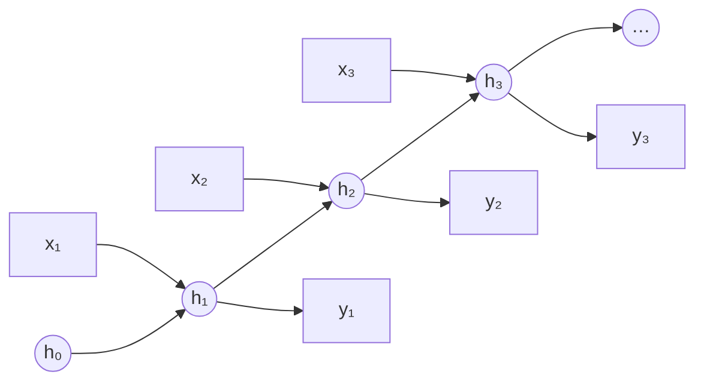
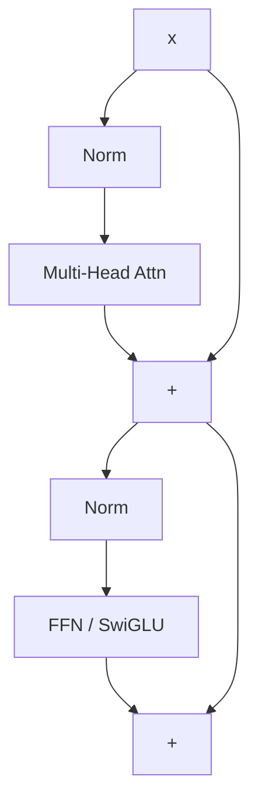
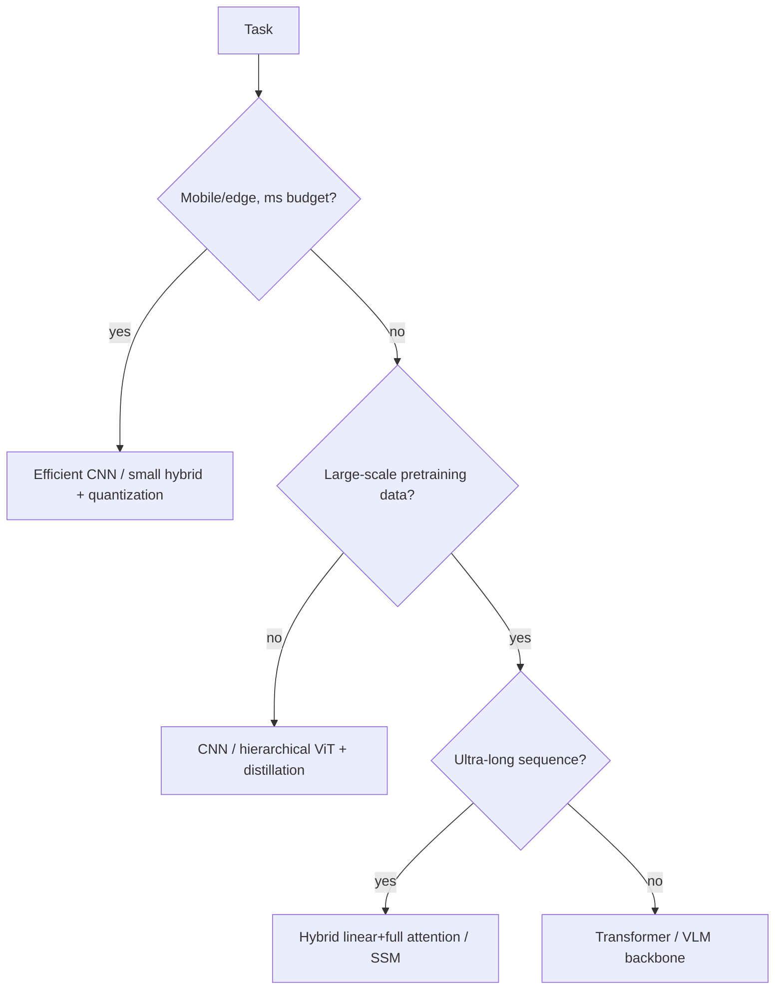

# CNNs, RNNs & Transformers

inductive biasreceptive fieldself-attentionRoPEViThybrid attention

> [!TIP] Say this first
> Architecture questions are rarely "recite the diagram." They test whether you can reason about **inductive bias vs. scale**, complexity, data efficiency, and *when to pick what*. The one-liner that wins the room: *"With enough data and compute, a Transformer replaces hand-built bias with learned bias; when data or latency is tight, a CNN's built-in bias still wins."*

> [!NOTE] See these move
> Much of this clicks faster animated. Companions: [convolution GIFs](https://github.com/vdumoulin/conv_arithmetic) · [CNN Explainer](https://poloclub.github.io/cnn-explainer/) · [The Illustrated Transformer](https://jalammar.github.io/illustrated-transformer/) · [Transformer Explainer (live)](https://poloclub.github.io/transformer-explainer/) · [Understanding LSTMs](https://colah.github.io/posts/2015-08-Understanding-LSTMs/) · [A Visual Guide to Mamba](https://newsletter.maartengrootendorst.com/p/a-visual-guide-to-mamba-and-state). Full curated list → [Visual explainers](#/resources/open-source).

## The mental model: bias ↔ scale

Every backbone is a bet about structure. CNNs hard-code **locality + translation equivariance**; RNNs hard-code **sequential recurrence**; Transformers hard-code **almost nothing** and pay for it with data and $O(n^2)$ attention. The 2026 frontier (below) mixes them deliberately.

<dl class="kv">
<dt>CNN</dt><dd>Strong locality, translation equivariance, parameter sharing. Data-efficient; great for grids and on-device.</dd>
<dt>RNN/LSTM</dt><dd>Sequential state, $O(n)$ memory, streaming-friendly. Hard to parallelize; long-range gradient issues.</dd>
<dt>Transformer</dt><dd>Global token mixing via attention, fully parallel over sequence, weak spatial bias → needs scale + positional encodings.</dd>
</dl>

---

## 1 · Convolutional networks

### Receptive field & dilation

The **receptive field (RF)** is the input region one output unit depends on. Stacking, striding, and dilation grow it. For a 1-D dilated conv with kernel $k$ and dilation $d$, the effective coverage is $\approx d(k-1)+1$:

$$
y_i=\sum_{m} w_m\, x_{i+d\cdot m}
$$

Dilated (atrous) convs (DeepLab/ASPP) enlarge RF **without** losing resolution or adding parameters — but too-aggressive dilation causes *gridding artifacts* (kernel taps sample the input too sparsely). Note the **effective** RF is smaller and more Gaussian than the theoretical one, so "big RF" ≠ "sees everything."

### Depthwise-separable convolution — where the savings come from

Split a standard $K\times K$ conv into two cheaper steps:
1. **Depthwise**: one $K\times K$ filter *per input channel* — mixes **space**, not channels.
2. **Pointwise**: a $1\times1$ conv mixing channels $C_{in}\to C_{out}$ — mixes **channels**, not space.

Count the multiply–adds for an $H\times W$ output:

$$
\underbrace{H W\, C_{in} C_{out} K^2}_{\text{standard}}
\;\longrightarrow\;
\underbrace{H W\, C_{in} K^2}_{\text{depthwise}}+\underbrace{H W\, C_{in} C_{out}}_{\text{pointwise}}
= H W\, C_{in}\,(K^2+C_{out})
$$

so the cost (and parameter) ratio is

$$
\frac{C_{in}(K^2+C_{out})}{C_{in} C_{out} K^2}=\frac{1}{C_{out}}+\frac{1}{K^2}.
$$

**Why it's cheaper (intuition):** a standard conv mixes space *and* channels **simultaneously**, costing $C_{in}C_{out}K^2$ per pixel. Depthwise-separable **factorizes** that into "mix space, then mix channels," and $K^2+C_{out}$ is far smaller than $K^2 C_{out}$. For $K=3$ and large $C_{out}$ the ratio $\to \tfrac19$ — roughly **8–9× fewer FLOPs and params**. Core trick behind MobileNet/EfficientNet on-device models. **Caveat:** slightly less expressive per layer, and depthwise/pointwise ops are often **memory-bandwidth-bound** on real hardware (low FLOPs ≠ automatically fast) — see [Mixed Precision & Efficiency](#/foundations/mixed-precision-efficiency).

### Residual connections — the gradient view of why vanishing stops

ResNet's $y=x+F(x)$ adds an **identity path**. The payoff shows up in the **backward pass**. For one block,

$$
\frac{\partial \mathcal L}{\partial x}=\frac{\partial \mathcal L}{\partial y}\Big(I+\frac{\partial F}{\partial x}\Big)
$$

— the gradient reaching the input is the upstream gradient times $\big(I+\partial F/\partial x\big)$. That $I$ is a term that is **not** multiplied by the block's Jacobian. Now stack $L$ blocks:

- **Plain net:** $\dfrac{\partial \mathcal L}{\partial x_0}=\dfrac{\partial \mathcal L}{\partial x_L}\prod_{\ell=1}^{L}\dfrac{\partial F_\ell}{\partial x_{\ell-1}}$ — a product of $L$ Jacobians. If their singular values sit below 1 the product **shrinks geometrically → vanishing gradient**; above 1 → exploding.
- **Residual net:** $\dfrac{\partial \mathcal L}{\partial x_0}=\dfrac{\partial \mathcal L}{\partial x_L}\prod_{\ell=1}^{L}\Big(I+\dfrac{\partial F_\ell}{\partial x_{\ell-1}}\Big)$ — expanding the product always yields the **identity term $I$** (a clean "1" path) plus higher-order corrections.

So there is always a **direct, undiluted highway** carrying gradient from the loss back to any early layer, regardless of depth. This fixed the **degradation** problem (deep plain nets doing *worse* than shallow ones) and is now universal — the Transformer's **residual stream** is the same mechanism (and why Pre-LN, which keeps that path clean, trains more stably — see [Normalization & Stability](#/foundations/normalization-stability)).

> [!NOTE] Activation functions live here
> Nonlinearity choice interacts with depth and normalization. Play with saturation and dead-ReLU behavior below.

Formulas for the curves above (toggle them in the widget):

| Activation | Formula | Notes |
| --- | --- | --- |
| ReLU | $\max(0,x)$ | cheap, sparse; can "die" (stuck at 0 forever) |
| LeakyReLU | $\max(\alpha x, x),\ \alpha\approx0.01$ | small negative slope fixes dead ReLU |
| Sigmoid | $\sigma(x)=\dfrac{1}{1+e^{-x}}$ | output in $(0,1)$; saturates → vanishing grad |
| Tanh | $\dfrac{e^{x}-e^{-x}}{e^{x}+e^{-x}}$ | zero-centered sigmoid; still saturates |
| GELU | $x\,\Phi(x)$, $\Phi=$ normal CDF | smooth; Transformer default |
| SiLU / Swish | $x\,\sigma(x)$ | smooth, self-gated; GELU-like |
| Softmax | $\dfrac{e^{x_i}}{\sum_j e^{x_j}}$ | vector → probability simplex (output layer) |

Modern default: **GELU/SiLU** in Transformers (smooth, non-monotonic near 0), **ReLU** where speed matters. Saturating units (sigmoid/tanh) are avoided in deep *hidden* layers because their flat tails zero out the gradient; sigmoid/softmax stay at the **output** to produce probabilities.

What does dilation buy you over stride/pooling for growing the receptive field?

**Short:** dilation enlarges RF while *keeping* spatial resolution; stride/pooling enlarge RF by *throwing resolution away*.

**Deep:** For dense prediction (segmentation, matting) you need per-pixel outputs, so downsampling hurts boundary quality. Dilated convs (ASPP with multiple rates) capture multi-scale context at full resolution. The cost: gridding artifacts and irregular memory access. Stride/pooling are cheaper and add useful invariance for classification, but discard the fine detail dense tasks need. **Follow-ups:** *Deformable conv?* — learns sampling offsets, adapting RF to object shape. *Why is effective RF smaller than theoretical?* — center taps dominate; contributions decay outward.

---

## 2 · RNNs, LSTMs, GRUs — and why attention displaced them

### Vanilla RNN
Carries a single hidden state forward, one step at a time:

$$h_t=\tanh(W_h h_{t-1}+W_x x_t+b),\qquad y_t=W_y h_t$$

Backprop-through-time multiplies by $W_h$ at *every* step, so gradient scales like $\lVert W_h\rVert^{t}$: spectral radius below 1 → **vanishing**, above 1 → **exploding**. Usable memory is only ~tens of steps.

### LSTM — a gated cell-state highway
Adds a gated **cell state** with an additive path:

$$
\begin{aligned}
f_t&=\sigma(W_f[h_{t-1},x_t]) & i_t&=\sigma(W_i[h_{t-1},x_t])\\
\tilde c_t&=\tanh(W_c[h_{t-1},x_t]) & c_t&=f_t\odot c_{t-1}+i_t\odot\tilde c_t\\
o_t&=\sigma(W_o[h_{t-1},x_t]) & h_t&=o_t\odot\tanh(c_t)
\end{aligned}
$$

The key is the **additive** update $c_t=f_t\odot c_{t-1}+i_t\odot\tilde c_t$: when the forget gate $f_t\approx1$, the cell (and its gradient) flows forward nearly unchanged — a **residual highway through time**, the same trick as ResNet above.

<figure>
<svg viewBox="0 0 500 168" font-family="Inter, sans-serif" font-size="12">
  <line x1="34" y1="52" x2="466" y2="52" stroke="#e0533f" stroke-width="2.6"/>
  <text x="30" y="42" fill="#f4917f">cₜ₋₁</text><text x="452" y="42" fill="#f4917f">cₜ</text>
  <circle cx="165" cy="52" r="15" fill="none" stroke="#6366f1" stroke-width="1.8"/><text x="165" y="57" text-anchor="middle" fill="#a5b4fc">×</text>
  <text x="165" y="26" text-anchor="middle" fill="#98a3b2">forget fₜ</text>
  <circle cx="300" cy="52" r="15" fill="none" stroke="#12a150" stroke-width="1.8"/><text x="300" y="58" text-anchor="middle" fill="#34d399">+</text>
  <text x="300" y="26" text-anchor="middle" fill="#98a3b2">input iₜ⊙c̃ₜ</text>
  <line x1="385" y1="52" x2="385" y2="108" stroke="#98a3b2"/>
  <rect x="348" y="108" width="74" height="26" rx="5" fill="none" stroke="#0ea5e9"/><text x="385" y="125" text-anchor="middle" fill="#7dd3fc">tanh · oₜ</text>
  <text x="385" y="156" text-anchor="middle" fill="#f2f6fb">hₜ (output)</text>
  <text x="232" y="86" text-anchor="middle" fill="#6b7686">cell state passes through mostly-additively → gradient preserved</text>
</svg>
<figcaption>The top <b>cell state</b> only meets a multiply (forget) and an add (input); with <code>fₜ≈1</code> it is a residual highway along the time axis.</figcaption>
</figure>

### GRU — a lighter gate set
$$
\begin{aligned}
z_t&=\sigma(W_z[h_{t-1},x_t]) & r_t&=\sigma(W_r[h_{t-1},x_t])\\
\tilde h_t&=\tanh\!\big(W_h[\,r_t\odot h_{t-1},\,x_t]\big) & h_t&=(1-z_t)\odot h_{t-1}+z_t\odot\tilde h_t
\end{aligned}
$$

GRU merges the cell and hidden state and uses **2 gates** (update $z$, reset $r$) instead of LSTM's 3 → ~25% fewer parameters, often comparable accuracy, slightly faster.

### Pros / cons
| | Vanilla RNN | LSTM | GRU |
| --- | --- | --- | --- |
| Gates | 0 | 3 (forget/input/output) | 2 (update/reset) |
| Long-range memory | poor | strong | strong |
| Params / speed | fewest / — | most / slowest | middle / faster |
| Use when | almost never | long dependencies, more capacity | similar, less data/compute |

### Why the field moved to attention
1. Recurrence is inherently **sequential** → poor GPU utilization; Transformers run the whole sequence **in parallel**.
2. A **fixed-size state** bottlenecks long context; even LSTMs fade over very long range.
3. Attention gives every token **direct, one-hop access** to every other token.

RNN/SSM ideas survive where **streaming, low latency, or $O(n)$ memory** matter — motivating the 2026 hybrids and **Mamba** (§5) below.

---

## 3 · The Transformer

### Architecture (recreating the original paper's figure)

The encoder–decoder stack from *Attention Is All You Need* — inputs enter bottom-left, output probabilities exit top-right; the **encoder's output feeds the decoder's cross-attention as K, V**.

<figure>
<svg viewBox="0 0 540 520" font-family="Inter, sans-serif" font-size="10.5">
  <defs><marker id="ah" markerWidth="8" markerHeight="8" refX="6" refY="3" orient="auto"><path d="M0 0 L6 3 L0 6" fill="#98a3b2"/></marker></defs>
  <!-- helper styles inline -->
  <!-- ENCODER outer -->
  <rect x="70" y="150" width="170" height="185" rx="8" fill="none" stroke="#3a4657" stroke-dasharray="4 3"/>
  <text x="60" y="245" fill="#98a3b2" transform="rotate(-90 60,245)">N×</text>
  <!-- encoder inner boxes (top→bottom) -->
  <rect x="88" y="163" width="134" height="20" rx="4" fill="rgba(217,119,6,.14)" stroke="#d97706"/><text x="155" y="177" text-anchor="middle" fill="#fbbf24">Add &amp; Norm</text>
  <rect x="88" y="190" width="134" height="26" rx="4" fill="rgba(18,161,80,.16)" stroke="#12a150"/><text x="155" y="207" text-anchor="middle" fill="#34d399">Feed Forward</text>
  <rect x="88" y="224" width="134" height="20" rx="4" fill="rgba(217,119,6,.14)" stroke="#d97706"/><text x="155" y="238" text-anchor="middle" fill="#fbbf24">Add &amp; Norm</text>
  <rect x="88" y="251" width="134" height="26" rx="4" fill="rgba(99,102,241,.18)" stroke="#6366f1"/><text x="155" y="268" text-anchor="middle" fill="#a5b4fc">Multi-Head Attention</text>
  <!-- DECODER outer -->
  <rect x="300" y="90" width="170" height="245" rx="8" fill="none" stroke="#3a4657" stroke-dasharray="4 3"/>
  <text x="484" y="215" fill="#98a3b2" transform="rotate(-90 484,215)">N×</text>
  <rect x="318" y="103" width="134" height="20" rx="4" fill="rgba(217,119,6,.14)" stroke="#d97706"/><text x="385" y="117" text-anchor="middle" fill="#fbbf24">Add &amp; Norm</text>
  <rect x="318" y="130" width="134" height="26" rx="4" fill="rgba(18,161,80,.16)" stroke="#12a150"/><text x="385" y="147" text-anchor="middle" fill="#34d399">Feed Forward</text>
  <rect x="318" y="164" width="134" height="20" rx="4" fill="rgba(217,119,6,.14)" stroke="#d97706"/><text x="385" y="178" text-anchor="middle" fill="#fbbf24">Add &amp; Norm</text>
  <rect x="318" y="191" width="134" height="26" rx="4" fill="rgba(99,102,241,.18)" stroke="#6366f1"/><text x="385" y="208" text-anchor="middle" fill="#a5b4fc">Multi-Head Attention</text>
  <rect x="318" y="225" width="134" height="20" rx="4" fill="rgba(217,119,6,.14)" stroke="#d97706"/><text x="385" y="239" text-anchor="middle" fill="#fbbf24">Add &amp; Norm</text>
  <rect x="318" y="252" width="134" height="26" rx="4" fill="rgba(99,102,241,.18)" stroke="#6366f1"/><text x="385" y="269" text-anchor="middle" fill="#a5b4fc">Masked Multi-Head Attn</text>
  <!-- embeddings + PE -->
  <rect x="88" y="360" width="134" height="24" rx="4" fill="none" stroke="#0ea5e9"/><text x="155" y="376" text-anchor="middle" fill="#7dd3fc">Input Embedding</text>
  <rect x="318" y="360" width="134" height="24" rx="4" fill="none" stroke="#0ea5e9"/><text x="385" y="376" text-anchor="middle" fill="#7dd3fc">Output Embedding</text>
  <circle cx="155" cy="330" r="10" fill="none" stroke="#e0533f"/><text x="155" y="334" text-anchor="middle" fill="#f4917f">+</text>
  <circle cx="385" cy="330" r="10" fill="none" stroke="#e0533f"/><text x="385" y="334" text-anchor="middle" fill="#f4917f">+</text>
  <text x="250" y="333" text-anchor="middle" fill="#6b7686" font-size="9.5">Positional Encoding</text>
  <!-- bottom labels -->
  <text x="155" y="405" text-anchor="middle" fill="#d6dde6">Inputs</text>
  <text x="385" y="405" text-anchor="middle" fill="#d6dde6">Outputs (shifted right)</text>
  <!-- top: Linear / Softmax / Probs -->
  <rect x="335" y="55" width="100" height="22" rx="4" fill="none" stroke="#e0533f"/><text x="385" y="70" text-anchor="middle" fill="#f4917f">Linear</text>
  <rect x="335" y="26" width="100" height="22" rx="4" fill="none" stroke="#e0533f"/><text x="385" y="41" text-anchor="middle" fill="#f4917f">Softmax</text>
  <text x="385" y="14" text-anchor="middle" fill="#d6dde6">Output Probabilities</text>
  <!-- arrows -->
  <line x1="155" y1="398" x2="155" y2="386" stroke="#98a3b2" marker-end="url(#ah)"/>
  <line x1="155" y1="360" x2="155" y2="342" stroke="#98a3b2" marker-end="url(#ah)"/>
  <line x1="155" y1="320" x2="155" y2="279" stroke="#98a3b2" marker-end="url(#ah)"/>
  <line x1="385" y1="398" x2="385" y2="386" stroke="#98a3b2" marker-end="url(#ah)"/>
  <line x1="385" y1="360" x2="385" y2="342" stroke="#98a3b2" marker-end="url(#ah)"/>
  <line x1="385" y1="320" x2="385" y2="280" stroke="#98a3b2" marker-end="url(#ah)"/>
  <line x1="385" y1="90" x2="385" y2="79" stroke="#98a3b2" marker-end="url(#ah)"/>
  <line x1="385" y1="55" x2="385" y2="50" stroke="#98a3b2" marker-end="url(#ah)"/>
  <!-- encoder output → decoder cross-attention (K,V) -->
  <path d="M240,255 C 270,255 270,205 316,204" fill="none" stroke="#e0533f" stroke-width="1.6" stroke-dasharray="4 3" marker-end="url(#ah)"/>
  <text x="270" y="228" fill="#f4917f" font-size="9.5">K, V</text>
  <line x1="155" y1="150" x2="155" y2="150" stroke="#98a3b2"/>
</svg>
<figcaption>Encoder (left, ×N) and decoder (right, ×N). Each sublayer is wrapped by a residual <b>Add &amp; Norm</b>. The decoder adds a <b>masked</b> self-attention (can't peek ahead) and a <b>cross-attention</b> that reads the encoder output as K, V. Decoder-only LLMs (GPT/LLaMA) keep just the right column without cross-attention.</figcaption>
</figure>

Inside **one** sublayer's residual wrapper (modern **Pre-LN** placement):

*(Original paper puts Norm **after** the residual add (Post-LN); modern LLMs use **Pre-LN** for stability — see [Normalization & Stability](#/foundations/normalization-stability).)*

### Scaled dot-product attention

$$
\mathrm{Attention}(Q,K,V)=\mathrm{softmax}\!\Big(\frac{QK^\top}{\sqrt{d_k}}\Big)V
$$

The $\sqrt{d_k}$ divisor keeps logits from growing with dimension (which would saturate softmax and kill gradients). **Multi-head attention** runs $h$ independent projections in parallel and concatenates, letting different heads capture different relations. Complexity is $O(n^2 d)$ time and memory in sequence length $n$ — the central scaling pain point.

### FFN and modern recipe

$$
\mathrm{FFN}(x)=\phi(xW_1+b_1)W_2+b_2
$$

Frontier LLM decoders converge on a near-standard recipe: **RMSNorm + Pre-LN + RoPE + SwiGLU + GQA**, often with QK-Norm for logit stability. Variants split by attention scope: **encoder-only** (BERT — bidirectional, understanding), **decoder-only** (GPT/LLaMA — causal, generation), **encoder–decoder** (T5 — cross-attention over encoder memory). See [LLM Fundamentals](#/llm/fundamentals).

### Positional encodings

Self-attention is **permutation-equivariant**, so position must be injected.

**Why it matters:** attention is a *set* operation — it mixes tokens by content with **no built-in notion of order**, so without positional info "the cat sat" and "sat cat the" would produce *identical* representations. PE tells each token "where am I," recovering word order, syntax, and distance. The design axis:
- **Absolute PE** — give each position its own vector (sinusoidal or learned), *added* to the token embedding. Simple, but generalizes poorly beyond the trained length.
- **Relative PE** — encode the *offset* $i-j$ between query and key. Matches how language works ("the previous word") and extrapolates far better — why **RoPE/ALiBi** dominate.

| Scheme | Idea | Extrapolation |
| --- | --- | --- |
| Sinusoidal (abs) | fixed $\sin/\cos$ of position | limited |
| Learned absolute | trainable per-position vector (ViT) | poor beyond trained length |
| **RoPE** | rotate Q/K by position-dependent angle → dot product encodes *relative* offset | good, and extendable (NTK/YaRN scaling) |
| **ALiBi** | add a linear distance penalty to attention logits (no embeddings) | strong length extrapolation |

RoPE is the LLaMA-era default; ALiBi trades a little modeling power for clean long-context extrapolation. Sinusoidal absolute:

$$
PE_{(pos,2i)}=\sin(pos/10000^{2i/d}),\quad PE_{(pos,2i+1)}=\cos(pos/10000^{2i/d})
$$

**Intuition for the sinusoids:** each dimension $i$ is a sine/cosine of a different wavelength (geometric, from $2\pi$ up to $\sim\!10000\cdot2\pi$), so a position's vector is a unique multi-frequency **fingerprint** — low frequencies encode coarse position, high frequencies fine position. And because sine/cosine have shift identities, a fixed offset $k$ acts as a **linear (rotation) transform** on the encoding, so attention can read *relative* distance straight from a dot product — the seed of the RoPE idea.

Why divide attention logits by √d_k, and why does multi-head beat one big head?

**Short:** the divisor controls logit variance so softmax stays in a well-conditioned regime; multiple heads let the model attend to several relations *simultaneously* in different subspaces.

**Deep:** if $q,k$ have unit-variance entries, $q\cdot k$ has variance $\approx d_k$; without scaling, large-$d_k$ logits push softmax toward one-hot, shrinking gradients. One head of size $d$ can only form one attention distribution per query; $h$ heads of size $d/h$ form $h$ distributions at the *same* parameter/FLOP budget — e.g., one head tracks syntax, another coreference. **Follow-ups:** *GQA/MQA?* — share K/V across query heads to shrink the KV cache at inference (see [Efficiency](#/foundations/mixed-precision-efficiency)). *Can attention maps be used as explanations?* — cautiously; attention weight ≠ causal importance.

RoPE vs ALiBi — when would you choose each, and how do you extend context?

**Short:** RoPE encodes relative position by rotating Q/K and is the general-purpose default; ALiBi biases logits by distance and extrapolates to unseen lengths almost for free.

**Deep:** RoPE keeps full expressivity and, with **NTK-aware / YaRN** scaling of its base frequency, extends a model trained at 4K to far longer contexts *post hoc* — the standard recipe behind 128K–1M-token models. ALiBi needs no positional embeddings and generalizes to longer sequences naturally, but the fixed linear bias is a weaker prior. In practice most 2025–2026 LLMs ship RoPE + a scaling scheme. **Follow-up:** *Why do CNNs need no explicit PE?* — local kernels + weight sharing bake in translation structure and relative position implicitly.

---

## 4 · Vision Transformers (ViT)

ViT tokenizes an image into $P\times P$ patches → linear embeddings → `[CLS]` + position → Transformer encoder → head. It trades locality bias for scale.

| | CNN | ViT |
| --- | --- | --- |
| Locality bias | strong | weak early |
| Translation equivariance | strong | weak (learned) |
| Global context | needs depth | layer 1 |
| Small-data regime | strong | weak (needs pretraining/distillation) |
| Resolution flexibility | natural | patch/memory-bound |

Hierarchical successors add back useful bias: **Swin** (shifted-window local attention), **ConvNeXt** (a modernized pure CNN matching ViTs), **CoAtNet/hybrid stems** (conv early, attention late). For CV foundation work the live choice is **pure ViT vs. hybrid** under a **resolution × latency × pretraining-data** budget — exactly the trade-off in high-res segmentation/matting and SAM-style heavy-encoder + light-decoder designs.

ViT underperforms a ResNet on your small dataset. What's happening and what do you do?

**Short:** ViT lacks CNN's built-in locality/translation bias, so with little data it overfits or fails to learn spatial structure. Fixes: pretrain/distill, add convolutional bias, or use a hierarchical variant.

**Deep:** concretely — (1) initialize from a large pretrained ViT (ImageNet-21k/LAION) instead of training from scratch; (2) use **DeiT-style distillation** from a CNN teacher; (3) add a **convolutional stem** or use **Swin/hybrid** to reintroduce locality; (4) strong augmentation/regularization. The deeper point: ViT's advantage is *asymptotic* in data — below the crossover point the CNN's inductive bias is genuinely better, and saying so signals maturity. **Follow-up:** *Patch size effect?* — smaller patches → more tokens → higher accuracy but quadratic cost.

---

## 5 · 2026 direction — hybrid linear/full attention 2026

Pure Transformers pay $O(n^2)$; pure state-space models (SSMs) are $O(n)$ but weaker at precise recall. The 2026 consensus is **neither pure Transformer nor pure Mamba — mix them.**

### How a state-space model (Mamba) works

An **SSM** processes a sequence through a small recurrent hidden state $h_t$ — like an RNN, but *linear*:

$$
h_t = A\,h_{t-1} + B\,x_t,\qquad y_t = C\,h_t
$$

- Because a classic SSM is **linear time-invariant** (fixed $A,B,C$), the same computation can be unrolled as a **convolution** → trainable **in parallel** like a CNN, yet runnable as an **$O(1)$-memory recurrence** at inference like an RNN. (S4 added a **HiPPO** initialization of $A$ so the state provably remembers long history.)
- **Mamba's key idea — selectivity.** Make $B$, $C$, and the step size $\Delta$ **input-dependent** (functions of the current token). Now the model can *choose* what to keep or forget per token (content-based gating) — the very thing plain SSMs and linear attention couldn't do. This breaks time-invariance (no more simple convolution), so Mamba uses a **hardware-aware parallel scan** to stay GPU-fast.

**Cost profile:** training $O(n)$ (parallel scan); inference **$O(1)$ memory, $O(n)$ time, no KV cache** (the state is a fixed-size summary) — versus a Transformer's $O(n^2)$ attention and a KV cache that grows with context.

Mamba / SSM — Pros

Linear time, constant inference memory, no KV cache → cheap ultra-long context + streaming; strong on audio, DNA, and long signal sequences.

Cons vs Transformer

Weaker at <b>exact recall</b> / copying / in-context retrieval (history is compressed into a fixed-size state); less mature ecosystem; one-hop content lookups that attention does trivially are hard.

That recall gap is exactly why 2026 models **interleave a minority of full-attention layers** rather than going pure-Mamba:

<dl class="kv">
<dt>Mamba / Mamba-2</dt><dd>Selective state-space models; linear-time sequence mixing. Mamba-2's <b>SSD</b> framework formally links SSMs and attention. verifiable</dd>
<dt>Nemotron-H</dt><dd>NVIDIA hybrid: most self-attention layers replaced by Mamba-2, a few kept full; reported up to ~3× throughput at long context. verifiable</dd>
<dt>Qwen3-Next</dt><dd>~3:1 hybrid — Gated DeltaNet (linear attention) + periodic full attention, ultra-sparse MoE, multi-token prediction.</dd>
<dt>MiniMax-01</dt><dd>"Lightning attention" at ~7:1 linear:full ratio for ultra-long context.</dd>
</dl>

**Why keep *any* full attention?** Linear/SSM layers compress history into a fixed state and lose exact long-range *recall* (copying, retrieval, in-context lookup). Interleaving a minority of full-attention layers restores precise token-to-token access while the linear majority carries the $O(n)$ throughput win. This is *(defensible)* the same bias-vs-scale trade one layer up: buy cheap sequence mixing everywhere, spend expensive global attention only where recall demands it. See [LLM Fundamentals](#/llm/fundamentals) and [Efficiency](#/foundations/mixed-precision-efficiency).

Why are labs shipping 3:1 / 7:1 hybrid layouts instead of pure Mamba?

**Short:** linear-attention/SSM layers are $O(n)$ and fast but lose exact long-range recall; a minority of full-attention layers restores it, giving near-Transformer quality at a fraction of the attention cost.

**Deep:** SSMs summarize the past into a bounded state, which is great for locality and throughput but bad at "find the token 40K positions back and copy it." Empirically a small fraction of full-attention layers recovers retrieval/in-context abilities while the linear majority dominates FLOPs — hence 3:1 (Qwen3-Next) to 7:1 (MiniMax) ratios. It's an explicit efficiency-vs-capability knob. **Follow-up:** *How does this interact with the KV cache?* — only the full-attention layers hold a growing KV cache; linear layers keep a fixed-size state, which is a large long-context memory saving.

---

## Choosing an architecture (decision guide)

## Cheat-sheet

| Ask | One-liner |
| --- | --- |
| Receptive field | Region an output depends on; grow via stack/stride/dilation; effective RF < theoretical. |
| Depthwise-separable | Depthwise + pointwise; ~$1/C_{out}+1/K^2$ of a standard conv's cost. |
| Residual | $y=x+F(x)$ — identity gradient path fixed the degradation problem; universal. |
| LSTM gate | Additive cell state with $f\!\approx\!1$ acts as a gradient highway. |
| Why attention won | Parallel over sequence, one-hop global access; RNNs are sequential + bottlenecked. |
| Attention | $\mathrm{softmax}(QK^\top/\sqrt{d_k})V$; $O(n^2)$; MHA = parallel relations. |
| RoPE vs ALiBi | RoPE rotates Q/K (relative, YaRN-extendable); ALiBi = distance-bias, free extrapolation. |
| ViT vs CNN | ViT wins at scale; CNN's locality bias wins in small-data/low-latency regimes. |
| Positional encoding | Attention is order-blind; inject position. Absolute (sinusoidal/learned) vs relative (RoPE/ALiBi). |
| Mamba / SSM | Linear recurrence $h_t=Ah_{t-1}+Bx_t$; **selective** (input-dep $B,C,\Delta$); $O(1)$ infer memory, no KV cache; weak exact recall. |
| 2026 hybrid | 3:1–7:1 linear+full attention (Nemotron-H, Qwen3-Next, MiniMax) — recall + throughput. |

**Related:** [Normalization & Stability](#/foundations/normalization-stability) · [Distributed Training](#/foundations/distributed-training) · [Mixed Precision & Efficiency](#/foundations/mixed-precision-efficiency) · [LLM Fundamentals](#/llm/fundamentals) · [Optimization](#/foundations/optimization)
