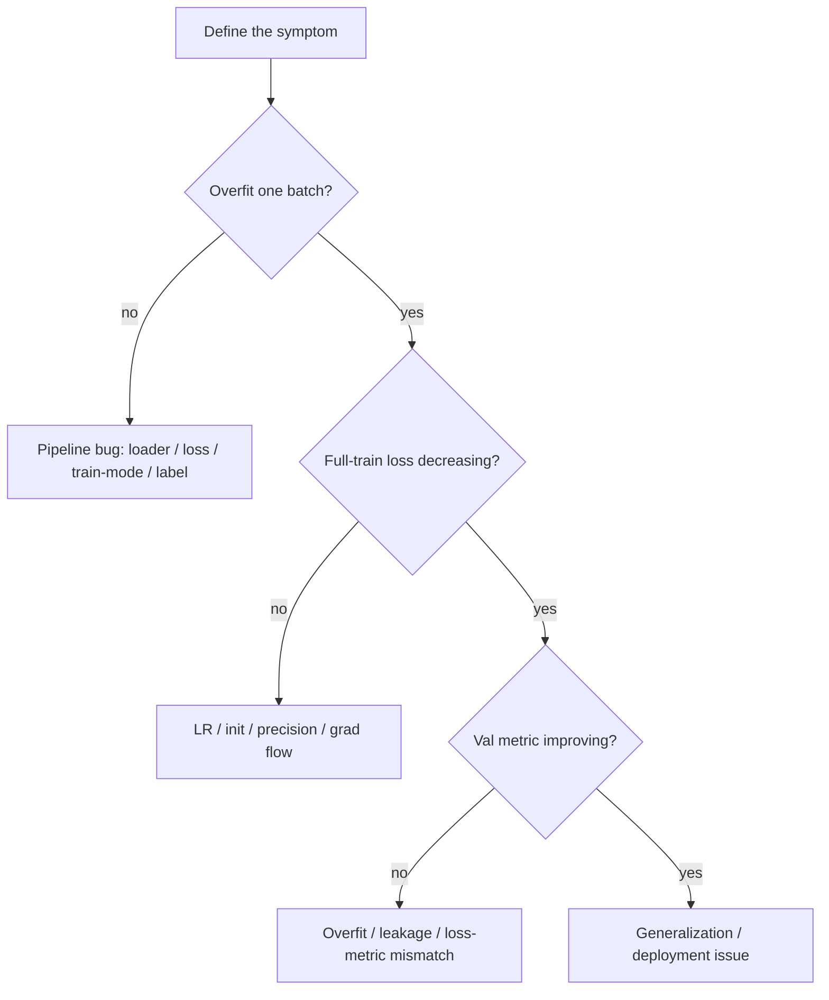

# Debugging & Experimentation

<div class="tag-row"><span class="tag">overfit one batch</span><span class="tag">LR range test</span><span class="tag">reproducibility</span><span class="tag">ablation discipline</span><span class="tag">experiment tracking</span></div>

> [!TIP] 이것부터 말하세요
> 이것은 ML 면접에서 가장 *operational*한 축이고, 실제로 배포해 본 사람과 읽기만 한 사람을 가릅니다. 그들이 원하는 신호: 당신이 (hyperparameter를 찍는 게 아니라) 실패를 체계적으로 국소화하고, **한 번에 하나씩** 바꾸며, 재현 가능한 흔적을 남긴다는 것. 최고의 한 줄: *"먼저 하나의 batch를 overfit할 수 있는지 확인합니다 — 못 하면 그건 모델이 아니라 파이프라인 버그입니다."*

## The debugging playbook



**먼저 하나의 batch를 overfit하라**(Karpathy의 레시피): ~8개 샘플을 잡고 loss를 ~0으로 몰아붙입니다. *못 하면* 모델은 멀쩡하고 — 버그는 파이프라인에 있습니다. 무엇보다 먼저 할 빠른 체크:

1. `model.train()` / `eval()`이 올바르게 토글됐는지(BN/dropout).
2. Loss가 유한한지. `NaN`/`inf` 없음.
3. Label range와 `ignore_index`가 올바른지.
4. Trainable-parameter 수 > 0. LR ≠ 0.
5. Input normalization(mean/std)이 checkpoint와 일치.
6. 한 batch 시각화 — image/mask/label 정렬.

<details class="qa"><summary>Training loss가 안 내려갑니다. 처음 10분을 설명해 보세요.</summary>
<div class="qa-body">

**짧게:** 하나의 작은 batch를 overfit해 봅니다. 실패하면 파이프라인 버그(잘못된 loss reduction, frozen param, `eval()` 켜둠, label/target mismatch, LR=0). 성공하면 모델은 학습할 수 있고 문제는 scale/optimization입니다.

**깊게:** 순서화된 probe — (1) `requires_grad` param이 존재하고 `backward()` 후 grad가 non-zero인지 확인, (2) 같은 batch에서 loss를 반복 출력 — 0을 향해 떨어져야 함, (3) init 시 loss 값 sanity check(예: 균형 CE에 대해 $\ln(\text{num\_classes})$), (4) LR이 non-zero이고 optimizer가 step했는지 검증, (5) input+target을 시각화해 label을 손상시킨 transform 포착. "overfit one batch"가 통과한 뒤에만 LR schedule, capacity, regularization을 건드립니다. **후속 질문:** *overfit은 되는데 일반화가 안 되면?* — regularization/data 문제. [Regularization & Generalization](#/foundations/regularization-generalization) 참고.
</div></details>

## LR range test

Schedule을 확정하기 전에 **LR range test**를 돌립니다: 수백 step에 걸쳐 LR을 지수적으로 올리고 loss vs. LR을 plot합니다.

<figure>
<svg viewBox="0 0 520 200" xmlns="http://www.w3.org/2000/svg" font-family="Inter, sans-serif" font-size="12">
  <line x1="50" y1="20" x2="50" y2="160" stroke="#98a3b2"/><line x1="50" y1="160" x2="490" y2="160" stroke="#98a3b2"/>
  <text x="30" y="90" fill="#6b7686" transform="rotate(-90 30 90)">loss</text>
  <text x="260" y="185" fill="#6b7686" text-anchor="middle">learning rate (log scale) →</text>
  <path d="M60 60 C 150 62, 200 70, 250 95 C 300 120, 330 135, 360 130 C 400 120, 430 60, 470 25" fill="none" stroke="#e0533f" stroke-width="2.5"/>
  <line x1="300" y1="20" x2="300" y2="160" stroke="#12a150" stroke-dasharray="4 3"/>
  <text x="300" y="16" fill="#12a150" text-anchor="middle">steepest descent → pick here</text>
  <text x="440" y="18" fill="#e0533f" text-anchor="middle">diverges</text>
</svg>
<figcaption>LR range test: 좋은 LR은 대략 loss가 가장 가파르게 하강하는 지점으로, loss가 폭발하는 지점보다 한 자릿수 아래입니다. 찍는 것보다 싸고 신뢰할 만합니다.</figcaption>
</figure>

이것을 grad-norm 및 weight-norm 로깅과 짝지어, NaN이 나기 전에 불안정이 쌓이는 것을 *눈으로* 볼 수 있게 하세요(메커니즘은 [Normalization & Stability](#/foundations/normalization-stability)에).

## "Loss는 내려가는데 metric이 안 움직인다"

전형적인 경우이고, 진단은 decision table입니다:

| 관찰 | 가설 | 조치 |
| --- | --- | --- |
| train metric ↑, val metric flat | overfitting | augmentation, weight decay, 더 많은 데이터 |
| train metric도 flat | loss ≠ target metric | metric-aware loss, error analysis |
| val loss ↓ but val metric flat | threshold/decoding 문제 | NMS / threshold / post-proc 튜닝 |
| 둘 다 좋은데 deploy는 나쁨 | domain shift | target-distribution 데이터, recalibrate |
| random보다 나쁨 | eval 버그 | prediction 덤프, metric unit-test |

CV 예시: cross-entropy는 떨어지는데 **mIoU**가 그대로 → 모델이 그냥 background를 예측. KD loss는 떨어지는데 student task metric은 떨어짐 → student가 teacher의 *오류*를 복사 중. 이것을 잡는 습관: training loss만이 아니라 **중간 품질 신호를 지켜보기**.

<details class="qa"><summary>Validation loss는 개선되는데 target metric이 그대로입니다. 무슨 일이죠?</summary>
<div class="qa-body">

**짧게:** loss는 metric과 분리된 surrogate입니다 — 보통 threshold/decoding mismatch, loss가 악용하는 class imbalance, 또는 eval 버그. prediction을 덤프하고 oracle upper bound와 비교해 진단합니다.

**깊게:** CE 같은 loss는 픽셀/token별 likelihood를 최적화하고, mIoU/mAP/F1 같은 metric은 set 또는 ranking 기반이며 threshold에 민감합니다. CE가 떨어지는데 mIoU가 그대로면, 모델이 쉬운 다수 픽셀을 이기는 반면 경계/희소 class는 정체됐을 가능성 — metric-aligned loss(Dice/Lovász/focal)로 고치고 per-class score를 점검하세요. 항상 ground truth를 prediction으로 넣어 harness를 sanity-check하세요: metric이 상한에 도달해야 합니다. 아니면 eval 코드가 깨진 것입니다. **후속 질문:** *어느 신호로 early stopping?* — surrogate loss가 아니라 최종 보고 metric.
</div></details>

## Reproducibility

```python
import random, numpy as np, torch
random.seed(s); np.random.seed(s)
torch.manual_seed(s); torch.cuda.manual_seed_all(s)
torch.backends.cudnn.deterministic = True
torch.backends.cudnn.benchmark = False   # trades speed for determinism
```

상한에 대해 정직하세요: bit-exact 재현성은 atomic-add 순서, non-deterministic kernel, TF32, distributed all-reduce 순서, dataloader worker 스케줄링 때문에 종종 불가능합니다. 현실적 목표는 **statistical reproducibility**(같은 mean ± std)와 매 학습마다 기록된 **commit hash, data version, config**입니다.

<details class="qa"><summary>왜 GPU에서 항상 bit-exact 재현성을 얻을 수 없나요?</summary>
<div class="qa-body">

**짧게:** floating-point 덧셈은 결합적이지 않고, GPU는 non-deterministic 순서로 합산합니다(atomic add, reduction 스케줄링). 그래서 동일한 입력이 학습마다 약간 다른 결과를 낼 수 있습니다 — TF32, autotune된 kernel, distributed all-reduce 순서가 이를 가중합니다.

**깊게:** `cudnn.benchmark=True`는 input shape별로 kernel을 autotune(빠르지만 non-deterministic)하고, `deterministic=True`는 속도 비용을 치르고 재현 가능한 kernel을 강제하며, 일부 연산은 deterministic 구현이 없습니다. rank 간 all-reduce는 partial sum을 미지정 순서로 결합합니다. 그래서 bit-exactness를 쫓는 건 보통 잘못된 목표입니다 — 대신 seed를 고정하고, commit/data/config를 로깅하며, **≥3 seed에 걸친 mean ± std**를 보고해 결론이 이 noise에 robust하게 하세요. **후속 질문:** *Dataset versioning?* — content hash / DVC / immutable snapshot 경로로 "데이터"를 고정.
</div></details>

## Experiment tracking

**config**(hyperparameter, git hash, data version), **curve**(train/val loss, target metric, LR, grad-norm, weight-norm), **system**(GPU util, samples/s), **artifact**(checkpoint), **note**(가설 + 결론)를 로깅하세요. 학습 이름은 `YYYYMMDD_hypothesis_short`로 짓고 태그(`baseline`, `bugfix`, `sweep`)를 답니다. Anti-pattern: 이름 없는 수십 개의 학습, 한 머신에만 있는 best checkpoint, variance 없이 단일 test score 보고. *당신의 미래 논문 ablation table은 바로 이 로그에서 나옵니다.*

## Ablation discipline

<div class="proscons"><div><div class="pros-t">좋은 ablation</div>

- 명확하고 재현 가능한 **baseline**
- 한 번에 **한 factor**만 변경(또는 해석 가능한 factorial)
- **동일한 예산** — 모든 arm에 같은 epoch/data/tuning
- mean ± std를 가진 **multiple seed**
- 맥락을 위한 **oracle/upper bound**
- **claim**이 의존하는 module만

</div><div><div class="cons-t">나쁜 ablation</div>

- data + loss + architecture를 함께 변경
- **새 방법만 grid-search**
- **test set**에서 model selection
- 작은 toy 세팅에서만 gain
- variance 미보고
- 진짜 driver를 숨기는 table bloat

</div></div>

면접에서의 수: *"먼저 gain을 설명할 수 있는 축들을 나열한 뒤, 각각을 배제하도록 ablation을 설계합니다 — 예를 들어 개선이 새 loss에서 왔나, 아니면 그냥 더 큰 backbone에서 왔나?"* Negative result는 과학입니다: 실패 조건과 범위를 보고하세요. 상세 방법론은 [Experiment Design](#/research/experiment-design)에 있습니다.

<details class="qa"><summary>Reviewer가 당신의 gain이 방법이 아니라 그냥 더 많은 compute에서 온 것일 수 있다고 합니다. 어떻게 답하나요?</summary>
<div class="qa-body">

**짧게:** **compute-matched** ablation을 보여줍니다 — baseline과 당신의 방법을 동일한 epoch, data, tuning 예산으로 학습 — 여기에 scaling curve를 더해 개선이 운 좋은 한 세팅이 아니라 여러 compute 지점에서 보이게 합니다.

**깊게:** 실패 모드는 새 방법의 hyperparameter만 튜닝하고 baseline은 stock으로 돌리는 것입니다. 이는 방법과 search 예산을 혼동시킵니다. Control: (1) equal-budget 학습과 arm당 equal HP search, (2) model size / token count에 걸쳐 같은 metric을 보고해 gap이 일관됨을 보임, (3) headroom을 bound하는 oracle upper bound, (4) delta가 noise를 넘도록 variance를 가진 ≥3 seed. compute-matching 하에서 gain이 사라지면, 그것은 정직하고 가치 있는 negative result입니다. **후속 질문:** *언제 ablation을 멈추나?* — marginal 정보 < 기회비용이거나, claim에 대한 causal story가 완성됐을 때.
</div></details>

## Quick scenarios

<dl class="kv">
<dt>NaN from step 0</dt><dd>Non-finite input, LR too high, FP16, `log(0)` → BF16, anomaly detect, batch 덤프.</dd>
<dt>Curve dead flat</dt><dd>LR=0, frozen param, 잘못된 loss, 나쁜 label → `requires_grad` 합산, manual forward.</dd>
<dt>Train perfect, val random</dt><dd>깨진 eval 또는 극단적 overfit/domain shift → val 시각화, split 확인.</dd>
<dt>Only multi-GPU degrades</dt><dd>Sampler, mean-vs-sum reduction, BN → 1-GPU parity test (<a href="#/foundations/distributed-training">Distributed Training</a> 참고).</dd>
<dt>Won't reproduce</dt><dd>Seed, data 순서, 몰래 섞인 bugfix → commit + container 고정.</dd>
</dl>

## Cheat-sheet

| 질문 | 한 줄 요약 |
| --- | --- |
| First move | 하나의 batch를 overfit. 실패하면 모델이 아니라 파이프라인 버그. |
| Init loss sanity | 균형 CE는 $\ln(\text{num\_classes})$ 근처에서 시작해야 함. |
| LR range test | LR을 올리며 sweep, loss plot. ~steepest descent, divergence보다 10× 아래를 선택. |
| Loss↓ metric flat | Surrogate ≠ metric, threshold, 또는 eval 버그. harness 테스트엔 GT를 넣기. |
| Reproducibility | bit-exact 말고 statistical(seed 전반 mean±std) + 고정된 commit/data/config를 목표. |
| Tracking | config/curve/system/artifact/note 로깅. 모든 학습에 이름 + 태그. |
| Ablation | 한 factor, 동일 예산, multiple seed, oracle. 새 방법만 튜닝하지 말 것. |
| Multi-GPU divergence | 1-GPU parity test로 sampler/reduction/sync 버그 격리. |
| Compute-matched | arm 전반에 epoch/data/tuning을 맞춰 gain이 그냥 예산이 아니게. |

**관련:** [Normalization & Stability](#/foundations/normalization-stability) · [Distributed Training](#/foundations/distributed-training) · [Mixed Precision & Efficiency](#/foundations/mixed-precision-efficiency) · [Optimization](#/foundations/optimization) · [Regularization & Generalization](#/foundations/regularization-generalization) · [Evaluation Metrics](#/foundations/evaluation-metrics) · [Experiment Design](#/research/experiment-design)
