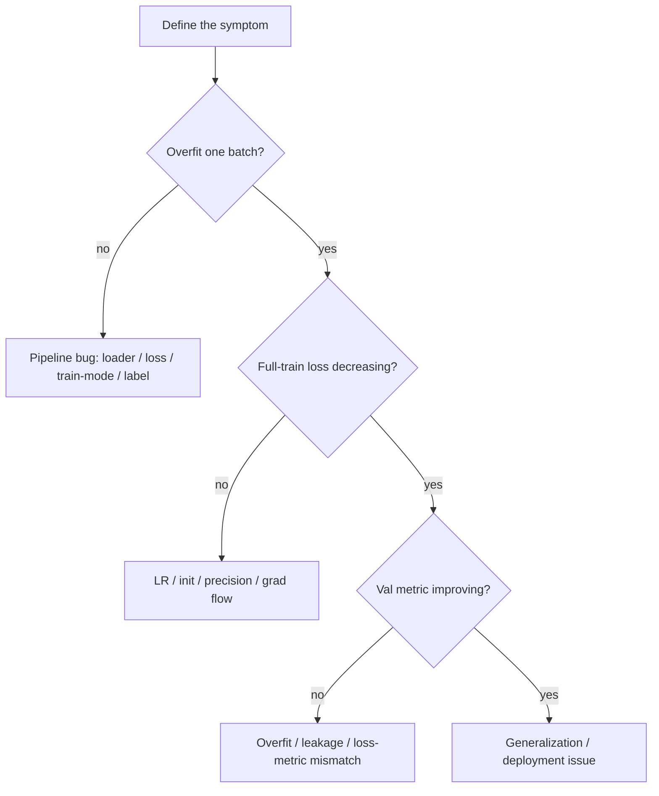

# Debugging & Experimentation

<div class="tag-row"><span class="tag">overfit one batch</span><span class="tag">LR range test</span><span class="tag">reproducibility</span><span class="tag">ablation discipline</span><span class="tag">experiment tracking</span></div>

> [!TIP] Say this first
> This is the most *operational* axis in an ML interview, and it separates people who've shipped from people who've only read. The signal they want: you localize failures systematically (not by guessing hyperparameters), you change **one thing at a time**, and you leave a reproducible trail. The single best line: *"First I make sure it can overfit one batch — if it can't, it's a pipeline bug, not a model."*

## The debugging playbook



**Overfit one batch first** (Karpathy's recipe): take ~8 samples and drive the loss to ~0. If you *can't*, the model is fine — the bug is in the pipeline. Fast checks before anything else:

1. `model.train()` / `eval()` toggled correctly (BN/dropout).
2. Loss is finite; no `NaN`/`inf`.
3. Label range and `ignore_index` correct.
4. Trainable-parameter count > 0; LR ≠ 0.
5. Input normalization (mean/std) matches the checkpoint.
6. Visualize one batch — image/mask/label alignment.

<details class="qa"><summary>Your training loss won't go down. Walk me through your first ten minutes.</summary>
<div class="qa-body">

**Short:** try to overfit a single tiny batch. If it fails, it's a pipeline bug (wrong loss reduction, frozen params, `eval()` left on, label/target mismatch, LR=0). If it succeeds, the model can learn and the problem is scale/optimization.

**Deep:** ordered probes — (1) confirm `requires_grad` params exist and grads are non-zero after `backward()`; (2) print loss on the same batch repeatedly — should drop toward 0; (3) sanity-check the loss value at init (e.g., $\ln(\text{num\_classes})$ for balanced CE); (4) verify the LR is nonzero and the optimizer stepped; (5) visualize inputs+targets to catch a transform that corrupted labels. Only after "overfit one batch" passes do I touch LR schedules, capacity, or regularization. **Follow-up:** *Overfits but won't generalize?* — that's a regularization/data problem, see [Regularization & Generalization](#/foundations/regularization-generalization).
</div></details>

## LR range test

Before committing a schedule, run an **LR range test**: increase the LR exponentially over a few hundred steps and plot loss vs. LR.

<figure>
<svg viewBox="0 0 520 200" xmlns="http://www.w3.org/2000/svg" font-family="Inter, sans-serif" font-size="12">
  <line x1="50" y1="20" x2="50" y2="160" stroke="#98a3b2"/><line x1="50" y1="160" x2="490" y2="160" stroke="#98a3b2"/>
  <text x="30" y="90" fill="#6b7686" transform="rotate(-90 30 90)">loss</text>
  <text x="260" y="185" fill="#6b7686" text-anchor="middle">learning rate (log scale) →</text>
  <path d="M60 60 C 150 62, 200 70, 250 95 C 300 120, 330 135, 360 130 C 400 120, 430 60, 470 25" fill="none" stroke="#e0533f" stroke-width="2.5"/>
  <line x1="300" y1="20" x2="300" y2="160" stroke="#12a150" stroke-dasharray="4 3"/>
  <text x="300" y="16" fill="#12a150" text-anchor="middle">steepest descent → pick here</text>
  <text x="440" y="18" fill="#e0533f" text-anchor="middle">diverges</text>
</svg>
<figcaption>LR range test: the good LR is roughly the point of steepest loss descent, an order of magnitude below where loss blows up. Cheaper and more reliable than guessing.</figcaption>
</figure>

Pair this with grad-norm and weight-norm logging so you can *see* instability building before it NaNs (mechanisms in [Normalization & Stability](#/foundations/normalization-stability)).

## "Loss goes down but the metric doesn't"

A classic, and the diagnosis is a decision table:

| Observation | Hypothesis | Action |
| --- | --- | --- |
| train metric ↑, val metric flat | overfitting | augmentation, weight decay, more data |
| train metric also flat | loss ≠ target metric | metric-aware loss, error analysis |
| val loss ↓ but val metric flat | threshold/decoding issue | tune NMS / threshold / post-proc |
| both good, deploy bad | domain shift | target-distribution data, recalibrate |
| worse than random | eval bug | dump predictions, unit-test the metric |

CV examples: cross-entropy drops but **mIoU** stays flat → the model just predicts background; KD loss drops but student task metric drops → the student is copying teacher *errors*. The habit that catches these: **watch an intermediate quality signal**, not only the training loss.

<details class="qa"><summary>Validation loss improves but your target metric is flat. What's going on?</summary>
<div class="qa-body">

**Short:** the loss is a surrogate that's decoupled from the metric — usually a threshold/decoding mismatch, class imbalance the loss is exploiting, or an eval bug. Diagnose by dumping predictions and comparing against an oracle upper bound.

**Deep:** losses like CE optimize per-pixel/token likelihood; metrics like mIoU/mAP/F1 are set- or ranking-based and threshold-sensitive. If CE falls while mIoU is flat, the model likely wins easy majority pixels while boundaries/rare classes stagnate — fix with a metric-aligned loss (Dice/Lovász/focal) and inspect per-class scores. Always sanity-check the harness by feeding ground truth as predictions: the metric should hit its ceiling; if not, the eval code is broken. **Follow-up:** *Early stopping on which signal?* — the final reported metric, not the surrogate loss.
</div></details>

## Reproducibility

```python
import random, numpy as np, torch
random.seed(s); np.random.seed(s)
torch.manual_seed(s); torch.cuda.manual_seed_all(s)
torch.backends.cudnn.deterministic = True
torch.backends.cudnn.benchmark = False   # trades speed for determinism
```

Be honest about the ceiling: bit-exact reproducibility is often impossible due to atomic-add ordering, non-deterministic kernels, TF32, distributed all-reduce order, and dataloader worker scheduling. The realistic target is **statistical reproducibility** (same mean ± std) plus a recorded **commit hash, data version, and config** for every run.

<details class="qa"><summary>Why can't you always get bit-exact reproducibility on GPUs?</summary>
<div class="qa-body">

**Short:** floating-point addition isn't associative, and GPUs sum in nondeterministic order (atomic adds, reduction scheduling), so identical inputs can yield slightly different results across runs — compounded by TF32, autotuned kernels, and distributed all-reduce ordering.

**Deep:** `cudnn.benchmark=True` autotunes kernels per input shape (fast but nondeterministic); `deterministic=True` forces reproducible kernels at a speed cost, and some ops have no deterministic implementation. Across ranks, all-reduce combines partial sums in an unspecified order. So chasing bit-exactness is usually the wrong goal — instead fix seeds, log the commit/data/config, and report **mean ± std over ≥3 seeds** so conclusions are robust to this noise. **Follow-up:** *Dataset versioning?* — content hash / DVC / immutable snapshot paths so "the data" is pinned.
</div></details>

## Experiment tracking

Log **config** (hyperparameters, git hash, data version), **curves** (train/val loss, target metric, LR, grad-norm, weight-norm), **system** (GPU util, samples/s), **artifacts** (checkpoints), and **notes** (hypothesis + conclusion). Name runs `YYYYMMDD_hypothesis_short` and tag them (`baseline`, `bugfix`, `sweep`). Anti-patterns: dozens of nameless runs, a best checkpoint living only on one machine, and reporting a single test score with no variance. *Your future paper's ablation table comes straight out of these logs.*

## Ablation discipline

<div class="proscons"><div><div class="pros-t">Good ablation</div>

- Clear, reproducible **baseline**
- **One factor** changed at a time (or an interpretable factorial)
- **Equal budget** — same epochs/data/tuning for every arm
- **Multiple seeds** with mean ± std
- **Oracle/upper bound** for context
- Only the modules the **claim** depends on

</div><div><div class="cons-t">Bad ablation</div>

- Changing data + loss + architecture together
- **Grid-searching only the new method**
- Model selection on the **test set**
- Gains only on a tiny toy setting
- No variance reported
- Table bloat that hides the real driver

</div></div>

The interview move: *"I first list the axes that could explain the gain, then design the ablation to rule each out — e.g., is the improvement from the new loss or just a bigger backbone?"* Negative results are science: report failure conditions and scope. Detailed methodology lives in [Experiment Design](#/research/experiment-design).

<details class="qa"><summary>A reviewer says your gains might just come from more compute, not your method. How do you answer?</summary>
<div class="qa-body">

**Short:** show a **compute-matched** ablation — the baseline and your method trained with equal epochs, data, and tuning budget — plus a scaling curve so the improvement is visible at multiple compute points, not just one lucky setting.

**Deep:** the failure mode is tuning only the new method's hyperparameters while the baseline runs stock; that confounds method with search budget. Controls: (1) equal-budget training and equal HP search per arm; (2) report the same metric across model sizes / token counts to show the gap is consistent; (3) an oracle upper bound to bound the headroom; (4) ≥3 seeds with variance so the delta clears the noise. If the gain vanishes under compute-matching, that's an honest and valuable negative result. **Follow-up:** *When do you stop ablating?* — when marginal information < opportunity cost, or the causal story for the claim is complete.
</div></details>

## Quick scenarios

<dl class="kv">
<dt>NaN from step 0</dt><dd>Non-finite input, LR too high, FP16, `log(0)` → BF16, anomaly detect, dump the batch.</dd>
<dt>Curve dead flat</dt><dd>LR=0, frozen params, wrong loss, bad labels → sum `requires_grad`, manual forward.</dd>
<dt>Train perfect, val random</dt><dd>Broken eval or extreme overfit/domain shift → visualize val, check the split.</dd>
<dt>Only multi-GPU degrades</dt><dd>Sampler, mean-vs-sum reduction, BN → 1-GPU parity test (see <a href="#/foundations/distributed-training">Distributed Training</a>).</dd>
<dt>Won't reproduce</dt><dd>Seed, data order, a bugfix silently mixed in → pin commit + container.</dd>
</dl>

## Cheat-sheet

| Ask | One-liner |
| --- | --- |
| First move | Overfit one batch; if it fails it's a pipeline bug, not the model. |
| Init loss sanity | Balanced CE should start near $\ln(\text{num\_classes})$. |
| LR range test | Sweep LR up, plot loss; pick ~steepest descent, 10× below divergence. |
| Loss↓ metric flat | Surrogate ≠ metric, threshold, or eval bug; feed GT to test the harness. |
| Reproducibility | Aim statistical (mean±std over seeds) + pinned commit/data/config, not bit-exact. |
| Tracking | Log config/curves/system/artifacts/notes; name + tag every run. |
| Ablation | One factor, equal budget, multiple seeds, oracle; never tune only the new method. |
| Multi-GPU divergence | 1-GPU parity test to isolate sampler/reduction/sync bugs. |
| Compute-matched | Match epochs/data/tuning across arms so gains aren't just budget. |

**Related:** [Normalization & Stability](#/foundations/normalization-stability) · [Distributed Training](#/foundations/distributed-training) · [Mixed Precision & Efficiency](#/foundations/mixed-precision-efficiency) · [Optimization](#/foundations/optimization) · [Regularization & Generalization](#/foundations/regularization-generalization) · [Evaluation Metrics](#/foundations/evaluation-metrics) · [Experiment Design](#/research/experiment-design)
