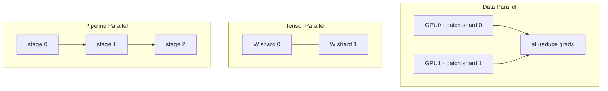

# Distributed Training

<div class="tag-row"><span class="tag">DDP</span><span class="tag">FSDP2</span><span class="tag">ZeRO</span><span class="tag">tensor/pipeline parallel</span><span class="tag">context parallel</span><span class="tag">3D parallelism</span></div>

> [!NOTE] 이 챕터는 심화입니다 — 처음이면 건너뛰어도 됩니다
> **한 줄 직관:** 모델이 너무 크거나 데이터가 너무 많아 GPU 하나로 감당이 안 되면, 여러 GPU에 **일을 나눠서(parallelism, 병렬화)** 학습합니다. 나누는 방식마다 트레이드오프는 똑같습니다 — **메모리를 아끼는 대신 GPU끼리 통신(communication)이 늘어납니다.** 아래는 "무엇을 나누는가"에 따른 전략들입니다. 처음 배우는 단계라면 [Optimization](#/foundations/optimization)까지만 소화하고 이 챕터는 나중에 봐도 충분합니다.

> [!TIP] 면접 한 줄
> 핵심 문장: *"모든 parallelism 전략은 메모리를 communication과 맞바꿉니다 — 저는 모델을 맞추면서 GPU를 바쁘게 유지하는 가장 싼 전략을 고릅니다."* 면접관은 당신이 만져본 가장 큰 클러스터보다, 증상(OOM, hang, low MFU)을 올바른 레버에 매핑할 수 있는지 — 그리고 스케일에 대해 정직한지를 더 봅니다.

## The parallelism zoo



| 전략 | 무엇을 나눔 | Communication | 사용 시점 |
| --- | --- | --- | --- |
| **DDP** | data (model 복제) | backward 중 grad bucket별 all-reduce | 모델이 GPU 하나에 맞음 |
| **FSDP / ZeRO-3** | data + params/grads/opt state | all-gather + reduce-scatter | 모델이 안 맞음 |
| **Tensor (TP)** | layer 내 matrix | layer당 all-reduce | 거대 layer, intra-node (NVLink) |
| **Pipeline (PP)** | layer들을 stage로 | stage 간 activation | 매우 깊음, cross-node |
| **Sequence / Context** | seq 축을 따른 activation | all-gather / ring attention | long context |
| **Expert (EP)** | MoE expert | token all-to-all | MoE 모델 |

실제 대규모 학습은 이들을 **3D(또는 4D) parallelism**으로 조합합니다: 예를 들어 node 내부엔 TP(빠른 NVLink), 몇 개 node에 걸쳐 PP, 나머지에 DP/FSDP, MoE엔 EP.

## Data parallel & DDP

각 rank는 서로 다른 micro-batch로 forward/backward를 돌린 뒤 **gradient를 all-reduce(평균)해서** 모든 replica가 동일한 update를 적용합니다 — 사실상 하나의 large-batch step입니다:

$$
B_{\text{eff}}=B_{\text{local}}\times N_{\text{GPU}}\times N_{\text{accum}}
$$

Ring all-reduce는 큰 메시지에서 bandwidth 효율적인 대표 구현이며, **gradient bucketing**을 통해 backward와 겹칠 수 있습니다(앞선 bucket의 grad가 준비되면 남은 backward 계산과 collective를 겹침). 고전적 버그: `DistributedSampler` 누락(데이터 중복), global-batch 변화 뒤 LR·warmup을 다시 검증하지 않음, 또는 rank마다 다른 제어 흐름으로 collective 순서를 어긋나게 함. Batch 증가에 따른 선형 LR scaling은 출발점인 휴리스틱이지 반드시 적용해야 하는 법칙이 아닙니다.

<details class="concept-code"><summary>개념 코드로 보기</summary>

> **PyTorch식 pseudocode — DDP + gradient accumulation**

```python
optimizer.zero_grad(set_to_none=True)
for epoch in range(num_epochs):
    sampler.set_epoch(epoch)                    # 모든 rank가 다른 shard를 섞음
    assert len(loader) % accum_steps == 0       # 예시는 partial window를 배제
    for micro_step, (x, y) in enumerate(loader):
        last = (micro_step + 1) % accum_steps == 0
        sync_context = nullcontext() if last else ddp_model.no_sync()

        with sync_context:                      # 중간 backward의 all-reduce 억제
            logits = ddp_model(x)               # rank별 local batch
            loss = criterion(logits, y) / accum_steps
            loss.backward()

        if last:                                # 모든 rank가 같은 분기로 들어와야 함
            optimizer.step()
            optimizer.zero_grad(set_to_none=True)
```

</details>

<details class="qa"><summary>DDP는 어떻게 communication과 computation을 겹치고, 왜 중요한가요?</summary>
<div class="qa-body">

**짧게:** DDP는 gradient를 bucket으로 묶고, backward 중 그 grad가 준비되는 즉시 각 bucket의 all-reduce를 시작합니다. 그래서 communication이 이후 layer의 compute 아래에 숨어, 뒤에서 직렬로 도는 대신입니다.

**깊게:** overlap이 없으면 step time ≈ compute + all-reduce이고, overlap이 있으면 $\max(\text{compute}, \text{comm})$에 근접합니다. Bucket size가 노브입니다: 너무 작으면 → launch overhead와 낮은 bandwidth 활용, 너무 크면 → overlap 감소(bucket을 채우기까지 기다림). Gradient accumulation에서는 중간 micro-step에 `no_sync()`를 쓰고 마지막 것만 reduce를 트리거하게 합니다. **후속 질문:** *언제 overlap이 실패하나?* — 너무 작은 bucket, CPU-launch에 묶인 kernel, 또는 straggler rank가 collective를 멈출 때.
</div></details>

## FSDP2 & ZeRO

**ZeRO**는 optimizer state, 그다음 gradient, 그다음 parameter를 data-parallel rank에 걸쳐 shard하며, 추가 communication을 rank당 메모리와 맞바꿉니다:

| Stage | Shards | Per-rank model state | Comm |
| --- | --- | --- | --- |
| 0 (DDP) | nothing | full | all-reduce |
| 1 | optimizer | ↓ | + |
| 2 | + gradients | ↓↓ | ++ |
| 3 | + parameters | ~1/N | all-gather each layer |

PyTorch **FSDP**는 ZeRO 스타일 sharding을 구현합니다. FSDP1의 `FULL_SHARD`는 개념적으로 ZeRO-3에, `SHARD_GRAD_OP`는 ZeRO-2에 가깝습니다. **FSDP2**(DTensor 기반 `fully_shard`)는 FlatParameter 대신 원래 parameter 구조를 보존하는 `DTensor` shard를 사용해 TP·`torch.compile`·Distributed Checkpoint와 조합하기 쉽게 설계됐습니다. 핵심 노브인 `reshard_after_forward=True`는 forward 후 unsharded parameter를 해제하고 backward 전에 다시 all-gather합니다(메모리 절약, 통신 증가). `False`는 backward까지 unsharded parameter를 보존해 두 번째 gather를 피하지만 peak memory가 늘어납니다. 기본값도 root와 non-root module이 다르므로 단순히 “FSDP2 전체에 True/False 하나”로 설명하면 안 됩니다. 2D `DeviceMesh`는 한 축에서 replicate하고 다른 축에서 shard하는 **hybrid sharding**을 지원합니다.

> [!NOTE] 메모리는 communication으로 산다
> 모델이 GPU 하나에 맞으면 **보통 DDP가 FSDP보다 빠릅니다**. 꼭 필요할 때만 shard하세요. 그다음, sharded DP조차 communication-bound이거나 단일 layer가 너무 클 때 tensor/pipeline parallel로 갑니다.

<details class="qa"><summary>ZeRO-3가 메모리 절약이 가장 큰데, 왜 항상 쓰지 않나요?</summary>
<div class="qa-body">

**짧게:** ZeRO-3/`FULL_SHARD`는 매 layer마다 parameter를 재수집하므로 communication-bound입니다. 이미 맞는 모델이면 DDP(또는 ZeRO-1/2)가 더 빠릅니다.

**깊게:** 지속적으로 보관하는 sharded model state는 이상적으로 rank당 약 $1/N$까지 줄지만, 실행 중인 layer의 unsharded parameter·activation·통신 buffer 때문에 peak 전체 메모리가 정확히 $1/N$이 되지는 않습니다. 각 parameter group은 forward 전에 all-gather되고 gradient는 reduce-scatter되며, forward 뒤 reshard하면 backward 전에 한 번 더 gather합니다. 느린 inter-node 링크에서는 이것이 step time을 지배합니다. Decision tree: DDP로 맞나? → DDP. optimizer/gradient만 shard해도 맞나? → ZeRO-1/2 계열. parameter까지 shard해야 하나? → ZeRO-3/FSDP 계열, 그다음 topology에 맞춘 hybrid shard·TP를 비교. **후속 질문:** *CPU/NVMe offload?* — 메모리를 더 줄이지만 PCIe·storage bandwidth와 transfer overlap에 병목될 수 있습니다.
</div></details>

## Tensor, pipeline, sequence & context parallelism

<dl class="kv">
<dt>Tensor parallel (TP)</dt><dd>Weight matrix를 GPU에 걸쳐 분할(column/row partition). layer당 all-reduce가 필요하므로 NVLink 위의 <b>intra-node</b>로 유지. Megatron 스타일.</dd>
<dt>Pipeline parallel (PP)</dt><dd>Layer 범위를 stage에 할당하고 micro-batch를 흘려보냄. 단순 non-interleaved schedule의 <b>bubble</b>(fill/drain idle)은 대략 $P$ stage, $M$ micro-batch에 대해 $(P-1)/(M+P-1)$ — 그래서 micro-batch 수를 늘리고 1F1B 또는 interleaved 1F1B 같은 schedule을 사용.</dd>
<dt>Sequence parallel (SP)</dt><dd>LayerNorm/Dropout activation만 seq 축을 따라 shard해 TP를 보완하고 activation 메모리를 줄임.</dd>
<dt>Context parallel (CP)</dt><dd>long-context 학습을 위해 <b>모든</b> activation을 seq 차원을 따라 shard. ring/all-gather attention이 rank 간 K/V를 교환. 이것이 long-context를 가능케 함.</dd>
</dl>

> [!IMPORTANT] SP vs CP (2026년 단골 주제)
> **Sequence parallelism**은 Megatron 계열에서 TP가 otherwise 복제하는 *norm/dropout 영역의 activation*을 seq 축으로 shard하는 add-on입니다. **Context parallelism**은 입력과 layer activation을 seq 축으로 계속 분할하고, attention에서만 global context를 위해 K/V 등을 교환합니다. 그래서 rank당 activation memory를 CP degree에 따라 줄일 수 있지만, 사용할 수 있는 최대 context는 attention kernel·통신·총 GPU 메모리에도 달렸습니다. 정확한 지원 모델과 `p2p`/`all_gather`/`a2a` 같은 통신 방식은 사용 중인 Megatron-Core 버전의 문서를 확인하세요.

<details class="qa"><summary>시퀀스가 GPU 하나에 안 맞는 1M-token-context 모델을 어떻게 학습하나요?</summary>
<div class="qa-body">

**짧게:** **context parallelism**을 씁니다 — activation을 seq 차원을 따라 GPU에 걸쳐 shard하고 K/V에 대한 ring/all-gather로 attention을 계산 — weight엔 FSDP, activation checkpointing을 결합합니다.

**깊게:** 저장해야 할 transformer activation은 시퀀스 길이에 대체로 비례하고, 순진하게 materialize한 attention score는 제곱으로 커집니다. CP는 시퀀스를 CP group에 걸쳐 나눕니다. 각 rank는 query chunk를 소유하고 K/V를 ring·all-gather·all-to-all 방식으로 교환해 global attention을 계산합니다. Flash/online attention을 함께 쓰면 score matrix를 저장하지 않으면서 rank당 sequence-shaped activation을 대략 CP degree만큼 줄일 수 있습니다. FSDP(weight), layer가 크면 TP, activation checkpointing(backward recompute)을 조합합니다. **후속 질문:** *비용?* — attention layer마다 K/V 계열 통신이 추가되며, 통신 방식과 topology에 따라 overlap 가능성이 다릅니다.
</div></details>

## Expert parallelism & MoE <span class="badge badge-2026">2026</span>

Mixture-of-Experts 모델에서는 **expert parallelism (EP)이** 중요한 병렬화 축입니다. 각 token은 몇 개의 expert로 라우팅(top-k)되고, expert들은 GPU에 분산되므로 forward pass는 token을 해당 expert로 보내는 **all-to-all**과 결과를 모으는 또 하나의 all-to-all이 필요합니다.

<dl class="kv">
<dt>Load balancing</dt><dd>불균등한 라우팅은 일부 expert를 과부하시키고 다른 것을 굶깁니다 → straggler. Auxiliary load-balancing loss(또는 aux-loss-free bias 트릭)를 쓰고, 구현에 따라 <b>capacity factor</b>로 overflow token을 drop/pad하거나 dropless routing으로 부하를 감당.</dd>
<dt>All-to-all cost</dt><dd>라우팅 all-to-all이 MoE 특유의 병목. EP group을 빠른 intra-node 링크에 두고 dispatch를 compute와 겹침.</dd>
<dt>Composition</dt><dd>EP는 DP/TP/PP와 곱해짐 — 4D 레이아웃. <b>Megatron-Core</b>는 대규모에서 TP + PP + DP + EP 결합의 레퍼런스 구현. DeepSpeed와 FSDP2는 PyTorch-native 중간 지대를 커버.</dd>
</dl>

**active vs. total** param을 보고하세요: active는 token당 compute/latency를 좌우하고, total은 메모리/capacity를 좌우합니다 — 둘이 분리되는 것이 MoE의 요점입니다.

## Gradient accumulation & memory budget

메모리가 빡빡할 때 $N_{\text{accum}}$개 micro-batch에 걸쳐 grad를 누적해 큰 effective batch에 도달하고, 마지막 micro-step에서만 sync합니다. Loss reduction(mean vs sum)이 LR과 맞는지, BN stats가 micro-batch를 쓰는지(또는 SyncBN/GN 사용) 주의하세요. 메모리는 어디로 가나?

| 항목 | 줄이는 방법 |
| --- | --- |
| Params / grads / optimizer state | FSDP/ZeRO, 8-bit Adam, layer freeze |
| Activations | checkpointing, 짧은 seq, context parallel |
| Temp / workspace | 작은 micro-batch, FlashAttention |
| Fragmentation | allocator 설정(`expandable_segments`), 재시작 |

좋은 답변은 **model-state OOM**(sharding/precision으로 해결)과 **activation OOM**(checkpointing/seq length로 해결)을 구분합니다 — [Mixed Precision & Efficiency](#/foundations/mixed-precision-efficiency) 참고.

## Diagnosing throughput & hangs

**MFU**(Model FLOPs Utilization) = 달성 FLOPs / 하드웨어 peak가 대표 효율 지표입니다. 선형 scaling에서 벗어나면 communication, I/O, 또는 straggler를 가리킵니다.

| 증상 | 가설 | 조치 |
| --- | --- | --- |
| 시작 시 OOM | model state | FSDP/TP, precision |
| iteration 중간 OOM | activations | checkpointing, seq len |
| all-reduce에서 hang | NCCL / straggler / mismatched collective | `NCCL_DEBUG=INFO`, synthetic-data run |
| 1 vs N GPU에서 loss 다름 | sampler / reduction / sync 버그 | 1-GPU parity test |
| Low MFU, GPU idle | comm bound 또는 dataloader starvation | topology, bucket size, I/O 확인 |

<details class="qa"><summary>Multi-node 학습이 all-reduce에서 hang합니다. 어떻게 디버깅하나요?</summary>
<div class="qa-body">

**짧게:** 먼저 *communication*을 *compute/data*와 분리 — `NCCL_DEBUG=INFO`를 켜고, loader를 배제하기 위해 synthetic data로 돌리고, 한 rank가 straggler인지 아니면 collective가 rank 간에 mismatch인지 확인합니다.

**깊게:** hang은 보통 rank들이 collective에 대해 불일치(다른 shape, 조건/branch로 step을 건너뛴 rank, 또는 불균등한 마지막 batch)하거나, 진짜 전송 문제(NVLink/IB/RoCE topology, Ethernet fallback 경로, 방화벽)를 의미합니다. 체크리스트: (1) `NCCL_DEBUG=INFO`로 어디서 멈추는지 확인, (2) 모든 rank가 같은 collective에 도달하는지 확인(데이터 의존 제어 흐름 방지), (3) `--synthetic-data`로 dataloader I/O 격리, (4) 느린/straggler rank 점검, (5) GPU-process binding과 interconnect 검증. 모델 버그라고 단정하지 마세요. **후속 질문:** *Gradient compression?* — bandwidth를 아끼지만 correctness/accuracy 트레이드오프를 더함. overlap/bucketing을 먼저 시도.
</div></details>

> [!WARNING] 스케일에 대해 정직하라
> 당신의 가장 큰 실제 학습이 예를 들어 4 node × 8×H100(32 GPU)이었다면 정확히 그렇게 말하고 *그것*에 대해 정밀하게 말하세요 — effective batch, 전략, 겪은 실패. "수천 개 GPU"는 원리적으로 이해하고 성장해 갈 수 있는 목표 환경으로 프레이밍하세요. 과장은 systems 면접에서 떨어지는 가장 빠른 길입니다.

## Cheat-sheet

| 질문 | 한 줄 요약 |
| --- | --- |
| DDP | 모델 복제, data shard, grad all-reduce. effective batch = local × GPUs × accum. |
| ZeRO 1/2/3 | optimizer → +grads → +params shard. 메모리 줄이려 comm 늘림. |
| FSDP2 | DTensor `fully_shard`로 params/grads/optimizer를 shard. `reshard_after_forward` = peak memory↔추가 gather 노브. |
| TP vs PP | TP는 matrix 분할(intra-node, layer당 all-reduce). PP는 layer 분할(bubble ∝ stage 수). |
| SP vs CP | SP는 norm/dropout activation shard. CP는 seq 축의 *모든* activation shard → long context. |
| 3D parallelism | TP intra-node × PP across nodes × DP/FSDP 나머지 (+ MoE엔 EP). |
| Grad accumulation | micro-batch로 큰 effective batch. 마지막 step에서만 sync. |
| MFU | 달성/peak FLOPs. low MFU ⇒ comm, I/O, 또는 straggler. |
| OOM triage | Model-state OOM → shard/precision. activation OOM → checkpoint/seq len. |

**관련:** [Mixed Precision & Efficiency](#/foundations/mixed-precision-efficiency) · [Normalization & Stability](#/foundations/normalization-stability) · [CNNs, RNNs & Transformers](#/foundations/architectures) · [Optimization](#/foundations/optimization) · [Debugging & Experimentation](#/foundations/debugging-experimentation)
