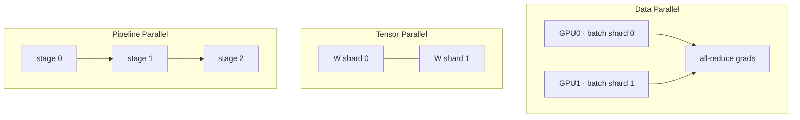

# Distributed Training

<div class="tag-row"><span class="tag">DDP</span><span class="tag">FSDP2</span><span class="tag">ZeRO</span><span class="tag">tensor/pipeline parallel</span><span class="tag">context parallel</span><span class="tag">3D parallelism</span></div>

> [!NOTE] This chapter is advanced—you may skip it for now
> **One-line intuition:** when a model is too large or a dataset is too extensive for one GPU, distribute the **work across several GPUs through parallelism**. Every strategy makes the same trade-off: **saving memory increases communication between GPUs.** The strategies below differ in what they divide. If you are just starting out, it is enough to study through [Optimization](#/foundations/optimization) and return to this chapter later.

> [!TIP] Interview one-liner
> The core sentence: *"Every parallelism strategy trades memory for communication — I pick the cheapest strategy that makes the model fit and keeps the GPUs busy."* Interviewers care less about the largest cluster you've touched than about whether you can map a symptom (OOM, hang, low MFU) to the right lever — and be honest about scale.

## The parallelism zoo



| Strategy | Splits | Communication | Use when |
| --- | --- | --- | --- |
| **DDP** | data (model replicated) | all-reduce each gradient bucket during backward | model fits on one GPU |
| **FSDP / ZeRO-3** | data + params/grads/opt state | all-gather + reduce-scatter | model doesn't fit |
| **Tensor (TP)** | matrices within a layer | all-reduce per layer | huge layers, intra-node (NVLink) |
| **Pipeline (PP)** | layers into stages | activations across stages | very deep, cross-node |
| **Sequence / Context** | activations along seq dim | all-gather / ring attention | long context |
| **Expert (EP)** | MoE experts | token all-to-all | MoE models |

Real large-scale runs compose these into **3D (or 4D) parallelism**: e.g., TP within a node (fast NVLink), PP across a few nodes, DP/FSDP across the rest, EP for MoE.

## Data parallel & DDP

Each rank runs forward/backward on a different micro-batch, then **all-reduces and averages gradients** so every replica applies the identical update—effectively one large-batch step:

$$
B_{\text{eff}}=B_{\text{local}}\times N_{\text{GPU}}\times N_{\text{accum}}
$$

Ring all-reduce is a representative bandwidth-efficient implementation for large messages, and **gradient bucketing** can overlap it with backward: once the gradients for an earlier bucket are ready, its collective can run alongside the remaining backward computation. Classic bugs include forgetting `DistributedSampler` and duplicating data, failing to revalidate LR and warmup after changing the global batch, or allowing rank-dependent control flow to misalign collective ordering. Linear LR scaling after a batch-size increase is a starting heuristic, not a law that must always be applied.

<details class="concept-code"><summary>View as concept code</summary>

> **PyTorch-style pseudocode—DDP + gradient accumulation**

```python
optimizer.zero_grad(set_to_none=True)
for epoch in range(num_epochs):
    sampler.set_epoch(epoch)                    # shuffle a different shard on every rank
    assert len(loader) % accum_steps == 0       # this example excludes a partial window
    for micro_step, (x, y) in enumerate(loader):
        last = (micro_step + 1) % accum_steps == 0
        sync_context = nullcontext() if last else ddp_model.no_sync()

        with sync_context:                      # suppress all-reduce on intermediate backward passes
            logits = ddp_model(x)               # rank-local batch
            loss = criterion(logits, y) / accum_steps
            loss.backward()

        if last:                                # every rank must enter the same branch
            optimizer.step()
            optimizer.zero_grad(set_to_none=True)
```

</details>

<details class="qa"><summary>How does DDP overlap communication with computation, and why does that matter?</summary>
<div class="qa-body">

**Short:** DDP groups gradients into buckets and launches each bucket's all-reduce as soon as those grads are ready during backward, so communication hides under later layers' compute instead of running serially afterward.

**Deep:** without overlap, step time ≈ compute + all-reduce; with overlap it approaches $\max(\text{compute}, \text{comm})$. Bucket size is the knob: too small → launch overhead and poor bandwidth utilization; too large → less overlap (you wait to fill the bucket). With gradient accumulation, use `no_sync()` on the intermediate micro-steps and let only the final one trigger the reduce. **Follow-up:** *When does overlap fail?* — tiny buckets, CPU-launch-bound kernels, or a straggler rank stalling the collective.
</div></details>

## FSDP2 & ZeRO

**ZeRO** shards the optimizer state, then gradients, then parameters across data-parallel ranks, trading extra communication for per-rank memory:

| Stage | Shards | Per-rank model state | Comm |
| --- | --- | --- | --- |
| 0 (DDP) | nothing | full | all-reduce |
| 1 | optimizer | ↓ | + |
| 2 | + gradients | ↓↓ | ++ |
| 3 | + parameters | ~1/N | all-gather each layer |

PyTorch **FSDP** implements ZeRO-style sharding. FSDP1's `FULL_SHARD` is conceptually close to ZeRO-3, and `SHARD_GRAD_OP` to ZeRO-2. **FSDP2**, the DTensor-based `fully_shard`, uses `DTensor` shards that preserve the original parameter structure instead of FlatParameter, making it easier to compose with TP, `torch.compile`, and Distributed Checkpoint. With the key knob `reshard_after_forward=True`, unsharded parameters are released after the forward pass and all-gathered again before backward, saving memory at the cost of more communication. `False` retains unsharded parameters through backward, avoiding the second gather but increasing peak memory. Defaults also differ between root and non-root modules, so do not describe all of FSDP2 with a single global True or False. A 2D `DeviceMesh` supports **hybrid sharding**, replicating on one axis and sharding on the other.

> [!NOTE] Memory is bought with communication
> If the model fits on one GPU, **DDP is usually faster** than FSDP. Only shard when you must. Then reach for tensor/pipeline parallel when even sharded DP is communication-bound or a single layer is too big.

<details class="qa"><summary>ZeRO-3 gives the most memory savings — why not always use it?</summary>
<div class="qa-body">

**Short:** ZeRO-3/`FULL_SHARD` re-gathers parameters every layer, so it's communication-bound; for models that already fit, DDP (or ZeRO-1/2) is faster.

**Deep:** Persistent sharded model state ideally falls toward roughly $1/N$ per rank, but total peak memory is not exactly $1/N$ because the active layer's unsharded parameters, activations, and communication buffers still occupy memory. Each parameter group is all-gathered before forward and its gradient is reduce-scattered; if it is resharded after forward, it must be gathered again before backward. On slow inter-node links, this can dominate step time. Decision tree: does it fit under DDP? → DDP. Do sharding only optimizer state and gradients suffice? → a ZeRO-1/2-style method. Must parameters also be sharded? → ZeRO-3/FSDP, then compare topology-aware hybrid sharding and TP. **Follow-up:** *CPU/NVMe offload?* It saves more memory but can become bottlenecked by PCIe or storage bandwidth and by how well transfers overlap compute.
</div></details>

## Tensor, pipeline, sequence & context parallelism

<dl class="kv">
<dt>Tensor parallel (TP)</dt><dd>Split weight matrices across GPUs (column/row partition); needs an all-reduce per layer, so keep it <b>intra-node</b> over NVLink. Megatron-style.</dd>
<dt>Pipeline parallel (PP)</dt><dd>Assign layer ranges to stages and stream micro-batches through them. For a simple non-interleaved schedule, the fill/drain <b>bubble</b> is roughly $(P-1)/(M+P-1)$ for $P$ stages and $M$ micro-batches, so increase the micro-batch count and use schedules such as 1F1B or interleaved 1F1B.</dd>
<dt>Sequence parallel (SP)</dt><dd>Shards only the LayerNorm/Dropout activations along the sequence dim, complementing TP to cut activation memory.</dd>
<dt>Context parallel (CP)</dt><dd>Shards <b>all</b> activations along the sequence dimension for long-context training; ring/all-gather attention exchanges K/V across ranks. This is the long-context enabler.</dd>
</dl>

> [!IMPORTANT] SP vs CP (a common 2026 topic)
> In the Megatron family, **sequence parallelism** is a TP add-on that shards the *norm/dropout-region activations* that TP would otherwise replicate. **Context parallelism** keeps inputs and layer activations partitioned along the sequence axis and exchanges K/V or related state only where attention needs global context. It can therefore reduce per-rank activation memory with the CP degree, but the maximum usable context still depends on attention kernels, communication, and total GPU memory. Check the documentation for the Megatron-Core version you use for supported models and communication modes such as `p2p`, `all_gather`, and `a2a`.

<details class="qa"><summary>How would you train a 1M-token-context model that won't fit the sequence on one GPU?</summary>
<div class="qa-body">

**Short:** use **context parallelism** — shard activations along the sequence dimension across GPUs and compute attention with a ring/all-gather over K/V — combined with FSDP for weights and activation checkpointing.

**Deep:** Stored Transformer activations generally grow linearly with sequence length, while a naively materialized attention-score matrix grows quadratically. CP splits the sequence across a CP group. Each rank owns a query chunk and exchanges K/V through a ring, all-gather, or all-to-all to compute global attention. Combined with Flash or online attention, it avoids storing the score matrix while reducing sequence-shaped activation memory per rank by roughly the CP degree. Add FSDP for weights, TP for very large layers, and activation checkpointing to recompute during backward. **Follow-up:** *Cost?* Every attention layer adds K/V-related communication, and overlap potential depends on the communication pattern and topology.
</div></details>

## Expert parallelism & MoE <span class="badge badge-2026">2026</span>

In Mixture-of-Experts models, **expert parallelism (EP)** is an important parallelism dimension. Each token is routed top-k to a few experts; because experts are distributed across GPUs, the forward pass needs one **all-to-all** to send tokens to their experts and another to collect the results.

<dl class="kv">
<dt>Load balancing</dt><dd>Uneven routing overloads some experts and starves others, creating stragglers. Use an auxiliary load-balancing loss or an auxiliary-loss-free bias method. Depending on the implementation, a <b>capacity factor</b> drops or pads overflow tokens, while dropless routing accepts the load.</dd>
<dt>All-to-all cost</dt><dd>The routing all-to-all is the MoE-specific bottleneck; keep the EP group on fast intra-node links and overlap dispatch with compute.</dd>
<dt>Composition</dt><dd>EP multiplies with DP/TP/PP — a 4D layout. <b>Megatron-Core</b> is the reference implementation for combining TP + PP + DP + EP at scale; DeepSpeed and FSDP2 cover the PyTorch-native middle ground.</dd>
</dl>

Report **active vs. total** params: active drives per-token compute/latency, total drives memory/capacity — the two decouple, which is the whole point of MoE.

## Gradient accumulation & memory budget

Accumulate grads over $N_{\text{accum}}$ micro-batches to reach a large effective batch when memory is tight; sync only on the last micro-step. Watch loss reduction (mean vs sum) matching the LR, and that BN stats use micro-batch (or use SyncBN/GN). Where does memory go?

| Item | Reduce with |
| --- | --- |
| Params / grads / optimizer state | FSDP/ZeRO, 8-bit Adam, freeze layers |
| Activations | checkpointing, shorter seq, context parallel |
| Temp / workspace | smaller micro-batch, FlashAttention |
| Fragmentation | allocator config (`expandable_segments`), restart |

A strong answer separates **model-state OOM** (fix with sharding/precision) from **activation OOM** (fix with checkpointing/seq length) — see [Mixed Precision & Efficiency](#/foundations/mixed-precision-efficiency).

## Diagnosing throughput & hangs

**MFU** (Model FLOPs Utilization) = achieved FLOPs / hardware peak is the headline efficiency metric. Deviations from linear scaling point at communication, I/O, or stragglers.

| Symptom | Hypothesis | Action |
| --- | --- | --- |
| OOM at start | model state | FSDP/TP, precision |
| OOM mid-iteration | activations | checkpointing, seq len |
| Hang on all-reduce | NCCL / straggler / mismatched collective | `NCCL_DEBUG=INFO`, synthetic-data run |
| Loss differs 1 vs N GPU | sampler / reduction / sync bug | 1-GPU parity test |
| Low MFU, GPUs idle | comm bound or dataloader starvation | check topology, bucket size, I/O |

<details class="qa"><summary>Multi-node training hangs on an all-reduce. How do you debug it?</summary>
<div class="qa-body">

**Short:** first separate *communication* from *compute/data* — turn on `NCCL_DEBUG=INFO`, run with synthetic data to rule out the loader, and check whether one rank is a straggler or a collective is mismatched across ranks.

**Deep:** a hang usually means ranks disagree on the collective (different shapes, a rank that skipped a step due to a conditional/branch, or an uneven last batch), or a genuine transport problem (NVLink/IB/RoCE topology, an Ethernet fallback path, firewall). Checklist: (1) `NCCL_DEBUG=INFO` to see where it stalls; (2) confirm every rank reaches the same collective (guard against data-dependent control flow); (3) `--synthetic-data` isolates dataloader I/O; (4) inspect for a slow/straggler rank; (5) verify GPU-process binding and interconnect. Don't assume it's a model bug. **Follow-up:** *Gradient compression?* — saves bandwidth but adds a correctness/accuracy trade-off; try overlap/bucketing first.
</div></details>

> [!WARNING] Be honest about scale
> If your largest real run was, say, 4 nodes × 8×H100 (32 GPUs), say exactly that and speak precisely about *that* — effective batch, strategy, failures you hit. Frame "thousands of GPUs" as the target environment you understand in principle and can grow into. Overclaiming is the fastest way to fail a systems interview.

## Cheat-sheet

| Ask | One-liner |
| --- | --- |
| DDP | Replicate model, shard data, all-reduce grads; effective batch = local × GPUs × accum. |
| ZeRO 1/2/3 | Shard optimizer → +grads → +params; more comm for less memory. |
| FSDP2 | Shard parameters, gradients, and optimizer state with DTensor `fully_shard`; `reshard_after_forward` trades peak memory for an extra gather. |
| TP vs PP | TP splits matrices (intra-node, all-reduce/layer); PP splits layers (bubble ∝ stages). |
| SP vs CP | SP shards norm/dropout activations; CP shards *all* activations on seq → long context. |
| 3D parallelism | TP intra-node × PP across nodes × DP/FSDP over the rest (+ EP for MoE). |
| Grad accumulation | Micro-batches to a big effective batch; sync only on the last step. |
| MFU | Achieved/peak FLOPs; low MFU ⇒ comm, I/O, or straggler. |
| OOM triage | Model-state OOM → shard/precision; activation OOM → checkpoint/seq len. |

**Related:** [Mixed Precision & Efficiency](#/foundations/mixed-precision-efficiency) · [Normalization & Stability](#/foundations/normalization-stability) · [CNNs, RNNs & Transformers](#/foundations/architectures) · [Optimization](#/foundations/optimization) · [Debugging & Experimentation](#/foundations/debugging-experimentation)
