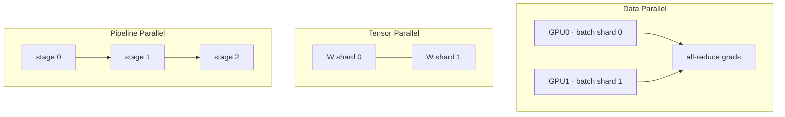

# Distributed Training

DDPFSDP2ZeROtensor/pipeline parallelcontext parallel3D parallelism

> [!TIP] Say this first
> The core sentence: *"Every parallelism strategy trades memory for communication — I pick the cheapest strategy that makes the model fit and keeps the GPUs busy."* Interviewers care less about the largest cluster you've touched than about whether you can map a symptom (OOM, hang, low MFU) to the right lever — and be honest about scale.

## The parallelism zoo

| Strategy | Splits | Communication | Use when |
| --- | --- | --- | --- |
| **DDP** | data (model replicated) | grad all-reduce (once/step) | model fits on one GPU |
| **FSDP / ZeRO-3** | data + params/grads/opt state | all-gather + reduce-scatter | model doesn't fit |
| **Tensor (TP)** | matrices within a layer | all-reduce per layer | huge layers, intra-node (NVLink) |
| **Pipeline (PP)** | layers into stages | activations across stages | very deep, cross-node |
| **Sequence / Context** | activations along seq dim | all-gather / ring attention | long context |
| **Expert (EP)** | MoE experts | token all-to-all | MoE models |

Real large-scale runs compose these into **3D (or 4D) parallelism**: e.g., TP within a node (fast NVLink), PP across a few nodes, DP/FSDP across the rest, EP for MoE.

## Data parallel & DDP

Each rank runs forward/backward on a different micro-batch, then **all-reduces (averages) gradients** so every replica applies the identical update — effectively one large-batch step:

$$
B_{\text{eff}}=B_{\text{local}}\times N_{\text{GPU}}\times N_{\text{accum}}
$$

Ring all-reduce is bandwidth-optimal and overlaps with backward via **gradient bucketing** (reduce early-computed grads while later layers still compute). Classic bugs: forgetting `DistributedSampler` (duplicated data), not scaling LR to the effective batch, or freezing params that then miss the reduce.

How does DDP overlap communication with computation, and why does that matter?

**Short:** DDP groups gradients into buckets and launches each bucket's all-reduce as soon as those grads are ready during backward, so communication hides under later layers' compute instead of running serially afterward.

**Deep:** without overlap, step time ≈ compute + all-reduce; with overlap it approaches $\max(\text{compute}, \text{comm})$. Bucket size is the knob: too small → launch overhead and poor bandwidth utilization; too large → less overlap (you wait to fill the bucket). With gradient accumulation, use `no_sync()` on the intermediate micro-steps and let only the final one trigger the reduce. **Follow-up:** *When does overlap fail?* — tiny buckets, CPU-launch-bound kernels, or a straggler rank stalling the collective.

## FSDP2 & ZeRO

**ZeRO** shards the optimizer state, then gradients, then parameters across data-parallel ranks, trading extra communication for per-rank memory:

| Stage | Shards | Per-rank model state | Comm |
| --- | --- | --- | --- |
| 0 (DDP) | nothing | full | all-reduce |
| 1 | optimizer | ↓ | + |
| 2 | + gradients | ↓↓ | ++ |
| 3 | + parameters | ~1/N | all-gather each layer |

PyTorch **FSDP** implements ZeRO-style sharding. `FULL_SHARD` ≈ ZeRO-3; `SHARD_GRAD_OP` ≈ ZeRO-2. **FSDP2** (the DTensor-based rewrite, `fully_shard`) replaced FSDP1's FlatParameter: per-parameter `DTensor` sharding gives more deterministic memory, cleaner composability with TP/`torch.compile`, and simpler distributed checkpointing. Key knob: `reshard_after_forward` — `True` frees params after forward (less memory, re-gather in backward → more comm); `False` keeps them (ZeRO-2-like). A 2D `DeviceMesh` enables **hybrid shard** (shard within a node, replicate across nodes).

> [!NOTE] Memory is bought with communication
> If the model fits on one GPU, **DDP is usually faster** than FSDP. Only shard when you must. Then reach for tensor/pipeline parallel when even sharded DP is communication-bound or a single layer is too big.

ZeRO-3 gives the most memory savings — why not always use it?

**Short:** ZeRO-3/`FULL_SHARD` re-gathers parameters every layer, so it's communication-bound; for models that already fit, DDP (or ZeRO-1/2) is faster.

**Deep:** the memory saving is real (~1/N per rank) but every forward and backward layer now needs an all-gather of that layer's weights, plus a reduce-scatter of grads. On slow inter-node links this dominates step time. The decision tree: does it fit under DDP? → DDP. Fits under ZeRO-1/2 (shard opt/grads only)? → do that. Only params don't fit? → ZeRO-3, and consider TP so the gathers stay intra-node. **Follow-up:** *CPU/NVMe offload?* — ZeRO-Infinity / FSDP offload cuts memory further but is bottlenecked by PCIe bandwidth.

## Tensor, pipeline, sequence & context parallelism

<dl class="kv">
<dt>Tensor parallel (TP)</dt><dd>Split weight matrices across GPUs (column/row partition); needs an all-reduce per layer, so keep it <b>intra-node</b> over NVLink. Megatron-style.</dd>
<dt>Pipeline parallel (PP)</dt><dd>Assign layer ranges to stages; stream micro-batches through. Introduces a <b>bubble</b> (idle time at fill/drain) ≈ $(P-1)/(M+P-1)$ for $P$ stages, $M$ micro-batches — so use many micro-batches and interleaved schedules (1F1B).</dd>
<dt>Sequence parallel (SP)</dt><dd>Shards only the LayerNorm/Dropout activations along the sequence dim, complementing TP to cut activation memory.</dd>
<dt>Context parallel (CP)</dt><dd>Shards <b>all</b> activations along the sequence dimension for long-context training; ring/all-gather attention exchanges K/V across ranks. This is the long-context enabler.</dd>
</dl>

> [!IMPORTANT] SP vs CP (a 2026 favorite)
> **Sequence parallelism** only shards the *norm/dropout* activations (an add-on to tensor parallelism). **Context parallelism** shards *every* activation along the sequence axis so no single GPU holds the full sequence — this is what makes 100K–1M-token training feasible. Megatron-Core and long-context training stacks lean on CP. *(verifiable mechanism; confirm exact APIs against current Megatron-Core docs.)*

How would you train a 1M-token-context model that won't fit the sequence on one GPU?

**Short:** use **context parallelism** — shard activations along the sequence dimension across GPUs and compute attention with a ring/all-gather over K/V — combined with FSDP for weights and activation checkpointing.

**Deep:** activation memory scales with sequence length, so even a small model can't hold a 1M-token sequence. CP splits the sequence across the CP group; each rank owns a chunk of queries and exchanges keys/values (ring attention) so every query still attends globally, at $O(n)$ memory per rank. Layer on FSDP (weights), TP if layers are large, and activation checkpointing (recompute in backward). Sequence parallelism additionally shards the norm/dropout activations that TP leaves replicated. **Follow-up:** *Cost?* — extra K/V communication per attention layer; overlap it with compute and keep the CP group on fast links.

## Expert parallelism & MoE 2026

Since nearly every 2025–2026 frontier model is Mixture-of-Experts, **expert parallelism (EP)** is now a first-class dimension. Each token is routed (top-k) to a few experts; experts are distributed across GPUs, so the forward pass needs an **all-to-all** to send tokens to their experts and another to gather results.

<dl class="kv">
<dt>Load balancing</dt><dd>Uneven routing overloads some experts and starves others → stragglers. Auxiliary load-balancing loss (or aux-loss-free bias tricks) + <b>capacity factor</b> (drop/pad overflow tokens) keep it even.</dd>
<dt>All-to-all cost</dt><dd>The routing all-to-all is the MoE-specific bottleneck; keep the EP group on fast intra-node links and overlap dispatch with compute.</dd>
<dt>Composition</dt><dd>EP multiplies with DP/TP/PP — a 4D layout. <b>Megatron-Core</b> is the reference implementation for combining TP + PP + DP + EP at scale; DeepSpeed and FSDP2 cover the PyTorch-native middle ground.</dd>
</dl>

Report **active vs. total** params: active drives per-token compute/latency, total drives memory/capacity — the two decouple, which is the whole point of MoE.

## Gradient accumulation & memory budget

Accumulate grads over $N_{\text{accum}}$ micro-batches to reach a large effective batch when memory is tight; sync only on the last micro-step. Watch loss reduction (mean vs sum) matching the LR, and that BN stats use micro-batch (or use SyncBN/GN). Where does memory go?

| Item | Reduce with |
| --- | --- |
| Params / grads / optimizer state | FSDP/ZeRO, 8-bit Adam, freeze layers |
| Activations | checkpointing, shorter seq, context parallel |
| Temp / workspace | smaller micro-batch, FlashAttention |
| Fragmentation | allocator config (`expandable_segments`), restart |

A strong answer separates **model-state OOM** (fix with sharding/precision) from **activation OOM** (fix with checkpointing/seq length) — see [Mixed Precision & Efficiency](#/foundations/mixed-precision-efficiency).

## Diagnosing throughput & hangs

**MFU** (Model FLOPs Utilization) = achieved FLOPs / hardware peak is the headline efficiency metric. Deviations from linear scaling point at communication, I/O, or stragglers.

| Symptom | Hypothesis | Action |
| --- | --- | --- |
| OOM at start | model state | FSDP/TP, precision |
| OOM mid-iteration | activations | checkpointing, seq len |
| Hang on all-reduce | NCCL / straggler / mismatched collective | `NCCL_DEBUG=INFO`, synthetic-data run |
| Loss differs 1 vs N GPU | sampler / reduction / sync bug | 1-GPU parity test |
| Low MFU, GPUs idle | comm bound or dataloader starvation | check topology, bucket size, I/O |

Multi-node training hangs on an all-reduce. How do you debug it?

**Short:** first separate *communication* from *compute/data* — turn on `NCCL_DEBUG=INFO`, run with synthetic data to rule out the loader, and check whether one rank is a straggler or a collective is mismatched across ranks.

**Deep:** a hang usually means ranks disagree on the collective (different shapes, a rank that skipped a step due to a conditional/branch, or an uneven last batch), or a genuine transport problem (NVLink/IB/RoCE topology, an Ethernet fallback path, firewall). Checklist: (1) `NCCL_DEBUG=INFO` to see where it stalls; (2) confirm every rank reaches the same collective (guard against data-dependent control flow); (3) `--synthetic-data` isolates dataloader I/O; (4) inspect for a slow/straggler rank; (5) verify GPU-process binding and interconnect. Don't assume it's a model bug. **Follow-up:** *Gradient compression?* — saves bandwidth but adds a correctness/accuracy trade-off; try overlap/bucketing first.

> [!WARNING] Be honest about scale
> If your largest real run was, say, 4 nodes × 8×H100 (32 GPUs), say exactly that and speak precisely about *that* — effective batch, strategy, failures you hit. Frame "thousands of GPUs" as the target environment you understand in principle and can grow into. Overclaiming is the fastest way to fail a systems interview.

## Cheat-sheet

| Ask | One-liner |
| --- | --- |
| DDP | Replicate model, shard data, all-reduce grads; effective batch = local × GPUs × accum. |
| ZeRO 1/2/3 | Shard optimizer → +grads → +params; more comm for less memory. |
| FSDP2 | DTensor `fully_shard`; `FULL_SHARD`≈ZeRO-3; `reshard_after_forward` = memory↔comm knob. |
| TP vs PP | TP splits matrices (intra-node, all-reduce/layer); PP splits layers (bubble ∝ stages). |
| SP vs CP | SP shards norm/dropout activations; CP shards *all* activations on seq → long context. |
| 3D parallelism | TP intra-node × PP across nodes × DP/FSDP over the rest (+ EP for MoE). |
| Grad accumulation | Micro-batches to a big effective batch; sync only on the last step. |
| MFU | Achieved/peak FLOPs; low MFU ⇒ comm, I/O, or straggler. |
| OOM triage | Model-state OOM → shard/precision; activation OOM → checkpoint/seq len. |

**Related:** [Mixed Precision & Efficiency](#/foundations/mixed-precision-efficiency) · [Normalization & Stability](#/foundations/normalization-stability) · [CNNs, RNNs & Transformers](#/foundations/architectures) · [Optimization](#/foundations/optimization) · [Debugging & Experimentation](#/foundations/debugging-experimentation)
