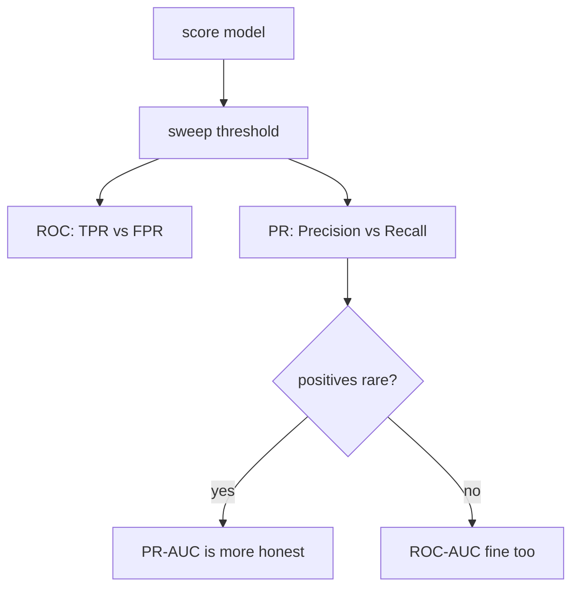

# 평가 지표 (Evaluation Metrics)

> [!NOTE] 이 챕터의 목표
> 모델을 학습했으면 "얼마나 잘하나?"를 숫자로 재야 합니다. 그런데 **어떤 숫자를 재느냐**가 전부를 바꿉니다. 이 챕터는 가장 흔한 함정(정확도만 보기)부터 시작해, precision/recall을 그림으로 쌓고, 상황별로 어떤 지표를 골라야 하는지까지 갑니다. 앞부분은 완전 입문용, 뒤(§심화)는 면접·실무용입니다.

## §0 · 정확도(accuracy)는 왜 못 믿나

가장 자연스러운 지표는 **정확도(accuracy)** = 맞힌 개수 / 전체입니다. 하지만 데이터가 **불균형(imbalanced)** 하면 정확도는 거짓말을 합니다.

> [!EXAMPLE] 사기 탐지 예시
> 1,000건 중 사기가 1건(0.1%)인 데이터에서, 모델이 **무조건 "정상"** 이라고만 답해도 정확도는 **99.9%** 입니다. 숫자는 화려하지만 정작 잡아야 할 사기는 하나도 못 잡았습니다. 정확도만 보면 이 쓸모없는 모델을 "거의 완벽"이라 착각합니다.

그래서 우리는 **어떤 종류의 실수인지**를 구분합니다. 그 출발점이 **혼동 행렬(confusion matrix)** 입니다.

## §1 · 혼동 행렬 — 네 칸으로 모든 게 정해진다

예측(양성/음성)과 실제(양성/음성)를 교차시키면 네 경우가 나옵니다:

<figure>
<svg viewBox="0 0 480 260" xmlns="http://www.w3.org/2000/svg" font-family="Inter, sans-serif" font-size="13">
  <text x="250" y="24" text-anchor="middle" fill="#98a3b2">실제 (정답)</text>
  <text x="160" y="52" text-anchor="middle" fill="#12a150" font-weight="700">양성(P)</text>
  <text x="330" y="52" text-anchor="middle" fill="#e0533f" font-weight="700">음성(N)</text>
  <text x="24" y="130" text-anchor="middle" fill="#98a3b2" transform="rotate(-90 24 150)">예측</text>
  <text x="70" y="105" text-anchor="middle" fill="currentColor">양성</text>
  <text x="70" y="195" text-anchor="middle" fill="currentColor">음성</text>
  <!-- TP -->
  <rect x="95" y="70" width="130" height="80" rx="8" fill="#12a150" opacity="0.85"/>
  <text x="160" y="105" text-anchor="middle" fill="#fff" font-weight="700">TP</text>
  <text x="160" y="128" text-anchor="middle" fill="#fff" font-size="11">참 양성 ✓</text>
  <!-- FP -->
  <rect x="235" y="70" width="130" height="80" rx="8" fill="#e0533f" opacity="0.55"/>
  <text x="300" y="105" text-anchor="middle" fill="#fff" font-weight="700">FP</text>
  <text x="300" y="128" text-anchor="middle" fill="#fff" font-size="11">거짓 경보 (오탐)</text>
  <!-- FN -->
  <rect x="95" y="160" width="130" height="80" rx="8" fill="#e0533f" opacity="0.55"/>
  <text x="160" y="195" text-anchor="middle" fill="#fff" font-weight="700">FN</text>
  <text x="160" y="218" text-anchor="middle" fill="#fff" font-size="11">놓침 (미탐)</text>
  <!-- TN -->
  <rect x="235" y="160" width="130" height="80" rx="8" fill="#12a150" opacity="0.85"/>
  <text x="300" y="195" text-anchor="middle" fill="#fff" font-weight="700">TN</text>
  <text x="300" y="218" text-anchor="middle" fill="#fff" font-size="11">참 음성 ✓</text>
</svg>
<figcaption>네 칸: <b>TP</b>(true positive, 참 양성) · <b>FP</b>(false positive, 오탐/거짓 경보) · <b>FN</b>(false negative, 미탐/놓침) · <b>TN</b>(true negative, 참 음성). 초록은 맞힌 것, 빨강은 두 가지 다른 실수입니다.</figcaption>
</figure>

핵심은 **두 실수의 성격이 다르다**는 것입니다. 스팸 필터에서 FP는 "멀쩡한 메일을 스팸함에 버림", FN은 "스팸을 못 걸러냄"입니다. 상황에 따라 어느 쪽이 더 치명적인지 다르죠.

### precision과 recall

이 네 칸에서 두 핵심 지표가 나옵니다:

$$
\text{Precision(정밀도)}=\frac{TP}{TP+FP},\qquad
\text{Recall(재현율)}=\frac{TP}{TP+FN}
$$

<dl class="kv">
<dt>Precision(정밀도)</dt><dd>"양성이라 말한 것 중 진짜 양성 비율." 낮으면 <b>거짓 경보가 많다</b>(멀쩡한 메일을 스팸 처리).</dd>
<dt>Recall(재현율)</dt><dd>"진짜 양성 중 내가 잡아낸 비율." 낮으면 <b>놓친 게 많다</b>(사기·질병을 미탐).</dd>
<dt>F1</dt><dd>둘의 조화평균 $F_1=\dfrac{2PR}{P+R}$. 한쪽만 높은 걸 방지 — 둘 다 높아야 F1이 높음.</dd>
</dl>

> [!NOTE] precision ↔ recall은 맞바꿈(trade-off) 관계
> "의심스러우면 다 양성"이라 하면 recall↑(다 잡음)이지만 precision↓(오탐 폭증). 반대로 "확실할 때만 양성"이라 하면 precision↑ recall↓. 그래서 **threshold(임계값)** 를 어디에 두느냐가 둘의 균형을 정합니다.

## §2 · Threshold를 직접 움직여 보기

대부분의 모델은 0~1 점수를 냅니다. 이 점수를 어디서 자를지(threshold)에 따라 위 네 칸이 실시간으로 바뀝니다. 슬라이더를 움직이며 precision·recall이 어떻게 반대로 움직이는지 보세요:

<div class="widget" data-widget="metrics-threshold"></div>

## §3 · 직접 계산해 보기

혼동 행렬과 precision/recall/F1을 코드로 직접 만들어 봅시다. 정답 리스트 `y_true`(1=양성, 0=음성)와 예측 리스트 `y_pred`가 주어질 때 세 지표를 계산하세요.

<div class="widget" data-widget="code">
<script type="application/json" class="code-config">
{"func":"prf1","packages":["numpy"],"approx":true,"starter":"def prf1(y_true, y_pred):\n    # y_true, y_pred: 0/1 리스트. precision, recall, f1 을 순서대로 [p, r, f1] 리스트로 반환.\n    # TP = 실제1 & 예측1,  FP = 실제0 & 예측1,  FN = 실제1 & 예측0\n    # precision = TP/(TP+FP), recall = TP/(TP+FN), f1 = 2PR/(P+R)\n    # 분모가 0이면 0.0 으로 처리하세요.\n    pass","tests":[{"args":[[1,1,0,0],[1,0,0,0]],"expect":[1.0,0.5,0.6666666666666666]},{"args":[[1,1,1,0],[1,1,1,1]],"expect":[0.75,1.0,0.8571428571428571]},{"args":[[0,0,0],[0,0,0]],"expect":[0.0,0.0,0.0]}],"solution":"import numpy as np\n\ndef prf1(y_true, y_pred):\n    y = np.asarray(y_true); p = np.asarray(y_pred)\n    TP = int(np.sum((y == 1) & (p == 1)))\n    FP = int(np.sum((y == 0) & (p == 1)))\n    FN = int(np.sum((y == 1) & (p == 0)))\n    precision = TP / (TP + FP) if (TP + FP) else 0.0\n    recall = TP / (TP + FN) if (TP + FN) else 0.0\n    f1 = 2 * precision * recall / (precision + recall) if (precision + recall) else 0.0\n    return [precision, recall, f1]"}
</script>
</div>

> [!TIP] 면접 한 줄
> "불균형 데이터에서 accuracy는 함정이다. 나는 FP와 FN의 비용을 먼저 따지고, 그에 맞는 지표(precision@recall, PR-AUC, F1 등)와 operating threshold를 설계의 일부로 고른다." CV 후보라면 여기에 detection의 **mAP**, segmentation의 **mIoU**까지 자연스럽게 이어가면 강합니다.

## §4 · ROC-AUC vs PR-AUC (심화)

threshold를 0→1로 쓸며 곡선을 그리면 threshold-독립적인 요약이 됩니다.

- **ROC:** TPR(=recall) vs FPR $=FP/(FP+TN)$. AUC = "무작위 양성이 무작위 음성보다 높은 점수를 받을 확률". 단, FPR 분모에 *거대한* 음성 집합이 있으면 양성이 드물 때 ROC가 **낙관적으로** 보입니다.
- **PR:** precision vs recall — 오로지 양성 class에 집중하므로 양성이 희소할 때의 고통을 정직하게 드러냅니다.



> [!NOTE] AUC는 operating point가 아니다
> 높은 AUC는 "평균적으로 순위가 좋다"만 말합니다. 배포는 *하나의* threshold에서 이뤄지므로, operating-point 지표도 함께 보고하세요: precision@recall, recall@fixed-FPR, biometric이면 EER(equal error rate).

## §5 · 상황별 지표 선택 (심화)

| 상황 | 주 지표 |
| --- | --- |
| Binary, 양성 희소 | PR-AUC, F1, precision@recall |
| Safety (anti-spoofing) | TPR@low-FPR, EER |
| Multi-class 불균형 | macro-F1, balanced accuracy |
| Segmentation, background 우세 | mIoU, per-class IoU |
| Retrieval / ranking | Recall@k, nDCG, mAP |

실제 제약 하에서 validation에서 threshold를 고르거나(예: FPR ≤ 0.1% 조건에서 TPR 최대화), 비용을 알 때는 expected cost $C_{FP}\cdot FP + C_{FN}\cdot FN$을 최소화하세요. **macro-F1**은 class별 F1을 동등 평균(희소 class 보호), **micro-F1**은 모든 sample을 pool(다수 class 지배)합니다.

> **개념 코드 — threshold도 validation에서 학습되는 결정입니다**

```python
val_score = model.predict_score(X_val)           # raw score/probability
candidates = np.linspace(0.0, 1.0, 1001)
valid = [t for t in candidates
         if false_positive_rate(y_val, val_score >= t) <= 0.001]
if not valid:
    raise RuntimeError("validation에서 제약을 만족하는 threshold가 없음")
threshold = max(valid, key=lambda t:
                recall(y_val, val_score >= t))

# test label을 보고 threshold를 다시 고르면 leakage
test_score = model.predict_score(X_test)
report = metrics(y_test, test_score >= threshold)
```

## §6 · Regression 지표 (심화)

<dl class="kv">
<dt>MAE</dt><dd>$\frac1n\sum|y-\hat y|$ — outlier에 robust, target 단위 그대로.</dd>
<dt>MSE / RMSE</dt><dd>$\frac1n\sum(y-\hat y)^2$ — 큰 오차를 제곱으로 처벌; RMSE는 target 단위로 복귀.</dd>
<dt>R²</dt><dd>$1-\text{SS}_\text{res}/\text{SS}_\text{tot}$ — 설명된 분산 비율; 나쁜 모델은 음수 가능.</dd>
<dt>MAPE</dt><dd>percentage error — 해석 쉽지만 target이 0 근처면 폭발.</dd>
</dl>

## §7 · Calibration — 확신이 믿을 만한가 (심화)

$$
\text{ECE}=\sum_{m=1}^{M}\frac{|B_m|}{n}\,\big|\text{acc}(B_m)-\text{conf}(B_m)\big|
$$

예측을 confidence로 구간화(binning)하고, 구간마다 실제 정확도를 confidence와 비교합니다. 모델이 "90% 확신"이라 말한 예측들이 실제로 90% 맞으면 잘 calibrate된 것입니다. **Temperature scaling**(validation에서 scalar $T$ 하나를 fit해 logit을 $z/T$로)은 값싸고 효과적인 사후 보정입니다. 주의: accuracy가 오르는 동안 ECE가 나빠질 수 있으니 둘 다 모니터하세요. ([확률 & 통계](#/foundations/probability-statistics)의 확률적 관점 참고.)

## §8 · CV 지표와 연결하기 (심화)

**Detection — mAP.** 예측을 IoU로 GT와 매칭: IoU ≥ $t$면 TP, 아니면 FP, 매칭 안 된 GT는 FN. Confidence로 정렬해 PR curve를 그리고 class별 AP를 적분한 뒤 평균 → mAP. VOC는 IoU=0.5, **COCO는 IoU 0.5:0.05:0.95를 평균**(mAP@[.5:.95]) + size별 AP$_{S/M/L}$.

**Segmentation — mIoU.** class $c$마다 $\text{IoU}_c = TP_c/(TP_c+FP_c+FN_c)$, $\text{mIoU}=\frac1C\sum_c \text{IoU}_c$. **Dice** $= 2\,\text{IoU}/(1+\text{IoU})$ = pixel F1. Pixel accuracy는 background 우세 장면을 과대평가하고, 미세 경계에는 **Boundary IoU**나 trimap-band 지표(SAD, Grad, Conn)가 필요합니다.

> 둘의 from-scratch 구현은 **[mAP & mIoU](#/ml-coding/metrics-map-miou)** 에 있습니다 — 이 장은 "왜", 그 장은 "어떻게"입니다.

## §9 · 그 차이는 진짜인가? (심화)

단일 숫자 개선("+0.4 mIoU")은 noise를 정량화하기 전엔 결과가 아닙니다.

- **Seed 간 variance 보고**: ≥3 seed로 학습해 mean ± std. seed 편차보다 작은 이득은 이득이 아님.
- **Test set bootstrap**: 복원 추출로 resample→지표 재계산→2.5/97.5 percentile을 CI로. mAP처럼 closed-form test가 없는 지표의 유의성을 방어하는 법.
- **Paired comparison**: 두 모델을 *같은* example에서 평가해 example별 차이를 검정 — 훨씬 강력.

## §10 · 2026: 숫자를 믿기 (심화)

> [!WARNING] Evaluation은 위기다
> 점수가 saturate되면서 그것을 *믿는* 게 어려운 부분입니다: leaderboard에 튜닝된 변형, task 대신 eval 장치를 해킹하는 **harness attack**, test-set contamination. 대응: private held-out set, task별 **cost와 reliability** 보고(top-1만이 아니라 — test-time compute가 accuracy를 지출의 함수로 만듦), 여러 seed와 variance, leakage 감사. **[The 2026 Landscape](#/start/landscape-2026)** 참고.

## 면접 Q&A

<details class="qa"><summary>ROC-AUC보다 PR-AUC를 언제 선호하는가?</summary>
<div class="qa-body">

**Short:** 양성이 드물고 양성-class 성능이 중요할 때 — ROC의 FPR 분모(거대한 음성 집합)가 많은 false positive를 숨겨 ROC-AUC가 기만적으로 높게 보입니다.

**Deep:** 1:1000 문제에서 수천 개의 false positive는 FPR를 거의 안 움직이지만 precision을 짓뭉갭니다; PR은 그것을 보이게 합니다. class가 균형 잡혔거나 threshold-독립적 ranking 품질을 원하면 ROC도 괜찮습니다. 어느 쪽이든 operating-point 지표로 이어가세요 — AUC는 배포하는 단일 threshold에 대해 아무것도 말하지 않습니다.
</div></details>

<details class="qa"><summary>손으로 mAP를 계산하는 과정을 설명하라.</summary>
<div class="qa-body">

**Short:** class마다 예측을 confidence로 정렬 → 각각을 IoU 최대인 미매칭 GT에 greedy 매칭 → IoU ≥ threshold면 TP 아니면 FP → 누적해 precision/recall sequence → PR curve 적분해 AP → class 평균 → mAP.

**Deep:** running precision은 $\text{cumsum}(TP)/(\text{cumsum}(TP)+\text{cumsum}(FP))$, recall은 $\text{cumsum}(TP)/n_{GT}$. VOC/COCO는 PR curve interpolation이 다르고 COCO는 IoU 0.5:0.05:0.95를 평균. 함정: 이미 매칭된 GT에 대한 두 번째 예측은 FP, NMS·TTA가 curve를 바꾸므로 protocol을 고정. 구현은 [mAP & mIoU](#/ml-coding/metrics-map-miou).
</div></details>

<details class="qa"><summary>"mIoU는 올랐는데 사용자는 품질이 떨어졌다고 한다." 진단하라.</summary>
<div class="qa-body">

**Short:** metric–perception 불일치 — scalar를 믿는 대신 per-class IoU, boundary 품질, resolution, post-processing, latency로 분해하세요.

**Deep:** 크고 쉬운 background class가 mIoU를 끌어올리는 동안 얇은 구조(머리카락, 손가락)는 실패할 수 있습니다 — per-class와 **Boundary IoU** 확인. 배포 resolution에서 평가하는지 확인(downsampled eval은 과대평가). 지표만 game하고 perception엔 도움 안 되는 post-processing, 사용성을 해치는 latency/jitter를 조심. Side-by-side human judgment(Bradley–Terry)를 도입. 그래서 matting은 region IoU와 함께 SAD/Grad/Conn을 보고합니다.
</div></details>

<details class="qa"><summary>배포용 decision threshold를 어떻게 고르는가?</summary>
<div class="qa-body">

**Short:** validation set에서 실제 제약 하에 지표를 최적화 — 예: FPR ≤ target 조건에서 recall 최대화. 0.5로 기본 설정하지 마세요.

**Deep:** FP/FN 비용을 알면 expected cost $C_{FP}FP+C_{FN}FN$ 최소화; 최적 threshold는 cost ratio와 score 분포에서 따라옵니다. Safety 시스템은 허용 FPR를 고정하고 TPR(또는 EER)를 보고. Calibration 변경/data shift 이후엔 threshold를 재확인하고, 그것을 정한 validation set은 leak 없이 유지.
</div></details>

**예상 follow-up**

- *Macro vs micro F1?* class별 동등 가중 vs sample-pool(다수 지배).
- *Dice vs IoU?* 단조 관계; Dice = pixel F1, TP에 더 가중.
- *Panoptic Quality?* PQ = SQ × RQ (segmentation quality × recognition quality).
- *Accuracy↑ but ECE↑?* 가능 — accuracy와 calibration은 대체로 독립; 둘 다 보고.
- *VLM에 BLEU/CIDEr?* caption 전용; grounding·reasoning엔 task-specific suite + hallucination metric 필요.

## Cheat-sheet

| 상황 | 주 지표 | 보조 |
| --- | --- | --- |
| 정확도 함정 | 불균형이면 accuracy 금지 | precision/recall/F1 |
| Binary, 불균형 | PR-AUC, F1 | precision@recall, FPR@TPR |
| Multi-class | macro-F1 / balanced acc | calibration (ECE) |
| Detection | COCO mAP@[.5:.95] | AP$_S$, AR |
| Semantic seg | mIoU | per-class IoU, Boundary IoU |
| Instance seg | mask AP | PQ (panoptic) |
| Matting | SAD, MSE, Grad, Conn | human eval |
| Regression | RMSE / MAE | R² |
| Retrieval | Recall@k, mAP | nDCG |

**다음:** [mAP & mIoU 직접 구현](#/ml-coding/metrics-map-miou) · [확률 & 통계](#/foundations/probability-statistics) · [Regularization & 일반화](#/foundations/regularization-generalization) · [The 2026 Landscape](#/start/landscape-2026) · [Segmentation](#/cv/segmentation)
