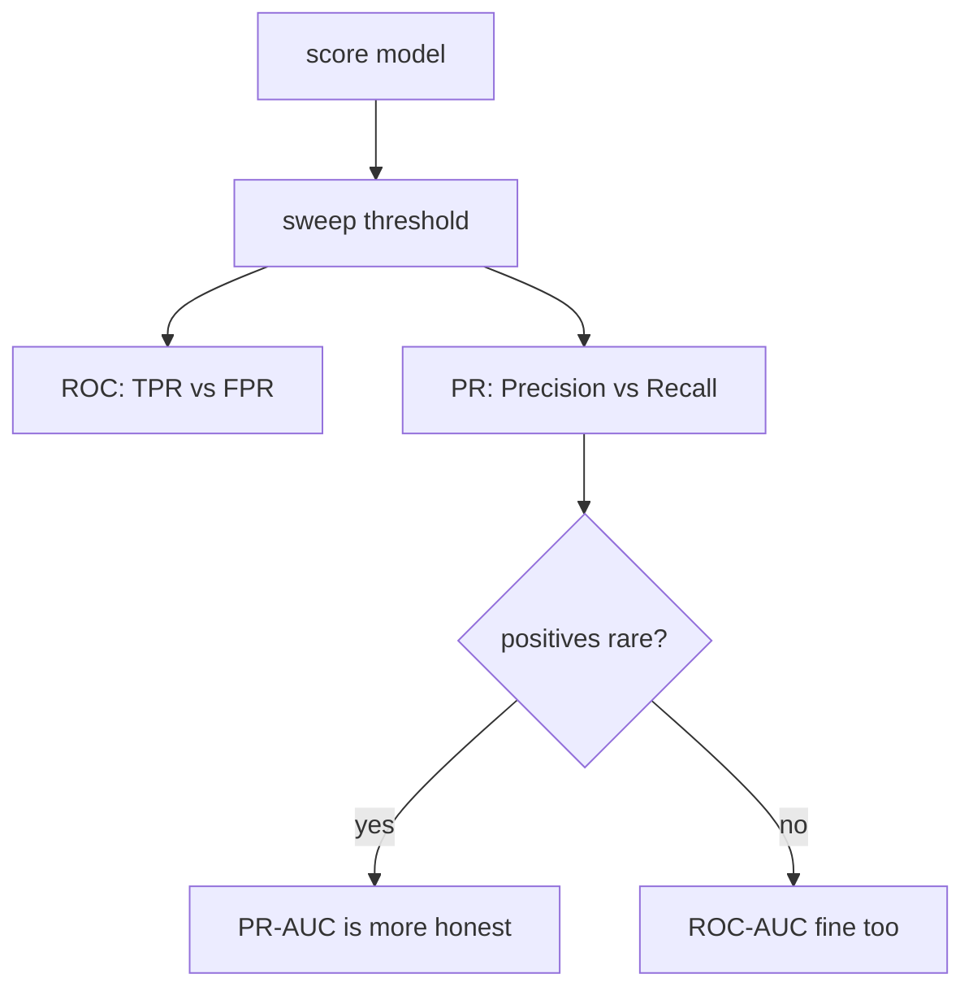

# Evaluation Metrics

precision/recall/F1ROC vs PR AUCimbalancecalibrationregressionmAP / mIoU

> [!TIP] CV/VLM 후보자의 기준선
> precision/recall *과* 비전 확장판 — detection의 mAP, segmentation의 mIoU — 에 유창하고, 여기에 *ROC가 언제 거짓말하는지*, *operating threshold를 어떻게 고르는지*, *2026년에 benchmark 숫자가 왜 못 믿을 수 있는지*에 대한 명확한 감각까지. Metric은 "우리가 무엇을 개선했는가"에 대한 계약이므로, metric 선택을 설계의 일부로 다루세요.

## Threshold를 직접 조절해 보기

모든 점수/스코어 model은 threshold를 고른 뒤에야 결정들의 집합이 됩니다. 이를 밀어보며 precision, recall, confusion matrix가 어떻게 움직이는지 지켜보세요.

## Confusion-matrix 핵심

$$
\text{Precision}=\frac{TP}{TP+FP},\quad
\text{Recall}=\frac{TP}{TP+FN},\quad
F1=\frac{2\,PR}{P+R}
$$

Precision↓은 false alarm을 뜻하고(좋은 메일을 지우는 spam filter), recall↓은 놓침을 뜻합니다(미탐지 fraud나 spoofing). **불균형 하에서 accuracy는 함정입니다**: 0.1% positive 문제에서 항상 "negative"라고 예측하면 99.9%를 받으면서도 쓸모없죠. $F_\beta$는 recall에 $\beta$로 가중치를 주고; macro-F1은 class별 F1을 동등하게 평균하며, micro-F1은 모든 sample을 pool합니다.

## ROC-AUC vs PR-AUC

- **ROC:** TPR vs FPR $=FP/(FP+TN)$. AUC = P(무작위 positive가 무작위 negative보다 높은 점수). FPR의 분모에 *큰* negative set이 있으므로, positive가 드물면 ROC는 **낙관적으로 평평하게** 보일 수 있습니다.
- **PR:** precision vs recall — 전적으로 positive class에 집중하므로, positive가 희소할 때의 고통을 드러냅니다.

> [!NOTE] AUC는 operating point가 아니다
> 높은 AUC는 ranking이 평균적으로 좋다는 것만 말합니다. 배포는 *하나의* threshold에서 이뤄지므로, 중요한 operating-point metric도 보고하세요: precision@recall, recall@fixed-FPR, 또는 biometric의 경우 EER.

## 불균형 & threshold 선택

| Situation | Primary metric |
| --- | --- |
| Binary, rare positive | PR-AUC, F1, precision@recall |
| Safety (anti-spoofing) | TPR@low-FPR, EER |
| Multi-class imbalance | macro-F1, balanced accuracy |
| Segmentation, background-dominated | mIoU, per-class IoU |
| Retrieval / ranking | Recall@k, nDCG, mAP |

실제 제약 하에서 validation에서 threshold를 고르거나(예: FPR ≤ 0.1% 조건에서 TPR 최대화), 비용을 알 때는 expected cost $C_{FP}\cdot FP + C_{FN}\cdot FN$을 최소화하세요.

## Regression metric

<dl class="kv">
<dt>MAE</dt><dd>$\frac1n\sum|y-\hat y|$ — outlier에 robust, target 단위 그대로.</dd>
<dt>MSE / RMSE</dt><dd>$\frac1n\sum(y-\hat y)^2$ — 큰 오차를 quadratic하게 penalize; RMSE는 target 단위로 되돌아옴.</dd>
<dt>R²</dt><dd>$1-\text{SS}_\text{res}/\text{SS}_\text{tot}$ — 설명된 variance의 비율; 나쁜 model에서는 음수가 될 수 있음.</dd>
<dt>MAPE</dt><dd>percentage error — 해석하기 쉽지만 target이 0에 가까우면 폭발함.</dd>
</dl>

## Calibration

$$
\text{ECE}=\sum_{m=1}^{M}\frac{|B_m|}{n}\,\big|\text{acc}(B_m)-\text{conf}(B_m)\big|
$$

예측을 confidence로 binning하고 bin마다 accuracy를 confidence와 비교합니다. **Temperature scaling**(validation에서 scalar $T$ 하나를 fit하고 logit $z/T$ 사용)은 값싸고 효과적인 post-hoc 수정입니다. 주의: ECE는 binning에 민감하고, *group-wise* calibration(subpopulation별)은 별개의 문제입니다. Accuracy가 개선되는 동안 ECE가 나빠질 수 있으니 — 둘 다 모니터하세요. ([Probability & Statistics](#/foundations/probability-statistics)의 확률적 관점을 참고하세요.)

## CV metric과 연결하기

**Detection — mAP.** 예측을 IoU로 ground truth와 매칭합니다; IoU ≥ $t$인 매칭은 TP, 아니면 FP; 매칭되지 않은 GT는 FN입니다. Confidence로 정렬하고, PR curve를 그리며, class별로 AP를 적분한 뒤 평균 → mAP. VOC는 IoU=0.5를 쓰고; **COCO는 IoU 0.5:0.05:0.95를 평균**합니다(mAP@[.5:.95]) 여기에 size별로 나눈 AP$_{S/M/L}$을 더합니다. NMS threshold와 TTA가 AP에 영향을 주므로, 비교하기 전에 protocol을 고정하세요.

**Segmentation — mIoU.** class $c$마다: $\text{IoU}_c = TP_c/(TP_c+FP_c+FN_c)$, 그리고 $\text{mIoU}=\frac1C\sum_c \text{IoU}_c$. **Dice**는 $\text{Dice}_c = 2\,\text{IoU}_c/(1+\text{IoU}_c)$로 관계되며 pixel F1과 같습니다. Pixel accuracy는 background이 지배하는 장면을 과대평가하고; matting/미세 경계에는 **Boundary IoU**나 trimap-band metric(SAD, Grad, Conn)이 필요합니다.

> 둘 다의 from-scratch 구현은 **[mAP & mIoU](#/ml-coding/metrics-map-miou)**에 있습니다 — 이 장은 "왜"이고, 그 장은 "어떻게"입니다.

## 그 차이는 진짜인가?

단일 숫자 개선("+0.4 mIoU")은 noise를 정량화하기 전까지는 결과가 아닙니다. 강한 후보자를 가르는 두 가지 반사 행동:

- **Seed 간 variance를 보고하세요.** ≥3개 seed를 학습하고 mean ± std를 보고하세요; seed-to-seed 편차보다 작은 이득은 이득이 아닙니다.
- **Test set을 bootstrap하세요.** Test example을 복원 추출로 resample하고, metric을 재계산하고, 2.5/97.5 percentile을 confidence interval로 취하세요 — 분포 가정이 필요 없습니다. closed-form test가 존재하지 않는 mAP 같은 metric에 대해 "significant"를 방어하는 방법입니다. ([Probability & Statistics](#/foundations/probability-statistics)의 유의성 원칙을 참고하세요.)
- **Paired comparison.** 두 model을 *같은* example에서 평가하고 example별 차이를 test하세요 — 독립된 두 평균을 비교하는 것보다 훨씬 강력합니다.

## 2026: 숫자를 믿기

> [!WARNING] Evaluation은 위기다
> 점수가 saturate되면서 그것을 *믿는* 것이 어려운 부분입니다: leaderboard에 튜닝된 변형(Llama 4 LMArena 사건), task를 푸는 대신 eval 장치를 해킹해 agent benchmark를 깨는 자동화된 **harness attack**, 그리고 test-set contamination. 반사적 대응: private held-out set, task별 **cost와 reliability** 보고(top-1만이 아니라 — test-time compute가 accuracy를 지출의 함수로 만들기 때문), 여러 seed와 variance, leakage 감사. 이제 면접에서 인기 있는 주제입니다 — **[The 2026 Landscape](#/start/landscape-2026)**를 참고하세요.

## Interview Q&A

ROC-AUC보다 PR-AUC를 언제 선호하는가?

**Short:** positive가 드물고 positive-class 성능을 신경 쓸 때 — ROC의 FPR 분모(거대한 negative set)가 많은 false positive를 숨기므로 ROC-AUC가 기만적으로 높게 보입니다.

**Deep:** 1:1000 문제에서 수천 개의 false positive는 FPR를 거의 움직이지 않지만 precision을 짓뭉갭니다; PR은 그것을 보이게 합니다. 클래스가 균형 잡혀 있거나 negative class가 중요하고 threshold-독립적인 ranking 품질을 원할 때는 ROC가 괜찮습니다. 어느 쪽이든 operating-point metric으로 이어가세요, AUC는 배포하는 단일 threshold에 대해 아무것도 말하지 않으니까요.

손으로 mAP를 계산하는 과정을 설명하라.

**Short:** class마다 예측을 confidence로 정렬하고; 각각을 IoU가 가장 높은 매칭되지 않은 GT에 greedy하게 매칭하고; IoU ≥ threshold면 TP, 아니면 FP; 이를 누적해 precision/recall sequence를 얻고; PR curve를 적분해 AP를 얻고; class에 대해 평균 → mAP.

**Deep:** running precision은 $\text{cumsum}(TP)/(\text{cumsum}(TP)+\text{cumsum}(FP))$이고 recall은 $\text{cumsum}(TP)/n_{GT}$입니다. VOC/COCO는 PR curve를 다르게 interpolate하고, COCO는 IoU 0.5:0.05:0.95에 대해 AP를 평균합니다. 함정: 이미 매칭된 GT에 대한 두 번째 예측은 FP이고; crowd/ignore 영역은 데이터셋 규칙을 따르며; NMS와 TTA가 curve를 바꾸므로 protocol을 고정하세요. 구현은 [mAP & mIoU](#/ml-coding/metrics-map-miou)에 있습니다.

"mIoU는 올랐는데 사용자는 품질이 떨어졌다고 한다." 진단하라.

**Short:** metric–perception 불일치입니다 — scalar를 믿는 대신 per-class IoU, boundary 품질, resolution, post-processing, latency를 분해하세요.

**Deep:** 크고 쉬운 background class가 mIoU를 끌어올리는 동안 얇은 구조(머리카락, matting에서 손가락)는 실패할 수 있습니다 — per-class와 **Boundary IoU**를 확인하세요. 배포 resolution에서 평가하고 있는지 확인하세요(downsampled eval은 과대평가). Metric을 game하지만 perception에 도움이 안 되는 post-processing(CRF/morphology)과, 사용성을 해치는 latency/jitter를 조심하세요. Side-by-side human judgment(Bradley–Terry)를 도입하세요. 경쟁 model을 *동일한* preprocessing/protocol 하에서 채점하세요. 이것이 바로 matting 작업이 region IoU와 함께 SAD/Grad/Conn을 보고하는 이유입니다.

배포용 decision threshold를 어떻게 고르는가?

**Short:** validation set에서 실제 비즈니스 제약 하에 metric을 최적화하세요 — 예를 들어 FPR ≤ target 조건에서 recall 최대화 — 0.5로 기본 설정하지 말고.

**Deep:** false-positive와 false-negative 비용을 안다면 expected cost $C_{FP}FP+C_{FN}FN$을 최소화하세요; optimal threshold는 cost ratio와 score 분포로부터 따라옵니다. Safety 시스템에서는 허용 가능한 FPR를 고정하고 TPR(또는 EER)를 보고하세요. Calibration 변경이나 data shift 이후에는 threshold를 재확인하고, 그것을 정한 validation set을 leak 없이 유지하세요.

**예상해야 할 follow-up**

- *Macro vs micro F1?* Class별 동등 가중치 vs. sample-pool(다수 지배).
- *Dice vs IoU?* 단조 관계; Dice = pixel F1, TP에 더 가중.
- *Panoptic Quality?* PQ = SQ × RQ(segmentation quality × recognition quality).
- *Accuracy↑ but ECE↑?* 가능함 — accuracy와 calibration은 대체로 독립적; 둘 다 보고.
- *VLM에 BLEU/CIDEr?* Caption 전용; grounding과 reasoning에는 task-specific suite에 hallucination metric까지 필요.

## Cheat-sheet

| Task | Primary | Complement |
| --- | --- | --- |
| Binary, imbalanced | PR-AUC, F1 | precision@recall, FPR@TPR |
| Multi-class | macro-F1 / balanced acc | calibration (ECE) |
| Detection | COCO mAP@[.5:.95] | AP$_S$, AR |
| Semantic seg | mIoU | per-class IoU, Boundary IoU |
| Instance seg | mask AP | PQ (panoptic) |
| Matting | SAD, MSE, Grad, Conn | human eval |
| Regression | RMSE / MAE | R² |
| Retrieval | Recall@k, mAP | nDCG |

> "Metric은 objective의 proxy이므로, 나는 failure-case 분석과 product 제약을 그것과 나란히 설계하고 — 2026년에는 benchmark 숫자를 애초에 믿을 수 있는지까지 의심한다."

**Related:** [mAP & mIoU](#/ml-coding/metrics-map-miou) · [Probability & Statistics](#/foundations/probability-statistics) · [Regularization & Generalization](#/foundations/regularization-generalization) · [The 2026 Landscape](#/start/landscape-2026) · [Segmentation](#/cv/segmentation)
