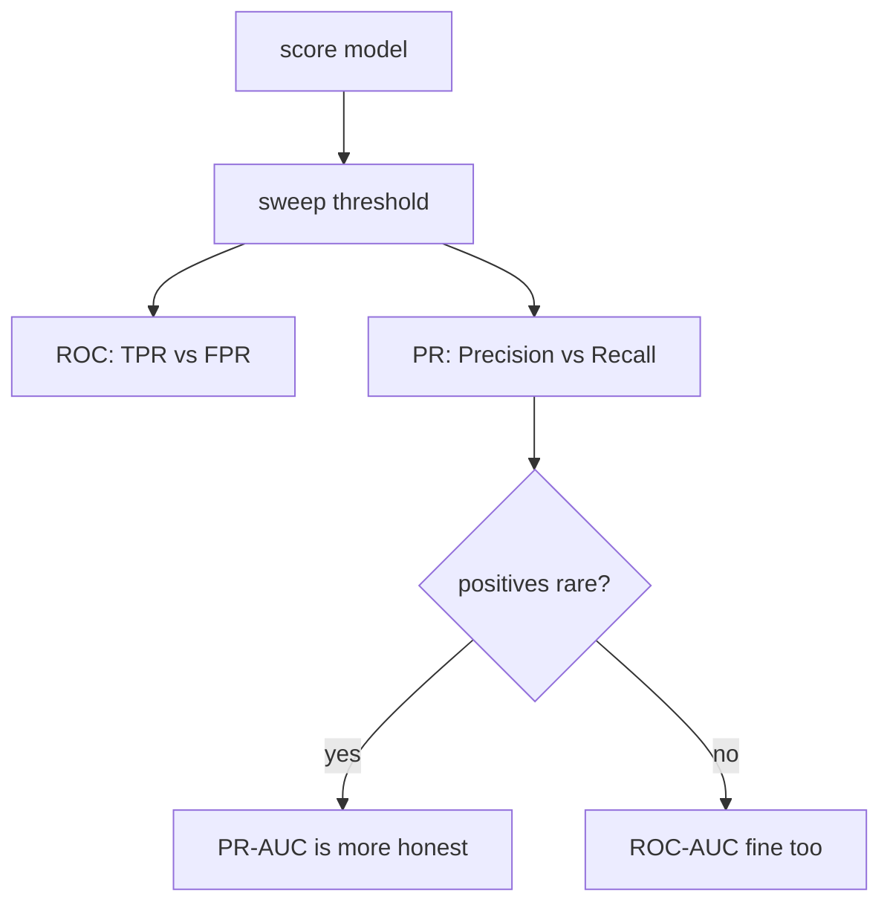

# Evaluation Metrics

precision/recall/F1ROC vs PR AUCimbalancecalibrationregressionmAP / mIoU

> [!TIP] The bar for a CV/VLM candidate
> Fluency in precision/recall *and* the vision extensions — mAP for detection, mIoU for segmentation — plus a clear sense of *when ROC lies*, *how to pick an operating threshold*, and *why a benchmark number might be untrustworthy in 2026*. Metrics are the contract for "what did we improve," so treat metric choice as part of the design.

## Try the threshold

Every point/score model becomes a set of decisions only after you pick a threshold. Slide it and watch precision, recall, and the confusion matrix move.

## Confusion-matrix core

$$
\text{Precision}=\frac{TP}{TP+FP},\quad
\text{Recall}=\frac{TP}{TP+FN},\quad
F1=\frac{2\,PR}{P+R}
$$

Precision↓ means false alarms (a spam filter deleting good mail); recall↓ means misses (undetected fraud or spoofing). **Accuracy is a trap under imbalance**: predict "negative" always on a 0.1%-positive problem and you score 99.9% while being useless. $F_\beta$ weights recall by $\beta$; macro-F1 averages per-class F1 equally, micro-F1 pools all samples.

## ROC-AUC vs PR-AUC

- **ROC:** TPR vs FPR $=FP/(FP+TN)$. AUC = P(a random positive scores above a random negative). Because FPR has the *large* negative set in its denominator, ROC can look **optimistically flat** when positives are rare.
- **PR:** precision vs recall — focused entirely on the positive class, so it exposes the pain when positives are scarce.

> [!NOTE] AUC is not the operating point
> A high AUC only says the ranking is good on average. Deployment lives at *one* threshold, so also report the operating-point metric that matters: precision@recall, recall@fixed-FPR, or EER for biometrics.

## Imbalance & threshold selection

| Situation | Primary metric |
| --- | --- |
| Binary, rare positive | PR-AUC, F1, precision@recall |
| Safety (anti-spoofing) | TPR@low-FPR, EER |
| Multi-class imbalance | macro-F1, balanced accuracy |
| Segmentation, background-dominated | mIoU, per-class IoU |
| Retrieval / ranking | Recall@k, nDCG, mAP |

Choose the threshold on validation under the real constraint (e.g. max TPR subject to FPR ≤ 0.1%), or minimize expected cost $C_{FP}\cdot FP + C_{FN}\cdot FN$ when you know the costs.

## Regression metrics

<dl class="kv">
<dt>MAE</dt><dd>$\frac1n\sum|y-\hat y|$ — robust to outliers, in target units.</dd>
<dt>MSE / RMSE</dt><dd>$\frac1n\sum(y-\hat y)^2$ — penalizes large errors quadratically; RMSE is back in target units.</dd>
<dt>R²</dt><dd>$1-\text{SS}_\text{res}/\text{SS}_\text{tot}$ — fraction of variance explained; can go negative for a bad model.</dd>
<dt>MAPE</dt><dd>percentage error — interpretable but explodes near zero targets.</dd>
</dl>

## Calibration

$$
\text{ECE}=\sum_{m=1}^{M}\frac{|B_m|}{n}\,\big|\text{acc}(B_m)-\text{conf}(B_m)\big|
$$

Bin predictions by confidence and compare accuracy to confidence per bin. **Temperature scaling** (fit one scalar $T$ on validation, use logits $z/T$) is a cheap, effective post-hoc fix. Caveats: ECE is sensitive to binning, and *group-wise* calibration (per subpopulation) is a separate concern. Accuracy can improve while ECE worsens — monitor both. (See the probabilistic view in [Probability & Statistics](#/foundations/probability-statistics).)

## Connecting to CV metrics

**Detection — mAP.** Match predictions to ground truth by IoU; a match with IoU ≥ $t$ is a TP, else FP; unmatched GT are FN. Sort by confidence, trace a PR curve, integrate for AP per class, then average → mAP. VOC uses IoU=0.5; **COCO averages IoU 0.5:0.05:0.95** (mAP@[.5:.95]) plus size-stratified AP$_{S/M/L}$. NMS threshold and TTA affect AP, so fix the protocol before comparing.

**Segmentation — mIoU.** Per class $c$: $\text{IoU}_c = TP_c/(TP_c+FP_c+FN_c)$, and $\text{mIoU}=\frac1C\sum_c \text{IoU}_c$. **Dice** relates by $\text{Dice}_c = 2\,\text{IoU}_c/(1+\text{IoU}_c)$ and equals the pixel F1. Pixel accuracy over-flatters background-dominated scenes; matting/fine boundaries need **Boundary IoU** or trimap-band metrics (SAD, Grad, Conn).

> The from-scratch implementation of both lives in **[mAP & mIoU](#/ml-coding/metrics-map-miou)** — this chapter is the "why," that one is the "how."

## Is the difference real?

A single-number improvement ("+0.4 mIoU") is not a result until you quantify noise. Two reflexes that separate strong candidates:

- **Report variance across seeds.** Train ≥3 seeds and report mean ± std; a gain smaller than the seed-to-seed spread is not a gain.
- **Bootstrap the test set.** Resample the test examples with replacement, recompute the metric, and take the 2.5/97.5 percentiles for a confidence interval — no distributional assumption needed. This is how you defend "significant" for metrics like mAP where a closed-form test doesn't exist. (See the significance discipline in [Probability & Statistics](#/foundations/probability-statistics).)
- **Paired comparison.** Evaluate both models on the *same* examples and test the per-example differences — far more powerful than comparing two independent averages.

## 2026: trusting the number

> [!WARNING] Evaluation is in crisis
> As scores saturate, *trusting* them is the hard part: leaderboard-tuned variants (the Llama 4 LMArena episode), automated **harness attacks** that break agent benchmarks by hacking the eval rig rather than solving the task, and test-set contamination. The reflex answers: private held-out sets, report per-task **cost and reliability** (not just top-1, since test-time compute makes accuracy a function of spend), multiple seeds with variance, and leakage audits. This is now a favorite interview topic — see **[The 2026 Landscape](#/start/landscape-2026)**.

## Interview Q&A

When do you prefer PR-AUC over ROC-AUC?

**Short:** when positives are rare and you care about positive-class performance — ROC's FPR denominator (huge negative set) hides many false positives, so ROC-AUC looks deceptively high.

**Deep:** on a 1:1000 problem, thousands of false positives barely move FPR but crush precision; PR makes that visible. ROC is fine when classes are balanced or the negative class matters and you want threshold-independent ranking quality. Either way, follow up with the operating-point metric, because AUC says nothing about the single threshold you deploy at.

Walk me through computing mAP by hand.

**Short:** per class, sort predictions by confidence; greedily match each to the highest-IoU unmatched GT; TP if IoU ≥ threshold else FP; accumulate to get precision/recall sequences; integrate the PR curve for AP; average over classes → mAP.

**Deep:** the running precision is $\text{cumsum}(TP)/(\text{cumsum}(TP)+\text{cumsum}(FP))$ and recall is $\text{cumsum}(TP)/n_{GT}$. VOC/COCO interpolate the PR curve differently, and COCO averages AP across IoU 0.5:0.05:0.95. Gotchas: a second prediction on an already-matched GT is an FP; crowd/ignore regions follow dataset rules; NMS and TTA change the curve, so hold the protocol fixed. Implementation in [mAP & mIoU](#/ml-coding/metrics-map-miou).

"mIoU went up but users say quality dropped." Diagnose it.

**Short:** a metric–perception mismatch — decompose per-class IoU, boundary quality, resolution, post-processing, and latency instead of trusting the scalar.

**Deep:** a large easy background class can lift mIoU while thin structures (hair, fingers in matting) fail — check per-class and **Boundary IoU**. Confirm you're evaluating at deployment resolution (downsampled eval flatters). Watch for post-processing (CRF/morphology) that games the metric without helping perception, and for latency/jitter that hurts usability. Bring in side-by-side human judgments (Bradley–Terry). Score competitors under an *identical* preprocessing/protocol. This is exactly why matting work reports SAD/Grad/Conn alongside region IoU.

How do you pick a decision threshold for deployment?

**Short:** on a validation set, optimize the metric under the real business constraint — e.g. maximize recall subject to FPR ≤ target — rather than defaulting to 0.5.

**Deep:** if false-positive and false-negative costs are known, minimize expected cost $C_{FP}FP+C_{FN}FN$; the optimal threshold follows from the cost ratio and the score distribution. For safety systems, fix a tolerable FPR and report TPR (or EER). Re-check the threshold after any calibration change or data shift, and keep the validation set that set it leak-free.

**Follow-ups you should expect**

- *Macro vs micro F1?* Equal per-class weight vs. sample-pooled (majority-dominated).
- *Dice vs IoU?* Monotonically related; Dice = pixel F1, weights TPs more.
- *Panoptic Quality?* PQ = SQ × RQ (segmentation quality × recognition quality).
- *Accuracy↑ but ECE↑?* Possible — accuracy and calibration are largely independent; report both.
- *BLEU/CIDEr for VLMs?* Caption-only; grounding and reasoning need task-specific suites plus hallucination metrics.

## Cheat-sheet

| Task | Primary | Complement |
| --- | --- | --- |
| Binary, imbalanced | PR-AUC, F1 | precision@recall, FPR@TPR |
| Multi-class | macro-F1 / balanced acc | calibration (ECE) |
| Detection | COCO mAP@[.5:.95] | AP$_S$, AR |
| Semantic seg | mIoU | per-class IoU, Boundary IoU |
| Instance seg | mask AP | PQ (panoptic) |
| Matting | SAD, MSE, Grad, Conn | human eval |
| Regression | RMSE / MAE | R² |
| Retrieval | Recall@k, mAP | nDCG |

> "A metric is a proxy for the objective, so I design failure-case analysis and product constraints alongside it — and in 2026 I question whether the benchmark number can even be trusted."

**Related:** [mAP & mIoU](#/ml-coding/metrics-map-miou) · [Probability & Statistics](#/foundations/probability-statistics) · [Regularization & Generalization](#/foundations/regularization-generalization) · [The 2026 Landscape](#/start/landscape-2026) · [Segmentation](#/cv/segmentation)
