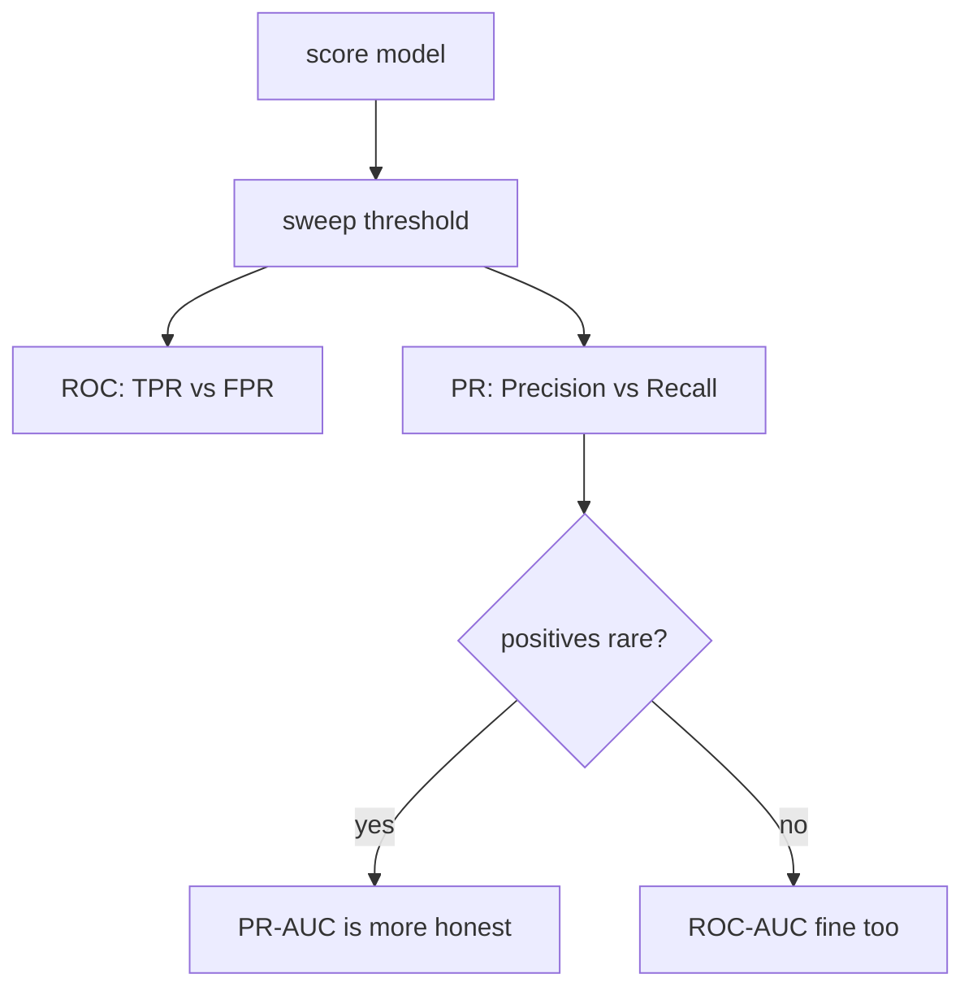

# Evaluation Metrics

> [!NOTE] Goal of this chapter
> Once you have trained a model, you need a number that says, "How well does it work?" But **which number you measure** changes everything. This chapter begins with the most common trap—looking only at accuracy—then builds precision and recall visually and shows how to choose a metric for each situation. The opening sections are for complete beginners; the later sections marked Advanced are for interviews and practice.

## §0 · Why accuracy can be misleading

The most natural metric is **accuracy** = number correct / total. But when the data is **imbalanced**, accuracy can lie.

> [!EXAMPLE] Fraud-detection example
> Suppose only 1 of 1,000 transactions is fraudulent (0.1%). A model that **always predicts "legitimate"** still achieves **99.9%** accuracy. The number looks impressive, but the model catches none of the fraud it is supposed to find. Accuracy alone would make this useless model look "nearly perfect."

We therefore distinguish **what kind of mistake** the model made. The starting point is the **confusion matrix**.

## §1 · The confusion matrix—four cells determine everything

Crossing the prediction (positive/negative) with the truth (positive/negative) gives four cases:

<figure>
<svg viewBox="0 0 480 260" xmlns="http://www.w3.org/2000/svg" font-family="Inter, sans-serif" font-size="13">
  <text x="250" y="24" text-anchor="middle" fill="#98a3b2">Actual (ground truth)</text>
  <text x="160" y="52" text-anchor="middle" fill="#12a150" font-weight="700">Positive (P)</text>
  <text x="330" y="52" text-anchor="middle" fill="#e0533f" font-weight="700">Negative (N)</text>
  <text x="24" y="130" text-anchor="middle" fill="#98a3b2" transform="rotate(-90 24 150)">Prediction</text>
  <text x="70" y="105" text-anchor="middle" fill="currentColor">Positive</text>
  <text x="70" y="195" text-anchor="middle" fill="currentColor">Negative</text>
  <!-- TP -->
  <rect x="95" y="70" width="130" height="80" rx="8" fill="#12a150" opacity="0.85"/>
  <text x="160" y="105" text-anchor="middle" fill="#fff" font-weight="700">TP</text>
  <text x="160" y="128" text-anchor="middle" fill="#fff" font-size="11">True positive ✓</text>
  <!-- FP -->
  <rect x="235" y="70" width="130" height="80" rx="8" fill="#e0533f" opacity="0.55"/>
  <text x="300" y="105" text-anchor="middle" fill="#fff" font-weight="700">FP</text>
  <text x="300" y="128" text-anchor="middle" fill="#fff" font-size="11">False alarm</text>
  <!-- FN -->
  <rect x="95" y="160" width="130" height="80" rx="8" fill="#e0533f" opacity="0.55"/>
  <text x="160" y="195" text-anchor="middle" fill="#fff" font-weight="700">FN</text>
  <text x="160" y="218" text-anchor="middle" fill="#fff" font-size="11">Missed positive</text>
  <!-- TN -->
  <rect x="235" y="160" width="130" height="80" rx="8" fill="#12a150" opacity="0.85"/>
  <text x="300" y="195" text-anchor="middle" fill="#fff" font-weight="700">TN</text>
  <text x="300" y="218" text-anchor="middle" fill="#fff" font-size="11">True negative ✓</text>
</svg>
<figcaption>The four cells: <b>TP</b> (true positive) · <b>FP</b> (false positive or false alarm) · <b>FN</b> (false negative or miss) · <b>TN</b> (true negative). Green cells are correct; red cells are two different kinds of error.</figcaption>
</figure>

The key is that **the two errors have different consequences**. For a spam filter, an FP sends a legitimate email to spam, while an FN lets spam through. Which one is more costly depends on the situation.

### Precision and recall

These four cells give us two central metrics:

$$
\text{Precision}=\frac{TP}{TP+FP},\qquad
\text{Recall}=\frac{TP}{TP+FN}
$$

<dl class="kv">
<dt>Precision</dt><dd>"Of everything predicted positive, what fraction was truly positive?" Low precision means <b>many false alarms</b> (legitimate email marked as spam).</dd>
<dt>Recall</dt><dd>"Of all true positives, what fraction did I find?" Low recall means <b>many misses</b> (undetected fraud or disease).</dd>
<dt>F1</dt><dd>The harmonic mean, $F_1=\dfrac{2PR}{P+R}$. It prevents one high value from hiding the other—both must be high for F1 to be high.</dd>
</dl>

> [!NOTE] Precision and recall trade off
> If you label anything suspicious as positive, recall rises because you catch nearly everything, but precision falls as false alarms surge. If you predict positive only when certain, precision rises while recall falls. The **threshold** determines this balance.

## §2 · Move the threshold yourself

Most models produce a score between 0 and 1. Where you cut that score—the threshold—changes all four confusion-matrix cells in real time. Move the slider and observe precision and recall moving in opposite directions:

<div class="widget" data-widget="metrics-threshold"></div>

## §3 · Compute the metrics yourself

Let us implement a confusion matrix and precision, recall, and F1 directly. Given a ground-truth list `y_true` (1 = positive, 0 = negative) and a prediction list `y_pred`, compute the three metrics.

<div class="widget" data-widget="code">
<script type="application/json" class="code-config">
{"func":"prf1","packages":["numpy"],"approx":true,"starter":"def prf1(y_true, y_pred):\n    # y_true and y_pred are 0/1 lists. Return [precision, recall, f1] in that order.\n    # TP = actual 1 & predicted 1, FP = actual 0 & predicted 1, FN = actual 1 & predicted 0\n    # precision = TP/(TP+FP), recall = TP/(TP+FN), f1 = 2PR/(P+R)\n    # If a denominator is zero, use 0.0.\n    pass","tests":[{"args":[[1,1,0,0],[1,0,0,0]],"expect":[1.0,0.5,0.6666666666666666]},{"args":[[1,1,1,0],[1,1,1,1]],"expect":[0.75,1.0,0.8571428571428571]},{"args":[[0,0,0],[0,0,0]],"expect":[0.0,0.0,0.0]}],"solution":"import numpy as np\n\ndef prf1(y_true, y_pred):\n    y = np.asarray(y_true); p = np.asarray(y_pred)\n    TP = int(np.sum((y == 1) & (p == 1)))\n    FP = int(np.sum((y == 0) & (p == 1)))\n    FN = int(np.sum((y == 1) & (p == 0)))\n    precision = TP / (TP + FP) if (TP + FP) else 0.0\n    recall = TP / (TP + FN) if (TP + FN) else 0.0\n    f1 = 2 * precision * recall / (precision + recall) if (precision + recall) else 0.0\n    return [precision, recall, f1]"}
</script>
</div>

> [!TIP] One-line interview answer
> "Accuracy is a trap on imbalanced data. I first compare the costs of FP and FN, then choose the matching metric—such as precision at a target recall, PR-AUC, or F1—and treat the operating threshold as part of the design." For a CV role, naturally connecting this to **mAP** for detection and **mIoU** for segmentation makes the answer stronger.

## §4 · ROC-AUC vs PR-AUC (Advanced)

Sweeping the threshold from 0 to 1 produces a curve and a threshold-independent summary.

- **ROC:** TPR (= recall) versus FPR $=FP/(FP+TN)$. AUC can be interpreted as the probability that a random positive receives a higher score than a random negative. But because the FPR denominator contains the *large* negative set, ROC can look **overly optimistic** when positives are rare.
- **PR:** precision versus recall. It focuses entirely on the positive class, so it exposes the pain of scarce positives more honestly.



> [!NOTE] AUC is not an operating point
> A high AUC says only that the ranking is good on average. Deployment operates at *one* threshold, so report an operating-point metric as well: precision@recall, recall@fixed-FPR, or EER (equal error rate) for biometrics.

## §5 · Choosing metrics by situation (Advanced)

| Situation | Primary metric |
| --- | --- |
| Binary, rare positive | PR-AUC, F1, precision@recall |
| Safety (anti-spoofing) | TPR@low-FPR, EER |
| Multi-class imbalance | macro-F1, balanced accuracy |
| Segmentation, background-dominated | mIoU, per-class IoU |
| Retrieval / ranking | Recall@k, nDCG, mAP |

Choose the threshold on validation under the real constraint—for example, maximize TPR while FPR ≤ 0.1%—or, when costs are known, minimize expected cost $C_{FP}\cdot FP + C_{FN}\cdot FN$. **Macro-F1** averages class-wise F1 equally and protects rare classes; **micro-F1** pools every sample and is dominated by majority classes.

> **Concept code—the threshold is also a decision learned on validation**

```python
val_score = model.predict_score(X_val)           # raw score/probability
candidates = np.linspace(0.0, 1.0, 1001)
valid = [t for t in candidates
         if false_positive_rate(y_val, val_score >= t) <= 0.001]
if not valid:
    raise RuntimeError("No threshold satisfies the constraint on validation")
threshold = max(valid, key=lambda t:
                recall(y_val, val_score >= t))

# Choosing the threshold again after seeing test labels causes leakage
test_score = model.predict_score(X_test)
report = metrics(y_test, test_score >= threshold)
```

## §6 · Regression metrics (Advanced)

<dl class="kv">
<dt>MAE</dt><dd>$\frac1n\sum|y-\hat y|$—robust to outliers and expressed in target units.</dd>
<dt>MSE / RMSE</dt><dd>$\frac1n\sum(y-\hat y)^2$—penalizes large errors quadratically; RMSE returns to target units.</dd>
<dt>R²</dt><dd>$1-\text{SS}_\text{res}/\text{SS}_\text{tot}$—fraction of variance explained; it can be negative for a poor model.</dd>
<dt>MAPE</dt><dd>Percentage error—easy to interpret, but it explodes when targets are near zero.</dd>
</dl>

## §7 · Calibration—is confidence trustworthy? (Advanced)

$$
\text{ECE}=\sum_{m=1}^{M}\frac{|B_m|}{n}\,\big|\text{acc}(B_m)-\text{conf}(B_m)\big|
$$

Bin predictions by confidence and compare the actual accuracy with confidence in each bin. A model is well calibrated if predictions made with "90% confidence" are correct about 90% of the time. **Temperature scaling**—fit one scalar $T$ on validation and divide logits as $z/T$—is a cheap and effective post-hoc correction. Accuracy can improve while ECE worsens, so monitor both. See [Probability & Statistics](#/foundations/probability-statistics) for the probabilistic perspective.

## §8 · Connecting to CV metrics (Advanced)

**Detection—mAP.** Match predictions to ground truth by IoU: a match with IoU ≥ $t$ is a TP, otherwise it is an FP, and unmatched GT boxes are FNs. Sort by confidence, trace the PR curve, integrate it for AP per class, then average to obtain mAP. VOC uses IoU = 0.5; **COCO averages IoU thresholds from 0.5 to 0.95 in steps of 0.05** (mAP@[.5:.95]) and reports size-specific AP$_{S/M/L}$.

**Segmentation—mIoU.** For each class $c$, $\text{IoU}_c = TP_c/(TP_c+FP_c+FN_c)$ and $\text{mIoU}=\frac1C\sum_c \text{IoU}_c$. **Dice** $= 2\,\text{IoU}/(1+\text{IoU})$ is pixel-level F1. Pixel accuracy overstates performance in background-dominated scenes; fine boundaries need **Boundary IoU** or trimap-band metrics such as SAD, Grad, and Conn.

> The from-scratch implementations of both are in **[mAP & mIoU](#/ml-coding/metrics-map-miou)**—this chapter explains "why," while that one explains "how."

## §9 · Is the difference real? (Advanced)

A single-number improvement such as "+0.4 mIoU" is not a result until you quantify the noise.

- **Report variance across seeds:** train with at least three seeds and report mean ± standard deviation. A gain smaller than the seed-to-seed variation is not a gain.
- **Bootstrap the test set:** resample with replacement, recompute the metric, and use the 2.5th and 97.5th percentiles as a confidence interval. This is how you defend significance for a metric such as mAP without a closed-form test.
- **Paired comparison:** evaluate both models on the *same* examples and test their per-example differences. This is far more powerful.

## §10 · 2026: trusting the number (Advanced)

> [!WARNING] Evaluation is in crisis
> As scores saturate, *trusting* them becomes the hard part: variants tuned to a leaderboard, **harness attacks** that hack an evaluation rig instead of solving the task, and test-set contamination. The responses are private held-out sets; reporting task-level **cost and reliability**, not only top-1, because test-time compute makes accuracy a function of spending; multiple seeds and variance; and leakage audits. See **[The 2026 Landscape](#/start/landscape-2026)**.

## Interview Q&A

<details class="qa"><summary>When do you prefer PR-AUC over ROC-AUC?</summary>
<div class="qa-body">

**Short:** When positives are rare and positive-class performance matters. ROC's FPR denominator—the huge negative set—can hide many false positives, making ROC-AUC look deceptively high.

**Deep:** In a 1:1000 problem, thousands of false positives barely move FPR but crush precision; PR makes that visible. ROC is still reasonable when classes are balanced or when you want threshold-independent ranking quality. In either case, follow with an operating-point metric—AUC says nothing about the single threshold you deploy.
</div></details>

<details class="qa"><summary>Walk me through computing mAP by hand.</summary>
<div class="qa-body">

**Short:** For each class, sort predictions by confidence → greedily match each to the unmatched GT with the highest IoU → mark it TP if IoU ≥ the threshold and FP otherwise → accumulate the precision/recall sequence → integrate the PR curve for AP → average across classes for mAP.

**Deep:** Running precision is $\text{cumsum}(TP)/(\text{cumsum}(TP)+\text{cumsum}(FP))$, and recall is $\text{cumsum}(TP)/n_{GT}$. VOC and COCO interpolate the PR curve differently, and COCO averages IoU thresholds from 0.5 to 0.95 in steps of 0.05. A second prediction for an already matched GT is an FP; NMS and TTA change the curve, so hold the protocol fixed. See [mAP & mIoU](#/ml-coding/metrics-map-miou) for an implementation.
</div></details>

<details class="qa"><summary>"mIoU went up, but users say quality dropped." Diagnose it.</summary>
<div class="qa-body">

**Short:** This is a metric–perception mismatch. Instead of trusting one scalar, break the result down by per-class IoU, boundary quality, resolution, post-processing, and latency.

**Deep:** A large, easy background class can lift mIoU while thin structures such as hair or fingers fail—check per-class IoU and **Boundary IoU**. Confirm evaluation uses the deployment resolution; downsampled evaluation can overstate quality. Watch for post-processing that games the metric without helping perception and for latency or jitter that hurts usability. Add side-by-side human judgments, for example with a Bradley–Terry model. This is why matting reports SAD, Grad, and Conn alongside region IoU.
</div></details>

<details class="qa"><summary>How do you choose a decision threshold for deployment?</summary>
<div class="qa-body">

**Short:** Optimize a metric on the validation set under the real constraint—for example, maximize recall subject to FPR ≤ a target. Do not default to 0.5.

**Deep:** If FP and FN costs are known, minimize expected cost $C_{FP}FP+C_{FN}FN$; the optimal threshold follows from the cost ratio and score distribution. A safety system fixes a tolerable FPR and reports TPR, or uses EER. Re-check the threshold after calibration changes or data shift, and keep the validation set used to choose it leak-free.
</div></details>

**Expected follow-ups**

- *Macro vs micro F1?* Equal per-class weighting versus sample pooling, which is majority-dominated.
- *Dice vs IoU?* They are monotonically related; Dice is pixel F1 and gives TP more weight.
- *Panoptic Quality?* PQ = SQ × RQ (segmentation quality × recognition quality).
- *Accuracy↑ but ECE↑?* Possible—accuracy and calibration are largely independent; report both.
- *BLEU/CIDEr for VLMs?* Caption-specific; grounding and reasoning need a task-specific suite plus hallucination metrics.

## Cheat sheet

| Situation | Primary metric | Complement |
| --- | --- | --- |
| Accuracy trap | Avoid accuracy under imbalance | precision/recall/F1 |
| Binary, imbalanced | PR-AUC, F1 | precision@recall, FPR@TPR |
| Multi-class | macro-F1 / balanced accuracy | calibration (ECE) |
| Detection | COCO mAP@[.5:.95] | AP$_S$, AR |
| Semantic segmentation | mIoU | per-class IoU, Boundary IoU |
| Instance segmentation | mask AP | PQ (panoptic) |
| Matting | SAD, MSE, Grad, Conn | human evaluation |
| Regression | RMSE / MAE | R² |
| Retrieval | Recall@k, mAP | nDCG |

**Next:** [Implement mAP & mIoU](#/ml-coding/metrics-map-miou) · [Probability & Statistics](#/foundations/probability-statistics) · [Regularization & Generalization](#/foundations/regularization-generalization) · [The 2026 Landscape](#/start/landscape-2026) · [Segmentation](#/cv/segmentation)
