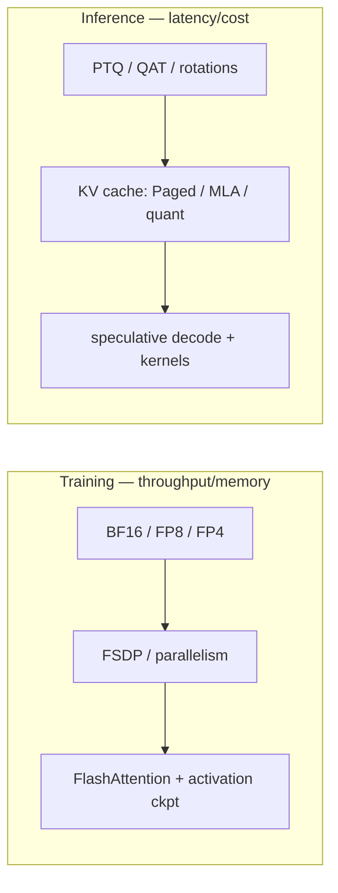

# Mixed Precision & Efficiency

<div class="tag-row"><span class="tag">BF16/FP8</span><span class="tag">NVFP4/MXFP4</span><span class="tag">GPTQ/AWQ</span><span class="tag">FlashAttention</span><span class="tag">KV cache</span><span class="tag">speculative decoding</span></div>

> [!NOTE] 이 챕터는 심화입니다 — 처음이면 건너뛰어도 됩니다
> **한 줄 직관:** 컴퓨터는 숫자를 정해진 비트 수로 근사해서 저장합니다. **비트를 적게 쓰면(낮은 precision, 예: 32비트→16/8/4비트) 학습·추론이 더 빠르고 싸지지만**, 너무 줄이면 정확도가 떨어집니다. 이 챕터는 "정확도를 지키면서 비트를 줄이는 기술"들의 모음입니다. 핵심 한 줄만 기억하세요 — **"exponent(지수) 비트는 표현 범위를, mantissa(가수) 비트는 정밀도를 산다."** 입문 단계라면 이 챕터는 나중에 봐도 됩니다.

> [!TIP] 면접 한 줄
> Efficiency는 연구가 제품이 되는 지점입니다. 면접을 이기는 두 개의 깔끔한 프레이밍: (1) *"exponent bit는 range를 사고, mantissa bit는 precision을 산다"* — 이것만으로 BF16 vs FP16 vs FP8이 설명됩니다. (2) *"training과 inference는 서로 다른 레버를 갖는다"* — training엔 precision/parallelism/activation-memory, inference엔 quantization/kernel/KV-cache/speculation.

## Training vs. inference 레버

면접관이 파고드는 함정: *training* precision과 *deployment* precision을 혼동하는 것. 둘은 목표가 다른 별개의 도구상자입니다.



*"FP8로 학습했다" ≠ "INT4로 배포한다".* Distillation은 양쪽에 다 나오지만 목적이 다릅니다(training 중엔 capacity transfer, inference 시엔 더 작은 serving 모델).

## Number formats

| Format | Exp / Mant | 무엇을 사는가 |
| --- | --- | --- |
| FP32 | 8 / 23 | reference |
| TF32 | 8 / 10 | Ampere+ tensor-core FP32 input 모드 (truncated mantissa) |
| **BF16** | 8 / 7 | FP32급 range, 낮은 precision → 안정적, 종종 loss scaling 불필요 |
| FP16 | 5 / 10 | 정밀하지만 좁은 range → loss scaling 필요 |
| FP8 E4M3 | 4 / 3 | forward weight/activation |
| FP8 E5M2 | 5 / 2 | gradient (더 넓은 range) |
| FP4 E2M1 | 2 / 1 | NVFP4/MXFP4 block의 4-bit element |

**BF16은 FP32의 exponent 폭을 공유**하므로 FP16보다 overflow 위험이 낮고, 이를 잘 지원하는 현대 accelerator에서 흔한 training precision입니다. **FP16**은 mantissa가 더 많지만 range가 좁아 많은 학습 설정에서 loss scaling을 사용합니다. **FP8**과 block-scaled **4-bit** format도 지원 하드웨어·kernel·모델 recipe가 맞는 일부 대규모 학습에서 쓰이기 시작했지만, 모든 layer와 workload의 기본값은 아닙니다.

### Loss scaling (FP16)

FP16 gradient는 0으로 underflow합니다. backward 전에 loss를 키우고 optimizer step 전에 unscale하세요. **Dynamic loss scaling**: 안정적이면 scale을 올리고, overflow 시 반으로. Master weight와 optimizer moment는 FP32로 유지합니다. BF16의 넓은 range는 보통 이를 불필요하게 만듭니다 — 실질적인 운영 단순화입니다.

> **PyTorch식 pseudocode — AMP에서 순서가 correctness입니다**

```python
optimizer.zero_grad(set_to_none=True)
with torch.autocast("cuda", dtype=torch.float16):
    logits = model(x)
    loss = criterion(logits, y)

scaler.scale(loss).backward()                 # 작은 FP16 gradient를 먼저 확대
scaler.unscale_(optimizer)                    # clipping 전에 반드시 원래 scale로
torch.nn.utils.clip_grad_norm_(model.parameters(), 1.0)
scaler.step(optimizer)                        # overflow면 update를 건너뜀
scaler.update()                               # 다음 step의 scale 조정
```

### FP4: NVFP4 vs MXFP4 <span class="badge badge-2026">2026</span>

둘 다 shared per-block scale을 가진 **E2M1** 4-bit element를 쓰며, block size와 scale format에서 다릅니다:

<dl class="kv">
<dt>NVFP4</dt><dd>Block <b>16</b>, scale은 <b>FP8 E4M3</b> → 더 세밀하고 block당 dynamic range가 좋음.</dd>
<dt>MXFP4</dt><dd>Block <b>32</b>, scale은 power-of-two <b>E8M0</b> → 더 거침. 한 8B/1T 비교에서 NVFP4 loss에 맞추려면 ~36% 더 많은 token이 필요했다고 보고됨 <span class="badge badge-med">secondary</span>.</dd>
</dl>

> [!NOTE] 4-bit *pretraining*은 실재한다
> NVIDIA 연구진은 arXiv:2509.25149에서 **12B 모델을 10T token 규모로 NVFP4 pretraining**한 실험과 FP8 baseline에 가까운 loss를 보고했습니다. 안정성에는 **random Hadamard transform**(outlier 분산), **2D block quantization**, **stochastic rounding**, 그리고 민감한 일부 layer의 높은 precision 유지가 함께 쓰였습니다. 이는 해당 모델·하드웨어·recipe의 결과이므로 4-bit 학습이 항상 FP8과 동등하다는 일반 명제로 확대하지 않습니다.

<details class="qa"><summary>왜 training에 보통 FP16보다 BF16이 선호되나요?</summary>
<div class="qa-body">

**짧게:** BF16은 FP32의 8 exponent bit를 유지하므로 dynamic range가 같고 overflow/underflow가 드뭅니다 — 보통 loss scaling을 완전히 뺍니다. FP16은 mantissa가 더 많지만 range가 좁아 dynamic loss scaling이 필요하고 더 취약합니다.

**깊게:** training gradient는 여러 자릿수에 걸칩니다. FP16의 최대값은 65504이고 작은 값은 underflow할 수 있어, loss scaling과 overflow-skip 로직을 흔히 사용합니다. BF16은 mantissa precision을 dynamic range와 맞바꾸고, 많은 GEMM이 더 높은 precision으로 accumulate하므로 학습 운용이 단순해지는 경우가 많습니다. 최종 선택은 accelerator의 native throughput, kernel 지원과 수렴 검증에 달렸습니다. **후속 질문:** *무엇을 높은 precision으로 남기나?* — optimizer state, reduction/accumulation, softmax·normalization 같은 민감 연산은 구현과 recipe에 따라 FP32/BF16을 선택합니다.
</div></details>

<details class="qa"><summary>표준 FP8 training 레시피는 무엇이고, 무엇이 그것을 깨나요?</summary>
<div class="qa-body">

**짧게:** 흔한 FP8 recipe는 forward weight/activation에 E4M3, gradient에 더 넓은 range의 E5M2를 고려하고, optimizer state와 민감한 연산은 더 높은 precision으로 유지합니다. 다만 modern delayed/current scaling이나 block-scaling recipe의 dtype 배치는 구현마다 다릅니다. Per-tensor 또는 per-block scale이 dynamic range를 관리합니다.

**깊게:** FP8의 좁은 mantissa와 range는 activation outlier에 민감하므로 scaling granularity와 high-precision 예외가 중요합니다. **후속 질문:** *FP8 inference vs training?* — inference에는 gradient용 E5M2 경로가 필요 없지만, 배포 형태는 weight-only로 한정되지 않습니다. FP8 W8A8도 사용되며, weight-only PTQ는 INT4 계열에서 특히 흔합니다. 어떤 dtype 조합이 빠른지는 실제 accelerator kernel 지원을 확인해야 합니다.
</div></details>

## Quantization for inference

Uniform affine quantization: $x_q=\mathrm{clip}(\mathrm{round}(x/s)+z)$, scale $s$와 zero-point $z$.

<dl class="kv">
<dt>PTQ</dt><dd>Post-training. 작은 세트로 scale calibrate. 빠르고 재학습 없음, 일부 accuracy 위험.</dd>
<dt>QAT</dt><dd>Training loop에 fake-quant(round는 straight-through estimator). 더 높은 비용으로 accuracy 회복.</dd>
<dt>GPTQ</dt><dd>Second-order(Hessian-aware) weight-only PTQ. 강한 4-bit weight.</dd>
<dt>AWQ</dt><dd>Activation-aware — 두드러진 weight channel 보호. 실용적인 weight-only 4-bit 기본값.</dd>
</dl>

**Rotation-based PTQ**는 *activation을 포함해* 4-bit로 밀어붙이는 2025–2026년의 진전입니다: **QuaRot**은 quantize 전에 random Hadamard rotation으로 outlier를 분산시키고, **SpinQuant**는 rotation을 *학습*합니다. 둘 다 순진한 activation quantization을 망치는 outlier 문제를 공략합니다.

<details class="qa"><summary>왜 rotation(QuaRot/SpinQuant)이 low-bit quantization에 도움이 되나요?</summary>
<div class="qa-body">

**짧게:** activation outlier는 거대한 range에 걸쳐 quantization scale을 부풀려 tensor 전체의 bit를 낭비합니다. Orthogonal rotation(예: Hadamard)이 그 에너지를 channel 전반에 재분배해 분포가 더 uniform해지고 깔끔하게 quantize됩니다 — 그리고 orthogonal이므로 수학적으로 역변환이 가능해 모델 출력이 바뀌지 않습니다.

**깊게:** 큰 크기의 몇몇 channel이 큰 $s$를 강요해 다른 값을 거칠게 만들 수 있습니다. Orthogonal rotation을 인접 linear map에 정확히 folding하면 **양자화 전** 함수는 보존되고 outlier를 여러 channel로 분산할 수 있습니다. 양자화 후 출력은 근사이므로 오차를 calibration으로 측정해야 합니다. W4A4의 activation 원소 크기는 FP16 대비 이론상 4배 작지만 scale·metadata·packing과 kernel 때문에 실제 bandwidth·latency 이득은 달라집니다.
</div></details>

## FlashAttention: IO-aware attention

순진한 attention 구현은 $n\times n$ score를 HBM에 materialize합니다. FlashAttention은 Q/K/V를 **tile**하고 on-chip memory에서 online softmax를 계산해 full score matrix를 HBM에 저장하지 않으면서 같은 attention 결과를 수치 오차 범위에서 계산합니다. 메모리 트래픽과 peak memory를 크게 줄이지만, 연산이 실제로 memory-bound에서 compute-bound로 바뀌는지는 sequence length·head dimension·dtype·GPU와 kernel에 달렸습니다.

<dl class="kv">
<dt>FA-2</dt><dd>Warp/threadblock 간 더 나은 work partitioning.</dd>
<dt>FA-3</dt><dd>Hopper/H100: async copy(TMA) + warp specialization + FP8.</dd>
<dt>FA-4</dt><dd>Blackwell(B200/GB200). CuTe-DSL로 재작성. <b>asymmetric hardware scaling</b> 때문에 존재.</dd>
</dl>

> [!IMPORTANT] "Asymmetric hardware scaling" — 2026년 화두
> Blackwell 세대에서는 tensor-core 처리량과 softmax·메모리 경로가 같은 비율로 확장되지 않아, 기존 kernel을 단순 재튜닝하는 것만으로 새 연산 자원을 모두 활용하기 어렵습니다. FlashAttention-4는 이 비대칭을 겨냥해 scheduling과 data movement를 다시 설계합니다. 핵심은 버전 번호 자체보다 **병목이 하드웨어 세대·shape마다 달라지므로 end-to-end kernel benchmark가 필요하다**는 점입니다.

## KV cache & serving

Autoregressive decoding은 과거 K/V를 cache합니다. cache는 context에 따라 커지고 long-context 메모리를 지배합니다.

<dl class="kv">
<dt>PagedAttention (vLLM)</dt><dd>KV cache의 virtual-memory 스타일 paging → 거의 zero fragmentation, 높은 batch throughput.</dd>
<dt>GQA / MQA</dt><dd>Query head 간 K/V head를 공유해 cache 축소(아키텍처 수준).</dd>
<dt>MLA</dt><dd>Multi-head Latent Attention(DeepSeek): K/V를 low-rank latent로 압축. GQA 대비 ~2.7–4.7× KV 감소 보고 <span class="badge badge-med">secondary</span>.</dd>
<dt>Quantized KV</dt><dd>INT8 ≈ 2×, FP4 ≈ 4× cache 감소.</dd>
<dt>Prefix / prompt caching</dt><dd>공유 prefix(system prompt, RAG context, few-shot)의 KV를 요청 간 재사용 → 재-prefill 생략. agent와 긴 고정 context에 큰 이득.</dd>
<dt>Chunked prefill</dt><dd>긴 prompt의 prefill을 chunk로 나눠 같은 batch의 진행 중 decode step과 interleave → 더 부드러운 latency, 하나의 거대 prompt로 인한 head-of-line blocking 없음.</dd>
<dt>Disaggregated serving</dt><dd><b>prefill</b>과 <b>decode</b>를 <i>별개</i> worker pool에서 실행(연산 프로파일이 다름)하고 그 사이 KV를 스트리밍 → 각 phase가 독립적으로 scaling. 2025–2026년 production 패턴.</dd>
</dl>

> [!NOTE] Serving 이야기가 이어지는 곳
> 이들은 phase 수준·cluster 수준의 serving 레버입니다. End-to-end 설계 — routing, autoscaling, TTFT/TPOT SLO, cost-per-token, 그리고 이들 각각이 어디에 맞는지 — 는 [Designing LLM/Agent Systems](#/system-design/llm-systems)에 있습니다. 이 모든 것의 동기가 되는 prefill-vs-decode 분리는 [LLM Fundamentals §6](#/llm/fundamentals)에 있습니다.

## Speculative decoding

싼 **drafter**가 여러 token을 제안하고 target 모델이 병렬로 verify합니다. greedy decoding은 target과 같은 token만 이어 붙이면 결과가 일치합니다. sampling에서는 rejection과 residual sampling까지 포함한 **정확한 speculative sampling 알고리즘**을 써야 target 분포를 보존합니다. 단순히 draft token을 검사해 prefix만 취한다고 같은 분포가 자동 보장되지는 않습니다.

<dl class="kv">
<dt>Medusa</dt><dd>Target 모델의 추가 prediction head가 여러 미래 token을 draft.</dd>
<dt>EAGLE-1/2/3</dt><dd>Target의 hidden state 위의 작은 drafter + draft <i>tree</i>. EAGLE-3는 multi-layer feature를 융합, acceptance &gt;75% 보고 <span class="badge badge-med">vendor</span>.</dd>
<dt>MTP</dt><dd>모델에 학습된 Multi-token prediction(DeepSeek 스타일) → self-speculation.</dd>
</dl>

주요 serving runtime이 지원하는 선택지이지만 모든 workload의 기본값은 아닙니다. acceptance가 낮거나 batch가 이미 compute-bound이면 overhead가 이득을 지울 수 있으므로 실제 요청 분포에서 측정합니다.

<details class="qa"><summary>Speculative decoding은 언제 도움이 되고 언제 해가 되나요?</summary>
<div class="qa-body">

**짧게:** target GPU가 미활용되고 draft가 자주 accept되는 low batch / memory-bound decoding에서 도움이 됩니다. batch가 이미 큰(compute-bound) 경우나 acceptance가 낮은 경우엔 해가 됩니다. rejected draft가 verification compute를 낭비하기 때문입니다.

**깊게:** 작은 batch decode는 흔히 memory-bandwidth-bound라 여러 token을 한 번에 verify하면 weight read를 amortize할 수 있습니다. 하지만 speedup은 draft 길이, acceptance, target batch, drafter 비용에 함께 의존해 단순 곱 하나로 예측하기 어렵습니다. **후속 질문:** *출력을 바꾸나?* — greedy는 동일-token 검증으로, sampling은 정식 rejection/residual sampling을 구현했을 때만 target 분포가 보존됩니다.
</div></details>

## Pruning & distillation

**Pruning** — *unstructured*(개별 weight를 0으로: 높은 sparsity지만 실제 speedup엔 sparse kernel이나 2:4 N:M sparsity 필요) vs *structured*(channel/head/block drop: 하드웨어 친화적). **Distillation** — student가 teacher의 soft distribution(그리고/또는 feature)을 모방:

$$
L=\alpha T^2\,\mathrm{KL}(p_T\Vert p_S)+(1-\alpha)\,\mathrm{CE}(y,p_S)
$$

흔한 2026년 compression 파이프라인은 accuracy 회복을 위한 **prune → quantize (QAT/PTQ) → distill**입니다. On-device 레시피: 16-bit로 학습, 4-bit(AWQ/GPTQ)로 배포. 면접 뉘앙스: **FLOPs는 proxy**입니다 — *실제* 디바이스에서 측정한 latency/memory/energy로 결정하세요. low-FLOP 연산(depthwise)이 bandwidth-bound라 느릴 수 있기 때문입니다.

<details class="qa"><summary>제품이 2× 낮은 latency, ≤1% accuracy 하락을 요구합니다. 계획은?</summary>
<div class="qa-body">

**짧게:** 싼 것 먼저 순서로 Pareto front를 탐색 — input resolution / architecture width → distillation → structured pruning → INT8(또는 4-bit) QAT → runtime fusion — 그리고 FLOPs가 아니라 *매 단계 실제 디바이스 latency를 측정*합니다.

**깊게:** (1) sensitivity analysis: 어느 class/region이 먼저 깨지는지가 accuracy 예산을 정함. (2) input resolution 축소 / decoder 단순화 — 종종 가장 크고 싼 이득. (3) 더 작은 student로 distill해 낮은 capacity에서 accuracy 보존. (4) structured prune(channel/head)으로 kernel이 실제로 빨라지게. (5) 대부분의 latency를 위한 INT8 QAT, per-channel scale. (6) operator fusion(Conv-BN-ReLU), thread pinning, memory reuse. (7) 고정 eval subset에 regression test를 잠금. 규율: 한 번에 하나씩, target 하드웨어에서 p50/p95 latency, 그리고 제품 지표가 "1%"를 정의하게. **후속 질문:** *A/B 없이 배포?* — latency/error guardrail을 둔 canary rollout.
</div></details>

## Cheat-sheet

| 질문 | 한 줄 요약 |
| --- | --- |
| BF16 vs FP16 | Exponent bit = range, mantissa = precision. BF16 = FP32 range, loss scaling 불필요. |
| FP8 recipe | E4M3 forward, E5M2 grad, FP32 master/moment. norm/softmax/LM head 제외. |
| NVFP4 vs MXFP4 | E2M1 element. NVFP4 block 16 + FP8 scale(더 세밀), MXFP4 block 32 + E8M0(더 거침). |
| PTQ vs QAT | PTQ = calibrate, 빠름, 위험. QAT = fake-quant 학습, accuracy 회복. |
| GPTQ / AWQ | Hessian-aware vs activation-aware weight-only 4-bit. AWQ가 실용 기본값. |
| Rotation PTQ | QuaRot/SpinQuant가 orthogonal rotation으로 outlier 분산 → W4A4 가능. |
| FlashAttention | IO-aware tiled softmax. 같은 수학, HBM에 $n^2$ matrix 없음. Blackwell asymmetry엔 FA-4. |
| KV cache | PagedAttention + GQA/MLA + quantized KV로 long-context 병목 축소. |
| Speculative decode | Draft + verify. low batch / memory-bound에서 도움. 출력 분포 보존. |
| Compression pipeline | Prune → quantize → distill. FLOPs 아닌 측정 latency로 결정. |

**관련:** [Distributed Training](#/foundations/distributed-training) · [CNNs, RNNs & Transformers](#/foundations/architectures) · [Normalization & Stability](#/foundations/normalization-stability) · [LLM Fundamentals](#/llm/fundamentals) · [Optimization](#/foundations/optimization)
