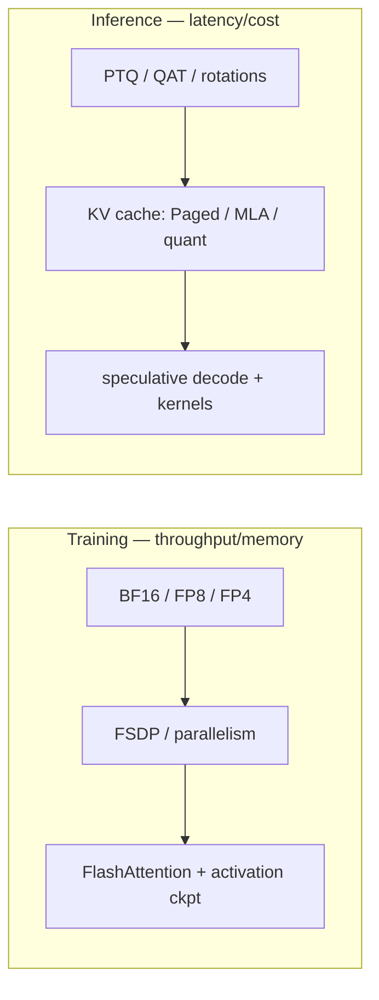

# Mixed Precision & Efficiency

BF16/FP8NVFP4/MXFP4GPTQ/AWQFlashAttentionKV cachespeculative decoding

> [!TIP] Say this first
> Efficiency is where research becomes product. Two clean framings win interviews: (1) *"exponent bits buy range, mantissa bits buy precision"* — that alone explains BF16 vs FP16 vs FP8; (2) *"training and inference have different levers"* — precision/parallelism/activation-memory for training; quantization/kernels/KV-cache/speculation for inference.

## Training vs. inference levers

The pitfall interviewers probe: conflating *training* precision with *deployment* precision. They're different toolboxes with different goals.

*"I trained in FP8" ≠ "I deploy in INT4."* Distillation appears on both sides but for different ends (capacity transfer during training; smaller serving model at inference).

## Number formats

| Format | Exp / Mant | What it buys |
| --- | --- | --- |
| FP32 | 8 / 23 | reference |
| TF32 | 8 / 10 | Ampere+ tensor-core FP32 input mode (truncated mantissa) |
| **BF16** | 8 / 7 | FP32-like range, low precision → stable, often no loss scaling |
| FP16 | 5 / 10 | precise but narrow range → needs loss scaling |
| FP8 E4M3 | 4 / 3 | forward weights/activations |
| FP8 E5M2 | 5 / 2 | gradients (wider range) |
| FP4 E2M1 | 2 / 1 | 4-bit element in NVFP4/MXFP4 blocks |

**BF16 shares FP32's exponent**, so it rarely overflows — the default training precision on modern accelerators. **FP16** has more mantissa but a narrow range, hence loss scaling. **FP8** (Hopper+ via Transformer Engine) is routine at the frontier; the microscaling **4-bit** formats are the 2026 frontier — including for *pretraining*.

### Loss scaling (FP16)

FP16 gradients underflow to zero; scale the loss up before backward, then unscale before the optimizer step. **Dynamic loss scaling**: raise the scale while stable, halve it on overflow. Master weights and optimizer moments stay FP32. BF16's wide range usually makes this unnecessary — a real operational simplification.

### FP4: NVFP4 vs MXFP4 2026

Both use **E2M1** 4-bit elements with a shared per-block scale; they differ in block size and scale format:

<dl class="kv">
<dt>NVFP4</dt><dd>Block <b>16</b>, scale in <b>FP8 E4M3</b> → finer-grained, better dynamic range per block.</dd>
<dt>MXFP4</dt><dd>Block <b>32</b>, scale is a power-of-two <b>E8M0</b> → coarser; reportedly needed ~36% more tokens to match NVFP4 loss in one 8B/1T comparison secondary.</dd>
</dl>

> [!NOTE] 4-bit *pretraining* is real
> NVIDIA pretrained a **12B model on 10T tokens in NVFP4** (the longest documented 4-bit run), matching FP8 loss (arXiv:2509.25149). Stability came from **random Hadamard transforms** (spread outliers), **2D block quantization**, **stochastic rounding**, and keeping a few sensitive layers in higher precision. *(verifiable; hedge exact numbers.)*

Why is BF16 usually preferred over FP16 for training?

**Short:** BF16 keeps FP32's 8 exponent bits, so it has the same dynamic range and rarely overflows/underflows — you typically drop loss scaling entirely. FP16 has more mantissa but a narrow range, so it needs dynamic loss scaling and is more fragile.

**Deep:** training gradients span many orders of magnitude; FP16's max ~65504 and small subnormal floor make overflow/underflow common, which loss scaling patches at the cost of a moving hyperparameter and overflow-retry logic. BF16 trades mantissa (precision) for range, and the reduced precision is tolerable because GEMMs accumulate in FP32. Net: BF16 is simpler and more robust; FP16 only wins on hardware without good BF16 support. **Follow-up:** *What stays FP32?* — master weights, optimizer moments, softmax/cross-entropy, and normalization statistics.

What's the standard FP8 training recipe, and what breaks it?

**Short:** keep forward weights/activations in E4M3 and gradients in E5M2 (wider range), master weights and optimizer moments in FP32/BF16, and **exclude** the numerically sensitive layers — normalization, softmax, and the LM head — from FP8. Per-tensor or per-block scaling (amax tracking, via Transformer Engine) manages the dynamic range.

**Deep:** FP8's ~3 mantissa bits are fine for GEMMs that accumulate in FP32, but activation **outliers** blow up the per-tensor scale and lose the small values; delayed scaling (amax history) can lag a sudden shift and cause a spike, so labs sometimes switch to current/just-in-time scaling early in training. Blackwell's **MXFP8** uses finer block-wise scales to tame outliers vs. per-tensor FP8. Large FP8 pretraining is proven (DeepSeek-V3), but the recipe — which layers stay high-precision, scaling policy, warmup — is what makes it reproduce. **Follow-up:** *FP8 inference vs training?* — inference often quantizes weights only (or with rotations for W4A4); it doesn't need the E5M2 gradient path.

## Quantization for inference

Uniform affine quantization: $x_q=\mathrm{clip}(\mathrm{round}(x/s)+z)$, with scale $s$ and zero-point $z$.

<dl class="kv">
<dt>PTQ</dt><dd>Post-training; calibrate scales on a small set. Fast, no retraining, some accuracy risk.</dd>
<dt>QAT</dt><dd>Fake-quant in the training loop (straight-through estimator for round); recovers accuracy at higher cost.</dd>
<dt>GPTQ</dt><dd>Second-order (Hessian-aware) weight-only PTQ; strong 4-bit weights.</dd>
<dt>AWQ</dt><dd>Activation-aware — protect the salient weight channels; the practical weight-only 4-bit default.</dd>
</dl>

**Rotation-based PTQ** is the 2025–2026 advance for pushing to 4-bit *including activations*: **QuaRot** applies random Hadamard rotations to spread outliers before quantizing; **SpinQuant** *learns* the rotations. Both attack the outlier problem that wrecks naive activation quantization.

Why do rotations (QuaRot/SpinQuant) help low-bit quantization?

**Short:** activation outliers span a huge range and blow up the quantization scale, wasting bits on the whole tensor. An orthogonal rotation (e.g., Hadamard) redistributes that energy across channels so the distribution is more uniform and quantizes cleanly — and being orthogonal, it's mathematically invertible so the model output is unchanged.

**Deep:** a few channels with large magnitude force a large $s$, coarsening every other value. Rotating by an orthogonal matrix $R$ (and folding $R^{-1}=R^\top$ into the adjacent weight) preserves the linear map while smearing outliers into a near-Gaussian spread — reducing the dynamic range each block must cover. QuaRot uses fixed random Hadamard rotations; SpinQuant learns them for a bit more accuracy. This is what makes W4A4 viable where plain AWQ/GPTQ (weight-only) can't go. **Follow-up:** *Weight-only vs weight+activation?* — weight-only (AWQ) is easier and common; W4A4 needs rotations + careful calibration but doubles activation-bandwidth savings.

## FlashAttention: IO-aware attention

Standard attention materializes the $n\times n$ scores in HBM. FlashAttention **tiles** Q/K/V and computes softmax online in SRAM, never storing the full matrix — same math, far less memory traffic, turning attention from memory-bound to compute-bound.

<dl class="kv">
<dt>FA-2</dt><dd>Better work partitioning across warps/threadblocks.</dd>
<dt>FA-3</dt><dd>Hopper/H100: async copies (TMA) + warp specialization + FP8.</dd>
<dt>FA-4</dt><dd>Blackwell (B200/GB200); rewritten in CuTe-DSL. Exists because of <b>asymmetric hardware scaling</b>.</dd>
</dl>

> [!IMPORTANT] "Asymmetric hardware scaling" — a 2026 talking point
> FlashAttention needed a v4 (not just a retuned v3) because on Blackwell, **tensor-core throughput grew ~2× while shared-memory bandwidth and the exp/softmax units scaled much less**. The kernel must be redesigned so the now-relatively-scarce softmax/memory path stops bottlenecking the abundant matmul throughput. Kernels are increasingly *hardware-generation-specific*. *(verifiable direction; hedge exact TFLOPs figures.)*

## KV cache & serving

Autoregressive decoding caches past K/V; the cache grows with context and dominates long-context memory.

<dl class="kv">
<dt>PagedAttention (vLLM)</dt><dd>Virtual-memory-style paging of the KV cache → near-zero fragmentation, high batch throughput.</dd>
<dt>GQA / MQA</dt><dd>Share K/V heads across query heads to shrink the cache (architecture-level).</dd>
<dt>MLA</dt><dd>Multi-head Latent Attention (DeepSeek): compress K/V into a low-rank latent; reported ~2.7–4.7× KV reduction vs GQA secondary.</dd>
<dt>Quantized KV</dt><dd>INT8 ≈ 2×, FP4 ≈ 4× cache reduction.</dd>
</dl>

## Speculative decoding

A cheap **drafter** proposes several tokens; the target model **verifies** them in one parallel forward and accepts the longest correct prefix — same output distribution, fewer sequential target steps.

<dl class="kv">
<dt>Medusa</dt><dd>Extra prediction heads on the target model draft multiple future tokens.</dd>
<dt>EAGLE-1/2/3</dt><dd>A small drafter over the target's hidden states + a draft <i>tree</i>; EAGLE-3 fuses multi-layer features, reported acceptance &gt;75% vendor.</dd>
<dt>MTP</dt><dd>Multi-token prediction trained into the model (DeepSeek-style) → self-speculation.</dd>
</dl>

Now a **default serving layer** (vLLM, TensorRT-LLM, SGLang), not a bonus optimization.

When does speculative decoding help, and when can it hurt?

**Short:** it helps at low batch size / memory-bound decoding where the target GPU is underutilized and drafts are accepted often; it hurts when the batch is already large (compute-bound) or acceptance is low, since rejected drafts waste the verification compute.

**Deep:** decoding is usually memory-bandwidth-bound at small batch — the target does one token's worth of matmul but pays a full weight read. Speculation amortizes that read across several accepted tokens, so speedup ≈ expected accepted length × acceptance rate, minus drafter overhead. At high batch you're already saturating compute, so the extra verification work and rejected tokens can *reduce* throughput. Acceptance depends on drafter–target agreement (domain shift, temperature). **Follow-up:** *Does it change outputs?* — no; verification preserves the target's distribution exactly (that's the correctness guarantee).

## Pruning & distillation

**Pruning** — *unstructured* (zero individual weights: high sparsity, but needs sparse kernels or 2:4 N:M sparsity for real speedup) vs *structured* (drop channels/heads/blocks: hardware-friendly). **Distillation** — a student mimics a teacher's soft distribution (and/or features):

$$
L=\alpha T^2\,\mathrm{KL}(p_T\Vert p_S)+(1-\alpha)\,\mathrm{CE}(y,p_S)
$$

A common 2026 compression pipeline is **prune → quantize (QAT/PTQ) → distill** to recover accuracy. On-device recipe: train at 16-bit, deploy at 4-bit (AWQ/GPTQ). Interview nuance: **FLOPs are a proxy** — decide with measured latency/memory/energy on the *real* device, since low-FLOP ops (depthwise) can be bandwidth-bound and slow.

Product asks for 2× lower latency, ≤1% accuracy drop. Your plan?

**Short:** search the Pareto front in cheap-first order — input resolution / architecture width → distillation → structured pruning → INT8 (or 4-bit) QAT → runtime fusion — and *measure real device latency at every step*, not FLOPs.

**Deep:** (1) sensitivity analysis: which classes/regions break first sets the accuracy budget; (2) cut input resolution / simplify the decoder — often the biggest, cheapest win; (3) distill into a smaller student to preserve accuracy at lower capacity; (4) structured prune (channels/heads) so kernels actually speed up; (5) INT8 QAT for most of the latency, per-channel scales; (6) operator fusion (Conv-BN-ReLU), thread pinning, memory reuse; (7) lock a regression test on a fixed eval subset. The discipline: one change at a time, p50/p95 latency on the target hardware, and let the product metric define "1%." **Follow-up:** *Deploy without A/B?* — canary rollout with latency/error guardrails.

## Cheat-sheet

| Ask | One-liner |
| --- | --- |
| BF16 vs FP16 | Exponent bits = range, mantissa = precision; BF16 = FP32 range, no loss scaling. |
| FP8 recipe | E4M3 forward, E5M2 grads, FP32 master/moments; exclude norm/softmax/LM head. |
| NVFP4 vs MXFP4 | E2M1 elements; NVFP4 block 16 + FP8 scale (finer), MXFP4 block 32 + E8M0 (coarser). |
| PTQ vs QAT | PTQ = calibrate, fast, risky; QAT = fake-quant training, recovers accuracy. |
| GPTQ / AWQ | Hessian-aware vs activation-aware weight-only 4-bit; AWQ is the practical default. |
| Rotation PTQ | QuaRot/SpinQuant spread outliers via orthogonal rotations → enables W4A4. |
| FlashAttention | IO-aware tiled softmax; same math, no $n^2$ matrix in HBM; FA-4 for Blackwell asymmetry. |
| KV cache | PagedAttention + GQA/MLA + quantized KV shrink the long-context bottleneck. |
| Speculative decode | Draft + verify; helps at low batch / memory-bound; preserves output distribution. |
| Compression pipeline | Prune → quantize → distill; decide on measured latency, not FLOPs. |

**Related:** [Distributed Training](#/foundations/distributed-training) · [CNNs, RNNs & Transformers](#/foundations/architectures) · [Normalization & Stability](#/foundations/normalization-stability) · [LLM Fundamentals](#/llm/fundamentals) · [Optimization](#/foundations/optimization)
