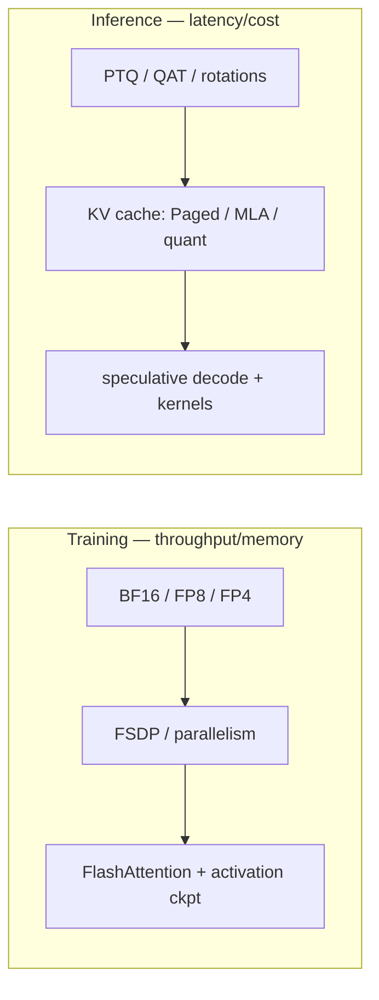

# Mixed Precision & Efficiency

<div class="tag-row"><span class="tag">BF16/FP8</span><span class="tag">NVFP4/MXFP4</span><span class="tag">GPTQ/AWQ</span><span class="tag">FlashAttention</span><span class="tag">KV cache</span><span class="tag">speculative decoding</span></div>

> [!NOTE] This chapter is advanced—you may skip it for now
> **One-line intuition:** computers approximate numbers using a fixed number of bits. **Using fewer bits—lower precision, such as moving from 32 bits to 16, 8, or 4—makes training and inference faster and cheaper**, but going too far hurts accuracy. This chapter collects techniques for reducing bit width while preserving accuracy. Remember one sentence: **"Exponent bits buy range; mantissa bits buy precision."** If you are a beginner, you can return to this chapter later.

> [!TIP] Interview one-liner
> Efficiency is where research becomes product. Two clean framings win interviews: (1) *"exponent bits buy range, mantissa bits buy precision"* — that alone explains BF16 vs FP16 vs FP8; (2) *"training and inference have different levers"* — precision/parallelism/activation-memory for training; quantization/kernels/KV-cache/speculation for inference.

## Training vs. inference levers

The pitfall interviewers probe: conflating *training* precision with *deployment* precision. They're different toolboxes with different goals.



*"I trained in FP8" ≠ "I deploy in INT4."* Distillation appears on both sides but for different ends (capacity transfer during training; smaller serving model at inference).

## Number formats

| Format | Exp / Mant | What it buys |
| --- | --- | --- |
| FP32 | 8 / 23 | reference |
| TF32 | 8 / 10 | Ampere+ tensor-core FP32 input mode (truncated mantissa) |
| **BF16** | 8 / 7 | FP32-like range, low precision → stable, often no loss scaling |
| FP16 | 5 / 10 | precise but narrow range → needs loss scaling |
| FP8 E4M3 | 4 / 3 | forward weights/activations |
| FP8 E5M2 | 5 / 2 | gradients (wider range) |
| FP4 E2M1 | 2 / 1 | 4-bit element in NVFP4/MXFP4 blocks |

**BF16 shares FP32's exponent width**, so it has less overflow risk than FP16 and is a common training precision on modern accelerators with good support. **FP16** has more mantissa but a narrower range, so many training setups use loss scaling. **FP8** and block-scaled **4-bit** formats have also begun to appear in some large-scale training runs when the hardware, kernels, and model recipe support them, but they are not the default for every layer and workload.

### Loss scaling (FP16)

FP16 gradients underflow to zero; scale the loss up before backward, then unscale before the optimizer step. **Dynamic loss scaling**: raise the scale while stable, halve it on overflow. Master weights and optimizer moments stay FP32. BF16's wide range usually makes this unnecessary — a real operational simplification.

> **PyTorch-style pseudocode—ordering is correctness in AMP**

```python
optimizer.zero_grad(set_to_none=True)
with torch.autocast("cuda", dtype=torch.float16):
    logits = model(x)
    loss = criterion(logits, y)

scaler.scale(loss).backward()                 # first enlarge small FP16 gradients
scaler.unscale_(optimizer)                    # restore scale before clipping
torch.nn.utils.clip_grad_norm_(model.parameters(), 1.0)
scaler.step(optimizer)                        # skip the update on overflow
scaler.update()                               # adjust the scale for the next step
```

### FP4: NVFP4 vs MXFP4 <span class="badge badge-2026">2026</span>

Both use **E2M1** 4-bit elements with a shared per-block scale; they differ in block size and scale format:

<dl class="kv">
<dt>NVFP4</dt><dd>Block <b>16</b>, scale in <b>FP8 E4M3</b> → finer-grained, better dynamic range per block.</dd>
<dt>MXFP4</dt><dd>Block <b>32</b>, scale is a power-of-two <b>E8M0</b> → coarser; reportedly needed ~36% more tokens to match NVFP4 loss in one 8B/1T comparison <span class="badge badge-med">secondary</span>.</dd>
</dl>

> [!NOTE] 4-bit *pretraining* is real
> NVIDIA researchers reported an experiment in arXiv:2509.25149 that **pretrained a 12B model at a scale of 10T tokens with NVFP4**, obtaining loss close to an FP8 baseline. The stability recipe combined **random Hadamard transforms** to spread outliers, **2D block quantization**, **stochastic rounding**, and higher precision for selected sensitive layers. This is a result for that model, hardware, and recipe; do not generalize it into a claim that 4-bit training always matches FP8.

<details class="qa"><summary>Why is BF16 usually preferred over FP16 for training?</summary>
<div class="qa-body">

**Short:** BF16 keeps FP32's 8 exponent bits, so it has the same dynamic range and rarely overflows/underflows — you typically drop loss scaling entirely. FP16 has more mantissa but a narrow range, so it needs dynamic loss scaling and is more fragile.

**Deep:** Training gradients span many orders of magnitude. FP16's maximum value is 65504, and small values can underflow, so loss scaling and overflow-skip logic are commonly used. BF16 trades mantissa precision for dynamic range, and many GEMMs accumulate in higher precision, often simplifying training operations. The final choice depends on the accelerator's native throughput, kernel support, and convergence validation. **Follow-up:** *What remains at high precision?* Optimizer state, reductions and accumulation, and sensitive operations such as softmax and normalization use FP32 or BF16 depending on the implementation and recipe.
</div></details>

<details class="qa"><summary>What's the standard FP8 training recipe, and what breaks it?</summary>
<div class="qa-body">

**Short:** A common FP8 recipe considers E4M3 for forward weights and activations and the wider-range E5M2 for gradients, while keeping optimizer state and sensitive operations at higher precision. Modern delayed scaling, current scaling, and block-scaling recipes can assign dtypes differently by implementation. Per-tensor or per-block scales manage dynamic range.

**Deep:** FP8's narrow mantissa and range make it sensitive to activation outliers, so scaling granularity and high-precision exceptions matter. **Follow-up:** *FP8 inference versus training?* Inference does not need an E5M2 gradient path, but deployment is not limited to weight-only quantization. FP8 W8A8 is also used, while weight-only PTQ is especially common for INT4. Check which dtype combinations have fast kernels on the actual accelerator.
</div></details>

## Quantization for inference

Uniform affine quantization: $x_q=\mathrm{clip}(\mathrm{round}(x/s)+z)$, with scale $s$ and zero-point $z$.

<dl class="kv">
<dt>PTQ</dt><dd>Post-training; calibrate scales on a small set. Fast, no retraining, some accuracy risk.</dd>
<dt>QAT</dt><dd>Fake-quant in the training loop (straight-through estimator for round); recovers accuracy at higher cost.</dd>
<dt>GPTQ</dt><dd>Second-order (Hessian-aware) weight-only PTQ; strong 4-bit weights.</dd>
<dt>AWQ</dt><dd>Activation-aware — protect the salient weight channels; the practical weight-only 4-bit default.</dd>
</dl>

**Rotation-based PTQ** is the 2025–2026 advance for pushing to 4-bit *including activations*: **QuaRot** applies random Hadamard rotations to spread outliers before quantizing; **SpinQuant** *learns* the rotations. Both attack the outlier problem that wrecks naive activation quantization.

<details class="qa"><summary>Why do rotations (QuaRot/SpinQuant) help low-bit quantization?</summary>
<div class="qa-body">

**Short:** activation outliers span a huge range and blow up the quantization scale, wasting bits on the whole tensor. An orthogonal rotation (e.g., Hadamard) redistributes that energy across channels so the distribution is more uniform and quantizes cleanly — and being orthogonal, it's mathematically invertible so the model output is unchanged.

**Deep:** A few high-magnitude channels can force a large $s$ and coarsen every other value. If an orthogonal rotation is folded exactly into adjacent linear maps, the function is preserved **before quantization** while outliers spread across channels. After quantization the output is approximate, so calibration must measure the error. A W4A4 activation element is theoretically four times smaller than FP16, but scale metadata, packing, and kernels determine the actual bandwidth and latency gain.
</div></details>

## FlashAttention: IO-aware attention

A naive attention implementation materializes the $n\times n$ score matrix in HBM. FlashAttention **tiles** Q/K/V and computes online softmax in on-chip memory, producing the same attention result within numerical error without storing the full score matrix in HBM. This greatly reduces memory traffic and peak memory, although whether the operation actually shifts from memory-bound to compute-bound depends on sequence length, head dimension, dtype, GPU, and kernel.

The key is not eliminating FLOPs but **eliminating HBM round trips**. Both methods perform the $O(n^2d)$ dot products of dense attention. A naive implementation writes the $n^2$ score and softmax-weight intermediates to HBM and reads them back. FlashAttention loads query and key/value blocks into fast SRAM, materializes only one score tile, folds it into the output statistics, and discards it.

<figure>
<svg viewBox="0 0 720 270" xmlns="http://www.w3.org/2000/svg" font-family="Inter, sans-serif" font-size="11" role="img" aria-labelledby="fa-title-en fa-desc-en">
  <title id="fa-title-en">Memory traffic in naive attention and FlashAttention</title>
  <desc id="fa-desc-en">Naive attention stores the full score and probability matrices in HBM and reads them back. FlashAttention moves Q K and V tiles into SRAM, performs online softmax and output accumulation there, and never stores the full quadratic matrices.</desc>
  <defs><marker id="fa-arrow-en" markerWidth="8" markerHeight="8" refX="6" refY="3" orient="auto"><path d="M0 0 L6 3 L0 6" fill="#98a3b2"/></marker></defs>
  <text x="18" y="30" fill="#e0533f">Naive</text>
  <rect x="85" y="10" width="92" height="42" rx="5" fill="none" stroke="#0ea5e9" stroke-width="1.5"/><text x="131" y="35" text-anchor="middle" fill="currentColor">Q, K, V · HBM</text>
  <rect x="230" y="10" width="95" height="42" rx="5" fill="#e0533f" opacity=".18" stroke="#e0533f"/><text x="277" y="29" text-anchor="middle" fill="currentColor">S=QKᵀ</text><text x="277" y="43" text-anchor="middle" fill="#98a3b2">n×n · HBM</text>
  <rect x="380" y="10" width="105" height="42" rx="5" fill="#e0533f" opacity=".18" stroke="#e0533f"/><text x="432" y="29" text-anchor="middle" fill="currentColor">P=softmax(S)</text><text x="432" y="43" text-anchor="middle" fill="#98a3b2">n×n · HBM</text>
  <rect x="550" y="10" width="92" height="42" rx="5" fill="none" stroke="#12a150" stroke-width="1.5"/><text x="596" y="35" text-anchor="middle" fill="currentColor">O=PV · HBM</text>
  <g stroke="#98a3b2" marker-end="url(#fa-arrow-en)"><path d="M177 31H220"/><path d="M325 31H370"/><path d="M485 31H540"/></g>
  <text x="360" y="78" text-anchor="middle" fill="#e0533f">write → read → write large intermediates: IO bottleneck</text>
  <line x1="18" y1="96" x2="702" y2="96" stroke="#98a3b2" opacity=".4"/>
  <text x="18" y="130" fill="#12a150">Flash</text>
  <rect x="85" y="108" width="112" height="50" rx="5" fill="none" stroke="#0ea5e9" stroke-width="1.5"/><text x="141" y="128" text-anchor="middle" fill="currentColor">Q, K, V · HBM</text><text x="141" y="145" text-anchor="middle" fill="#98a3b2">read by block</text>
  <rect x="250" y="108" width="220" height="96" rx="6" fill="#12a150" opacity=".14" stroke="#12a150" stroke-width="1.7"/>
  <text x="360" y="128" text-anchor="middle" fill="currentColor">on-chip SRAM</text>
  <rect x="270" y="142" width="78" height="38" rx="4" fill="none" stroke="#6366f1"/><text x="309" y="158" text-anchor="middle" fill="currentColor">score tile</text><text x="309" y="172" text-anchor="middle" fill="#98a3b2">QᵦKᵦᵀ</text>
  <rect x="372" y="142" width="78" height="38" rx="4" fill="none" stroke="#6366f1"/><text x="411" y="158" text-anchor="middle" fill="currentColor">online</text><text x="411" y="172" text-anchor="middle" fill="#98a3b2">softmax + O</text>
  <rect x="550" y="108" width="92" height="50" rx="5" fill="none" stroke="#12a150" stroke-width="1.5"/><text x="596" y="128" text-anchor="middle" fill="currentColor">O · HBM</text><text x="596" y="145" text-anchor="middle" fill="#98a3b2">final write only</text>
  <g stroke="#98a3b2" marker-end="url(#fa-arrow-en)"><path d="M197 133H240"/><path d="M470 133H540"/></g>
  <path d="M450 190C500 235 210 235 270 190" fill="none" stroke="#98a3b2" stroke-dasharray="4 3" marker-end="url(#fa-arrow-en)"/>
  <text x="360" y="248" text-anchor="middle" fill="#12a150">next K/V tile: retain running max, denominator, output · no n×n HBM storage</text>
</svg>
<figcaption>FlashAttention is not approximate or sparse attention; it computes the <b>same dense attention in an IO-aware order</b>. Floating-point reduction order may prevent bitwise equality, but the mathematical operation is unchanged.</figcaption>
</figure>

### How can online softmax remain exact?

For one query row, retain the maximum $m$, softmax denominator $\ell$, and unnormalized value numerator $r$ over all tiles seen so far. When a new score tile $s_j$ and values $v_j$ arrive:

$$
\begin{aligned}
m'&=\max(m,\max_j s_j),\\
\ell'&=e^{m-m'}\ell+\sum_j e^{s_j-m'},\\
r'&=e^{m-m'}r+\sum_j e^{s_j-m'}v_j,\qquad o=\frac{r'}{\ell'}.
\end{aligned}
$$

If a later tile contains a larger maximum, multiplying the old accumulators by $e^{m-m'}$ puts them on the same scale. This reconstructs the same stable softmax as seeing all scores at once. During backward, implementations **recompute** tiles rather than storing the $n^2$ probability matrix. The trade is modest extra compute for much less activation storage and memory traffic.

<dl class="kv">
<dt>FA-2</dt><dd>Better work partitioning across warps/threadblocks.</dd>
<dt>FA-3</dt><dd>Hopper/H100: async copies (TMA) + warp specialization + FP8.</dd>
<dt>FA-4</dt><dd>Blackwell (B200/GB200); rewritten in CuTe-DSL. Exists because of <b>asymmetric hardware scaling</b>.</dd>
</dl>

> [!IMPORTANT] "Asymmetric hardware scaling"—a 2026 talking point
> On the Blackwell generation, tensor-core throughput and the softmax and memory paths did not scale at the same rate, so merely retuning an older kernel is insufficient to exploit all the new arithmetic capacity. FlashAttention-4 redesigns scheduling and data movement around this asymmetry. The key lesson is not the version number itself, but that **bottlenecks vary by hardware generation and tensor shape, so end-to-end kernel benchmarks are necessary**.

## KV cache & serving

Autoregressive decoding caches past K/V; the cache grows with context and dominates long-context memory.

To generate token $t$, the only new query is $q_t$. That query must still dot-product with every past key $K_{1:t}$ and use those weights to mix $V_{1:t}$. Past K/V projections do not change when the model and prefix are unchanged, so every layer stores and reuses them. This removes repeated projection of the whole prefix, but cache capacity and the bandwidth required to read the cache at each step become new bottlenecks.

$$
\text{KV bytes}=2\;LBT\,H_{kv}d_h\;b
$$

The factor 2 is for K and V; $L$ is layer count, $B$ batch, $T$ cached tokens, $H_{kv}$ KV heads, $d_h$ head dimension, and $b$ bytes per element. For $L=32,B=1,T=8192,H_{kv}=8,d_h=128$ in BF16 ($b=2$), the cache is **1 GiB**. With $H_{kv}=32$ MHA it would be 4 GiB, making the value of GQA immediately visible.

<figure>
<svg viewBox="0 0 720 270" xmlns="http://www.w3.org/2000/svg" font-family="Inter, sans-serif" font-size="11" role="img" aria-labelledby="kv-title-en kv-desc-en">
  <title id="kv-title-en">KV-cache growth and reads during autoregressive decoding</title>
  <desc id="kv-desc-en">Every transformer layer stores keys and values for past tokens. The current token appends one new key and value, while its query reads every cached key and value. Cache size grows linearly with token and layer count.</desc>
  <defs><marker id="kv-arrow-en" markerWidth="8" markerHeight="8" refX="6" refY="3" orient="auto"><path d="M0 0 L6 3 L0 6" fill="#98a3b2"/></marker></defs>
  <text x="120" y="22" text-anchor="middle" fill="currentColor">per-layer KV cache</text>
  <g fill="#98a3b2"><text x="85" y="48">t₁</text><text x="125" y="48">t₂</text><text x="165" y="48">t₃</text><text x="205" y="48">…</text><text x="245" y="48">tₜ₋₁</text><text x="290" y="48">tₜ</text></g>
  <g>
    <text x="15" y="78" fill="#98a3b2">L1 · K</text><text x="15" y="108" fill="#98a3b2">L1 · V</text>
    <text x="15" y="158" fill="#98a3b2">L2 · K</text><text x="15" y="188" fill="#98a3b2">L2 · V</text>
    <text x="15" y="228" fill="#98a3b2">… L · K/V</text>
    <g fill="#0ea5e9" opacity=".62">
      <rect x="70" y="60" width="32" height="22"/><rect x="107" y="60" width="32" height="22"/><rect x="144" y="60" width="32" height="22"/><rect x="181" y="60" width="32" height="22"/><rect x="218" y="60" width="45" height="22"/>
      <rect x="70" y="90" width="32" height="22"/><rect x="107" y="90" width="32" height="22"/><rect x="144" y="90" width="32" height="22"/><rect x="181" y="90" width="32" height="22"/><rect x="218" y="90" width="45" height="22"/>
      <rect x="70" y="140" width="32" height="22"/><rect x="107" y="140" width="32" height="22"/><rect x="144" y="140" width="32" height="22"/><rect x="181" y="140" width="32" height="22"/><rect x="218" y="140" width="45" height="22"/>
      <rect x="70" y="170" width="32" height="22"/><rect x="107" y="170" width="32" height="22"/><rect x="144" y="170" width="32" height="22"/><rect x="181" y="170" width="32" height="22"/><rect x="218" y="170" width="45" height="22"/>
      <rect x="70" y="210" width="193" height="24"/>
    </g>
    <g fill="#e0533f"><rect x="275" y="60" width="32" height="22"/><rect x="275" y="90" width="32" height="22"/><rect x="275" y="140" width="32" height="22"/><rect x="275" y="170" width="32" height="22"/><rect x="275" y="210" width="32" height="24"/></g>
  </g>
  <line x1="340" y1="25" x2="340" y2="245" stroke="#98a3b2" opacity=".45"/>
  <rect x="390" y="48" width="112" height="44" rx="5" fill="#e0533f" opacity=".18" stroke="#e0533f"/><text x="446" y="67" text-anchor="middle" fill="currentColor">current token</text><text x="446" y="83" text-anchor="middle" fill="#98a3b2">compute qₜ, kₜ, vₜ</text>
  <rect x="560" y="48" width="120" height="44" rx="5" fill="#12a150" opacity=".16" stroke="#12a150"/><text x="620" y="67" text-anchor="middle" fill="currentColor">append K/V</text><text x="620" y="83" text-anchor="middle" fill="#98a3b2">linear token growth</text>
  <path d="M502 70H550" stroke="#98a3b2" marker-end="url(#kv-arrow-en)"/>
  <path d="M446 100C446 151 344 151 308 108" fill="none" stroke="#6366f1" stroke-width="1.6" marker-end="url(#kv-arrow-en)"/>
  <text x="505" y="139" text-anchor="middle" fill="#6366f1">qₜ reads every cached K to form scores</text>
  <path d="M308 178C370 206 478 205 545 177" fill="none" stroke="#12a150" stroke-width="1.6" marker-end="url(#kv-arrow-en)"/>
  <text x="500" y="226" text-anchor="middle" fill="#12a150">weights read every V to form the output</text>
  <text x="190" y="260" text-anchor="middle" fill="#98a3b2">blue=reused · red=added this step</text>
</svg>
<figcaption>A KV cache does not make compute free; it <b>trades recomputation of past projections for cache reads</b>. At long context or large batch, cache bandwidth and memory capacity can dominate serving.</figcaption>
</figure>

<dl class="kv">
<dt>PagedAttention (vLLM)</dt><dd>Allocate KV cache in fixed-size, noncontiguous blocks to reduce fragmentation and empty reserved capacity. Unlike FlashAttention, its central concern is <b>cache memory management</b>, not different attention mathematics.</dd>
<dt>GQA / MQA</dt><dd>Share K/V heads across query heads to shrink the cache (architecture-level).</dd>
<dt>MLA</dt><dd>Multi-head Latent Attention (DeepSeek): compress K/V into a low-rank latent; reported ~2.7–4.7× KV reduction vs GQA <span class="badge badge-med">secondary</span>.</dd>
<dt>Quantized KV</dt><dd>INT8 ≈ 2×, FP4 ≈ 4× cache reduction.</dd>
<dt>Prefix / prompt caching</dt><dd>Reuse the KV of a shared prefix (system prompt, RAG context, few-shot) across requests → skip re-prefilling it. Big win for agents and long fixed contexts.</dd>
<dt>Chunked prefill</dt><dd>Split a long prompt's prefill into chunks and interleave them with ongoing decode steps in the same batch → smoother latency, no head-of-line blocking from one huge prompt.</dd>
<dt>Disaggregated serving</dt><dd>Run <b>prefill</b> and <b>decode</b> on <i>separate</i> worker pools (their compute profiles differ), streaming the KV between them → each phase scales independently. A 2025–2026 production pattern.</dd>
</dl>

> [!NOTE] Where the serving story continues
> These are the phase-level and cluster-level serving levers. The end-to-end design — routing, autoscaling, TTFT/TPOT SLOs, cost-per-token, and where each of these fits — is in [Designing LLM/Agent Systems](#/system-design/llm-systems). The prefill-vs-decode split that motivates all of it is in [LLM Fundamentals §6](#/llm/fundamentals).

## Speculative decoding

A cheap **drafter** proposes several tokens and the target model verifies them in parallel. Under greedy decoding, appending only tokens that match the target preserves the result. Under sampling, preserving the target distribution requires the full **exact speculative-sampling algorithm**, including rejection and residual sampling. Merely checking draft tokens and keeping a prefix does not automatically preserve the same distribution.

The speed mechanism is that the target does **not** call itself sequentially once per draft token. It runs one forward pass over the entire draft and computes target logits for several positions in parallel. If four tokens are drafted and the first two are accepted, one target invocation can advance multiple tokens and amortize the target's weight reads.

<figure>
<svg viewBox="0 0 720 235" xmlns="http://www.w3.org/2000/svg" font-family="Inter, sans-serif" font-size="11" role="img" aria-labelledby="spec-title-en spec-desc-en">
  <title id="spec-title-en">Draft and parallel verification in speculative decoding</title>
  <desc id="spec-desc-en">A small drafter proposes tokens A B C D sequentially. A large target computes logits at all four positions in one parallel forward pass. A and B are accepted; when C mismatches, corrected token X is selected and the remaining draft is discarded.</desc>
  <defs><marker id="spec-arrow-en" markerWidth="8" markerHeight="8" refX="6" refY="3" orient="auto"><path d="M0 0 L6 3 L0 6" fill="#98a3b2"/></marker></defs>
  <text x="20" y="48" fill="#98a3b2">small drafter</text>
  <rect x="125" y="25" width="70" height="42" rx="5" fill="#0ea5e9" opacity=".62"/><text x="160" y="50" text-anchor="middle" fill="currentColor">A</text>
  <rect x="215" y="25" width="70" height="42" rx="5" fill="#0ea5e9" opacity=".62"/><text x="250" y="50" text-anchor="middle" fill="currentColor">B</text>
  <rect x="305" y="25" width="70" height="42" rx="5" fill="#0ea5e9" opacity=".62"/><text x="340" y="50" text-anchor="middle" fill="currentColor">C</text>
  <rect x="395" y="25" width="70" height="42" rx="5" fill="#0ea5e9" opacity=".62"/><text x="430" y="50" text-anchor="middle" fill="currentColor">D</text>
  <g stroke="#98a3b2" marker-end="url(#spec-arrow-en)"><path d="M195 46H205"/><path d="M285 46H295"/><path d="M375 46H385"/></g>
  <text x="520" y="50" fill="#98a3b2">cheap, sequential proposals</text>
  <path d="M295 76V104" stroke="#98a3b2" marker-end="url(#spec-arrow-en)"/>
  <text x="20" y="134" fill="#98a3b2">large target</text>
  <rect x="125" y="105" width="340" height="52" rx="6" fill="#6366f1" opacity=".18" stroke="#6366f1" stroke-width="1.5"/>
  <text x="295" y="126" text-anchor="middle" fill="currentColor">one forward over [prefix, A, B, C, D]</text>
  <text x="295" y="145" text-anchor="middle" fill="#98a3b2">target distributions for all positions in parallel</text>
  <text x="520" y="134" fill="#6366f1">one expensive target call</text>
  <path d="M295 157V183" stroke="#98a3b2" marker-end="url(#spec-arrow-en)"/>
  <text x="20" y="212" fill="#98a3b2">result</text>
  <g>
    <rect x="125" y="184" width="70" height="36" rx="5" fill="#12a150" opacity=".62"/><text x="160" y="206" text-anchor="middle" fill="currentColor">A ✓</text>
    <rect x="215" y="184" width="70" height="36" rx="5" fill="#12a150" opacity=".62"/><text x="250" y="206" text-anchor="middle" fill="currentColor">B ✓</text>
    <rect x="305" y="184" width="70" height="36" rx="5" fill="#e0533f" opacity=".58"/><text x="340" y="206" text-anchor="middle" fill="currentColor">C ✕</text>
    <rect x="395" y="184" width="70" height="36" rx="5" fill="#12a150" opacity=".28"/><text x="430" y="206" text-anchor="middle" fill="currentColor">take X</text>
  </g>
  <text x="520" y="201" fill="#12a150">2 drafts accepted + correction</text><text x="520" y="218" fill="#98a3b2">discard draft after C</text>
</svg>
<figcaption>For greedy decoding, accept the longest prefix that matches the target and use the target token at the first mismatch. Sampling requires the rejection and residual-sampling correction below rather than simple equality.</figcaption>
</figure>

In standard speculative sampling, let $q$ be the drafter distribution and $p$ the target distribution. Accept a proposal $x\sim q$ with probability

$$
a(x)=\min\!\left(1,\frac{p(x)}{q(x)}\right).
$$

On rejection, sample a correction from the normalized **residual distribution** $\max(p-q,0)$. This correction exactly removes the drafter's bias, so the final sample has target marginal distribution $p$. If all $\gamma$ draft tokens are accepted, sample one additional token from the already-computed target distribution at the next position, allowing one target call to advance by as many as $\gamma+1$ tokens. A token with `q(x)=0` is never drafted; implementations must still handle zero division and finite precision safely.

<dl class="kv">
<dt>Medusa</dt><dd>Extra prediction heads on the target model draft multiple future tokens.</dd>
<dt>EAGLE-1/2/3</dt><dd>A small drafter over the target's hidden states + a draft <i>tree</i>; EAGLE-3 fuses multi-layer features, reported acceptance &gt;75% <span class="badge badge-med">vendor</span>.</dd>
<dt>MTP</dt><dd>Multi-token prediction trained into the model (DeepSeek-style) → self-speculation.</dd>
</dl>

Major serving runtimes support it as an option, but it is not the default for every workload. When acceptance is low or batching is already compute-bound, overhead can erase the gain, so measure it on the real request distribution.

| Technique | Waste it removes | What it does not remove |
| --- | --- | --- |
| FlashAttention | HBM traffic from $n^2$ attention intermediates | $O(n^2)$ FLOPs of dense attention |
| KV cache | recomputing K/V projections for past tokens | reading the full cache each decode step |
| Speculative decoding | sequential one-token target-model calls | target verification and drafter cost |

<details class="qa"><summary>When does speculative decoding help, and when can it hurt?</summary>
<div class="qa-body">

**Short:** it helps at low batch size / memory-bound decoding where the target GPU is underutilized and drafts are accepted often; it hurts when the batch is already large (compute-bound) or acceptance is low, since rejected drafts waste the verification compute.

**Deep:** Small-batch decoding is often memory-bandwidth-bound, so verifying several tokens at once can amortize weight reads. But speedup depends jointly on draft length, acceptance, target batch size, and drafter cost; a simple product does not predict it reliably. **Follow-up:** *Does it change outputs?* Greedy decoding preserves output through exact-token verification, while sampling preserves the target distribution only when the formal rejection and residual-sampling procedure is implemented.
</div></details>

## Pruning & distillation

**Pruning** — *unstructured* (zero individual weights: high sparsity, but needs sparse kernels or 2:4 N:M sparsity for real speedup) vs *structured* (drop channels/heads/blocks: hardware-friendly). **Distillation** — a student mimics a teacher's soft distribution (and/or features):

$$
L=\alpha T^2\,\mathrm{KL}(p_T\Vert p_S)+(1-\alpha)\,\mathrm{CE}(y,p_S)
$$

A common 2026 compression pipeline is **prune → quantize (QAT/PTQ) → distill** to recover accuracy. On-device recipe: train at 16-bit, deploy at 4-bit (AWQ/GPTQ). Interview nuance: **FLOPs are a proxy** — decide with measured latency/memory/energy on the *real* device, since low-FLOP ops (depthwise) can be bandwidth-bound and slow.

<details class="qa"><summary>Product asks for 2× lower latency, ≤1% accuracy drop. Your plan?</summary>
<div class="qa-body">

**Short:** search the Pareto front in cheap-first order — input resolution / architecture width → distillation → structured pruning → INT8 (or 4-bit) QAT → runtime fusion — and *measure real device latency at every step*, not FLOPs.

**Deep:** (1) sensitivity analysis: which classes/regions break first sets the accuracy budget; (2) cut input resolution / simplify the decoder — often the biggest, cheapest win; (3) distill into a smaller student to preserve accuracy at lower capacity; (4) structured prune (channels/heads) so kernels actually speed up; (5) INT8 QAT for most of the latency, per-channel scales; (6) operator fusion (Conv-BN-ReLU), thread pinning, memory reuse; (7) lock a regression test on a fixed eval subset. The discipline: one change at a time, p50/p95 latency on the target hardware, and let the product metric define "1%." **Follow-up:** *Deploy without A/B?* — canary rollout with latency/error guardrails.
</div></details>

## Cheat-sheet

| Ask | One-liner |
| --- | --- |
| BF16 vs FP16 | Exponent bits = range, mantissa = precision; BF16 = FP32 range, no loss scaling. |
| FP8 recipe | E4M3 forward, E5M2 grads, FP32 master/moments; exclude norm/softmax/LM head. |
| NVFP4 vs MXFP4 | E2M1 elements; NVFP4 block 16 + FP8 scale (finer), MXFP4 block 32 + E8M0 (coarser). |
| PTQ vs QAT | PTQ = calibrate, fast, risky; QAT = fake-quant training, recovers accuracy. |
| GPTQ / AWQ | Hessian-aware vs activation-aware weight-only 4-bit; AWQ is the practical default. |
| Rotation PTQ | QuaRot/SpinQuant spread outliers via orthogonal rotations → enables W4A4. |
| FlashAttention | IO-aware tiled softmax; same math, no $n^2$ matrix in HBM; FA-4 for Blackwell asymmetry. |
| KV cache | PagedAttention + GQA/MLA + quantized KV shrink the long-context bottleneck. |
| Speculative decode | Draft + verify; helps at low batch / memory-bound; preserves output distribution. |
| Compression pipeline | Prune → quantize → distill; decide on measured latency, not FLOPs. |

**Related:** [Distributed Training](#/foundations/distributed-training) · [CNNs, RNNs & Transformers](#/foundations/architectures) · [Normalization & Stability](#/foundations/normalization-stability) · [LLM Fundamentals](#/llm/fundamentals) · [Optimization](#/foundations/optimization)
