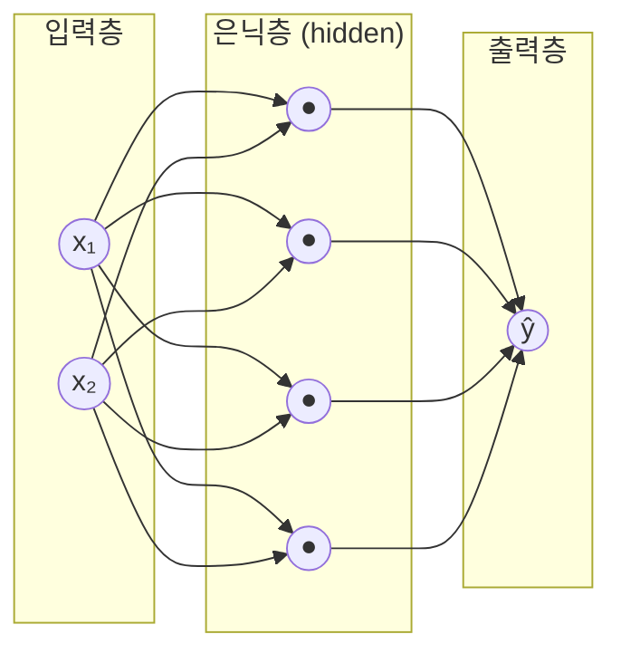
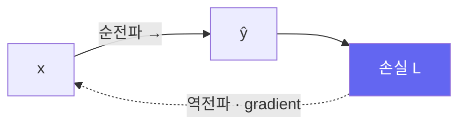

# 신경망 첫걸음: 뉴런에서 MLP까지

> [!NOTE] 이 챕터의 목표
> [머신러닝이란?](#/foundations/what-is-ml)에서 본 "직선 하나"를 이제 **신경망**으로 키웁니다. 뉴런 하나가 무엇인지 → 왜 여러 개를 층으로 쌓는지 → 왜 활성화 함수가 없으면 아무리 쌓아도 소용없는지를, 그림과 짧은 코드로 잡습니다. 이 그림이 CNN·Transformer·LLM까지 그대로 확장됩니다.

## 뉴런 하나 = 가중합 + 활성화

인공 뉴런은 뇌를 흉내 낸 이름일 뿐, 실제로는 아주 단순한 계산입니다. 입력 몇 개를 받아 **각각에 가중치를 곱해 더하고(가중합)**, 거기에 **활성화 함수**를 한 번 통과시킵니다.

$$
z = w_1 x_1 + w_2 x_2 + \dots + w_n x_n + b, \qquad a = \sigma(z)
$$

- $x$: 입력, $w$: 가중치(중요도), $b$: 편향(bias, 기준선 이동)
- $z$: 가중합(전-활성화, pre-activation)
- $\sigma$: 활성화 함수(비선형), $a$: 뉴런의 출력

<figure>
<svg viewBox="0 0 640 220" xmlns="http://www.w3.org/2000/svg" font-family="Inter, sans-serif" font-size="13">
  <!-- inputs -->
  <circle cx="70" cy="55" r="20" fill="none" stroke="#0ea5e9" stroke-width="1.8"/><text x="70" y="60" text-anchor="middle" fill="currentColor">x₁</text>
  <circle cx="70" cy="120" r="20" fill="none" stroke="#0ea5e9" stroke-width="1.8"/><text x="70" y="125" text-anchor="middle" fill="currentColor">x₂</text>
  <circle cx="70" cy="185" r="20" fill="none" stroke="#0ea5e9" stroke-width="1.8"/><text x="70" y="190" text-anchor="middle" fill="currentColor">x₃</text>
  <!-- weighted edges (animated pulse) -->
  <line x1="90" y1="55" x2="290" y2="115" stroke="#98a3b2" stroke-width="1.5"/><text x="180" y="78" fill="#e0533f">w₁</text>
  <line x1="90" y1="120" x2="290" y2="120" stroke="#98a3b2" stroke-width="1.5"/><text x="180" y="112" fill="#e0533f">w₂</text>
  <line x1="90" y1="185" x2="290" y2="125" stroke="#98a3b2" stroke-width="1.5"/><text x="180" y="170" fill="#e0533f">w₃</text>
  <circle r="4" fill="#e0533f"><animateMotion dur="1.6s" repeatCount="indefinite" path="M90 55 L290 115"/></circle>
  <circle r="4" fill="#e0533f"><animateMotion dur="1.6s" begin="0.3s" repeatCount="indefinite" path="M90 120 L290 120"/></circle>
  <circle r="4" fill="#e0533f"><animateMotion dur="1.6s" begin="0.6s" repeatCount="indefinite" path="M90 185 L290 125"/></circle>
  <!-- neuron body -->
  <rect x="290" y="90" width="140" height="60" rx="10" fill="#6366f1"/>
  <text x="360" y="115" text-anchor="middle" fill="#fff" font-size="12">Σ wᵢxᵢ + b</text>
  <text x="360" y="138" text-anchor="middle" fill="#fff" font-size="12">→ σ(z)</text>
  <!-- output -->
  <line x1="430" y1="120" x2="540" y2="120" stroke="#98a3b2" stroke-width="1.5" marker-end="url(#a2)"/>
  <circle cx="575" cy="120" r="24" fill="none" stroke="#12a150" stroke-width="2"/><text x="575" y="125" text-anchor="middle" fill="currentColor">a</text>
  <defs><marker id="a2" markerWidth="8" markerHeight="8" refX="6" refY="3" orient="auto"><path d="M0 0 L6 3 L0 6" fill="#98a3b2"/></marker></defs>
</svg>
<figcaption>뉴런 하나: 입력에 가중치를 곱해 모두 더하고(Σ), 활성화 σ를 통과시켜 출력 a를 냅니다. 빨간 점은 신호가 가중치를 타고 흐르는 모습입니다.</figcaption>
</figure>

> [!TIP] 이미 아는 것과 연결하기
> 활성화 없이 $a = z = w\cdot x + b$만 보면, 이것은 [머신러닝이란?](#/foundations/what-is-ml)의 직선과 같은 **affine map**입니다. 이 출력을 연속값 예측에 쓰고 회귀 손실로 학습할 때에만 선형 회귀 모델이 됩니다. 신경망은 affine map 사이에 비선형성을 넣어 이어 붙인 함수입니다.

## 왜 활성화 함수가 반드시 필요한가

여기가 초보자가 꼭 짚고 가야 할 지점입니다. **선형 변환을 아무리 여러 번 쌓아도 결국 하나의 선형 변환입니다.** $W_2(W_1 x) = (W_2 W_1)x$ 이므로, 활성화가 없으면 100층을 쌓아도 1층짜리와 표현력이 같습니다.

활성화 함수 $\sigma$가 사이사이에 **비선형성(꺾임)** 을 넣어 줘야, 신경망이 곡선·경계 같은 복잡한 패턴을 표현할 수 있습니다.

<div class="widget" data-widget="activation"></div>

<dl class="kv">
<dt>ReLU</dt><dd>$\max(0, z)$. 음수는 0으로, 양수는 그대로. CNN·MLP의 대표적 기본값이며 계산이 쌉니다. 음수 영역의 gradient가 0인 dead-ReLU는 주의.</dd>
<dt>Sigmoid</dt><dd>$1/(1+e^{-z})$. 출력을 0~1로 눌러줌 — 확률 해석에 좋지만 깊은 망에서는 gradient가 사라짐(vanishing).</dd>
<dt>Tanh</dt><dd>−1~1. sigmoid의 0-중심 버전.</dd>
<dt>GELU / SiLU</dt><dd>ReLU의 매끄러운 사촌. GELU는 Transformer에서, SiLU/Swish는 여러 현대 CNN·언어 모델에서 흔하지만 아키텍처마다 다릅니다.</dd>
</dl>

## 층을 쌓으면 MLP

뉴런을 **나란히** 여러 개 두면 한 **층(layer)**, 층을 **앞뒤로** 쌓으면 **다층 퍼셉트론(MLP, Multi-Layer Perceptron)** 입니다. 각 층은 행렬 곱 한 번 + 활성화 한 번으로 요약됩니다:

$$
h_1 = \sigma(W_1 x + b_1), \quad h_2 = \sigma(W_2 h_1 + b_2), \quad \hat{y} = W_3 h_2 + b_3
$$



- **입력층**: 데이터가 들어오는 곳 (특징 개수만큼 뉴런)
- **은닉층(hidden layer)**: 중간 표현을 만드는 곳. 깊고 넓을수록 표현력↑ (대신 과대적합·비용↑)
- **출력층**: 최종 예측. 회귀는 보통 실수값, 다중 클래스 분류는 class별 **logit**, 이진·다중 레이블 분류는 label별 logit을 냅니다. PyTorch의 `CrossEntropyLoss`/`BCEWithLogitsLoss`에는 softmax/sigmoid를 미리 적용하지 않습니다.

> [!NOTE] "깊다(deep)"의 의미
> 은닉층이 여러 개면 **딥러닝(deep learning)**. 층을 깊게 쌓으면 앞쪽 층은 단순한 특징(모서리, 색), 뒤쪽 층은 복잡한 특징(눈, 얼굴)을 계층적으로 학습합니다 — 사람이 특징을 설계하지 않아도요. 이게 딥러닝이 강력한 이유입니다.

## 순전파(forward pass) — 직접 계산해 보기

입력이 층을 차례로 통과해 예측이 나오는 과정을 **순전파(forward pass)** 라고 합니다. 방금 식을 그대로 NumPy로 옮겨 봅시다. 아래 에디터에서 2층 MLP의 순전파를 구현하세요 (활성화는 ReLU, 출력층은 활성화 없음).

<div class="widget" data-widget="code">
<script type="application/json" class="code-config">
{"func":"mlp_forward","packages":["numpy"],"approx":true,"starter":"def mlp_forward(x, W1, b1, W2, b2):\n    # x:(n,) 입력 벡터.  h = ReLU(W1 @ x + b1);  y = W2 @ h + b2  를 계산해 y 를 리스트로 반환.\n    # ReLU(z) = max(0, z) 를 원소별로.\n    import numpy as np\n    x = np.asarray(x, float); W1 = np.asarray(W1, float); b1 = np.asarray(b1, float)\n    W2 = np.asarray(W2, float); b2 = np.asarray(b2, float)\n    # TODO: h 와 y 를 계산하세요\n    return y.tolist()","tests":[{"args":[[1,1],[[1,0],[0,1],[1,1]],[0,0,0],[[1,1,1]],[0]],"expect":[4.0]},{"args":[[1,-2],[[1,0],[0,1],[1,1]],[0,0,0],[[1,1,1]],[0]],"expect":[1.0]},{"args":[[2,3],[[1,1]],[ -10],[[2]],[1]],"expect":[1.0]}],"solution":"import numpy as np\n\ndef mlp_forward(x, W1, b1, W2, b2):\n    x = np.asarray(x, float); W1 = np.asarray(W1, float); b1 = np.asarray(b1, float)\n    W2 = np.asarray(W2, float); b2 = np.asarray(b2, float)\n    h = np.maximum(0, W1 @ x + b1)   # ReLU\n    y = W2 @ h + b2\n    return y.tolist()"}
</script>
</div>

세 번째 테스트를 보세요: 입력 $(2,3)$에 $W_1=[1,1], b_1=-10$이면 $z = 2+3-10 = -5$, ReLU로 0이 되고, 출력은 $2\cdot0+1 = 1$. ReLU가 음수 신호를 "꺼버리는" 게 바로 비선형성이 하는 일입니다.

## 학습은 어떻게? — 역전파 예고

순전파로 예측을 냈으면, [머신러닝이란?](#/foundations/what-is-ml)의 루프대로 **손실 → 기울기 → 갱신**을 합니다. 문제는 "은닉층 깊숙한 곳의 $W_1$을 어느 방향으로 바꿔야 손실이 줄지"를 아는 것입니다. 이걸 효율적으로 계산하는 알고리즘이 **역전파(backpropagation)** 이고, 출력 쪽 오차를 입력 쪽으로 **연쇄법칙(chain rule)** 을 따라 거꾸로 흘려보냅니다.



역전파의 실제 유도와 손으로 계산하는 예제는 [선형대수 & 미적분](#/foundations/linear-algebra-calculus)에서 이어집니다. 지금은 **"순전파로 예측, 역전파로 학습 신호"** 라는 큰 그림만 가져가면 충분합니다.

## 실전 최소 단위 — 빠진 단계 없는 학습 루프

아래는 다중 클래스 분류의 정본(canonical) 루프입니다. 핵심은 `train()`/`eval()` 전환, 매 step의 gradient 초기화, **raw logits**에 대한 손실, validation에서 gradient 비활성화, 그리고 batch 평균의 단순 평균이 아니라 **샘플 수로 가중한 집계**입니다.

```python
import copy
import torch

criterion = torch.nn.CrossEntropyLoss()       # raw logits + class index
optimizer = torch.optim.AdamW(model.parameters(), lr=3e-4, weight_decay=0.01)
scheduler = torch.optim.lr_scheduler.CosineAnnealingLR(optimizer, T_max=num_epochs)

best_val = float("inf")
best_state = None

for epoch in range(num_epochs):
    model.train()
    train_loss_sum = 0.0
    train_count = 0

    for x, y in train_loader:
        x, y = x.to(device), y.to(device)
        optimizer.zero_grad(set_to_none=True)

        logits = model(x)                     # softmax를 미리 적용하지 않는다
        loss = criterion(logits, y)
        loss.backward()
        # torch.nn.utils.clip_grad_norm_(model.parameters(), 1.0)  # 필요할 때만
        optimizer.step()

        batch_size = y.shape[0]
        train_loss_sum += loss.detach().item() * batch_size
        train_count += batch_size

    model.eval()
    val_loss_sum = 0.0
    val_correct = 0
    val_count = 0
    with torch.inference_mode():
        for x, y in val_loader:
            x, y = x.to(device), y.to(device)
            logits = model(x)
            loss = criterion(logits, y)

            batch_size = y.shape[0]
            val_loss_sum += loss.item() * batch_size
            val_correct += (logits.argmax(dim=1) == y).sum().item()
            val_count += batch_size

    if train_count == 0 or val_count == 0:
        raise ValueError("train_loader와 val_loader는 비어 있으면 안 됩니다")
    train_loss = train_loss_sum / train_count
    val_loss = val_loss_sum / val_count
    val_accuracy = val_correct / val_count

    scheduler.step()                           # 이 scheduler는 epoch마다 갱신
    if val_loss < best_val:
        best_val = val_loss
        best_state = copy.deepcopy(model.state_dict())

model.load_state_dict(best_state)
# test_loader는 모델·하이퍼파라미터 선택이 끝난 뒤 한 번 평가한다.
```

<div class="callout callout-warning">
<div class="callout-title">루프를 확장할 때 생기는 단골 버그</div>

- **Gradient accumulation:** 각 micro-batch loss를 accumulation step 수로 나누고 정해진 경계에서만 `step()`합니다. 마지막 묶음이 덜 찼다면 실제 묶음 수에 맞춰 scaling해야 하며, `zero_grad()`를 micro-batch마다 호출하면 accumulation이 사라집니다.
- **AMP:** `autocast`와 `GradScaler`(FP16에서 필요)를 함께 쓰고, clipping은 scaler의 `unscale_` 뒤에 합니다. BF16은 보통 scaler가 필요 없지만 하드웨어 지원을 확인합니다.
- **Scheduler:** 어떤 scheduler는 optimizer **step마다**, 어떤 것은 epoch마다, `ReduceLROnPlateau`는 validation metric을 받아 갱신합니다. 문서의 계약을 확인하세요.
- **Distributed training:** metric의 합과 표본 수를 rank 간 `all_reduce`해야 전체 평균입니다. `DistributedSampler.set_epoch(epoch)`도 빠뜨리지 않습니다.
- **Checkpoint:** 모델뿐 아니라 optimizer, scheduler, scaler, epoch, RNG 상태까지 저장해야 정확히 재개할 수 있습니다. best checkpoint 선택에는 validation만 쓰고 test는 반복 열람하지 않습니다.
</div>

## Q&A

<details class="qa"><summary>은닉층은 몇 개, 뉴런은 몇 개로 해야 하나요?</summary>
<div class="qa-body">

**짧게:** 정답 공식은 없고, 데이터 양·문제 난이도에 맞춰 실험으로 찾습니다.

**깊게:** 너무 작으면 패턴을 못 담고(과소적합), 너무 크면 잡음까지 외우고(과대적합) 학습이 비쌉니다. 실무 출발점은 "일단 과대적합될 만큼 크게 만든 뒤 [regularization](#/foundations/regularization-generalization)으로 억제"입니다. 이론적으로는 **universal approximation theorem**: 은닉층 하나로도 충분한 뉴런만 있으면 어떤 연속 함수든 근사할 수 있습니다 — 하지만 "가능하다"와 "학습으로 도달하기 쉽다"는 다르며, 그래서 실무는 깊게 쌓습니다.
</div></details>

<details class="qa"><summary>왜 가중치를 0으로 초기화하면 안 되나요?</summary>
<div class="qa-body">

**짧게:** 모든 뉴런이 똑같아져서(대칭) 서로 다른 특징을 못 배웁니다.

**깊게:** 한 층의 모든 가중치가 같으면 모든 뉴런이 같은 출력, 같은 gradient를 받아 영원히 동일하게 갱신됩니다(symmetry breaking 실패). 그래서 작은 **무작위 값**으로 초기화하되, 신호/gradient의 크기가 층을 지나며 폭발하거나 사라지지 않도록 분산을 맞춥니다(Xavier/He 초기화) — 자세히는 [Normalization & 학습 안정성](#/foundations/normalization-stability).
</div></details>

## Cheat-sheet

| 개념 | 한 줄 |
| --- | --- |
| 뉴런 | 가중합 $z=w\cdot x+b$ 뒤에 활성화 $a=\sigma(z)$ |
| 활성화가 필요한 이유 | 없으면 층을 쌓아도 선형 1개와 동일 |
| MLP | 층 = 행렬곱+활성화, 여러 층을 쌓은 것 |
| 순전파 | 입력→출력 방향으로 예측 계산 |
| 역전파 | 손실의 gradient를 출력→입력으로 연쇄법칙 전파 |
| 초기화 | 0 금지(대칭), 작은 무작위(He/Xavier) |

**다음:** [선형대수 & 미적분](#/foundations/linear-algebra-calculus) · [Optimization](#/foundations/optimization) · [CNNs, RNNs & Transformers](#/foundations/architectures)
