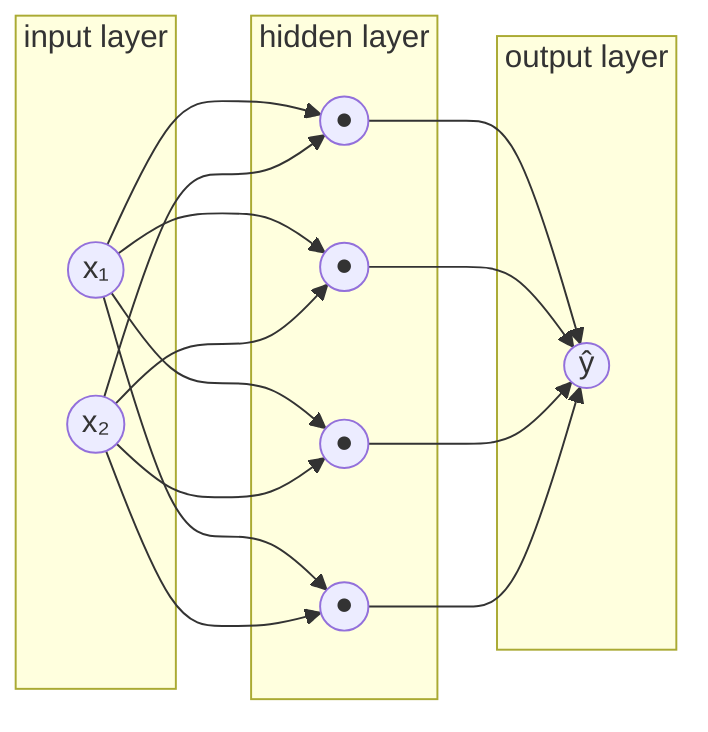
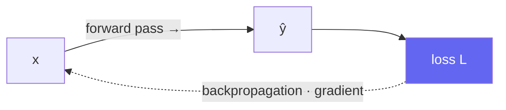

# Neural Networks from First Principles: From Neurons to MLPs

> [!NOTE] Goal of this chapter
> We will grow the "single line" from [What Is Machine Learning?](#/foundations/what-is-ml) into a **neural network**. Through diagrams and short code examples, you will see what one neuron does, why we arrange many neurons into layers, and why stacking layers is pointless without activation functions. The same picture scales all the way to CNNs, Transformers, and LLMs.

## One neuron = weighted sum + activation

An artificial neuron borrows its name from the brain, but the calculation itself is simple. It takes several inputs, **multiplies each by a weight and adds them together (a weighted sum)**, then passes the result through an **activation function**.

$$
z = w_1 x_1 + w_2 x_2 + \dots + w_n x_n + b, \qquad a = \sigma(z)
$$

- $x$: input; $w$: weight, or importance; $b$: bias, which shifts the baseline
- $z$: weighted sum, also called the pre-activation
- $\sigma$: nonlinear activation function; $a$: neuron output

<figure>
<svg viewBox="0 0 640 220" xmlns="http://www.w3.org/2000/svg" font-family="Inter, sans-serif" font-size="13">
  <!-- inputs -->
  <circle cx="70" cy="55" r="20" fill="none" stroke="#0ea5e9" stroke-width="1.8"/><text x="70" y="60" text-anchor="middle" fill="currentColor">x₁</text>
  <circle cx="70" cy="120" r="20" fill="none" stroke="#0ea5e9" stroke-width="1.8"/><text x="70" y="125" text-anchor="middle" fill="currentColor">x₂</text>
  <circle cx="70" cy="185" r="20" fill="none" stroke="#0ea5e9" stroke-width="1.8"/><text x="70" y="190" text-anchor="middle" fill="currentColor">x₃</text>
  <!-- weighted edges (animated pulse) -->
  <line x1="90" y1="55" x2="290" y2="115" stroke="#98a3b2" stroke-width="1.5"/><text x="180" y="78" fill="#e0533f">w₁</text>
  <line x1="90" y1="120" x2="290" y2="120" stroke="#98a3b2" stroke-width="1.5"/><text x="180" y="112" fill="#e0533f">w₂</text>
  <line x1="90" y1="185" x2="290" y2="125" stroke="#98a3b2" stroke-width="1.5"/><text x="180" y="170" fill="#e0533f">w₃</text>
  <circle r="4" fill="#e0533f"><animateMotion dur="1.6s" repeatCount="indefinite" path="M90 55 L290 115"/></circle>
  <circle r="4" fill="#e0533f"><animateMotion dur="1.6s" begin="0.3s" repeatCount="indefinite" path="M90 120 L290 120"/></circle>
  <circle r="4" fill="#e0533f"><animateMotion dur="1.6s" begin="0.6s" repeatCount="indefinite" path="M90 185 L290 125"/></circle>
  <!-- neuron body -->
  <rect x="290" y="90" width="140" height="60" rx="10" fill="#6366f1"/>
  <text x="360" y="115" text-anchor="middle" fill="#fff" font-size="12">Σ wᵢxᵢ + b</text>
  <text x="360" y="138" text-anchor="middle" fill="#fff" font-size="12">→ σ(z)</text>
  <!-- output -->
  <line x1="430" y1="120" x2="540" y2="120" stroke="#98a3b2" stroke-width="1.5" marker-end="url(#a2)"/>
  <circle cx="575" cy="120" r="24" fill="none" stroke="#12a150" stroke-width="2"/><text x="575" y="125" text-anchor="middle" fill="currentColor">a</text>
  <defs><marker id="a2" markerWidth="8" markerHeight="8" refX="6" refY="3" orient="auto"><path d="M0 0 L6 3 L0 6" fill="#98a3b2"/></marker></defs>
</svg>
<figcaption>One neuron multiplies its inputs by weights and adds them together (Σ), then passes the result through activation σ to produce output a. The red dots show signals flowing along weighted connections.</figcaption>
</figure>

> [!TIP] Connect this to what you already know
> Without the activation, $a = z = w\cdot x + b$ is the same kind of **affine map** as the line in [What Is Machine Learning?](#/foundations/what-is-ml). It becomes a linear regression model only when this output predicts a continuous value and is trained with a regression loss. A neural network composes affine maps with nonlinearities between them.

## Why activation functions are essential

This is a point every beginner should understand: **no matter how many linear transformations you stack, the result is still one linear transformation.** Because $W_2(W_1 x) = (W_2 W_1)x$, a 100-layer network with no activation has the same expressive power as a one-layer network.

An activation function $\sigma$ inserts **nonlinearity—a bend—**between layers, allowing the network to represent complex patterns such as curves and decision boundaries.

<div class="widget" data-widget="activation"></div>

<dl class="kv">
<dt>ReLU</dt><dd>$\max(0, z)$. Negative values become zero; positive values pass through. It is a common, inexpensive default for CNNs and MLPs. Watch for dead ReLUs, whose gradient is zero in the negative region.</dd>
<dt>Sigmoid</dt><dd>$1/(1+e^{-z})$. Compresses output to 0–1, which is convenient for probabilities, but gradients can vanish in deep networks.</dd>
<dt>Tanh</dt><dd>Ranges from −1 to 1; a zero-centered counterpart to sigmoid.</dd>
<dt>GELU / SiLU</dt><dd>Smooth relatives of ReLU. GELU is common in Transformers, and SiLU/Swish appears in many modern CNNs and language models, though the choice varies by architecture.</dd>
</dl>

## Stacking layers produces an MLP

Several neurons arranged **side by side** form a **layer**. Stacking layers **one after another** forms a **multi-layer perceptron (MLP)**. Each layer can be summarized as one matrix multiplication followed by one activation:

$$
h_1 = \sigma(W_1 x + b_1), \quad h_2 = \sigma(W_2 h_1 + b_2), \quad \hat{y} = W_3 h_2 + b_3
$$



- **Input layer:** where data enters, with one neuron per feature
- **Hidden layer:** creates intermediate representations. Greater depth and width increase expressive capacity, but also increase overfitting risk and cost.
- **Output layer:** produces the final prediction. Regression usually outputs real values; multi-class classification produces one **logit** per class; binary and multi-label classification produce one logit per label. Do not apply softmax or sigmoid before PyTorch's `CrossEntropyLoss` or `BCEWithLogitsLoss`.

> [!NOTE] What does "deep" mean?
> A network with several hidden layers is **deep learning**. As layers deepen, early layers learn simple features such as edges and colors, while later layers learn more complex features such as eyes and faces—without requiring a person to design those features. This hierarchical learning is why deep learning is powerful.

## The forward pass—compute it yourself

The process in which an input travels through each layer to produce a prediction is the **forward pass**. Let us translate the equation above directly into NumPy. In the editor below, implement the forward pass of a two-layer MLP using ReLU in the hidden layer and no activation in the output layer.

<div class="widget" data-widget="code">
<script type="application/json" class="code-config">
{"func":"mlp_forward","packages":["numpy"],"approx":true,"starter":"def mlp_forward(x, W1, b1, W2, b2):\n    # x has shape (n,). Compute h = ReLU(W1 @ x + b1), then y = W2 @ h + b2, and return y as a list.\n    # Apply ReLU(z) = max(0, z) elementwise.\n    import numpy as np\n    x = np.asarray(x, float); W1 = np.asarray(W1, float); b1 = np.asarray(b1, float)\n    W2 = np.asarray(W2, float); b2 = np.asarray(b2, float)\n    # TODO: compute h and y\n    return y.tolist()","tests":[{"args":[[1,1],[[1,0],[0,1],[1,1]],[0,0,0],[[1,1,1]],[0]],"expect":[4.0]},{"args":[[1,-2],[[1,0],[0,1],[1,1]],[0,0,0],[[1,1,1]],[0]],"expect":[1.0]},{"args":[[2,3],[[1,1]],[ -10],[[2]],[1]],"expect":[1.0]}],"solution":"import numpy as np\n\ndef mlp_forward(x, W1, b1, W2, b2):\n    x = np.asarray(x, float); W1 = np.asarray(W1, float); b1 = np.asarray(b1, float)\n    W2 = np.asarray(W2, float); b2 = np.asarray(b2, float)\n    h = np.maximum(0, W1 @ x + b1)   # ReLU\n    y = W2 @ h + b2\n    return y.tolist()"}
</script>
</div>

Look at the third test: with input $(2,3)$, $W_1=[1,1]$, and $b_1=-10$, we get $z = 2+3-10 = -5$. ReLU turns that into zero, so the output is $2\cdot0+1 = 1$. ReLU "switching off" a negative signal is precisely the role of nonlinearity here.

## How does learning happen?—a preview of backpropagation

After the forward pass produces a prediction, we follow the loop from [What Is Machine Learning?](#/foundations/what-is-ml): **loss → gradient → update**. The question is how to know which direction to move $W_1$, buried deep in a hidden layer, so that the loss decreases. **Backpropagation** computes this efficiently by sending the output error backward toward the input through the **chain rule**.



The full derivation of backpropagation and a hand-worked example continue in [Linear Algebra & Calculus](#/foundations/linear-algebra-calculus). For now, the big picture—**prediction by forward pass, learning signal by backpropagation**—is enough.

## The practical minimum—a complete training loop

Below is the canonical loop for multi-class classification. The essentials are switching between `train()` and `eval()`, clearing gradients every step, applying the loss to **raw logits**, disabling gradients during validation, and aggregating by **sample count** instead of taking a simple mean of batch means.

```python
import copy
import torch

criterion = torch.nn.CrossEntropyLoss()       # raw logits + class index
optimizer = torch.optim.AdamW(model.parameters(), lr=3e-4, weight_decay=0.01)
scheduler = torch.optim.lr_scheduler.CosineAnnealingLR(optimizer, T_max=num_epochs)

best_val = float("inf")
best_state = None

for epoch in range(num_epochs):
    model.train()
    train_loss_sum = 0.0
    train_count = 0

    for x, y in train_loader:
        x, y = x.to(device), y.to(device)
        optimizer.zero_grad(set_to_none=True)

        logits = model(x)                     # do not apply softmax first
        loss = criterion(logits, y)
        loss.backward()
        # torch.nn.utils.clip_grad_norm_(model.parameters(), 1.0)  # only when needed
        optimizer.step()

        batch_size = y.shape[0]
        train_loss_sum += loss.detach().item() * batch_size
        train_count += batch_size

    model.eval()
    val_loss_sum = 0.0
    val_correct = 0
    val_count = 0
    with torch.inference_mode():
        for x, y in val_loader:
            x, y = x.to(device), y.to(device)
            logits = model(x)
            loss = criterion(logits, y)

            batch_size = y.shape[0]
            val_loss_sum += loss.item() * batch_size
            val_correct += (logits.argmax(dim=1) == y).sum().item()
            val_count += batch_size

    if train_count == 0 or val_count == 0:
        raise ValueError("train_loader and val_loader must not be empty")
    train_loss = train_loss_sum / train_count
    val_loss = val_loss_sum / val_count
    val_accuracy = val_correct / val_count

    scheduler.step()                           # this scheduler updates once per epoch
    if val_loss < best_val:
        best_val = val_loss
        best_state = copy.deepcopy(model.state_dict())

model.load_state_dict(best_state)
# Evaluate test_loader once, after model and hyperparameter selection is complete.
```

<div class="callout callout-warning">
<div class="callout-title">Common bugs when extending the loop</div>

- **Gradient accumulation:** divide each micro-batch loss by the number of accumulation steps and call `step()` only at the chosen boundary. If the final group is incomplete, scale by its actual number of micro-batches. Calling `zero_grad()` after every micro-batch destroys accumulation.
- **AMP:** use `autocast` with `GradScaler`—needed for FP16—and clip only after the scaler's `unscale_`. BF16 usually does not need a scaler, but confirm hardware support.
- **Scheduler:** some schedulers update after every optimizer **step**, some after every epoch, and `ReduceLROnPlateau` takes a validation metric. Check the documented contract.
- **Distributed training:** `all_reduce` both the metric sum and the sample count across ranks to obtain a global mean. Do not forget `DistributedSampler.set_epoch(epoch)`.
- **Checkpoint:** to resume exactly, save the optimizer, scheduler, scaler, epoch, and RNG state in addition to the model. Use validation alone to choose the best checkpoint; do not repeatedly inspect the test set.
</div>

## Q&A

<details class="qa"><summary>How many hidden layers and neurons should I use?</summary>
<div class="qa-body">

**Short:** There is no formula; find a suitable size experimentally based on data volume and problem difficulty.

**Deep:** A network that is too small cannot represent the pattern and underfits. One that is too large can memorize noise, overfit, and cost more to train. A practical starting point is to make it large enough to overfit, then control it with [regularization](#/foundations/regularization-generalization). The **universal approximation theorem** says that one hidden layer with enough neurons can approximate any continuous function—but "possible" is not the same as "easy to reach through training," which is why practical networks are deep.
</div></details>

<details class="qa"><summary>Why should we not initialize every weight to zero?</summary>
<div class="qa-body">

**Short:** All neurons become identical through symmetry, so they cannot learn different features.

**Deep:** If every weight in a layer is equal, every neuron produces the same output, receives the same gradient, and remains identical forever—a failure to break symmetry. We therefore initialize with small **random values**, while matching the variance so that signals and gradients neither explode nor vanish across layers, as in Xavier or He initialization. See [Normalization & Training Stability](#/foundations/normalization-stability) for details.
</div></details>

## Cheat sheet

| Concept | In one line |
| --- | --- |
| Neuron | Activation $a=\sigma(z)$ after weighted sum $z=w\cdot x+b$ |
| Why activation is necessary | Without it, stacked layers are equivalent to one linear layer |
| MLP | A stack of layers, each consisting of matrix multiplication plus activation |
| Forward pass | Compute a prediction from input to output |
| Backpropagation | Propagate the loss gradient from output to input through the chain rule |
| Initialization | Avoid zero because of symmetry; use small random values such as He or Xavier |

**Next:** [Linear Algebra & Calculus](#/foundations/linear-algebra-calculus) · [Optimization](#/foundations/optimization) · [CNNs, RNNs & Transformers](#/foundations/architectures)
