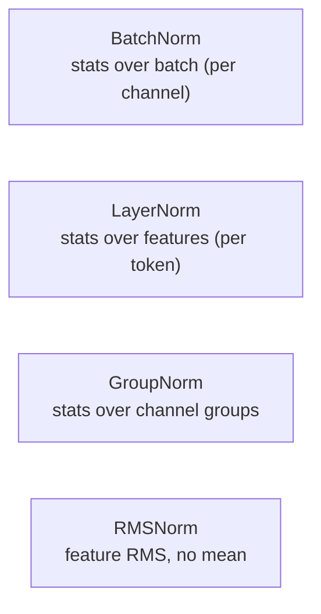
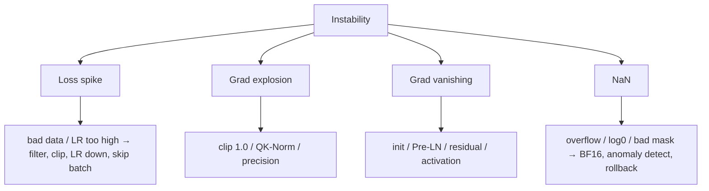

# Normalization & Stability

BatchNormLayerNormRMSNormPre-LNwarmupgrad clipping

> [!TIP] 이것부터 말하세요
> 학습이 "갑자기 NaN이 나거나 / 튀거나 / 멈출" 때 먼저 따져볼 축은 **normalization, residual, precision, learning rate**입니다. 면접관은 트릭 나열이 아니라 *메커니즘*(왜 RMSNorm, 왜 Pre-LN, 왜 warmup)과 *체계적인 디버깅 순서*를 원합니다.

## 애초에 왜 normalize하나

Normalization은 activation을 안정적인 스케일로 유지해 depth 전반에서 gradient가 well-conditioned하게 합니다. 계열들은 오직 **어느 축**으로 통계를 계산하는지만 다릅니다.

<dl class="kv">
<dt>BatchNorm</dt><dd>각 채널을 batch에 걸쳐 normalize. 괜찮은 batch가 필요하고 train/eval이 다름(running stats). CNN에서 지배적.</dd>
<dt>LayerNorm</dt><dd>한 샘플 내에서 feature에 걸쳐 normalize. Batch-size에 독립 → Transformer/ViT의 기본값.</dd>
<dt>GroupNorm</dt><dd>Channel group 단위. batch size 1–2에서 robust(고해상도 detection/segmentation). $G{=}1\!\approx\!$LN, $G{=}C\!\approx\!$InstanceNorm.</dd>
<dt>RMSNorm</dt><dd>Feature RMS로 나눔. mean-centering 없이 scale만. 더 싸고 LLM의 기본값.</dd>
</dl>

## The math

**BatchNorm** (per channel, batch $B$에 걸쳐):
$$
\hat x=\frac{x-\mu_B}{\sqrt{\sigma_B^2+\epsilon}},\quad y=\gamma\hat x+\beta
$$
Train은 batch stats + EMA 업데이트를 쓰고, inference는 running stats를 씁니다(batch 1에서도 동작).

**LayerNorm** (한 token의 $H$개 feature에 걸쳐):
$$
\mu=\tfrac1H\textstyle\sum_i x_i,\quad \sigma^2=\tfrac1H\textstyle\sum_i (x_i-\mu)^2,\quad y=\gamma\odot\frac{x-\mu}{\sqrt{\sigma^2+\epsilon}}+\beta
$$

**RMSNorm** (mean subtraction 없음, 보통 $\beta$ 없음):
$$
\mathrm{RMS}(x)=\sqrt{\tfrac1H\textstyle\sum_i x_i^2+\epsilon},\quad y=\gamma\odot\frac{x}{\mathrm{RMS}(x)}
$$

| | LayerNorm | RMSNorm |
| --- | --- | --- |
| Mean-center | yes | no |
| Scale by | std | RMS |
| Learn $\beta$ | yes | usually no |
| Used in | BERT, GPT-2, ViT | LLaMA, Mistral, Qwen, DeepSeek |

> [!NOTE] RMSNorm에 대한 2026년 관점
> 현대 LLM은 **RMSNorm + Pre-LN**으로 표준화됩니다. 최근 분석(EACL 2026 Findings, Gupta et al.)은 LayerNorm의 mean-centering이 학습된 표현에서 *이미 작은* 거의 uniform한 성분을 제거하는 것이라고 주장합니다 — 그래서 RMSNorm은 연산을 아끼면서 품질을 거의 잃지 않습니다. 단서: 이는 vision의 BN/GN 영역으로 **일반화되지 않습니다**. *(LLM 주장은 verifiable. 과도하게 확장하지 말 것.)*

왜 Transformer는 BatchNorm 대신 LayerNorm/RMSNorm을 쓰나요?

**짧게:** BatchNorm의 통계는 batch와 다른 시퀀스에 의존합니다. 가변 길이 텍스트, 작고 불균등한 batch, autoregressive decoding(사실상 batch 1)에서는 그 통계가 noisy하거나 잘 정의되지 않습니다. LN/RMSNorm은 token *내부*에서 normalize하므로 batch에 독립적입니다.

**깊게:** BN은 batch 내 example들을 결합시키고(train≠eval stats가 되면 correctness/serving 위험), 시퀀스 모델은 흔히 아주 작은 effective batch로 돕니다. LN은 그 결합을 제거했고, RMSNorm은 mean-centering이 대체로 불필요하고 더 싸다며 이를 뺐습니다. **큰 batch의 vision CNN**에서는 BN이 여전히 경쟁력 있거나 더 낫습니다 — "LN이 무조건 우월"이 아니라 영역의 문제입니다. **후속 질문:** *SyncBN?* — GPU 간 batch stats를 all-reduce. *Detection fine-tuning에서 Frozen BN?* — fine-tuning batch가 작으므로 backbone BN을 eval stats로 고정.

## Residual placement: Pre-LN vs Post-LN

**Post-LN** (원 Transformer): $x_{l+1}=\mathrm{Norm}(x_l+\mathrm{SubLayer}(x_l))$.
**Pre-LN** (현대 기본값): $x_{l+1}=x_l+\mathrm{SubLayer}(\mathrm{Norm}(x_l))$.

<figure>
<svg viewBox="0 0 560 190" xmlns="http://www.w3.org/2000/svg" font-family="Inter, sans-serif" font-size="12">
  <text x="140" y="18" text-anchor="middle" fill="#e0533f" font-weight="700">Pre-LN (stable, deep)</text>
  <rect x="110" y="35" width="60" height="24" rx="5" fill="none" stroke="#6366f1"/><text x="140" y="51" text-anchor="middle" fill="#6366f1">Norm</text>
  <rect x="110" y="72" width="60" height="24" rx="5" fill="none" stroke="#232b36"/><text x="140" y="88" text-anchor="middle" fill="#6b7686">Sublayer</text>
  <circle cx="140" cy="122" r="11" fill="none" stroke="#12a150"/><text x="140" y="126" text-anchor="middle" fill="#12a150">+</text>
  <path d="M40 130 V 122 H 129" stroke="#12a150" stroke-width="2" fill="none"/>
  <text x="40" y="150" text-anchor="middle" fill="#12a150">clean residual</text>
  <text x="420" y="18" text-anchor="middle" fill="#0ea5e9" font-weight="700">Post-LN (original)</text>
  <rect x="390" y="72" width="60" height="24" rx="5" fill="none" stroke="#232b36"/><text x="420" y="88" text-anchor="middle" fill="#6b7686">Sublayer</text>
  <circle cx="420" cy="46" r="11" fill="none" stroke="#232b36"/><text x="420" y="50" text-anchor="middle" fill="#6b7686">+</text>
  <rect x="390" y="112" width="60" height="24" rx="5" fill="none" stroke="#6366f1"/><text x="420" y="128" text-anchor="middle" fill="#6366f1">Norm</text>
  <text x="420" y="160" text-anchor="middle" fill="#6b7686">norm on residual → needs warmup</text>
</svg>
<figcaption>Pre-LN은 정규화되지 않은 identity highway를 유지 → gradient가 깨끗하게 흐르고, warmup 민감도가 낮으면서 매우 깊은 스택이 가능합니다. Post-LN은 강한 최종 품질에 도달할 수 있지만 학습이 더 까다롭습니다.</figcaption>
</figure>

Pre-LN은 residual stream을 정규화하지 않은 채로 유지하므로 gradient 크기가 depth 전반에서 보존되고 warmup 의존이 완화됩니다(0은 아님). Post-LN은 residual path에서 normalize합니다 — 역사적으로 init 시 variance가 높아 세심한 warmup이 필요하지만, 때로 최종 품질은 더 낫습니다. 깊은 스택 변종: **Peri-LN**, **LayerScale**, **QK-Norm**(attention-logit 폭발을 막기 위해 Q/K를 normalize).

## Initialization, clipping, warmup

<dl class="kv">
<dt>Init</dt><dd>ReLU net엔 Kaiming/He, tanh엔 Xavier/Glorot. residual-branch init은 작게 스케일(예: $1/\sqrt{2N}$)해서 residual stream이 depth에 따라 폭발하지 않게 함.</dd>
<dt>Gradient clipping</dt><dd>Global grad norm을 clip(보통 1.0)해 드문 update spike를 억제. RNN과 large-batch LLM pretraining에 필수.</dd>
<dt>Warmup</dt><dd>LR을 첫 1–5% step 동안 ~0에서 올린 뒤 decay(cosine). 큰 step 전에 Adam의 second-moment 추정과 attention 패턴이 안정되게 함. batch가 클수록 warmup을 길게.</dd>
</dl>

Warmup은 normalization과 상호작용합니다: Post-LN은 warmup에 뚜렷하게 민감하고, Pre-LN + RMSNorm조차 실무에서는 보통 짧은 warmup을 둡니다. [Optimization](#/foundations/optimization) 참고.

왜 learning-rate warmup이 도움이 되고, normalization과 어떻게 엮이나요?

**짧게:** step 0에서 weight는 random이고 Adam의 variance 추정은 미성숙하며 attention logit은 불안정합니다. 이때 큰 LR은 발산할 수 있습니다. Warmup은 통계와 표현이 자리 잡을 시간을 벌어줍니다.

**깊게:** Adam의 update $\propto \hat m/\sqrt{\hat v}$는 초기에 $\hat v$의 variance가 높아(bias correction이 일부만 보정) 초기 step이 사실상 과도하게 크고 noisy합니다. Post-LN은 norm이 residual path에 있어 초기 불안정을 증폭하므로 이를 악화시킵니다 — 이것이 정확히 Post-LN이 Pre-LN보다 warmup을 더 필요로 하는 이유입니다. **후속 질문:** *warmup이 너무 길면?* — 작은 LR에 머무느라 예산 낭비. *대안?* — RAdam은 variance 항을 보정해 warmup 필요를 줄임.

> [!NOTE] Norm-free 연구
> Normalization을 완전히 제거하려는 시도들 — **DyT**(LN을 대체하는 Dynamic Tanh), 그리고 Fixup/SkipInit/ReZero 같은 세심한 init 기법 — 은 그것이 *가능*함을 보여주지만, production LLM은 여전히 RMSNorm을 씁니다. 스케일에서 안정화가 더 간단하기 때문입니다. 이것의 존재(그리고 아직 기본값이 아님)를 아는 것이 프론티어를 추적함을 보여줍니다. *(방어 가능한 의견.)*

## Instabilities: symptoms → fixes

| 증상 | 유력한 원인 | 해법 |
| --- | --- | --- |
| Loss spike 후 회복 | outlier batch, LR too high | data filter, grad clip, LR↓, bad batch skip |
| $\lVert g\rVert\!\to\!\infty$ | attention logit 폭발, FP16 overflow | clip, QK-Norm, BF16 |
| $\lVert g\rVert\!\approx\!0$, loss flat | bad init, no residual, saturated act | Pre-LN, residual, He init, GELU/SwiGLU |
| NaN loss | FP16 overflow, `log(0)`, all-`-inf` mask row | dynamic loss scale / BF16, $\epsilon$ guard, mask fix |

"Pretraining 3일차, loss가 갑자기 NaN이 됩니다." 어떻게 접근하나요?

**짧게:** 국소화(어느 step / 어느 rank), 저장된 batch로 오프라인 재현, 폭발 전에 grad norm이 오르고 있었는지 확인, 그다음 data shard, LR phase, precision, resume state를 이분 탐색합니다.

**깊게:** 순서화된 플레이북 — (1) NaN step index와 어느 rank인지 로깅, (2) 그 batch를 덤프해 오프라인 forward pass 실행, (3) grad-norm 이력 점검 — 상승은 불안정을 의미하고 즉각적 NaN은 나쁜 입력이나 overflow를 의미, (4) `-inf` attention mask row(전부 masked → softmax NaN), `log(0)`, FP16 overflow(BF16으로 재시도) 확인, (5) resume가 optimizer state를 desync시키지 않았는지 검증, (6) 완화: 더 강한 clip, 의심 layer를 FP32로, spike 이전 checkpoint로 skip/rollback. 멀티 GPU에서만 재현되면 collective/sync 버그를 의심([Distributed Training](#/foundations/distributed-training) 참고). loss는 괜찮은데 metric이 붕괴하면 data/eval 버그([Debugging](#/foundations/debugging-experimentation) 참고). **후속 질문:** *spike 이후 checkpoint 재사용?* — 위험. 오염됐을 수 있으니 spike 이전으로 rollback.

언제 BatchNorm보다 GroupNorm이 맞나요?

**짧게:** effective batch가 아주 작을 때 — GPU당 이미지 1–2장만 들어가는 고해상도 detection/segmentation/matting — BN의 batch stats가 noise가 됩니다. GroupNorm(또는 LN)은 batch에 독립적입니다.

**깊게:** BN의 오차는 batch가 작아질수록 커집니다. $\mu_B,\sigma_B^2$가 나쁜 추정이 되기 때문입니다. GroupNorm은 한 샘플 내 channel group에 걸쳐 normalize해 batch size와 분리되며, 작은 batch의 Mask R-CNN 스타일 detector에서 표준입니다. **Weight Standardization**과 결합하면 micro-batch 학습에 더 도움이 됩니다. **후속 질문:** *왜 항상 GN을 안 쓰나?* — 큰 batch에서는 BN의 cross-sample 통계가 유용한 regularization 역할을 해 classification에서 자주 이깁니다.

## Cheat-sheet

| 질문 | 한 줄 요약 |
| --- | --- |
| BN vs LN 축 | BN은 batch에 걸쳐(per channel), LN은 feature에 걸쳐(per token). |
| Transformer에서 왜 LN | Batch에 독립. 가변 길이와 batch-1 decoding에 robust. |
| RMSNorm | mean-centering 제거, RMS로 scale. 더 싸고 LLM 기본값, ~품질 손실 없음. |
| GroupNorm | Batch에 독립. batch 1–2에서 사용(고해상도 detection/seg). |
| Pre-LN vs Post-LN | Pre-LN = 깨끗한 residual highway, 깊고 warmup 덜 민감. Post-LN은 더 까다로움. |
| Warmup | 초기에 LR을 올려 Adam variance + attention 안정화. batch에 맞춰 길이 조정. |
| Grad clip | Global-norm clip ~1.0으로 spike 억제. RNN + large-batch LLM에 필수. |
| NaN triage | step/rank 국소화 → 오프라인 batch → grad-norm 이력 → mask/overflow → rollback. |
| QK-Norm | Q/K를 normalize해 attention-logit 폭발 방지. |

**관련:** [CNNs, RNNs & Transformers](#/foundations/architectures) · [Optimization](#/foundations/optimization) · [Distributed Training](#/foundations/distributed-training) · [Mixed Precision & Efficiency](#/foundations/mixed-precision-efficiency) · [Debugging & Experimentation](#/foundations/debugging-experimentation)
