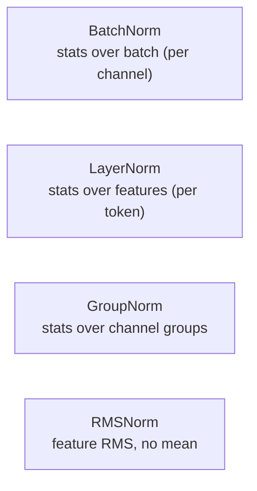
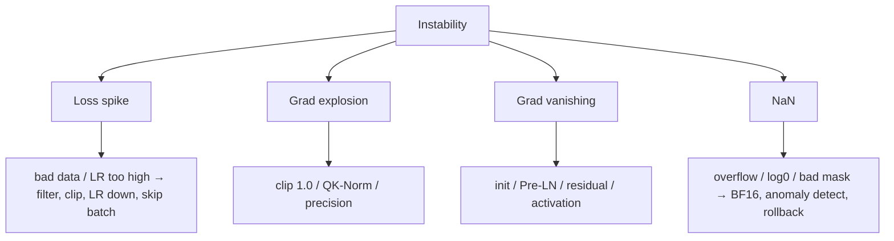

# Normalization & 학습 안정성

<div class="tag-row"><span class="tag">BatchNorm</span><span class="tag">LayerNorm</span><span class="tag">RMSNorm</span><span class="tag">Pre-LN</span><span class="tag">warmup</span><span class="tag">grad clipping</span></div>

> [!NOTE] 이 챕터의 목표
> 깊은 신경망은 층을 지날수록 숫자(activation)가 점점 커지거나 작아져서 학습이 터지거나 멈추기 쉽습니다. **Normalization(정규화)** 은 층마다 숫자의 크기를 "적당한 범위"로 다시 맞춰 주는 안전장치입니다. 이 챕터는 (1) normalize가 정확히 무슨 계산인지, (2) 왜 깊은 망에 꼭 필요한지, (3) BatchNorm/LayerNorm/RMSNorm이 뭐가 다른지를 그림·코드로 잡고, 뒤에서 학습 안정화(Pre-LN, warmup, NaN 디버깅)까지 갑니다.

## 무엇을 / 왜 — normalize가 하는 일

가장 익숙한 표준화는 숫자 묶음을 **평균 0, 표준편차 1**로 다시 스케일합니다. 다만 normalization 계열 전체가 이 식과 같지는 않습니다. RMSNorm은 평균을 빼지 않고 RMS로만 나누며, 모든 방식은 뒤의 학습 가능한 affine scale/shift 때문에 최종 출력의 평균·분산도 다시 달라질 수 있습니다.

$$
\hat{x} = \frac{x - \mu}{\sigma} \quad(\mu:\text{평균},\ \sigma:\text{표준편차})
$$

왜 필요할까요? [신경망 첫걸음](#/foundations/neural-networks-basics)에서 본 대로 층이 깊어지면 activation·gradient scale이 불안정해질 수 있습니다. 정규화는 선택한 축에서 scale을 제어해 conditioning과 최적화 안정성을 개선합니다. **값을 0~1 범위로 제한하는 연산은 아닙니다**. 표준화 직후 값은 음수도 될 수 있고 절댓값이 1보다 클 수도 있습니다.

<figure>
<svg viewBox="0 0 640 200" xmlns="http://www.w3.org/2000/svg" font-family="Inter, sans-serif" font-size="12">
  <!-- before: messy, off-center, wide -->
  <text x="150" y="20" text-anchor="middle" fill="#e0533f" font-weight="700">정규화 전 (치우치고 넓음)</text>
  <line x1="30" y1="150" x2="290" y2="150" stroke="#98a3b2" stroke-width="1.2"/>
  <line x1="90" y1="150" x2="90" y2="40" stroke="#98a3b2" stroke-width="1" stroke-dasharray="3 3"/>
  <text x="90" y="170" text-anchor="middle" fill="#98a3b2">0</text>
  <g fill="#e0533f" opacity="0.85">
    <circle cx="180" cy="140" r="4"/><circle cx="210" cy="130" r="4"/><circle cx="240" cy="138" r="4"/><circle cx="200" cy="120" r="4"/><circle cx="255" cy="128" r="4"/><circle cx="165" cy="132" r="4"/><circle cx="225" cy="118" r="4"/>
  </g>
  <text x="215" y="95" text-anchor="middle" fill="#e0533f">평균이 오른쪽, 퍼짐 큼</text>
  <!-- arrow -->
  <path d="M300 110 H340" stroke="#98a3b2" stroke-width="1.8" marker-end="url(#nz)"/>
  <text x="320" y="100" text-anchor="middle" fill="#98a3b2">정규화</text>
  <!-- after: centered, tight -->
  <text x="490" y="20" text-anchor="middle" fill="#12a150" font-weight="700">정규화 후 (0 중심, 단위 폭)</text>
  <line x1="360" y1="150" x2="620" y2="150" stroke="#98a3b2" stroke-width="1.2"/>
  <line x1="490" y1="150" x2="490" y2="40" stroke="#98a3b2" stroke-width="1" stroke-dasharray="3 3"/>
  <text x="490" y="170" text-anchor="middle" fill="#98a3b2">0</text>
  <g fill="#12a150" opacity="0.85">
    <circle cx="470" cy="130" r="4"/><circle cx="500" cy="128" r="4"/><circle cx="485" cy="118" r="4"/><circle cx="510" cy="132" r="4"/><circle cx="475" cy="122" r="4"/><circle cx="505" cy="120" r="4"/><circle cx="490" cy="112" r="4"/>
  </g>
  <text x="490" y="95" text-anchor="middle" fill="#12a150">0 주위로 모임</text>
  <defs><marker id="nz" markerWidth="8" markerHeight="8" refX="6" refY="3" orient="auto"><path d="M0 0 L6 3 L0 6" fill="#98a3b2"/></marker></defs>
</svg>
<figcaption>정규화는 치우치고 넓게 퍼진 숫자들을 <b>0 중심·단위 폭</b>으로 다시 맞춥니다. 매 층에서 이걸 해 주면 깊은 망에서도 신호가 폭발/소멸하지 않습니다.</figcaption>
</figure>

> [!TIP] 면접 한 줄
> 학습이 "갑자기 NaN이 나거나 / 튀거나 / 멈출" 때 먼저 따져볼 축은 **normalization, residual, precision, learning rate**입니다. 면접관은 트릭 나열이 아니라 *메커니즘*(왜 RMSNorm, 왜 Pre-LN, 왜 warmup)과 *체계적 디버깅 순서*를 원합니다.

## 가장 중요한 차이: 어느 축의 어떤 통계를 쓰나

축은 가장 중요한 차이지만 전부는 아닙니다. BatchNorm은 CNN에서 보통 채널마다 $N,H,W$에 걸친 통계를 쓰고 running statistics 때문에 train/eval 동작이 다릅니다. LayerNorm은 샘플·token 내부의 feature 축을 쓰며 running statistics가 없습니다. GroupNorm은 샘플 내부 채널 그룹(그리고 공간축)의 통계를 쓰고, RMSNorm은 평균을 빼지 않습니다.

> **PyTorch식 pseudocode — 축과 train/eval 차이**

```python
x_img = torch.randn(N, C, H, W)
bn.train(); y_train = bn(x_img)     # N,H,W 통계 + running stats 갱신
bn.eval();  y_eval = bn(x_img)      # 저장된 running stats 사용

x_tok = torch.randn(N, T, D)
ln.train(); a = ln(x_tok)           # 각 [n,t,:]의 D축 통계
ln.eval();  b = ln(x_tok)           # LN은 running stats 없음; 같은 규칙
```

<figure>
<svg viewBox="0 0 640 210" xmlns="http://www.w3.org/2000/svg" font-family="Inter, sans-serif" font-size="11">
  <!-- BatchNorm: over batch (columns) -->
  <text x="110" y="18" text-anchor="middle" fill="#0ea5e9" font-weight="700">BatchNorm</text>
  <text x="110" y="34" text-anchor="middle" fill="#98a3b2">배치 방향(세로)</text>
  <g stroke="#98a3b2" stroke-width="1" fill="none"><rect x="55" y="45" width="120" height="120"/></g>
  <rect x="55" y="45" width="30" height="120" fill="rgba(14,165,233,.35)"/>
  <g stroke="#98a3b2" stroke-width="0.6"><line x1="85" y1="45" x2="85" y2="165"/><line x1="115" y1="45" x2="115" y2="165"/><line x1="145" y1="45" x2="145" y2="165"/><line x1="55" y1="85" x2="175" y2="85"/><line x1="55" y1="125" x2="175" y2="125"/></g>
  <text x="115" y="185" text-anchor="middle" fill="#98a3b2">→ 특징(가로)</text>
  <text x="30" y="105" text-anchor="middle" fill="#98a3b2" transform="rotate(-90 30 105)">배치</text>
  <!-- LayerNorm: over features (rows) -->
  <text x="360" y="18" text-anchor="middle" fill="#e0533f" font-weight="700">LayerNorm</text>
  <text x="360" y="34" text-anchor="middle" fill="#98a3b2">특징 방향(가로)</text>
  <g stroke="#98a3b2" stroke-width="1" fill="none"><rect x="300" y="45" width="120" height="120"/></g>
  <rect x="300" y="45" width="120" height="30" fill="rgba(224,83,63,.35)"/>
  <g stroke="#98a3b2" stroke-width="0.6"><line x1="330" y1="45" x2="330" y2="165"/><line x1="360" y1="45" x2="360" y2="165"/><line x1="390" y1="45" x2="390" y2="165"/><line x1="300" y1="85" x2="420" y2="85"/><line x1="300" y1="125" x2="420" y2="125"/></g>
  <text x="360" y="185" text-anchor="middle" fill="#98a3b2">→ 특징</text>
  <!-- GroupNorm -->
  <text x="560" y="18" text-anchor="middle" fill="#12a150" font-weight="700">GroupNorm</text>
  <text x="560" y="34" text-anchor="middle" fill="#98a3b2">채널 그룹 단위</text>
  <g stroke="#98a3b2" stroke-width="1" fill="none"><rect x="500" y="45" width="120" height="120"/></g>
  <rect x="500" y="45" width="60" height="120" fill="rgba(18,161,80,.30)"/>
  <g stroke="#98a3b2" stroke-width="0.6"><line x1="530" y1="45" x2="530" y2="165"/><line x1="560" y1="45" x2="560" y2="165"/><line x1="590" y1="45" x2="590" y2="165"/><line x1="500" y1="85" x2="620" y2="85"/><line x1="500" y1="125" x2="620" y2="125"/></g>
  <text x="560" y="185" text-anchor="middle" fill="#98a3b2">채널을 몇 묶음으로</text>
</svg>
<figcaption>단순화한 격자 그림입니다. 실제 CNN BatchNorm은 채널별로 N·H·W 축을, LayerNorm은 지정된 feature 축을, GroupNorm은 샘플별 채널 그룹과 공간축을 사용합니다. RMSNorm은 같은 축을 쓰더라도 mean-centering을 생략합니다.</figcaption>
</figure>



<dl class="kv">
<dt>BatchNorm(배치 정규화)</dt><dd>각 채널을 batch에 걸쳐 normalize. 괜찮은 크기의 batch가 필요하고 train/eval 동작이 다름(running statistics(이동 통계) 사용). CNN에서 지배적.</dd>
<dt>LayerNorm(레이어 정규화)</dt><dd>한 샘플 내에서 feature 전체에 걸쳐 normalize. Batch 크기에 독립 → Transformer/ViT의 기본값.</dd>
<dt>GroupNorm(그룹 정규화)</dt><dd>Channel을 몇 group으로 묶어 정규화. batch size 1–2에서 robust(고해상도 detection/segmentation). $G{=}1\!\approx\!$LN, $G{=}C\!\approx\!$InstanceNorm.</dd>
<dt>RMSNorm</dt><dd>평균을 빼지 않고 feature RMS로만 나눔. 더 싸고 최신 LLM의 기본값.</dd>
</dl>

## LayerNorm 직접 구현해 보기

말보다 코드가 빠릅니다. LayerNorm은 딱 세 줄입니다: 평균을 빼고 → 표준편차로 나누고 → 학습 파라미터 $\gamma$(scale)로 곱하고 $\beta$(shift)를 더함. 아래 에디터에서 구현하세요.

<div class="widget" data-widget="code">
<script type="application/json" class="code-config">
{"func":"layer_norm","packages":["numpy"],"approx":true,"starter":"def layer_norm(x, gamma, beta, eps=1e-5):\n    # x, gamma, beta: 같은 길이의 1D 리스트(한 토큰의 feature 벡터).\n    # 1) mu = x 의 평균,  var = x 의 분산\n    # 2) x_hat = (x - mu) / sqrt(var + eps)\n    # 3) 반환: gamma * x_hat + beta  (리스트)\n    pass","tests":[{"args":[[1,2,3,4],[1,1,1,1],[0,0,0,0]],"expect":[-1.3416,-0.4472,0.4472,1.3416],"tol":1e-3},{"args":[[2,2,2,2],[1,1,1,1],[0,0,0,0]],"expect":[0.0,0.0,0.0,0.0],"tol":1e-3},{"args":[[1,2,3,4],[2,2,2,2],[1,1,1,1]],"expect":[-1.6833,0.1056,1.8944,3.6833],"tol":1e-3}],"solution":"import numpy as np\n\ndef layer_norm(x, gamma, beta, eps=1e-5):\n    x = np.asarray(x, float); g = np.asarray(gamma, float); b = np.asarray(beta, float)\n    mu = x.mean()\n    var = x.var()                      # 모집단 분산 (1/N)\n    x_hat = (x - mu) / np.sqrt(var + eps)\n    return (g * x_hat + b).tolist()"}
</script>
</div>

두 번째 테스트(`[2,2,2,2]`)를 보세요: 모든 값이 같으면 분산이 0이라 정규화 후 전부 0이 됩니다 — $\epsilon$이 0 나눗셈을 막아 줍니다. 이 $\epsilon$을 빼먹는 게 흔한 NaN 원인 중 하나입니다.

## The math (심화)

**BatchNorm** (per channel, batch $B$에 걸쳐):
$$
\hat x=\frac{x-\mu_B}{\sqrt{\sigma_B^2+\epsilon}},\quad y=\gamma\hat x+\beta
$$
Train은 batch stats + EMA 업데이트를 쓰고, inference는 running stats를 씁니다(batch 1에서도 동작).

**LayerNorm** (한 token의 $H$개 feature에 걸쳐):
$$
\mu=\tfrac1H\textstyle\sum_i x_i,\quad \sigma^2=\tfrac1H\textstyle\sum_i (x_i-\mu)^2,\quad y=\gamma\odot\frac{x-\mu}{\sqrt{\sigma^2+\epsilon}}+\beta
$$

**RMSNorm** (mean subtraction 없음, 보통 $\beta$ 없음):
$$
\mathrm{RMS}(x)=\sqrt{\tfrac1H\textstyle\sum_i x_i^2+\epsilon},\quad y=\gamma\odot\frac{x}{\mathrm{RMS}(x)}
$$

| | LayerNorm | RMSNorm |
| --- | --- | --- |
| Mean-center | yes | no |
| Scale by | std | RMS |
| Learn $\beta$ | yes | usually no |
| Used in | BERT, GPT-2, ViT | LLaMA, Mistral, Qwen, DeepSeek |

> [!NOTE] RMSNorm의 실전 위치
> 많은 decoder-only LLM은 **RMSNorm + Pre-Norm** 조합을 사용합니다. RMSNorm은 mean-centering을 생략해 LayerNorm보다 연산이 단순하지만, 품질·안정성이 항상 같다는 보장은 없으므로 architecture와 scale에서 검증해야 합니다. 이 선택을 vision의 BN/GN이나 모든 Transformer에 그대로 일반화하지 마세요.

<details class="qa"><summary>왜 Transformer는 BatchNorm 대신 LayerNorm/RMSNorm을 쓰나요?</summary>
<div class="qa-body">

**짧게:** BatchNorm의 통계는 batch와 다른 시퀀스에 의존합니다. 가변 길이 텍스트, 작고 불균등한 batch, autoregressive decoding(사실상 batch 1)에서는 그 통계가 noisy하거나 잘 정의되지 않습니다. LN/RMSNorm은 token *내부*에서 normalize하므로 batch에 독립적입니다.

**깊게:** BN은 batch 내 example들을 결합시키고(train≠eval stats가 되면 correctness/serving 위험), 시퀀스 모델은 흔히 아주 작은 effective batch로 돕니다. LN은 그 결합을 제거했고, RMSNorm은 mean-centering이 대체로 불필요하고 더 싸다며 이를 뺐습니다. **큰 batch의 vision CNN**에서는 BN이 여전히 경쟁력 있거나 더 낫습니다 — "LN이 무조건 우월"이 아니라 영역의 문제입니다. **후속 질문:** *SyncBN?* — GPU 간 batch stats를 all-reduce. *Detection fine-tuning에서 Frozen BN?* — fine-tuning batch가 작으므로 backbone BN을 eval stats로 고정.
</div></details>

## Residual placement: Pre-LN vs Post-LN (심화)

**Post-LN** (원 Transformer): $x_{l+1}=\mathrm{Norm}(x_l+\mathrm{SubLayer}(x_l))$.
**Pre-LN** (현대 기본값): $x_{l+1}=x_l+\mathrm{SubLayer}(\mathrm{Norm}(x_l))$.

<figure>
<svg viewBox="0 0 560 190" xmlns="http://www.w3.org/2000/svg" font-family="Inter, sans-serif" font-size="12">
  <text x="140" y="18" text-anchor="middle" fill="#e0533f" font-weight="700">Pre-LN (stable, deep)</text>
  <rect x="110" y="35" width="60" height="24" rx="5" fill="none" stroke="#6366f1"/><text x="140" y="51" text-anchor="middle" fill="#6366f1">Norm</text>
  <rect x="110" y="72" width="60" height="24" rx="5" fill="none" stroke="#98a3b2"/><text x="140" y="88" text-anchor="middle" fill="#98a3b2">Sublayer</text>
  <circle cx="140" cy="122" r="11" fill="none" stroke="#12a150"/><text x="140" y="126" text-anchor="middle" fill="#12a150">+</text>
  <path d="M40 130 V 122 H 129" stroke="#12a150" stroke-width="2" fill="none"/>
  <text x="40" y="150" text-anchor="middle" fill="#12a150">clean residual</text>
  <text x="420" y="18" text-anchor="middle" fill="#0ea5e9" font-weight="700">Post-LN (original)</text>
  <rect x="390" y="72" width="60" height="24" rx="5" fill="none" stroke="#98a3b2"/><text x="420" y="88" text-anchor="middle" fill="#98a3b2">Sublayer</text>
  <circle cx="420" cy="46" r="11" fill="none" stroke="#98a3b2"/><text x="420" y="50" text-anchor="middle" fill="#98a3b2">+</text>
  <rect x="390" y="112" width="60" height="24" rx="5" fill="none" stroke="#6366f1"/><text x="420" y="128" text-anchor="middle" fill="#6366f1">Norm</text>
  <text x="420" y="160" text-anchor="middle" fill="#98a3b2">norm on residual → needs warmup</text>
</svg>
<figcaption>Pre-LN은 정규화되지 않은 identity highway를 유지 → gradient가 깨끗하게 흐르고, warmup 민감도가 낮으면서 매우 깊은 스택이 가능합니다. Post-LN은 강한 최종 품질에 도달할 수 있지만 학습이 더 까다롭습니다.</figcaption>
</figure>

Pre-LN은 residual stream을 정규화하지 않은 채로 유지하므로 gradient 크기가 depth 전반에서 보존되고 warmup 의존이 완화됩니다(0은 아님). Post-LN은 residual path에서 normalize합니다 — 역사적으로 init 시 variance가 높아 세심한 warmup이 필요하지만, 때로 최종 품질은 더 낫습니다. 깊은 스택 변종: **Peri-LN**, **LayerScale**, **QK-Norm**(attention-logit 폭발을 막기 위해 Q/K를 normalize).

## Initialization, clipping, warmup (심화)

<dl class="kv">
<dt>Init(초기화)</dt><dd>ReLU net엔 Kaiming/He, tanh엔 Xavier/Glorot. residual-branch init은 작게 스케일(예: $1/\sqrt{2N}$)해서 residual stream이 depth에 따라 폭발하지 않게 함.</dd>
<dt>Gradient clipping(기울기 클리핑)</dt><dd>Global grad norm을 clip(보통 1.0)해 드문 update spike를 억제. RNN과 large-batch LLM pretraining에 필수.</dd>
<dt>Warmup</dt><dd>LR을 첫 1–5% step 동안 ~0에서 올린 뒤 decay(cosine). 큰 step 전에 Adam의 second-moment 추정과 attention 패턴이 안정되게 함. batch가 클수록 warmup을 길게.</dd>
</dl>

Warmup은 normalization과 상호작용합니다: Post-LN은 warmup에 뚜렷하게 민감하고, Pre-LN + RMSNorm조차 실무에서는 보통 짧은 warmup을 둡니다. [Optimization](#/foundations/optimization) 참고.

<details class="qa"><summary>왜 learning-rate warmup이 도움이 되고, normalization과 어떻게 엮이나요?</summary>
<div class="qa-body">

**짧게:** step 0에서 weight는 random이고 Adam의 variance 추정은 미성숙하며 attention logit은 불안정합니다. 이때 큰 LR은 발산할 수 있습니다. Warmup은 통계와 표현이 자리 잡을 시간을 벌어줍니다.

**깊게:** Adam의 update $\propto \hat m/\sqrt{\hat v}$는 초기에 $\hat v$의 variance가 높아(bias correction이 일부만 보정) 초기 step이 사실상 과도하게 크고 noisy합니다. Post-LN은 norm이 residual path에 있어 초기 불안정을 증폭하므로 이를 악화시킵니다 — 이것이 정확히 Post-LN이 Pre-LN보다 warmup을 더 필요로 하는 이유입니다. **후속 질문:** *warmup이 너무 길면?* — 작은 LR에 머무느라 예산 낭비. *대안?* — RAdam은 variance 항을 보정해 warmup 필요를 줄임.
</div></details>

> [!NOTE] Norm-free 연구
> Normalization을 완전히 제거하려는 시도들 — **DyT**(LN을 대체하는 Dynamic Tanh), 그리고 Fixup/SkipInit/ReZero 같은 세심한 init 기법 — 은 그것이 *가능*함을 보여주지만, production LLM은 여전히 RMSNorm을 씁니다. 스케일에서 안정화가 더 간단하기 때문입니다. 이것의 존재(그리고 아직 기본값이 아님)를 아는 것이 프론티어를 추적함을 보여줍니다. *(방어 가능한 의견.)*

## Instabilities: 증상 → 해법 (심화)



| 증상 | 유력한 원인 | 해법 |
| --- | --- | --- |
| Loss spike 후 회복 | outlier batch, LR too high | data filter, grad clip, LR↓, bad batch skip |
| $\lVert g\rVert\!\to\!\infty$ | attention logit 폭발, FP16 overflow | clip, QK-Norm, BF16 |
| $\lVert g\rVert\!\approx\!0$, loss flat | bad init, no residual, saturated act | Pre-LN, residual, He init, GELU/SwiGLU |
| NaN loss | FP16 overflow, `log(0)`, all-`-inf` mask row | dynamic loss scale / BF16, $\epsilon$ guard, mask fix |

<details class="qa"><summary>"Pretraining 3일차, loss가 갑자기 NaN이 됩니다." 어떻게 접근하나요?</summary>
<div class="qa-body">

**짧게:** 국소화(어느 step / 어느 rank), 저장된 batch로 오프라인 재현, 폭발 전에 grad norm이 오르고 있었는지 확인, 그다음 data shard, LR phase, precision, resume state를 이분 탐색합니다.

**깊게:** 순서화된 플레이북 — (1) NaN step index와 어느 rank인지 로깅, (2) 그 batch를 덤프해 오프라인 forward pass 실행, (3) grad-norm 이력 점검 — 상승은 불안정을 의미하고 즉각적 NaN은 나쁜 입력이나 overflow를 의미, (4) `-inf` attention mask row(전부 masked → softmax NaN), `log(0)`, FP16 overflow(BF16으로 재시도) 확인, (5) resume가 optimizer state를 desync시키지 않았는지 검증, (6) 완화: 더 강한 clip, 의심 layer를 FP32로, spike 이전 checkpoint로 skip/rollback. 멀티 GPU에서만 재현되면 collective/sync 버그를 의심([Distributed Training](#/foundations/distributed-training) 참고). loss는 괜찮은데 metric이 붕괴하면 data/eval 버그([Debugging](#/foundations/debugging-experimentation) 참고). **후속 질문:** *spike 이후 checkpoint 재사용?* — 위험. 오염됐을 수 있으니 spike 이전으로 rollback.
</div></details>

<details class="qa"><summary>언제 BatchNorm보다 GroupNorm이 맞나요?</summary>
<div class="qa-body">

**짧게:** effective batch가 아주 작을 때 — GPU당 이미지 1–2장만 들어가는 고해상도 detection/segmentation/matting — BN의 batch stats가 noise가 됩니다. GroupNorm(또는 LN)은 batch에 독립적입니다.

**깊게:** BN의 오차는 batch가 작아질수록 커집니다. $\mu_B,\sigma_B^2$가 나쁜 추정이 되기 때문입니다. GroupNorm은 한 샘플 내 channel group에 걸쳐 normalize해 batch size와 분리되며, 작은 batch의 Mask R-CNN 스타일 detector에서 표준입니다. **Weight Standardization**과 결합하면 micro-batch 학습에 더 도움이 됩니다. **후속 질문:** *왜 항상 GN을 안 쓰나?* — 큰 batch에서는 BN의 cross-sample 통계가 유용한 regularization 역할을 해 classification에서 자주 이깁니다.
</div></details>

## Cheat-sheet

| 질문 | 한 줄 요약 |
| --- | --- |
| normalize란 | 숫자를 평균 0·표준편차 1로 다시 스케일 → 폭발/소멸 방지 |
| BN vs LN 축 | BN은 batch에 걸쳐(per channel), LN은 feature에 걸쳐(per token). |
| Transformer에서 왜 LN | Batch에 독립. 가변 길이와 batch-1 decoding에 robust. |
| RMSNorm | mean-centering 제거, RMS로 scale. 더 싸고 LLM 기본값, ~품질 손실 없음. |
| GroupNorm | Batch에 독립. batch 1–2에서 사용(고해상도 detection/seg). |
| Pre-LN vs Post-LN | Pre-LN = 깨끗한 residual highway, 깊고 warmup 덜 민감. Post-LN은 더 까다로움. |
| Warmup | 초기에 LR을 올려 Adam variance + attention 안정화. batch에 맞춰 길이 조정. |
| Grad clip | Global-norm clip ~1.0으로 spike 억제. RNN + large-batch LLM에 필수. |
| NaN triage | step/rank 국소화 → 오프라인 batch → grad-norm 이력 → mask/overflow → rollback. |
| QK-Norm | Q/K를 normalize해 attention-logit 폭발 방지. |

**다음:** [CNNs, RNNs & Transformers](#/foundations/architectures) · [Optimization](#/foundations/optimization) · [Distributed Training](#/foundations/distributed-training) · [Mixed Precision & Efficiency](#/foundations/mixed-precision-efficiency) · [Debugging & Experimentation](#/foundations/debugging-experimentation)
