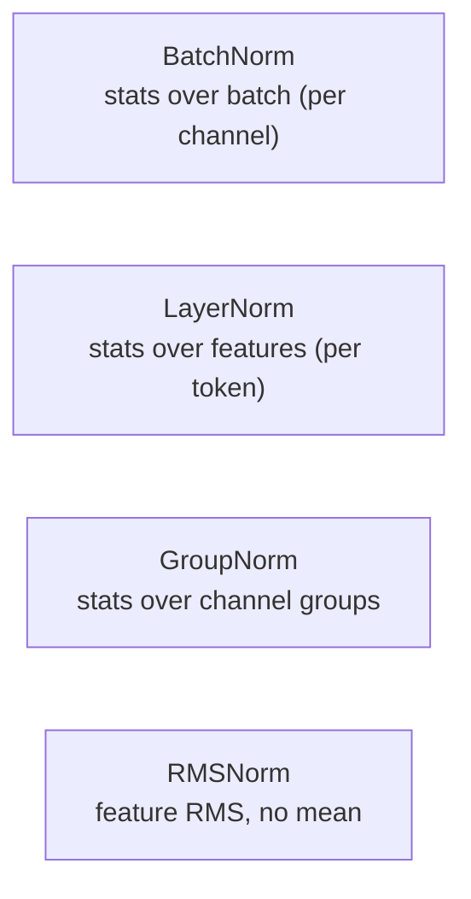
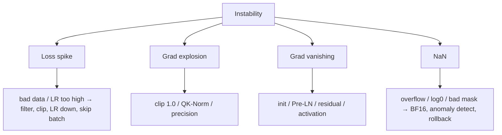

# Normalization & Training Stability

<div class="tag-row"><span class="tag">BatchNorm</span><span class="tag">LayerNorm</span><span class="tag">RMSNorm</span><span class="tag">Pre-LN</span><span class="tag">warmup</span><span class="tag">grad clipping</span></div>

> [!NOTE] Goals of this chapter
> In a deep neural network, the numbers flowing through the layers (activations) can grow or shrink until training explodes or stalls. **Normalization** is a safeguard that repeatedly brings those magnitudes back into a manageable range. This chapter builds an intuition for (1) what normalization actually computes, (2) why deep networks need it, and (3) how BatchNorm, LayerNorm, and RMSNorm differ, using diagrams and code. It then covers training-stability techniques such as Pre-LN, warmup, and NaN debugging.

## What and why — what normalization does

The most familiar form of standardization rescales a collection of numbers to **mean 0 and standard deviation 1**. Not every normalization method uses this exact formula, however. RMSNorm does not subtract the mean and divides only by the RMS, and the learned affine scale and shift that follow many normalization layers can change the final output mean and variance again.

$$
\hat{x} = \frac{x - \mu}{\sigma} \quad(\mu:\text{mean},\ \sigma:\text{standard deviation})
$$

Why is this useful? As discussed in [Neural Networks from First Principles](#/foundations/neural-networks-basics), activation and gradient scales can become unstable as depth increases. Normalization controls scale along selected axes, improving conditioning and optimization stability. **It does not constrain values to the interval 0–1.** Immediately after standardization, values may be negative or have absolute value greater than 1.

<figure>
<svg viewBox="0 0 640 200" xmlns="http://www.w3.org/2000/svg" font-family="Inter, sans-serif" font-size="12">
  <!-- before: messy, off-center, wide -->
  <text x="150" y="20" text-anchor="middle" fill="#e0533f" font-weight="700">Before normalization (offset and wide)</text>
  <line x1="30" y1="150" x2="290" y2="150" stroke="#98a3b2" stroke-width="1.2"/>
  <line x1="90" y1="150" x2="90" y2="40" stroke="#98a3b2" stroke-width="1" stroke-dasharray="3 3"/>
  <text x="90" y="170" text-anchor="middle" fill="#98a3b2">0</text>
  <g fill="#e0533f" opacity="0.85">
    <circle cx="180" cy="140" r="4"/><circle cx="210" cy="130" r="4"/><circle cx="240" cy="138" r="4"/><circle cx="200" cy="120" r="4"/><circle cx="255" cy="128" r="4"/><circle cx="165" cy="132" r="4"/><circle cx="225" cy="118" r="4"/>
  </g>
  <text x="215" y="95" text-anchor="middle" fill="#e0533f">Mean shifted right, broad spread</text>
  <!-- arrow -->
  <path d="M300 110 H340" stroke="#98a3b2" stroke-width="1.8" marker-end="url(#nz)"/>
  <text x="320" y="100" text-anchor="middle" fill="#98a3b2">normalize</text>
  <!-- after: centered, tight -->
  <text x="490" y="20" text-anchor="middle" fill="#12a150" font-weight="700">After normalization (zero-centered, unit width)</text>
  <line x1="360" y1="150" x2="620" y2="150" stroke="#98a3b2" stroke-width="1.2"/>
  <line x1="490" y1="150" x2="490" y2="40" stroke="#98a3b2" stroke-width="1" stroke-dasharray="3 3"/>
  <text x="490" y="170" text-anchor="middle" fill="#98a3b2">0</text>
  <g fill="#12a150" opacity="0.85">
    <circle cx="470" cy="130" r="4"/><circle cx="500" cy="128" r="4"/><circle cx="485" cy="118" r="4"/><circle cx="510" cy="132" r="4"/><circle cx="475" cy="122" r="4"/><circle cx="505" cy="120" r="4"/><circle cx="490" cy="112" r="4"/>
  </g>
  <text x="490" y="95" text-anchor="middle" fill="#12a150">Clustered around zero</text>
  <defs><marker id="nz" markerWidth="8" markerHeight="8" refX="6" refY="3" orient="auto"><path d="M0 0 L6 3 L0 6" fill="#98a3b2"/></marker></defs>
</svg>
<figcaption>Normalization brings an offset, widely dispersed set of numbers back to a <b>zero-centered, unit-width</b> scale. Doing this throughout a deep network helps prevent signals from exploding or vanishing.</figcaption>
</figure>

> [!TIP] One-line interview answer
> When training suddenly produces NaNs, spikes, or stalls, first inspect **normalization, residual connections, numerical precision, and the learning rate**. Interviewers want mechanisms—why RMSNorm, why Pre-LN, why warmup—and a systematic debugging order, not a list of tricks.

## The most important distinction: which statistics over which axes?

The axis is the most important distinction, but not the only one. In a CNN, BatchNorm normally computes per-channel statistics over $N,H,W$, and its running statistics make train and evaluation behavior differ. LayerNorm computes statistics over the feature axis within each sample or token and has no running statistics. GroupNorm computes statistics within channel groups (and spatial axes) of each sample, while RMSNorm does not subtract the mean.

> **PyTorch-style pseudocode — axes and train/eval behavior**

```python
x_img = torch.randn(N, C, H, W)
bn.train(); y_train = bn(x_img)     # N,H,W statistics + update running stats
bn.eval();  y_eval = bn(x_img)      # use stored running stats

x_tok = torch.randn(N, T, D)
ln.train(); a = ln(x_tok)           # D-axis statistics for each [n,t,:]
ln.eval();  b = ln(x_tok)           # LN has no running stats; same rule
```

<figure>
<svg viewBox="0 0 640 210" xmlns="http://www.w3.org/2000/svg" font-family="Inter, sans-serif" font-size="11">
  <!-- BatchNorm: over batch (columns) -->
  <text x="110" y="18" text-anchor="middle" fill="#0ea5e9" font-weight="700">BatchNorm</text>
  <text x="110" y="34" text-anchor="middle" fill="#98a3b2">batch direction (vertical)</text>
  <g stroke="#98a3b2" stroke-width="1" fill="none"><rect x="55" y="45" width="120" height="120"/></g>
  <rect x="55" y="45" width="30" height="120" fill="rgba(14,165,233,.35)"/>
  <g stroke="#98a3b2" stroke-width="0.6"><line x1="85" y1="45" x2="85" y2="165"/><line x1="115" y1="45" x2="115" y2="165"/><line x1="145" y1="45" x2="145" y2="165"/><line x1="55" y1="85" x2="175" y2="85"/><line x1="55" y1="125" x2="175" y2="125"/></g>
  <text x="115" y="185" text-anchor="middle" fill="#98a3b2">→ features (horizontal)</text>
  <text x="30" y="105" text-anchor="middle" fill="#98a3b2" transform="rotate(-90 30 105)">batch</text>
  <!-- LayerNorm: over features (rows) -->
  <text x="360" y="18" text-anchor="middle" fill="#e0533f" font-weight="700">LayerNorm</text>
  <text x="360" y="34" text-anchor="middle" fill="#98a3b2">feature direction (horizontal)</text>
  <g stroke="#98a3b2" stroke-width="1" fill="none"><rect x="300" y="45" width="120" height="120"/></g>
  <rect x="300" y="45" width="120" height="30" fill="rgba(224,83,63,.35)"/>
  <g stroke="#98a3b2" stroke-width="0.6"><line x1="330" y1="45" x2="330" y2="165"/><line x1="360" y1="45" x2="360" y2="165"/><line x1="390" y1="45" x2="390" y2="165"/><line x1="300" y1="85" x2="420" y2="85"/><line x1="300" y1="125" x2="420" y2="125"/></g>
  <text x="360" y="185" text-anchor="middle" fill="#98a3b2">→ features</text>
  <!-- GroupNorm -->
  <text x="560" y="18" text-anchor="middle" fill="#12a150" font-weight="700">GroupNorm</text>
  <text x="560" y="34" text-anchor="middle" fill="#98a3b2">by channel group</text>
  <g stroke="#98a3b2" stroke-width="1" fill="none"><rect x="500" y="45" width="120" height="120"/></g>
  <rect x="500" y="45" width="60" height="120" fill="rgba(18,161,80,.30)"/>
  <g stroke="#98a3b2" stroke-width="0.6"><line x1="530" y1="45" x2="530" y2="165"/><line x1="560" y1="45" x2="560" y2="165"/><line x1="590" y1="45" x2="590" y2="165"/><line x1="500" y1="85" x2="620" y2="85"/><line x1="500" y1="125" x2="620" y2="125"/></g>
  <text x="560" y="185" text-anchor="middle" fill="#98a3b2">split channels into groups</text>
</svg>
<figcaption>This is a simplified grid. In a real CNN, BatchNorm uses the N, H, and W axes for each channel; LayerNorm uses its configured feature axes; and GroupNorm uses each sample's channel groups and spatial axes. RMSNorm may use the same axis as LayerNorm but omits mean-centering.</figcaption>
</figure>



<dl class="kv">
<dt>BatchNorm</dt><dd>Normalizes each channel across the batch. It needs a reasonably sized batch and behaves differently in training and evaluation because it uses running statistics. It is dominant in CNNs.</dd>
<dt>LayerNorm</dt><dd>Normalizes across all features within one sample. It is independent of batch size, making it the default for Transformers and ViTs.</dd>
<dt>GroupNorm</dt><dd>Divides channels into groups and normalizes each group. It is robust with batch sizes of 1–2, as in high-resolution detection and segmentation. $G{=}1\!\approx\!$LN and $G{=}C\!\approx\!$InstanceNorm.</dd>
<dt>RMSNorm</dt><dd>Divides only by the feature RMS without subtracting the mean. It is cheaper and is the default in many modern LLMs.</dd>
</dl>

## Implement LayerNorm yourself

Code makes this concrete quickly. LayerNorm takes just three steps: subtract the mean, divide by the standard deviation, then multiply by the learned parameter $\gamma$ (scale) and add $\beta$ (shift). Implement it in the editor below.

<div class="widget" data-widget="code">
<script type="application/json" class="code-config">
{"func":"layer_norm","packages":["numpy"],"approx":true,"starter":"def layer_norm(x, gamma, beta, eps=1e-5):\n    # x, gamma, beta: 1D lists of equal length (one token's feature vector).\n    # 1) mu = mean of x, var = variance of x\n    # 2) x_hat = (x - mu) / sqrt(var + eps)\n    # 3) return gamma * x_hat + beta as a list\n    pass","tests":[{"args":[[1,2,3,4],[1,1,1,1],[0,0,0,0]],"expect":[-1.3416,-0.4472,0.4472,1.3416],"tol":1e-3},{"args":[[2,2,2,2],[1,1,1,1],[0,0,0,0]],"expect":[0.0,0.0,0.0,0.0],"tol":1e-3},{"args":[[1,2,3,4],[2,2,2,2],[1,1,1,1]],"expect":[-1.6833,0.1056,1.8944,3.6833],"tol":1e-3}],"solution":"import numpy as np\n\ndef layer_norm(x, gamma, beta, eps=1e-5):\n    x = np.asarray(x, float); g = np.asarray(gamma, float); b = np.asarray(beta, float)\n    mu = x.mean()\n    var = x.var()                      # population variance (1/N)\n    x_hat = (x - mu) / np.sqrt(var + eps)\n    return (g * x_hat + b).tolist()"}
</script>
</div>

Look at the second test, `[2,2,2,2]`: when every value is equal, the variance is zero, so every normalized value is zero. The $\epsilon$ prevents division by zero. Omitting it is a common source of NaNs.

## The math (advanced)

**BatchNorm** (per channel, across batch $B$):
$$
\hat x=\frac{x-\mu_B}{\sqrt{\sigma_B^2+\epsilon}},\quad y=\gamma\hat x+\beta
$$
Training uses batch statistics and updates an EMA; inference uses running statistics, so it works even at batch size 1.

**LayerNorm** (across the $H$ features of one token):
$$
\mu=\tfrac1H\textstyle\sum_i x_i,\quad \sigma^2=\tfrac1H\textstyle\sum_i (x_i-\mu)^2,\quad y=\gamma\odot\frac{x-\mu}{\sqrt{\sigma^2+\epsilon}}+\beta
$$

**RMSNorm** (no mean subtraction and usually no $\beta$):
$$
\mathrm{RMS}(x)=\sqrt{\tfrac1H\textstyle\sum_i x_i^2+\epsilon},\quad y=\gamma\odot\frac{x}{\mathrm{RMS}(x)}
$$

| | LayerNorm | RMSNorm |
| --- | --- | --- |
| Mean-center | yes | no |
| Scale by | std | RMS |
| Learn $\beta$ | yes | usually no |
| Used in | BERT, GPT-2, ViT | LLaMA, Mistral, Qwen, DeepSeek |

> [!NOTE] RMSNorm in practice
> Many decoder-only LLMs use **RMSNorm + Pre-Norm**. RMSNorm is computationally simpler than LayerNorm because it omits mean-centering, but it does not guarantee identical quality or stability; validate it at the target architecture and scale. Do not generalize this choice to BN/GN in vision or to every Transformer.

<details class="qa"><summary>Why do Transformers use LayerNorm/RMSNorm instead of BatchNorm?</summary>
<div class="qa-body">

**Short:** BatchNorm statistics depend on the batch and other sequences. With variable-length text, small uneven batches, and autoregressive decoding (effectively batch size 1), those statistics are noisy or poorly defined. LN and RMSNorm normalize *within* each token and are therefore batch-independent.

**Deep:** BN couples examples within a batch, and differing train/eval statistics create correctness and serving risks. Sequence models also often run with very small effective batches. LN removes that coupling; RMSNorm goes further by omitting mean-centering on the premise that it is usually unnecessary and more expensive. In **large-batch vision CNNs**, BN remains competitive and can be better—this is a domain-dependent choice, not proof that LN is universally superior. **Follow-up:** *SyncBN?* It all-reduces batch statistics across GPUs. *Frozen BN in detection fine-tuning?* Because the fine-tuning batch is small, freeze backbone BN to its evaluation statistics.
</div></details>

## Residual placement: Pre-LN vs Post-LN (advanced)

**Post-LN** (original Transformer): $x_{l+1}=\mathrm{Norm}(x_l+\mathrm{SubLayer}(x_l))$.
**Pre-LN** (modern default): $x_{l+1}=x_l+\mathrm{SubLayer}(\mathrm{Norm}(x_l))$.

<figure>
<svg viewBox="0 0 560 190" xmlns="http://www.w3.org/2000/svg" font-family="Inter, sans-serif" font-size="12">
  <text x="140" y="18" text-anchor="middle" fill="#e0533f" font-weight="700">Pre-LN (stable, deep)</text>
  <rect x="110" y="35" width="60" height="24" rx="5" fill="none" stroke="#6366f1"/><text x="140" y="51" text-anchor="middle" fill="#6366f1">Norm</text>
  <rect x="110" y="72" width="60" height="24" rx="5" fill="none" stroke="#98a3b2"/><text x="140" y="88" text-anchor="middle" fill="#98a3b2">Sublayer</text>
  <circle cx="140" cy="122" r="11" fill="none" stroke="#12a150"/><text x="140" y="126" text-anchor="middle" fill="#12a150">+</text>
  <path d="M40 130 V 122 H 129" stroke="#12a150" stroke-width="2" fill="none"/>
  <text x="40" y="150" text-anchor="middle" fill="#12a150">clean residual</text>
  <text x="420" y="18" text-anchor="middle" fill="#0ea5e9" font-weight="700">Post-LN (original)</text>
  <rect x="390" y="72" width="60" height="24" rx="5" fill="none" stroke="#98a3b2"/><text x="420" y="88" text-anchor="middle" fill="#98a3b2">Sublayer</text>
  <circle cx="420" cy="46" r="11" fill="none" stroke="#98a3b2"/><text x="420" y="50" text-anchor="middle" fill="#98a3b2">+</text>
  <rect x="390" y="112" width="60" height="24" rx="5" fill="none" stroke="#6366f1"/><text x="420" y="128" text-anchor="middle" fill="#6366f1">Norm</text>
  <text x="420" y="160" text-anchor="middle" fill="#98a3b2">norm on residual → needs warmup</text>
</svg>
<figcaption>Pre-LN preserves an unnormalized identity highway, allowing clean gradient flow, lower warmup sensitivity, and very deep stacks. Post-LN can reach strong final quality but is harder to train.</figcaption>
</figure>

Pre-LN leaves the residual stream unnormalized, which helps preserve gradient scale across depth and reduces—but does not eliminate—warmup dependence. Post-LN normalizes on the residual path. Historically, its high variance at initialization has required careful warmup, although it can sometimes achieve better final quality. Variants for deep stacks include **Peri-LN**, **LayerScale**, and **QK-Norm**, which normalizes queries and keys to prevent attention-logit explosion.

## Initialization, clipping, and warmup (advanced)

<dl class="kv">
<dt>Initialization</dt><dd>Use Kaiming/He for ReLU networks and Xavier/Glorot for tanh. Scale residual-branch initialization down—for example, by $1/\sqrt{2N}$—so the residual stream does not explode with depth.</dd>
<dt>Gradient clipping</dt><dd>Clip the global gradient norm, often at 1.0, to suppress rare update spikes. This is essential for RNNs and large-batch LLM pretraining.</dd>
<dt>Warmup</dt><dd>Raise the learning rate from about zero over the first 1–5% of steps, then decay it, often with a cosine schedule. This lets Adam's second-moment estimate and attention patterns stabilize before large updates. Larger batches generally call for longer warmup.</dd>
</dl>

Warmup interacts with normalization: Post-LN is distinctly sensitive to warmup, and even Pre-LN + RMSNorm usually receives a short warmup in practice. See [Optimization](#/foundations/optimization).

<details class="qa"><summary>Why does learning-rate warmup help, and how does it interact with normalization?</summary>
<div class="qa-body">

**Short:** At step 0, weights are random, Adam's variance estimates are immature, and attention logits are unstable. A large learning rate can cause divergence. Warmup gives the statistics and representations time to settle.

**Deep:** Adam updates are proportional to $\hat m/\sqrt{\hat v}$. Early on, $\hat v$ has high variance—bias correction only partly addresses this—so initial steps can be effectively too large and noisy. Post-LN worsens the problem because normalization sits on the residual path and amplifies initial instability. This is precisely why Post-LN needs more warmup than Pre-LN. **Follow-up:** *What if warmup is too long?* It wastes the budget at a small learning rate. *Alternative?* RAdam corrects the variance term and can reduce the need for warmup.
</div></details>

> [!NOTE] Norm-free research
> Attempts to remove normalization entirely—**DyT** (Dynamic Tanh as a replacement for LN) and careful initialization methods such as Fixup, SkipInit, and ReZero—show that it is *possible*. Production LLMs still use RMSNorm because stabilization at scale is simpler. Knowing that these approaches exist, and that they are not yet the default, demonstrates awareness of the frontier. *(Defensible opinion.)*

## Instabilities: symptom → remedy (advanced)



| Symptom | Likely cause | Remedy |
| --- | --- | --- |
| Recovers after a loss spike | outlier batch, LR too high | data filter, grad clip, lower LR, skip bad batch |
| $\lVert g\rVert\!\to\!\infty$ | exploding attention logits, FP16 overflow | clip, QK-Norm, BF16 |
| $\lVert g\rVert\!\approx\!0$, flat loss | bad initialization, no residual, saturated activation | Pre-LN, residual, He initialization, GELU/SwiGLU |
| NaN loss | FP16 overflow, `log(0)`, all-`-inf` mask row | dynamic loss scaling / BF16, $\epsilon$ guard, fix mask |

<details class="qa"><summary>"On day three of pretraining, the loss suddenly becomes NaN." How do you investigate?</summary>
<div class="qa-body">

**Short:** Localize the failure to a step and rank, reproduce it offline with the saved batch, check whether gradient norms were climbing before the failure, then bisect the data shard, learning-rate phase, numerical precision, and resume state.

**Deep:** Use an ordered playbook: (1) log the NaN step index and rank; (2) dump that batch and run an offline forward pass; (3) inspect gradient-norm history—rising norms indicate instability, while an immediate NaN suggests bad input or overflow; (4) check for all-`-inf` attention-mask rows, which make softmax NaN, `log(0)`, and FP16 overflow by retrying in BF16; (5) verify that resume did not desynchronize optimizer state; and (6) mitigate with stronger clipping, FP32 for suspicious layers, skipping the batch, or rolling back to a checkpoint before the spike. If it reproduces only on multiple GPUs, suspect a collective or synchronization bug; see [Distributed Training](#/foundations/distributed-training). If loss is healthy but the metric collapses, suspect a data or evaluation bug; see [Debugging](#/foundations/debugging-experimentation). **Follow-up:** *Reuse the checkpoint after the spike?* Risky. It may be contaminated, so roll back to one before the spike.
</div></details>

<details class="qa"><summary>When should you use GroupNorm instead of BatchNorm?</summary>
<div class="qa-body">

**Short:** When the effective batch is very small—for example, only one or two high-resolution detection, segmentation, or matting images fit per GPU—BatchNorm statistics become noisy. GroupNorm and LayerNorm are batch-independent.

**Deep:** BN error grows as the batch shrinks because $\mu_B$ and $\sigma_B^2$ become poor estimates. GroupNorm normalizes channel groups within one sample, decoupling it from batch size, and is standard in small-batch Mask R-CNN-style detectors. Combining it with **Weight Standardization** can further help micro-batch training. **Follow-up:** *Why not always use GN?* With large batches, BN's cross-sample statistics provide useful regularization and often win on classification.
</div></details>

## Cheat sheet

| Question | One-line summary |
| --- | --- |
| What is normalization? | Rescale numbers to mean 0 and standard deviation 1 to prevent explosion or vanishing |
| BN vs LN axes | BN operates across the batch per channel; LN operates across features per token. |
| Why LN in Transformers? | It is batch-independent and robust to variable length and batch-1 decoding. |
| RMSNorm | Remove mean-centering and scale by RMS. Cheaper and common in LLMs, often with little quality loss. |
| GroupNorm | Batch-independent; useful at batch sizes 1–2 in high-resolution detection and segmentation. |
| Pre-LN vs Post-LN | Pre-LN provides a clean residual highway, supports depth, and is less warmup-sensitive. Post-LN is harder to train. |
| Warmup | Ramp up LR to stabilize Adam variance estimates and attention; tune duration to batch size. |
| Grad clip | Global-norm clipping around 1.0 suppresses spikes; essential in RNNs and large-batch LLMs. |
| NaN triage | localize step/rank → offline batch → gradient-norm history → mask/overflow → rollback |
| QK-Norm | Normalize Q and K to prevent attention-logit explosion. |

**Next:** [CNNs, RNNs & Transformers](#/foundations/architectures) · [Optimization](#/foundations/optimization) · [Distributed Training](#/foundations/distributed-training) · [Mixed Precision & Efficiency](#/foundations/mixed-precision-efficiency) · [Debugging & Experimentation](#/foundations/debugging-experimentation)
