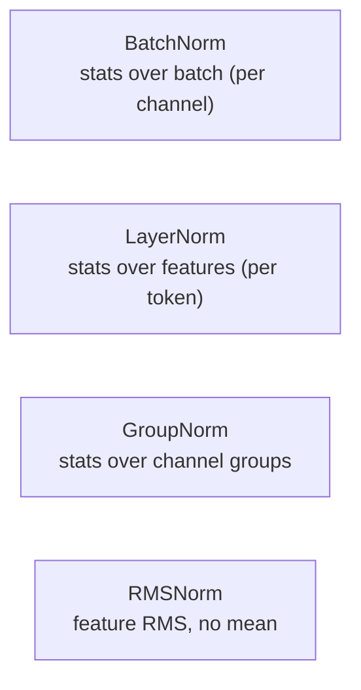
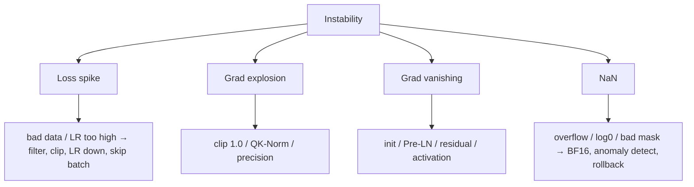

# Normalization & Stability

BatchNormLayerNormRMSNormPre-LNwarmupgrad clipping

> [!TIP] Say this first
> When a run "suddenly NaNs / spikes / stalls," the first axes to interrogate are **normalization, residuals, precision, and learning rate**. Interviewers want the *mechanism* (why RMSNorm, why Pre-LN, why warmup) and a *systematic debugging order* — not a list of tricks.

## Why normalize at all

Normalization keeps activations at a stable scale so gradients stay well-conditioned across depth. The families differ only in **which axis** they compute statistics over.

<dl class="kv">
<dt>BatchNorm</dt><dd>Normalizes each channel across the batch. Needs a decent batch; train/eval differ (running stats). Dominant in CNNs.</dd>
<dt>LayerNorm</dt><dd>Normalizes across features within one sample. Batch-size-independent → default for Transformers/ViT.</dd>
<dt>GroupNorm</dt><dd>Channel groups; robust at batch size 1–2 (high-res detection/segmentation). $G{=}1\!\approx\!$LN, $G{=}C\!\approx\!$InstanceNorm.</dd>
<dt>RMSNorm</dt><dd>Divides by feature RMS, no mean-centering, scale only. Cheaper; the LLM default.</dd>
</dl>

## The math

**BatchNorm** (per channel, over batch $B$):
$$
\hat x=\frac{x-\mu_B}{\sqrt{\sigma_B^2+\epsilon}},\quad y=\gamma\hat x+\beta
$$
Train uses batch stats + updates an EMA; inference uses the running stats (works at batch 1).

**LayerNorm** (over $H$ features of one token):
$$
\mu=\tfrac1H\textstyle\sum_i x_i,\quad \sigma^2=\tfrac1H\textstyle\sum_i (x_i-\mu)^2,\quad y=\gamma\odot\frac{x-\mu}{\sqrt{\sigma^2+\epsilon}}+\beta
$$

**RMSNorm** (no mean subtraction, usually no $\beta$):
$$
\mathrm{RMS}(x)=\sqrt{\tfrac1H\textstyle\sum_i x_i^2+\epsilon},\quad y=\gamma\odot\frac{x}{\mathrm{RMS}(x)}
$$

| | LayerNorm | RMSNorm |
| --- | --- | --- |
| Mean-center | yes | no |
| Scale by | std | RMS |
| Learn $\beta$ | yes | usually no |
| Used in | BERT, GPT-2, ViT | LLaMA, Mistral, Qwen, DeepSeek |

> [!NOTE] 2026 view on RMSNorm
> Modern LLMs standardize on **RMSNorm + Pre-LN**. Recent analysis (EACL 2026 Findings, Gupta et al.) argues LayerNorm's mean-centering removes a near-uniform component that is *already small* in trained representations — so RMSNorm loses little quality while saving compute. Caveat: this does **not** generalize to the BN/GN regime in vision. *(verifiable for the LLM claim; do not over-extend it.)*

Why do Transformers use LayerNorm/RMSNorm instead of BatchNorm?

**Short:** BatchNorm's statistics depend on the batch and on other sequences; with variable-length text, small/uneven batches, and autoregressive decoding (batch effectively 1), those stats are noisy or ill-defined. LN/RMSNorm normalize *within* a token, so they're batch-independent.

**Deep:** BN couples examples in a batch (a correctness/serving hazard once train≠eval stats), and sequence models often run at tiny effective batch. LN removed that coupling; RMSNorm then dropped mean-centering as largely redundant and cheaper. In **vision CNNs with large batches**, BN is still competitive or better — it's a regime question, not "LN is strictly superior." **Follow-ups:** *SyncBN?* — all-reduce batch stats across GPUs. *Frozen BN in detection fine-tuning?* — freeze backbone BN to eval stats because fine-tuning batches are tiny.

## Residual placement: Pre-LN vs Post-LN

**Post-LN** (original Transformer): $x_{l+1}=\mathrm{Norm}(x_l+\mathrm{SubLayer}(x_l))$.
**Pre-LN** (modern default): $x_{l+1}=x_l+\mathrm{SubLayer}(\mathrm{Norm}(x_l))$.

<figure>
<svg viewBox="0 0 560 190" xmlns="http://www.w3.org/2000/svg" font-family="Inter, sans-serif" font-size="12">
  <text x="140" y="18" text-anchor="middle" fill="#e0533f" font-weight="700">Pre-LN (stable, deep)</text>
  <rect x="110" y="35" width="60" height="24" rx="5" fill="none" stroke="#6366f1"/><text x="140" y="51" text-anchor="middle" fill="#6366f1">Norm</text>
  <rect x="110" y="72" width="60" height="24" rx="5" fill="none" stroke="#232b36"/><text x="140" y="88" text-anchor="middle" fill="#6b7686">Sublayer</text>
  <circle cx="140" cy="122" r="11" fill="none" stroke="#12a150"/><text x="140" y="126" text-anchor="middle" fill="#12a150">+</text>
  <path d="M40 130 V 122 H 129" stroke="#12a150" stroke-width="2" fill="none"/>
  <text x="40" y="150" text-anchor="middle" fill="#12a150">clean residual</text>
  <text x="420" y="18" text-anchor="middle" fill="#0ea5e9" font-weight="700">Post-LN (original)</text>
  <rect x="390" y="72" width="60" height="24" rx="5" fill="none" stroke="#232b36"/><text x="420" y="88" text-anchor="middle" fill="#6b7686">Sublayer</text>
  <circle cx="420" cy="46" r="11" fill="none" stroke="#232b36"/><text x="420" y="50" text-anchor="middle" fill="#6b7686">+</text>
  <rect x="390" y="112" width="60" height="24" rx="5" fill="none" stroke="#6366f1"/><text x="420" y="128" text-anchor="middle" fill="#6366f1">Norm</text>
  <text x="420" y="160" text-anchor="middle" fill="#6b7686">norm on residual → needs warmup</text>
</svg>
<figcaption>Pre-LN keeps an unnormalized identity highway → gradients flow cleanly, enabling very deep stacks with less warmup sensitivity. Post-LN can reach strong final quality but is touchier to train.</figcaption>
</figure>

Pre-LN keeps the residual stream un-normalized, so gradient magnitude is preserved through depth and warmup dependence is milder (not zero). Post-LN normalizes on the residual path — historically higher variance at init, needing careful warmup, but sometimes better final quality. Deep-stack variants: **Peri-LN**, **LayerScale**, and **QK-Norm** (normalize Q/K to stop attention-logit blow-up).

## Initialization, clipping, warmup

<dl class="kv">
<dt>Init</dt><dd>Kaiming/He for ReLU nets, Xavier/Glorot for tanh; scale residual-branch init down (e.g., $1/\sqrt{2N}$) so the residual stream doesn't explode with depth.</dd>
<dt>Gradient clipping</dt><dd>Clip global grad norm (typ. 1.0) to cap rare update spikes; essential for RNNs and large-batch LLM pretraining.</dd>
<dt>Warmup</dt><dd>Ramp LR from ~0 over the first 1–5% of steps, then decay (cosine). Lets Adam's second-moment estimate and attention patterns stabilize before large steps. Larger batch → longer warmup.</dd>
</dl>

Warmup interacts with normalization: Post-LN is markedly warmup-sensitive; even Pre-LN + RMSNorm typically keeps a short warmup in practice. See [Optimization](#/foundations/optimization).

Why does learning-rate warmup help, and how is it tied to normalization?

**Short:** at step 0 the weights are random, Adam's variance estimate is immature, and attention logits are unstable; a large LR then can diverge. Warmup buys time for statistics and representations to settle.

**Deep:** Adam's update $\propto \hat m/\sqrt{\hat v}$ has a high-variance $\hat v$ early on (bias correction only partly fixes this), so early steps are effectively over-large and noisy. Post-LN compounds this because the norm sits on the residual path and amplifies early instability — which is exactly why Post-LN needs warmup more than Pre-LN. **Follow-ups:** *Too-long warmup?* — wasted budget sitting at tiny LR. *Alternative?* — RAdam rectifies the variance term to reduce warmup need.

> [!NOTE] Norm-free research
> Attempts to remove normalization entirely — **DyT** (Dynamic Tanh replacing LN), and careful-init schemes like Fixup/SkipInit/ReZero — show it's *possible*, but production LLMs still ship RMSNorm because it's simpler to stabilize at scale. Knowing this exists (and that it's not yet the default) signals you track the frontier. *(defensible opinion.)*

## Instabilities: symptoms → fixes

| Symptom | Likely cause | Fix |
| --- | --- | --- |
| Loss spike then recovers | outlier batch, LR too high | data filter, grad clip, LR↓, skip bad batch |
| $\lVert g\rVert\!\to\!\infty$ | attention logit blow-up, FP16 overflow | clip, QK-Norm, BF16 |
| $\lVert g\rVert\!\approx\!0$, loss flat | bad init, no residual, saturated act | Pre-LN, residual, He init, GELU/SwiGLU |
| NaN loss | FP16 overflow, `log(0)`, all-`-inf` mask row | dynamic loss scale / BF16, $\epsilon$ guards, mask fix |

"Day 3 of pretraining, loss suddenly goes to NaN." Walk me through it.

**Short:** localize (which step / which rank), reproduce on the saved batch offline, check whether grad norm was climbing before the blow-up, then bisect across data shard, LR phase, precision, and resume state.

**Deep:** ordered playbook — (1) log the NaN step index and which rank(s); (2) dump that batch and run a forward pass offline; (3) inspect grad-norm history — a ramp implies instability, an instant NaN implies a bad input or overflow; (4) check for a `-inf` attention mask row (all-masked → softmax NaN), `log(0)`, or FP16 overflow (retry in BF16); (5) verify the resume didn't desync optimizer state; (6) mitigation: stronger clip, suspect layer in FP32, skip/rollback to a pre-spike checkpoint. If it only reproduces multi-GPU, suspect a collective/sync bug (see [Distributed Training](#/foundations/distributed-training)); if loss looks fine but metrics collapse, it's a data/eval bug (see [Debugging](#/foundations/debugging-experimentation)). **Follow-up:** *Reuse the post-spike checkpoint?* — risky; it may be contaminated, so roll back before the spike.

When is GroupNorm the right call over BatchNorm?

**Short:** when the effective batch is tiny — high-resolution detection/segmentation/matting where only 1–2 images fit per GPU — BN's batch stats become noise; GroupNorm (or LN) is batch-independent.

**Deep:** BN's error grows as batch shrinks because $\mu_B,\sigma_B^2$ are poor estimates. GroupNorm normalizes over channel groups within a sample, decoupling from batch size, and is standard in Mask R-CNN-style detectors at small batch; pairing it with **Weight Standardization** helps micro-batch training further. **Follow-up:** *Why not always GN?* — with large batches BN's cross-sample statistics act as useful regularization and often win on classification.

## Cheat-sheet

| Ask | One-liner |
| --- | --- |
| BN vs LN axis | BN over batch (per channel); LN over features (per token). |
| Why LN in Transformers | Batch-independent; robust to variable length and batch-1 decoding. |
| RMSNorm | Drop mean-centering, scale by RMS; cheaper, LLM default, ~no quality loss. |
| GroupNorm | Batch-independent; use at batch 1–2 (high-res detection/seg). |
| Pre-LN vs Post-LN | Pre-LN = clean residual highway, deep + less warmup-sensitive; Post-LN touchier. |
| Warmup | Ramp LR early so Adam variance + attention stabilize; scale length with batch. |
| Grad clip | Global-norm clip ~1.0 to tame spikes; vital for RNN + large-batch LLM. |
| NaN triage | Localize step/rank → offline batch → grad-norm history → mask/overflow → rollback. |
| QK-Norm | Normalize Q/K to prevent attention-logit explosion. |

**Related:** [CNNs, RNNs & Transformers](#/foundations/architectures) · [Optimization](#/foundations/optimization) · [Distributed Training](#/foundations/distributed-training) · [Mixed Precision & Efficiency](#/foundations/mixed-precision-efficiency) · [Debugging & Experimentation](#/foundations/debugging-experimentation)
