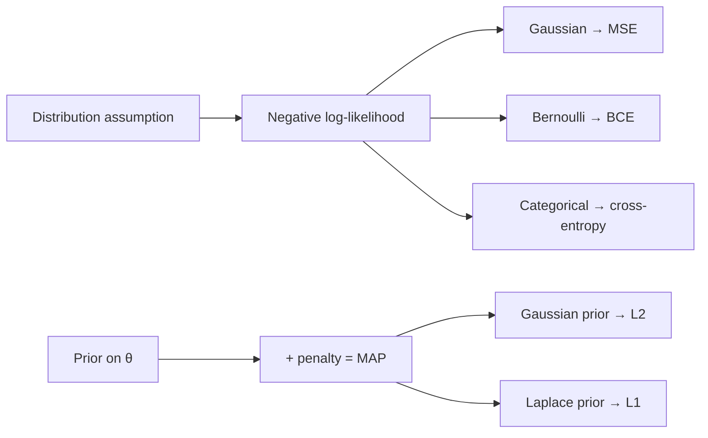

# 확률 & 통계

<div class="tag-row"><span class="tag">random variable</span><span class="tag">distribution</span><span class="tag">Bayes</span><span class="tag">MLE/MAP</span><span class="tag">KL & cross-entropy</span><span class="tag">CLT</span><span class="tag">A/B testing</span></div>

> [!NOTE] 이 챕터의 목표
> "확률" 하면 겁부터 나는 분이 많지만, 머신러닝에 필요한 건 몇 가지 직관뿐입니다: **불확실한 값(random variable)** 을 숫자로 다루는 법, 그 값이 어떻게 퍼져 있는지(**distribution**), 평균적으로 어떤 값인지(**expectation**). 이 직관은 MSE·BCE·cross-entropy처럼 자주 쓰는 손실이 어떤 **확률 모델**에서 나오는지 설명해 줍니다. 앞부분(§0)은 완전 입문, 뒤로 갈수록 면접 심화입니다.

## §0 · 가장 먼저: 확률 변수와 분포

**확률 변수(random variable)** 는 "아직 정해지지 않은, 불확실한 값"입니다. 주사위 눈, 내일 기온, 이미지가 고양이일 확률처럼요. 이 값이 **어떤 값을 얼마나 자주 갖는지**를 알려주는 것이 **확률 분포(probability distribution)** 입니다.

<div class="proscons"><div><div class="pros-t">이산(discrete) 분포</div>

값이 딱딱 떨어짐. 예: 동전(**Bernoulli**), 주사위, 클래스 라벨(**Categorical**). "각 값의 확률"을 표로 적을 수 있고, 다 더하면 1.

</div><div><div class="cons-t">연속(continuous) 분포</div>

값이 실수 전체. 예: 키, 온도(**Gaussian/정규분포**). 한 점의 확률은 0이고, 대신 "밀도(density)"로 구간의 확률을 잽니다.

</div></div>

### 평균(expectation)과 분산(variance)

- **기댓값/평균(expectation)** $\mathbb{E}[X]$: 값들을 확률로 가중평균한 것 — "평균적으로 어디쯤?"
- **분산(variance)** $\operatorname{Var}(X)$: 평균에서 얼마나 흩어져 있나 — "얼마나 들쭉날쭉?"

$$
\mathbb E[X]=\sum_x x\,P(x),\qquad \operatorname{Var}(X)=\mathbb E[(X-\mathbb EX)^2]
$$

가장 중요한 연속 분포인 **정규분포(Gaussian)** $\mathcal N(\mu,\sigma^2)$는 딱 두 숫자로 정해집니다: 중심 $\mu$(평균)와 폭 $\sigma$(표준편차). 그림으로 보면 직관이 확실해집니다.

<figure>
<svg viewBox="0 0 640 230" xmlns="http://www.w3.org/2000/svg" font-family="Inter, sans-serif" font-size="12">
  <line x1="30" y1="190" x2="610" y2="190" stroke="#98a3b2" stroke-width="1.4"/>
  <!-- narrow gaussian (small sigma), centered left -->
  <path d="M120 190 C 180 190, 200 40, 240 40 C 280 40, 300 190, 360 190" fill="none" stroke="#0ea5e9" stroke-width="2.5"/>
  <line x1="240" y1="190" x2="240" y2="40" stroke="#0ea5e9" stroke-width="1" stroke-dasharray="4 3"/>
  <text x="240" y="30" text-anchor="middle" fill="#0ea5e9">작은 σ (뾰족)</text>
  <!-- wide gaussian (large sigma), centered right -->
  <path d="M330 190 C 400 190, 420 110, 460 110 C 500 110, 520 190, 600 190" fill="none" stroke="#e0533f" stroke-width="2.5"/>
  <line x1="460" y1="190" x2="460" y2="110" stroke="#e0533f" stroke-width="1" stroke-dasharray="4 3"/>
  <text x="460" y="100" text-anchor="middle" fill="#e0533f">큰 σ (넓음)</text>
  <text x="240" y="208" text-anchor="middle" fill="#98a3b2">μ₁</text>
  <text x="460" y="208" text-anchor="middle" fill="#98a3b2">μ₂</text>
  <text x="320" y="225" text-anchor="middle" fill="#98a3b2">μ(평균)가 중심 위치를, σ(표준편차)가 폭을 결정 · 곡선 아래 넓이 = 1</text>
</svg>
<figcaption>정규분포는 평균 μ가 좌우 위치를, σ가 퍼짐 정도를 정합니다. 딥러닝에서 "가중치를 작은 정규분포로 초기화", "출력에 Gaussian noise 가정 → MSE 손실" 등 어디에나 등장합니다.</figcaption>
</figure>

> [!TIP] 면접 한 줄
> 이 챕터의 진짜 포인트는 정의 암기가 아니라 **연결**입니다: cross-entropy가 categorical MLE임을, L2가 Gaussian prior임을, NLL 최소화가 데이터 분포로의 KL 최소화임을 보일 수 있는가? A/B test의 peeking 버그를 잡아낼 수 있는가? CV/VLM 후보라면 **calibration, soft label, offline↔online 평가**가 배포의 통계적 척추입니다.

## §1 · 핵심 통찰: 손실 = 음의 로그가능도(NLL)

많이 쓰이는 지도학습 손실은 **"어떤 관측·noise 모델 아래에서의 음의 로그가능도(negative log-likelihood, NLL)"** 로 유도할 수 있고, 일부 regularizer는 **prior(사전 믿음)** 를 둔 MAP 추정으로 해석할 수 있습니다. 모든 목적함수·정규화가 이 틀에 들어가는 것은 아니지만, MSE·BCE·cross-entropy·L2를 외우지 않고 연결하는 데 유용합니다.



| Model (가정한 분포) | Density | 대응 손실 (NLL) |
| --- | --- | --- |
| Bernoulli, $p=\sigma(z)$ | $p^y(1-p)^{1-y}$ | binary cross-entropy $-[y\log p+(1-y)\log(1-p)]$ |
| Categorical, softmax $p$ | $\prod_k p_k^{y_k}$ | cross-entropy $-\sum_k y_k\log p_k$ |
| Gaussian (고정 $\sigma$) | $\mathcal N(y;\hat y,\sigma^2 I)$ | $\propto\|y-\hat y\|_2^2$ (MSE) |
| Gaussian (학습 $\sigma$) | $\mathcal N(y;\hat y,\sigma_\theta^2)$ | heteroscedastic NLL (불확실성 추정) |

즉, **"출력이 정규분포로 흩어진다"고 가정하면 MSE, "클래스 확률"이라 가정하면 cross-entropy**가 자동으로 나옵니다.

## §2 · Bayes, MLE, MAP를 한 흐름으로

$$
\underbrace{P(\theta\mid\mathcal D)}_{\text{posterior}}=\frac{\overbrace{P(\mathcal D\mid\theta)}^{\text{likelihood}}\ \overbrace{P(\theta)}^{\text{prior}}}{\underbrace{P(\mathcal D)}_{\text{evidence}}}
$$

- **MLE(최대가능도)**: 데이터를 가장 잘 설명하는 $\theta$. $\hat\theta_\text{MLE}=\arg\min_\theta \sum_i -\log P(x_i\mid\theta)$
- **MAP(최대사후)**: 거기에 사전 믿음(prior)을 곱함. $\hat\theta_\text{MAP}=\arg\min_\theta [\sum_i -\log P(x_i\mid\theta) -\log P(\theta)]$

Gaussian prior $P(\theta)\propto e^{-\frac{\lambda}{2}\|\theta\|_2^2}$는 목적함수에 $\tfrac{\lambda}{2}\|\theta\|_2^2$를 더합니다 — **Gaussian prior MAP = MLE + L2(weight decay)**. Laplace prior는 L1을 줍니다.

> [!NOTE] 비유에 대해 정직하기
> SGD의 해가 문자 그대로 MAP 추정치인 것은 아닙니다 — optimizer/초기화에서 오는 implicit regularization도 큽니다. "equals"가 아니라 "corresponds to / is analogous to"라고 말하세요. 그 균형 감각이 성숙함으로 읽힙니다.

## §3 · Entropy, cross-entropy, KL

$$
H(p)=-\sum_k p_k\log p_k,\quad
H(p,q)=-\sum_k p_k\log q_k,\quad
D_{\mathrm{KL}}(p\|q)=\sum_k p_k\log\frac{p_k}{q_k}=H(p,q)-H(p)
$$

직관: **entropy** $H(p)$는 "불확실성의 양"(동전이 공정할수록 큼), **cross-entropy** $H(p,q)$는 "$p$가 진실인데 $q$라고 믿을 때의 평균 놀람", **KL** $D_{\mathrm{KL}}(p\|q)$는 "$q$가 $p$에서 얼마나 떨어졌나"입니다.

핵심 성질: $D_{\mathrm{KL}}\ge 0$이고 $p=q$일 때만 0, 그리고 **비대칭**($D_{\mathrm{KL}}(p\|q)\ne D_{\mathrm{KL}}(q\|p)$). classifier 학습은 $H(p_\text{data},q_\theta)$ 최소화이고, hard one-hot label에서는 $H(p)=0$이라 **cross-entropy = 상수 차이의 KL = 정답 클래스의 log-prob 최대화**입니다.

### 직접 돌려보기 — KL divergence 구현

두 이산 분포 사이의 KL을 직접 구현해 봅시다. 주의할 점: $p_k=0$인 항은 $0\log 0 = 0$으로 처리해야 합니다(로그 폭발 방지).

<div class="widget" data-widget="code">
<script type="application/json" class="code-config">
{"func":"kl_divergence","packages":["numpy"],"approx":true,"starter":"def kl_divergence(p, q):\n    # 두 이산 확률분포 p, q (각각 합이 1인 리스트) 사이의 KL: sum_k p_k * log(p_k / q_k)\n    # 자연로그(np.log) 사용.  p_k == 0 인 항은 0 으로 건너뛰세요 (0*log0 = 0).\n    pass","tests":[{"args":[[0.5,0.5],[0.5,0.5]],"expect":0.0,"tol":1e-4},{"args":[[1.0,0.0],[0.5,0.5]],"expect":0.6931,"tol":1e-3},{"args":[[0.7,0.3],[0.5,0.5]],"expect":0.0823,"tol":1e-3}],"solution":"import numpy as np\n\ndef kl_divergence(p, q):\n    p = np.asarray(p, float); q = np.asarray(q, float)\n    mask = p > 0                      # 0*log0 = 0 처리\n    return float(np.sum(p[mask] * np.log(p[mask] / q[mask])))"}
</script>
</div>

첫 테스트에서 같은 분포는 KL=0입니다. 두 번째는 **target 분포 $p=(1,0)$가 첫 클래스를 확실한 정답으로 두는데 모델 분포 $q=(0.5,0.5)$가 반반을 예측한 경우**라서 $\log 2\approx0.693$의 벌점을 냅니다. KL은 방향이 중요하므로 어느 분포가 기준 $p$이고 어느 분포가 근사 $q$인지 항상 함께 말해야 합니다.

> [!EXAMPLE] Softmax 수치 안정성 & KL의 비대칭
> $\operatorname{softmax}(z)_k=e^{z_k}/\sum_j e^{z_j}$는 큰 $z$에서 overflow합니다 — **log-sum-exp 트릭**으로 max를 빼세요: $\log\sum_j e^{z_j}=m+\log\sum_j e^{z_j-m}$. Temperature $T$($z/T$)는 argmax($T\to0$)에서 uniform($T\to\infty$)까지 보간하는 손잡이(distillation·sampling). **KL 비대칭**: forward KL $D_{\mathrm{KL}}(p_\text{data}\|q)$는 *mode-covering*(모든 mode를 덮어 흐릿), reverse KL은 *mode-seeking*(한 mode에 집중) — VAE/variational inference의 단골 논점.

### Classification에서 CE와 MSE를 통계적으로 비교하면?

먼저 무엇에 MSE를 적용하는지 구분해야 합니다. probability $q$와 one-hot label 사이의 squared error는 **Brier score**이며 유효한 proper scoring rule입니다. 반면 raw logit에 MSE를 적용하면 $z$와 $z+c\mathbf1$이 같은 categorical distribution을 나타낸다는 비식별성을 무시하므로 자연스러운 probability loss가 아닙니다.

실제 binary label이 $Y\sim\operatorname{Bernoulli}(r)$이고 모델이 positive probability $q$를 낸다고 합시다. 모집단 expected risk는

$$
R_{\mathrm{CE}}(q)=-r\log q-(1-r)\log(1-q),
\qquad
R_{\mathrm{Brier}}(q)=r(1-q)^2+(1-r)q^2.
$$

둘을 미분하면 각각 $q=r$에서 유일한 minimum을 갖습니다. 즉 둘 다 충분한 데이터와 표현력이 있으면 **진짜 조건부 확률을 정직하게 보고하도록** 유도하는 strictly proper scoring rule입니다.

<figure>
<svg viewBox="0 0 700 285" xmlns="http://www.w3.org/2000/svg" font-family="Inter, sans-serif" font-size="11" role="img" aria-labelledby="ce-mse-title-ko ce-mse-desc-ko">
  <title id="ce-mse-title-ko">Cross-entropy와 Brier score의 expected risk 및 logit gradient 비교</title>
  <desc id="ce-mse-desc-ko">왼쪽은 실제 positive 확률이 0.7일 때 cross-entropy와 Brier excess risk가 모두 예측 0.7에서 최소임을 보인다. 오른쪽은 정답이 1일 때 확신에 찬 오답 구간에서 cross-entropy logit gradient는 크지만 sigmoid 뒤 MSE gradient는 0으로 작아짐을 보인다.</desc>
  <text x="175" y="18" text-anchor="middle" fill="currentColor">통계: expected excess risk (r=0.7)</text>
  <line x1="48" y1="230" x2="315" y2="230" stroke="#98a3b2"/><line x1="48" y1="230" x2="48" y2="42" stroke="#98a3b2"/>
  <g fill="#98a3b2" font-size="10">
    <text x="48" y="247" text-anchor="middle">0</text><text x="115" y="247" text-anchor="middle">.25</text><text x="181" y="247" text-anchor="middle">.5</text><text x="234" y="247" text-anchor="middle">.7</text><text x="315" y="247" text-anchor="middle">1</text>
    <text x="181" y="269" text-anchor="middle">예측 probability q</text>
  </g>
  <path d="M58 47 C85 95,125 145,181 195 C207 216,224 228,234 230 C251 227,276 196,305 61" fill="none" stroke="#e0533f" stroke-width="2.5"/>
  <path d="M58 118 C104 161,163 207,234 230 C266 220,289 202,305 181" fill="none" stroke="#6366f1" stroke-width="2.5"/>
  <circle cx="234" cy="230" r="5" fill="#12a150"/>
  <text x="90" y="65" fill="#e0533f">CE−H(r)=KL(r‖q)</text>
  <text x="72" y="135" fill="#6366f1">Brier−min=(q−r)²</text>
  <text x="234" y="215" text-anchor="middle" fill="#12a150">둘 다 q*=r=.7</text>
  <line x1="350" y1="28" x2="350" y2="250" stroke="#98a3b2" opacity=".45"/>
  <text x="525" y="18" text-anchor="middle" fill="currentColor">최적화: true class가 y=1일 때</text>
  <line x1="390" y1="230" x2="665" y2="230" stroke="#98a3b2"/><line x1="390" y1="230" x2="390" y2="42" stroke="#98a3b2"/>
  <g fill="#98a3b2" font-size="10">
    <text x="390" y="247" text-anchor="middle">0</text><text x="459" y="247" text-anchor="middle">.25</text><text x="528" y="247" text-anchor="middle">.5</text><text x="596" y="247" text-anchor="middle">.75</text><text x="665" y="247" text-anchor="middle">1</text>
    <text x="528" y="269" text-anchor="middle">true-class probability p</text>
  </g>
  <path d="M390 48 L665 230" fill="none" stroke="#e0533f" stroke-width="2.5"/>
  <path d="M390 230 C420 207,451 191,482 198 C530 209,589 225,665 230" fill="none" stroke="#6366f1" stroke-width="2.5"/>
  <circle cx="396" cy="52" r="4" fill="#e0533f"/><circle cx="396" cy="229" r="4" fill="#6366f1"/>
  <text x="475" y="70" fill="#e0533f">CE: |∂L/∂z|=1−p</text>
  <text x="480" y="190" fill="#6366f1">MSE: ∝p(1−p)²</text>
  <text x="525" y="112" text-anchor="middle" fill="#98a3b2">p→0인 확신에 찬 오답:</text>
  <text x="525" y="129" text-anchor="middle" fill="#98a3b2">CE 신호는 남고 MSE 신호는 사라짐</text>
</svg>
<figcaption><b>통계적으로</b> CE와 probability-space MSE(Brier)는 모두 정답 확률 $r$에서 expected risk가 최소입니다. 차이는 주로 likelihood 해석과 <b>logit-space 최적화 geometry</b>에 있습니다. CE는 틀린 클래스에 포화된 모델에도 큰 수정 신호를 주지만, softmax/sigmoid 뒤 MSE에는 추가 Jacobian이 곱해져 신호가 작아집니다.</figcaption>
</figure>

| 관점 | Cross-entropy | MSE on probabilities (Brier) |
| --- | --- | --- |
| 확률 모델 | Bernoulli/categorical NLL | squared probability error; proper score |
| 확신에 찬 오답 | $-\log q_y\to\infty$ — 강한 penalty | bounded — 비교적 완만 |
| logit gradient | softmax/sigmoid Jacobian이 상쇄되어 $q-y$ | Jacobian이 한 번 더 곱해져 포화 시 작음 |
| 실무 해석 | likelihood training의 자연스러운 기본값 | calibration 평가·일부 예측 문제에서 유용 |

따라서 좋은 답은 “MSE는 분류에서 틀렸다”가 아닙니다. **CE는 categorical likelihood에 정확히 대응하고, 확신에 찬 오답에서도 유용한 logit gradient를 주기 때문에 기본값**입니다. Brier는 bounded하므로 label noise나 outlier에 덜 공격적일 수 있고 calibration을 보는 데 유용합니다. 반대로 CE의 unbounded penalty가 항상 더 좋은 calibration·robustness를 보장하는 것은 아닙니다. softmax가 왜 exponential을 쓰는지와 CE 결합 미분은 [손실 & Gradient](#/ml-coding/losses-gradients)에 있습니다.

## §4 · Expectation, variance, 그리고 CLT (심화)

- **큰 수의 법칙(LLN):** 표본 평균이 $\mathbb E[X]$로 수렴 — 그래서 empirical risk $\hat R=\frac1n\sum_i \ell_i$가 true risk를 근사합니다.
- **중심극한정리(CLT):** 독립·동일분포이고 분산이 유한하다는 등의 조건 아래, 정규화된 표본 평균의 분포가 Gaussian으로 향합니다. $\sigma$를 알고 있거나 표본이 충분히 클 때 $\pm1.96\,\sigma/\sqrt n$ 같은 근사를 쓰며, 작은 표본에서 $\sigma$를 추정하면 보통 t interval을 씁니다.
- **Minibatch gradient**는 샘플을 균등하게 뽑고 loss가 샘플별로 분해된다는 조건에서 full-data gradient의 unbiased estimate입니다. 독립 표본 근사에서는 분산이 대략 $1/B$로 줄지만, without-replacement sampling에는 finite-population correction이 있고 BatchNorm처럼 배치 샘플을 결합하는 연산은 이 단순한 주장을 깨뜨립니다.

## §5 · Hypothesis testing & A/B, 함정 없이 (심화)

<dl class="kv">
<dt>p-value</dt><dd>P(적어도 이만큼 극단적인 데이터 | $H_0$). <b>$P(H_0\mid\text{data})$가 아닙니다.</b></dd>
<dt>Type I / II</dt><dd>$\alpha$ = 참인 $H_0$를 기각(false positive); $\beta$ = 거짓 $H_0$를 못 기각; power $=1-\beta$.</dd>
<dt>Effect size</dt><dd>큰 $n$에서는 사소한 차이도 "significant". 유의성만이 아니라 항상 크기를 보고하세요.</dd>
</dl>

conversion에 대한 two-proportion z-test: $z=\dfrac{\hat p_A-\hat p_B}{\sqrt{\hat p(1-\hat p)(1/n_A+1/n_B)}}$

> [!WARNING] Peeking 함정
> 실험을 반복적으로 들여다보다 $p<0.05$를 넘는 순간 멈추면 false-positive rate가 $\alpha$보다 크게 부풀어 오릅니다. power/MDE 계산으로 sample size를 미리 고정하거나 **sequential test**(always-valid p-value, mSPRT)를 쓰세요. **SRM(sample-ratio mismatch)** 을 확인하고 **multiple comparison**을 보정(Bonferroni/FDR)하세요. **CUPED** 같은 variance reduction은 실험 전 covariate로 공짜 power를 벌어줍니다.

> **개념 코드 — fixed-horizon A/B의 순서**

```python
plan = design_ab_test(alpha=0.05, power=0.80, mde=0.01)
assignment = randomize(users, ratio=(0.5, 0.5))
events = collect_until_n(assignment, plan.sample_size)  # 중간 결과로 중단 금지

assert sample_ratio_test(events).p_value > 0.001        # logging/배정 검사
effect, ci, p_value = two_sample_test(events)
ship = (p_value < plan.alpha
        and ci.low > business_minimum
        and guardrails_are_safe(events))
```

## §6 · Sampling & estimation (심화)

- **Monte Carlo:** $x_i\sim p$로 $\mathbb E_{p}[f(x)]\approx\frac1N\sum_i f(x_i)$. 표준오차의 수렴 차수는 보통 $1/\sqrt N$이라 격자법처럼 차원이 지수에 직접 들어가지는 않지만, 분산이라는 상수는 차원·분포·integrand에 따라 매우 커질 수 있습니다.
- **Importance sampling:** $p$ 대신 $q$로 샘플하고 reweight, $\mathbb E_p[f]=\mathbb E_q[f\,\tfrac{p}{q}]$. $q$가 $p$와 어긋나면 분산 폭발 — off-policy RL의 핵심 난점.
- **Reparameterization trick:** $x=\mu+\sigma\epsilon,\ \epsilon\sim\mathcal N(0,1)$로 무작위성을 parameter에서 떼어 gradient가 sample을 통과(VAE). 이산 대응물은 **Gumbel-Softmax**.
- **Estimator 품질:** squared-error 기준의 MSE는 $\mathrm{bias}^2+\mathrm{variance}$로 분해됩니다(관측 noise를 예측하는 문제라면 irreducible noise 항도 구분). sample mean은 unbiased이고, MLE는 정규성 조건 아래 consistent·asymptotically efficient하지만 작은 표본에서는 biased일 수 있습니다.

## §7 · Calibration (심화)

model은 $P(Y=\hat Y \mid \hat P=p)\approx p$이면 *well-calibrated*입니다. Softmax confidence는 기본적으로 calibrated가 **아니며**(현대 net은 대개 over-confident) **Expected Calibration Error(ECE)** 로 측정하고 **temperature scaling**(validation에서 scalar $T$ 하나 fit)으로 값싸게 고칩니다. 자세히는 [Evaluation Metrics](#/foundations/evaluation-metrics).

## 면접 Q&A

<details class="qa"><summary>Classification에 왜 cross-entropy이고 MSE가 아닌가?</summary>
<div class="qa-body">

**Short:** cross-entropy는 categorical model의 NLL이고, 최소화하면 $D_{\mathrm{KL}}(p_{\text{data}}\Vert q_\theta)$를 최소화합니다. 확률 벡터에 대한 MSE/Brier score도 유효한 proper scoring rule이지만, softmax와 결합한 gradient 및 probabilistic model이 달라 보통 CE가 더 자연스럽습니다.

**Deep:** softmax로 $q_\theta(y\mid x)$를 얻으면 one-hot label의 NLL이 정확히 cross-entropy이고 logit gradient는 깔끔한 $q-y$입니다. MSE/Brier도 확률 예측을 학습할 수 있지만 softmax Jacobian을 한 번 더 거치므로 포화 영역의 gradient가 작아질 수 있습니다. "MSE는 틀렸다"가 아니라 **categorical likelihood와 최적화 geometry 때문에 CE를 기본으로 고른다**고 설명하세요. 유도는 [선형대수 & 미적분](#/foundations/linear-algebra-calculus).
</div></details>

<details class="qa"><summary>MLE, MAP, L2 regularization을 연결하라.</summary>
<div class="qa-body">

**Short:** MLE는 likelihood를, MAP는 likelihood×prior를 최대화합니다. zero-mean Gaussian prior는 MAP 목적에 $\tfrac{\lambda}{2}\|\theta\|_2^2$라는 L2 penalty를 더합니다. 이는 SGD류에서는 weight decay와 같은 형태지만 AdamW의 decoupled decay와는 일반적으로 같은 최적화 궤적이 아닙니다.

**Deep:** Gaussian의 $-\log P(\theta)$는 quadratic, Laplace는 $|\theta|$라 L1·sparsity. MLE 단독은 small-sample에서 overfit(high variance)하고, prior/regularizer는 약간의 bias로 큰 variance 감소를 얻습니다. Fully-Bayesian 예측은 posterior에 대해 적분하며 point estimate는 그 근사입니다.
</div></details>

<details class="qa"><summary>KL divergence와 그 비대칭성을 ML 예시로 설명하라.</summary>
<div class="qa-body">

**Short:** $D_{\mathrm{KL}}(p\|q)=H(p,q)-H(p)\ge0$, $p=q$일 때만 0, 비대칭.

**Deep:** forward KL $D_{\mathrm{KL}}(p_\text{data}\|q_\theta)$ 최소화(max-likelihood)는 $q$가 $p$의 모든 mode를 덮게 합니다($p>0,q\approx0$인 곳마다 큰 penalty → mode-covering, 흐릿한 생성). reverse KL은 $q$가 한 mode에 집중(mode-seeking). Distillation은 soft teacher 분포에 대해 $H(p_T,p_S)$를 최소화.
</div></details>

<details class="qa"><summary>이틀 만에 A/B test가 p<0.05를 찍었다. 배포할까?</summary>
<div class="qa-body">

**Short:** 아직입니다 — peeking artifact일 가능성이 큽니다. 사전 등록한 sample size 도달 여부, SRM, effect size, guardrail을 보세요.

**Deep:** threshold를 넘는 순간 멈추면 Type I error가 부풀어 오릅니다. fixed-horizon test에 전념하거나 연속 모니터링을 허용하는 always-valid sequential 절차로 전환하세요. SRM(logging/assignment 버그 신호)을 확인하고 lift의 신뢰구간을 보고하며, offline 승리(예: 높은 mIoU)가 실제 online guardrail(latency·비용)을 움직이는지 확인하세요. 고위험(결제·face auth)은 raw A/B보다 staged canary. [Evaluation Metrics](#/foundations/evaluation-metrics).
</div></details>

**예상 follow-up**

- *Conjugate prior?* Posterior가 prior와 같은 family(Beta–Bernoulli, Normal–Normal) — closed-form 업데이트.
- *LLN vs CLT?* Mean → expectation vs. 평균의 분포 → Gaussian.
- *Sigmoid+BCE vs softmax+CE?* 독립 multi-label vs. 상호배타 single label.
- *Label smoothing을 정보이론으로?* one-hot을 부드러운 $p$로 → $H(p)>0$, 무한대 logit을 억제.
- *Perplexity?* $\exp(\text{평균 token NLL})$ — language model cross-entropy의 지수화.

## Cheat-sheet

| Fact | 한 줄 |
| --- | --- |
| random variable / distribution | 불확실한 값 / 그 값의 확률 지형 |
| expectation / variance | 평균 위치 / 흩어진 정도 |
| Gaussian | 평균 μ·표준편차 σ 두 숫자로 결정 |
| Bayes | posterior ∝ likelihood × prior |
| MLE vs MAP | max likelihood vs likelihood×prior; Gaussian prior ⇒ L2, Laplace ⇒ L1 |
| 손실 = NLL | Gaussian→MSE, Bernoulli→BCE, Categorical→cross-entropy |
| CE = KL + H(p) | hard label ⇒ CE = 상수 차이의 KL |
| KL | ≥0, 비대칭; forward mode-covering, reverse mode-seeking |
| log-sum-exp | exp 전에 max 빼기; `cross_entropy`로 fuse |
| CLT | mean ≈ $\mathcal N(\mu,\sigma^2/n)$; CI·z-test의 근거 |
| p-value | P(data\|H₀) — peeking·SRM·multiplicity 주의 |
| calibration | softmax ≠ calibrated; temperature scaling으로 교정 |

**다음:** [Optimization](#/foundations/optimization) · [Regularization & 일반화](#/foundations/regularization-generalization) · [평가 지표](#/foundations/evaluation-metrics) · [선형대수 & 미적분](#/foundations/linear-algebra-calculus)
