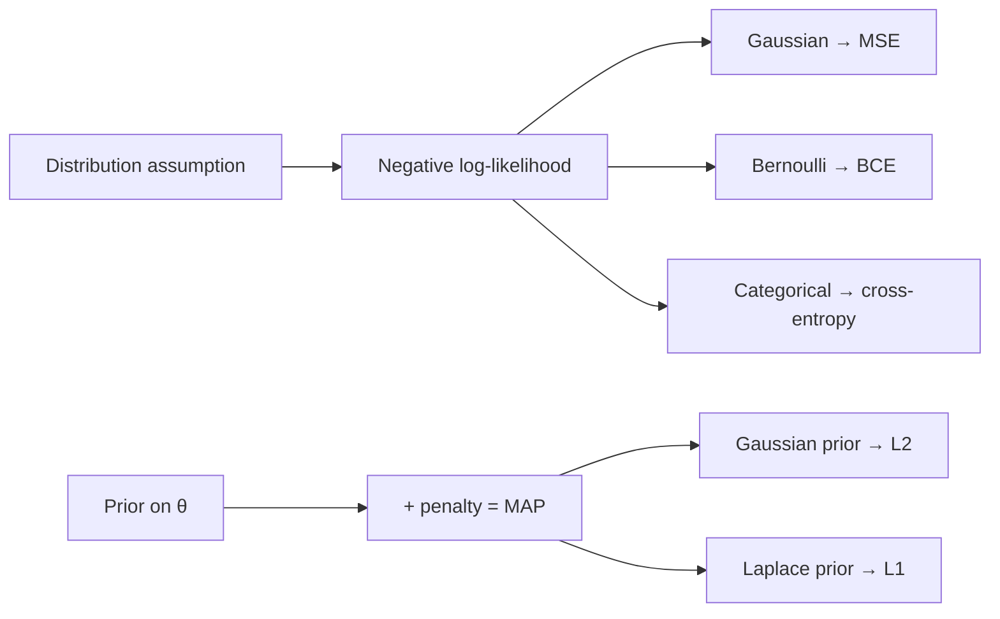

# Probability & Statistics

BayesMLE/MAPKL & cross-entropyCLTA/B testingcalibration

> [!TIP] 실제로 테스트되는 것
> 정의가 아니라 *연결*입니다. cross-entropy가 categorical MLE임을, L2가 Gaussian prior임을, NLL을 최소화하는 것이 데이터 분포에 대한 KL을 최소화하는 것임을 보일 수 있나요? A/B test에서 peeking 버그를 잡아낼 수 있나요? CV/VLM 후보자에게 이 장은 **calibration, soft label, offline-vs-online evaluation**이 있는 곳이기도 합니다 — model을 배포하는 일의 statistical한 척추죠.

## 단 하나의 다이어그램: likelihood → loss

거의 모든 supervised loss는 어떤 noise model 하에서의 NLL이고, 거의 모든 regularizer는 prior입니다. 이걸 체화하면 loss를 외우는 대신 *유도*할 수 있습니다.

## Bayes, MLE, MAP를 한 흐름으로

$$
\underbrace{P(\theta\mid\mathcal D)}_{\text{posterior}}=\frac{\overbrace{P(\mathcal D\mid\theta)}^{\text{likelihood}}\ \overbrace{P(\theta)}^{\text{prior}}}{\underbrace{P(\mathcal D)}_{\text{evidence}}}
$$

$$
\hat\theta_\text{MLE}=\arg\min_\theta \sum_i -\log P(x_i\mid\theta),\qquad
\hat\theta_\text{MAP}=\arg\min_\theta \Big[\sum_i -\log P(x_i\mid\theta) \;-\;\log P(\theta)\Big]
$$

Gaussian prior $P(\theta)\propto e^{-\frac{\lambda}{2}\|\theta\|_2^2}$는 objective에 $\tfrac{\lambda}{2}\|\theta\|_2^2$를 기여합니다 — **Gaussian prior를 쓴 MAP = MLE + L2**. Laplace prior $\propto e^{-\lambda\|\theta\|_1}$는 L1을 줍니다.

> [!NOTE] 비유에 대해 정직해라
> SGD의 해가 문자 그대로 MAP 추정치인 것은 아닙니다 — optimizer와 initialization에서 오는 implicit regularization도 중요합니다. "equals"가 아니라 "corresponds to / is analogous to"라고 말하세요. 그런 균형 감각이 성숙함으로 읽힙니다.

## Distribution ↔ loss

| Model | Density | NLL loss |
| --- | --- | --- |
| Bernoulli, $p=\sigma(z)$ | $p^y(1-p)^{1-y}$ | binary cross-entropy $-[y\log p+(1-y)\log(1-p)]$ |
| Categorical, softmax $p$ | $\prod_k p_k^{y_k}$ | cross-entropy $-\sum_k y_k\log p_k$ |
| Gaussian (fixed $\sigma$) | $\mathcal N(y;\hat y,\sigma^2 I)$ | $\propto\|y-\hat y\|_2^2$ (MSE) |
| Gaussian (learned $\sigma$) | $\mathcal N(y;\hat y,\sigma_\theta^2)$ | heteroscedastic NLL (uncertainty) |

## Entropy, cross-entropy, KL

$$
H(p)=-\sum_k p_k\log p_k,\quad
H(p,q)=-\sum_k p_k\log q_k,\quad
D_{\mathrm{KL}}(p\|q)=\sum_k p_k\log\frac{p_k}{q_k}=H(p,q)-H(p)
$$

핵심 성질: $D_{\mathrm{KL}}\ge 0$이며 $p=q$일 때만 등호; 그리고 **비대칭**입니다. Forward KL $D_{\mathrm{KL}}(p_\text{data}\|q)$는 *mode-covering*이고, reverse KL은 *mode-seeking*입니다(VAE / variational-inference에서 반복적으로 나오는 논점). classifier를 학습하는 것은 $H(p_\text{data},q_\theta)$를 최소화하는 것이며, hard one-hot label에서는 $H(p)=0$이므로 **cross-entropy = 상수 차이의 KL = 올바른 class의 log-prob 최대화**입니다.

> [!EXAMPLE] Softmax 수치 안정성
> $\operatorname{softmax}(z)_k=e^{z_k}/\sum_j e^{z_j}$는 큰 $z$에서 overflow합니다. log-sum-exp 트릭은 max를 빼줍니다: $\log\sum_j e^{z_j}=m+\log\sum_j e^{z_j-m}$, $m=\max_j z_j$. Temperature $T$($z/T$ 사용)는 argmax($T\to0$)에서 uniform($T\to\infty$)까지 보간합니다 — distillation과 sampling 뒤에 있는 손잡이죠.

## Expectation, variance, 그리고 CLT

$$
\mathbb E[X]=\sum_x xP(x),\quad \operatorname{Var}(X)=\mathbb E[(X-\mathbb EX)^2],\quad \operatorname{Cov}(X,Y)=\mathbb E[(X-\mu_x)(Y-\mu_y)]
$$

- **Law of large numbers:** sample mean이 $\mathbb E[X]$로 수렴합니다 — 그래서 empirical risk $\hat R=\frac1n\sum_i \ell_i$가 true risk를 근사합니다.
- **Central limit theorem:** (정규화된) mean의 *분포*가 Gaussian으로 향합니다, $\frac1n\sum X_i \approx \mathcal N(\mu,\sigma^2/n)$, $X_i$의 분포와 무관하게(유한 variance). 이것이 $\pm 1.96\,\sigma/\sqrt n$ confidence interval과 아래의 z-test를 뒷받침합니다.
- Minibatch gradient는 full-batch gradient의 (unbiased) noisy estimate이고, 그 variance는 $1/B$처럼 줄어듭니다 — [Optimization](#/foundations/optimization)에서 나오는 batch-size 효과의 statistical한 근거입니다.

## Hypothesis testing & A/B, footgun 없이

<dl class="kv">
<dt>p-value</dt><dd>P(적어도 이만큼 극단적인 데이터 | $H_0$). <b>$P(H_0\mid\text{data})$가 아닙니다.</b></dd>
<dt>Type I / II</dt><dd>$\alpha$ = 참인 $H_0$를 기각(false positive); $\beta$ = 거짓인 $H_0$를 기각하지 못함; power $=1-\beta$.</dd>
<dt>Effect size</dt><dd>큰 $n$에서는 사소한 차이도 "significant"해집니다. 유의성만이 아니라 항상 크기를 보고하세요.</dd>
</dl>

conversion에 대한 two-proportion z-test:

$$
z=\frac{\hat p_A-\hat p_B}{\sqrt{\hat p(1-\hat p)(1/n_A+1/n_B)}}
$$

> [!WARNING] Peeking 함정
> 실험을 반복적으로 들여다보다 $p<0.05$를 넘는 순간 멈추면 false-positive rate가 $\alpha$보다 훨씬 부풀어 오릅니다. power/MDE 계산으로 sample size를 미리 고정하거나, **sequential test**(always-valid p-value, mSPRT)를 쓰세요. 또 **sample-ratio mismatch (SRM)**를 확인하고 **multiple comparison**을 보정하세요(Bonferroni/FDR). **CUPED** 같은 variance-reduction은 실험 전 covariate를 이용해 공짜로 power를 벌어줍니다.

## Sampling & estimation

진짜 분포를 아는 경우는 드뭅니다 — 가진 건 sample이죠. 반복해서 등장하는 두 아이디어:

- **Monte Carlo estimation:** $x_i\sim p$로 $\mathbb E_{p}[f(x)]\approx\frac1N\sum_i f(x_i)$를 근사합니다. 오차는 $1/\sqrt N$처럼 줄고, *차원과 무관*합니다 — 고차원에서 MC가 grid quadrature를 이기는 이유죠(dropout-MC uncertainty, RL return, VAE ELBO에 사용).
- **Importance sampling:** $p$를 sampling할 수 없지만 $q$는 sampling할 수 있을 때 reweight합니다: $\mathbb E_p[f]=\mathbb E_q[f\,\tfrac{p}{q}]$. $q$가 $p$와 어긋나면 variance가 큽니다 — off-policy RL의 핵심 난점입니다.
- **Reparameterization trick:** $x\sim\mathcal N(\mu,\sigma^2)$를 $x=\mu+\sigma\epsilon,\ \epsilon\sim\mathcal N(0,1)$로 다시 써서 무작위성을 parameter에서 떼어내면 gradient가 sample을 통과해 흐릅니다(VAE). Discrete 대응물: **Gumbel-Softmax**.
- **Estimator 품질:** estimator의 오차는 bias² + variance로 분해됩니다; sample mean은 unbiased이고, MLE는 *consistent하고 asymptotically efficient*하지만 small sample에서는 biased일 수 있습니다(예: variance estimator의 $1/n$ vs $1/(n-1)$).

## Calibration

model은 $P(Y=\hat Y \mid \hat P=p)\approx p$이면 *well-calibrated*됐다고 합니다. Softmax confidence는 기본적으로 calibrated가 **아닙니다**(현대 net은 보통 over-confident). 이를 **Expected Calibration Error**로 측정하고 **temperature scaling**(validation set에서 scalar $T$ 하나를 fit)으로 값싸게 고칩니다. 더 자세한 내용은 [Evaluation Metrics](#/foundations/evaluation-metrics)에 있습니다.

## Interview Q&A

Classification에 왜 cross-entropy이고 MSE가 아닌가?

**Short:** cross-entropy는 categorical model의 MLE이고, 이를 최소화하는 것은 model에서 데이터 분포로의 KL을 최소화합니다. MSE는 Gaussian noise를 가정하는데 — discrete label에는 틀린 likelihood입니다.

**Deep:** logit 위에 softmax를 얹어 $q_\theta(y\mid x)$를 얻으면, one-hot label의 NLL이 정확히 cross-entropy입니다. 그 logit에 대한 gradient는 깔끔한 $p-y$입니다. Softmax output에 대한 MSE는 예측이 자신 있게 틀렸을 때 vanishing gradient를 주고(logistic-MSE saturation 문제) 합리적인 label noise model에 대응하지도 않습니다. 유도는 [Linear Algebra & Calculus](#/foundations/linear-algebra-calculus)를 보세요.

MLE, MAP, L2 regularization을 연결하라.

**Short:** MLE는 likelihood를 최대화하고, MAP는 likelihood × prior를 최대화합니다. zero-mean Gaussian prior는 MAP penalty를 $\tfrac{\lambda}{2}\|\theta\|_2^2$로 만듭니다 — 즉 L2 / weight decay죠.

**Deep:** Gaussian에 대한 $-\log P(\theta)$는 $\theta$에 대해 quadratic이고, Laplace prior에서는 $|\theta|$가 되어 L1과 sparsity를 줍니다. MLE 단독은 small-sample 영역에서 overfit하는 경향이 있는데(high-variance estimate), prior/regularizer는 약간의 bias를 내주고 큰 variance 감소를 얻습니다. Fully-Bayesian 예측은 posterior에 대해 적분합니다, $P(x_*\mid\mathcal D)=\int P(x_*\mid\theta)P(\theta\mid\mathcal D)\,d\theta$, point estimate는 이를 근사한 것입니다.

KL divergence와 그 비대칭성을 ML 예시로 설명하라.

**Short:** $D_{\mathrm{KL}}(p\|q)=H(p,q)-H(p)\ge0$, $p=q$일 때만 0이며, $D_{\mathrm{KL}}(p\|q)\ne D_{\mathrm{KL}}(q\|p)$.

**Deep:** forward KL $D_{\mathrm{KL}}(p_\text{data}\|q_\theta)$를 최소화하면(max-likelihood 학습처럼) $q$가 $p$의 모든 mode를 덮게 됩니다 — $p>0$인데 $q\approx0$인 곳마다 막대한 penalty를 물어서 mass를 퍼뜨립니다(mode-covering, 때로 흐릿한 생성). 일부 variational/RL objective에서 쓰이는 reverse KL $D_{\mathrm{KL}}(q_\theta\|p)$는 $q$가 하나의 mode에 집중하고 나머지를 무시하게 합니다(mode-seeking). Distillation은 soft teacher 분포에 대해 $H(p_T,p_S)$를 최소화합니다.

이틀 만에 A/B test가 p<0.05를 찍었다. 배포할까?

**Short:** 아직입니다 — 그건 peeking artifact일 가능성이 큽니다. 사전 등록한 sample size에 도달했는지 확인하고, SRM을 검증하고, effect size와 guardrail metric을 보세요.

**Deep:** threshold를 넘는 순간 멈추면 Type I error가 극적으로 부풀어 오릅니다. power/MDE 계산으로 크기를 정한 fixed-horizon test에 전념하거나, 연속 모니터링을 *허용*하는 always-valid sequential 절차로 전환하세요. 그다음 sample-ratio mismatch가 없는지 확인하고(logging/assignment 버그의 신호), lift에 대한 confidence interval을 보고하며, offline 승리(예: 더 높은 mIoU)가 실제로 online guardrail을 움직이는지 확인하세요 — latency와 비용이 품질 이득을 지워버릴 수 있습니다. 고위험 표면(결제, face auth)에는 raw A/B보다 staged canary를 선호하세요. [Evaluation Metrics](#/foundations/evaluation-metrics)를 참고하세요.

**예상해야 할 follow-up**

- *Conjugate prior?* Posterior가 prior와 같은 family에 머뭅니다(Beta–Bernoulli, Normal–Normal) — closed-form 업데이트.
- *LLN vs CLT?* Mean → expectation vs. distribution-of-mean → Gaussian.
- *Sigmoid+BCE vs softmax+CE?* Independent multi-label vs. mutually-exclusive single label.
- *Label smoothing을 정보이론적으로?* One-hot target을 부드러워진 $p$로 대체해 $H(p)>0$이 되고, model이 무한대 logit을 향하지 못하게 억제합니다.
- *Perplexity?* $\exp(\text{mean token NLL})$ — language model의 cross-entropy를 지수화한 것.

## Cheat-sheet

| Fact | One-liner |
| --- | --- |
| Bayes | posterior ∝ likelihood × prior. |
| MLE vs MAP | max likelihood vs max likelihood×prior; Gaussian prior ⇒ L2, Laplace ⇒ L1. |
| Loss = NLL | Gaussian→MSE, Bernoulli→BCE, Categorical→cross-entropy. |
| CE = KL + H(p) | hard labels ⇒ CE = KL up to a constant. |
| KL | ≥0, asymmetric; forward mode-covering, reverse mode-seeking. |
| log-sum-exp | subtract max before exp for stability; fuse into `cross_entropy`. |
| CLT | mean ≈ $\mathcal N(\mu,\sigma^2/n)$; basis of CIs & z-tests. |
| p-value | P(data\|H₀), not P(H₀\|data); watch peeking, SRM, multiplicity. |
| Calibration | softmax ≠ calibrated; fix with temperature scaling. |

**Related:** [Optimization](#/foundations/optimization) · [Regularization & Generalization](#/foundations/regularization-generalization) · [Evaluation Metrics](#/foundations/evaluation-metrics) · [Linear Algebra & Calculus](#/foundations/linear-algebra-calculus)
