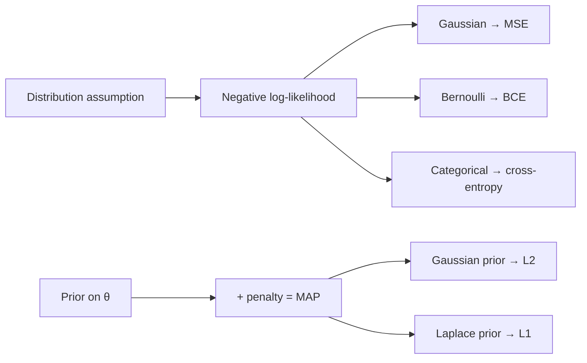

# Probability & Statistics

BayesMLE/MAPKL & cross-entropyCLTA/B testingcalibration

> [!TIP] What's actually tested
> Not definitions — *connections*. Can you show that cross-entropy is categorical MLE, that L2 is a Gaussian prior, that minimizing NLL minimizes KL to the data distribution? Can you spot a peeking bug in an A/B test? For a CV/VLM candidate, this chapter is also where **calibration, soft labels, and offline-vs-online evaluation** live — the statistical spine of shipping a model.

## The one diagram: likelihood → loss

Almost every supervised loss is an NLL under some noise model, and almost every regularizer is a prior. Internalize this and you can *derive* losses instead of memorizing them.

## Bayes, MLE, MAP in one flow

$$
\underbrace{P(\theta\mid\mathcal D)}_{\text{posterior}}=\frac{\overbrace{P(\mathcal D\mid\theta)}^{\text{likelihood}}\ \overbrace{P(\theta)}^{\text{prior}}}{\underbrace{P(\mathcal D)}_{\text{evidence}}}
$$

$$
\hat\theta_\text{MLE}=\arg\min_\theta \sum_i -\log P(x_i\mid\theta),\qquad
\hat\theta_\text{MAP}=\arg\min_\theta \Big[\sum_i -\log P(x_i\mid\theta) \;-\;\log P(\theta)\Big]
$$

A Gaussian prior $P(\theta)\propto e^{-\frac{\lambda}{2}\|\theta\|_2^2}$ contributes $\tfrac{\lambda}{2}\|\theta\|_2^2$ to the objective — **MAP with a Gaussian prior = MLE + L2**. A Laplace prior $\propto e^{-\lambda\|\theta\|_1}$ gives L1.

> [!NOTE] Be honest about the analogy
> SGD's solution is not literally a MAP estimate — implicit regularization from the optimizer and initialization matters too. Say "corresponds to / is analogous to," not "equals." That calibration reads as maturity.

## Distributions ↔ losses

| Model | Density | NLL loss |
| --- | --- | --- |
| Bernoulli, $p=\sigma(z)$ | $p^y(1-p)^{1-y}$ | binary cross-entropy $-[y\log p+(1-y)\log(1-p)]$ |
| Categorical, softmax $p$ | $\prod_k p_k^{y_k}$ | cross-entropy $-\sum_k y_k\log p_k$ |
| Gaussian (fixed $\sigma$) | $\mathcal N(y;\hat y,\sigma^2 I)$ | $\propto\|y-\hat y\|_2^2$ (MSE) |
| Gaussian (learned $\sigma$) | $\mathcal N(y;\hat y,\sigma_\theta^2)$ | heteroscedastic NLL (uncertainty) |

## Entropy, cross-entropy, KL

$$
H(p)=-\sum_k p_k\log p_k,\quad
H(p,q)=-\sum_k p_k\log q_k,\quad
D_{\mathrm{KL}}(p\|q)=\sum_k p_k\log\frac{p_k}{q_k}=H(p,q)-H(p)
$$

Key properties: $D_{\mathrm{KL}}\ge 0$ with equality iff $p=q$; it is **asymmetric**. Forward KL $D_{\mathrm{KL}}(p_\text{data}\|q)$ is *mode-covering*; reverse KL is *mode-seeking* (a recurring VAE / variational-inference talking point). Training a classifier minimizes $H(p_\text{data},q_\theta)$; with hard one-hot labels $H(p)=0$, so **cross-entropy = KL up to a constant = maximizing the log-prob of the correct class**.

> [!EXAMPLE] Softmax numerical stability
> $\operatorname{softmax}(z)_k=e^{z_k}/\sum_j e^{z_j}$ overflows for large $z$. The log-sum-exp trick subtracts the max: $\log\sum_j e^{z_j}=m+\log\sum_j e^{z_j-m}$, $m=\max_j z_j$. Temperature $T$ (using $z/T$) interpolates from argmax ($T\to0$) to uniform ($T\to\infty$) — the knob behind distillation and sampling.

## Expectation, variance, and the CLT

$$
\mathbb E[X]=\sum_x xP(x),\quad \operatorname{Var}(X)=\mathbb E[(X-\mathbb EX)^2],\quad \operatorname{Cov}(X,Y)=\mathbb E[(X-\mu_x)(Y-\mu_y)]
$$

- **Law of large numbers:** the sample mean converges to $\mathbb E[X]$ — this is why empirical risk $\hat R=\frac1n\sum_i \ell_i$ approximates true risk.
- **Central limit theorem:** the *distribution* of the (normalized) mean tends to Gaussian, $\frac1n\sum X_i \approx \mathcal N(\mu,\sigma^2/n)$, regardless of the $X_i$ distribution (finite variance). This underwrites $\pm 1.96\,\sigma/\sqrt n$ confidence intervals and the z-tests below.
- A minibatch gradient is an (unbiased) noisy estimate of the full-batch gradient; its variance shrinks like $1/B$ — the statistical basis for batch-size effects in [Optimization](#/foundations/optimization).

## Hypothesis testing & A/B, without the footguns

<dl class="kv">
<dt>p-value</dt><dd>P(data at least this extreme | $H_0$). <b>Not</b> $P(H_0\mid\text{data})$.</dd>
<dt>Type I / II</dt><dd>$\alpha$ = reject a true $H_0$ (false positive); $\beta$ = fail to reject a false $H_0$; power $=1-\beta$.</dd>
<dt>Effect size</dt><dd>With large $n$, trivial differences become "significant." Always report the magnitude, not just significance.</dd>
</dl>

A two-proportion z-test for conversion:

$$
z=\frac{\hat p_A-\hat p_B}{\sqrt{\hat p(1-\hat p)(1/n_A+1/n_B)}}
$$

> [!WARNING] The peeking trap
> Repeatedly checking an experiment and stopping when it crosses $p<0.05$ inflates the false-positive rate far above $\alpha$. Fix the sample size in advance from a power/MDE calculation, or use a **sequential test** (always-valid p-values, mSPRT). Also check **sample-ratio mismatch (SRM)** and correct for **multiple comparisons** (Bonferroni/FDR). Variance-reduction like **CUPED** buys power for free using pre-experiment covariates.

## Sampling & estimation

You rarely have the true distribution — you have samples. Two ideas recur:

- **Monte Carlo estimation:** approximate $\mathbb E_{p}[f(x)]\approx\frac1N\sum_i f(x_i)$ with $x_i\sim p$. Error shrinks like $1/\sqrt N$ (from the CLT), *independent of dimension* — why MC beats grid quadrature in high-D (used in dropout-MC uncertainty, RL returns, VAE ELBO).
- **Importance sampling:** when you can't sample $p$ but can sample $q$, reweight: $\mathbb E_p[f]=\mathbb E_q[f\,\tfrac{p}{q}]$. High variance if $q$ mismatches $p$ — the core difficulty in off-policy RL.
- **The reparameterization trick:** rewrite $x\sim\mathcal N(\mu,\sigma^2)$ as $x=\mu+\sigma\epsilon,\ \epsilon\sim\mathcal N(0,1)$, moving the randomness off the parameters so gradients flow through the sample (VAEs). Discrete analog: **Gumbel-Softmax**.
- **Estimator quality:** an estimator's error decomposes as bias² + variance; the sample mean is unbiased, MLE is *consistent and asymptotically efficient* but can be biased in small samples (e.g. the $1/n$ vs $1/(n-1)$ variance estimator).

## Calibration

A model is *well-calibrated* if $P(Y=\hat Y \mid \hat P=p)\approx p$. Softmax confidence is **not** calibrated by default (modern nets are typically over-confident). Measure it with **Expected Calibration Error** and fix it cheaply with **temperature scaling** (fit one scalar $T$ on a validation set). More in [Evaluation Metrics](#/foundations/evaluation-metrics).

## Interview Q&A

Why cross-entropy for classification, and not MSE?

**Short:** cross-entropy is the MLE of a categorical model, and minimizing it minimizes KL from the model to the data distribution. MSE assumes Gaussian noise — the wrong likelihood for a discrete label.

**Deep:** put a softmax over logits to get $q_\theta(y\mid x)$; the NLL of a one-hot label is exactly cross-entropy. Its gradient w.r.t. logits is the clean $p-y$. MSE on softmax outputs gives vanishing gradients when predictions are confidently wrong (the logistic-MSE saturation problem) and doesn't correspond to a sensible label noise model. See the derivation in [Linear Algebra & Calculus](#/foundations/linear-algebra-calculus).

Relate MLE, MAP, and L2 regularization.

**Short:** MLE maximizes likelihood; MAP maximizes likelihood × prior. A zero-mean Gaussian prior makes the MAP penalty $\tfrac{\lambda}{2}\|\theta\|_2^2$ — i.e. L2 / weight decay.

**Deep:** $-\log P(\theta)$ for a Gaussian is quadratic in $\theta$; for a Laplace prior it's $|\theta|$, giving L1 and sparsity. MLE alone tends to overfit in the small-sample regime (high-variance estimate); the prior/regularizer trades a little bias for a lot of variance reduction. Fully-Bayesian prediction integrates over the posterior, $P(x_*\mid\mathcal D)=\int P(x_*\mid\theta)P(\theta\mid\mathcal D)\,d\theta$, which point estimates approximate.

Explain KL divergence and its asymmetry with an ML example.

**Short:** $D_{\mathrm{KL}}(p\|q)=H(p,q)-H(p)\ge0$, zero iff $p=q$, and $D_{\mathrm{KL}}(p\|q)\ne D_{\mathrm{KL}}(q\|p)$.

**Deep:** minimizing forward KL $D_{\mathrm{KL}}(p_\text{data}\|q_\theta)$ (as in max-likelihood training) makes $q$ cover every mode of $p$ — it pays a huge penalty wherever $p>0$ but $q\approx0$, so it spreads mass (mode-covering, sometimes blurry generations). Reverse KL $D_{\mathrm{KL}}(q_\theta\|p)$, used in some variational/RL objectives, lets $q$ concentrate on one mode and ignore others (mode-seeking). Distillation minimizes $H(p_T,p_S)$ against a soft teacher distribution.

Your A/B test hit p<0.05 after two days. Ship it?

**Short:** not yet — that's likely a peeking artifact. Check whether the pre-registered sample size was reached, verify SRM, and look at effect size and guardrail metrics.

**Deep:** stopping the moment you cross a threshold inflates Type I error dramatically. Either commit to a fixed-horizon test sized by a power/MDE calculation, or switch to an always-valid sequential procedure that *permits* continuous monitoring. Then confirm no sample-ratio mismatch (a sign of a logging/assignment bug), report a confidence interval on the lift, and check that offline wins (e.g. higher mIoU) actually move the online guardrails — latency and cost can erase a quality gain. For high-risk surfaces (payments, face auth) prefer staged canaries over a raw A/B. See [Evaluation Metrics](#/foundations/evaluation-metrics).

**Follow-ups you should expect**

- *Conjugate prior?* Posterior stays in the prior's family (Beta–Bernoulli, Normal–Normal) — closed-form updates.
- *LLN vs CLT?* Mean → expectation vs. distribution-of-mean → Gaussian.
- *Sigmoid+BCE vs softmax+CE?* Independent multi-label vs. mutually-exclusive single label.
- *Label smoothing, information-theoretically?* Replaces the one-hot target with a softened $p$, so $H(p)>0$ and the model is discouraged from infinite logits.
- *Perplexity?* $\exp(\text{mean token NLL})$ — the exponentiated cross-entropy of a language model.

## Cheat-sheet

| Fact | One-liner |
| --- | --- |
| Bayes | posterior ∝ likelihood × prior. |
| MLE vs MAP | max likelihood vs max likelihood×prior; Gaussian prior ⇒ L2, Laplace ⇒ L1. |
| Loss = NLL | Gaussian→MSE, Bernoulli→BCE, Categorical→cross-entropy. |
| CE = KL + H(p) | hard labels ⇒ CE = KL up to a constant. |
| KL | ≥0, asymmetric; forward mode-covering, reverse mode-seeking. |
| log-sum-exp | subtract max before exp for stability; fuse into `cross_entropy`. |
| CLT | mean ≈ $\mathcal N(\mu,\sigma^2/n)$; basis of CIs & z-tests. |
| p-value | P(data\|H₀), not P(H₀\|data); watch peeking, SRM, multiplicity. |
| Calibration | softmax ≠ calibrated; fix with temperature scaling. |

**Related:** [Optimization](#/foundations/optimization) · [Regularization & Generalization](#/foundations/regularization-generalization) · [Evaluation Metrics](#/foundations/evaluation-metrics) · [Linear Algebra & Calculus](#/foundations/linear-algebra-calculus)
