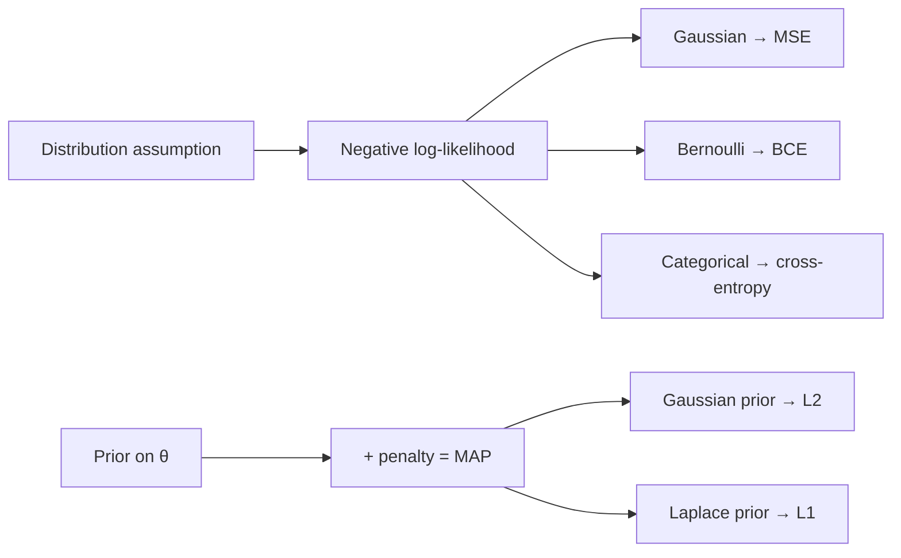

# Probability & Statistics

<div class="tag-row"><span class="tag">random variable</span><span class="tag">distribution</span><span class="tag">Bayes</span><span class="tag">MLE/MAP</span><span class="tag">KL & cross-entropy</span><span class="tag">CLT</span><span class="tag">A/B testing</span></div>

> [!NOTE] Goal of this chapter
> Probability intimidates many people, but machine learning needs only a few core intuitions: how to represent **uncertain values (random variables)** numerically, how those values are spread out—their **distribution**—and what value to expect on average—their **expectation**. These ideas explain which **probabilistic models** produce common losses such as MSE, BCE, and cross-entropy. The opening §0 is for complete beginners; later sections progress toward interview depth.

## §0 · Start here: random variables and distributions

A **random variable** is an uncertain value that has not yet been determined: the result of a die roll, tomorrow's temperature, or whether an image contains a cat. A **probability distribution** tells us which values it takes and how often.

<div class="proscons"><div><div class="pros-t">Discrete distribution</div>

Its possible values are separate and countable: a coin flip (**Bernoulli**), a die roll, or a class label (**Categorical**). We can tabulate the probability of each value, and the probabilities sum to 1.

</div><div><div class="cons-t">Continuous distribution</div>

Its values range over the real numbers: height or temperature, for example, often modeled with a **Gaussian, or normal, distribution**. A single point has probability zero, so a density measures probability over intervals instead.

</div></div>

### Expectation and variance

- **Expectation, or mean**, $\mathbb{E}[X]$: a probability-weighted average—"Where is the value on average?"
- **Variance**, $\operatorname{Var}(X)$: how far values spread around the mean—"How variable is it?"

$$
\mathbb E[X]=\sum_x x\,P(x),\qquad \operatorname{Var}(X)=\mathbb E[(X-\mathbb EX)^2]
$$

The most important continuous distribution, the **Gaussian** $\mathcal N(\mu,\sigma^2)$, is determined by two numbers: its center $\mu$, the mean, and its width $\sigma$, the standard deviation. A picture makes this intuition concrete.

<figure>
<svg viewBox="0 0 640 230" xmlns="http://www.w3.org/2000/svg" font-family="Inter, sans-serif" font-size="12">
  <line x1="30" y1="190" x2="610" y2="190" stroke="#98a3b2" stroke-width="1.4"/>
  <!-- narrow gaussian (small sigma), centered left -->
  <path d="M120 190 C 180 190, 200 40, 240 40 C 280 40, 300 190, 360 190" fill="none" stroke="#0ea5e9" stroke-width="2.5"/>
  <line x1="240" y1="190" x2="240" y2="40" stroke="#0ea5e9" stroke-width="1" stroke-dasharray="4 3"/>
  <text x="240" y="30" text-anchor="middle" fill="#0ea5e9">small σ (narrow)</text>
  <!-- wide gaussian (large sigma), centered right -->
  <path d="M330 190 C 400 190, 420 110, 460 110 C 500 110, 520 190, 600 190" fill="none" stroke="#e0533f" stroke-width="2.5"/>
  <line x1="460" y1="190" x2="460" y2="110" stroke="#e0533f" stroke-width="1" stroke-dasharray="4 3"/>
  <text x="460" y="100" text-anchor="middle" fill="#e0533f">large σ (wide)</text>
  <text x="240" y="208" text-anchor="middle" fill="#98a3b2">μ₁</text>
  <text x="460" y="208" text-anchor="middle" fill="#98a3b2">μ₂</text>
  <text x="320" y="225" text-anchor="middle" fill="#98a3b2">μ sets the center, σ sets the width · area under each curve = 1</text>
</svg>
<figcaption>For a Gaussian distribution, mean μ sets the horizontal location and σ sets the spread. It appears throughout deep learning: "initialize weights from a narrow Gaussian," for example, and "assume Gaussian output noise, which yields an MSE loss."</figcaption>
</figure>

> [!TIP] One-line interview focus
> The point of this chapter is not memorizing definitions but making **connections**. Can you show that cross-entropy is categorical MLE, L2 corresponds to a Gaussian prior, and minimizing NLL minimizes KL to the data distribution? Can you catch a peeking bug in an A/B test? For a CV/VLM candidate, **calibration, soft labels, and offline-to-online evaluation** form the statistical backbone of deployment.

## §1 · The central insight: loss = negative log-likelihood (NLL)

Many common supervised-learning losses can be derived as the **negative log-likelihood (NLL)** under a particular observation or noise model, and some regularizers can be interpreted as MAP estimation under a **prior**. Not every objective and regularizer fits this framework, but it connects MSE, BCE, cross-entropy, and L2 without rote memorization.



| Model (assumed distribution) | Density | Corresponding loss (NLL) |
| --- | --- | --- |
| Bernoulli, $p=\sigma(z)$ | $p^y(1-p)^{1-y}$ | binary cross-entropy $-[y\log p+(1-y)\log(1-p)]$ |
| Categorical, softmax $p$ | $\prod_k p_k^{y_k}$ | cross-entropy $-\sum_k y_k\log p_k$ |
| Gaussian (fixed $\sigma$) | $\mathcal N(y;\hat y,\sigma^2 I)$ | $\propto\|y-\hat y\|_2^2$ (MSE) |
| Gaussian (learned $\sigma$) | $\mathcal N(y;\hat y,\sigma_\theta^2)$ | heteroscedastic NLL (uncertainty estimation) |

In short, **assuming normally distributed output noise produces MSE, while assuming class probabilities produces cross-entropy**.

## §2 · Bayes, MLE, and MAP in one flow

$$
\underbrace{P(\theta\mid\mathcal D)}_{\text{posterior}}=\frac{\overbrace{P(\mathcal D\mid\theta)}^{\text{likelihood}}\ \overbrace{P(\theta)}^{\text{prior}}}{\underbrace{P(\mathcal D)}_{\text{evidence}}}
$$

- **Maximum likelihood estimation (MLE):** choose the $\theta$ that best explains the data. $\hat\theta_\text{MLE}=\arg\min_\theta \sum_i -\log P(x_i\mid\theta)$
- **Maximum a posteriori estimation (MAP):** also incorporate a prior belief. $\hat\theta_\text{MAP}=\arg\min_\theta [\sum_i -\log P(x_i\mid\theta) -\log P(\theta)]$

A Gaussian prior $P(\theta)\propto e^{-\frac{\lambda}{2}\|\theta\|_2^2}$ adds $\tfrac{\lambda}{2}\|\theta\|_2^2$ to the objective—**MAP with a Gaussian prior = MLE + L2 (weight decay)**. A Laplace prior yields L1.

> [!NOTE] Be honest about the analogy
> The solution reached by SGD is not literally a MAP estimate; implicit regularization from the optimizer and initialization also matters. Say "corresponds to" or "is analogous to," not simply "equals." That nuance signals maturity.

## §3 · Entropy, cross-entropy, and KL

$$
H(p)=-\sum_k p_k\log p_k,\quad
H(p,q)=-\sum_k p_k\log q_k,\quad
D_{\mathrm{KL}}(p\|q)=\sum_k p_k\log\frac{p_k}{q_k}=H(p,q)-H(p)
$$

Intuitively, **entropy** $H(p)$ is the amount of uncertainty—it is greatest for a fair coin. **Cross-entropy** $H(p,q)$ is the average surprise incurred when $p$ is the truth but you believe $q$. **KL divergence** $D_{\mathrm{KL}}(p\|q)$ measures how far $q$ is from $p$.

The key properties are $D_{\mathrm{KL}}\ge 0$, with equality only when $p=q$, and **asymmetry**: $D_{\mathrm{KL}}(p\|q)\ne D_{\mathrm{KL}}(q\|p)$. Classifier training minimizes $H(p_\text{data},q_\theta)$. For hard one-hot labels, $H(p)=0$, so **cross-entropy is KL up to a constant and is equivalent to maximizing the correct class's log-probability**.

### Try it yourself—implement KL divergence

Implement KL divergence between two discrete distributions. One important detail: a term with $p_k=0$ must be treated as $0\log 0 = 0$ to avoid an invalid logarithm.

<div class="widget" data-widget="code">
<script type="application/json" class="code-config">
{"func":"kl_divergence","packages":["numpy"],"approx":true,"starter":"def kl_divergence(p, q):\n    # KL between discrete probability distributions p and q, each a list summing to 1:\n    # sum_k p_k * log(p_k / q_k). Use the natural logarithm, np.log.\n    # Skip terms where p_k == 0, treating 0*log(0) as 0.\n    pass","tests":[{"args":[[0.5,0.5],[0.5,0.5]],"expect":0.0,"tol":1e-4},{"args":[[1.0,0.0],[0.5,0.5]],"expect":0.6931,"tol":1e-3},{"args":[[0.7,0.3],[0.5,0.5]],"expect":0.0823,"tol":1e-3}],"solution":"import numpy as np\n\ndef kl_divergence(p, q):\n    p = np.asarray(p, float); q = np.asarray(q, float)\n    mask = p > 0                      # treat 0*log(0) as 0\n    return float(np.sum(p[mask] * np.log(p[mask] / q[mask])))"}
</script>
</div>

The first test gives KL = 0 for identical distributions. In the second, **target distribution $p=(1,0)$ is certain that the first class is correct, while model distribution $q=(0.5,0.5)$ splits its belief evenly**, so the penalty is $\log 2\approx0.693$. Direction matters for KL, so always say which distribution is the reference $p$ and which is the approximation $q$.

> [!EXAMPLE] Softmax stability and KL asymmetry
> $\operatorname{softmax}(z)_k=e^{z_k}/\sum_j e^{z_j}$ overflows for large $z$. Use the **log-sum-exp trick** and subtract the maximum: $\log\sum_j e^{z_j}=m+\log\sum_j e^{z_j-m}$. Temperature $T$, using $z/T$, is a control that interpolates from argmax as $T\to0$ to uniform as $T\to\infty$; it appears in distillation and sampling. For **KL asymmetry**, forward KL $D_{\mathrm{KL}}(p_\text{data}\|q)$ is *mode-covering*, tending to cover every mode and become blurry, while reverse KL is *mode-seeking*, tending to concentrate on one mode. This is a common VAE and variational-inference topic.

### A statistical comparison of CE and MSE for classification

First distinguish what receives the squared error. Squared error between a probability vector $q$ and a one-hot label is the **Brier score**, a valid proper scoring rule. MSE on raw logits is different: it ignores that $z$ and $z+c\mathbf1$ represent the same categorical distribution, so it is not a natural probability loss.

Suppose the true binary label follows $Y\sim\operatorname{Bernoulli}(r)$ and the model predicts positive probability $q$. The population expected risks are

$$
R_{\mathrm{CE}}(q)=-r\log q-(1-r)\log(1-q),
\qquad
R_{\mathrm{Brier}}(q)=r(1-q)^2+(1-r)q^2.
$$

Differentiating either risk gives a unique minimum at $q=r$. With enough data and capacity, both are therefore strictly proper scoring rules that encourage the model to **report the true conditional probability honestly**.

<figure>
<svg viewBox="0 0 700 285" xmlns="http://www.w3.org/2000/svg" font-family="Inter, sans-serif" font-size="11" role="img" aria-labelledby="ce-mse-title-en ce-mse-desc-en">
  <title id="ce-mse-title-en">Expected risk and logit gradients for cross-entropy and Brier score</title>
  <desc id="ce-mse-desc-en">The left shows that with true positive probability 0.7, both cross-entropy and Brier excess risk are minimized by predicting 0.7. The right shows that for a positive label, cross-entropy keeps a large logit gradient on confidently wrong predictions while MSE after a sigmoid has a gradient approaching zero.</desc>
  <text x="175" y="18" text-anchor="middle" fill="currentColor">statistics: expected excess risk (r=0.7)</text>
  <line x1="48" y1="230" x2="315" y2="230" stroke="#98a3b2"/><line x1="48" y1="230" x2="48" y2="42" stroke="#98a3b2"/>
  <g fill="#98a3b2" font-size="10">
    <text x="48" y="247" text-anchor="middle">0</text><text x="115" y="247" text-anchor="middle">.25</text><text x="181" y="247" text-anchor="middle">.5</text><text x="234" y="247" text-anchor="middle">.7</text><text x="315" y="247" text-anchor="middle">1</text>
    <text x="181" y="269" text-anchor="middle">predicted probability q</text>
  </g>
  <path d="M58 47 C85 95,125 145,181 195 C207 216,224 228,234 230 C251 227,276 196,305 61" fill="none" stroke="#e0533f" stroke-width="2.5"/>
  <path d="M58 118 C104 161,163 207,234 230 C266 220,289 202,305 181" fill="none" stroke="#6366f1" stroke-width="2.5"/>
  <circle cx="234" cy="230" r="5" fill="#12a150"/>
  <text x="90" y="65" fill="#e0533f">CE−H(r)=KL(r‖q)</text>
  <text x="72" y="135" fill="#6366f1">Brier−min=(q−r)²</text>
  <text x="234" y="215" text-anchor="middle" fill="#12a150">both q*=r=.7</text>
  <line x1="350" y1="28" x2="350" y2="250" stroke="#98a3b2" opacity=".45"/>
  <text x="525" y="18" text-anchor="middle" fill="currentColor">optimization: true class y=1</text>
  <line x1="390" y1="230" x2="665" y2="230" stroke="#98a3b2"/><line x1="390" y1="230" x2="390" y2="42" stroke="#98a3b2"/>
  <g fill="#98a3b2" font-size="10">
    <text x="390" y="247" text-anchor="middle">0</text><text x="459" y="247" text-anchor="middle">.25</text><text x="528" y="247" text-anchor="middle">.5</text><text x="596" y="247" text-anchor="middle">.75</text><text x="665" y="247" text-anchor="middle">1</text>
    <text x="528" y="269" text-anchor="middle">true-class probability p</text>
  </g>
  <path d="M390 48 L665 230" fill="none" stroke="#e0533f" stroke-width="2.5"/>
  <path d="M390 230 C420 207,451 191,482 198 C530 209,589 225,665 230" fill="none" stroke="#6366f1" stroke-width="2.5"/>
  <circle cx="396" cy="52" r="4" fill="#e0533f"/><circle cx="396" cy="229" r="4" fill="#6366f1"/>
  <text x="475" y="70" fill="#e0533f">CE: |∂L/∂z|=1−p</text>
  <text x="480" y="190" fill="#6366f1">MSE: ∝p(1−p)²</text>
  <text x="525" y="112" text-anchor="middle" fill="#98a3b2">confidently wrong as p→0:</text>
  <text x="525" y="129" text-anchor="middle" fill="#98a3b2">CE signal remains; MSE signal vanishes</text>
</svg>
<figcaption><b>Statistically</b>, both CE and probability-space MSE (Brier) minimize expected risk at the true probability $r$. Their main differences lie in likelihood interpretation and <b>logit-space optimization geometry</b>. CE gives a large correction to a model saturated on the wrong class; MSE after softmax or sigmoid multiplies by an additional Jacobian and can produce a tiny signal.</figcaption>
</figure>

| View | Cross-entropy | MSE on probabilities (Brier) |
| --- | --- | --- |
| probabilistic model | Bernoulli/categorical NLL | squared probability error; proper score |
| confidently wrong prediction | $-\log q_y\to\infty$—strong penalty | bounded—more gradual |
| logit gradient | softmax/sigmoid Jacobian cancels, giving $q-y$ | another Jacobian remains, shrinking saturated gradients |
| practical interpretation | natural default for likelihood training | useful for calibration evaluation and some prediction problems |

The right answer is therefore not “MSE is invalid for classification.” **CE is the default because it exactly matches categorical likelihood and provides a useful logit gradient even for confidently wrong predictions.** Because Brier is bounded, it can be less aggressive under label noise or outliers and is useful for studying calibration. Conversely, CE's unbounded penalty does not guarantee better calibration or robustness. See [Loss & Gradient](#/ml-coding/losses-gradients) for why softmax uses an exponential and how its derivative combines with CE.

## §4 · Expectation, variance, and the CLT (Advanced)

- **Law of large numbers (LLN):** the sample mean converges to $\mathbb E[X]$. This is why empirical risk $\hat R=\frac1n\sum_i \ell_i$ approximates true risk.
- **Central limit theorem (CLT):** under conditions such as independent, identically distributed samples with finite variance, the distribution of the normalized sample mean approaches a Gaussian. When $\sigma$ is known or the sample is sufficiently large, approximations such as $\pm1.96\,\sigma/\sqrt n$ are used; with a small sample and estimated $\sigma$, a t interval is usually appropriate.
- A **minibatch gradient** is an unbiased estimate of the full-data gradient when samples are drawn uniformly and the loss decomposes by sample. Under an independent-sample approximation, its variance falls roughly as $1/B$. Sampling without replacement introduces a finite-population correction, and operations such as BatchNorm that couple samples within a batch break this simple claim.

## §5 · Hypothesis testing and A/B tests, without the traps (Advanced)

<dl class="kv">
<dt>p-value</dt><dd>P(data at least this extreme | $H_0$). It is <b>not $P(H_0\mid\text{data})$</b>.</dd>
<dt>Type I / II</dt><dd>$\alpha$ = reject a true $H_0$, a false positive; $\beta$ = fail to reject a false $H_0$; power $=1-\beta$.</dd>
<dt>Effect size</dt><dd>With large $n$, trivial differences become "significant." Always report the magnitude, not significance alone.</dd>
</dl>

For a two-proportion z-test on conversion: $z=\dfrac{\hat p_A-\hat p_B}{\sqrt{\hat p(1-\hat p)(1/n_A+1/n_B)}}$

> [!WARNING] The peeking trap
> Repeatedly checking an experiment and stopping as soon as $p<0.05$ inflates the false-positive rate above $\alpha$. Either fix the sample size in advance with a power/MDE calculation or use a **sequential test**, such as an always-valid p-value or mSPRT. Check **sample-ratio mismatch (SRM)**, correct for **multiple comparisons** with methods such as Bonferroni or FDR, and use pre-experiment covariates with a variance-reduction technique such as **CUPED** to gain power.

> **Concept code—the order of a fixed-horizon A/B test**

```python
plan = design_ab_test(alpha=0.05, power=0.80, mde=0.01)
assignment = randomize(users, ratio=(0.5, 0.5))
events = collect_until_n(assignment, plan.sample_size)  # do not stop based on interim results

assert sample_ratio_test(events).p_value > 0.001        # check logging/assignment
effect, ci, p_value = two_sample_test(events)
ship = (p_value < plan.alpha
        and ci.low > business_minimum
        and guardrails_are_safe(events))
```

## §6 · Sampling and estimation (Advanced)

- **Monte Carlo:** with $x_i\sim p$, approximate $\mathbb E_{p}[f(x)]\approx\frac1N\sum_i f(x_i)$. Standard error usually converges at order $1/\sqrt N$, so dimension does not enter the exponent directly as it does in a grid method. However, the variance constant can be very large depending on the dimension, distribution, and integrand.
- **Importance sampling:** sample from $q$ instead of $p$ and reweight, $\mathbb E_p[f]=\mathbb E_q[f\,\tfrac{p}{q}]$. Variance explodes when $q$ is poorly matched to $p$, a central difficulty in off-policy RL.
- **Reparameterization trick:** write $x=\mu+\sigma\epsilon,\ \epsilon\sim\mathcal N(0,1)$ to separate randomness from the parameters and allow gradients to pass through the sample, as in a VAE. The discrete analogue is **Gumbel-Softmax**.
- **Estimator quality:** under squared error, MSE decomposes into $\mathrm{bias}^2+\mathrm{variance}$. For a prediction problem with observation noise, distinguish the irreducible-noise term as well. The sample mean is unbiased; under regularity conditions MLE is consistent and asymptotically efficient, but it can be biased in small samples.

## §7 · Calibration (Advanced)

A model is *well calibrated* if $P(Y=\hat Y \mid \hat P=p)\approx p$. Softmax confidence is **not calibrated by default**—modern networks are often overconfident. Measure calibration with **Expected Calibration Error (ECE)** and correct it cheaply with **temperature scaling**, fitting one scalar $T$ on validation data. See [Evaluation Metrics](#/foundations/evaluation-metrics) for details.

## Interview Q&A

<details class="qa"><summary>Why use cross-entropy rather than MSE for classification?</summary>
<div class="qa-body">

**Short:** Cross-entropy is the NLL of a categorical model, and minimizing it minimizes $D_{\mathrm{KL}}(p_{\text{data}}\Vert q_\theta)$. MSE on probability vectors—the Brier score—is also a valid proper scoring rule, but its probabilistic model and gradient with softmax differ, so CE is usually the more natural choice.

**Deep:** A softmax converts logits into $q_\theta(y\mid x)$, and the NLL of a one-hot label is exactly cross-entropy; its logit gradient is the clean expression $q-y$. MSE/Brier can also train probabilistic predictions, but it passes through the softmax Jacobian once more, so its gradient may become small in saturated regions. Do not say "MSE is wrong." Say that **categorical likelihood and optimization geometry make CE the default**. See the derivation in [Linear Algebra & Calculus](#/foundations/linear-algebra-calculus).
</div></details>

<details class="qa"><summary>Connect MLE, MAP, and L2 regularization.</summary>
<div class="qa-body">

**Short:** MLE maximizes likelihood; MAP maximizes likelihood times a prior. A zero-mean Gaussian prior adds the L2 penalty $\tfrac{\lambda}{2}\|\theta\|_2^2$ to the MAP objective. For SGD-like methods this has the form of weight decay, but in general it does not follow the same optimization trajectory as AdamW's decoupled decay.

**Deep:** The negative log of a Gaussian prior is quadratic, while that of a Laplace prior is $|\theta|$, giving L1 and sparsity. MLE alone can overfit in the small-sample regime because it has high variance; a prior or regularizer trades a little bias for a substantial variance reduction. Fully Bayesian prediction integrates over the posterior, while a point estimate approximates it.
</div></details>

<details class="qa"><summary>Explain KL divergence and its asymmetry with an ML example.</summary>
<div class="qa-body">

**Short:** $D_{\mathrm{KL}}(p\|q)=H(p,q)-H(p)\ge0$, it is zero only when $p=q$, and it is asymmetric.

**Deep:** Minimizing forward KL $D_{\mathrm{KL}}(p_\text{data}\|q_\theta)$, as in maximum-likelihood training, encourages $q$ to cover every mode of $p$: every region with $p>0$ and $q\approx0$ incurs a large penalty, producing mode-covering and potentially blurry generations. Reverse KL lets $q$ focus on one mode and is mode-seeking. Distillation minimizes $H(p_T,p_S)$ against a soft teacher distribution.
</div></details>

<details class="qa"><summary>An A/B test reached p&lt;0.05 after two days. Should you ship?</summary>
<div class="qa-body">

**Short:** Not yet; it may be a peeking artifact. Check whether the preregistered sample size was reached, then examine SRM, effect size, and guardrails.

**Deep:** Stopping the moment a threshold is crossed inflates Type I error. Commit to a fixed-horizon test or use an always-valid sequential procedure that permits continuous monitoring. Check SRM, which can signal logging or assignment bugs, report a confidence interval for the lift, and verify that an offline win such as higher mIoU improves online guardrails such as latency and cost. For high-risk systems such as payments or face authentication, prefer a staged canary to a raw A/B test. See [Evaluation Metrics](#/foundations/evaluation-metrics).
</div></details>

**Expected follow-ups**

- *Conjugate prior?* The posterior remains in the same family as the prior, as in Beta–Bernoulli and Normal–Normal, allowing closed-form updates.
- *LLN vs CLT?* The mean converges to its expectation versus the distribution of the mean converges to a Gaussian.
- *Sigmoid+BCE vs softmax+CE?* Independent multi-label outputs versus one mutually exclusive label.
- *Label smoothing in information-theoretic terms?* Replace one-hot with a softened $p$, making $H(p)>0$ and discouraging infinite logits.
- *Perplexity?* $\exp(\text{mean token NLL})$, the exponentiated cross-entropy of a language model.

## Cheat sheet

| Fact | In one line |
| --- | --- |
| random variable / distribution | An uncertain value / the probability landscape over its values |
| expectation / variance | Average location / degree of spread |
| Gaussian | Determined by two numbers, mean μ and standard deviation σ |
| Bayes | posterior ∝ likelihood × prior |
| MLE vs MAP | max likelihood vs likelihood × prior; Gaussian prior ⇒ L2, Laplace ⇒ L1 |
| loss = NLL | Gaussian → MSE, Bernoulli → BCE, Categorical → cross-entropy |
| CE = KL + H(p) | hard labels ⇒ CE is KL up to a constant |
| KL | nonnegative and asymmetric; forward mode-covering, reverse mode-seeking |
| log-sum-exp | subtract the max before exponentiating; fuse with `cross_entropy` |
| CLT | mean ≈ $\mathcal N(\mu,\sigma^2/n)$; basis for confidence intervals and z-tests |
| p-value | P(data\|H₀); beware peeking, SRM, and multiplicity |
| calibration | softmax ≠ calibrated; correct with temperature scaling |

**Next:** [Optimization](#/foundations/optimization) · [Regularization & Generalization](#/foundations/regularization-generalization) · [Evaluation Metrics](#/foundations/evaluation-metrics) · [Linear Algebra & Calculus](#/foundations/linear-algebra-calculus)
