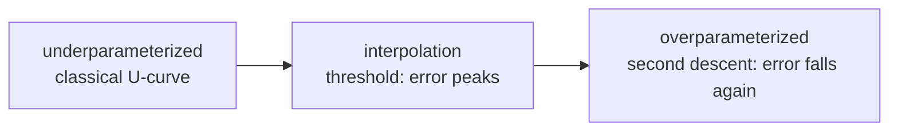

# Regularization & Generalization

bias–varianceL1/L2 & weight decaydropoutearly stoppingdata augdouble descentcalibration

> [!TIP] 그들이 보상하는 사고방식
> Regularization은 "$\lambda\|\theta\|^2$ 항을 더하는 것"이 아닙니다. 그것은 **generalization gap의 체계적 감소**입니다: 데이터, model, optimization 중 어떤 레버를 먼저 당길 것인가, 그리고 무슨 신호가 그렇게 하라고 말하는가? Weakly/semi-supervised와 continual-learning 작업(distribution shift 하의 제한된 label)은 근본적으로 generalization 문제입니다; 이론을 *진단*과 연결하세요.

## Bias–variance: 정리해 주는 틀

Squared error에서 expected test error는 다음과 같이 분해됩니다:

$$
\mathbb E\big[(y-\hat f(x))^2\big]=\underbrace{\text{Bias}^2}_{\text{too rigid}}+\underbrace{\text{Variance}}_{\text{too sensitive}}+\underbrace{\text{Noise}}_{\text{irreducible}}
$$

<figure>
<svg viewBox="0 0 560 210" xmlns="http://www.w3.org/2000/svg" font-family="Inter, sans-serif" font-size="12">
  <line x1="50" y1="180" x2="530" y2="180" stroke="#98a3b2"/><line x1="50" y1="20" x2="50" y2="180" stroke="#98a3b2"/>
  <text x="290" y="202" text-anchor="middle" fill="#98a3b2">model capacity →</text>
  <text x="16" y="100" fill="#98a3b2" transform="rotate(-90 16 100)">error</text>
  <path d="M60 40 C 160 120, 260 168, 520 176" fill="none" stroke="#0ea5e9" stroke-width="2"/>
  <text x="150" y="60" fill="#0ea5e9">bias²</text>
  <path d="M60 176 C 260 170, 380 120, 520 30" fill="none" stroke="#e0533f" stroke-width="2"/>
  <text x="470" y="60" fill="#e0533f">variance</text>
  <path d="M60 90 C 200 70, 240 66, 300 84 C 380 108, 460 70, 520 44" fill="none" stroke="#12a150" stroke-width="2.5"/>
  <text x="300" y="56" fill="#12a150" text-anchor="middle">test error (classic U)</text>
</svg>
<figcaption>고전적인 U-curve. Deep net은 이를 구부리지만 — "underfit vs overfit" 언어는 여전히 디버깅을 이끕니다.</figcaption>
</figure>

현대적 반전: 심하게 **over-parameterized**된 network는 training set을 interpolate함에도 generalize합니다. SGD, initialization, augmentation이 variance를 통제하는 **implicit regularization**으로 작용하기 때문입니다. 그럼에도 이 어휘는 여전히 가장 빠른 진단 도구입니다:

| Train | Val | Diagnosis | First lever |
| --- | --- | --- | --- |
| bad | bad | underfit / bug / bad LR | bigger model, longer training, check bugs |
| good | bad | overfit / leak / shift | augmentation, weight decay, more data |
| good | good | healthy | monitor deployment drift |
| bad | good | almost certainly a metric/leakage bug | audit the eval pipeline |

> [!TIP] Tiny-overfit 테스트
> Regularization에 손대기 전에, model이 ~50–200개 example을 ~0 loss로 overfit할 수 있는지 확인하세요. *못한다면* 버그가 있는 것입니다(data loader, train/eval mode, LR=0, frozen param) — overfitting 문제가 아니라. [gradient-descent widget](#/foundations/optimization)을 조작해 step size가 그 zero-loss basin에 도달할 수 있는지조차 어떻게 좌우하는지 느껴보세요.

## 레버 세트

<dl class="kv">
<dt>L2 / weight decay</dt><dd>모든 weight를 0으로 shrink합니다(Gaussian prior; <a href="#/foundations/probability-statistics">Prob & Stats</a> 참고). Adam+L2 ≠ AdamW decoupled decay라는 점에 유의 — <a href="#/foundations/optimization">Optimization</a> 참고.</dd>
<dt>L1</dt><dd>축 위의 diamond-constraint 꼭짓점을 통한 sparsity; 배포용으로는 structured pruning보다 드묾.</dd>
<dt>Dropout</dt><dd>Unit을 무작위로 0으로 만들어(inverted: train 시 $1/(1-p)$로 스케일) co-adaptation을 깨뜨림; thinned net의 지수적 ensemble을 근사.</dd>
<dt>Early stopping</dt><dd>Val metric이 정체되면 멈춤; optimization 궤적을 따른 implicit capacity control의 한 형태.</dd>
<dt>Data augmentation</dt><dd>Input 분포를 넓혀 invariance를 강제 — CV에서 종종 단일 최고 ROI regularizer.</dd>
<dt>Label smoothing</dt><dd>One-hot target을 부드럽게($1-\varepsilon$ / $\tfrac{\varepsilon}{K-1}$) 하여 over-confident logit을 억제하고 calibration을 개선.</dd>
</dl>

**L1 vs L2 geometry:** $\ell_p$ budget 하에서 loss를 최소화할 때, loss contour는 $\ell_1$ diamond의 **꼭짓점**(0인 좌표)에 먼저 닿습니다 → sparsity; $\ell_2$ ball은 둥글어서 → dense shrinkage.

**Dropout, 정확히:** train 시 $\tilde x=\dfrac{m\odot x}{1-p},\ m_i\sim\text{Bernoulli}(1-p)$; inference 시 full network. 현대 CNN에서는 augmentation + weight decay + early stopping이 종종 dropout을 압도합니다; Transformer는 attention/FFN dropout과 **stochastic depth (DropPath)**를 씁니다. Inference에서 dropout을 켠 채 forward pass를 평균하면 **MC-Dropout** uncertainty를 줍니다.

**Regularization으로서의 data augmentation:** 이것은 *vicinal* risk를 최소화합니다 — $x$ 대신 $T(x)$를 보여줘 invariance(geometric, photometric, occlusion)를 강제하죠. 스펙트럼: basic(flip/crop/jitter) → strong(RandAugment/TrivialAugment) → mixing(MixUp/CutMix/Copy-Paste). 너무 강하면 underfit하거나 label을 파괴합니다(예: text를 과도하게 warping). Segmentation에서는 geometric transform을 mask에도 적용해야 하고; photometric transform은 그러면 안 됩니다.

## Implicit regularization

모든 regularizer가 loss에 쓰이는 것은 아닙니다. *optimizer 자체*가 zero-training-loss 해가 여럿일 때 어디에 착지할지를 편향시킵니다:

- **SGD noise**는 더 평평하고 더 낮은 norm의 해를 선호합니다; 작은 batch는 이 이로운 noise를 더 많이 주입합니다.
- **Separable data에서의 gradient descent**는 명시적 penalty가 없어도 **max-margin** 해로 수렴합니다(implicit-bias 결과).
- **Early stopping** ≈ 궤적에 대한 $\ell_2$ ball: 적은 step ⇒ 작은 effective weight norm.
- **Architecture**도 regularize합니다 — conv의 weight sharing, attention의 low-rank bias, normalization layer.

실무적 요점: 큰 model이 parameter 수에도 불구하고 generalize할 때, 대개 당신이 코드로 짜지 않은 일을 implicit regularization이 해주고 있는 것입니다.

## Double descent

Test error는 interpolation threshold(train error → 0) 근처에서 오르다가, capacity가 더 커지면 **다시 떨어질** 수 있습니다(Belkin et al.; Nakkiran et al.). *epoch-wise* 버전도 존재하는데, 이는 순진한 early stopping과 충돌할 수 있습니다. 면접에서 안전한 프레이밍:

> "double-descent curve를 매일 그리진 않지만 교훈은 남습니다: capacity를 줄이는 것만이 generalization으로 가는 유일한 길이 아니며 — 데이터, regularization, training 예산을 함께 고려해야 한다."

## Calibration & generalization

model은 generalize(높은 accuracy)하면서도 **miscalibrated**(confidence ≠ correctness)일 수 있습니다. Label smoothing과 temperature scaling이 calibration을 개선하며; 두 성질은 대체로 독립적이므로 둘 다 모니터하세요. 전체 논의는 [Evaluation Metrics](#/foundations/evaluation-metrics)에 있습니다.

## Interview Q&A

L1과 L2를 geometry 포함해 대비하라.

**Short:** L2는 모든 weight를 매끄럽게 shrink하고(dense 해, Gaussian prior); L1은 일부를 정확히 0으로 몰아붙입니다(sparse 해, Laplace prior).

**Deep:** L2의 gradient는 $\propto\theta$입니다 — 항상 비례적이라 좌표를 0으로 강제하는 법이 없습니다. L1의 subgradient는 크기가 일정해서 좌표를 0으로 만들고 그대로 유지할 수 있습니다. Geometry적으로, loss level-set이 $\ell_1$ diamond의 축 꼭짓점에서 먼저 만납니다. Deep learning에서 L2는 weight decay로 나타나고(Adam/AdamW 주의사항 포함), 배포를 위한 명시적 sparsity는 보통 L1 training이 아니라 structured pruning에서 옵니다.

Dropout은 무엇을 하고, train과 inference는 어떻게 다른가?

**Short:** train 시 unit을 무작위로 0으로 만들어 co-adaptation을 막고 ensemble을 근사합니다; inference에서는 full network를 씁니다(inverted dropout에서는 rescaling이 필요 없습니다 — training이 이미 $1/(1-p)$로 스케일했으므로).

**Deep:** 각 minibatch는 서로 다른 "thinned" subnetwork를 학습합니다; 지수적으로 많은 subnet에 대한 평균이 ensemble 직관입니다. 강한 augmentation을 쓰는 큰 데이터셋에서는 팀들이 종종 dropout을 *줄이거나 제거*합니다 — over-regularized될 수 있죠. CV 전용 변형(SpatialDropout, DropBlock)은 인접 pixel이 상관되어 있어 per-unit dropout이 정보를 흘리므로 연속된 영역을 drop합니다.

현대 over-parameterized net에 대해 bias–variance를 설명하라.

**Short:** 고전적 U-curve는 capacity↑ ⇒ bias↓, variance↑라고 하지만, 데이터를 interpolate하는 거대한 net도 여전히 generalize합니다. implicit regularization(SGD, init, augmentation)이 variance를 길들이기 때문입니다.

**Deep:** 이 분해는 여전히 디버깅을 이끕니다 — train≈val이 둘 다 나쁘면 high bias / capacity 또는 optimization 실패이고; 큰 train–val gap은 high variance / overfitting → augmentation, decay, 또는 데이터를 추가하세요. 깨지는 것은 "parameter가 많을수록 = overfitting이 심해진다"는 가정입니다; scaling law와 double descent는 반대 영역이 존재함을 보여줍니다. Ensemble은 decorrelate된 오차를 평균해 variance를 줄입니다.

Early stopping은 항상 optimal한가?

**Short:** 아닙니다 — epoch-wise double descent 하에서는 더 오래 학습하면 회복하고 개선될 수 있으므로, 고정된 patience는 일시적 bump에서 멈출 수 있습니다.

**Deep:** Early stopping은 val loss가 깔끔한 U를 그리는 small-data CV fine-tuning에는 강력합니다. 하지만 LLM pretraining은 보통 고전적 early stopping 대신 cosine decay로 고정된 token 예산을 돌리고, 긴 run은 좋아지기 전에 나빠지는 국면을 지날 수 있습니다. 실무적 안전장치: loss만이 아니라 *실제로 신경 쓰는 metric*(예: mIoU)을 모니터하고; leak 없는 val set을 유지하며; 도움이 되는 곳에서는 SWA/EMA weight averaging과 결합하세요.

새 프로젝트에서 어떤 순서로 regularization을 적용하는가?

**Short:** metric/eval을 먼저 맞추고 → tiny-overfit이 되는 버그 없는 baseline을 얻고 → augmentation → AdamW weight decay + cosine + early stop/EMA → 그다음 dropout/label-smoothing/DropPath를 ablation으로 → capacity 축소는 최후의 수단으로만.

**Deep:** "dropout부터 켠다"는 anti-pattern입니다 — 효과를 귀속시킬 수 없죠. Regularizer를 하나씩 추가하고 ablate하세요. 같은 val set에 반복적으로 튜닝해 생기는 간접적 test overfitting을 조심하세요. 좌우명: regularization은 loss 항을 뿌리는 게 아니라 generalization gap을 겨냥한 *system-design* 활동입니다. [Debugging & Experimentation](#/foundations/debugging-experimentation)을 참고하세요.

**예상해야 할 follow-up**

- *Elastic Net?* L1+L2 결합 — sparsity에 stability를 더함.
- *TTA — regularization인가?* 아닙니다; test-time augmentation은 inference-time ensembling이지 training regularizer가 아닙니다.
- *Ensemble은 어떤 항을 줄이는가?* Variance, decorrelate된 오차를 평균해서.
- *무한한 데이터 — 그래도 regularize?* Optimization stability, 효율, 견고한 evaluation은 여전히 중요합니다.
- *Fine-tuning에서 over-regularization 증상?* Train과 val이 둘 다 정체됨(underfitting), gap이 벌어지는 게 아니라.

## Cheat-sheet

| Fact | One-liner |
| --- | --- |
| Goal | shrink the generalization gap, not just add a penalty. |
| Tiny-overfit test | can't overfit 100 examples ⇒ it's a bug, not overfitting. |
| L1 vs L2 | L1 sparse (diamond corners), L2 dense shrink (round ball). |
| Weight decay | Adam+L2 ≠ AdamW; use decoupled decay. |
| Dropout | train-time thinning ≈ ensemble; often reduced under strong aug. |
| Augmentation | usually highest-ROI regularizer; transform masks/boxes consistently. |
| Early stopping | strong for small-data; watch epoch-wise double descent. |
| Bias–variance | still the debugging frame; over-param nets defy "more = overfit". |
| Double descent | error can fall again past the interpolation peak. |
| Order | eval → baseline → aug → decay/cosine/early-stop → dropout/LS → shrink. |

**Related:** [Optimization](#/foundations/optimization) · [Evaluation Metrics](#/foundations/evaluation-metrics) · [Probability & Statistics](#/foundations/probability-statistics) · [Debugging & Experimentation](#/foundations/debugging-experimentation) · [Weak & Semi-Supervised](#/cv/weak-semi-supervised)
