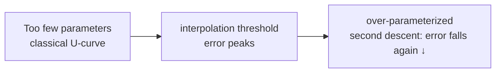

# Regularization & Generalization

<div class="tag-row"><span class="tag">generalization</span><span class="tag">bias–variance</span><span class="tag">L1/L2 & weight decay</span><span class="tag">dropout</span><span class="tag">early stopping</span><span class="tag">data aug</span><span class="tag">double descent</span></div>

> [!NOTE] Goals of this chapter
> [What Is Machine Learning?](#/foundations/what-is-ml) established that the real goal of learning is not memorization but **generalization**. This chapter uses diagrams and code to explain how to recognize **overfitting**, in which a model memorizes its training data, and how to prevent it with regularization tools.

## What overfitting is and why we fight it

Train a model for too long or give it too much capacity, and it may learn not only the true patterns in the data but also its **noise**. It then performs perfectly on the training data and collapses on unseen examples. That is why we divide data into three sets:

<dl class="kv">
<dt>Training set</dt><dd>Data used to fit the model.</dd>
<dt>Validation set</dt><dd>Data used during development to measure performance and select hyperparameters. The model is not directly trained on it.</dd>
<dt>Test set</dt><dd>Data used once at the end to measure true generalization performance. Do not inspect it repeatedly.</dd>
</dl>

### Data leakage — the most common bug that inflates performance

**Data leakage** occurs when information unavailable at the actual prediction time enters training or model selection. If a high validation score fails to translate into deployment performance, audit the split and feature-generation process before changing regularization.

| Leakage type | Incorrect example | Safe design |
| --- | --- | --- |
| Target leakage | Predicting prognosis at admission from a diagnosis code created after discharge | Verify that every feature's **creation time** precedes the prediction time |
| Split leakage | Fitting mean, standard deviation, PCA, or feature selection on the full dataset | Split first; `fit` preprocessing only on training data, inside the pipeline or CV fold |
| Entity leakage | Near-duplicates of the same patient, user, or image appear in both train and validation | Split by entity/group; detect duplicates with IDs or perceptual hashes |
| Temporal leakage | Random split that mixes future data; centered rolling statistics | Split chronologically; construct features only from history available at that time |
| Augmentation leakage | Augmenting before the split so transformed copies appear on both sides | Split original examples first; apply stochastic augmentation only to training data |
| Validation overfitting | Tuning hundreds of times on one validation set and reporting that score as final performance | Keep an independent test set sealed; consider nested CV for model-selection bias on small data |

Oversampling and SMOTE, vocabulary construction, missing-value imputation, and target encoding are all **transformations fitted to the training data**. With scikit-learn, put them inside a `Pipeline` so cross-validation fits them only on the training portion of each fold. However, pretrained statistics or external data that genuinely exist in production are not automatically leakage. The key questions are: **“Will this information exist at deployment time, and is it independent of the evaluation population?”**

> **Concept code — split first, fit within each fold**

```python
train_idx, test_idx = group_split(entity_id)       # keep each user on one side
X_train, X_test = X[train_idx], X[test_idx]
y_train, y_test = y[train_idx], y[test_idx]

pipeline = Pipeline([
    ("impute", Imputer()),                         # not fitted yet
    ("scale", StandardScaler()),
    ("model", Classifier()),
])
scores = cross_validate(pipeline, X_train, y_train) # fit only each fold's training data
pipeline.fit(X_train, y_train)
final_score = metric(y_test, pipeline.predict(X_test))  # use sealed test once, at the end
```

The key signal is a widening gap between training and validation performance: the **generalization gap**. When it begins to widen, overfitting has begun.

<figure>
<svg viewBox="0 0 620 250" xmlns="http://www.w3.org/2000/svg" font-family="Inter, sans-serif" font-size="12">
  <line x1="55" y1="210" x2="590" y2="210" stroke="#98a3b2" stroke-width="1.4"/>
  <line x1="55" y1="20" x2="55" y2="210" stroke="#98a3b2" stroke-width="1.4"/>
  <text x="320" y="238" text-anchor="middle" fill="#98a3b2">training progresses (epoch) →</text>
  <text x="30" y="115" fill="#98a3b2" transform="rotate(-90 30 115)">loss</text>
  <!-- train loss: monotonic down -->
  <path d="M60 60 C 180 150, 320 185, 585 200" fill="none" stroke="#0ea5e9" stroke-width="2.5"/>
  <text x="470" y="195" fill="#0ea5e9">training loss ↓ (keeps falling)</text>
  <!-- val loss: down then up -->
  <path d="M60 75 C 190 150, 250 158, 300 158 C 400 158, 480 120, 585 55" fill="none" stroke="#e0533f" stroke-width="2.5"/>
  <text x="120" y="55" fill="#e0533f">validation loss (falls, then rises ↑)</text>
  <!-- early stopping line at val min -->
  <line x1="300" y1="35" x2="300" y2="210" stroke="#12a150" stroke-width="1.6" stroke-dasharray="5 4"/>
  <circle cx="300" cy="158" r="5" fill="#12a150"/>
  <text x="308" y="45" fill="#12a150">← stop here (early stopping)</text>
  <!-- overfit region shading label -->
  <text x="450" y="150" text-anchor="middle" fill="#98a3b2" font-size="11">this region = overfitting</text>
</svg>
<figcaption>Training loss keeps falling, but validation loss eventually rises again. The <b>minimum</b> is the point of best generalization; stopping there is <b>early stopping</b>.</figcaption>
</figure>

> [!TIP] One-line interview answer
> Regularization is not merely “adding a $\lambda\|\theta\|^2$ term.” It is the systematic practice of **reducing the generalization gap**. A strong answer explains which lever—data, model, or optimization—you would pull first and what evidence would justify it. Weakly/semi-supervised and continual learning are fundamentally generalization problems.

## Bias–variance: the language of underfitting and overfitting

Start with the intuition. Predictions can be wrong for two different reasons:

- **High bias** means the model is **too simple** to capture the pattern → **underfitting**, such as fitting a straight line to curved data.
- **High variance** means the model is **too sensitive**, so small changes in the data cause large changes in predictions → **overfitting**, including memorization of training noise.

The goal is to **balance** the two. For squared error, the expected error decomposes exactly into three terms:

$$
\mathbb E\big[(y-\hat f(x))^2\big]=\underbrace{\text{Bias}^2}_{\text{too rigid}}+\underbrace{\text{Variance}}_{\text{too sensitive}}+\underbrace{\text{Noise}}_{\text{irreducible}}
$$

<figure>
<svg viewBox="0 0 560 210" xmlns="http://www.w3.org/2000/svg" font-family="Inter, sans-serif" font-size="12">
  <line x1="50" y1="180" x2="530" y2="180" stroke="#98a3b2"/><line x1="50" y1="20" x2="50" y2="180" stroke="#98a3b2"/>
  <text x="290" y="202" text-anchor="middle" fill="#98a3b2">model capacity →</text>
  <text x="16" y="100" fill="#98a3b2" transform="rotate(-90 16 100)">error</text>
  <path d="M60 40 C 160 120, 260 168, 520 176" fill="none" stroke="#0ea5e9" stroke-width="2"/>
  <text x="150" y="60" fill="#0ea5e9">bias² (larger when simpler)</text>
  <path d="M60 176 C 260 170, 380 120, 520 30" fill="none" stroke="#e0533f" stroke-width="2"/>
  <text x="440" y="60" fill="#e0533f">variance (larger when complex)</text>
  <path d="M60 90 C 200 70, 240 66, 300 84 C 380 108, 460 70, 520 44" fill="none" stroke="#12a150" stroke-width="2.5"/>
  <text x="300" y="56" fill="#12a150" text-anchor="middle">test error (classical U)</text>
</svg>
<figcaption>The classical U-curve: models that are too simple have high bias; those that are too complex have high variance. Deep networks bend this curve through double descent below, but “underfitting vs overfitting” remains the fastest diagnostic language.</figcaption>
</figure>

**The modern reversal:** Extremely **over-parameterized** neural networks can memorize the training data perfectly and still generalize well. SGD, initialization, and augmentation act as **implicit regularizers**, controlling variance in ways not explicitly written into the objective. The table remains a useful first diagnostic:

| Training | Validation | Diagnosis | First lever |
| --- | --- | --- | --- |
| poor | poor | underfitting / bug / bad LR | larger model, longer training, check for bugs |
| good | poor | overfitting / leakage / shift | augmentation, weight decay, more data |
| good | good | healthy | monitor drift after deployment |
| poor | good | almost certainly a metric/leakage bug | audit the evaluation pipeline |

> [!TIP] Tiny-overfit test (do this first)
> Before changing regularization, turn it off and verify that the model can **nearly memorize a tiny batch**. If a sufficiently capable model with an appropriate objective cannot, first suspect the data loader, labels, train/eval mode, learning rate, or frozen parameters. Label noise, stochastic targets, strong augmentation, a small model, or difficult optimization can keep loss from reaching exactly zero, so one failed attempt does not by itself prove a bug. Use the [gradient-descent widget](#/foundations/optimization) to inspect the effect of step size.

## The anti-overfitting toolbox

<dl class="kv">
<dt>L2 / weight decay</dt><dd>Pulls every weight slightly toward zero (a Gaussian prior; see <a href="#/foundations/probability-statistics">Probability & Statistics</a>). Note that Adam + L2 is not the same as AdamW's decoupled decay; see <a href="#/foundations/optimization">Optimization</a>.</dd>
<dt>L1</dt><dd>Encourages sparsity. Finite steps of subgradient SGD do not guarantee exact zeros; the zero-producing property is clearest in proximal methods using soft thresholding. For deployment compression, also consider structured pruning.</dd>
<dt>Dropout</dt><dd>Randomly turns off neurons during training, preventing co-adaptation and approximating an ensemble of thinner networks.</dd>
<dt>Early stopping</dt><dd>Stops when the validation metric ceases to improve: the green point in the diagram above.</dd>
<dt>Data augmentation</dt><dd>Expands the data through input transformations such as flips, crops, and color changes. In computer vision, it is often the most cost-effective regularizer.</dd>
<dt>Label smoothing</dt><dd>Softens a one-hot target to $1-\varepsilon$ and $\tfrac{\varepsilon}{K-1}$, which can reduce overconfidence. Effects on accuracy and calibration vary by data and setting, so measure them separately.</dd>
</dl>

**Geometric intuition for L1 vs L2:** When minimizing loss within a fixed budget, an $\ell_1$ constraint is a diamond, so the loss contour tends to touch a **corner, where a coordinate is zero**, creating sparsity. An $\ell_2$ constraint is a round ball, so it shrinks all coordinates more evenly and remains dense.

### Implement inverted dropout

The most confusing part of dropout is its scaling. During training, scale surviving neurons by $1/(1-p)$—**inverted dropout**—and the expected value stays correct without any work at inference time. Implement dropout for a supplied mask in the lab below.

<div class="widget" data-widget="code">
<script type="application/json" class="code-config">
{"func":"apply_dropout","packages":["numpy"],"approx":true,"starter":"def apply_dropout(x, mask, p):\n    # x: input array; mask: 1 for kept positions, 0 for dropped positions (same shape); p: drop probability.\n    # Inverted dropout: dropped positions are 0; kept positions are scaled by 1/(1-p).\n    # Return a list.\n    import numpy as np\n    x = np.asarray(x, float); mask = np.asarray(mask, float)\n    # TODO\n    return out.tolist()","tests":[{"args":[[1.0,2.0,3.0,4.0],[1,0,1,0],0.5],"expect":[2.0,0.0,6.0,0.0]},{"args":[[10.0,10.0],[1,1],0.5],"expect":[20.0,20.0]},{"args":[[5.0,5.0,5.0,5.0],[1,1,1,1],0.2],"expect":[6.25,6.25,6.25,6.25]}],"solution":"import numpy as np\n\ndef apply_dropout(x, mask, p):\n    x = np.asarray(x, float); mask = np.asarray(mask, float)\n    out = x * mask / (1.0 - p)\n    return out.tolist()"}
</script>
</div>

In the third test, when $p=0.2$, each surviving value grows to $5/(1-0.2)=6.25$. Scaling in advance during training lets inference use the complete network as-is while preserving magnitude.

**Why data augmentation is regularization:** Showing the model a transformation $T(x)$ instead of only $x$ teaches it to become **invariant** to that transformation through vicinal risk minimization. The spectrum runs from basic transforms (flip/crop/jitter), through strong augmentation (RandAugment/TrivialAugment), to mixing methods (MixUp/CutMix/Copy-Paste). Excessive augmentation can cause underfitting or destroy the label. For segmentation, apply geometric transforms identically to the mask, but do not apply color transforms to it.

## Implicit regularization (advanced)

Not every regularizer is explicit in the loss. The **optimizer itself** biases which solution training reaches when many solutions have zero training loss:

- **Minibatch noise in SGD** affects solution selection, and empirical and theoretical work links it to flatter solutions. Small-batch noise is not always beneficial, however, nor does it guarantee a small-norm solution.
- Under specific conditions, such as logistic regression on linearly separable data, gradient descent converges in direction to a max-margin solution even without an explicit penalty. This is not a theorem that transfers unchanged to every neural network.
- **Early stopping** regularizes by limiting the optimization trajectory. It can be connected to $\ell_2$ in restricted settings such as linear least squares, but the two are not equivalent for general neural networks.
- **Architecture** also supplies inductive bias through convolutional locality and weight sharing, equivariant structures, bottlenecks, normalization, and more.

The practical lesson: when a large model generalizes despite its parameter count, implicit regularization is often doing work that you never explicitly wrote into the code.

## Double descent (advanced)



Test error can peak near the interpolation threshold, where training error approaches zero, then **fall again** as capacity grows further (Belkin et al.; Nakkiran et al.). An *epoch-wise* version can also conflict with naive early stopping. A safe interview framing is:

> “I do not plot double-descent curves every day, but the lesson remains: reducing capacity is not the only route to generalization. Data, regularization, and training budget must be considered together.”

## Calibration & generalization (advanced)

A model can have high accuracy yet poor **calibration**, meaning confidence does not match the empirical probability of being correct. Temperature scaling is a common post-hoc method that adjusts logit scale on a fixed validation set. Label smoothing can reduce overconfidence, but it does not always improve calibration. Measure discrimination and calibration separately. See [Evaluation Metrics](#/foundations/evaluation-metrics).

## Interview Q&A

<details class="qa"><summary>Contrast L1 and L2, including their geometry.</summary>
<div class="qa-body">

**Short:** L2 smoothly shrinks every weight and remains dense, corresponding to a Gaussian prior; L1 sets some weights exactly to zero and is sparse, corresponding to a Laplace prior.

**Deep:** The L2 gradient is proportional to $\theta$, so it shrinks coordinates proportionally without forcing them to zero. The L1 subgradient has constant magnitude and can pin coordinates at zero. Geometrically, a loss contour first meets an $\ell_1$ diamond at an axis-aligned corner. In deep learning, L2 appears as weight decay—with the Adam/AdamW caveat—and deployment sparsity usually comes from structured pruning rather than L1 training alone.
</div></details>

<details class="qa"><summary>What does dropout do, and why do training and inference differ?</summary>
<div class="qa-body">

**Short:** During training, dropout randomly turns off neurons to prevent co-adaptation and approximate an ensemble. Inference uses the full network, with no rescaling needed under inverted dropout because training already scales by $1/(1-p)$.

**Deep:** The intuition is that each minibatch trains a different “thin” subnetwork. On large datasets with strong augmentation, dropout may be reduced or removed to avoid excessive regularization. Vision-specific variants such as SpatialDropout and DropBlock remove contiguous regions because neighboring pixels are correlated. Transformers use attention/FFN dropout and **stochastic depth (DropPath)**. **MC-Dropout**, which leaves dropout active and samples repeatedly at inference, provides an approximate epistemic-uncertainty signal but does not guarantee calibrated uncertainty.
</div></details>

<details class="qa"><summary>Explain bias–variance in an over-parameterized neural network.</summary>
<div class="qa-body">

**Short:** The classical U-curve says that increasing capacity lowers bias and raises variance, yet huge networks that memorize their data can still generalize. Implicit regularization from SGD, initialization, and augmentation keeps variance under control.

**Deep:** The decomposition still guides debugging: if training and validation are both poor, suspect high bias, insufficient capacity, or optimization failure; if the train–validation gap is large, suspect high variance or overfitting and add augmentation, decay, or data. What fails is the assumption that “more parameters always means more overfitting.” Scaling laws and double descent show the opposite regime. Ensembles reduce variance by averaging weakly correlated errors.
</div></details>

<details class="qa"><summary>In what order do you apply regularization on a new project?</summary>
<div class="qa-body">

**Short:** First validate the metric and evaluation → establish a bug-free baseline that can overfit a tiny batch → add augmentation → use AdamW weight decay, cosine decay, and early stopping or EMA → then ablate dropout, label smoothing, and DropPath → reduce capacity only as a last resort.

**Deep:** Enabling dropout immediately is an anti-pattern because you cannot attribute its effect. Add one intervention at a time and ablate it. Beware indirect test overfitting from repeatedly tuning on the same validation set. The motto is that regularization is not sprinkling penalties into the loss; it is *system design* aimed at the generalization gap. See [Debugging & Experimentation](#/foundations/debugging-experimentation).
</div></details>

**Expected follow-ups**

- *Elastic Net?* Combines L1 and L2, adding stability to sparsity.
- *Is TTA regularization?* No. Test-time augmentation is inference-time ensembling, not a training regularizer.
- *Which term does an ensemble reduce?* Variance, by averaging weakly correlated errors.
- *With infinite data, is regularization unnecessary?* Optimization stability, efficiency, and robust evaluation still matter.
- *What does over-regularization look like in fine-tuning?* Training and validation both plateau—underfitting—rather than the gap widening.

## Cheat sheet

| Fact | One line |
| --- | --- |
| Goal | Reduce the generalization gap, not merely add a penalty |
| Tiny-overfit test | If a tiny batch cannot be memorized with regularization off, inspect the pipeline, capacity, and optimization first |
| L1 vs L2 | L1 is sparse (diamond corners); L2 gives dense shrinkage (round ball) |
| Weight decay | Adam + L2 ≠ AdamW; use decoupled decay |
| Dropout | Thin networks during training approximate an ensemble; inverted dropout needs no inference rescaling |
| Augmentation | Often the best value; transform masks and boxes consistently |
| Early stopping | Powerful on small data; beware epoch-wise double descent |
| Bias–variance | Still a useful debugging frame; over-parameterization disproves “more = more overfitting” |
| Double descent | Error can fall again beyond the interpolation peak |

**Next:** [Optimization](#/foundations/optimization) · [Evaluation Metrics](#/foundations/evaluation-metrics) · [Probability & Statistics](#/foundations/probability-statistics) · [Debugging & Experimentation](#/foundations/debugging-experimentation) · [Weak & Semi-Supervised](#/cv/weak-semi-supervised)
