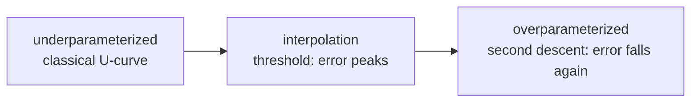

# Regularization & Generalization

bias–varianceL1/L2 & weight decaydropoutearly stoppingdata augdouble descentcalibration

> [!TIP] The mindset they reward
> Regularization is not "add a $\lambda\|\theta\|^2$ term." It is **the systematic reduction of the generalization gap**: which lever — data, model, or optimization — do you pull first, and what signal tells you to? Weakly/semi-supervised and continual-learning work (limited labels under distribution shift) is fundamentally a generalization problem; connect the theory to *diagnosis*.

## Bias–variance: the organizing frame

For squared error, expected test error decomposes as

$$
\mathbb E\big[(y-\hat f(x))^2\big]=\underbrace{\text{Bias}^2}_{\text{too rigid}}+\underbrace{\text{Variance}}_{\text{too sensitive}}+\underbrace{\text{Noise}}_{\text{irreducible}}
$$

<figure>
<svg viewBox="0 0 560 210" xmlns="http://www.w3.org/2000/svg" font-family="Inter, sans-serif" font-size="12">
  <line x1="50" y1="180" x2="530" y2="180" stroke="#98a3b2"/><line x1="50" y1="20" x2="50" y2="180" stroke="#98a3b2"/>
  <text x="290" y="202" text-anchor="middle" fill="#98a3b2">model capacity →</text>
  <text x="16" y="100" fill="#98a3b2" transform="rotate(-90 16 100)">error</text>
  <path d="M60 40 C 160 120, 260 168, 520 176" fill="none" stroke="#0ea5e9" stroke-width="2"/>
  <text x="150" y="60" fill="#0ea5e9">bias²</text>
  <path d="M60 176 C 260 170, 380 120, 520 30" fill="none" stroke="#e0533f" stroke-width="2"/>
  <text x="470" y="60" fill="#e0533f">variance</text>
  <path d="M60 90 C 200 70, 240 66, 300 84 C 380 108, 460 70, 520 44" fill="none" stroke="#12a150" stroke-width="2.5"/>
  <text x="300" y="56" fill="#12a150" text-anchor="middle">test error (classic U)</text>
</svg>
<figcaption>The classical U-curve. Deep nets bend it — but the "underfit vs overfit" language still drives debugging.</figcaption>
</figure>

The modern twist: heavily **over-parameterized** networks generalize despite interpolating the training set, because SGD, initialization, and augmentation act as **implicit regularization** that controls variance. Yet the vocabulary is still the fastest diagnostic:

| Train | Val | Diagnosis | First lever |
| --- | --- | --- | --- |
| bad | bad | underfit / bug / bad LR | bigger model, longer training, check bugs |
| good | bad | overfit / leak / shift | augmentation, weight decay, more data |
| good | good | healthy | monitor deployment drift |
| bad | good | almost certainly a metric/leakage bug | audit the eval pipeline |

> [!TIP] The tiny-overfit test
> Before touching regularization, confirm the model can overfit ~50–200 examples to ~0 loss. If it *can't*, you have a bug (data loader, train/eval mode, LR=0, frozen params) — not an overfitting problem. Manipulate the [gradient-descent widget](#/foundations/optimization) to feel how step size governs whether you even reach that zero-loss basin.

## The lever set

<dl class="kv">
<dt>L2 / weight decay</dt><dd>Shrinks all weights toward 0 (Gaussian prior; see <a href="#/foundations/probability-statistics">Prob & Stats</a>). Note Adam+L2 ≠ AdamW decoupled decay — see <a href="#/foundations/optimization">Optimization</a>.</dd>
<dt>L1</dt><dd>Sparsity via the diamond-constraint corners on the axes; rarer than structured pruning for deployment.</dd>
<dt>Dropout</dt><dd>Randomly zero units (inverted: scale by $1/(1-p)$ at train time) to break co-adaptation; approximates an exponential ensemble of thinned nets.</dd>
<dt>Early stopping</dt><dd>Stop when val metric plateaus; a form of implicit capacity control along the optimization trajectory.</dd>
<dt>Data augmentation</dt><dd>Enlarge the input distribution to enforce invariances — often the single highest-ROI regularizer in CV.</dd>
<dt>Label smoothing</dt><dd>Soften one-hot targets ($1-\varepsilon$ / $\tfrac{\varepsilon}{K-1}$) to curb over-confident logits and improve calibration.</dd>
</dl>

**L1 vs L2 geometry:** minimizing loss subject to an $\ell_p$ budget, the loss contours first touch the $\ell_1$ diamond at a **corner** (a zero coordinate) → sparsity; the $\ell_2$ ball is round → dense shrinkage.

**Dropout, precisely:** $\tilde x=\dfrac{m\odot x}{1-p},\ m_i\sim\text{Bernoulli}(1-p)$ at train time; full network at inference. In modern CNNs, augmentation + weight decay + early stopping often dominate dropout; Transformers use attention/FFN dropout and **stochastic depth (DropPath)**. Keeping dropout on at inference and averaging forward passes gives **MC-Dropout** uncertainty.

**Data augmentation as regularization:** it minimizes a *vicinal* risk — showing $T(x)$ instead of $x$ forces invariance (geometric, photometric, occlusion). Spectrum: basic (flip/crop/jitter) → strong (RandAugment/TrivialAugment) → mixing (MixUp/CutMix/Copy-Paste). Too strong and you underfit or destroy the label (e.g. over-warping text). In segmentation, geometric transforms must be applied to the mask too; photometric ones must not.

## Implicit regularization

Not every regularizer is written into the loss. The *optimizer itself* biases which of the many zero-training-loss solutions you land on:

- **SGD noise** prefers flatter, lower-norm solutions; smaller batches inject more of this beneficial noise.
- **Gradient descent on separable data** converges to the **max-margin** solution even with no explicit penalty (implicit-bias results).
- **Early stopping** ≈ an $\ell_2$ ball on the trajectory: fewer steps ⇒ smaller effective weight norm.
- **Architecture** regularizes too — weight sharing in convs, the low-rank bias of attention, normalization layers.

The practical takeaway: when a big model generalizes despite the parameter count, implicit regularization is usually doing the work you didn't code.

## Double descent

Test error can rise near the interpolation threshold (train error → 0) and then **fall again** as capacity grows further (Belkin et al.; Nakkiran et al.). An *epoch-wise* version exists too, which can conflict with naive early stopping. Interview-safe framing:

> "I don't plot a double-descent curve every day, but the lesson sticks: shrinking capacity isn't the only route to generalization — data, regularization, and training budget have to be considered jointly."

## Calibration & generalization

A model can generalize (high accuracy) yet be **miscalibrated** (confidence ≠ correctness). Label smoothing and temperature scaling improve calibration; the two properties are largely independent, so monitor both. Full treatment in [Evaluation Metrics](#/foundations/evaluation-metrics).

## Interview Q&A

Contrast L1 and L2, including the geometry.

**Short:** L2 shrinks all weights smoothly (dense solution, Gaussian prior); L1 drives some to exactly zero (sparse solution, Laplace prior).

**Deep:** L2's gradient is $\propto\theta$ — always proportional, never forcing a coordinate to zero. L1's subgradient is constant-magnitude, so it can zero out a coordinate and keep it there. Geometrically, the loss level-set first meets the $\ell_1$ diamond at an axis corner. In deep learning L2 appears as weight decay (with the Adam/AdamW caveat), while explicit sparsity for deployment usually comes from structured pruning rather than L1 training.

What does dropout do, and how do train and inference differ?

**Short:** it randomly zeros units at train time to prevent co-adaptation and approximate an ensemble; at inference the full network is used (with inverted dropout, no rescaling is needed because training already scaled by $1/(1-p)$).

**Deep:** each minibatch trains a different "thinned" subnetwork; averaging over the exponentially many subnets is the ensemble intuition. On large datasets with strong augmentation, teams often *reduce or remove* dropout — you can be over-regularized. CV-specific variants (SpatialDropout, DropBlock) drop contiguous regions because neighboring pixels are correlated, so per-unit dropout leaks information.

Explain bias–variance for a modern over-parameterized net.

**Short:** the classical U-curve says capacity↑ ⇒ bias↓, variance↑, but huge nets that interpolate the data still generalize because implicit regularization (SGD, init, augmentation) tames variance.

**Deep:** the decomposition still guides debugging — train≈val both bad means high bias / capacity or optimization failure; a big train–val gap means high variance / overfitting → add augmentation, decay, or data. What breaks is the assumption that "more parameters = more overfitting"; scaling laws and double descent show the opposite regime exists. Ensembles reduce variance by averaging decorrelated errors.

Is early stopping always optimal?

**Short:** no — under epoch-wise double descent, training longer can recover and improve, so a fixed patience may stop in the transient bump.

**Deep:** early stopping is strong for small-data CV fine-tuning, where val loss traces a clean U. But LLM pretraining usually runs a fixed token budget with cosine decay rather than classic early stopping, and long runs can pass through a worse-before-better phase. Practical guardrails: monitor the *metric you actually care about* (e.g. mIoU), not just loss; keep a leak-free val set; and combine with SWA/EMA weight averaging where it helps.

In what order do you apply regularization on a new project?

**Short:** align the metric/eval first → get a bug-free baseline that can tiny-overfit → augmentation → AdamW weight decay + cosine + early stop/EMA → then dropout/label-smoothing/DropPath by ablation → shrink capacity only as a last resort.

**Deep:** "turn on dropout first" is an anti-pattern — you can't attribute the effect. Add regularizers one at a time and ablate. Beware indirect test overfitting from repeatedly tuning against the same val set. The mantra: regularization is a *system-design* activity aimed at the generalization gap, not a loss term you sprinkle on. See [Debugging & Experimentation](#/foundations/debugging-experimentation).

**Follow-ups you should expect**

- *Elastic Net?* L1+L2 combined — sparsity plus stability.
- *TTA — regularization?* No; test-time augmentation is inference-time ensembling, not a training regularizer.
- *Ensembles reduce which term?* Variance, by averaging decorrelated errors.
- *Infinite data — still regularize?* Optimization stability, efficiency, and robust evaluation still matter.
- *Over-regularization symptom in fine-tuning?* Both train and val stall (underfitting), not a widening gap.

## Cheat-sheet

| Fact | One-liner |
| --- | --- |
| Goal | shrink the generalization gap, not just add a penalty. |
| Tiny-overfit test | can't overfit 100 examples ⇒ it's a bug, not overfitting. |
| L1 vs L2 | L1 sparse (diamond corners), L2 dense shrink (round ball). |
| Weight decay | Adam+L2 ≠ AdamW; use decoupled decay. |
| Dropout | train-time thinning ≈ ensemble; often reduced under strong aug. |
| Augmentation | usually highest-ROI regularizer; transform masks/boxes consistently. |
| Early stopping | strong for small-data; watch epoch-wise double descent. |
| Bias–variance | still the debugging frame; over-param nets defy "more = overfit". |
| Double descent | error can fall again past the interpolation peak. |
| Order | eval → baseline → aug → decay/cosine/early-stop → dropout/LS → shrink. |

**Related:** [Optimization](#/foundations/optimization) · [Evaluation Metrics](#/foundations/evaluation-metrics) · [Probability & Statistics](#/foundations/probability-statistics) · [Debugging & Experimentation](#/foundations/debugging-experimentation) · [Weak & Semi-Supervised](#/cv/weak-semi-supervised)
