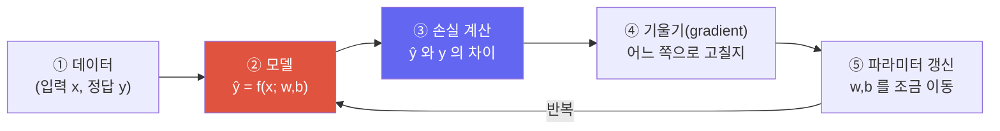

# 머신러닝이란 무엇인가?

> [!NOTE] 이 챕터의 목표
> 수식이나 코드가 처음이어도 괜찮습니다. 이 챕터는 **"기계가 배운다"가 실제로 무슨 뜻인지**를 그림 → 직관 → 아주 짧은 코드 순서로 잡아 줍니다. 뒤따르는 모든 챕터(선형대수, 확률, 최적화, 신경망…)가 여기서 잡은 하나의 그림 위에 쌓입니다.

## 프로그래밍과 무엇이 다른가

전통적인 프로그래밍은 사람이 **규칙**을 직접 적습니다. "이메일에 '무료 당첨'이 있으면 스팸으로 분류하라" 같은 식이죠. 하지만 세상의 규칙은 대부분 이렇게 손으로 다 적을 수 없습니다 — 고양이 사진을 알아보는 규칙을 픽셀 단위로 적어 보라고 하면 불가능합니다.

머신러닝은 순서를 뒤집습니다. 규칙 대신 **예시(데이터)** 를 주면, 기계가 스스로 규칙을 **찾아냅니다**.

<figure>
<svg viewBox="0 0 640 200" xmlns="http://www.w3.org/2000/svg" font-family="Inter, sans-serif" font-size="13">
  <!-- classic programming -->
  <text x="150" y="24" text-anchor="middle" font-weight="700" fill="#6366f1">전통적 프로그래밍</text>
  <rect x="40" y="40" width="90" height="34" rx="6" fill="none" stroke="#6366f1" stroke-width="1.6"/>
  <text x="85" y="62" text-anchor="middle" fill="currentColor">규칙</text>
  <rect x="40" y="96" width="90" height="34" rx="6" fill="none" stroke="#6366f1" stroke-width="1.6"/>
  <text x="85" y="118" text-anchor="middle" fill="currentColor">데이터</text>
  <rect x="200" y="68" width="90" height="34" rx="6" fill="#6366f1"/>
  <text x="245" y="90" text-anchor="middle" fill="#fff">프로그램</text>
  <path d="M130 57 L200 82" stroke="#98a3b2" stroke-width="1.5" marker-end="url(#ar)"/>
  <path d="M130 113 L200 88" stroke="#98a3b2" stroke-width="1.5" marker-end="url(#ar)"/>
  <path d="M290 85 L330 85" stroke="#98a3b2" stroke-width="1.5" marker-end="url(#ar)"/>
  <text x="360" y="90" fill="currentColor">→ 정답</text>
  <!-- ML -->
  <text x="510" y="24" text-anchor="middle" font-weight="700" fill="#e0533f">머신러닝</text>
  <rect x="430" y="40" width="90" height="34" rx="6" fill="none" stroke="#e0533f" stroke-width="1.6"/>
  <text x="475" y="62" text-anchor="middle" fill="currentColor">데이터</text>
  <rect x="430" y="96" width="90" height="34" rx="6" fill="none" stroke="#e0533f" stroke-width="1.6"/>
  <text x="475" y="118" text-anchor="middle" fill="currentColor">정답</text>
  <rect x="560" y="68" width="70" height="34" rx="6" fill="#e0533f"/>
  <text x="595" y="90" text-anchor="middle" fill="#fff">규칙!</text>
  <path d="M520 57 L560 82" stroke="#98a3b2" stroke-width="1.5" marker-end="url(#ar)"/>
  <path d="M520 113 L560 88" stroke="#98a3b2" stroke-width="1.5" marker-end="url(#ar)"/>
  <defs><marker id="ar" markerWidth="8" markerHeight="8" refX="6" refY="3" orient="auto"><path d="M0 0 L6 3 L0 6" fill="#98a3b2"/></marker></defs>
</svg>
<figcaption>전통적 프로그래밍은 규칙+데이터 → 출력을 만들고, <b>지도학습</b>은 데이터+정답 → 규칙을 근사하는 <b>모델</b>을 만듭니다. 비지도·자기지도·강화학습은 아래처럼 학습 신호가 다릅니다.</figcaption>
</figure>

## 학습의 세 가지 방식

지도학습 (Supervised)

**입력 + 정답(label)** 쌍으로 배웁니다. "이 사진 → 고양이", "이 집 정보 → 가격 3억". 분류·회귀의 대표 설정이며, 정답에 대한 예측 오차를 줄이는 것이 목표입니다.

비지도학습 (Unsupervised)

**정답 없이** 데이터의 구조만 봅니다. 비슷한 고객끼리 묶기(clustering), 데이터를 압축하기. "무엇이 비슷한가"를 스스로 찾음.

강화학습 (Reinforcement)

정답 대신 **보상(reward)** 으로 배웁니다. 게임 점수, 바둑의 승패처럼 "잘했다/못했다" 신호만 받고 행동을 개선합니다. 요즘 LLM의 후반 학습(RLHF, RLVR)이 여기서 나옵니다 — [Post-Training & Alignment](#/llm/alignment) 참고.

> [!TIP] 면접 한 줄
> "지도학습은 정답으로, 비지도학습은 구조로, 강화학습은 보상으로 배운다." 여기에 **self-supervised**(정답을 데이터 자체에서 자동 생성 — 예: 다음 단어 맞히기)를 덧붙이면 2026년 감각까지 커버됩니다. 오늘날 거대 모델은 대부분 self-supervised로 사전학습됩니다.

## 기계는 정확히 "무엇을" 배우는가

핵심은 놀랄 만큼 단순합니다. 모델은 **조정 가능한 숫자(parameter, 파라미터)** 를 가진 함수입니다. 학습이란 지도·자기지도에서는 예측 손실을, 강화학습에서는 기대 보상에 대응하는 목적함수를 개선하도록 그 숫자들을 조정하는 과정입니다. 결정트리처럼 gradient가 아닌 탐색·분할 규칙으로 학습하는 모델도 있습니다.

가장 작은 예로 직선 하나를 생각해 봅시다: $\hat{y} = w \cdot x + b$. 여기서 조정 가능한 숫자는 기울기 $w$와 절편 $b$ 둘뿐입니다. 학습은 점들을 가장 잘 지나가는 $w, b$를 찾는 일입니다.

<figure>
<svg viewBox="0 0 640 280" xmlns="http://www.w3.org/2000/svg" font-family="Inter, sans-serif" font-size="12">
  <!-- axes -->
  <line x1="50" y1="240" x2="600" y2="240" stroke="#98a3b2" stroke-width="1.5"/>
  <line x1="50" y1="20" x2="50" y2="240" stroke="#98a3b2" stroke-width="1.5"/>
  <text x="600" y="258" text-anchor="end" fill="#98a3b2">x (입력)</text>
  <text x="58" y="30" fill="#98a3b2">y (정답)</text>
  <!-- data points (roughly y decreasing in svg coords = increasing real y) -->
  <g fill="#0ea5e9">
    <circle cx="90"  cy="205" r="5"/>
    <circle cx="160" cy="188" r="5"/>
    <circle cx="235" cy="170" r="5"/>
    <circle cx="305" cy="150" r="5"/>
    <circle cx="380" cy="120" r="5"/>
    <circle cx="450" cy="100" r="5"/>
    <circle cx="525" cy="72"  r="5"/>
  </g>
  <!-- animated fitting line: starts flat (bad), converges to fitted (good), loops -->
  <line x1="70" x2="560" stroke="#e0533f" stroke-width="3">
    <animate attributeName="y1" dur="4s" repeatCount="indefinite"
      values="150;190;213;215;215;150" keyTimes="0;0.25;0.5;0.7;0.9;1"/>
    <animate attributeName="y2" dur="4s" repeatCount="indefinite"
      values="150;110;58;52;52;150" keyTimes="0;0.25;0.5;0.7;0.9;1"/>
  </line>
  <!-- loss meter -->
  <text x="480" y="205" fill="#e0533f" font-weight="700">오차(loss)</text>
  <rect x="480" y="212" width="110" height="12" rx="6" fill="none" stroke="#e0533f" stroke-width="1.2"/>
  <rect x="482" y="214" height="8" rx="4" fill="#e0533f">
    <animate attributeName="width" dur="4s" repeatCount="indefinite"
      values="106;60;10;6;6;106" keyTimes="0;0.25;0.5;0.7;0.9;1"/>
  </rect>
</svg>
<figcaption>gradient 기반 지도학습을 애니메이션으로 본 모습: 빨간 직선이 처음엔 엉뚱하지만(오차 큼), $w,b$를 조금씩 고치며 점들에 맞아 들어갑니다(오차 작아짐). 신경망 학습의 기본 루프가 이 모습입니다.</figcaption>
</figure>

## 모든 학습을 관통하는 하나의 루프

방금 애니메이션이 보여준 과정을 글로 적으면 이렇게 됩니다. 신경망이든 거대 LLM이든 뼈대는 똑같습니다:

<dl class="kv">
<dt>① 데이터</dt><dd>입력 $x$와 (지도학습이면) 정답 $y$. 예: 공부 시간 → 시험 점수.</dd>
<dt>② 모델</dt><dd>파라미터 $w,b$를 가진 함수 $\hat{y}=f(x)$. 예측을 만듭니다.</dd>
<dt>③ 손실(loss)</dt><dd>예측 $\hat{y}$가 정답 $y$에서 얼마나 틀렸는지를 하나의 숫자로. 작을수록 좋음.</dd>
<dt>④ 기울기(gradient)</dt><dd>손실을 줄이려면 각 파라미터를 <b>어느 방향으로</b> 움직여야 하는지 알려주는 신호. ([경사하강법](#/foundations/optimization)의 핵심)</dd>
<dt>⑤ 갱신</dt><dd>파라미터를 그 방향으로 <b>조금</b> 이동. 이 "조금"의 크기가 learning rate(학습률).</dd>
</dl>

## 직접 돌려보기 — 10줄로 만드는 학습

말로만 들으면 추상적이니, 위 루프를 그대로 코드로 옮겨 봅시다. 아래 **라이브 에디터**에서 직접 채워 넣고 **▶ Run tests**를 누르면 실제로 채점됩니다. 목표는 점들에 맞는 기울기 $w$를 경사하강법으로 찾는 함수입니다. (막히면 **Solution**을 열어 보세요. 첫 실행은 파이썬 런타임을 내려받아 잠깐 걸리고, 이후엔 즉시 실행됩니다.)

이게 전부입니다. `w = w - lr * grad` 한 줄이 위 루프의 ④+⑤이고, 신경망 학습도 이 줄을 수백만 개의 파라미터에 대해 동시에 하는 것뿐입니다. 나머지 챕터들은 이 그림을 정교하게 만듭니다: **손실을 어떻게 고르고**([손실 함수](#/foundations/probability-statistics)), **기울기를 어떻게 자동으로 구하고**([선형대수 & 미적분](#/foundations/linear-algebra-calculus)), **갱신을 어떻게 잘하고**([Optimization](#/foundations/optimization)), **함수 $f$를 어떻게 강력하게 만드는가**([신경망 아키텍처](#/foundations/architectures)).

## 좋은 학습의 진짜 목표: 일반화

여기서 초보자가 가장 많이 헷갈리는 지점 하나. 학습의 목표는 **본 적 있는 데이터를 완벽히 외우는 것이 아니라, 처음 보는 데이터를 잘 맞히는 것**입니다. 이것을 **일반화(generalization)** 라고 합니다.

<figure>
<svg viewBox="0 0 640 200" xmlns="http://www.w3.org/2000/svg" font-family="Inter, sans-serif" font-size="12">
  <g>
    <text x="105" y="18" text-anchor="middle" font-weight="700" fill="#98a3b2">과소적합</text>
    <circle cx="55" cy="120" r="4" fill="#0ea5e9"/><circle cx="90" cy="95" r="4" fill="#0ea5e9"/><circle cx="130" cy="110" r="4" fill="#0ea5e9"/><circle cx="160" cy="70" r="4" fill="#0ea5e9"/>
    <line x1="45" y1="130" x2="170" y2="120" stroke="#e0533f" stroke-width="2.5"/>
    <text x="105" y="180" text-anchor="middle" fill="#98a3b2">너무 단순</text>
  </g>
  <g>
    <text x="320" y="18" text-anchor="middle" font-weight="700" fill="#12a150">적절</text>
    <circle cx="270" cy="120" r="4" fill="#0ea5e9"/><circle cx="305" cy="95" r="4" fill="#0ea5e9"/><circle cx="345" cy="110" r="4" fill="#0ea5e9"/><circle cx="375" cy="70" r="4" fill="#0ea5e9"/>
    <path d="M260 128 Q320 80 385 72" fill="none" stroke="#12a150" stroke-width="2.5"/>
    <text x="320" y="180" text-anchor="middle" fill="#12a150">딱 맞음 ✓</text>
  </g>
  <g>
    <text x="535" y="18" text-anchor="middle" font-weight="700" fill="#98a3b2">과대적합</text>
    <circle cx="485" cy="120" r="4" fill="#0ea5e9"/><circle cx="520" cy="95" r="4" fill="#0ea5e9"/><circle cx="560" cy="110" r="4" fill="#0ea5e9"/><circle cx="590" cy="70" r="4" fill="#0ea5e9"/>
    <path d="M480 125 Q502 60 520 95 Q540 130 560 110 Q580 85 592 70" fill="none" stroke="#d97706" stroke-width="2.5"/>
    <text x="535" y="180" text-anchor="middle" fill="#98a3b2">잡음까지 외움</text>
  </g>
</svg>
<figcaption>왼쪽은 너무 단순해서 못 맞히고(과소적합/underfitting), 오른쪽은 훈련 데이터의 잡음까지 통째로 외워서 새 데이터에 약합니다(과대적합/overfitting). 가운데가 목표입니다. 그래서 데이터를 <b>훈련/검증/테스트</b>로 나눠, 본 적 없는 데이터에서 성능을 잽니다.</figcaption>
</figure>

> [!WARNING] 흔한 오해
> "훈련 정확도 99%"는 좋은 소식이 아닐 수도 있습니다. 검증 데이터에서 성능이 낮으면 그건 **과대적합**입니다. 면접에서 "loss는 떨어지는데 왜 실제 성능이 안 오르나요?"는 단골 질문이며, 답의 출발점이 바로 이 훈련/검증 구분입니다. 자세히는 [Regularization & 일반화](#/foundations/regularization-generalization).

## 고전 머신러닝 지도 — 신경망 전에 확인할 기준선

머신러닝이 곧 딥러닝은 아닙니다. 특히 **표 형태(tabular)의 중소 규모 데이터**에서는 고전 모델이 더 빠르고, 설명하기 쉽고, 강한 기준선이 되는 경우가 많습니다. 면접에서는 모델 이름보다 먼저 **데이터 형태·샘플 수·비선형성·해석 가능성·추론 제약**을 말한 뒤 후보를 좁히세요.

| 모델 | 잘 맞는 상황 | 꼭 확인할 가정·함정 |
| --- | --- | --- |
| 선형·로지스틱 회귀 | 해석 가능한 기준선, 희소 고차원 특징 | 비선형 관계는 특징 변환이 필요; 정칙화 강도는 검증 데이터로 선택 |
| 결정트리·Random Forest | 비선형 tabular, 상호작용, 스케일이 제각각인 특징 | 깊은 트리는 과대적합; 범주형·결측값 지원은 구현마다 다름 |
| Gradient-boosted trees | 구조화 데이터의 강한 기본 선택 | leakage에 매우 민감; 깊이·학습률·트리 수를 함께 튜닝 |
| SVM | 중소 규모, margin이 유용한 분류 | 거리 기반이므로 scaling 중요; kernel SVM은 샘플 수가 커지면 비쌈 |
| k-NN | 간단한 비모수 기준선, 국소 구조 | 추론이 느리고 차원의 저주에 취약; 거리·scaling 선택이 핵심 |
| Naive Bayes | 희소 텍스트, 매우 빠른 기준선 | 특징의 조건부 독립 가정은 강하지만 실전 기준선으로 유용 |
| k-means·GMM·DBSCAN | 라벨 없는 군집 구조 탐색 | 군집 모양·밀도 가정이 서로 다름; 군집 ID에는 의미 있는 순서가 없음 |
| PCA | 압축·시각화·잡음 완화 | 선형 분산 방향을 찾을 뿐 클래스 분리를 직접 최적화하지 않음 |

전처리도 모델의 일부입니다

결측값 대치, 표준화, vocabulary, PCA, feature selection, oversampling은 **훈련 split에만 `fit`** 하고 검증·테스트에는 그 상태로 `transform`해야 합니다. 전체 데이터에 먼저 맞추면 정답을 직접 쓰지 않아도 분포 정보가 새어 들어가는 **data leakage**입니다. 중복 사용자·환자·시간 순서가 있는 데이터는 random row split 대신 group/time split이 필요합니다. 자세한 점검표는 [Regularization & 일반화](#/foundations/regularization-generalization::data-leakage-성능을-가짜로-올리는-가장-흔한-버그)에 이어집니다.

## 핵심 용어 미리보기

이후 챕터에서 계속 나올 단어들을 지금 한 번에 정리합니다. 완벽히 이해할 필요는 없고, "아 이런 게 있었지" 정도면 충분합니다.

| 용어 | 한 줄 뜻 |
| --- | --- |
| **파라미터(parameter)** | 모델이 학습으로 조정하는 숫자들 ($w, b$ …) |
| **특징(feature)** | 모델에 넣는 입력 정보 (예: 방 개수, 면적) |
| **레이블(label)** | 맞히고 싶은 정답 (지도학습) |
| **손실(loss)** | 예측이 정답에서 틀린 정도, 작을수록 좋음 |
| **경사하강법(gradient descent)** | 손실을 줄이는 방향으로 파라미터를 조금씩 옮기는 방법 |
| **학습률(learning rate)** | 한 번에 얼마나 옮길지 — 너무 크면 발산, 너무 작으면 느림 |
| **에폭(epoch)** | 훈련 데이터 전체를 한 번 다 훑는 것 |
| **일반화(generalization)** | 처음 보는 데이터에서도 잘 맞히는 능력 |
| **과대적합(overfitting)** | 훈련 데이터는 잘 맞히는데 새 데이터는 못 맞힘 |

## Q&A

딥러닝은 머신러닝과 다른 건가요?

**짧게:** 딥러닝은 머신러닝의 한 갈래입니다.

**깊게:** 머신러닝은 "데이터로 규칙을 배우는" 모든 방법을 아우르는 큰 우산입니다(선형회귀, 결정트리, SVM 등 포함). **딥러닝**은 그중에서 여러 층(layer)을 쌓은 **신경망(neural network)** 을 쓰는 방법입니다. 층을 깊게 쌓으면 이미지·음성·언어처럼 복잡한 패턴을 사람이 특징을 일일이 설계하지 않아도 스스로 뽑아냅니다. 이 책의 뒷부분(CNN, Transformer, LLM, VLM)은 전부 딥러닝입니다.

왜 손실을 "제곱"오차로 쓰나요? 그냥 차이를 더하면 안 되나요?

**짧게:** 부호 상쇄를 막고, 큰 오차에 더 크게 벌점을 주며, 미분이 깔끔하기 때문입니다.

**깊게:** 단순히 $(\hat{y}-y)$를 더하면 +3 오차와 −3 오차가 상쇄되어 0이 됩니다. 절댓값 $|\hat{y}-y|$은 상쇄는 막지만 0에서 미분이 매끄럽지 않습니다. 제곱 $(\hat{y}-y)^2$은 항상 양수이고, 미분이 $2(\hat{y}-y)$로 간단하며(경사하강법에 이상적), 큰 오차를 제곱만큼 강하게 처벌합니다. 다만 이상치(outlier)에 민감하다는 단점이 있어, 그럴 땐 다른 손실을 씁니다 — 손실 선택은 [확률 & 통계](#/foundations/probability-statistics) 챕터에서 이어집니다.

## 다음 단계

이제 큰 그림이 생겼습니다. 이 루프를 정밀하게 만드는 순서로 읽으면 매끄럽습니다:

  <a class="card" href="#/foundations/linear-algebra-calculus">
📐

선형대수 & 미적분

기울기(gradient)를 자동으로 구하는 언어.
</a>
  <a class="card" href="#/foundations/optimization">
⛰️

Optimization

"조금씩 갱신"을 잘하는 방법 — 슬라이더로 직접 체험.
</a>
  <a class="card" href="#/foundations/architectures">
🧱

신경망 아키텍처

함수 f 를 강력하게: CNN, RNN, Transformer.
</a>

## Cheat-sheet

| 질문 | 한 줄 답 |
| --- | --- |
| ML이란? | 규칙을 손으로 적는 대신, 데이터에서 규칙을 배우게 하는 것 |
| 학습의 세 방식 | 지도(정답) · 비지도(구조) · 강화(보상) + self-supervised |
| 모델이 배우는 것 | 예측이 정답에 가까워지도록 파라미터(숫자)를 조정 |
| 학습 루프 | 데이터 → 예측 → 손실 → 기울기 → 갱신 → 반복 |
| 갱신 한 줄 | `w = w - lr * grad` |
| 진짜 목표 | 외우기가 아니라 **일반화** (새 데이터에서 잘 맞히기) |

**다음:** [선형대수 & 미적분](#/foundations/linear-algebra-calculus) · [확률 & 통계](#/foundations/probability-statistics) · [Optimization](#/foundations/optimization)
