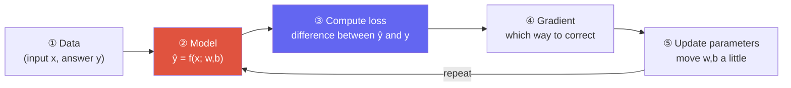

# What Is Machine Learning?

> [!NOTE] Goal of this chapter
> It is fine if equations and code are new to you. This chapter builds an intuition for **what it actually means for a machine to learn**, moving from a picture to an explanation and then to a very short program. Every later chapter—linear algebra, probability, optimization, neural networks, and more—builds on the single picture established here.

## How is it different from programming?

In traditional programming, a person writes the **rules** directly: for example, "If an email contains 'free prize,' classify it as spam." But most rules in the world cannot be enumerated by hand. Try writing pixel-level rules for recognizing a cat in a photograph—it is effectively impossible.

Machine learning reverses the order. Instead of rules, you provide **examples, or data**, and the machine **discovers** a rule for itself.

<figure>
<svg viewBox="0 0 640 200" xmlns="http://www.w3.org/2000/svg" font-family="Inter, sans-serif" font-size="13">
  <!-- classic programming -->
  <text x="150" y="24" text-anchor="middle" font-weight="700" fill="#6366f1">Traditional programming</text>
  <rect x="40" y="40" width="90" height="34" rx="6" fill="none" stroke="#6366f1" stroke-width="1.6"/>
  <text x="85" y="62" text-anchor="middle" fill="currentColor">Rules</text>
  <rect x="40" y="96" width="90" height="34" rx="6" fill="none" stroke="#6366f1" stroke-width="1.6"/>
  <text x="85" y="118" text-anchor="middle" fill="currentColor">Data</text>
  <rect x="200" y="68" width="90" height="34" rx="6" fill="#6366f1"/>
  <text x="245" y="90" text-anchor="middle" fill="#fff">Program</text>
  <path d="M130 57 L200 82" stroke="#98a3b2" stroke-width="1.5" marker-end="url(#ar)"/>
  <path d="M130 113 L200 88" stroke="#98a3b2" stroke-width="1.5" marker-end="url(#ar)"/>
  <path d="M290 85 L330 85" stroke="#98a3b2" stroke-width="1.5" marker-end="url(#ar)"/>
  <text x="360" y="90" fill="currentColor">→ Output</text>
  <!-- ML -->
  <text x="510" y="24" text-anchor="middle" font-weight="700" fill="#e0533f">Machine learning</text>
  <rect x="430" y="40" width="90" height="34" rx="6" fill="none" stroke="#e0533f" stroke-width="1.6"/>
  <text x="475" y="62" text-anchor="middle" fill="currentColor">Data</text>
  <rect x="430" y="96" width="90" height="34" rx="6" fill="none" stroke="#e0533f" stroke-width="1.6"/>
  <text x="475" y="118" text-anchor="middle" fill="currentColor">Answers</text>
  <rect x="560" y="68" width="70" height="34" rx="6" fill="#e0533f"/>
  <text x="595" y="90" text-anchor="middle" fill="#fff">Rules!</text>
  <path d="M520 57 L560 82" stroke="#98a3b2" stroke-width="1.5" marker-end="url(#ar)"/>
  <path d="M520 113 L560 88" stroke="#98a3b2" stroke-width="1.5" marker-end="url(#ar)"/>
  <defs><marker id="ar" markerWidth="8" markerHeight="8" refX="6" refY="3" orient="auto"><path d="M0 0 L6 3 L0 6" fill="#98a3b2"/></marker></defs>
</svg>
<figcaption>Traditional programming combines rules and data to produce output. <b>Supervised learning</b> combines data and answers to produce a <b>model</b> that approximates the rules. Unsupervised, self-supervised, and reinforcement learning use different learning signals, as described below.</figcaption>
</figure>

## Three ways to learn

Supervised learning

The model learns from **input + correct-answer (label)** pairs: "this image → cat" or "these house features → a price of ₩300 million." Classification and regression are the representative settings, and the goal is to reduce prediction error against the answers.

Unsupervised learning

The model sees only the structure of the data, **without answers**: grouping similar customers through clustering or compressing data, for example. It discovers for itself what makes items similar.

Reinforcement learning

Instead of correct answers, the model learns from a **reward**. It receives only a signal of how well it did—such as a game score or the outcome of a Go match—and improves its actions. Modern LLM post-training methods such as RLHF and RLVR come from this setting. See [Post-Training & Alignment](#/llm/alignment).

> [!TIP] One-line interview answer
> "Supervised learning learns from answers, unsupervised learning from structure, and reinforcement learning from rewards." Add **self-supervised learning**, where labels are generated automatically from the data itself—for example, predicting the next word—to make the answer current for 2026. Most large models today are pretrained with self-supervision.

## What exactly does a machine "learn"?

The core idea is surprisingly simple: a model is a function with adjustable numbers called **parameters**. In supervised and self-supervised learning, training adjusts those numbers to improve an objective based on prediction loss; in reinforcement learning, the objective corresponds to expected reward. Some models, such as decision trees, learn through search and splitting rules rather than gradients.

As the smallest example, consider one line: $\hat{y} = w \cdot x + b$. Its only adjustable numbers are the slope $w$ and intercept $b$. Learning means finding the $w$ and $b$ that best fit the points.

<figure>
<svg viewBox="0 0 640 280" xmlns="http://www.w3.org/2000/svg" font-family="Inter, sans-serif" font-size="12">
  <!-- axes -->
  <line x1="50" y1="240" x2="600" y2="240" stroke="#98a3b2" stroke-width="1.5"/>
  <line x1="50" y1="20" x2="50" y2="240" stroke="#98a3b2" stroke-width="1.5"/>
  <text x="600" y="258" text-anchor="end" fill="#98a3b2">x (input)</text>
  <text x="58" y="30" fill="#98a3b2">y (answer)</text>
  <!-- data points (roughly y decreasing in svg coords = increasing real y) -->
  <g fill="#0ea5e9">
    <circle cx="90"  cy="205" r="5"/>
    <circle cx="160" cy="188" r="5"/>
    <circle cx="235" cy="170" r="5"/>
    <circle cx="305" cy="150" r="5"/>
    <circle cx="380" cy="120" r="5"/>
    <circle cx="450" cy="100" r="5"/>
    <circle cx="525" cy="72"  r="5"/>
  </g>
  <!-- animated fitting line: starts flat (bad), converges to fitted (good), loops -->
  <line x1="70" x2="560" stroke="#e0533f" stroke-width="3">
    <animate attributeName="y1" dur="4s" repeatCount="indefinite"
      values="150;190;213;215;215;150" keyTimes="0;0.25;0.5;0.7;0.9;1"/>
    <animate attributeName="y2" dur="4s" repeatCount="indefinite"
      values="150;110;58;52;52;150" keyTimes="0;0.25;0.5;0.7;0.9;1"/>
  </line>
  <!-- loss meter -->
  <text x="480" y="205" fill="#e0533f" font-weight="700">Error (loss)</text>
  <rect x="480" y="212" width="110" height="12" rx="6" fill="none" stroke="#e0533f" stroke-width="1.2"/>
  <rect x="482" y="214" height="8" rx="4" fill="#e0533f">
    <animate attributeName="width" dur="4s" repeatCount="indefinite"
      values="106;60;10;6;6;106" keyTimes="0;0.25;0.5;0.7;0.9;1"/>
  </rect>
</svg>
<figcaption>Gradient-based supervised learning as an animation: the red line starts far from the data, with high error, then gradually changes $w$ and $b$ until it fits the points and the error becomes small. This is the basic neural-network training loop.</figcaption>
</figure>

## The one loop behind all learning

Written out, the process in the animation looks like this. The skeleton is the same for a neural network or a large LLM:

<dl class="kv">
<dt>① Data</dt><dd>Input $x$ and, in supervised learning, answer $y$. For example: hours studied → test score.</dd>
<dt>② Model</dt><dd>A function $\hat{y}=f(x)$ with parameters $w,b$. It produces a prediction.</dd>
<dt>③ Loss</dt><dd>One number measuring how far prediction $\hat{y}$ is from answer $y$. Smaller is better.</dd>
<dt>④ Gradient</dt><dd>A signal telling us <b>which direction</b> to move each parameter to reduce the loss. This is the core of [gradient descent](#/foundations/optimization).</dd>
<dt>⑤ Update</dt><dd>Move the parameters a <b>small</b> distance in that direction. The size of "small" is the learning rate.</dd>
</dl>

## Try it yourself—learning in ten lines

Words alone can feel abstract, so let us turn the loop directly into code. Fill in the **live editor** below and select **▶ Run tests** to have it checked. Your goal is to use gradient descent to find the slope $w$ that fits the points. If you get stuck, open **Solution**. The first run downloads a Python runtime and may take a moment; later runs are immediate.

That is the entire idea. The single line `w = w - lr * grad` performs steps ④ and ⑤ above. Training a neural network simply applies this operation to millions of parameters at once. The remaining chapters refine each part of this picture: **how to choose a loss** in [Probability & Statistics](#/foundations/probability-statistics), **how to obtain gradients automatically** in [Linear Algebra & Calculus](#/foundations/linear-algebra-calculus), **how to update well** in [Optimization](#/foundations/optimization), and **how to make the function $f$ powerful** in [Neural Network Architectures](#/foundations/architectures).

## The real goal of good learning: generalization

Here is a common beginner misconception. The goal of training is **not to memorize the data the model has seen perfectly, but to perform well on new data**. This is called **generalization**.

<figure>
<svg viewBox="0 0 640 200" xmlns="http://www.w3.org/2000/svg" font-family="Inter, sans-serif" font-size="12">
  <g>
    <text x="105" y="18" text-anchor="middle" font-weight="700" fill="#98a3b2">Underfitting</text>
    <circle cx="55" cy="120" r="4" fill="#0ea5e9"/><circle cx="90" cy="95" r="4" fill="#0ea5e9"/><circle cx="130" cy="110" r="4" fill="#0ea5e9"/><circle cx="160" cy="70" r="4" fill="#0ea5e9"/>
    <line x1="45" y1="130" x2="170" y2="120" stroke="#e0533f" stroke-width="2.5"/>
    <text x="105" y="180" text-anchor="middle" fill="#98a3b2">Too simple</text>
  </g>
  <g>
    <text x="320" y="18" text-anchor="middle" font-weight="700" fill="#12a150">Good fit</text>
    <circle cx="270" cy="120" r="4" fill="#0ea5e9"/><circle cx="305" cy="95" r="4" fill="#0ea5e9"/><circle cx="345" cy="110" r="4" fill="#0ea5e9"/><circle cx="375" cy="70" r="4" fill="#0ea5e9"/>
    <path d="M260 128 Q320 80 385 72" fill="none" stroke="#12a150" stroke-width="2.5"/>
    <text x="320" y="180" text-anchor="middle" fill="#12a150">Just right ✓</text>
  </g>
  <g>
    <text x="535" y="18" text-anchor="middle" font-weight="700" fill="#98a3b2">Overfitting</text>
    <circle cx="485" cy="120" r="4" fill="#0ea5e9"/><circle cx="520" cy="95" r="4" fill="#0ea5e9"/><circle cx="560" cy="110" r="4" fill="#0ea5e9"/><circle cx="590" cy="70" r="4" fill="#0ea5e9"/>
    <path d="M480 125 Q502 60 520 95 Q540 130 560 110 Q580 85 592 70" fill="none" stroke="#d97706" stroke-width="2.5"/>
    <text x="535" y="180" text-anchor="middle" fill="#98a3b2">Memorizes noise</text>
  </g>
</svg>
<figcaption>The model on the left is too simple to fit the data and underfits. The one on the right memorizes even the training-data noise and performs poorly on new data, so it overfits. The middle is the goal. We therefore divide data into <b>training, validation, and test</b> sets and measure performance on unseen data.</figcaption>
</figure>

> [!WARNING] A common misconception
> "99% training accuracy" may not be good news. If validation performance is low, the model is **overfitting**. "The loss is falling; why is real-world performance not improving?" is a frequent interview question, and the distinction between training and validation is the starting point. See [Regularization & Generalization](#/foundations/regularization-generalization) for details.

## A map of classical machine learning—check the baselines before a neural network

Machine learning is not synonymous with deep learning. Especially on small or medium-sized **tabular datasets**, classical models are often faster, easier to explain, and stronger baselines. In an interview, start with the **data format, sample count, nonlinearity, interpretability needs, and inference constraints**, then narrow the candidates; do not merely list model names.

| Model | Where it fits | Assumptions and pitfalls to check |
| --- | --- | --- |
| Linear and logistic regression | Interpretable baseline, sparse high-dimensional features | Nonlinear relationships need feature transformations; choose regularization strength on validation data |
| Decision tree and Random Forest | Nonlinear tabular data, interactions, features on different scales | Deep trees overfit; categorical-feature and missing-value support varies by implementation |
| Gradient-boosted trees | Strong default for structured data | Highly sensitive to leakage; tune depth, learning rate, and tree count together |
| SVM | Small or medium-sized classification where margins help | Scaling matters because it is distance-based; kernel SVMs become expensive as sample count grows |
| k-NN | Simple nonparametric baseline, local structure | Slow inference and vulnerable to the curse of dimensionality; distance and scaling choices are central |
| Naive Bayes | Sparse text, extremely fast baseline | Conditional-independence assumption is strong, but it remains a useful practical baseline |
| k-means, GMM, DBSCAN | Exploring unlabeled cluster structure | They assume different cluster shapes and densities; cluster IDs have no meaningful order |
| PCA | Compression, visualization, noise reduction | Finds directions of linear variance; it does not directly optimize class separation |

Preprocessing is part of the model

Fit missing-value imputation, standardization, vocabulary, PCA, feature selection, and oversampling **only on the training split**, then apply the fitted transformation to validation and test data. Fitting on all data first leaks distribution information even without directly using the answers. Data with repeated users or patients, or with temporal order, requires a group or time split rather than a random row split. Continue with the checklist in [Regularization & Generalization](#/foundations/regularization-generalization::data-leakage-the-most-common-bug-that-inflates-performance).

## Key terms at a glance

Here are the terms that will recur throughout the following chapters. You do not need to understand them perfectly yet; recognizing them is enough.

| Term | Meaning in one line |
| --- | --- |
| **Parameter** | A number the model adjusts through learning, such as $w$ or $b$ |
| **Feature** | Input information supplied to the model, such as room count or area |
| **Label** | The correct answer to predict in supervised learning |
| **Loss** | How far a prediction is from its answer; smaller is better |
| **Gradient descent** | A method that moves parameters incrementally in a direction that lowers loss |
| **Learning rate** | How far to move in one update; too large diverges, too small is slow |
| **Epoch** | One complete pass through the training data |
| **Generalization** | The ability to perform well on unseen data |
| **Overfitting** | Performing well on training data but poorly on new data |

## Q&A

Is deep learning different from machine learning?

**Short:** Deep learning is one branch of machine learning.

**Deep:** Machine learning is the broad umbrella for every method that learns rules from data, including linear regression, decision trees, and SVMs. **Deep learning** is the family that uses **neural networks** made of many layers. Deep layers extract complex patterns in images, speech, and language without a person designing each feature by hand. The later parts of this book—CNNs, Transformers, LLMs, and VLMs—are all deep learning.

Why use squared error as the loss? Why not just add the differences?

**Short:** Squaring prevents signs from canceling, penalizes large errors more, and is easy to differentiate.

**Deep:** If we simply add $(\hat{y}-y)$, errors of +3 and −3 cancel to zero. Absolute error $|\hat{y}-y|$ avoids cancellation but is not smooth at zero. Squared error $(\hat{y}-y)^2$ is always nonnegative, has the simple derivative $2(\hat{y}-y)$—ideal for gradient descent—and penalizes large errors quadratically. Its drawback is sensitivity to outliers, for which other losses may be preferable. Loss selection continues in [Probability & Statistics](#/foundations/probability-statistics).

## Next steps

You now have the big picture. Read in this order to refine each part of the loop:

  <a class="card" href="#/foundations/linear-algebra-calculus">
📐

Linear Algebra & Calculus

The language for computing gradients automatically.
</a>
  <a class="card" href="#/foundations/optimization">
⛰️

Optimization

How to make incremental updates well—experience it with sliders.
</a>
  <a class="card" href="#/foundations/architectures">
🧱

Neural Network Architectures

Make function f powerful: CNNs, RNNs, and Transformers.
</a>

## Cheat sheet

| Question | One-line answer |
| --- | --- |
| What is ML? | Let a machine learn rules from data instead of writing the rules by hand |
| Three ways to learn | Supervised (answers) · unsupervised (structure) · reinforcement (rewards), plus self-supervised |
| What does a model learn? | It adjusts parameters—numbers—so predictions move closer to the answers |
| Learning loop | Data → prediction → loss → gradient → update → repeat |
| Update in one line | `w = w - lr * grad` |
| Real goal | **Generalization**, not memorization: perform well on new data |

**Next:** [Linear Algebra & Calculus](#/foundations/linear-algebra-calculus) · [Probability & Statistics](#/foundations/probability-statistics) · [Optimization](#/foundations/optimization)
