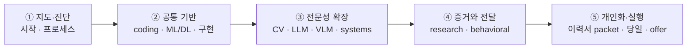

  
Research &amp; Applied Scientist · Computer Vision · VLMs · Agents

  <h1>The ML Interview Codex</h1>
  
Research 또는 applied-scientist 인터뷰와 ML 학습을 함께 준비하는, 지속적으로 개정되는 현장 가이드 — coding과 ML 기초부터 CV·LLM·VLM, system design, research job talk, 그리고 개인 이력 방어까지. <b>2026년 7월 21일</b>에 마지막으로 전반 검토했습니다.

  

    

15

Parts

    

105

Chapters

    

2026.07

Last reviewed

    

∞

Living document

  

> [!TIP] 처음 오셨나요? 먼저 [이 책 사용법](#/start/how-to-use)을 읽고, 그다음 [2026 지형도](#/start/landscape-2026)를 훑어 기대치를 보정하세요. 다음 주에 loop가 잡혀 있어도 [준비 플랜](#/start/prep-plan)의 2주 압축 경로를 사용하면 됩니다.

## 이 책이 무엇인가

이 책은 **research/applied scientist** 트랙을 중심에 둡니다. 최신 reasoning·alignment·agent 시스템을 설명할 수 있어야 *하면서도*, 여전히 non-max suppression을 화이트보드에 깔끔하게 구현하고, 자신의 research를 설득력 있게 발표하며, behavioral loop를 통과해야 하는 트랙입니다. 면접 일정이 없어도 선행 개념 순서대로 읽으면 ML 복습 교재로 사용할 수 있습니다.

이 책은 **처음부터 끝까지 읽는 학습 경로**와 **약한 영역만 보강하는 인터뷰 경로**를 함께 제공합니다. 각 chapter는 단독으로도 읽히지만, 목차는 가능한 한 선행 개념이 먼저 오도록 배열했습니다. 빠르게 변하는 모델·benchmark·채용 절차는 검토 날짜와 출처를 확인하고, recruiter에게 실제 loop를 다시 확인하세요.

## 세 가지 권장 경로

| 목적 | 권장 순서 | 산출물 |
| --- | --- | --- |
| **면접이 2–8주 안에 있음** | 프로세스 → 실행 플레이북 → 약한 기술 축 → research/behavioral → 개인 딥다이브 | mock 기록, story bank, 프로젝트별 2분/10분 답변 |
| **ML을 체계적으로 복습** | Coding → ML·DL 기초 → 밑바닥 구현 → CV → LLM → VLM → system design | 직접 유도한 수식, 재구현 코드, 개념별 failure-mode 노트 |
| **이력서 방어가 급함** | 이력서 맵 → 단계별 예시 답변 → 각 프로젝트 딥다이브 → 예상 질문 → job talk/behavioral | 30초·90초 답변, 주장-근거 표, 공개 가능 범위, I-vs-we 답변 |

## 책의 큰 흐름

리소스 파트는 선형 학습 단계가 아니라 필요할 때 찾는 reference입니다. 개인 이력서 패킷은 특정 후보자용이므로 범용 학습만 원한다면 건너뛰어도 됩니다.

## research-scientist loop의 네 가지 축

<figure>
<svg viewBox="0 0 720 210" xmlns="http://www.w3.org/2000/svg" font-family="Inter, sans-serif">
  <defs>
    <linearGradient id="g1" x1="0" y1="0" x2="1" y2="1"><stop offset="0" stop-color="#e0533f"/><stop offset="1" stop-color="#6366f1"/></linearGradient>
  </defs>
  <g>
    <rect x="10" y="20" width="165" height="170" rx="12" fill="none" stroke="#e0533f" stroke-width="2"/>
    <text x="92" y="48" text-anchor="middle" font-size="30">⌨️</text>
    <text x="92" y="80" text-anchor="middle" font-size="15" font-weight="700" fill="#e0533f">Coding</text>
    <text x="92" y="104" text-anchor="middle" font-size="11" fill="#98a3b2">DSA patterns</text>
    <text x="92" y="122" text-anchor="middle" font-size="11" fill="#98a3b2">ML-from-scratch</text>
    <text x="92" y="140" text-anchor="middle" font-size="11" fill="#98a3b2">live problem-solving</text>
  </g>
  <g>
    <rect x="188" y="20" width="165" height="170" rx="12" fill="none" stroke="#6366f1" stroke-width="2"/>
    <text x="270" y="48" text-anchor="middle" font-size="30">🧠</text>
    <text x="270" y="80" text-anchor="middle" font-size="15" font-weight="700" fill="#6366f1">ML depth &amp; breadth</text>
    <text x="270" y="104" text-anchor="middle" font-size="11" fill="#98a3b2">DL foundations</text>
    <text x="270" y="122" text-anchor="middle" font-size="11" fill="#98a3b2">CV · LLM · VLM · agents</text>
    <text x="270" y="140" text-anchor="middle" font-size="11" fill="#98a3b2">2026 frontier</text>
  </g>
  <g>
    <rect x="366" y="20" width="165" height="170" rx="12" fill="none" stroke="#0ea5e9" stroke-width="2"/>
    <text x="448" y="48" text-anchor="middle" font-size="30">🏗️</text>
    <text x="448" y="80" text-anchor="middle" font-size="15" font-weight="700" fill="#0ea5e9">System design</text>
    <text x="448" y="104" text-anchor="middle" font-size="11" fill="#98a3b2">ML pipelines</text>
    <text x="448" y="122" text-anchor="middle" font-size="11" fill="#98a3b2">LLM/agent systems</text>
    <text x="448" y="140" text-anchor="middle" font-size="11" fill="#98a3b2">serving &amp; scale</text>
  </g>
  <g>
    <rect x="544" y="20" width="165" height="170" rx="12" fill="none" stroke="#12a150" stroke-width="2"/>
    <text x="626" y="48" text-anchor="middle" font-size="30">📄</text>
    <text x="626" y="80" text-anchor="middle" font-size="15" font-weight="700" fill="#12a150">Research + behavioral</text>
    <text x="626" y="104" text-anchor="middle" font-size="11" fill="#98a3b2">job talk</text>
    <text x="626" y="122" text-anchor="middle" font-size="11" fill="#98a3b2">deep-dive on your work</text>
    <text x="626" y="140" text-anchor="middle" font-size="11" fill="#98a3b2">STAR stories</text>
  </g>
</svg>
<figcaption>네 가지 평가 축. 각 축의 비중은 직무와 팀에 따라 달라지므로 실제 loop 구성은 recruiter에게 확인합니다.</figcaption>
</figure>

## 읽기 시작하기

  <a class="card" href="#/start/landscape-2026">
🛰️

The 2026 Landscape

무엇이 바뀌었나: reasoning 모델, RLVR, native multimodal, agents. 기대치를 보정하세요.
</a>
  <a class="card" href="#/coding/patterns">
⌨️

Coding Patterns

대부분의 coding 라운드를 커버하는 ~15개 패턴, cue→pattern 조회표 포함.
</a>
  <a class="card" href="#/foundations/optimization">
📐

DL Foundations

Optimization, normalization, architectures — 인터랙티브 시각화와 함께.
</a>
  <a class="card" href="#/llm/reasoning">
🤖

Reasoning &amp; Agents

Test-time compute, RLVR, tool use, visual agents — 2026년의 핫존.
</a>
  <a class="card" href="#/system-design/framework">
🏗️

ML System Design

반복 사용 가능한 framework와 research/applied 직무를 위한 실전 케이스 스터디.
</a>
  <a class="card" href="#/resume/interview-stage-answers">
🎯

선택: 단계별 개인 답변

Recruiter부터 job talk·behavioral까지 현재 이력서로 만든 클릭형 답변 초안. 사실·공개 범위를 확인해 사용.
</a>

> [!NOTE] 살아있는 문서
> 모델, benchmark, 채용 절차는 계속 움직입니다. 전반 검토일은 이 페이지 상단에, 큰 변경은 [변경 이력](#/resources/changelog)에 기록합니다. 숫자나 회사별 절차를 실제 의사결정에 사용할 때는 해당 primary source의 날짜와 평가 protocol을 다시 확인하세요.
