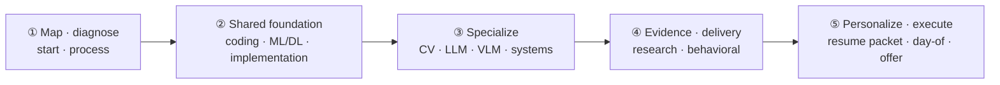

  
Research &amp; Applied Scientist · Computer Vision · VLMs · Agents

  <h1>The ML Interview Codex</h1>
  
A continuously revised field guide for preparing for research or applied-scientist interviews while studying ML — from coding and ML foundations through CV, LLMs, VLMs, system design, the research job talk, and defense of your own resume. Last comprehensively reviewed on <b>July 21, 2026</b>.

  

    

15

Parts

    

105

Chapters

    

2026.07

Last reviewed

    

∞

Living document

  

> [!TIP] New here? Read [How to Use This Book](#/start/how-to-use) first, then skim [The 2026 Landscape](#/start/landscape-2026) to calibrate expectations. Even if your loop is next week, use the two-week compressed path in the [Prep Plan](#/start/prep-plan).

## What this book is

This book centers the **research/applied scientist** track. You need to explain current reasoning, alignment, and agent systems *while still* implementing non-max suppression cleanly on a whiteboard, presenting your research persuasively, and passing a behavioral loop. Without an interview on the calendar, you can also read it in prerequisite order as a structured ML review.

It supports both a **front-to-back learning path** and an **interview path that targets only weak areas**. Each chapter stands alone, but the table of contents puts prerequisites first where possible. For fast-moving models, benchmarks, and hiring procedures, check the review date and source, and reconfirm the actual loop with your recruiter.

## Three recommended paths

| Goal | Recommended order | Deliverables |
| --- | --- | --- |
| **Interview in 2–8 weeks** | Process → execution playbook → weak technical axis → research/behavioral → personal deep-dives | mock log, story bank, two- and ten-minute answers per project |
| **Systematic ML review** | Coding → ML/DL foundations → from-scratch work → CV → LLM → VLM → system design | hand-derived equations, reimplementations, failure-mode notes by concept |
| **Urgent resume defense** | Resume map → stage-by-stage answers → project deep-dives → predicted questions → job talk/behavioral | 30- and 90-second answers, claim–evidence table, disclosure boundary, I-vs-we answers |

## The book's overall flow

The Resources part is a lookup reference, not a linear learning step. The personal resume packet is candidate-specific, so readers interested only in general study can skip it.

## The four axes of a research-scientist loop

<figure>
<svg viewBox="0 0 720 210" xmlns="http://www.w3.org/2000/svg" font-family="Inter, sans-serif">
  <defs>
    <linearGradient id="g1" x1="0" y1="0" x2="1" y2="1"><stop offset="0" stop-color="#e0533f"/><stop offset="1" stop-color="#6366f1"/></linearGradient>
  </defs>
  <g>
    <rect x="10" y="20" width="165" height="170" rx="12" fill="none" stroke="#e0533f" stroke-width="2"/>
    <text x="92" y="48" text-anchor="middle" font-size="30">⌨️</text>
    <text x="92" y="80" text-anchor="middle" font-size="15" font-weight="700" fill="#e0533f">Coding</text>
    <text x="92" y="104" text-anchor="middle" font-size="11" fill="#98a3b2">DSA patterns</text>
    <text x="92" y="122" text-anchor="middle" font-size="11" fill="#98a3b2">ML-from-scratch</text>
    <text x="92" y="140" text-anchor="middle" font-size="11" fill="#98a3b2">live problem-solving</text>
  </g>
  <g>
    <rect x="188" y="20" width="165" height="170" rx="12" fill="none" stroke="#6366f1" stroke-width="2"/>
    <text x="270" y="48" text-anchor="middle" font-size="30">🧠</text>
    <text x="270" y="80" text-anchor="middle" font-size="15" font-weight="700" fill="#6366f1">ML depth &amp; breadth</text>
    <text x="270" y="104" text-anchor="middle" font-size="11" fill="#98a3b2">DL foundations</text>
    <text x="270" y="122" text-anchor="middle" font-size="11" fill="#98a3b2">CV · LLM · VLM · agents</text>
    <text x="270" y="140" text-anchor="middle" font-size="11" fill="#98a3b2">2026 frontier</text>
  </g>
  <g>
    <rect x="366" y="20" width="165" height="170" rx="12" fill="none" stroke="#0ea5e9" stroke-width="2"/>
    <text x="448" y="48" text-anchor="middle" font-size="30">🏗️</text>
    <text x="448" y="80" text-anchor="middle" font-size="15" font-weight="700" fill="#0ea5e9">System design</text>
    <text x="448" y="104" text-anchor="middle" font-size="11" fill="#98a3b2">ML pipelines</text>
    <text x="448" y="122" text-anchor="middle" font-size="11" fill="#98a3b2">LLM/agent systems</text>
    <text x="448" y="140" text-anchor="middle" font-size="11" fill="#98a3b2">serving &amp; scale</text>
  </g>
  <g>
    <rect x="544" y="20" width="165" height="170" rx="12" fill="none" stroke="#12a150" stroke-width="2"/>
    <text x="626" y="48" text-anchor="middle" font-size="30">📄</text>
    <text x="626" y="80" text-anchor="middle" font-size="15" font-weight="700" fill="#12a150">Research + behavioral</text>
    <text x="626" y="104" text-anchor="middle" font-size="11" fill="#98a3b2">job talk</text>
    <text x="626" y="122" text-anchor="middle" font-size="11" fill="#98a3b2">deep-dive on your work</text>
    <text x="626" y="140" text-anchor="middle" font-size="11" fill="#98a3b2">STAR stories</text>
  </g>
</svg>
<figcaption>Four evaluation axes. Their weights vary by role and team, so confirm the actual loop with the recruiter.</figcaption>
</figure>

## Start reading

  <a class="card" href="#/start/landscape-2026">
🛰️

The 2026 Landscape

What changed: reasoning models, RLVR, native multimodal, agents. Calibrate your expectations.
</a>
  <a class="card" href="#/coding/patterns">
⌨️

Coding Patterns

The ~15 patterns that cover most coding rounds, with a cue→pattern lookup.
</a>
  <a class="card" href="#/foundations/optimization">
📐

DL Foundations

Optimization, normalization, architectures — with interactive visualizations.
</a>
  <a class="card" href="#/llm/reasoning">
🤖

Reasoning &amp; Agents

Test-time compute, RLVR, tool use, visual agents — the 2026 hot zone.
</a>
  <a class="card" href="#/system-design/framework">
🏗️

ML System Design

A repeatable framework plus worked case studies for research/applied roles.
</a>
  <a class="card" href="#/resume/interview-stage-answers">
🎯

Optional: Personalized Answers by Stage

Click-to-reveal drafts grounded in the current resume, from recruiter screens through job talks and behavioral rounds. Verify facts and disclosure boundaries before use.
</a>

> [!NOTE] A living document
> Models, benchmarks, and hiring procedures keep moving. The comprehensive review date appears at the top of this page, and the [Changelog](#/resources/changelog) records major updates. Before using a number or company-specific process for a real decision, recheck the primary source's date and evaluation protocol.
