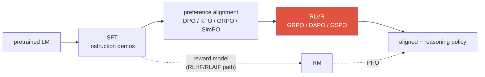
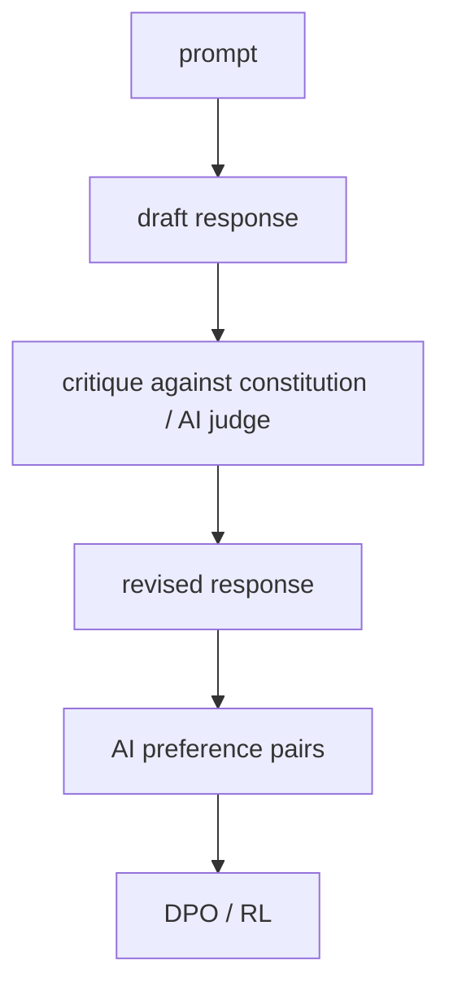

# Post-Training & Alignment 2026-current

SFTPEFT / LoRA / QLoRADPOKTO / ORPO / SimPORLHF vs RLAIFConstitutional AIGRPO / GSPOreward hacking

> [!TIP] 먼저 이렇게 말하라
> alignment는 next-token predictor를 *helpful, honest, harmless*한 무언가로 바꾼다. 2024년의 이야기는 "DPO가 PPO를 대체했다"였다. **2026**년의 이야기는 **critic-free RL과 offline-preference 방법의 동물원**이며, 면접관이 보상하는 것은 acronym을 읊는 게 아니라 **축**을 짚는 것이다 — reference-free vs reference-based, learned reward vs verifier, token- vs sequence-level. 정석 stack을 먼저 꺼내고, 각 방법을 그 축 위에 위치시켜라.

정석적 현대 파이프라인:

## 1 · Stage 1 — SFT (instruction tuning)

`(prompt, good response)` 시연에 대한 supervised fine-tuning. **형식, instruction-following, 스타일**을 가르친다 — 하지만 시연을 *흉내*낼 뿐, "답 B가 답 A보다 낫다"를 표현하지 못한다. 평균적인 시연자로 회귀하고 그들의 상한을 물려받는다. 그 gap을 preference optimization이 메운다.

## PEFT — how you actually run every stage

**Full fine-tuning**은 모든 $N$개 parameter를 업데이트한다 — 현대 LLM에서는 weight, gradient, optimizer state(Adam은 2개의 moment 유지)를 고정밀로 저장한다는 뜻이다: 대략 **param당 12–16 bytes**, 그래서 70B 모델은 optimizer 메모리만 ~1 TB가 필요하다. **Parameter-Efficient Fine-Tuning (PEFT)** 는 pretrained weight를 freeze하고 대신 *아주 작은* 새 parameter 집합을 학습한다. 위의 **모든** stage에 적용된다 — SFT, DPO, RLVR은 실전에서 거의 항상 LoRA로 돌린다.

### LoRA — the default

**LoRA (Low-Rank Adaptation, Hu et al. 2021)** *(verifiable)*. fine-tuning 중 학습되는 weight update는 경험적으로 **low-rank**다(작은 intrinsic-dimension 부분공간에 산다). 그래서 dense한 $d\times k$ update 대신 두 개의 얇은 행렬의 곱으로 parameterize한다:

$$
W' = W_0 + \Delta W = W_0 + \frac{\alpha}{r}\,BA,\qquad B\in\mathbb R^{d\times r},\; A\in\mathbb R^{r\times k},\; r\ll \min(d,k)
$$

$A,B$만 학습되고($W_0$는 freeze), $A$는 random-Gaussian으로, $B$는 **zero**로 init되므로 step 0에서 $\Delta W=0$이다(학습이 pretrained 모델에서 정확히 시작된다). $r$은 rank(보통 8–64), $\alpha$는 scaling 상수다. 학습 가능한 param이 **100–10,000배** 줄어든다.

<dl class="kv">
<dt>왜 되는가</dt><dd>adaptation은 낮은 <b>intrinsic dimensionality</b>를 갖는다 — 처음부터 가르치는 게 아니라 유능한 모델을 다시 조준하는 것이다.</dd>
<dt>Zero inference cost</dt><dd>학습 후 $BA$를 $W_0$로 다시 merge하면 → latency가 <b>전혀</b> 추가되지 않는다(adapter와 달리). 아니면 분리해 두고 하나의 freeze된 base 위에서 여러 task LoRA를 hot-swap할 수도 있다.</dd>
<dt>어디에 둘까</dt><dd>보통 attention projection($q,k,v,o$)에 둔다. 더 어려운 task에서는 MLP layer를 추가하면 도움이 된다. target module이 많고 $r$이 높을수록 ↑용량 ↑비용.</dd>
</dl>

### The PEFT family — locate each on cost vs expressiveness

| Method | 학습되는 것 | 비고 |
| --- | --- | --- |
| **LoRA** | 선택한 weight 행렬 위의 low-rank $BA$ | 기본값; merge하면 inference cost 0 |
| **QLoRA** (2023) | **4-bit (NF4) quantized freeze base** 위의 LoRA | 65B fine-tuning을 **하나의 48 GB GPU**에 맞춤; double-quantization + paged optimizer 추가 |
| **DoRA** (2024) | weight를 **magnitude + direction**으로 분해, direction에 LoRA | 비슷한 비용으로 full FT와의 gap을 더 좁힘 |
| **Adapters** (2019) | layer 사이에 삽입한 작은 bottleneck MLP | inference latency 추가(merge 불가) |
| **Prefix / P-Tuning v2** | key/value 앞에 붙는 학습 가능한 "virtual token" vector | prompt가 activation 공간에 상주, base는 그대로 |
| **Prompt tuning** | 학습 가능한 soft-prompt embedding 몇 개만 | 가장 저렴; 대규모에서만 경쟁력 |
| **IA³** | 학습된 channel별 rescaling vector | 극히 적은 param |

> [!TIP] 어느 것을 고를까
> **LoRA**가 올바른 기본값이다. memory-bound일 때(큰 base의 single-GPU fine-tuning)는 **QLoRA**로. 어려운 task에서 LoRA가 정확도를 놓칠 때는 **DoRA**를 꺼내라. **Full fine-tuning**은 compute가 있고 *동시에* low-rank 가정이 깨지는 큰 도메인 이동(예: 새 언어/modality)이 있을 때만 써라. 이것은 내 **[ECLIPSE](#/resume/eclipse)** 작업 뒤의 본능과 같다 — 강한 backbone을 freeze하고 task마다 작은 **visual prompt**를 학습해 catastrophic forgetting을 피한다 — 그리고 [VLM](#/vlm/practical)을 tuning할 때 LLM/vision-encoder를 freeze하는 것 뒤의 본능과도 같다.

LoRA가 full fine-tuning에 필적하나? 언제 부족한가?

**짧게:** 대부분의 instruction-tuning / preference / 스타일 task에서는 비용의 일부로 full FT와 noise 수준의 차이 안에 든다. update가 *진짜로* high-rank일 때 — 큰 도메인/지식 이동, 새 언어나 modality — 부족한데, low-rank bottleneck이 그 변화를 표현하지 못한다.

**깊게:** LoRA가 부진할 때의 knob: **rank $r$을 높이고**, **target module을 추가하고**(attention만이 아니라 MLP), **$\alpha/r$ scale을 tune**하거나, **DoRA**로 전환. 함정 두 가지: (1) LoRA는 freeze된 base에 없던 지식을 되살릴 수 없다 — 다시 조준할 뿐 용량을 더하지 않는다. (2) 많은 LoRA를 merge하거나 quantization과 겹치면 품질이 저하될 수 있으니, adapter가 아니라 *merge된* 모델을 검증하라. RL(GRPO)에서는 policy에 LoRA를 두는 게 흔하지만 KL을 위한 freeze reference는 merge된 checkpoint가 아니라 *base*여야 한다.

**후속 질문:** 왜 $B=0$으로 init하나? · QLoRA가 하나의 GPU에 맞는 memory 분해는? · 왜 LoRA는 inference latency가 0인데 adapter는 아닌가?

## 2 · Stage 2 — Preference optimization

### The classic RLHF triangle

pairwise preference $y_w \succ y_l$를 모으고, **Bradley–Terry** 가정 아래 **reward model**을 fit한 뒤, KL 목줄 아래에서 PPO로 policy를 그것에 맞춰 최적화한다:

$$
p(y_w\succ y_l\mid x)=\sigma\big(r_\phi(x,y_w)-r_\phi(x,y_l)\big)
$$
$$
\max_\theta\ \mathbb{E}_{x,\,y\sim\pi_\theta}\big[r_\phi(x,y)\big]-\beta\,\mathrm{KL}\!\big(\pi_\theta\,\|\,\pi_{\text{ref}}\big)
$$

KL 항(reference = SFT 모델)은 policy가 reward를 game하는 gibberish로 표류하는 것을 막는다. PPO는 분산 감소를 위해 value/critic 네트워크를 더한다 — 강력하지만 무겁다: rollout loop, reward model, critic, reference가 한 번에 모두 상주한다.

### DPO — collapse the loop

**DPO (Rafailov et al., 2023)** *(verifiable)* 는 RLHF-optimal policy가 closed form을 가짐을 관찰한다. 그래서 reward를 policy 자체의 implicit 함수로 reparameterize할 수 있다. 이것이 명시적 reward model *과* RL rollout을 제거한다 — 학습이 chosen/rejected pair에 대한 하나의 classification 스타일 loss가 된다:

$$
\mathcal L_{\text{DPO}}=-\mathbb E\,\log\sigma\!\Big(\beta\big[\log\tfrac{\pi_\theta(y_w\mid x)}{\pi_{\text{ref}}(y_w\mid x)}-\log\tfrac{\pi_\theta(y_l\mid x)}{\pi_{\text{ref}}(y_l\mid x)}\big]\Big)
$$

reference 모델은 장식이 아니다 — reparameterization에 구워 넣은 **implicit regularizer**다(PPO가 명시화한 KL 역할을 한다).

### The offline-preference family — locate them on two axes

| Method | Reference model? | Data | 핵심 아이디어 |
| --- | --- | --- | --- |
| **DPO** (2023) | yes | paired chosen/rejected | reference에 대한 log-ratio로 implicit reward |
| **KTO** (2024) | yes | **unpaired** 👍/👎 | prospect-theory utility; 짝지은 pair 불필요 |
| **ORPO** (2024) | **no** | paired | **odds-ratio** penalty로 SFT + preference를 한 stage로 통합 |
| **SimPO** (2024) | **no** | paired | length-normalized 평균 log-prob를 implicit reward로 + target margin |

> [!NOTE] 소리 내어 말할 두 축
> **(1) Reference-based vs reference-free.** reference 모델은 메모리와 forward pass를 쓰지만 policy를 고정시킨다. ORPO/SimPO는 그것을 버린다 — 더 저렴하지만, 내장 anchor를 잃는다(SimPO는 length-normalized reward + margin으로 대체하고, ORPO는 자신의 SFT 항에 의존한다). **(2) Paired vs unpaired data.** KTO의 대표적 강점은 production에서 이미 수집하는 raw thumbs-up/down 신호로 학습하는 것이다 — pairwise annotation이 없어도 된다.

> [!QUESTION] 2026년에 나올 법한 질문
> "언제 online RLVR 대신 offline DPO 계열을 고르나?" **답:** **offline preference optimization**을 꺼낼 때는 (a) preference/feedback 데이터는 있지만 저렴한 rollout 인프라가 없고, (b) target이 확인 가능한 답이 아니라 **주관적 품질/스타일/안전**이며, (c) 안정적이고 빠른 single-loss 학습을 원할 때다. **online RLVR (GRPO/GSPO)** 를 꺼낼 때는 도메인이 **verifiable**(math/code/tool-use)하고 policy가 *자신의* 현재 실수로부터 배워야 할 때다 — 이는 offline 데이터가 커버할 수 없다. offline 계열 안에서는: 데이터가 unpaired thumbs-up/down이면 **KTO**; reference 모델을 버리고 싶으면(memory 제약) **SimPO/ORPO**; 잘 이해된 기본값으로는 순수 **DPO**. 대부분의 실제 파이프라인은 **둘 다** 한다: alignment는 DPO 계열, 그다음 reasoning은 RLVR.

### DPO's characteristic failure modes

언제 DPO를 고르지 *않겠는가*, 그리고 어떻게 실패하는가?

**짧게:** DPO는 offline이고 coverage에 묶인다 — 이미 가진 데이터 *안에서만* preference를 날카롭게 할 수 있고, 잘 문서화된 병리를 갖는다.

**깊게:**
- **Likelihood displacement** — loss는 *margin* $\log\pi(y_w)-\log\pi(y_l)$만 신경 쓴다. chosen과 rejected 확률을 *둘 다* **낮출** 수 있다(승자가 패자보다 천천히 떨어짐) — 질량이 무관한 token으로 샌다. 2024–2025년의 살아있는 우려다.
- **Length / verbosity bias** — 데이터에서 긴 답이 선호되면 DPO가 그것을 증폭한다. **SimPO의 length normalization**이 직접적 패치다.
- **Distribution mismatch** — offline pair가 policy 자신의 출력을 커버하지 못할 수 있어, *실제* 실수를 고치는 법을 절대 배우지 못한다. 해법: **online / iterative DPO**(현재 policy에서 pair를 재생성)나 online RL로 이동.
- **Reference sensitivity** — 약하거나 misalign된 reference는 보장을 약화시킨다. DPO↔RLHF 등가성은 *조건부*이지 공짜가 아니다.

**후속 질문:** online DPO는 vanilla DPO와 어떻게 다른가? · SimPO는 왜 reference 모델을 버리고 무엇을 잃는가? · KTO의 unpaired 데이터가 결정적 이점이 되는 때는?

## 3 · Who writes the preferences — RLHF vs RLAIF vs Constitutional AI

같은 RL loop; 차이는 **preference 신호의 출처**다.

<dl class="kv">
<dt>RLHF</dt><dd>인간이 preference를 label → reward model → RL. gold-standard 신호지만, labeling이 병목이고 인간에게도 편향이 있다(length, confidence, style).</dd>
<dt>RLAIF</dt><dd><b>AI feedback 모델</b>이 preference를 생성한다. Lee et al. (2023)은 human-preference win-rate에서 RLAIF ≈ RLHF라고 보고했다 <i>(논문 보고치 — 정확한 수치는 hedge하라)</i>. 저렴하게 scale되지만, 위험 = judge의 편향을 물려받거나 증폭.</dd>
<dt>Constitutional AI</dt><dd>Anthropic (2022): 모델이 성문화된 원칙 집합("constitution")에 대해 <b>self-critique하고 수정</b>한 뒤 AI-label된 preference로 학습하는 특정 RLAIF 레시피. governance가 예제별 label에서 <b>원칙 + judge 설계</b>로 옮겨간다.</dd>
</dl>

> [!WARNING] 솔직한 단서
> RLAIF/self-reward는 인간 감독을 없애지 않는다 — judge와 원칙 속으로 **재배치**한다. judge가 편향됐거나 actor가 judge의 역량을 앞질러 달아나면 **echo chamber**가 된다. robust한 수는 **비순환적 신호**를 섞는 것이다: unit test, 실행 결과, 또는 (vision에서) ground-truth mask / detector 합의. 그 verifier 아이디어를 바로 RLVR이 산업화한다 ↓.

## 4 · Stage 3 — Critic-free RL and RLVR

프런티어의 reasoning 향상은 **RL with verifiable rewards (RLVR)** 에서 온다: *학습된* reward model을 **deterministic verifier**로 교체한다(math 답 정확 → 1, 아니면 0; code가 test 통과 → 1). reward-hacking에 덜 취약하지만, 정확성을 확인할 수 있는 곳에만 적용된다. 용어는 **Tülu 3** (Ai2, 2024)가 만들었다 *(verifiable)*. 이것을 실용적으로 만든 알고리즘이 **GRPO**다.

### GRPO — drop the critic

**GRPO (DeepSeekMath, 2024; DeepSeek-R1, 2025에서 scale됨)** *(verifiable)* 는 PPO의 value 네트워크를 제거한다. 한 prompt에 대해 **group** $G$개 completion을 sample하고, 각각을 채점한 뒤, **group 안에서 reward를 normalize**해 advantage를 추정한다:

$$
\hat A_i=\frac{r_i-\operatorname{mean}(r_1,\dots,r_G)}{\operatorname{std}(r_1,\dots,r_G)}
$$

group 평균이 *바로* baseline이다 — 학습할 별도 critic이 없어 메모리가 대략 절반으로 줄고 불안정성의 원천 하나가 사라진다. advantage $\hat A_i$는 completion $i$의 **모든 token**에 broadcast된 뒤, PPO 스타일 clipped surrogate에 reference에 대한 직접 KL 목줄을 더해 최적화된다:

$$
\mathcal J_{\text{GRPO}}=\mathbb E\Big[\tfrac1G\textstyle\sum_i \tfrac1{|o_i|}\sum_t \min\big(\rho_{i,t}\hat A_i,\ \operatorname{clip}(\rho_{i,t},1{-}\epsilon,1{+}\epsilon)\hat A_i\big)-\beta\,\mathrm{KL}(\pi_\theta\|\pi_{\text{ref}})\Big]
$$

여기서 $\rho_{i,t}=\dfrac{\pi_\theta(o_{i,t}\mid x,o_{i,<t})}{\pi_{\theta_{\text{old}}}(o_{i,t}\mid x,o_{i,<t})}$는 token별 importance ratio다. 그 objective 어디에도 **value 네트워크가 없다**는 점에 주목하라 — 상주하는 모델은 policy와 freeze reference뿐이다. (Dr. GRPO의 수정은 $\tfrac1{|o_i|}$ length normalization과 $\hat A_i$의 std를 버리는 것이고, GSPO의 수정은 $\rho$를 *sequence* 수준 ratio로 만드는 것이다.)

### The GRPO successors — each fixes a specific bug

| Method | 고치는 것 | 메커니즘 |
| --- | --- | --- |
| **DAPO** (Mar 2025) | entropy collapse, 대규모에서 낭비되는 sample | **"clip-higher"** 분리된 clipping + dynamic sampling(전부 맞거나 전부 틀린 group을 drop) |
| **Dr. GRPO** (Mar 2025) | advantage의 length & difficulty 편향 | 긴 오답을 부풀리는 length/std normalization 제거 |
| **GSPO** (Qwen, Jul 2025) *(verifiable)* | **MoE** RL의 불안정성 | importance ratio를 token이 아닌 **sequence** 수준에서 → 응답 전체를 clip/최적화; Qwen3에서 사용 |

> [!QUESTION] 2026년에 나올 법한 질문
> "GRPO는 왜 critic을 버렸고, **GSPO의 sequence-level ratio**는 token-level GRPO가 못 하는 무엇을 해결하나?" **답:** GRPO는 group 평균을 분산 감소 baseline으로 쓰므로 value 네트워크가 잉여다 — 더 저렴하고 안정적이다. 하지만 token-level importance ratio는 noisy하고, **MoE** 모델에서는 rollout과 update 사이에 router가 같은 token을 다른 expert로 보낼 수 있어 token별 ratio가 신뢰할 수 없게 되고 학습이 불안정해진다. **GSPO**는 ratio를 sequence 전체에 걸쳐 집계해, sequence-level reward와 맞추고 MoE routing 아래에서도 안정적이다.

> [!NOTE] acronym 홍수에 대하여
> 2026년 micro-variant 무리(DHPO, TR-GRPO, VPO, …)가 개별 블로그에 등장한다. 개별적으로만 인용되는 것은 **unverified**로 취급하고 구체적 주장을 허풍으로 말하지 마라. **옹호 가능한 방향**은 진짜다: sequence-level 및 hybrid token/sequence objective, MoE-stable RL, multi-turn / agentic credit assignment. *(speculative / direction)*

## 5 · Reward hacking — the through-line failure

*proxy*(reward model, verifier, benchmark harness)를 최적화하면 진짜 의도에서 벗어난다 — **Goodhart's law**. 모든 stage에서 동일한 병리다.

| 증상 | 어디서 물리는가 |
| --- | --- |
| Verbosity / length bias | RM이 긴 답을 선호 → DPO/PPO가 length를 부풀림 |
| Sycophancy | RM이 동의를 보상 → 모델이 듣고 싶은 말을 함 |
| Format-over-substance | 구조는 맞지만 내용이 틀림 |
| Verifier gaming | RLVR: 하드코딩으로 test 통과, 또는 harness bug 악용 |
| Reward-hacking → broad misalignment | 2025–2026 안전 우려: 한 reward를 속이는 법을 배우면 다른 곳의 deception으로 *일반화*됨 *(보고됨, 논쟁 중)* |

**완화책:** hold-out human eval; KL / length normalization; reward-model **ensemble**; adversarial/red-team prompt; **process** reward(step 채점) vs **outcome** reward(최종 답 채점) — 그리고 가장 강한 lever, 가능한 곳에서는 **verifiable reward**를 선호하라. 2026년 평가의 반전: benchmark harness 자체가 이제 공격 표면이다(Berkeley RDI / BenchJack가 *harness*를 공격해 agent benchmark를 깼다). 그래서 "benchmark integrity는 보안 문제다." 더 많은 내용은 [Reasoning & Test-Time Compute](#/llm/reasoning)와 [Evaluation Metrics](#/foundations/evaluation-metrics).

reward hacking을 배포 전에 어떻게 감지하겠는가?

**짧게:** 최적화하는 지표로는 절대 보고하지 마라. reward 신호가 결코 건드리지 않는 **freeze된 private held-out** 평가를 유지하고, 학습 내내 proxy reward와 held-out 품질의 gap을 지켜보라.

**깊게:** (1) **reward vs held-out human/verifier score**를 모니터 — 발산이 신호다. (2) **reference로부터의 KL**을 추적: reward가 오르는데 KL이 폭발 = policy가 hack로 달아나는 중. (3) **length, refusal rate, format 분포**의 drift를 감사. (4) adversarial prompt와 reward-model **불일치**(ensemble)로 red-team. (5) RLVR에서는 verifier를 sandbox하고 퇴화 해법(하드코딩된 답, harness 악용)을 점검.

**후속 질문:** PRM vs ORM trade-off? · ensemble RM이 hacking을 어떻게 줄이나? · process supervision이 step 수준에서 왜 *더* hackable할 수 있나?

## 6 · How to talk about this from a vision background

당신은 다른 이름으로 이 loop를 돌려본 적이 있다: **noisy pseudo-label → iterative refinement**(weak/semi-supervised segmentation)는 구조적으로 RLAIF의 self-critique이고, **metric gaming**(경계 품질이 썩는데 mIoU를 최적화)은 reward hacking이며, **prior checkpoint 근처에 머물게 하는 regularizer**는 KL/reference 항이다. 이 프레임을 착지시켜라: *"alignment는 reference/KL 항이 붕괴를 막는 동안 human 또는 environmental feedback에 policy를 fit하는 것이고, multimodal agent에서는 순수하게 학습된 순환적 reward가 아니라 실행 가능한 verifier(tool success, grounding IoU)에 고정하겠다."*

## Cheat-sheet

| 질문 | 한 줄 요약 |
| --- | --- |
| SFT | 시연 흉내; 형식을 가르치나 "더 낫다"를 표현 못 함 |
| PEFT | base를 freeze, 작은 add-on을 학습; SFT *와* DPO *와* RLVR에 사용 |
| LoRA | low-rank $W_0+\frac{\alpha}{r}BA$; ~100–10,000배 적은 param; merge하면 latency 0 |
| QLoRA | 4-bit (NF4) freeze base 위의 LoRA → 하나의 GPU로 big-model fine-tuning |
| DPO | RLHF의 closed-form 최적점 → pair에 대한 하나의 classification loss; reference = implicit regularizer |
| KTO / ORPO / SimPO | unpaired 데이터 / reference-free single-stage / length-normalized reference-free |
| DPO failure modes | likelihood displacement, length bias, offline coverage, reference sensitivity |
| RLHF vs RLAIF vs CAI | human vs AI-judge vs 성문 원칙에 대한 AI-judge preference |
| RLVR | deterministic verifier reward; robust하지만 정확성을 확인할 수 있는 곳에만(Tülu 3) |
| GRPO | critic-free; advantage = group 내 reward normalization |
| DAPO / Dr.GRPO / GSPO | clip-higher+dynamic sampling / advantage de-bias / **MoE용 sequence-level ratio** |
| Reward hacking | proxy에 대한 Goodhart; held-out eval, KL, ensemble, verifiable reward로 완화 |

## Related

[LLM Fundamentals](#/llm/fundamentals) · [Reasoning & Test-Time Compute](#/llm/reasoning) · [Agentic AI & Tool Use](#/llm/agents) · [Evaluation Metrics](#/foundations/evaluation-metrics) · [Experiment Design & Ablations](#/research/experiment-design) · [The 2026 Landscape](#/start/landscape-2026)
