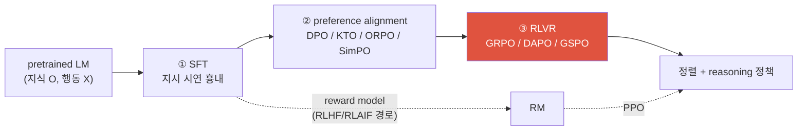
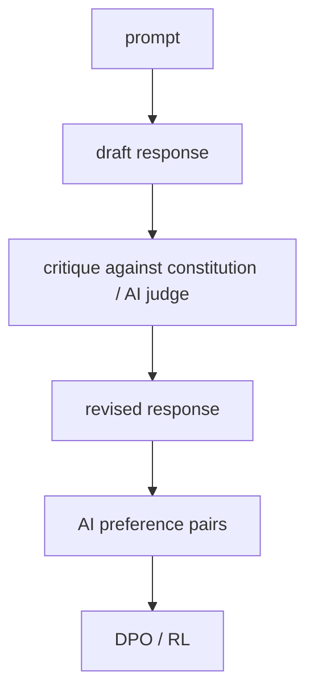

# Post-Training & Alignment <span class="badge badge-2026">2026-current</span>

<div class="tag-row"><span class="tag">SFT</span><span class="tag">PEFT / LoRA / QLoRA</span><span class="tag">DPO</span><span class="tag">KTO / ORPO / SimPO</span><span class="tag">RLHF vs RLAIF</span><span class="tag">Constitutional AI</span><span class="tag">GRPO / GSPO</span><span class="tag">reward hacking</span></div>

> [!NOTE] 이 챕터의 목표
> 사전학습(pretraining)이 끝난 모델은 **아는 것은 많지만** 지시를 안정적으로 따르거나 안전하게 행동하도록 최적화된 것은 아닙니다. 이 챕터는 대표적인 후반 학습 도구인 **SFT, 선호 최적화, RLVR**를 비교합니다. 이를 순차 적용하는 recipe도 있지만, 모델·목표에 따라 일부 단계를 생략·반복하거나 함께 학습합니다. 강화학습 용어가 낯설면 [RL 기초 프라이머](#/llm/rl-primer)를 먼저 보세요.

## 무엇을, 왜 — 흉내에서 정렬로

사전학습은 인터넷의 방대한 글을 **다음 단어 이어 쓰기**로 삼켜 모델에 지식을 채웁니다. 하지만 "그럴듯한 다음 단어"와 "사람에게 실제로 쓸모 있는 답"은 다릅니다. 질문을 하면 되묻는 질문을 지어내거나, 위험한 요청을 그대로 따르거나, 형식을 무시할 수 있죠. **정렬(alignment)** 은 이 날것의 모델을 "질문에 답하고, 형식을 지키고, 나쁜 요청은 거절하는" 조수로 다듬는 과정입니다.

핵심은 세 단계가 **서로 다른 것을 가르친다**는 점입니다.

<figure>
<svg viewBox="0 0 680 200" xmlns="http://www.w3.org/2000/svg" font-family="Inter, sans-serif" font-size="12">
  <!-- base model -->
  <rect x="14" y="72" width="96" height="56" rx="8" fill="none" stroke="#98a3b2" stroke-width="1.8"/>
  <text x="62" y="96" text-anchor="middle" fill="#98a3b2" font-weight="700">사전학습</text>
  <text x="62" y="114" text-anchor="middle" fill="#98a3b2" font-size="10.5">지식 O · 행동 X</text>
  <!-- stage 1 -->
  <rect x="150" y="60" width="150" height="80" rx="8" fill="none" stroke="#6366f1" stroke-width="1.8"/>
  <text x="225" y="84" text-anchor="middle" fill="#6366f1" font-weight="700">① SFT</text>
  <text x="225" y="104" text-anchor="middle" fill="currentColor" font-size="10.5">좋은 답을 흉내 냄</text>
  <text x="225" y="122" text-anchor="middle" fill="currentColor" font-size="10.5">→ <tspan font-weight="700">형식·말투</tspan>를 배움</text>
  <!-- stage 2 -->
  <rect x="335" y="60" width="150" height="80" rx="8" fill="none" stroke="#0ea5e9" stroke-width="1.8"/>
  <text x="410" y="84" text-anchor="middle" fill="#0ea5e9" font-weight="700">② 선호 최적화</text>
  <text x="410" y="104" text-anchor="middle" fill="currentColor" font-size="10.5">A vs B 중 낫다를 배움</text>
  <text x="410" y="122" text-anchor="middle" fill="currentColor" font-size="10.5">→ <tspan font-weight="700">품질·안전</tspan></text>
  <!-- stage 3 -->
  <rect x="520" y="60" width="146" height="80" rx="8" fill="#e0533f"/>
  <text x="593" y="84" text-anchor="middle" fill="#fff" font-weight="700">③ RLVR</text>
  <text x="593" y="104" text-anchor="middle" fill="#fff" font-size="10.5">정답 여부로 배움</text>
  <text x="593" y="122" text-anchor="middle" fill="#fff" font-size="10.5">→ <tspan font-weight="700">검증 가능 추론</tspan></text>
  <!-- arrows -->
  <g stroke="#98a3b2" stroke-width="1.6" fill="none" marker-end="url(#al)">
    <path d="M112 100 L146 100"/><path d="M302 100 L331 100"/><path d="M487 100 L516 100"/>
  </g>
  <defs><marker id="al" markerWidth="8" markerHeight="8" refX="6" refY="3" orient="auto"><path d="M0 0 L6 3 L0 6" fill="#98a3b2"/></marker></defs>
  <text x="340" y="24" text-anchor="middle" fill="#12a150" font-weight="700">각 단계는 서로 다른 것을 가르친다</text>
  <text x="340" y="176" text-anchor="middle" fill="#98a3b2" font-size="10.5">흉내(무엇을 말할지) → 취향(어느 게 나은지) → 검증(정말 맞는지)</text>
</svg>
<figcaption><b>SFT</b>는 시연의 형식과 행동을, <b>선호 최적화</b>는 후보 사이의 상대 품질을, <b>RLVR</b>은 자동 검증 가능한 outcome을 최적화합니다. 그림은 대표 recipe이지 모든 모델의 고정 순서가 아닙니다.</figcaption>
</figure>

정석적 현대 파이프라인을 흐름도로 보면:



> [!TIP] 면접 한 줄
> acronym 암송보다 **축**을 짚으세요 — offline vs online, reference-free vs reference-based, learned reward vs programmatic verifier, token- vs sequence-level. SFT→선호→RLVR는 한 가지 대표 stack이며 실제 recipe는 데이터·목표·rollout 예산에 따라 달라집니다.

## 1 · Stage 1 — SFT (instruction tuning)

**SFT(Supervised Fine-Tuning, 지도 미세조정)** 는 `(프롬프트, 좋은 응답)` 시연 데이터로 지도학습합니다. **형식·지시 따르기·말투**를 가르치고 softmax를 통해 경쟁 token의 확률도 낮춥니다. 다만 일반 SFT 데이터는 후보 A와 B의 **상대 선호**나 실행 outcome을 직접 표현하지 않으므로, 필요하면 preference optimization이나 RL을 더합니다.

## 2 · PEFT — 세 단계를 실제로 돌리는 도구 (단계와 직교)

이 절은 SFT·선호·RLVR **어느 단계에도** 얹히는 가로지르는(cross-cutting) 도구라, 파이프라인 순서와는 별개입니다.

**Full fine-tuning(전체 미세조정)** 은 모든 $N$개 parameter를 업데이트합니다. mixed-precision Adam에서는 weight·master copy·gradient·두 moment의 precision과 sharding 방식에 따라 보통 **param당 약 12–20+ bytes**가 들 수 있습니다. 70B라면 activation을 빼고도 전체 model state가 대략 0.8–1.4TB 규모이고, FP32 Adam moment 두 개만 계산하면 약 560GB입니다. **PEFT**는 base를 freeze하고 작은 parameter 집합만 학습해 이를 줄입니다. SFT·DPO·RLVR 모두에 적용할 수 있지만 full FT와 PEFT 중 무엇이 낫지는 품질 목표·rank·target module·분산 학습 환경에 달렸습니다.

### LoRA — 사실상의 기본값

**LoRA(Low-Rank Adaptation, 저랭크 적응, Hu et al. 2021)** *(verifiable)*. 미세조정 중 학습되는 weight 변화량은 경험적으로 **low-rank(저랭크)** 입니다(작은 부분공간에 삽니다). 그래서 dense한 $d\times k$ 변화 대신 얇은 두 행렬의 곱으로 표현합니다:

$$
W' = W_0 + \Delta W = W_0 + \frac{\alpha}{r}\,BA,\qquad B\in\mathbb R^{d\times r},\; A\in\mathbb R^{r\times k},\; r\ll \min(d,k)
$$

$A,B$만 학습되고($W_0$는 freeze), $A$는 random-Gaussian으로, $B$는 **zero**로 초기화하므로 step 0에서 $\Delta W=0$입니다. $r$은 rank, $\alpha$는 scaling 상수입니다. 학습 parameter는 흔히 full FT보다 몇 자릿수 적지만 정확한 비율은 rank와 적용 module 수에 따라 크게 달라집니다.

<figure>
<svg viewBox="0 0 560 170" xmlns="http://www.w3.org/2000/svg" font-family="Inter, sans-serif" font-size="12">
  <rect x="30" y="45" width="90" height="90" rx="6" fill="none" stroke="#98a3b2" stroke-width="1.8"/>
  <text x="75" y="95" text-anchor="middle" fill="#98a3b2">W₀</text>
  <text x="75" y="30" text-anchor="middle" fill="#98a3b2">동결 (d×k)</text>
  <text x="140" y="95" text-anchor="middle" font-size="18" fill="currentColor">+</text>
  <rect x="165" y="45" width="26" height="90" rx="4" fill="#e0533f"/><text x="178" y="152" text-anchor="middle" fill="#e0533f">B (d×r)</text>
  <text x="205" y="95" text-anchor="middle" font-size="16" fill="currentColor">·</text>
  <rect x="220" y="80" width="90" height="22" rx="4" fill="#6366f1"/><text x="265" y="120" text-anchor="middle" fill="#6366f1">A (r×k)</text>
  <text x="345" y="95" text-anchor="middle" font-size="16" fill="currentColor">→</text>
  <text x="450" y="80" text-anchor="middle" fill="#12a150" font-weight="700">학습되는 건</text>
  <text x="450" y="100" text-anchor="middle" fill="#12a150">얇은 B, A 뿐</text>
  <text x="450" y="122" text-anchor="middle" fill="#98a3b2" font-size="11">(r ≪ d,k → 파라미터 급감)</text>
</svg>
<figcaption>LoRA: 거대한 $W_0$는 얼려두고, 그 위에 얹는 작은 저랭크 보정 $BA$만 학습합니다. 학습 후 $BA$를 $W_0$에 합치면(merge) 추론 비용이 전혀 늘지 않습니다.</figcaption>
</figure>

<dl class="kv">
<dt>왜 되는가</dt><dd>적응(adaptation)은 낮은 <b>intrinsic dimensionality(내재 차원)</b>를 갖습니다 — 처음부터 가르치는 게 아니라 유능한 모델을 다시 조준하는 것이라서요.</dd>
<dt>추론 비용 0</dt><dd>학습 후 $BA$를 $W_0$로 다시 merge하면 latency가 <b>전혀</b> 안 늘어납니다(adapter와 다름). 또는 분리해 두고 하나의 freeze base 위에서 여러 task LoRA를 hot-swap할 수도 있습니다.</dd>
<dt>어디에 둘까</dt><dd>보통 attention projection($q,k,v,o$)에 둡니다. 더 어려운 task는 MLP layer를 추가하면 도움이 됩니다. target module이 많고 $r$이 높을수록 ↑용량 ↑비용.</dd>
</dl>

### PEFT 계열 — 비용 vs 표현력으로 위치 잡기

| Method | 학습되는 것 | 비고 |
| --- | --- | --- |
| **LoRA** | 선택한 weight 행렬 위의 low-rank $BA$ | 기본값; merge하면 inference cost 0 |
| **QLoRA** (2023) | **4-bit (NF4) quantized freeze base** 위의 LoRA | 65B fine-tuning을 **하나의 48 GB GPU**에 맞춤; double-quantization + paged optimizer |
| **DoRA** (2024) | weight를 **magnitude + direction**으로 분해, direction에 LoRA | 비슷한 비용으로 full FT와의 gap을 더 좁힘 |
| **Adapters** (2019) | layer 사이에 삽입한 작은 bottleneck MLP | inference latency 추가(merge 불가) |
| **Prefix / P-Tuning v2** | key/value 앞에 붙는 학습 가능한 "virtual token" vector | prompt가 activation 공간에 상주, base는 그대로 |
| **Prompt tuning** | 학습 가능한 soft-prompt embedding 몇 개만 | 가장 저렴; 대규모에서만 경쟁력 |
| **IA³** | 학습된 channel별 rescaling vector | 극히 적은 param |

> [!TIP] 어느 것을 고를까
> 제한된 메모리와 빠른 iteration이 중요하면 **LoRA/QLoRA**가 좋은 출발점입니다. 다만 최고 품질, 큰 distribution shift, 장기 pretraining·post-training에서는 full FT가 유리할 수 있습니다. 작은 pilot에서 rank·target module·merge 후 품질과 full-FT baseline을 함께 비교하세요.

<details class="qa"><summary>LoRA가 full fine-tuning에 필적하나? 언제 부족한가?</summary>
<div class="qa-body">

**짧게:** LoRA는 많은 instruction-tuning·preference·style 설정에서 강한 비용 대비 성능을 보이지만, full FT와의 차이가 항상 noise 수준인 것은 아닙니다. 필요한 변화가 선택한 rank·target module로 표현되지 않거나 큰 domain/language/modality shift가 있으면 부족할 수 있으므로, 같은 data·budget·evaluation에서 full-FT baseline과 비교합니다.

**깊게:** LoRA가 부진할 때는 rank와 target module을 늘리고 scale을 tune하거나 DoRA/full FT를 비교합니다. 많은 adapter를 merge하거나 quantization과 겹치면 품질이 달라질 수 있으니 merge된 artifact를 검증하세요. KL/DPO의 frozen reference는 **선택한 기준 policy**—대개 post-SFT 또는 training 시작 checkpoint—여야 합니다. 구현에 따라 frozen adapter, base+초기 adapter, 별도 checkpoint로 표현할 수 있으며 반드시 원래 base 모델일 필요는 없습니다.

**후속 질문:** 왜 $B=0$으로 init하나? · QLoRA가 하나의 GPU에 맞는 memory 분해는? · 왜 LoRA는 inference latency가 0인데 adapter는 아닌가?
</div></details>

## 3 · Stage 2 — Preference optimization (선호 최적화)

여기서부터가 "A가 B보다 낫다"는 **선호**를 가르치는 단계입니다. 방법은 크게 둘 — 옛 정석인 **RLHF**(보상 모델 + RL)와, 그것을 하나의 손실로 접은 **DPO 계열**입니다.

### 고전적 RLHF 삼각형 <span class="badge">심화</span>

**RLHF(Reinforcement Learning from Human Feedback, 사람 피드백 기반 강화학습)** 는 pairwise preference(쌍별 선호) $y_w \succ y_l$를 모으고, **Bradley–Terry** 가정 아래 **reward model(보상 모델, RM)** 을 fit한 뒤, KL 목줄 아래에서 **PPO(Proximal Policy Optimization; [프라이머](#/llm/rl-primer) 참고)** 로 policy를 그것에 맞춰 최적화합니다:

$$
p(y_w\succ y_l\mid x)=\sigma\big(r_\phi(x,y_w)-r_\phi(x,y_l)\big)
$$
$$
\max_\theta\ \mathbb{E}_{x,\,y\sim\pi_\theta}\big[r_\phi(x,y)\big]-\beta\,\mathrm{KL}\!\big(\pi_\theta\,\|\,\pi_{\text{ref}}\big)
$$

KL 항은 policy가 선택한 reference에서 너무 멀어지는 것을 벌주지만 reward gaming을 완전히 막지는 못합니다. PPO 계열 RLHF에는 policy, value/critic, reward model, reference라는 논리적 역할과 rollout loop가 필요해 무겁습니다. 실제로 한 GPU에 모두 동시에 상주하는지는 sharing·offload·분리 serving에 달렸습니다.

### DPO — RL loop를 접다 <span class="badge">심화</span>

**DPO(Direct Preference Optimization, 직접 선호 최적화, Rafailov et al., 2023)** *(verifiable)* 는 RLHF-최적 policy가 closed form(닫힌 형태)을 가짐을 관찰합니다. 그래서 reward를 policy 자체의 implicit(암묵적) 함수로 reparameterize할 수 있습니다. 이것이 명시적 reward model *과* RL rollout을 제거합니다 — 학습이 chosen/rejected 쌍에 대한 하나의 분류-스타일 loss가 됩니다:

$$
\mathcal L_{\text{DPO}}=-\mathbb E\,\log\sigma\!\Big(\beta\big[\log\tfrac{\pi_\theta(y_w\mid x)}{\pi_{\text{ref}}(y_w\mid x)}-\log\tfrac{\pi_\theta(y_l\mid x)}{\pi_{\text{ref}}(y_l\mid x)}\big]\Big)
$$

reference 모델은 장식이 아니라 reparameterization에 구워 넣은 **implicit regularizer(암묵적 정규화)** 입니다(PPO가 명시화한 KL 역할).

<details class="concept-code">
<summary>개념 코드로 보기</summary>

> 아래는 DPO loss의 shape와 gradient 경계를 보여 주는 PyTorch식 **의사코드**입니다. 그대로 실행되는 trainer 구현은 아닙니다.

```python
def sequence_logp(model, prompt_and_answer, answer_mask):
    # logits[:, t]는 token[:, t+1]을 예측하므로 한 칸 shift한다.
    logits = model(prompt_and_answer).logits[:, :-1, :]       # [B,L-1,V]
    target = prompt_and_answer[:, 1:]                         # [B,L-1]
    token_logp = log_softmax(logits, -1).gather(-1, target[..., None]).squeeze(-1)
    return (token_logp * answer_mask[:, 1:]).sum(-1)          # prompt/pad 제외

def dpo_step(chosen, rejected, chosen_mask, rejected_mask):
    policy.train(); reference.eval()
    pi_w = sequence_logp(policy, chosen, chosen_mask)          # [B]
    pi_l = sequence_logp(policy, rejected, rejected_mask)
    with no_grad():                                            # reference는 고정 anchor
        ref_w = sequence_logp(reference, chosen, chosen_mask)
        ref_l = sequence_logp(reference, rejected, rejected_mask)

    preference_logit = beta * ((pi_w - pi_l) - (ref_w - ref_l))
    loss = -logsigmoid(preference_logit).mean()
    optimizer.zero_grad(); loss.backward(); optimizer.step()
    # 합/평균 log-prob 선택은 길이 편향을 바꾸므로 실험 규약에 명시한다.
```

</details>

방법마다 필요한 **논리적 model 역할과 forward pass**가 다릅니다. 실제 동시 GPU residency는 parameter sharing, cached log-prob, offload, rollout engine 분리에 따라 달라집니다.

<figure>
<svg viewBox="0 0 660 190" xmlns="http://www.w3.org/2000/svg" font-family="Inter, sans-serif" font-size="11.5">
  <text x="110" y="20" text-anchor="middle" font-weight="700" fill="#e0533f">RLHF/PPO — 4개 논리 역할</text>
  <g fill="none" stroke="#e0533f" stroke-width="1.5">
    <rect x="30" y="34" width="160" height="22" rx="4"/><rect x="30" y="62" width="160" height="22" rx="4"/>
    <rect x="30" y="90" width="160" height="22" rx="4"/><rect x="30" y="118" width="160" height="22" rx="4"/>
  </g>
  <text x="110" y="49" text-anchor="middle" fill="currentColor">policy (학습)</text>
  <text x="110" y="77" text-anchor="middle" fill="currentColor">critic/value (학습)</text>
  <text x="110" y="105" text-anchor="middle" fill="currentColor">reward model</text>
  <text x="110" y="133" text-anchor="middle" fill="currentColor">reference (동결)</text>
  <text x="330" y="20" text-anchor="middle" font-weight="700" fill="#6366f1">DPO — 2개 역할</text>
  <g fill="none" stroke="#6366f1" stroke-width="1.5"><rect x="255" y="48" width="150" height="22" rx="4"/><rect x="255" y="90" width="150" height="22" rx="4"/></g>
  <text x="330" y="63" text-anchor="middle" fill="currentColor">policy (학습)</text>
  <text x="330" y="105" text-anchor="middle" fill="currentColor">reference (동결)</text>
  <text x="565" y="20" text-anchor="middle" font-weight="700" fill="#12a150">GRPO — critic 없음</text>
  <g fill="none" stroke="#12a150" stroke-width="1.5"><rect x="480" y="48" width="170" height="22" rx="4"/><rect x="480" y="90" width="170" height="22" rx="4"/></g>
  <text x="565" y="63" text-anchor="middle" fill="currentColor">policy (학습)</text>
  <text x="565" y="105" text-anchor="middle" fill="currentColor">reference (동결)</text>
  <text x="330" y="172" text-anchor="middle" fill="#98a3b2">논리 역할 비교. 실제 residency는 share/cache/offload/rollout engine에 따라 다르다.</text>
</svg>
<figcaption>DPO는 명시적 reward model·critic을, GRPO는 learned critic을 제거합니다. 이는 비용을 줄일 수 있지만 rollout engine·old policy·reference·optimizer까지 포함한 실제 메모리는 구현별로 계산해야 합니다.</figcaption>
</figure>

### offline-preference 계열 — 두 축으로 위치 잡기

| Method | Reference model? | Data | 핵심 아이디어 |
| --- | --- | --- | --- |
| **DPO** (2023) | yes | paired chosen/rejected | reference에 대한 log-ratio로 implicit reward |
| **KTO** (2024) | yes | **unpaired** 👍/👎 | prospect-theory utility; 짝지은 pair 불필요 |
| **ORPO** (2024) | **no** | paired | **odds-ratio** penalty로 SFT + preference를 한 stage로 통합 |
| **SimPO** (2024) | **no** | paired | length-normalized 평균 log-prob를 implicit reward로 + target margin |

> [!NOTE] 소리 내어 말할 두 축
> **(1) Reference-based vs reference-free.** reference 모델은 메모리와 forward pass를 쓰지만 policy를 고정시킵니다. ORPO/SimPO는 그것을 버립니다 — 더 저렴하지만 내장 anchor를 잃습니다(SimPO는 length-normalized reward + margin으로, ORPO는 자신의 SFT 항으로 대체). **(2) Paired vs unpaired data.** KTO의 대표 강점은 production에서 이미 수집하는 raw 👍/👎 신호로 학습하는 것 — pairwise annotation이 없어도 됩니다.

> [!QUESTION] 2026년에 나올 법한 질문
> "언제 online RLVR 대신 offline DPO 계열을 고르나?" **답:** preference data가 있고 online rollout/verifier가 비싸거나 목표가 주관적 품질·스타일·안전이라면 offline preference optimization이 자연스러운 후보입니다. 자동 검증 가능하고 on-policy exploration이 가치 있으면 RLVR을 비교합니다. Unpaired label에는 KTO, reference-free objective에는 SimPO/ORPO, paired reference-based baseline에는 DPO가 후보지만, 이름으로 결정하지 말고 data coverage·quality·compute·regression을 같은 eval에서 검증하세요. 둘을 순차 결합할 수도 있습니다.

### DPO의 특징적 실패 모드 <span class="badge">심화</span>

<details class="qa"><summary>언제 DPO를 고르지 *않겠는가*, 그리고 어떻게 실패하는가?</summary>
<div class="qa-body">

**짧게:** DPO는 offline이고 coverage(데이터 범위)에 묶입니다 — 이미 가진 데이터 *안에서만* 선호를 날카롭게 할 수 있고, 잘 문서화된 병리를 갖습니다.

**깊게:**
- **Likelihood displacement** — loss는 *margin* $\log\pi(y_w)-\log\pi(y_l)$만 신경 씁니다. chosen과 rejected 확률을 *둘 다* **낮출** 수 있어(승자가 패자보다 천천히 떨어짐) 질량이 무관한 token으로 샙니다.
- **Length / verbosity bias** — 데이터에서 긴 답이 선호되면 DPO가 증폭합니다. **SimPO의 length normalization**이 직접적 패치.
- **Distribution mismatch** — offline pair가 policy 자신의 출력을 커버 못 해 *실제* 실수를 고치는 법을 못 배웁니다. 해법: **online / iterative DPO** 또는 online RL.
- **Reference sensitivity** — 약하거나 misalign된 reference는 보장을 약화시킵니다. DPO↔RLHF 등가성은 *조건부*입니다.

**후속 질문:** online DPO는 vanilla DPO와 어떻게 다른가? · SimPO는 왜 reference를 버리고 무엇을 잃는가? · KTO의 unpaired 데이터가 결정적 이점인 때는?
</div></details>

## 4 · 누가 선호를 쓰나 — RLHF vs RLAIF vs Constitutional AI

같은 RL loop; 차이는 **선호 신호의 출처**입니다.

<dl class="kv">
<dt>RLHF</dt><dd><b>인간</b>이 preference를 label → reward model → RL. gold-standard 신호지만 labeling이 병목이고 인간에게도 편향이 있습니다(length, confidence, style).</dd>
<dt>RLAIF(RL from AI Feedback, AI 피드백 기반 강화학습)</dt><dd><b>AI feedback 모델</b>이 preference를 생성합니다. Lee et al. (2023)은 해당 실험에서 RLAIF가 RLHF와 비슷한 human-preference 결과를 보고했지만 task·judge·human protocol에 조건부입니다. 사람 label 비용을 줄일 수 있으나 inference·audit 비용과 judge 편향이 남습니다.</dd>
<dt>Constitutional AI(헌법적 AI)</dt><dd>Anthropic (2022): 모델이 성문화된 원칙("constitution")에 대해 <b>self-critique하고 수정</b>한 뒤 AI-label된 preference로 학습하는 특정 RLAIF 레시피. governance가 예제별 label에서 <b>원칙 + judge 설계</b>로 옮겨갑니다.</dd>
</dl>



> [!WARNING] 솔직한 단서
> RLAIF/self-reward는 인간 감독을 없애지 않고 judge·원칙·감사 단계로 **재배치**합니다. judge가 편향됐거나 actor가 judge의 역량을 앞서면 순환 오류가 커질 수 있습니다. 가능한 곳에서는 unit test, 실행 결과, 사람 감사, vision ground truth 같은 독립 신호를 섞고, detector 합의처럼 함께 틀릴 수 있는 proxy는 별도로 검증하세요.

## 5 · Stage 3 — Critic-free RL과 RLVR

**RLVR(RL with Verifiable Rewards)** 는 answer matcher, code test, constraint checker처럼 자동 검증 가능한 reward로 policy를 학습합니다. Tülu 3가 2024년 이 명칭과 open recipe를 제시했습니다([논문](https://arxiv.org/abs/2411.15124)). verifier는 binary·결정론적일 수도 있지만 partial/noisy/multiple-test reward일 수도 있고, harness와 hidden-case를 game할 수 있습니다. GRPO는 RLVR에 자주 쓰이는 알고리즘 중 하나이지 RLVR의 필수조건은 아닙니다.

### GRPO — critic을 버리다 <span class="badge">심화</span>

**GRPO(Group Relative Policy Optimization, 그룹 상대 정책 최적화, DeepSeekMath 2024; DeepSeek-R1 2025에서 scale)** *(verifiable)* 는 PPO의 value 네트워크를 제거합니다. 한 prompt에 대해 **group** $G$개 completion을 sample하고, 각각 채점한 뒤, **group 안에서 reward를 normalize**해 advantage(어드밴티지 — 평균 대비 이득, [프라이머](#/llm/rl-primer))를 추정합니다:

$$
\hat A_i=\frac{r_i-\operatorname{mean}(r_1,\dots,r_G)}{\operatorname{std}(r_1,\dots,r_G)}
$$

group 평균이 baseline 역할을 하므로 별도 learned critic은 없습니다. critic parameter·optimizer state를 아끼지만 전체 메모리가 절반이라는 보장은 없고, group rollout·old-policy log-prob·reference·optimizer 비용은 남습니다. advantage $\hat A_i$는 completion $i$의 token에 broadcast된 뒤 PPO 스타일 clipped surrogate와 KL regularization으로 최적화됩니다:

$$
\mathcal J_{\text{GRPO}}=\mathbb E\Big[\tfrac1G\textstyle\sum_i \tfrac1{|o_i|}\sum_t \min\big(\rho_{i,t}\hat A_i,\ \operatorname{clip}(\rho_{i,t},1{-}\epsilon,1{+}\epsilon)\hat A_i\big)-\beta\,\mathrm{KL}(\pi_\theta\|\pi_{\text{ref}})\Big]
$$

여기서 $\rho_{i,t}=\dfrac{\pi_\theta(o_{i,t}\mid x,o_{i,<t})}{\pi_{\theta_{\text{old}}}(o_{i,t}\mid x,o_{i,<t})}$는 token별 importance ratio입니다. **value network가 없다는 것**과 policy·reference만 동시에 상주한다는 것은 다릅니다. old policy/rollout engine을 별도 process에 두거나 log-prob을 cache·offload할 수 있습니다. Dr.GRPO는 response-length aggregation과 reward-std normalization을 제거하고, GSPO는 sequence-level importance ratio와 clipping을 사용합니다.

<details class="concept-code">
<summary>개념 코드로 보기</summary>

> 아래는 critic 없는 group-relative update를 보이는 **의사코드**입니다. 구현마다 aggregation·KL·clipping 정의가 다르므로 알고리즘 이름만 보고 복사하면 안 됩니다.

```python
def grpo_step(prompts, group_size):
    policy.eval()
    with no_grad():
        completions = rollout(policy, prompts, n=group_size)   # [B,G,L]
        rewards = sandboxed_verifier(completions)              # [B,G]
        old_logp = token_logp(policy, completions).detach()     # rollout snapshot
        ref_logp = token_logp(reference.eval(), completions).detach()

        mean = rewards.mean(dim=1, keepdim=True)
        std = rewards.std(dim=1, keepdim=True)
        advantage = ((rewards - mean) / (std + 1e-6)).detach() # [B,G]
        advantage = advantage[..., None]                       # token 축에 broadcast

    policy.train()
    new_logp = token_logp(policy, completions)                  # [B,G,L]
    ratio = exp(new_logp - old_logp)
    surrogate = min(ratio * advantage,
                    clamp(ratio, 1-eps, 1+eps) * advantage)
    valid = completions.response_mask                           # prompt/pad 제외
    loss = -masked_mean(surrogate, valid) + beta * sampled_kl(new_logp, ref_logp, valid)
    optimizer.zero_grad(); loss.backward(); optimizer.step()
    # reward가 모두 같은 group은 학습 신호가 거의 0이므로 비율을 모니터링한다.
```

</details>

### GRPO 후속들 — 각자 특정 버그를 고침

| Method | 고치는 것 | 메커니즘 |
| --- | --- | --- |
| **DAPO** (Mar 2025) | clipping·zero-gradient group·overlong sample·token aggregation 문제 | clip-higher, dynamic sampling, soft overlong punishment, token-level policy-gradient loss ([논문](https://arxiv.org/abs/2503.14476)) |
| **Dr. GRPO** (Mar 2025) | response-length aggregation과 difficulty weighting 편향 | per-response length normalization과 reward std scaling 제거 ([논문](https://arxiv.org/abs/2503.20783)) |
| **GSPO** (Jul 2025) | token-level ratio와 sequence reward의 불일치 | sequence likelihood ratio·sequence-level clipping; 저자 실험에서 MoE RL 안정화 ([논문](https://arxiv.org/abs/2507.18071)) |

> [!QUESTION] 2026년에 나올 법한 질문
> "GRPO는 왜 critic을 버렸고 GSPO는 무엇을 바꾸나?" **답:** GRPO는 같은 prompt의 group reward로 baseline을 추정해 learned critic을 제거합니다. 그 대가로 group sampling과 coarse sequence-level credit assignment가 필요합니다. GSPO는 sequence reward와 token-level ratio의 granularity mismatch를 줄이려고 ratio·clipping을 sequence 수준으로 옮겼고, 논문은 특히 MoE 학습 안정화를 보고했습니다. 이는 모든 설정에서의 보편적 우위가 아니라 실험 결과입니다.

> [!NOTE] acronym 홍수에 대하여
> 2026년 micro-variant 무리(DHPO, TR-GRPO, VPO, …)가 개별 블로그에 등장합니다. 개별적으로만 인용되는 것은 **unverified**로 취급하고 구체적 주장을 허풍으로 말하지 마세요. **옹호 가능한 방향**은 진짜입니다: sequence-level 및 hybrid token/sequence objective, MoE-stable RL, multi-turn / agentic credit assignment. *(speculative / direction)*

## 6 · Reward hacking(보상 해킹) — 모든 단계를 관통하는 실패

**reward hacking(보상 해킹)** 은 진짜 의도 대신 그 *대리 지표(proxy)*(reward model, verifier, benchmark harness)를 최적화해 의도에서 벗어나는 현상입니다 — **Goodhart의 법칙**(지표가 목표가 되면 좋은 지표이길 멈춘다). 모든 stage에서 동일한 병리입니다.

| 증상 | 어디서 물리는가 |
| --- | --- |
| Verbosity / length bias | RM이 긴 답을 선호 → DPO/PPO가 length를 부풀림 |
| Sycophancy(아첨) | RM이 동의를 보상 → 모델이 듣고 싶은 말을 함 |
| Format-over-substance | 구조는 맞지만 내용이 틀림 |
| Verifier gaming | RLVR: 하드코딩으로 test 통과, 또는 harness bug 악용 |
| Proxy gaming의 전이 | 한 verifier에서 배운 편법이 다른 task로 전이하는지는 설정별 실증 질문; 별도 held-out behavior로 측정 |

**완화책:** hold-out human eval; KL·length monitoring; reward-model ensemble; adversarial/red-team prompt; **process reward**(step마다 신호)와 **outcome reward**(완성된 풀이를 최종 결과로 채점)의 목적에 맞는 선택. verifiable reward도 harness·test coverage를 공격할 수 있으므로 private held-out test와 sandbox가 필요합니다. benchmark integrity는 보안 문제입니다. 더 많은 내용은 [Reasoning & Test-Time Compute](#/llm/reasoning), [Evaluation Metrics](#/foundations/evaluation-metrics).

<details class="qa"><summary>reward hacking을 배포 전에 어떻게 감지하겠는가?</summary>
<div class="qa-body">

**짧게:** 최적화한 reward만 보고하지 말고, 학습·선택에 쓰지 않은 **access-controlled held-out** 평가와 함께 보고하세요. 반복 조회로 held-out에 적응하지 않도록 접근 횟수와 최종 lockbox를 관리하고, proxy reward와 독립 평가 품질의 gap을 봅니다.

**깊게:** (1) **reward vs held-out human/verifier score**를 모니터 — 발산이 신호. (2) **reference로부터의 KL**을 추적: reward가 오르는데 KL이 폭발 = policy가 hack로 달아나는 중. (3) **length, refusal rate, format 분포**의 drift를 감사. (4) adversarial prompt와 reward-model **불일치**(ensemble)로 red-team. (5) RLVR에서는 verifier를 sandbox하고 퇴화 해법(하드코딩된 답, harness 악용)을 점검.

**후속 질문:** PRM vs ORM trade-off? · ensemble RM이 hacking을 어떻게 줄이나? · process supervision이 step 수준에서 왜 *더* hackable할 수 있나?
</div></details>

## 7 · vision 배경에서 이 주제를 말하는 법

vision 경험과는 **구조적 유사성**으로 연결할 수 있습니다. **noisy pseudo-label → iterative refinement**(weak/semi-supervised segmentation, [참고](#/cv/weak-semi-supervised))는 model-generated signal을 다시 학습에 쓰는다는 점에서 RLAIF와 닮았지만 동일한 objective는 아닙니다. **metric gaming**(경계 품질이 나쁜데 mIoU만 최적화)은 reward hacking의 직관이고, prior checkpoint 근처에 두는 regularizer는 KL/reference 항과 비슷한 역할을 합니다. 차이와 유사성을 함께 말하세요.

## Cheat-sheet

| 질문 | 한 줄 요약 |
| --- | --- |
| SFT | target sequence likelihood 학습; 형식·행동을 가르치나 pairwise/outcome 신호는 직접 없음 |
| PEFT | base를 freeze, 작은 add-on을 학습; SFT *와* DPO *와* RLVR에 사용 |
| LoRA | low-rank $W_0+\frac{\alpha}{r}BA$; 감소율은 rank·target module 의존; merge 가능 |
| QLoRA | 4-bit (NF4) freeze base 위의 LoRA → 하나의 GPU로 big-model fine-tuning |
| DPO | RLHF의 closed-form 최적점 → pair에 대한 하나의 분류 loss; reference = implicit regularizer |
| KTO / ORPO / SimPO | unpaired 데이터 / reference-free single-stage / length-normalized reference-free |
| DPO failure modes | likelihood displacement, length bias, offline coverage, reference sensitivity |
| RLHF vs RLAIF vs CAI | human vs AI-judge vs 성문 원칙에 대한 AI-judge preference |
| RLVR | 자동 검증 가능한 reward; 감사 가능하지만 noise·test/harness gaming에 취약할 수 있음 |
| GRPO | learned critic 없이 group-relative reward로 advantage 추정; rollout 비용·편향은 남음 |
| DAPO / Dr.GRPO / GSPO | clip-higher+dynamic sampling / advantage de-bias / **MoE용 sequence-level ratio** |
| Reward hacking | proxy에 대한 Goodhart; held-out eval, KL, ensemble, verifiable reward로 완화 |

## Related

[RL 기초 프라이머](#/llm/rl-primer) · [LLM Fundamentals](#/llm/fundamentals) · [Reasoning & Test-Time Compute](#/llm/reasoning) · [Agentic AI & Tool Use](#/llm/agents) · [Evaluation Metrics](#/foundations/evaluation-metrics) · [The 2026 Landscape](#/start/landscape-2026)
