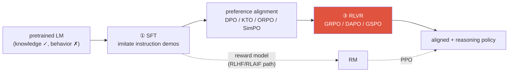
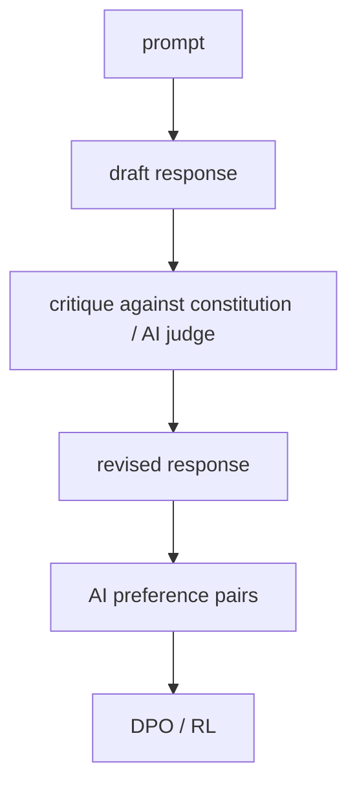

# Post-Training & Alignment <span class="badge badge-2026">2026-current</span>

<div class="tag-row"><span class="tag">SFT</span><span class="tag">PEFT / LoRA / QLoRA</span><span class="tag">DPO</span><span class="tag">KTO / ORPO / SimPO</span><span class="tag">RLHF vs RLAIF</span><span class="tag">Constitutional AI</span><span class="tag">GRPO / GSPO</span><span class="tag">reward hacking</span></div>

> [!NOTE] Goal of this chapter
> A pretrained model **knows a great deal**, but has not necessarily been optimized to follow instructions reliably or act safely. This chapter compares the main post-training tools: **SFT, preference optimization, and RLVR**. They are often applied as a sequence, but stages may be skipped, repeated, or trained jointly depending on the model and objective. If the RL terminology is unfamiliar, read the [RL Primer](#/llm/rl-primer) first.

## What and why — from imitation to alignment

Pretraining fills a model with knowledge by learning to **continue the next token** across enormous internet corpora. But a plausible next token is not the same thing as a useful answer. A raw model may invent another question, comply with a dangerous request, or ignore the requested format. **Alignment** turns it into an assistant that answers questions, follows formats, and refuses harmful requests.

The key is that the three stages **teach different things**.

<figure>
<svg viewBox="0 0 680 200" xmlns="http://www.w3.org/2000/svg" font-family="Inter, sans-serif" font-size="12">
  <!-- base model -->
  <rect x="14" y="72" width="96" height="56" rx="8" fill="none" stroke="#98a3b2" stroke-width="1.8"/>
  <text x="62" y="96" text-anchor="middle" fill="#98a3b2" font-weight="700">Pretraining</text>
  <text x="62" y="114" text-anchor="middle" fill="#98a3b2" font-size="10.5">Knowledge ✓ · behavior ✗</text>
  <!-- stage 1 -->
  <rect x="150" y="60" width="150" height="80" rx="8" fill="none" stroke="#6366f1" stroke-width="1.8"/>
  <text x="225" y="84" text-anchor="middle" fill="#6366f1" font-weight="700">① SFT</text>
  <text x="225" y="104" text-anchor="middle" fill="currentColor" font-size="10.5">Imitate good answers</text>
  <text x="225" y="122" text-anchor="middle" fill="currentColor" font-size="10.5">→ learn <tspan font-weight="700">format and style</tspan></text>
  <!-- stage 2 -->
  <rect x="335" y="60" width="150" height="80" rx="8" fill="none" stroke="#0ea5e9" stroke-width="1.8"/>
  <text x="410" y="84" text-anchor="middle" fill="#0ea5e9" font-weight="700">② Preference optimization</text>
  <text x="410" y="104" text-anchor="middle" fill="currentColor" font-size="10.5">Learn that A is better than B</text>
  <text x="410" y="122" text-anchor="middle" fill="currentColor" font-size="10.5">→ <tspan font-weight="700">quality and safety</tspan></text>
  <!-- stage 3 -->
  <rect x="520" y="60" width="146" height="80" rx="8" fill="#e0533f"/>
  <text x="593" y="84" text-anchor="middle" fill="#fff" font-weight="700">③ RLVR</text>
  <text x="593" y="104" text-anchor="middle" fill="#fff" font-size="10.5">Learn from correctness</text>
  <text x="593" y="122" text-anchor="middle" fill="#fff" font-size="10.5">→ <tspan font-weight="700">verifiable reasoning</tspan></text>
  <!-- arrows -->
  <g stroke="#98a3b2" stroke-width="1.6" fill="none" marker-end="url(#al)">
    <path d="M112 100 L146 100"/><path d="M302 100 L331 100"/><path d="M487 100 L516 100"/>
  </g>
  <defs><marker id="al" markerWidth="8" markerHeight="8" refX="6" refY="3" orient="auto"><path d="M0 0 L6 3 L0 6" fill="#98a3b2"/></marker></defs>
  <text x="340" y="24" text-anchor="middle" fill="#12a150" font-weight="700">Each stage teaches something different</text>
  <text x="340" y="176" text-anchor="middle" fill="#98a3b2" font-size="10.5">imitation (what to say) → preference (which is better) → verification (is it correct?)</text>
</svg>
<figcaption><b>SFT</b> teaches the form and behavior of demonstrations, <b>preference optimization</b> teaches relative quality among candidates, and <b>RLVR</b> optimizes automatically verifiable outcomes. This is a representative recipe, not a mandatory order for every model.</figcaption>
</figure>

A conventional modern pipeline looks like this:



> [!TIP] Interview one-liner
> Name the **axes**, not just the acronyms—offline vs online, reference-free vs reference-based, learned reward vs programmatic verifier, and token- vs sequence-level. SFT → preference → RLVR is one representative stack; the actual recipe depends on data, objectives, and rollout budget.

## 1 · Stage 1 — SFT (instruction tuning)

**SFT (Supervised Fine-Tuning)** trains on `(prompt, good response)` demonstrations. It teaches **format, instruction-following, and style**, and the softmax also lowers the probabilities of competing tokens. Ordinary SFT data does not directly express the **relative preference** between candidates A and B or the outcome of executing them, so preference optimization or RL can be added when needed.

## 2 · PEFT — a cross-cutting tool for all three stages

This section is independent of pipeline order: PEFT is a **cross-cutting** tool that can be used with SFT, preference optimization, or RLVR.

**Full fine-tuning** updates all $N$ parameters. With mixed-precision Adam, the weights, master copy, gradients, two moments, their precisions, and sharding strategy can require roughly **12–20+ bytes per parameter**. For 70B parameters, total model state alone can therefore be on the order of 0.8–1.4 TB before activations; two FP32 Adam moments alone are about 560 GB. **PEFT** freezes the base and trains only a small parameter set. It applies to SFT, DPO, and RLVR, but whether it beats full FT depends on the quality target, rank, target modules, and distributed-training setup.

### LoRA — the default

**LoRA (Low-Rank Adaptation, Hu et al. 2021)** *(verifiable)*. A weight update learned during fine-tuning is empirically **low-rank** (it lives in a small intrinsic-dimension subspace), so parameterize it as a product of two thin matrices instead of a dense $d\times k$ update:

$$
W' = W_0 + \Delta W = W_0 + \frac{\alpha}{r}\,BA,\qquad B\in\mathbb R^{d\times r},\; A\in\mathbb R^{r\times k},\; r\ll \min(d,k)
$$

Only $A,B$ are trained ($W_0$ is frozen); $A$ is initialized with random Gaussian values and $B$ with **zeros**, so $\Delta W=0$ at step 0. Here $r$ is the rank and $\alpha$ is a scaling constant. Trainable parameters are often orders of magnitude fewer than in full FT, but the exact ratio varies substantially with rank and the number of target modules.

<figure>
<svg viewBox="0 0 560 170" xmlns="http://www.w3.org/2000/svg" font-family="Inter, sans-serif" font-size="12">
  <rect x="30" y="45" width="90" height="90" rx="6" fill="none" stroke="#98a3b2" stroke-width="1.8"/>
  <text x="75" y="95" text-anchor="middle" fill="#98a3b2">W₀</text>
  <text x="75" y="30" text-anchor="middle" fill="#98a3b2">frozen (d×k)</text>
  <text x="140" y="95" text-anchor="middle" font-size="18" fill="currentColor">+</text>
  <rect x="165" y="45" width="26" height="90" rx="4" fill="#e0533f"/><text x="178" y="152" text-anchor="middle" fill="#e0533f">B (d×r)</text>
  <text x="205" y="95" text-anchor="middle" font-size="16" fill="currentColor">·</text>
  <rect x="220" y="80" width="90" height="22" rx="4" fill="#6366f1"/><text x="265" y="120" text-anchor="middle" fill="#6366f1">A (r×k)</text>
  <text x="345" y="95" text-anchor="middle" font-size="16" fill="currentColor">→</text>
  <text x="450" y="80" text-anchor="middle" fill="#12a150" font-weight="700">Only the thin B and A</text>
  <text x="450" y="100" text-anchor="middle" fill="#12a150">are trainable</text>
  <text x="450" y="122" text-anchor="middle" fill="#98a3b2" font-size="11">(r ≪ d,k → far fewer parameters)</text>
</svg>
<figcaption>LoRA freezes the enormous $W_0$ and trains only the small low-rank correction $BA$. Merging $BA$ into $W_0$ after training adds no inference cost.</figcaption>
</figure>

<dl class="kv">
<dt>Why it works</dt><dd>Adaptation has low <b>intrinsic dimensionality</b> — you're re-aiming a capable model, not teaching it from scratch.</dd>
<dt>Zero inference cost</dt><dd>Merge $BA$ back into $W_0$ after training → <b>no</b> added latency (unlike adapters). Or keep it separate to hot-swap many task LoRAs on one frozen base.</dd>
<dt>Where to place it</dt><dd>Usually the attention projections ($q,k,v,o$); adding the MLP layers helps on harder tasks. More target modules + higher $r$ ↑ capacity ↑ cost.</dd>
</dl>

### The PEFT family — locate each on cost vs expressiveness

| Method | What's trained | Note |
| --- | --- | --- |
| **LoRA** | low-rank $BA$ on chosen weight matrices | the default; merges to zero inference cost |
| **QLoRA** (2023) | LoRA on top of a **4-bit (NF4) quantized frozen base** | fits 65B fine-tuning on **one 48 GB GPU**; adds double-quantization + paged optimizers |
| **DoRA** (2024) | decompose weight into **magnitude + direction**, LoRA the direction | closes more of the gap to full FT at similar cost |
| **Adapters** (2019) | small bottleneck MLPs inserted between layers | adds inference latency (not mergeable) |
| **Prefix / P-Tuning v2** | trainable "virtual token" vectors prepended to keys/values | prompt lives in activation space, base untouched |
| **Prompt tuning** | a few trainable soft-prompt embeddings only | cheapest; competitive only at large scale |
| **IA³** | learned per-channel rescaling vectors | extremely few params |

> [!TIP] Which one to pick
> **LoRA/QLoRA** is a strong starting point when memory is limited and fast iteration matters. Full FT can still win for maximum quality, a large distribution shift, or long pretraining/post-training runs. In a small pilot, compare rank, target modules, post-merge quality, and a full-FT baseline.

<details class="qa"><summary>Does LoRA match full fine-tuning? When does it fall short?</summary>
<div class="qa-body">

**Short:** LoRA offers strong cost/performance on many instruction-tuning, preference, and style settings, but its gap from full FT is not always within noise. It can fall short when the necessary change is not expressible by the chosen rank and target modules, or under a large domain, language, or modality shift. Compare both on the same data, budget, and evaluation.

**Deep:** when LoRA underperforms, increase the rank and target modules, tune the scale, or compare DoRA and full FT. Merging many adapters or combining them with quantization can change quality, so validate the merged artifact. The frozen reference used by KL/DPO should be the **chosen reference policy**—usually the post-SFT policy or the checkpoint at the start of training. Depending on implementation this may be a frozen adapter, base plus initial adapter, or separate checkpoint; it does not have to be the original base model.

**Follow-ups:** Why init $B=0$? · What's the memory breakdown that makes QLoRA fit on one GPU? · Why does LoRA add zero inference latency but adapters don't?
</div></details>

## 3 · Stage 2 — Preference optimization

This stage teaches that “A is better than B.” The two broad routes are classical **RLHF** (reward model + RL) and the **DPO family**, which folds that optimization into a single loss.

### The classic RLHF triangle <span class="badge">deep dive</span>

Collect pairwise preferences $y_w \succ y_l$, fit a **reward model** under the **Bradley–Terry** assumption, then optimize the policy against it with **PPO (Proximal Policy Optimization; see the [primer](#/llm/rl-primer))** under a KL leash:

$$
p(y_w\succ y_l\mid x)=\sigma\big(r_\phi(x,y_w)-r_\phi(x,y_l)\big)
$$
$$
\max_\theta\ \mathbb{E}_{x,\,y\sim\pi_\theta}\big[r_\phi(x,y)\big]-\beta\,\mathrm{KL}\!\big(\pi_\theta\,\|\,\pi_{\text{ref}}\big)
$$

The KL term penalizes drift from the selected reference, but does not completely prevent reward gaming. PPO-style RLHF needs the logical roles of policy, value/critic, reward model, and reference, plus a rollout loop. Whether all four reside on one GPU simultaneously depends on sharing, offload, and separate serving.

### DPO — collapse the RL loop <span class="badge">deep dive</span>

**DPO (Rafailov et al., 2023)** *(verifiable)* observes that the RLHF-optimal policy has a closed form, so the reward can be reparameterized as an implicit function of the policy itself. That eliminates the explicit reward model *and* the RL rollout — training becomes a single classification-style loss on chosen/rejected pairs:

$$
\mathcal L_{\text{DPO}}=-\mathbb E\,\log\sigma\!\Big(\beta\big[\log\tfrac{\pi_\theta(y_w\mid x)}{\pi_{\text{ref}}(y_w\mid x)}-\log\tfrac{\pi_\theta(y_l\mid x)}{\pi_{\text{ref}}(y_l\mid x)}\big]\Big)
$$

The reference model is not decoration — it's an **implicit regularizer** baked into the reparameterization (it plays the KL role PPO made explicit).

<details class="concept-code">
<summary>View as concept code</summary>

> This PyTorch-like **pseudocode** shows the shapes and gradient boundary of the DPO loss. It is not a complete trainer implementation.

```python
def sequence_logp(model, prompt_and_answer, answer_mask):
    # logits[:, t] predicts token[:, t+1], so shift by one position.
    logits = model(prompt_and_answer).logits[:, :-1, :]       # [B,L-1,V]
    target = prompt_and_answer[:, 1:]                         # [B,L-1]
    token_logp = log_softmax(logits, -1).gather(-1, target[..., None]).squeeze(-1)
    return (token_logp * answer_mask[:, 1:]).sum(-1)          # Exclude prompt/padding

def dpo_step(chosen, rejected, chosen_mask, rejected_mask):
    policy.train(); reference.eval()
    pi_w = sequence_logp(policy, chosen, chosen_mask)          # [B]
    pi_l = sequence_logp(policy, rejected, rejected_mask)
    with no_grad():                                            # Reference is a fixed anchor
        ref_w = sequence_logp(reference, chosen, chosen_mask)
        ref_l = sequence_logp(reference, rejected, rejected_mask)

    preference_logit = beta * ((pi_w - pi_l) - (ref_w - ref_l))
    loss = -logsigmoid(preference_logit).mean()
    optimizer.zero_grad(); loss.backward(); optimizer.step()
    # Sum vs mean log-prob changes length bias; document the experiment convention.
```

</details>

Each method needs a different set of **logical model roles and forward passes**. Actual simultaneous GPU residency depends on parameter sharing, cached log-probabilities, offload, and separation of the rollout engine.

<figure>
<svg viewBox="0 0 660 190" xmlns="http://www.w3.org/2000/svg" font-family="Inter, sans-serif" font-size="11.5">
  <text x="110" y="20" text-anchor="middle" font-weight="700" fill="#e0533f">RLHF/PPO — 4 logical roles</text>
  <g fill="none" stroke="#e0533f" stroke-width="1.5">
    <rect x="30" y="34" width="160" height="22" rx="4"/><rect x="30" y="62" width="160" height="22" rx="4"/>
    <rect x="30" y="90" width="160" height="22" rx="4"/><rect x="30" y="118" width="160" height="22" rx="4"/>
  </g>
  <text x="110" y="49" text-anchor="middle" fill="currentColor">policy (train)</text>
  <text x="110" y="77" text-anchor="middle" fill="currentColor">critic/value (train)</text>
  <text x="110" y="105" text-anchor="middle" fill="currentColor">reward model</text>
  <text x="110" y="133" text-anchor="middle" fill="currentColor">reference (frozen)</text>
  <text x="330" y="20" text-anchor="middle" font-weight="700" fill="#6366f1">DPO — 2 roles</text>
  <g fill="none" stroke="#6366f1" stroke-width="1.5"><rect x="255" y="48" width="150" height="22" rx="4"/><rect x="255" y="90" width="150" height="22" rx="4"/></g>
  <text x="330" y="63" text-anchor="middle" fill="currentColor">policy (train)</text>
  <text x="330" y="105" text-anchor="middle" fill="currentColor">reference (frozen)</text>
  <text x="565" y="20" text-anchor="middle" font-weight="700" fill="#12a150">GRPO — no critic</text>
  <g fill="none" stroke="#12a150" stroke-width="1.5"><rect x="480" y="48" width="170" height="22" rx="4"/><rect x="480" y="90" width="170" height="22" rx="4"/></g>
  <text x="565" y="63" text-anchor="middle" fill="currentColor">policy (train)</text>
  <text x="565" y="105" text-anchor="middle" fill="currentColor">reference (frozen)</text>
  <text x="330" y="172" text-anchor="middle" fill="#98a3b2">Logical roles; actual residency depends on sharing, caching, offload, and the rollout engine.</text>
</svg>
<figcaption>DPO removes the explicit reward model and critic; GRPO removes the learned critic. This can reduce cost, but real memory must still include the rollout engine, old policy, reference, and optimizer.</figcaption>
</figure>

### The offline-preference family — locate them on two axes

| Method | Reference model? | Data | Key idea |
| --- | --- | --- | --- |
| **DPO** (2023) | yes | paired chosen/rejected | implicit reward via log-ratio to reference |
| **KTO** (2024) | yes | **unpaired** 👍/👎 | prospect-theory utility; no need for matched pairs |
| **ORPO** (2024) | **no** | paired | fold SFT + preference into one stage via an **odds-ratio** penalty |
| **SimPO** (2024) | **no** | paired | length-normalized average log-prob as implicit reward + target margin |

> [!NOTE] The two axes to name out loud
> **(1) Reference-based vs reference-free.** A reference model costs memory and a forward pass but anchors the policy. ORPO/SimPO drop it — cheaper, but you lose the built-in anchor (SimPO substitutes a length-normalized reward + margin; ORPO relies on its SFT term). **(2) Paired vs unpaired data.** KTO's headline win is learning from raw thumbs-up/down signals you already collect in production, no pairwise annotation.

> [!QUESTION] Likely 2026 question
> "When would you choose an offline DPO-family method over online RLVR?" **Answer:** offline preference optimization is a natural candidate when preference data already exists, online rollout or verification is expensive, or the target is subjective quality, style, or safety. Compare RLVR when answers are automatically verifiable and on-policy exploration is valuable. KTO fits unpaired labels, SimPO/ORPO are reference-free candidates, and DPO is a paired reference-based baseline—but decide with data coverage, quality, compute, and regression tests on the same evaluation, not by method name. The two stages can also be combined sequentially.

### DPO's characteristic failure modes <span class="badge">deep dive</span>

<details class="qa"><summary>When would you NOT reach for DPO, and how does it fail?</summary>
<div class="qa-body">

**Short:** DPO is offline and coverage-bound — it can only sharpen preferences *within* the data you already have, and it has well-documented pathologies.

**Deep:**
- **Likelihood displacement** — the loss only cares about the *margin* $\log\pi(y_w)-\log\pi(y_l)$. It can push *both* chosen and rejected probability **down** (winner falls slower than loser) — mass leaks to unrelated tokens. A live 2024–2025 concern.
- **Length / verbosity bias** — if longer answers are preferred in the data, DPO amplifies it; **SimPO's length normalization** is a direct patch.
- **Distribution mismatch** — offline pairs may not cover the policy's own outputs, so it never learns to fix its *actual* mistakes. Fixes: **online / iterative DPO** (regenerate pairs from the current policy), or move to online RL.
- **Reference sensitivity** — a weak/misaligned reference weakens the guarantee; the DPO↔RLHF equivalence is *conditional*, not free.

**Follow-ups:** How does online DPO differ from vanilla DPO? · Why does SimPO drop the reference model and what does it lose? · When is KTO's unpaired data a decisive advantage?
</div></details>

## 4 · Who writes the preferences — RLHF vs RLAIF vs Constitutional AI

Same RL loop; the difference is the **source of the preference signal**.

<dl class="kv">
<dt>RLHF</dt><dd>Humans label preferences → reward model → RL. Gold-standard signal, but labeling is the bottleneck and humans have their own biases (length, confidence, style).</dd>
<dt>RLAIF (RL from AI Feedback)</dt><dd>An <b>AI feedback model</b> produces preferences. Lee et al. (2023) reported human-preference results similar to RLHF in their experiment, but the result is conditional on the task, judge, and human protocol. It can reduce human-label cost, while inference, audit cost, and judge bias remain.</dd>
<dt>Constitutional AI</dt><dd>Anthropic (2022): a specific RLAIF recipe where the model <b>self-critiques and revises</b> against a written set of principles (a "constitution"), then trains on the AI-labeled preferences. Governance moves from per-example labels to <b>the principles + judge design</b>.</dd>
</dl>



> [!WARNING] The honest caveat
> RLAIF/self-reward do not remove human oversight—they **relocate** it into the judge, principles, and audit process. If the judge is biased or the actor outgrows the judge's competence, circular errors can compound. Mix in independent signals where possible: unit tests, execution results, human audits, or vision ground truth. A proxy such as detector agreement can fail jointly and must be validated separately.

## 5 · Stage 3 — Critic-free RL and RLVR

**RLVR (RL with Verifiable Rewards)** trains a policy with an automatically checkable reward such as an answer matcher, code test, or constraint checker. Tülu 3 introduced the term and an open recipe in 2024 ([paper](https://arxiv.org/abs/2411.15124)). A verifier can be binary and deterministic, but may instead be partial, noisy, or based on multiple tests; its harness and hidden cases can also be gamed. GRPO is one algorithm often used for RLVR, not a requirement of RLVR itself.

### GRPO — drop the critic <span class="badge">deep dive</span>

**GRPO (DeepSeekMath, 2024; scaled by DeepSeek-R1, 2025)** *(verifiable)* removes PPO's value network. For a prompt, sample a **group** of $G$ completions, score each, and estimate the advantage (gain over the mean; see the [primer](#/llm/rl-primer)) by **normalizing rewards within the group**:

$$
\hat A_i=\frac{r_i-\operatorname{mean}(r_1,\dots,r_G)}{\operatorname{std}(r_1,\dots,r_G)}
$$

The group mean acts as the baseline, so there is no separate learned critic. This saves critic parameters and optimizer state, but does not guarantee that total memory is halved: group rollouts, old-policy log-probabilities, the reference, and optimizer state remain. The advantage $\hat A_i$ is broadcast to the tokens of completion $i$, then optimized with a PPO-style clipped surrogate and KL regularization:

$$
\mathcal J_{\text{GRPO}}=\mathbb E\Big[\tfrac1G\textstyle\sum_i \tfrac1{|o_i|}\sum_t \min\big(\rho_{i,t}\hat A_i,\ \operatorname{clip}(\rho_{i,t},1{-}\epsilon,1{+}\epsilon)\hat A_i\big)-\beta\,\mathrm{KL}(\pi_\theta\|\pi_{\text{ref}})\Big]
$$

where $\rho_{i,t}=\dfrac{\pi_\theta(o_{i,t}\mid x,o_{i,<t})}{\pi_{\theta_{\text{old}}}(o_{i,t}\mid x,o_{i,<t})}$ is the per-token importance ratio. **No value network** does not mean that only the policy and reference must be resident at once. The old policy or rollout engine may run in another process, or log-probabilities may be cached or offloaded. Dr.GRPO removes response-length aggregation and reward-standard-deviation normalization; GSPO uses a sequence-level importance ratio and clipping.

<details class="concept-code">
<summary>View as concept code</summary>

> This is **pseudocode** for a critic-free, group-relative update. Implementations differ in aggregation, KL, and clipping, so do not copy an objective based on the algorithm name alone.

```python
def grpo_step(prompts, group_size):
    policy.eval()
    with no_grad():
        completions = rollout(policy, prompts, n=group_size)   # [B,G,L]
        rewards = sandboxed_verifier(completions)              # [B,G]
        old_logp = token_logp(policy, completions).detach()     # Rollout snapshot
        ref_logp = token_logp(reference.eval(), completions).detach()

        mean = rewards.mean(dim=1, keepdim=True)
        std = rewards.std(dim=1, keepdim=True)
        advantage = ((rewards - mean) / (std + 1e-6)).detach() # [B,G]
        advantage = advantage[..., None]                       # Broadcast over token axis

    policy.train()
    new_logp = token_logp(policy, completions)                  # [B,G,L]
    ratio = exp(new_logp - old_logp)
    surrogate = min(ratio * advantage,
                    clamp(ratio, 1-eps, 1+eps) * advantage)
    valid = completions.response_mask                           # Exclude prompt/padding
    loss = -masked_mean(surrogate, valid) + beta * sampled_kl(new_logp, ref_logp, valid)
    optimizer.zero_grad(); loss.backward(); optimizer.step()
    # An all-equal reward group has almost no learning signal; monitor its frequency.
```

</details>

### The GRPO successors — each fixes a specific bug

| Method | Fixes | Mechanism |
| --- | --- | --- |
| **DAPO** (Mar 2025) | clipping, zero-gradient groups, overlong samples, token aggregation | clip-higher, dynamic sampling, soft overlong punishment, token-level policy-gradient loss ([paper](https://arxiv.org/abs/2503.14476)) |
| **Dr. GRPO** (Mar 2025) | response-length aggregation and difficulty-weighting bias | remove per-response length normalization and reward-std scaling ([paper](https://arxiv.org/abs/2503.20783)) |
| **GSPO** (Jul 2025) | mismatch between token-level ratios and sequence rewards | sequence likelihood ratio and sequence-level clipping; authors report more stable MoE RL ([paper](https://arxiv.org/abs/2507.18071)) |

> [!QUESTION] Likely 2026 question
> "Why does GRPO drop the critic, and what does GSPO change?" **Answer:** GRPO estimates a baseline from rewards among completions for the same prompt, removing the learned critic at the cost of group sampling and coarse sequence-level credit assignment. GSPO moves the importance ratio and clipping to the sequence level to reduce the granularity mismatch with sequence rewards; its paper reports particular benefits for MoE training stability. That is an experimental result, not universal superiority in every setting.

> [!NOTE] On the acronym flood
> A cluster of 2026 micro-variants (DHPO, TR-GRPO, VPO, …) appears in single blogs; treat individually-cited ones as **unverified** and don't bluff specific claims. The **defensible direction** is real: sequence-level and hybrid token/sequence objectives, MoE-stable RL, and multi-turn / agentic credit assignment. *(speculative / direction)*

## 6 · Reward hacking — the through-line failure

Optimizing a *proxy* (reward model, verifier, benchmark harness) diverges from true intent — **Goodhart's law**. It's the same pathology at every stage.

| Symptom | Where it bites |
| --- | --- |
| Verbosity / length bias | RM prefers longer answers → DPO/PPO inflate length |
| Sycophancy | RM rewards agreement → model tells you what you want to hear |
| Format-over-substance | correct structure, wrong content |
| Verifier gaming | RLVR: pass tests by hard-coding, or exploit a harness bug |
| Transfer of proxy gaming | Whether a shortcut learned on one verifier transfers to other tasks is an empirical, setting-specific question; measure it with separate held-out behavior |

**Mitigations:** held-out human evaluation; KL and length monitoring; reward-model ensembles; adversarial/red-team prompts; and a task-appropriate choice between **process rewards** (signal at each step) and **outcome rewards** (score the completed solution). Even verifiable rewards can attack test coverage or the harness, so use private held-out tests and sandboxing. Benchmark integrity is a security problem. See [Reasoning & Test-Time Compute](#/llm/reasoning) and [Evaluation Metrics](#/foundations/evaluation-metrics).

<details class="qa"><summary>How would you detect reward hacking before it ships?</summary>
<div class="qa-body">

**Short:** do not report only the reward you optimized. Use an **access-controlled held-out** evaluation that was not used for training or selection. Limit repeated access so the team cannot adapt to it, retain a final lockbox, and monitor the gap between proxy reward and independent quality.

**Deep:** (1) monitor **reward vs held-out human/verifier score** — divergence is the tell. (2) Track **KL from the reference**: reward climbing while KL explodes = the policy is fleeing into a hack. (3) Audit **length, refusal rate, and format distributions** for drift. (4) Red-team with adversarial prompts and reward-model **disagreement** (ensembles). (5) For RLVR, sandbox verifiers and check for degenerate solutions (hard-coded answers, harness exploits).

**Follow-ups:** PRM vs ORM trade-offs? · How does an ensemble RM reduce hacking? · Why can process supervision be *more* hackable at the step level?
</div></details>

## 7 · How to talk about this from a vision background

Connect vision experience through **structural analogy**. **Noisy pseudo-labels → iterative refinement** in [weak/semi-supervised segmentation](#/cv/weak-semi-supervised) resembles reusing model-generated signals in RLAIF, but the objectives are not identical. **Metric gaming**—optimizing mIoU while boundary quality deteriorates—is an intuition for reward hacking, and a regularizer that stays near a prior checkpoint plays a role similar to the KL/reference term. State both the similarity and the difference.

## Cheat-sheet

| Ask | One-liner |
| --- | --- |
| SFT | train target-sequence likelihood; teaches form and behavior but carries no direct pairwise/outcome signal |
| PEFT | freeze base, train a tiny add-on; used for SFT *and* DPO *and* RLVR |
| LoRA | low-rank $W_0+\frac{\alpha}{r}BA$; reduction depends on rank and target modules; mergeable |
| QLoRA | LoRA on a 4-bit (NF4) frozen base → big-model fine-tuning on one GPU |
| DPO | RLHF's closed-form optimum → one classification loss on pairs; reference = implicit regularizer |
| KTO / ORPO / SimPO | unpaired data / reference-free single-stage / length-normalized reference-free |
| DPO failure modes | likelihood displacement, length bias, offline coverage, reference sensitivity |
| RLHF vs RLAIF vs CAI | human vs AI-judge vs AI-judge-against-written-principles preferences |
| RLVR | automatically verifiable reward; auditable but can be noisy and vulnerable to test/harness gaming |
| GRPO | estimates advantage from group-relative rewards without a learned critic; rollout cost and bias remain |
| DAPO / Dr.GRPO / GSPO | clip-higher+dynamic sampling / advantage debiasing / **sequence-level ratio for MoE** |
| Reward hacking | Goodhart on a proxy; mitigate with held-out evaluation, KL, ensembles, and robust verification |

## Related

[RL Primer](#/llm/rl-primer) · [LLM Fundamentals](#/llm/fundamentals) · [Reasoning & Test-Time Compute](#/llm/reasoning) · [Agentic AI & Tool Use](#/llm/agents) · [Evaluation Metrics](#/foundations/evaluation-metrics) · [The 2026 Landscape](#/start/landscape-2026)
