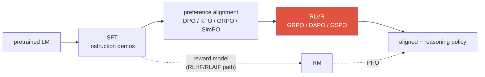
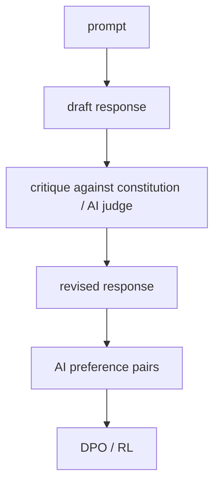

# Post-Training & Alignment 2026-current

SFTPEFT / LoRA / QLoRADPOKTO / ORPO / SimPORLHF vs RLAIFConstitutional AIGRPO / GSPOreward hacking

> [!TIP] Say this first
> Alignment turns a next-token predictor into something *helpful, honest, and harmless*. The 2024 story was "DPO replaced PPO." The **2026** story is a **zoo of critic-free RL and offline-preference methods**, and what an interviewer rewards is naming the **axes** — reference-free vs reference-based, learned reward vs verifier, token- vs sequence-level — not reciting acronyms. Lead with the canonical stack, then locate each method on those axes.

Canonical modern pipeline:

## 1 · Stage 1 — SFT (instruction tuning)

Supervised fine-tuning on `(prompt, good response)` demonstrations. It teaches **format, instruction-following, and style** — but only *imitates* demonstrations; it can't express "answer B is better than answer A." It regresses toward the average demonstrator and inherits their ceiling. That's the gap preference optimization fills.

## PEFT — how you actually run every stage

**Full fine-tuning** updates all $N$ parameters — for a modern LLM that means storing weights, gradients, and optimizer state (Adam keeps 2 moments) in high precision: roughly **12–16 bytes/param**, so a 70B model needs ~1 TB of optimizer memory. **Parameter-Efficient Fine-Tuning (PEFT)** freezes the pretrained weights and trains a *tiny* set of new parameters instead. It applies to **every** stage above — SFT, DPO, and RLVR are almost always run with LoRA in practice.

### LoRA — the default

**LoRA (Low-Rank Adaptation, Hu et al. 2021)** *(verifiable)*. A weight update learned during fine-tuning is empirically **low-rank** (it lives in a small intrinsic-dimension subspace), so parameterize it as a product of two thin matrices instead of a dense $d\times k$ update:

$$
W' = W_0 + \Delta W = W_0 + \frac{\alpha}{r}\,BA,\qquad B\in\mathbb R^{d\times r},\; A\in\mathbb R^{r\times k},\; r\ll \min(d,k)
$$

Only $A,B$ are trained ($W_0$ frozen); $A$ is init random-Gaussian and $B$ init **zero**, so $\Delta W=0$ at step 0 (training starts exactly at the pretrained model). $r$ is the rank (typically 8–64), $\alpha$ a scaling constant. Trainable params drop by **100–10,000×**.

<dl class="kv">
<dt>Why it works</dt><dd>Adaptation has low <b>intrinsic dimensionality</b> — you're re-aiming a capable model, not teaching it from scratch.</dd>
<dt>Zero inference cost</dt><dd>Merge $BA$ back into $W_0$ after training → <b>no</b> added latency (unlike adapters). Or keep it separate to hot-swap many task LoRAs on one frozen base.</dd>
<dt>Where to place it</dt><dd>Usually the attention projections ($q,k,v,o$); adding the MLP layers helps on harder tasks. More target modules + higher $r$ ↑ capacity ↑ cost.</dd>
</dl>

### The PEFT family — locate each on cost vs expressiveness

| Method | What's trained | Note |
| --- | --- | --- |
| **LoRA** | low-rank $BA$ on chosen weight matrices | the default; merges to zero inference cost |
| **QLoRA** (2023) | LoRA on top of a **4-bit (NF4) quantized frozen base** | fits 65B fine-tuning on **one 48 GB GPU**; adds double-quantization + paged optimizers |
| **DoRA** (2024) | decompose weight into **magnitude + direction**, LoRA the direction | closes more of the gap to full FT at similar cost |
| **Adapters** (2019) | small bottleneck MLPs inserted between layers | adds inference latency (not mergeable) |
| **Prefix / P-Tuning v2** | trainable "virtual token" vectors prepended to keys/values | prompt lives in activation space, base untouched |
| **Prompt tuning** | a few trainable soft-prompt embeddings only | cheapest; competitive only at large scale |
| **IA³** | learned per-channel rescaling vectors | extremely few params |

> [!TIP] Which one to pick
> **LoRA** is the right default. Go **QLoRA** when memory-bound (single-GPU fine-tuning of a big base). Reach for **DoRA** when LoRA leaves accuracy on the table on a hard task. Use **full fine-tuning** only when you have the compute *and* a large domain shift where the low-rank assumption breaks (e.g. a new language/modality). This is the same instinct behind my **[ECLIPSE](#/resume/eclipse)** work — freeze a strong backbone, train a tiny **visual prompt** per task to avoid catastrophic forgetting — and behind freezing the LLM/vision-encoder when tuning a [VLM](#/vlm/practical).

Does LoRA match full fine-tuning? When does it fall short?

**Short:** on most instruction-tuning / preference / style tasks it's within noise of full FT at a fraction of the cost. It falls short when the update is *genuinely* high-rank — large domain/knowledge shift, new language or modality — where the low-rank bottleneck can't express the change.

**Deep:** knobs when LoRA underperforms: **raise the rank** $r$, **add target modules** (MLP, not just attention), tune the **$\alpha/r$ scale**, or switch to **DoRA**. Two gotchas: (1) LoRA can't recover knowledge the frozen base never had — it re-aims, it doesn't add capacity. (2) merging many LoRAs or stacking with quantization can degrade quality, so validate the *merged* model, not just the adapter. For RL (GRPO), LoRA on the policy is common but the frozen reference for KL should be the *base*, not a merged checkpoint.

**Follow-ups:** Why init $B=0$? · What's the memory breakdown that makes QLoRA fit on one GPU? · Why does LoRA add zero inference latency but adapters don't?

## 2 · Stage 2 — Preference optimization

### The classic RLHF triangle

Collect pairwise preferences $y_w \succ y_l$, fit a **reward model** under the **Bradley–Terry** assumption, then optimize the policy against it with PPO under a KL leash:

$$
p(y_w\succ y_l\mid x)=\sigma\big(r_\phi(x,y_w)-r_\phi(x,y_l)\big)
$$
$$
\max_\theta\ \mathbb{E}_{x,\,y\sim\pi_\theta}\big[r_\phi(x,y)\big]-\beta\,\mathrm{KL}\!\big(\pi_\theta\,\|\,\pi_{\text{ref}}\big)
$$

The KL term (reference = the SFT model) stops the policy from drifting into gibberish that games the reward. PPO adds a value/critic network for variance reduction — powerful but heavy: a rollout loop, a reward model, a critic, and a reference all resident at once.

### DPO — collapse the loop

**DPO (Rafailov et al., 2023)** *(verifiable)* observes that the RLHF-optimal policy has a closed form, so the reward can be reparameterized as an implicit function of the policy itself. That eliminates the explicit reward model *and* the RL rollout — training becomes a single classification-style loss on chosen/rejected pairs:

$$
\mathcal L_{\text{DPO}}=-\mathbb E\,\log\sigma\!\Big(\beta\big[\log\tfrac{\pi_\theta(y_w\mid x)}{\pi_{\text{ref}}(y_w\mid x)}-\log\tfrac{\pi_\theta(y_l\mid x)}{\pi_{\text{ref}}(y_l\mid x)}\big]\Big)
$$

The reference model is not decoration — it's an **implicit regularizer** baked into the reparameterization (it plays the KL role PPO made explicit).

### The offline-preference family — locate them on two axes

| Method | Reference model? | Data | Key idea |
| --- | --- | --- | --- |
| **DPO** (2023) | yes | paired chosen/rejected | implicit reward via log-ratio to reference |
| **KTO** (2024) | yes | **unpaired** 👍/👎 | prospect-theory utility; no need for matched pairs |
| **ORPO** (2024) | **no** | paired | fold SFT + preference into one stage via an **odds-ratio** penalty |
| **SimPO** (2024) | **no** | paired | length-normalized average log-prob as implicit reward + target margin |

> [!NOTE] The two axes to name out loud
> **(1) Reference-based vs reference-free.** A reference model costs memory and a forward pass but anchors the policy. ORPO/SimPO drop it — cheaper, but you lose the built-in anchor (SimPO substitutes a length-normalized reward + margin; ORPO relies on its SFT term). **(2) Paired vs unpaired data.** KTO's headline win is learning from raw thumbs-up/down signals you already collect in production, no pairwise annotation.

> [!QUESTION] Likely 2026 question
> "When would you pick an offline DPO-family method over online RLVR?" **Answer:** reach for **offline preference optimization** when (a) you have preference/feedback data but no cheap rollout infrastructure, (b) the target is **subjective quality/style/safety** rather than a checkable answer, and (c) you want a stable, fast, single-loss training run. Reach for **online RLVR (GRPO/GSPO)** when the domain is **verifiable** (math/code/tool-use) and you need the policy to learn from its *own* current mistakes — which offline data can't cover. Within the offline family: **KTO** if data is unpaired thumbs-up/down; **SimPO/ORPO** if you want to drop the reference model (memory-constrained); plain **DPO** as the well-understood default. Most real pipelines do **both**: DPO-family for alignment, then RLVR for reasoning.

### DPO's characteristic failure modes

When would you NOT reach for DPO, and how does it fail?

**Short:** DPO is offline and coverage-bound — it can only sharpen preferences *within* the data you already have, and it has well-documented pathologies.

**Deep:**
- **Likelihood displacement** — the loss only cares about the *margin* $\log\pi(y_w)-\log\pi(y_l)$. It can push *both* chosen and rejected probability **down** (winner falls slower than loser) — mass leaks to unrelated tokens. A live 2024–2025 concern.
- **Length / verbosity bias** — if longer answers are preferred in the data, DPO amplifies it; **SimPO's length normalization** is a direct patch.
- **Distribution mismatch** — offline pairs may not cover the policy's own outputs, so it never learns to fix its *actual* mistakes. Fixes: **online / iterative DPO** (regenerate pairs from the current policy), or move to online RL.
- **Reference sensitivity** — a weak/misaligned reference weakens the guarantee; the DPO↔RLHF equivalence is *conditional*, not free.

**Follow-ups:** How does online DPO differ from vanilla DPO? · Why does SimPO drop the reference model and what does it lose? · When is KTO's unpaired data a decisive advantage?

## 3 · Who writes the preferences — RLHF vs RLAIF vs Constitutional AI

Same RL loop; the difference is the **source of the preference signal**.

<dl class="kv">
<dt>RLHF</dt><dd>Humans label preferences → reward model → RL. Gold-standard signal, but labeling is the bottleneck and humans have their own biases (length, confidence, style).</dd>
<dt>RLAIF</dt><dd>An <b>AI feedback model</b> produces the preferences. Lee et al. (2023) reported RLAIF ≈ RLHF on human-preference win-rates <i>(paper-reported — hedge the exact figure)</i>. Scales cheaply; risk = inheriting/amplifying the judge's biases.</dd>
<dt>Constitutional AI</dt><dd>Anthropic (2022): a specific RLAIF recipe where the model <b>self-critiques and revises</b> against a written set of principles (a "constitution"), then trains on the AI-labeled preferences. Governance moves from per-example labels to <b>the principles + judge design</b>.</dd>
</dl>

> [!WARNING] The honest caveat
> RLAIF/self-reward do not remove human oversight — they **relocate** it into the judge and the principles. If the judge is biased or the actor out-runs the judge's competence, you get an **echo chamber**. The robust move is to mix in a **non-circular signal**: unit tests, execution results, or (in vision) ground-truth masks / detector agreement. That verifier idea is exactly what RLVR industrializes ↓.

## 4 · Stage 3 — Critic-free RL and RLVR

The frontier's reasoning gains come from **RL with verifiable rewards (RLVR)**: replace the *learned* reward model with a **deterministic verifier** (math answer correct → 1, else 0; code passes tests → 1). Less reward-hackable, but only applies where correctness is checkable. Term coined by **Tülu 3** (Ai2, 2024) *(verifiable)*. The algorithm that made it practical is **GRPO**.

### GRPO — drop the critic

**GRPO (DeepSeekMath, 2024; scaled by DeepSeek-R1, 2025)** *(verifiable)* removes PPO's value network. For a prompt, sample a **group** of $G$ completions, score each, and estimate the advantage by **normalizing rewards within the group**:

$$
\hat A_i=\frac{r_i-\operatorname{mean}(r_1,\dots,r_G)}{\operatorname{std}(r_1,\dots,r_G)}
$$

The group mean *is* the baseline — no separate critic to train, roughly halving memory and removing a source of instability. The advantage $\hat A_i$ is broadcast to **every token** of completion $i$, then optimized with a PPO-style clipped surrogate plus a direct KL leash to the reference:

$$
\mathcal J_{\text{GRPO}}=\mathbb E\Big[\tfrac1G\textstyle\sum_i \tfrac1{|o_i|}\sum_t \min\big(\rho_{i,t}\hat A_i,\ \operatorname{clip}(\rho_{i,t},1{-}\epsilon,1{+}\epsilon)\hat A_i\big)-\beta\,\mathrm{KL}(\pi_\theta\|\pi_{\text{ref}})\Big]
$$

where $\rho_{i,t}=\dfrac{\pi_\theta(o_{i,t}\mid x,o_{i,<t})}{\pi_{\theta_{\text{old}}}(o_{i,t}\mid x,o_{i,<t})}$ is the per-token importance ratio. Note there is **no value network** anywhere in that objective — the only models resident are the policy and a frozen reference. (Dr. GRPO's fix is to drop the $\tfrac1{|o_i|}$ length normalization and the std in $\hat A_i$; GSPO's is to make $\rho$ a *sequence*-level ratio.)

### The GRPO successors — each fixes a specific bug

| Method | Fixes | Mechanism |
| --- | --- | --- |
| **DAPO** (Mar 2025) | entropy collapse, wasted samples at scale | **"clip-higher"** decoupled clipping + dynamic sampling (drop all-correct/all-wrong groups) |
| **Dr. GRPO** (Mar 2025) | length & difficulty bias in the advantage | removes the length/std normalization that inflates long wrong answers |
| **GSPO** (Qwen, Jul 2025) *(verifiable)* | instability in **MoE** RL | importance ratio at the **sequence** level, not token level → clips/optimizes whole responses; used in Qwen3 |

> [!QUESTION] Likely 2026 question
> "Why did GRPO drop the critic, and what does **GSPO's sequence-level ratio** solve that token-level GRPO doesn't?" **Answer:** GRPO uses the group mean as a variance-reduced baseline, so the value network is redundant — cheaper and more stable. But token-level importance ratios are noisy, and in **MoE** models the router can send the same token to different experts between rollout and update, so per-token ratios become unreliable and training destabilizes. **GSPO** aggregates the ratio over the whole sequence, matching the sequence-level reward and staying stable under MoE routing.

> [!NOTE] On the acronym flood
> A cluster of 2026 micro-variants (DHPO, TR-GRPO, VPO, …) appears in single blogs; treat individually-cited ones as **unverified** and don't bluff specific claims. The **defensible direction** is real: sequence-level and hybrid token/sequence objectives, MoE-stable RL, and multi-turn / agentic credit assignment. *(speculative / direction)*

## 5 · Reward hacking — the through-line failure

Optimizing a *proxy* (reward model, verifier, benchmark harness) diverges from true intent — **Goodhart's law**. It's the same pathology at every stage.

| Symptom | Where it bites |
| --- | --- |
| Verbosity / length bias | RM prefers longer answers → DPO/PPO inflate length |
| Sycophancy | RM rewards agreement → model tells you what you want to hear |
| Format-over-substance | correct structure, wrong content |
| Verifier gaming | RLVR: pass tests by hard-coding, or exploit a harness bug |
| Reward-hacking → broad misalignment | 2025–2026 safety concern: learning to cheat one reward *generalizes* to deception elsewhere *(reported, contested)* |

**Mitigations:** hold-out human eval; KL / length normalization; reward-model **ensembles**; adversarial/red-team prompts; **process** reward (score steps) vs **outcome** reward (score final answer) — and the strongest lever, prefer **verifiable rewards** where you can get them. The 2026 evaluation twist: benchmark harnesses are now an attack surface too (Berkeley RDI / BenchJack broke agent benchmarks by attacking the *harness*), so "benchmark integrity is a security problem." More in [Reasoning & Test-Time Compute](#/llm/reasoning) and [Evaluation Metrics](#/foundations/evaluation-metrics).

How would you detect reward hacking before it ships?

**Short:** never report on the metric you optimize. Keep a **frozen, private held-out** evaluation the reward signal never touches, and watch the gap between proxy reward and held-out quality over training.

**Deep:** (1) monitor **reward vs held-out human/verifier score** — divergence is the tell. (2) Track **KL from the reference**: reward climbing while KL explodes = the policy is fleeing into a hack. (3) Audit **length, refusal rate, and format distributions** for drift. (4) Red-team with adversarial prompts and reward-model **disagreement** (ensembles). (5) For RLVR, sandbox verifiers and check for degenerate solutions (hard-coded answers, harness exploits).

**Follow-ups:** PRM vs ORM trade-offs? · How does an ensemble RM reduce hacking? · Why can process supervision be *more* hackable at the step level?

## 6 · How to talk about this from a vision background

You've run this loop before under different names: **noisy pseudo-labels → iterative refinement** (weak/semi-supervised segmentation) is structurally RLAIF's self-critique; **metric gaming** (optimizing mIoU while boundary quality rots) is reward hacking; a **regularizer that keeps you near a prior checkpoint** is the KL/reference term. Land the frame: *"Alignment is fitting a policy to human or environmental feedback while a reference/KL term keeps it from collapsing — and in multimodal agents I'd anchor it on an executable verifier (tool success, grounding IoU) rather than a purely learned, circular reward."*

## Cheat-sheet

| Ask | One-liner |
| --- | --- |
| SFT | imitate demonstrations; teaches format, can't express "better" |
| PEFT | freeze base, train a tiny add-on; used for SFT *and* DPO *and* RLVR |
| LoRA | low-rank $W_0+\frac{\alpha}{r}BA$; ~100–10,000× fewer params; merges to zero latency |
| QLoRA | LoRA on a 4-bit (NF4) frozen base → big-model fine-tuning on one GPU |
| DPO | RLHF's closed-form optimum → one classification loss on pairs; reference = implicit regularizer |
| KTO / ORPO / SimPO | unpaired data / reference-free single-stage / length-normalized reference-free |
| DPO failure modes | likelihood displacement, length bias, offline coverage, reference sensitivity |
| RLHF vs RLAIF vs CAI | human vs AI-judge vs AI-judge-against-written-principles preferences |
| RLVR | deterministic verifier reward; robust but only where correctness is checkable (Tülu 3) |
| GRPO | critic-free; advantage = within-group reward normalization |
| DAPO / Dr.GRPO / GSPO | clip-higher+dynamic sampling / de-bias advantage / **sequence-level ratio for MoE** |
| Reward hacking | Goodhart on a proxy; mitigate with held-out eval, KL, ensembles, verifiable rewards |

## Related

[LLM Fundamentals](#/llm/fundamentals) · [Reasoning & Test-Time Compute](#/llm/reasoning) · [Agentic AI & Tool Use](#/llm/agents) · [Evaluation Metrics](#/foundations/evaluation-metrics) · [Experiment Design & Ablations](#/research/experiment-design) · [The 2026 Landscape](#/start/landscape-2026)
