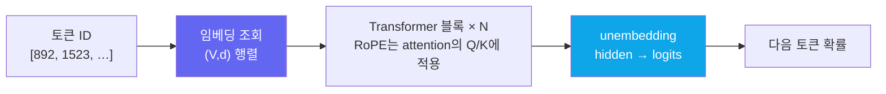
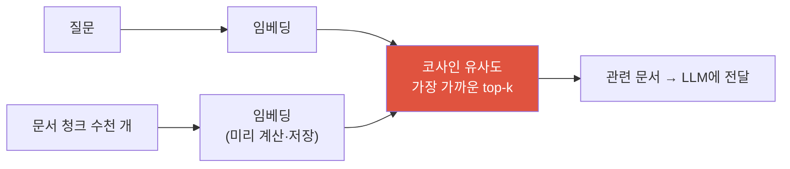

# 임베딩 (Embeddings)

lookup tablesemantic spacecosine similarityweight tying→ RAG

> [!NOTE] 이 챕터의 목표
> [토크나이제이션 & BPE](#/llm/tokenization)에서 텍스트가 token ID가 되는 걸 봤습니다. **입력 token embedding**은 이 ID를 학습 가능한 벡터로 바꾸는 lookup table입니다. 이 벡터는 Transformer의 출발점이지만, 문맥적 의미와 검색용 sentence embedding은 별도 층·목표에서 만들어집니다. 이 구분을 잡는 것이 [RAG](#/llm/rag)와 [VLM](#/vlm/vlm-101)의 선수 과목입니다.

## 무엇을 · 왜 — 기호 대신 숫자

컴퓨터는 "고양이"라는 글자를 직접 이해하지 못합니다. 그래서 먼저 토큰 ID(정수)로 바꾸죠. 하지만 정수 하나로는 부족합니다. 우리가 원하는 건 **"cat과 dog은 비슷하고, cat과 car는 다르다"** 는 관계인데, 정수 ID `892`, `1401`, `77` 사이에는 그런 관계가 전혀 없습니다.

**임베딩**은 token 하나를 숫자 여러 개로 표현합니다. 예를 들어 `cat` → `[0.8, -0.2, 0.5, …]`. 학습된 공간에 통계적·의미적 구조가 생길 수 있지만, 현대 LLM의 context-free subword 입력 embedding만으로 동의어 유사도를 안정적으로 재는 것은 아닙니다. 문맥적 hidden state나 retrieval 전용 encoder가 의미 비교에 더 적합합니다.

핵심 한 문장

입력 임베딩 = **"이산적인 token ID를 연속 벡터로 옮기는 학습된 조회표"**. 가까움이 어떤 의미를 갖는지는 학습 objective와 어느 layer의 표현인지에 달려 있습니다.

## 조회표: 토큰 ID → 행 벡터

임베딩의 실체는 **거대한 행렬** 하나입니다. 어휘(vocabulary)에 토큰이 $V$개(예: 5만 개), 벡터 차원이 $d$(예: 4096)라면, 크기 `(V, d)` 행렬을 만듭니다. **각 행이 한 토큰의 벡터**입니다.

토큰 ID로 무언가를 계산하는 게 아니라, 그냥 **그 번호의 행을 꺼내오는 것(lookup)** 이 전부입니다. ID `1523` → 1523번째 행. 그래서 "embedding **lookup** table"이라고 부릅니다.

<figure>
<svg viewBox="0 0 640 260" xmlns="http://www.w3.org/2000/svg" font-family="Inter, sans-serif" font-size="12">
  <text x="90" y="20" text-anchor="middle" fill="#98a3b2">임베딩 조회표 (V × d)</text>
  <rect x="30" y="30" width="120" height="160" rx="6" fill="none" stroke="#6366f1" stroke-width="1.5"/>
  <line x1="30" y1="62" x2="150" y2="62" stroke="#6366f1" opacity="0.4"/>
  <line x1="30" y1="94" x2="150" y2="94" stroke="#6366f1" opacity="0.4"/>
  <line x1="30" y1="126" x2="150" y2="126" stroke="#6366f1" opacity="0.4"/>
  <line x1="30" y1="158" x2="150" y2="158" stroke="#6366f1" opacity="0.4"/>
  <rect x="30" y="94" width="120" height="32" fill="#e0533f" opacity="0.22"/>
  <text x="90" y="114" text-anchor="middle" fill="#e0533f" font-size="10.5">ID 1523 → [0.2, -1.1, …]</text>
  <text x="40" y="52" fill="#98a3b2" font-size="10">ID 0</text>
  <text x="40" y="84" fill="#98a3b2" font-size="10">ID 1</text>
  <text x="40" y="184" fill="#98a3b2" font-size="10">ID V-1</text>
  <path d="M155 110 H214" stroke="#98a3b2" stroke-width="1.5" marker-end="url(#a)"/>
  <text x="185" y="103" text-anchor="middle" fill="#98a3b2" font-size="10">조회</text>
  <text x="440" y="20" text-anchor="middle" fill="#98a3b2">임베딩 공간 (위치 = 의미)</text>
  <rect x="240" y="30" width="380" height="200" rx="6" fill="none" stroke="#98a3b2" stroke-width="1" opacity="0.4"/>
  <circle cx="330" cy="95" r="5" fill="#0ea5e9"/><text x="340" y="99" fill="currentColor">cat</text>
  <circle cx="352" cy="118" r="5" fill="#0ea5e9"/><text x="362" y="122" fill="currentColor">dog</text>
  <circle cx="312" cy="126" r="5" fill="#0ea5e9"/><text x="304" y="130" fill="currentColor" text-anchor="end">kitten</text>
  <circle cx="522" cy="185" r="5" fill="#12a150"/><text x="532" y="189" fill="currentColor">car</text>
  <circle cx="546" cy="163" r="5" fill="#12a150"/><text x="556" y="167" fill="currentColor">truck</text>
  <ellipse cx="331" cy="113" rx="48" ry="38" fill="none" stroke="#0ea5e9" stroke-dasharray="3 3" opacity="0.6"/>
  <ellipse cx="534" cy="174" rx="36" ry="30" fill="none" stroke="#12a150" stroke-dasharray="3 3" opacity="0.6"/>
  <text x="331" y="168" text-anchor="middle" fill="#0ea5e9" font-size="10">동물</text>
  <text x="534" y="218" text-anchor="middle" fill="#12a150" font-size="10">탈것</text>
  <defs><marker id="a" markerWidth="8" markerHeight="8" refX="6" refY="3" orient="auto"><path d="M0 0 L6 3 L0 6" fill="#98a3b2"/></marker></defs>
</svg>
<figcaption>왼쪽: 토큰 ID로 조회표의 한 행(벡터)을 꺼냅니다 — 계산이 아니라 색인(index)일 뿐입니다. 오른쪽: 학습된 임베딩 공간에서는 비슷한 의미가 가까이 모입니다(동물끼리, 탈것끼리). 실제로는 수백~수천 차원이지만 개념은 이 2D 그림과 같습니다.</figcaption>
</figure>

> [!NOTE] "학습된"이 왜 중요한가
> 이 조회표는 손으로 채우는 게 아니라 **모델의 파라미터**입니다. 처음엔 무작위 숫자로 시작하지만, 학습이 진행되며 [다음 토큰 예측](#/llm/next-token) 손실을 줄이는 방향으로 backprop이 이 행렬도 함께 갱신합니다. "비슷한 문맥에 나오는 단어는 비슷한 벡터를 갖는 게 예측에 유리하다"는 압력 때문에, 의미가 가까운 토큰이 저절로 모입니다. (언어학에서 **분포 가설**: 문맥이 비슷하면 의미도 비슷하다.)

## 고전적 word embedding의 방향 — 범위를 구분하자

고전적 **word2vec 같은 단어 단위 static embedding**에서는 방향이 관계를 근사하기도 합니다. 가장 유명한 예가 다음 유추입니다:

$$
\text{vec}(\text{king}) - \text{vec}(\text{man}) + \text{vec}(\text{woman}) \;\approx\; \text{vec}(\text{queen})
$$

이는 word2vec에서 대중화된 근사 관찰입니다. 모든 단어·언어에 성립하지 않고 사회적 bias도 반영하며, 현대 LLM의 subword 입력 embedding에 그대로 기대할 성질도 아닙니다. 아래 그림은 고전적 static embedding의 직관으로만 읽으세요.

<figure>
<svg viewBox="0 0 560 300" xmlns="http://www.w3.org/2000/svg" font-family="Inter, sans-serif" font-size="13">
  <line x1="45" y1="270" x2="530" y2="270" stroke="#98a3b2" stroke-width="1.2" opacity="0.6"/>
  <line x1="45" y1="30" x2="45" y2="270" stroke="#98a3b2" stroke-width="1.2" opacity="0.6"/>
  <text x="520" y="288" text-anchor="end" fill="#98a3b2" font-size="11">의미 축 (예시)</text>
  <!-- male row (bottom) -->
  <circle cx="140" cy="215" r="6" fill="#0ea5e9"/><text x="140" y="238" text-anchor="middle" fill="currentColor">man</text>
  <circle cx="360" cy="215" r="6" fill="#12a150"/><text x="360" y="238" text-anchor="middle" fill="currentColor">king</text>
  <!-- female row (top) -->
  <circle cx="240" cy="95" r="6" fill="#0ea5e9"/><text x="240" y="85" text-anchor="middle" fill="currentColor">woman</text>
  <circle cx="460" cy="95" r="6" fill="#12a150"/><text x="460" y="85" text-anchor="middle" fill="currentColor">queen</text>
  <!-- gender arrows (parallel) -->
  <line x1="148" y1="209" x2="232" y2="101" stroke="#e0533f" stroke-width="2.2" marker-end="url(#g)"/>
  <line x1="368" y1="209" x2="452" y2="101" stroke="#e0533f" stroke-width="2.2" stroke-dasharray="5 4" marker-end="url(#g)"/>
  <text x="176" y="150" fill="#e0533f" font-size="11" transform="rotate(-52 176 150)">+ 여성 방향</text>
  <text x="398" y="150" fill="#e0533f" font-size="11" transform="rotate(-52 398 150)">+ 여성 방향</text>
  <!-- royalty arrows (parallel, horizontal-ish) -->
  <line x1="150" y1="215" x2="352" y2="215" stroke="#6366f1" stroke-width="1.6" stroke-dasharray="2 4" opacity="0.7" marker-end="url(#r)"/>
  <text x="250" y="207" text-anchor="middle" fill="#6366f1" font-size="10.5">+ 왕족 방향</text>
  <text x="280" y="30" text-anchor="middle" fill="#98a3b2" font-size="11">king − man + woman ≈ queen  (두 빨강 화살표가 평행)</text>
  <defs>
    <marker id="g" markerWidth="9" markerHeight="9" refX="7" refY="4" orient="auto"><path d="M0 0 L7 4 L0 8" fill="#e0533f"/></marker>
    <marker id="r" markerWidth="9" markerHeight="9" refX="7" refY="4" orient="auto"><path d="M0 0 L7 4 L0 8" fill="#6366f1"/></marker>
  </defs>
</svg>
<figcaption>word2vec 계열 static word embedding에서 보고된 근사적 analogy 직관입니다. 현대 subword LLM 입력 embedding의 보편 법칙은 아니며 bias와 예외가 많습니다.</figcaption>
</figure>

## 유사성은 코사인으로 잰다

두 벡터가 "얼마나 같은 방향인가"는 **코사인 유사도(cosine similarity)** 로 잽니다. 벡터의 **크기(길이)는 무시하고 방향만** 봅니다:

$$
\cos(\mathbf{a},\mathbf{b}) = \frac{\mathbf{a}\cdot\mathbf{b}}{\|\mathbf{a}\|\,\|\mathbf{b}\|} \in [-1, 1]
$$

- **1에 가까움** → 거의 같은 방향(비슷한 의미)
- **0** → 직각, 무관
- **−1** → 기하학적으로 정반대 방향(semantic antonym이라는 뜻은 아님)

왜 거리(예: 유클리드 거리)가 아니라 방향일까요? 단어의 "중요도"나 등장 빈도 때문에 벡터 길이가 들쭉날쭉할 수 있는데, 우리가 원하는 건 **의미의 방향**이지 크기가 아니기 때문입니다. 코사인은 길이로 나눠(정규화) 그 영향을 지웁니다. 분자의 내적(dot product)이 기본이라는 점은 [선형대수 & 미적분](#/foundations/linear-algebra-calculus)과 이어집니다.

> [!TIP] 면접 한 줄
> "입력 token embedding은 ID를 벡터로 바꾸는 학습 가능한 조회표이고, Transformer hidden state가 문맥적 표현을 만든다. 검색 embedding은 별도 objective로 학습한다." 유사도는 모델이 학습된 convention에 따라 cosine, dot product, L2 중 하나를 사용합니다.

## 직접 돌려보기 — 코사인 유사도

두 벡터의 코사인 유사도를 NumPy로 구현해 봅시다. 아래 **라이브 에디터**에서 채워 넣고 **▶ Run tests**를 누르면 실제로 채점됩니다. `[1,0]`과 `[1,0]`은 1.0(같은 방향), `[1,0]`과 `[0,1]`은 0.0(직각), `[1,0]`과 `[-1,0]`은 −1.0(정반대)이 나와야 합니다. (막히면 **Solution**을 여세요. 첫 실행은 파이썬 런타임을 받느라 잠깐 걸립니다.)

`[1,1]`과 `[2,2]`가 1.0인 데 주목하세요 — 방향이 같으면 길이가 두 배여도 코사인은 1입니다. 이게 "크기를 무시한다"는 뜻입니다.

## LLM 안에서의 토큰 임베딩

LLM에서 임베딩은 파이프라인의 **맨 앞**에 있습니다. 흐름을 한 줄로 보면:

<dl class="kv">
<dt>입력 임베딩</dt><dd>token ID로 <code>(V,d)</code> 행렬의 행을 꺼냅니다. learned absolute position은 더할 수 있지만, <b>RoPE는 embedding에 더하지 않고 attention의 Q/K를 회전</b>시킵니다([Positional Encoding & RoPE](#/ml-coding/positional-encoding-rope)).</dd>
<dt>출력(unembedding)</dt><dd>Transformer를 통과한 마지막 hidden 벡터 <code>(d,)</code>를 다시 어휘 크기 <code>(V,)</code> logit으로 되돌려, softmax로 다음 토큰 확률을 냅니다.</dd>
<dt>weight tying(가중치 묶기)</dt><dd>입력 임베딩 행렬 <code>(V,d)</code>를 <b>전치</b>해 출력 unembedding으로 <b>재사용</b>하는 기법. 파라미터를 크게 아끼고(어휘가 크면 이 행렬이 무겁습니다) 성능도 대체로 좋아집니다.</dd>
</dl>

> [!NOTE] 임베딩 ≠ 최종 표현
> 입력 임베딩은 문맥을 모르는 "사전(dictionary) 뜻"에 가깝습니다. "bank"는 강둑이든 은행이든 처음엔 같은 벡터죠. 문맥에 따라 뜻이 갈라지는 **문맥적(contextual) 표현**은 Transformer 블록들을 지나며 attention이 만들어 냅니다. 즉 임베딩은 출발점이고, 의미의 정교화는 그 위에서 일어납니다.

## 문장·문서 임베딩 → 검색(RAG)으로 가는 다리

지금까지는 토큰 하나당 벡터였습니다. 그런데 "이 **문장/문서**가 저 질문과 비슷한가?"를 묻고 싶을 때가 있습니다 — 검색이 그렇죠. 그래서 **문장 전체를 벡터 하나로** 요약합니다(sentence/document embedding).

만드는 방법: encoder가 만든 **contextual hidden state**를 mean pool하거나, 모델이 정의한 special-token 표현을 쓰거나, sentence embedding 전용 모델을 씁니다. raw input embedding 평균과 `[CLS]` 사용은 보편 recipe가 아닙니다. 모델 카드의 pooling·normalization·query/document prefix를 따라야 합니다.

이렇게 하면 검색이 **벡터 최근접 이웃 찾기**가 됩니다:

질문과 문서 embedding을 같은 retrieval convention으로 비교해 top-k를 고르는 것이 [RAG](#/llm/rag)의 dense retrieval입니다. metric은 embedding 모델에 맞춰 cosine·dot product·L2를 사용합니다.

## Q&A

임베딩은 처음엔 무작위일 텐데 어떻게 "의미"를 갖게 되나요?

**짧게:** 무작위로 시작하지만, 다음 토큰 예측 손실을 줄이는 학습 과정에서 backprop이 임베딩 행렬을 함께 갱신하면서 의미가 생깁니다.

**깊게:** 임베딩 조회표도 모델 파라미터입니다. "the cat sat on the ___"를 잘 예측하려면, 비슷한 문맥에 등장하는 단어들(cat, dog, kitten…)의 벡터가 서로 비슷해야 유리합니다. 학습이 이 압력을 계속 가하므로, 의미가 가까운 토큰이 자연스럽게 모입니다(분포 가설). 예전에는 word2vec/GloVe로 임베딩만 따로 미리 학습하기도 했지만, 현대 LLM은 보통 모델 전체와 함께 처음부터 학습합니다. 학습 원리는 [다음 토큰 예측](#/llm/next-token) 참고.

토큰 임베딩과 문장 임베딩은 다른 건가요?

**짧게:** 네. 토큰 임베딩은 토큰 하나당 벡터, 문장 임베딩은 문장 전체를 요약한 벡터 한 개입니다.

**깊게:** RAG 검색에는 "문서 청크 하나 = 벡터 하나"가 필요하므로, 토큰 벡터들을 평균 내거나 `[CLS]` 표현을 쓰거나 문장 임베딩 전용 모델로 만듭니다. 또한 LLM 내부의 입력 토큰 임베딩(문맥 이전)과, 문장 임베딩 모델이 내놓는 표현은 목적이 다릅니다 — 후자는 "의미 유사성"에 최적화되도록 대조 학습으로 별도 훈련됩니다.

차원 d는 클수록 좋나요?

**짧게:** 어느 지점까지는 표현력이 늘지만, 무작정 키우면 메모리·연산·과적합 비용만 커집니다.

**깊게:** $d$가 크면 더 많은 의미 축을 담을 수 있지만, 어휘 행렬 `(V,d)`가 무거워지고(그래서 weight tying이 중요) 검색 시 벡터 저장·비교 비용도 커집니다. 문장 임베딩은 흔히 384~1024차원을 쓰고, LLM 내부 hidden 차원은 수천에 이릅니다. "표현력 ↔ 비용"의 트레이드오프이며, 정답은 태스크와 데이터 규모에 달려 있습니다.

## Cheat-sheet

| 개념 | 한 줄 |
| --- | --- |
| 임베딩 | 토큰 ID → 학습된 벡터 (조회표 `(V, d)`의 한 행) |
| 왜 벡터인가 | 정수 ID엔 의미가 없음; 벡터는 의미를 거리·방향으로 표현 |
| 의미의 방향 | `king − man + woman ≈ queen` — 같은 의미 변화 = 같은 방향 이동 |
| 코사인 유사도 | 크기 무시·방향 비교, $\frac{a\cdot b}{\|a\|\|b\|}\in[-1,1]$ |
| 입력·출력 임베딩 | 입력 = ID→벡터, 출력(unembedding) = hidden→logits |
| weight tying | 입력·출력 임베딩 행렬 공유 → 파라미터 절약 |
| 문장 임베딩 | 문장→벡터 1개; 코사인 최근접 검색 = RAG의 기반 |

**다음:** [RAG](#/llm/rag) · [다음 토큰 예측](#/llm/next-token) · [토크나이제이션 & BPE](#/llm/tokenization) · [Positional Encoding & RoPE](#/ml-coding/positional-encoding-rope)
