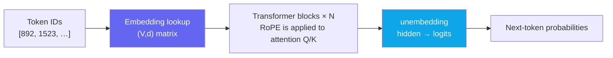
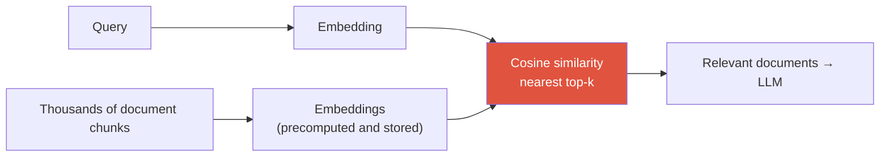

# Embeddings

lookup tablesemantic spacecosine similarityweight tying→ RAG

> [!NOTE] Goal of this chapter
> In [Tokenization & BPE](#/llm/tokenization), we saw how text becomes token IDs. An **input token embedding** is a lookup table that turns those IDs into trainable vectors. These vectors are the Transformer's starting point, but contextual meaning and retrieval-oriented sentence embeddings arise from separate layers and objectives. Understanding this distinction is a prerequisite for [RAG](#/llm/rag) and [VLMs](#/vlm/vlm-101).

## What and why — numbers instead of symbols

A computer does not directly understand the written word "cat." We first convert it into an integer token ID, but an integer alone is not enough. We want to represent relationships such as **"cat and dog are similar, while cat and car are different."** IDs such as `892`, `1401`, and `77` contain no such relationship.

An **embedding** represents one token with several numbers: for example, `cat` → `[0.8, -0.2, 0.5, …]`. Statistical and semantic structure can emerge in the learned space, but a modern LLM's context-free subword input embeddings are not necessarily a reliable synonym metric. Contextual hidden states or retrieval-specific encoders are usually more appropriate for semantic comparison.

The central idea

An input embedding is **"a learned lookup table that maps discrete token IDs to continuous vectors."** What proximity means depends on the training objective and on which layer's representation you inspect.

## Lookup table: token ID → row vector

An embedding is simply **one large matrix**. If the vocabulary contains $V$ tokens—for example, 50,000—and the vector dimension is $d$—for example, 4096—we create a matrix of shape `(V, d)`. **Each row is one token's vector.**

Nothing is computed from the token ID itself. The model simply **looks up the row with that index**: ID `1523` retrieves row 1523. That is why it is called an embedding **lookup** table.

<figure>
<svg viewBox="0 0 640 260" xmlns="http://www.w3.org/2000/svg" font-family="Inter, sans-serif" font-size="12">
  <text x="90" y="20" text-anchor="middle" fill="#98a3b2">Embedding lookup table (V × d)</text>
  <rect x="30" y="30" width="120" height="160" rx="6" fill="none" stroke="#6366f1" stroke-width="1.5"/>
  <line x1="30" y1="62" x2="150" y2="62" stroke="#6366f1" opacity="0.4"/>
  <line x1="30" y1="94" x2="150" y2="94" stroke="#6366f1" opacity="0.4"/>
  <line x1="30" y1="126" x2="150" y2="126" stroke="#6366f1" opacity="0.4"/>
  <line x1="30" y1="158" x2="150" y2="158" stroke="#6366f1" opacity="0.4"/>
  <rect x="30" y="94" width="120" height="32" fill="#e0533f" opacity="0.22"/>
  <text x="90" y="114" text-anchor="middle" fill="#e0533f" font-size="10.5">ID 1523 → [0.2, -1.1, …]</text>
  <text x="40" y="52" fill="#98a3b2" font-size="10">ID 0</text>
  <text x="40" y="84" fill="#98a3b2" font-size="10">ID 1</text>
  <text x="40" y="184" fill="#98a3b2" font-size="10">ID V-1</text>
  <path d="M155 110 H214" stroke="#98a3b2" stroke-width="1.5" marker-end="url(#a)"/>
  <text x="185" y="103" text-anchor="middle" fill="#98a3b2" font-size="10">lookup</text>
  <text x="440" y="20" text-anchor="middle" fill="#98a3b2">Embedding space (position = meaning)</text>
  <rect x="240" y="30" width="380" height="200" rx="6" fill="none" stroke="#98a3b2" stroke-width="1" opacity="0.4"/>
  <circle cx="330" cy="95" r="5" fill="#0ea5e9"/><text x="340" y="99" fill="currentColor">cat</text>
  <circle cx="352" cy="118" r="5" fill="#0ea5e9"/><text x="362" y="122" fill="currentColor">dog</text>
  <circle cx="312" cy="126" r="5" fill="#0ea5e9"/><text x="304" y="130" fill="currentColor" text-anchor="end">kitten</text>
  <circle cx="522" cy="185" r="5" fill="#12a150"/><text x="532" y="189" fill="currentColor">car</text>
  <circle cx="546" cy="163" r="5" fill="#12a150"/><text x="556" y="167" fill="currentColor">truck</text>
  <ellipse cx="331" cy="113" rx="48" ry="38" fill="none" stroke="#0ea5e9" stroke-dasharray="3 3" opacity="0.6"/>
  <ellipse cx="534" cy="174" rx="36" ry="30" fill="none" stroke="#12a150" stroke-dasharray="3 3" opacity="0.6"/>
  <text x="331" y="168" text-anchor="middle" fill="#0ea5e9" font-size="10">animals</text>
  <text x="534" y="218" text-anchor="middle" fill="#12a150" font-size="10">vehicles</text>
  <defs><marker id="a" markerWidth="8" markerHeight="8" refX="6" refY="3" orient="auto"><path d="M0 0 L6 3 L0 6" fill="#98a3b2"/></marker></defs>
</svg>
<figcaption>Left: a token ID retrieves one row—a vector—from the lookup table. This is indexing, not a computation over the ID. Right: in a learned embedding space, related meanings can cluster together, such as animals with animals and vehicles with vehicles. Real spaces have hundreds or thousands of dimensions, but the idea is the same as in this 2D sketch.</figcaption>
</figure>

> [!NOTE] Why "learned" matters
> This lookup table is not filled by hand; it is a **model parameter**. It begins with random values, then backpropagation updates the matrix along with the rest of the model to reduce the [next-token prediction](#/llm/next-token) loss. Tokens that occur in similar contexts benefit prediction by having similar vectors, which creates pressure for semantically related tokens to cluster. In linguistics, this is the **distributional hypothesis**: similar contexts imply similar meanings.

## Directions in classical word embeddings — keep the scope clear

In classical **word-level static embeddings** such as word2vec, directions can approximate relationships. The most famous analogy is:

$$
\text{vec}(\text{king}) - \text{vec}(\text{man}) + \text{vec}(\text{woman}) \;\approx\; \text{vec}(\text{queen})
$$

This is an approximate observation popularized by word2vec. It does not hold for every word or language, it reflects social biases, and it is not a property to assume of a modern LLM's subword input embeddings. Read the following diagram only as an intuition for classical static embeddings.

<figure>
<svg viewBox="0 0 560 300" xmlns="http://www.w3.org/2000/svg" font-family="Inter, sans-serif" font-size="13">
  <line x1="45" y1="270" x2="530" y2="270" stroke="#98a3b2" stroke-width="1.2" opacity="0.6"/>
  <line x1="45" y1="30" x2="45" y2="270" stroke="#98a3b2" stroke-width="1.2" opacity="0.6"/>
  <text x="520" y="288" text-anchor="end" fill="#98a3b2" font-size="11">semantic axis (illustrative)</text>
  <!-- male row (bottom) -->
  <circle cx="140" cy="215" r="6" fill="#0ea5e9"/><text x="140" y="238" text-anchor="middle" fill="currentColor">man</text>
  <circle cx="360" cy="215" r="6" fill="#12a150"/><text x="360" y="238" text-anchor="middle" fill="currentColor">king</text>
  <!-- female row (top) -->
  <circle cx="240" cy="95" r="6" fill="#0ea5e9"/><text x="240" y="85" text-anchor="middle" fill="currentColor">woman</text>
  <circle cx="460" cy="95" r="6" fill="#12a150"/><text x="460" y="85" text-anchor="middle" fill="currentColor">queen</text>
  <!-- gender arrows (parallel) -->
  <line x1="148" y1="209" x2="232" y2="101" stroke="#e0533f" stroke-width="2.2" marker-end="url(#g)"/>
  <line x1="368" y1="209" x2="452" y2="101" stroke="#e0533f" stroke-width="2.2" stroke-dasharray="5 4" marker-end="url(#g)"/>
  <text x="176" y="150" fill="#e0533f" font-size="11" transform="rotate(-52 176 150)">+ female direction</text>
  <text x="398" y="150" fill="#e0533f" font-size="11" transform="rotate(-52 398 150)">+ female direction</text>
  <!-- royalty arrows (parallel, horizontal-ish) -->
  <line x1="150" y1="215" x2="352" y2="215" stroke="#6366f1" stroke-width="1.6" stroke-dasharray="2 4" opacity="0.7" marker-end="url(#r)"/>
  <text x="250" y="207" text-anchor="middle" fill="#6366f1" font-size="10.5">+ royalty direction</text>
  <text x="280" y="30" text-anchor="middle" fill="#98a3b2" font-size="11">king − man + woman ≈ queen (the red arrows are parallel)</text>
  <defs>
    <marker id="g" markerWidth="9" markerHeight="9" refX="7" refY="4" orient="auto"><path d="M0 0 L7 4 L0 8" fill="#e0533f"/></marker>
    <marker id="r" markerWidth="9" markerHeight="9" refX="7" refY="4" orient="auto"><path d="M0 0 L7 4 L0 8" fill="#6366f1"/></marker>
  </defs>
</svg>
<figcaption>This is the approximate analogy intuition reported for word2vec-style static word embeddings. It is not a universal law of modern subword LLM input embeddings, and it has many exceptions and biases.</figcaption>
</figure>

## Measure similarity with cosine

**Cosine similarity** measures how closely two vectors point in the same direction. It ignores vector **magnitude** and compares direction only:

$$
\cos(\mathbf{a},\mathbf{b}) = \frac{\mathbf{a}\cdot\mathbf{b}}{\|\mathbf{a}\|\,\|\mathbf{b}\|} \in [-1, 1]
$$

- **Near 1** → almost the same direction, often similar meaning under the model's convention
- **0** → orthogonal
- **−1** → geometrically opposite directions, not necessarily semantic antonyms

Why use direction instead of a distance such as Euclidean distance? Vector lengths can vary because of factors such as token frequency or salience, while the desired signal may be semantic direction rather than magnitude. Cosine divides by the lengths—normalizes them—to remove that influence. Its numerator is a dot product, connecting directly to [Linear Algebra & Calculus](#/foundations/linear-algebra-calculus).

> [!TIP] Interview one-liner
> "An input token embedding is a learned lookup table from IDs to vectors; Transformer hidden states create contextual representations; retrieval embeddings are trained with a separate objective." Use cosine, dot product, or L2 according to the convention under which the embedding model was trained.

## Try it yourself — cosine similarity

Implement cosine similarity between two vectors with NumPy. Fill in the **live editor** and select **▶ Run tests**. `[1,0]` with `[1,0]` should return 1.0—the same direction; `[1,0]` with `[0,1]` should return 0.0—orthogonal; and `[1,0]` with `[-1,0]` should return −1.0—the opposite direction. Open **Solution** if you get stuck. The first run can take a moment while the Python runtime downloads.

Notice that `[1,1]` and `[2,2]` have similarity 1.0. Doubling the length does not change the cosine when the direction stays the same. That is what it means to ignore magnitude.

## Token embeddings inside an LLM

Embeddings sit at the **very beginning** of the LLM pipeline. In one line:

<dl class="kv">
<dt>Input embedding</dt><dd>Use a token ID to retrieve one row of the <code>(V,d)</code> matrix. A learned absolute position can be added, but <b>RoPE is not added to the embedding; it rotates Q/K inside attention</b> ([Positional Encoding & RoPE](#/ml-coding/positional-encoding-rope)).</dd>
<dt>Output, or unembedding</dt><dd>Map the final hidden vector <code>(d,)</code> after the Transformer back to vocabulary-sized logits <code>(V,)</code>, then use softmax to produce next-token probabilities.</dd>
<dt>Weight tying</dt><dd><b>Transpose and reuse</b> the input embedding matrix <code>(V,d)</code> as the output unembedding. This saves many parameters—the matrix is large when the vocabulary is large—and often improves performance.</dd>
</dl>

> [!NOTE] Embedding ≠ final representation
> An input embedding resembles a context-free dictionary entry. "Bank" starts from the same vector whether it means a riverbank or a financial institution. Attention creates the **contextual representation** that separates those meanings as the token passes through Transformer blocks. The embedding is only the starting point; semantic refinement happens above it.

## Sentence and document embeddings — the bridge to retrieval and RAG

So far, we have had one vector per token. Retrieval instead asks, "How similar is this **sentence or document** to that query?" We therefore summarize an entire sentence or document as **one vector**—a sentence or document embedding.

Possible methods include mean-pooling the encoder's **contextual hidden states**, using a model-defined special-token representation, or using a dedicated sentence-embedding model. Averaging raw input embeddings or always taking `[CLS]` is not a universal recipe. Follow the model card's pooling, normalization, and query/document prefix convention.

Retrieval then becomes **nearest-neighbor search over vectors**:

Comparing query and document embeddings under the same retrieval convention and selecting top-k is the dense-retrieval step of [RAG](#/llm/rag). Use cosine, dot product, or L2 according to the embedding model.

## Q&A

Embeddings start random. How do they acquire meaning?

**Short:** They begin randomly, but backpropagation updates the embedding matrix together with the model to reduce next-token prediction loss, allowing structure to emerge.

**Deep:** The embedding table is a model parameter. To predict "the cat sat on the ___," it is useful for words that appear in similar contexts—cat, dog, kitten, and so on—to have similar vectors. Training repeatedly applies this pressure, so semantically related tokens naturally cluster under the distributional hypothesis. Earlier systems pretrained embeddings separately with word2vec or GloVe; modern LLMs usually learn them jointly with the whole model from the beginning. See [Next-Token Prediction](#/llm/next-token) for the training objective.

Are token embeddings and sentence embeddings different?

**Short:** Yes. A token embedding is one vector per token; a sentence embedding is one vector that summarizes an entire sentence.

**Deep:** RAG retrieval needs one vector per document chunk, so a model may pool contextual token vectors, use a designated special-token representation, or use a dedicated sentence-embedding encoder. An LLM's input token embeddings—before context—and the output of a sentence-embedding model serve different purposes. The latter is trained separately, often contrastively, to optimize semantic similarity.

Is a larger dimension d always better?

**Short:** It increases capacity up to a point, but making it arbitrarily large only increases memory, compute, and overfitting costs.

**Deep:** A larger $d$ can encode more axes of variation, but it also makes the vocabulary matrix `(V,d)` heavier—which is why weight tying matters—and increases storage and comparison cost for retrieval vectors. Sentence embeddings often use roughly 384–1024 dimensions, while internal LLM hidden sizes are in the thousands. This is a capacity-versus-cost trade-off whose answer depends on the task and data scale.

## Cheat-sheet

| Concept | One line |
| --- | --- |
| Embedding | Token ID → learned vector, one row of lookup table `(V, d)` |
| Why a vector? | Integer IDs contain no meaning; vectors can represent relations through distance and direction |
| Semantic direction | `king − man + woman ≈ queen`: the same semantic change can correspond to a similar direction in classical static embeddings |
| Cosine similarity | Ignore magnitude and compare direction: $\frac{a\cdot b}{\|a\|\|b\|}\in[-1,1]$ |
| Input/output embedding | Input maps ID→vector; output, or unembedding, maps hidden→logits |
| Weight tying | Share input and output embedding weights to save parameters |
| Sentence embedding | Sentence→one vector; cosine nearest-neighbor search underpins dense RAG retrieval |

**Next:** [RAG](#/llm/rag) · [Next-Token Prediction](#/llm/next-token) · [Tokenization & BPE](#/llm/tokenization) · [Positional Encoding & RoPE](#/ml-coding/positional-encoding-rope)
