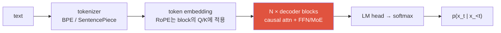
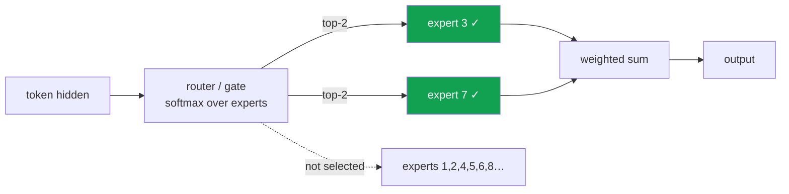

# LLM Fundamentals

<div class="tag-row"><span class="tag">decoder-only</span><span class="tag">scaling laws</span><span class="tag">RoPE</span><span class="tag">KV cache</span><span class="tag">MoE</span></div>

> [!NOTE] 이 챕터의 목표
> 앞선 온램프에서 [토큰](#/llm/tokenization) · [임베딩](#/llm/embeddings) · [다음 토큰 예측](#/llm/next-token) · [디코딩/샘플링](#/llm/decoding-sampling)을 잡았습니다. 이제 그 조각들이 **하나의 모델**로 어떻게 합쳐지는지 봅니다. long context, 저렴한 inference(추론), MoE 같은 심화 주제는 전부 **하나의 학습 목표**가 **데이터**와 **serving(서빙) 비용**이라는 두 제약과 만나 생긴 결과입니다 — 이 인과 사슬을 따라가는 게 이 챕터의 목표입니다.

## 무엇을, 왜

이 챕터가 다루는 주류 생성형 LLM은 **방대한 토큰으로 자기회귀 사전학습한 decoder-only Transformer에 사후학습(post-training)을 얹은 형태**입니다. encoder-decoder·state-space·멀티모달 혼합 구조도 있으므로 이것을 LLM 전체의 정의로 보지는 마세요. 여기서는 가장 흔한 계열의 재료를 두 축으로 정리합니다.

- **재료 ①: 구조** — 같은 블록을 수십~수백 개 쌓은 Transformer 하나. 새로운 게 아니라, 이미 아는 attention·residual을 쌓은 것입니다.
- **재료 ②: 목표** — "지금까지의 텍스트가 주어지면 **다음 토큰**을 맞혀라." 이 하나의 게임을 인터넷 규모 텍스트로 반복하면, 문법·상식·번역·코딩까지 부수적으로 배웁니다.

그 다음 **사후학습**으로 "질문에 답하고 지시를 따르는" 쓸 만한 조수로 다듬습니다([Post-Training & Alignment](#/llm/alignment)). 즉 LLM의 생애는 **두 단계**입니다.

<figure>
<svg viewBox="0 0 640 210" xmlns="http://www.w3.org/2000/svg" font-family="Inter, sans-serif" font-size="12">
  <text x="320" y="18" text-anchor="middle" fill="#98a3b2">LLM의 두 단계 생애</text>
  <!-- stage 1 -->
  <rect x="30" y="45" width="200" height="70" rx="8" fill="none" stroke="#6366f1" stroke-width="2"/>
  <text x="130" y="72" text-anchor="middle" font-weight="700" fill="#6366f1">① 사전학습 (pretraining)</text>
  <text x="130" y="92" text-anchor="middle" fill="currentColor" font-size="11">방대한 텍스트로</text>
  <text x="130" y="107" text-anchor="middle" fill="currentColor" font-size="11">다음 토큰 예측만 반복</text>
  <!-- arrow -->
  <path d="M230 80 H270" stroke="#98a3b2" stroke-width="1.5" marker-end="url(#lc)"/>
  <!-- stage 2 -->
  <rect x="270" y="45" width="200" height="70" rx="8" fill="none" stroke="#e0533f" stroke-width="2"/>
  <text x="370" y="72" text-anchor="middle" font-weight="700" fill="#e0533f">② 사후학습 (post-training)</text>
  <text x="370" y="92" text-anchor="middle" fill="currentColor" font-size="11">SFT + 선호 최적화 / RLVR</text>
  <text x="370" y="107" text-anchor="middle" fill="currentColor" font-size="11">지시를 따르게 정렬</text>
  <!-- arrow -->
  <path d="M470 80 H510" stroke="#98a3b2" stroke-width="1.5" marker-end="url(#lc)"/>
  <!-- result -->
  <rect x="510" y="55" width="110" height="50" rx="8" fill="#12a150"/>
  <text x="565" y="78" text-anchor="middle" fill="#fff" font-size="11">쓸 수 있는</text>
  <text x="565" y="94" text-anchor="middle" fill="#fff" font-size="11">챗봇 · 에이전트</text>
  <text x="130" y="150" text-anchor="middle" fill="#98a3b2" font-size="11">언어·세계 패턴을 학습 (대규모 compute)</text>
  <text x="370" y="150" text-anchor="middle" fill="#98a3b2" font-size="11">지시 행동을 조정 (recipe별 비용 상이)</text>
  <text x="320" y="185" text-anchor="middle" fill="#98a3b2">이 챕터는 주로 ①의 구조와 경제학을 다루고, ②는 다음 챕터로 이어집니다.</text>
  <defs><marker id="lc" markerWidth="8" markerHeight="8" refX="6" refY="3" orient="auto"><path d="M0 0 L6 3 L0 6" fill="#98a3b2"/></marker></defs>
</svg>
<figcaption>대표적인 recipe는 ① 자기회귀 사전학습으로 언어·세계 패턴을 학습하고, ② SFT·선호 최적화·RLVR 등으로 지시 행동을 조정합니다. 단계 경계와 비용 비율은 모델마다 다르며 continued pretraining이나 공동 학습도 가능합니다.</figcaption>
</figure>

> [!TIP] 면접 한 줄
> 답변은 **objective(학습 목표, next-token prediction)를 먼저 꺼내고 거기서부터 바깥으로** 짚어 나가세요. vision 배경이라면 공통 primitive(attention·residual·mixed precision)와 LLM에서 특히 중요한 요소(자기회귀 생성, subword tokenization, scaling 경제학, KV cache·serving)를 구분해 설명하세요. MoE나 decoder-only는 흔한 선택이지 LLM의 필수 정의는 아닙니다.

전체 파이프라인을 그림으로 보면 이렇게 흐릅니다.



## 1 · decoder-only Transformer

표준 decoder-only 모델은 같은 block을 여러 개 쌓고, 각 token이 **자기 자신과 과거 token에만** attend하도록 causal mask를 씁니다. 전형적인 텍스트 전용 GPT형 stack에는 별도 encoder나 cross-attention이 없지만, VLM·조건부 생성 모델은 decoder에 cross-attention이나 adapter를 추가할 수 있습니다.

왜 미래를 가릴까요? next-token 학습을 **가능하게 하려고**입니다. 위치 $i$에서 다음 토큰을 맞히는 연습을 하는데, 만약 그 위치에서 미래 토큰(정답)을 볼 수 있다면 그냥 답을 베끼면 됩니다 — 아무것도 배우지 못하죠. 미래를 가려야 진짜로 "예측"을 배웁니다.

<figure>
<svg viewBox="0 0 340 260" xmlns="http://www.w3.org/2000/svg" font-family="Inter, sans-serif" font-size="12">
  <text x="170" y="18" text-anchor="middle" fill="#98a3b2">causal mask — 행 i(질의)는 열 j≤i(과거)만 본다</text>
  <text x="20" y="150" text-anchor="middle" fill="#98a3b2" transform="rotate(-90 20 150)">query i →</text>
  <text x="180" y="248" text-anchor="middle" fill="#98a3b2">key j →</text>
  <g font-size="11">
    <!-- 5x5 grid: fill lower-triangular (allowed) -->
    <!-- row 0 -->
    <rect x="45" y="35" width="40" height="40" fill="#e0533f" opacity="0.85"/>
    <rect x="87" y="35" width="40" height="40" fill="none" stroke="#98a3b2"/>
    <rect x="129" y="35" width="40" height="40" fill="none" stroke="#98a3b2"/>
    <rect x="171" y="35" width="40" height="40" fill="none" stroke="#98a3b2"/>
    <rect x="213" y="35" width="40" height="40" fill="none" stroke="#98a3b2"/>
    <!-- row 1 -->
    <rect x="45" y="77" width="40" height="40" fill="#e0533f" opacity="0.85"/>
    <rect x="87" y="77" width="40" height="40" fill="#e0533f" opacity="0.85"/>
    <rect x="129" y="77" width="40" height="40" fill="none" stroke="#98a3b2"/>
    <rect x="171" y="77" width="40" height="40" fill="none" stroke="#98a3b2"/>
    <rect x="213" y="77" width="40" height="40" fill="none" stroke="#98a3b2"/>
    <!-- row 2 -->
    <rect x="45" y="119" width="40" height="40" fill="#e0533f" opacity="0.85"/>
    <rect x="87" y="119" width="40" height="40" fill="#e0533f" opacity="0.85"/>
    <rect x="129" y="119" width="40" height="40" fill="#e0533f" opacity="0.85"/>
    <rect x="171" y="119" width="40" height="40" fill="none" stroke="#98a3b2"/>
    <rect x="213" y="119" width="40" height="40" fill="none" stroke="#98a3b2"/>
    <!-- row 3 -->
    <rect x="45" y="161" width="40" height="40" fill="#e0533f" opacity="0.85"/>
    <rect x="87" y="161" width="40" height="40" fill="#e0533f" opacity="0.85"/>
    <rect x="129" y="161" width="40" height="40" fill="#e0533f" opacity="0.85"/>
    <rect x="171" y="161" width="40" height="40" fill="#e0533f" opacity="0.85"/>
    <rect x="213" y="161" width="40" height="40" fill="none" stroke="#98a3b2"/>
    <!-- row 4 -->
    <rect x="45" y="203" width="40" height="40" fill="#e0533f" opacity="0.85"/>
    <rect x="87" y="203" width="40" height="40" fill="#e0533f" opacity="0.85"/>
    <rect x="129" y="203" width="40" height="40" fill="#e0533f" opacity="0.85"/>
    <rect x="171" y="203" width="40" height="40" fill="#e0533f" opacity="0.85"/>
    <rect x="213" y="203" width="40" height="40" fill="#e0533f" opacity="0.85"/>
  </g>
  <text x="285" y="120" fill="#e0533f" font-size="11">■ 허용</text>
  <text x="285" y="140" fill="#98a3b2" font-size="11">□ 차단(미래)</text>
</svg>
<figcaption>causal mask: 아래쪽 삼각형(과거+현재)만 attend 허용, 위쪽(미래)은 −∞로 막습니다. 그래서 위치 i의 예측은 미래 정보 없이 이뤄집니다. 아래 코드 랩에서 이 삼각형 행렬을 직접 만들어 봅니다.</figcaption>
</figure>

$$
\mathrm{Attention}(Q,K,V)=\mathrm{softmax}\!\left(\frac{QK^\top}{\sqrt{d_k}}+M\right)V,\qquad M_{ij}=\begin{cases}0 & j\le i\\ -\infty & j> i\end{cases}
$$

수식이 낯설어도 괜찮습니다. 핵심만: $QK^\top$은 "각 토큰이 다른 토큰과 얼마나 관련 있나"를 점수로 매기고, 거기에 마스크 $M$을 더해 미래 점수를 $-\infty$로 눌러(softmax에서 0이 됨) 미래를 못 보게 합니다. 나머지는 attention의 기본 형태입니다.

<details class="concept-code">
<summary>개념 코드로 보기</summary>

> 아래 코드는 tensor shape와 masking 순서를 보여 주는 PyTorch식 **의사코드**이며, 그대로 실행되는 완성 구현은 아닙니다.

```python
def causal_self_attention(x, pad_mask, training):
    # x: [B, T, D], pad_mask: [B, T] (실제 토큰=True)
    q = split_heads(x @ Wq)  # [B, H,    T, Dh]
    k = split_heads(x @ Wk)  # [B, H_kv, T, Dh]; GQA면 H_kv < H
    v = split_heads(x @ Wv)
    k, v = repeat_kv_heads_if_gqa(k, v, num_query_heads=H)

    scores = (q @ k.transpose(-2, -1)) / sqrt(Dh)  # [B,H,T,T]
    causal = tril(ones(T, T, dtype=bool))[None, None, :, :]
    key_is_real = pad_mask[:, None, None, :]        # key 축만 broadcast
    query_is_real = pad_mask[:, None, :, None]
    allowed = causal & key_is_real
    # padding query에는 임시 key 하나를 열어 fully-masked softmax의 NaN을 막는다.
    fallback = one_hot(0, T, dtype=bool)[None, None, None, :]
    safe_allowed = allowed | (~query_is_real & fallback)
    scores = scores.masked_fill(~safe_allowed, -inf)

    # 저정밀 학습에서도 softmax 누산은 fp32가 더 안정적이다.
    weights = softmax(scores.float(), dim=-1).to(q.dtype)
    weights = dropout(weights) if training else weights
    out = merge_heads(weights @ v) @ Wo             # [B,T,D]

    # 임시로 계산한 padding query 출력은 0으로 만들고 loss에서도 제외한다.
    return out * pad_mask[..., None]
```

</details>

<dl class="kv">
<dt>왜 <span>$\sqrt{d_k}$</span>로 나누나?</dt><dd>dot product(내적)의 분산이 차원 $d_k$에 비례해서, scale이 없으면 점수가 너무 커져 softmax가 saturate(포화)되고 gradient가 사라집니다. 유도는 <a href="#/foundations/linear-algebra-calculus">선형대수 & 미적분</a>·<a href="#/ml-coding/attention">Attention 구현</a>.</dd>
<dt>Pre-norm(사전 정규화) vs post-norm</dt><dd><b>Pre-norm</b>은 sublayer 앞에서 정규화해 깊은 네트워크의 최적화를 대체로 안정시키며, RMSNorm과 함께 널리 쓰입니다. 그렇다고 warmup·초기화·residual scaling이 불필요해지는 것은 아니고 post-norm 변형도 계속 연구·사용됩니다 — <a href="#/foundations/normalization-stability">Normalization</a>.</dd>
<dt>FFN(feed-forward network)</dt><dd>각 토큰을 개별 가공하는 층입니다. SwiGLU 같은 gated activation이 흔하지만 필수는 아니며, MoE는 대개 이 FFN을 여러 expert로 바꿉니다(§6).</dd>
<dt>Attention variant(변형)</dt><dd><b>MHA</b>는 query head마다 K/V head가 있고, <b>GQA</b>는 여러 query head가 적은 수의 K/V head를 공유하며, <b>MQA</b>는 K/V head 하나를 공유합니다. 이는 단선적인 세대 교체가 아니라 품질·메모리·kernel 효율의 선택지이며, KV head가 적을수록 cache가 작아집니다(§5).</dd>
</dl>

세 계열을 대조하세요(면접 단골): **encoder-only**(BERT류, 양방향 표현), **encoder-decoder**(T5류, 조건부 seq2seq), **decoder-only**(GPT류, causal 생성). decoder-only는 단일 causal interface로 다양한 생성을 통일하고 scale하기 쉬워 범용 생성 모델에서 널리 쓰이지만, retrieval·분류·번역 등에서는 다른 구조가 더 효율적일 수 있습니다. block 내부 조립은 [CNNs, RNNs & Transformers](#/foundations/architectures)·[Transformer 구현](#/ml-coding/transformer) 참고.

> [!NOTE] 온램프에서 이미 다룬 것
> **tokenization**(text→subword ID, BPE vocab 트레이드오프)은 [토크나이제이션 & BPE](#/llm/tokenization)에서, **다음 토큰 예측 objective**($-\sum_t\log p_\theta(x_t\mid x_{<t})$, teacher forcing)와 perplexity는 [다음 토큰 예측 직관](#/llm/next-token)에서, **temperature·top-k·top-p** 등 토큰 선택은 [디코딩 & 샘플링](#/llm/decoding-sampling)에서 이미 잡았습니다. 여기서는 그 위에 얹히는 아키텍처·경제학·inference에 집중합니다.

## 2 · 직접 만들어 보기 — causal mask

말로만 들으면 추상적이니, 위 그림의 삼각형 마스크를 직접 만들어 봅시다. 크기 $n$짜리 정사각 격자에서 **허용(과거+현재, $j\le i$)은 1, 차단(미래, $j>i$)은 0**을 채우면 됩니다. 아래 **라이브 에디터**에서 채워 넣고 **▶ Run tests**로 채점하세요. (막히면 **Solution**을 여세요. 첫 실행은 파이썬 런타임을 내려받아 잠깐 걸립니다.)

<div class="widget" data-widget="code">
<script type="application/json" class="code-config">
{"func":"causal_mask","starter":"def causal_mask(n):\n    # n x n 격자를 만들어, 위치 i(행)가 위치 j(열)를 볼 수 있으면 1, 아니면 0.\n    # 규칙: j <= i 이면 1 (과거+현재, 허용), j > i 이면 0 (미래, 차단).\n    # 결과는 리스트의 리스트로 반환하세요. 예: n=2 -> [[1,0],[1,1]]\n    mask = []\n    # TODO\n    return mask","tests":[{"args":[1],"expect":[[1]]},{"args":[2],"expect":[[1,0],[1,1]]},{"args":[3],"expect":[[1,0,0],[1,1,0],[1,1,1]]},{"args":[4],"expect":[[1,0,0,0],[1,1,0,0],[1,1,1,0],[1,1,1,1]]}],"solution":"def causal_mask(n):\n    mask = []\n    for i in range(n):\n        row = [1 if j <= i else 0 for j in range(n)]\n        mask.append(row)\n    return mask"}
</script>
</div>

결과가 아래쪽 삼각형(lower-triangular)이 됐다면 성공입니다 — 이 1의 자리가 attention이 "보는" 곳이고, 0의 자리는 실제 모델에선 softmax 전에 $-\infty$로 바뀌어 완전히 차단됩니다.

## 3 · Scaling laws — 그리고 2026년의 전환

**scaling laws(스케일링 법칙)** 는 특정 모델·데이터·compute 범위에서 loss 변화를 맞춘 **경험적 적합식**입니다. [Kaplan et al. (2020)](https://arxiv.org/abs/2001.08361)은 compute·parameter·데이터에 따른 power law를 보고했고, [Chinchilla/Hoffmann et al. (2022)](https://arxiv.org/abs/2203.15556)은 당시 실험 범위와 가정에서 고정 compute 예산의 $N$과 $D$를 함께 늘려야 하며 약 $D\approx20N$인 해를 제시했습니다. 이 비율을 모든 tokenizer·데이터 품질·아키텍처·재학습/배포 목적에 적용하는 상수로 외우면 안 됩니다.

$$
L(N,D)=L_\infty + \frac{A}{N^{\alpha}} + \frac{B}{D^{\beta}}
$$

읽는 법: 모델을 키우면($N\uparrow$) 둘째 항이, 데이터를 늘리면($D\uparrow$) 셋째 항이 줄어 loss가 내려갑니다. $L_\infty$는 아무리 키워도 못 내려가는 바닥입니다. 2025–2026년은 법칙 자체가 아니라 그 *경제학*을 다시 썼습니다.

<dl class="kv">
<dt>데이터 제약</dt><dd>고품질·중복 제거·권리와 provenance가 확인된 데이터는 유한하며 합성 데이터도 오류 증폭과 다양성 저하를 관리해야 합니다. 이는 단순히 "token 수"만 늘리는 문제와 다릅니다.</dd>
<dt>Inference-aware optimality(추론 비용을 고려한 최적화)</dt><dd>사전학습 FLOP 최적점과 전체 생애주기 비용 최적점은 다릅니다. 호출량이 크면 더 작은 모델을 더 오래 학습해 query당 비용을 낮추는 선택이 합리적일 수 있지만, latency·memory·품질·학습비를 함께 계산해야 합니다.</dd>
<dt>Test-time compute라는 제3의 축</dt><dd>샘플링·검색·검증에 inference compute를 더 쓰면 일부 검증 가능한 문제에서 더 큰 모델의 단일 샘플을 앞설 수 있습니다. 항상 단조 개선되거나 모든 작업에서 parameter scaling을 대체하는 법칙은 아닙니다 — <a href="#/llm/reasoning">Reasoning & Test-Time Compute</a>.</dd>
</dl>

> [!QUESTION] 2026년에 나올 법한 질문
> "pretraining scaling은 죽었나?" **답변 골격:** 관측된 범위의 power law와 제품 의사결정을 구분합니다. 데이터 품질·에너지·메모리·serving 비용이 추가 제약이 되었고, 일부 예산은 pretraining뿐 아니라 post-training·retrieval·test-time compute에 배분됩니다. 어느 쪽이 최적인지는 작업과 총비용 곡선으로 답하세요.

## 4 · Context 확장: RoPE, ALiBi, YaRN

모델이 한 번에 볼 수 있는 토큰 수(context 길이)를 늘리는 이야기입니다. 학습 범위 밖의 absolute position은 일반적으로 외삽이 약하지만, 4K 학습 모델이 5K에서 반드시 즉시 붕괴하는 식의 경계는 아닙니다. RoPE·relative bias도 자동으로 임의 길이에 일반화하지 않으므로 scaling 방법, 긴 데이터, attention kernel, 실제 needle/retrieval 평가가 함께 필요합니다. (기초와 구현은 [Positional Encoding & RoPE](#/ml-coding/positional-encoding-rope).)

<dl class="kv">
<dt>RoPE (rotary position embedding, 회전 위치 임베딩)</dt><dd>token embedding에 더하는 대신 각 attention 층의 $q,k$를 위치별로 회전시켜 내적에 상대 위치 구조를 넣습니다. 널리 쓰이지만 주파수 구성과 학습 길이가 외삽 품질을 좌우합니다.</dd>
<dt>ALiBi</dt><dd>attention score에 head별 거리 비례 bias를 더합니다. 단순하고 길이 외삽을 목표로 하지만 RoPE와의 우열은 모델·훈련·평가에 따라 다릅니다.</dd>
<dt>Position interpolation / NTK-aware</dt><dd>position을 학습 범위로 눌러 넣거나(PI) RoPE frequency를 rescale(NTK-aware)해서, 4K로 학습한 모델을 가벼운 fine-tuning으로 32K에서 동작하게.</dd>
<dt>YaRN</dt><dd>주파수별 RoPE scaling과 attention 보정을 결합한 한 가지 context 확장법입니다. 보고된 최대 길이는 기반 모델·fine-tuning 데이터·평가에 종속되며, 표시된 context window가 그 전 범위의 유효 활용을 보장하지 않습니다.</dd>
</dl>

long context는 **세 층 문제**입니다: *알고리즘*(position encoding), *데이터*(진짜로 긴 시퀀스로 fine-tune), *시스템*(KV cache, attention kernel). 알려진 실패는 **"lost in the middle"**(중간이 유실됨) — context 중간에 놓인 사실은 앞·뒤에 놓인 것보다 retrieval 정확도가 떨어집니다.

## 5 · KV cache & inference regime

**KV cache(키-값 캐시)** 는 생성 속도를 좌우하는 핵심 트릭입니다. 토큰을 한 개씩 생성할 때, 매번 지금까지의 문장 전체를 다시 계산하면 낭비입니다. decode step $t$에서는 새 token의 $q_t,k_t,v_t$만 계산하고 과거의 $K_{1:t-1},V_{1:t-1}$는 **저장(cache)** 해 재사용합니다. step당 비용을 $O(t^2)$ 재계산에서 $O(t)$ read(읽기)로 바꾸지만 — 이제는 그 read가 병목입니다.

$$
\text{KV bytes} \approx 2 \cdot B \cdot L \cdot H_{kv} \cdot d_{head} \cdot T \cdot b_{dtype}
$$

($B$=동시 sequence 수, $L$=층 수, $H_{kv}$=KV head 수, $T$=sequence별 cache token 수, $b_{dtype}$=자료형 바이트. tensor parallel layout·padding·metadata는 생략한 근사식입니다.)

생성은 **성격이 정반대인 두 phase**로 나뉩니다.

<figure>
<svg viewBox="0 0 640 170" xmlns="http://www.w3.org/2000/svg" font-family="Inter, sans-serif" font-size="12">
  <rect x="20" y="20" width="260" height="60" rx="6" fill="none" stroke="#0ea5e9" stroke-width="2"/>
  <text x="150" y="14" text-anchor="middle" fill="#0ea5e9">PREFILL — 병렬 처리, 흔히 compute 비중↑</text>
  <text x="150" y="55" text-anchor="middle" fill="#6b7686">프롬프트 전체를 한 번에 처리</text>
  <rect x="360" y="20" width="260" height="60" rx="6" fill="none" stroke="#e0533f" stroke-width="2"/>
  <text x="490" y="14" text-anchor="middle" fill="#e0533f">DECODE — 순차 처리, 흔히 memory 비중↑</text>
  <text x="490" y="55" text-anchor="middle" fill="#6b7686">1 token/step, KV cache 재읽기</text>
  <path d="M280 50 H360" stroke="#98a3b2" stroke-width="1.5" marker-end="url(#b)"/>
  <text x="320" y="110" text-anchor="middle" fill="#6b7686">병목 ≠ FLOPs</text>
  <text x="320" y="128" text-anchor="middle" fill="#6b7686">병목 = KV를 읽는 HBM 대역폭</text>
  <defs><marker id="b" markerWidth="8" markerHeight="8" refX="6" refY="3" orient="auto"><path d="M0 0 L6 3 L0 6" fill="#98a3b2"/></marker></defs>
</svg>
<figcaption>전형적인 큰 batch·긴 prompt에서는 prefill이 연산 집약적이고, 작은 decode step은 KV/weight 읽기 때문에 메모리 대역폭의 영향을 크게 받습니다. 다만 모델 크기·batch·sequence 길이·parallelism에 따라 roofline상의 병목은 달라지므로 프로파일링해야 합니다.</figcaption>
</figure>

| Technique | 무엇을 얻는가 | Phase |
| --- | --- | --- |
| GQA / MQA | 적은 KV head → 작은 cache | decode |
| KV quantization (INT8/FP4) | 2–4배 적은 bandwidth | decode |
| **MLA** (low-rank latent K/V) | KV를 latent로 압축 (DeepSeek) | decode |
| PagedAttention (vLLM) | KV를 block 단위 관리해 단편화·낭비 감소 | serving |
| Continuous batching | 높은 GPU 활용도 | serving |
| Speculative decoding (EAGLE/Medusa) | draft-and-verify → 낮은 latency | decode |
| FlashAttention | IO-aware exact attention; 주효과는 prefill/긴 chunk, decode 이득은 shape·kernel별 | 주로 prefill |

> [!WARNING] 함정 답변
> 강한 답은 prefill과 decode를 분리해 실제 shape의 roofline·TTFT·TPOT·throughput을 측정하고 최적화를 매칭합니다. **표준 rejection-sampling 계열 speculative decoding**은 올바르게 구현하면 target 분포를 보존하지만, 모든 Medusa/EAGLE식 변형·greedy 구현이 같은 보장을 갖는 것은 아닙니다. draft 수용률이 낮거나 검증 overhead가 크면 느려질 수 있습니다. 정밀도/kernel 최적화는 [Mixed Precision & 효율화](#/foundations/mixed-precision-efficiency).

<details class="concept-code">
<summary>개념 코드로 보기</summary>

> 아래는 prefill과 한-token decode의 차이를 드러내는 **의사코드**입니다. 실제 cache layout과 batching API는 serving engine마다 다릅니다.

```python
@no_grad()                         # 추론 cache에 autograd graph를 붙이지 않는다.
def generate_one_request(model, prompt_ids, prompt_mask, max_new_tokens):
    model.eval()                   # dropout 등을 끈다.

    # prefill: prompt 전체 [B,T_prompt]를 병렬 처리하고 층별 K/V를 만든다.
    logits, kv = model(prompt_ids, attention_mask=prompt_mask, use_cache=True)
    # kv[layer].key/value: 대략 [B, H_kv, T_cached, Dh]

    output = []
    for _ in range(max_new_tokens):
        token = sample(logits[:, -1, :])            # [B]
        output.append(token)
        if all_sequences_finished(token):
            break

        # decode: 새 토큰 하나만 계산하고 과거 K/V는 읽어 이어 붙인다.
        logits, kv = model(
            token[:, None], past_key_values=kv, use_cache=True
        )
        # 실제 서버는 요청별 길이·종료를 추적하고 paged block을 회수해야 한다.

    return stack(output, dim=1)
```

</details>

## 6 · Mixture-of-Experts

**MoE(mixture-of-experts, 전문가 혼합)** 는 model capacity와 token당 활성 계산을 부분적으로 분리합니다. FFN을 $E$개의 expert FFN과 각 token을 top-$k$ expert로 보내는 **router**로 바꿉니다. 총 parameter보다 token당 active parameter가 훨씬 작을 수 있지만, dense 모델과의 실제 FLOP·latency 비교에는 shared layer, expert 크기, routing·통신·kernel을 모두 포함해야 합니다.



> [!IMPORTANT] 외워둘 숫자
> [DeepSeek-V3](https://arxiv.org/abs/2412.19437)는 총 671B 중 token당 약 37B parameter를 활성화한다고 보고했습니다. 여러 최신 공개 모델이 MoE를 채택했지만 dense 모델도 여전히 널리 쓰입니다. 모델명 숫자는 embedding·shared expert 포함 여부 같은 계산 규약을 함께 확인하세요.

<dl class="kv">
<dt>Active vs total params(활성 vs 전체 파라미터)</dt><dd><b>Active</b>는 token당 이론 FLOP의 중요한 요인이고 <b>total</b>은 weight memory와 용량의 중요한 요인입니다. 실제 latency는 expert placement, all-to-all, batch, memory bandwidth와 kernel 효율에도 크게 좌우됩니다.</dd>
<dt>Load balancing(부하 분산)</dt><dd>압력이 없으면 router가 몇몇 expert로 collapse(쏠림)합니다. <b>auxiliary load-balancing loss</b>(보조 부하분산 손실, 또는 DeepSeek-V3의 aux-loss-free bias 조정)와 <b>capacity factor</b>로 분산시킵니다.</dd>
<dt>Shared experts(공유 전문가)</dt><dd>항상 켜진 expert 하나로 공통 계산을 처리하고, route되는 expert는 특화에 씁니다(DeepSeek-MoE).</dd>
<dt>Systems cost(시스템 비용)</dt><dd>expert parallel group 안에서 token을 해당 expert가 있는 device로 보내고 되돌리는 dispatch/combine 통신이 생깁니다. expert placement와 routing에 따라 일부 token은 local일 수 있고, 통신이 지배적인지도 batch·network·compute에 따라 달라집니다. 자세히는 <a href="#/foundations/distributed-training">분산 학습</a>.</dd>
</dl>

<div class="proscons"><div><div class="pros-t">Pros</div>

- inference compute 단위당 더 많은 용량/품질
- 같은 품질 목표에서 token FLOP를 줄일 가능성
- expert가 특화 가능

</div><div><div class="cons-t">Cons</div>

- 큰 memory footprint(모든 expert 상주)
- all-to-all 통신, 복잡한 parallelism
- fine-tune·quantize·RL 학습이 더 까다로움(routing 불안정)

</div></div>

## 7 · 모델 이름 읽기 (Instruct / Thinking / A3B / E4B …)

open-weight 모델 이름은 종종 학습·아키텍처 정보를 suffix에 담지만 **표준 규격은 아닙니다**. 이름은 단서일 뿐, 정확한 chat template·활성 parameter·context·license·학습 방식은 model card를 확인해야 합니다.

**Training-stage suffix** — *어떤 post-training을 거쳤나* ([Alignment](#/llm/alignment) 참고):

| Suffix | 의미 |
| --- | --- |
| *(없음)* / **Base** / **-pt** | pretrained만(next-token). instruction-following 아님. |
| **Instruct / -it / Chat** | 보통 instruction-following용 사후학습·chat template을 뜻함; 정확한 조합은 모델별 |
| **Thinking / Reasoning / -R / R1** | reasoning용 동작/학습을 암시하지만 RLVR 여부·trace 공개 방식은 모델별 |
| **-Zero** | SFT cold-start 없이 RL만(DeepSeek-R1-Zero) — 연구 산물. |
| **Coder / Math / VL / Omni** | 도메인/modality 특화. |

**Size / architecture 태그** — *compute & memory 비용*:

| Tag | 의미 | 예시 |
| --- | --- | --- |
| **N B** | 총 parameter, **dense**(전부 active) | `7B` |
| **N B-A K B** | **MoE**: N total, token당 **K active** | `30B-A3B`, `235B-A22B` |
| **E K B** | **effective**(유효) parameter: K-B dense의 memory/compute로 도는 nested model(Gemma 3n MatFormer) | `E2B`, `E4B` |
| version / date | 계열 버전 또는 data cutoff | `-2507`, `3.5` |
| quant / format | 사후 quantization / serving format | `-AWQ`, `-FP8`, `-GGUF` |

> [!TIP] 각 태그가 실전에서 바꾸는 것
> `A`는 일부 계열에서 MoE의 active parameter를, `E`는 Gemma 3n에서 effective size를 나타내지만 공급자별 의미가 다릅니다. Thinking 모드도 더 긴 출력으로 latency·비용이 늘 수 있으나 모든 문제에서 정확도가 오르지는 않습니다. 이름을 해석한 뒤 반드시 해당 model card와 serving 엔진의 메모리·속도를 확인하세요.

## Q&A

<details class="qa"><summary>LLM은 정말 "이해"하나요, 아니면 그냥 다음 단어를 맞히는 건가요?</summary>
<div class="qa-body">

**짧게:** 학습 목표는 "다음 토큰 예측"뿐이지만, 그 목표를 인터넷 규모로 잘 풀려면 문법·사실·추론의 내부 표현이 필요해집니다.

**깊게:** next-token prediction은 *목표*이지 *능력의 상한*이 아닙니다. "the capital of France is ___"를 맞히려면 지리 지식이, 코드를 이어 쓰려면 문법·논리가 필요하므로, 압력을 받은 모델이 그런 표현을 내부에 학습합니다(emergence, 창발). "이해"라는 철학적 딱지 대신, 면접에서는 "단순한 objective가 규모와 만나 광범위한 능력을 유도한다"로 말하는 게 안전합니다. 창발 능력의 실체·과장 논쟁은 [Reasoning](#/llm/reasoning) 참고.
</div></details>

<details class="qa"><summary>파라미터가 많을수록(예: 671B) 항상 더 좋고 더 느린가요?</summary>
<div class="qa-body">

**짧게:** 아니요. MoE에서는 **total ≠ active**이고 active FLOP·전체 weight memory·통신을 함께 봐야 합니다.

**깊게:** dense 7B는 대체로 모든 FFN weight를 쓰지만 MoE는 일부 expert만 활성화합니다. 그렇다고 37B-active 모델의 latency가 dense 37B와 같지는 않습니다. shared layer, router, expert imbalance, all-to-all, 배치와 weight 이동이 추가됩니다. memory도 sharding/offload 방식에 따라 달라지므로 model card 숫자와 실제 벤치마크를 함께 봅니다.
</div></details>

## Cheat-sheet

| Concept | 한 줄 요약 |
| --- | --- |
| 정체 | 주류 생성형 계열: 자기회귀 decoder-only Transformer + 사후학습(예외 구조 존재) |
| Objective | next-token cross-entropy; teacher-forced 병렬 학습 → [상세](#/llm/next-token) |
| Decoder-only | causal mask가 핵심; norm·activation·MHA/GQA/MQA는 모델별 선택 |
| Chinchilla | 특정 실험 가정의 compute-optimal 적합에서 $N,D$ 동시 scaling·약 $20N$ |
| 비용 최적화 | 데이터 품질·학습비·배포량·post-training·test-time compute를 공동 최적화 |
| RoPE / YaRN | Q/K 회전 / 여러 long-context scaling 방법 중 하나; 실제 유효 길이는 평가 필요 |
| KV cache | batch까지 선형 증가; prefill/decode 병목은 shape와 하드웨어로 프로파일링 |
| MoE | active ≪ total; top-k routing; load balancing + all-to-all이 비용 |
| Model name | suffix는 공급자 관례일 뿐; 학습법·active 수·template은 model card 확인 |

## Related links

- 온램프: [토크나이제이션 & BPE](#/llm/tokenization) · [임베딩](#/llm/embeddings) · [다음 토큰 예측](#/llm/next-token) · [디코딩 & 샘플링](#/llm/decoding-sampling)
- 구현: [Transformer Block 직접 구현](#/ml-coding/transformer) · [Attention 직접 구현](#/ml-coding/attention) · [Positional Encoding & RoPE](#/ml-coding/positional-encoding-rope)
- 심화: [Post-Training & Alignment](#/llm/alignment) · [Reasoning & Test-Time Compute](#/llm/reasoning) · [Agentic AI & Tool Use](#/llm/agents) · [VLM 101](#/vlm/vlm-101) · [Mixed Precision & 효율화](#/foundations/mixed-precision-efficiency) · [분산 학습](#/foundations/distributed-training)
