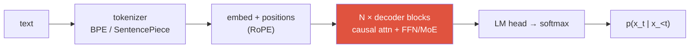
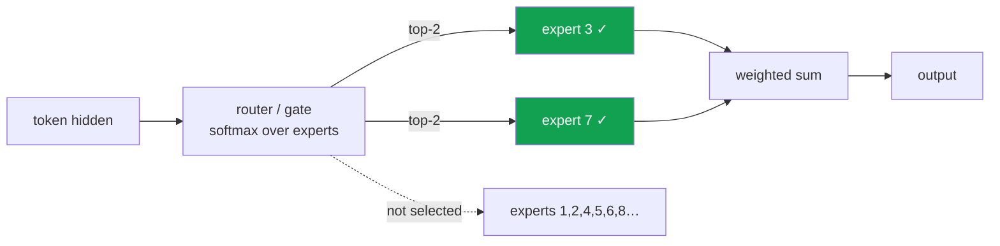

# LLM Fundamentals

decoder-onlytokenizationscaling lawsRoPEKV cacheMoE

> [!TIP] 먼저 이렇게 말하라
> 현대 LLM은 수조 개의 token으로 **next-token prediction** 학습을 한 **decoder-only Transformer**이고, 이후 alignment와 reasoning을 위한 post-training을 거친다. 면접관이 파고드는 모든 것 — long context, 저렴한 inference, MoE — 은 그 하나의 objective가 **데이터**와 **serving cost**라는 두 제약과 만나면서 생긴 결과다. objective를 먼저 꺼내고, 거기서부터 바깥으로 짚어 나가라.

vision 출신이라면 솔직한 프레이밍은 이렇다: 당신은 이미 attention, residual stack, mixed-precision 효율을 안다. LLM에 고유한 것은 *autoregressive* factorization, subword tokenization, scaling-law 경제학, 그리고 inference 방식(KV cache, MoE routing)이다. 이 장은 바로 그것들을 유창하게 다루게 해준다.

## 1 · The decoder-only Transformer

동일한 block을 쌓은 하나의 stack이고, 모든 token은 자기 자신과 과거에만 attend한다(**causal mask**). encoder도 없고 cross-attention도 없다. block마다 pre-norm이 이제 표준인데(sublayer *앞*에서 norm), 깊은 depth에서도 residual-stream gradient의 scale을 잘 유지하기 때문이다.

$$
\mathrm{Attention}(Q,K,V)=\mathrm{softmax}\!\left(\frac{QK^\top}{\sqrt{d_k}}+M\right)V,\qquad M_{ij}=\begin{cases}0 & j\le i\\ -\infty & j> i\end{cases}
$$

<dl class="kv">
<dt>왜 $\sqrt{d_k}$인가?</dt><dd>dot product의 분산은 $d_k$에 비례한다. scale이 없으면 softmax가 saturate되고 gradient가 사라진다.</dd>
<dt>Pre-norm vs post-norm</dt><dd>Pre-norm(GPT-2 이후)은 warmup 곡예 없이도 아주 깊은 모델을 안정적으로 학습한다. post-norm(원래 Transformer)은 약간 더 낮은 loss에 도달할 수 있지만 까다롭다. 프런티어 LLM은 pre-norm + <b>RMSNorm</b>(평균 차감이 없어 더 저렴)을 쓴다.</dd>
<dt>FFN</dt><dd>$W_2\,\sigma(W_1x)$이고 프런티어에서는 $\sigma=$ <b>SwiGLU</b>다. FFN이 대부분의 parameter를 담고 있으며, MoE는 나중에 이 FFN을 expert로 쪼갠다.</dd>
<dt>Attention variant</dt><dd><b>MHA</b> → <b>GQA</b>(적은 KV head를 여러 query head가 공유) → <b>MQA</b>(KV head 하나). KV head가 적을수록 KV cache가 작아진다. §5 참고.</dd>
</dl>

세 계열을 대조하라(면접관이 여전히 묻는다): **encoder-only**(BERT, bidirectional, 이해/retrieval용), **encoder-decoder**(T5, cross-attention, conditional seq2seq용), **decoder-only**(GPT, causal, 범용 생성·prompting·tool-use용). decoder-only가 프런티어에서 이긴 이유는 단일 causal stack이 깔끔하게 scale되고, in-context learning을 하며, 모든 task를 "continuation을 예측하라"로 통일하기 때문이다. block 내부의 세부는 [CNNs, RNNs & Transformers](#/foundations/architectures) 참고.

## 2 · Tokenization

모델은 문자를 절대 보지 않는다 — **subword ID**를 본다. tokenizer는 네트워크 바깥에 있는, 손실 없는 학습된 compressor다.

| | Byte-level BPE (GPT) | SentencePiece (Unigram/BPE) |
| --- | --- | --- |
| 기본 단위 | raw **byte** → 빈도 기반 greedy merge | raw text에서 직접 학습, language-agnostic |
| 공백 | marker(`Ġ`)로 encode | 명시적 `▁` meta-symbol |
| OOV | 불가능(byte가 모든 것을 커버) | 불가능(byte fallback) |
| 사용처 | GPT-2/3/4, Llama (tiktoken 계열) | T5, Llama tokenizer 학습, 대부분의 multilingual |

> [!NOTE] tokenization이 trivia가 아니라 진짜 면접 주제인 이유
> **Vocab size는 진짜 trade-off다.** 너무 작으면 → 시퀀스가 길어짐 → quadratic attention 비용과 짧아진 유효 context. 너무 크면 → embedding/LM-head 행렬이 커지고, 희귀하고 덜 학습된 token이 생긴다. **자릿수 처리**는 고전적 함정이다: 여러 자릿수 덩어리를 일관성 없이 merge하는 tokenizer는 산수를 망친다. 2024–2025년 여러 모델이 수학을 돕기 위해 **single-digit tokenization**으로 전환했다. 그리고 tokenizer가 안 맞으면 조용한 multilingual 세금이 붙는다 — 같은 문장이 어떤 언어에서는 2–3배 더 많은 token을 잡아먹는다.

multimodal에서는 여기서 당신의 vision 배경이 다시 연결된다: image patch가 "visual token"이 되어 text vocabulary를 공유하거나(VQ code) 같은 embedding 공간으로 projection된다(continuous adapter) — 이것이 [VLM Pretraining](#/vlm/pretraining)의 핵심 설계 선택이다.

## 3 · The pretraining objective

autoregressive maximum likelihood — 그 이상 특이한 것은 없다:

$$
\mathcal{L}(\theta)=-\mathbb{E}_{x\sim\mathcal D}\sum_{t=1}^{|x|}\log p_\theta(x_t\mid x_{<t})
$$

**teacher forcing**으로 학습한다(ground-truth prefix를 넣고 모든 위치를 병렬로 예측 — 한 번의 forward pass가 시퀀스 전체를 supervise한다). 이 단순한 objective가 왜 reasoning, world knowledge, in-context learning을 낳는지는 깊은 질문이다: 넓은 corpus에서 next-token cross-entropy를 최소화하는 것은 일종의 **lossy compression**이고, 인간 텍스트를 잘 압축하려면 지식과 기술을 닮은 latent structure가 필요한 것으로 보인다.

likelihood만으로 왜 충분하지 않은가 — 애초에 alignment가 왜 필요한가?

**짧게:** 낮은 perplexity ≠ helpful, honest, harmless. objective는 *그럴듯한 continuation*을 보상하지 *유용한 답*을 보상하지 않는다.

**깊게:** 세 가지 gap. (1) **Exposure bias** — 학습은 gold prefix에 조건을 걸지만 inference는 모델 자신의(틀렸을 수도 있는) token에 조건을 걸어 오류가 누적된다. (2) **Objective mismatch** — corpus에는 toxic하고 거짓이며 도움 안 되는 텍스트가 있고 모델은 그것을 충실히 흉내 내도록 배운다. (3) **선호 개념 없음** — likelihood는 좋은 답과, 똑같이 확률 높은 평범한 답을 구별하지 못한다. 이걸 고치는 것이 바로 [Post-Training & Alignment](#/llm/alignment)의 일이다.

**후속 질문:** Temperature/top-p/top-k 차이? · greedy decoding이 언제 해로운가? · perplexity와 downstream benchmark의 차이는?

## 4 · Scaling laws — and the 2026 pivot

**Kaplan et al. (2020)** 는 매끄러운 power-law를 발견했다: loss는 compute, parameter, 데이터에 따라 예측 가능하게 떨어진다. **Chinchilla (Hoffmann et al., 2022)** 는 그 *배분*을 바로잡았다: 고정된 compute 예산 $C\approx 6ND$에서 대부분의 큰 모델은 **undertrained**였다 — parameter $N$과 token $D$를 **함께** scale해야 하며, 대략 $D\approx 20N$이다. *(verifiable)*

$$
L(N,D)=L_\infty + \frac{A}{N^{\alpha}} + \frac{B}{D^{\beta}}
$$

하지만 2025–2026년은 이 법칙을 둘러싼 *경제학*을 다시 썼다:

<dl class="kv">
<dt>The data wall</dt><dd>compute-optimal 학습은 token이 공짜라고 가정한다. 고품질 인간 텍스트는 <b>그렇지 않다</b> — 그것이 구속 제약이다. 그래서 lab들은 synthetic data와 재사용으로 밀고 나가며, 한계 FLOP은 다른 데로 옮겨간다. <i>(옹호 가능한 의견. 법칙이 "깨진" 게 아니라 제약이 이동했다)</i></dd>
<dt>Inference-aware optimality</dt><dd>Chinchilla는 <b>배포</b> 비용을 무시한다. 모델을 수십억 번 serving한다면 <b>더 작은 모델을 overtrain</b>(Llama 스타일, token ≫ 20N)해서 query당 inference를 저렴하게 하는 게 합리적이다. compute-optimality는 objective에 inference cost를 넣어 다시 유도되고 있다.</dd>
<dt>Test-time compute as a third axis</dt><dd>Snell et al. (2024): 고정된 모델에서 <i>inference 시점에</i> compute를 더 쓰는 것(더 긴 CoT, best-of-N, search)이 parameter를 더 늘리는 것을 이길 수 있다. 이것이 <a href="#/llm/reasoning">Reasoning &amp; Test-Time Compute</a>로 가는 다리다.</dd>
</dl>

> [!QUESTION] 2026년에 나올 법한 질문
> "pretraining scaling은 죽었나? 한계 FLOP은 어디로 가야 하나?" **답변 골격:** *법칙*은 여전히 성립하지만, 구속 제약이 compute에서 **고품질 데이터**와 **serving cost**로 옮겨갔다. 그래서 한계 FLOP은 점점 raw pretraining scale이 아니라 **post-training(RLVR)** 과 **test-time compute**를 산다 — 한편 lab들은 저렴한 inference를 위해 더 작은 모델을 overtrain한다. *붕괴*가 아니라 *재배분*으로 프레이밍하면 현재 감각이 있는 것처럼 들린다.

## 5 · Context extension: RoPE, ALiBi, YaRN

absolute position embedding은 학습된 길이를 넘어서 외삽하지 못한다. 프런티어는 **relative** 방식을 쓴다.

<dl class="kv">
<dt>RoPE (rotary)</dt><dd>$q,k$를 position에 비례하는 각도로 회전시킨다: 그러면 dot product가 <b>relative</b> offset $i-j$에만 의존하게 된다. 이제 기본값이다. dimension pair마다 다른 frequency가 거리의 스펙트럼을 encode한다.</dd>
<dt>ALiBi</dt><dd>attention score에 거리 비례 bias $-m|i-j|$를 더한다. 매우 단순하고, length 외삽이 강하며, 학습된 position parameter가 없다 — 하지만 프런티어에서는 대체로 RoPE + interpolation에 밀린다.</dd>
<dt>Position interpolation / NTK-aware</dt><dd>position을 학습된 범위로 밀어 넣거나(linear PI) RoPE frequency를 rescale해서(NTK-aware), 4K로 학습한 모델이 가벼운 fine-tuning으로 32K에서 동작하게 한다.</dd>
<dt>YaRN</dt><dd>실전 주력: frequency-선택적 RoPE scaling(낮은 frequency는 interpolate, 높은 것은 유지)에 attention-temperature 조정을 더해 — 최소한의 fine-tuning으로 context를 크게 확장한다. 모델이 128K–1M로 점프하는 방식이 이것이다.</dd>
</dl>

context는 **세 층 문제**다: *알고리즘*(position encoding), *데이터*(진짜로 긴 시퀀스로 fine-tune), *시스템*(KV cache, attention kernel). long context에서도 알려진 실패는 **"lost in the middle"** 이다 — context 중간에 놓인 사실은 retrieval 정확도가 떨어진다.

## 6 · KV cache & the inference regime

decode step $t$에서는 새 token의 $q_t,k_t,v_t$만 계산하고, 과거 $K_{1:t-1},V_{1:t-1}$는 **cache**된다. 이것이 step당 비용을 $O(t^2)$ 재계산에서 $O(t)$ read로 바꾼다 — 그런데 그 read가 문제다.

$$
\text{KV bytes} \approx 2 \cdot L \cdot H_{kv} \cdot d_{head} \cdot T \cdot b_{dtype}
$$

<figure>
<svg viewBox="0 0 640 170" xmlns="http://www.w3.org/2000/svg" font-family="Inter, sans-serif" font-size="12">
  <rect x="20" y="20" width="260" height="60" rx="6" fill="none" stroke="#0ea5e9" stroke-width="2"/>
  <text x="150" y="14" text-anchor="middle" fill="#0ea5e9">PREFILL — compute-bound, parallel</text>
  <text x="150" y="55" text-anchor="middle" fill="#6b7686">process whole prompt in one pass</text>
  <rect x="360" y="20" width="260" height="60" rx="6" fill="none" stroke="#e0533f" stroke-width="2"/>
  <text x="490" y="14" text-anchor="middle" fill="#e0533f">DECODE — memory-bound, serial</text>
  <text x="490" y="55" text-anchor="middle" fill="#6b7686">1 token/step, re-read the KV cache</text>
  <path d="M280 50 H360" stroke="#98a3b2" stroke-width="1.5" marker-end="url(#b)"/>
  <text x="320" y="110" text-anchor="middle" fill="#6b7686">bottleneck ≠ FLOPs</text>
  <text x="320" y="128" text-anchor="middle" fill="#6b7686">bottleneck = HBM bandwidth reading KV</text>
  <defs><marker id="b" markerWidth="8" markerHeight="8" refX="6" refY="3" orient="auto"><path d="M0 0 L6 3 L0 6" fill="#98a3b2"/></marker></defs>
</svg>
<figcaption>두 phase는 정반대의 성능 프로파일을 갖는다. prefill은 tensor core를 포화시키고, decode는 각 step이 메모리에서 큰 KV cache를 읽는 데 지배되기 때문에 tensor core를 굶긴다.</figcaption>
</figure>

최적화 레퍼토리(어떤 lever가 어떤 phase를 고치는지 알아두라):

| Technique | 무엇을 얻는가 | Phase |
| --- | --- | --- |
| GQA / MQA | 적은 KV head → 작은 cache | decode |
| KV quantization (INT8/FP4) | 2–4배 적은 bandwidth | decode |
| **MLA** (low-rank latent K/V) | KV를 latent로 압축 (DeepSeek) | decode |
| PagedAttention (vLLM) | 단편화 없음, dynamic batching | serving |
| Continuous batching | 높은 GPU 활용도 | serving |
| Speculative decoding (EAGLE/Medusa) | draft-and-verify → 낮은 latency | decode |
| FlashAttention | IO-aware exact attention | 둘 다 |

> [!WARNING] 함정 답변
> "그냥 더 큰 GPU 쓰면 되죠." 관점의 고도가 틀렸다. 강한 답은 **prefill(compute-bound) vs decode(memory-bound)** 분할을 짚고, 각 최적화를 그것이 돕는 phase에 매칭한다. speculative decoding은 *lossless*다 — target 모델이 draft된 모든 token을 verify하므로 출력 분포가 바뀌지 않는다. draft 수용률이 높을 때만 이득이다. precision/kernel에 대한 더 많은 내용은 [Mixed Precision & Efficiency](#/foundations/mixed-precision-efficiency).

## 7 · Mixture-of-Experts

FFN을 $E$개의 expert FFN과, 각 token을 top-$k$ expert(보통 $k=1$ 또는 $2$)로 보내는 **router**로 교체한다. 이것이 **용량을 compute에서 분리**한다: 총 parameter는 거대할 수 있지만 token당 FLOP은 작은 dense 모델 수준에 머문다.

> [!IMPORTANT] 외워둘 숫자
> **DeepSeek-V3는 token당 총 671B 중 ~37B parameter를 활성화한다**(256개 expert에 대한 top-k → dense-FFN compute의 몇 퍼센트). 2025–2026 프런티어 계열 거의 전부 — Llama 4, Qwen3, Mistral Large 3, Grok, DeepSeek — 가 MoE다. *(verifiable)*

<dl class="kv">
<dt>Active vs total params</dt><dd><b>Active</b>는 token당 latency/compute를 좌우하고, <b>total</b>은 memory footprint와 용량을 좌우한다. 항상 둘 다 말하라 — MoE에 대해 "숫자 하나"만 말하면 면접에서 위험 신호다.</dd>
<dt>Load balancing</dt><dd>압력이 없으면 router는 몇몇 expert로 collapse한다. <b>auxiliary load-balancing loss</b>(또는 DeepSeek-V3의 aux-loss-free bias 조정)가 token을 분산시키고, <b>capacity factor</b>가 expert당 token을 제한한다(overflow는 drop되거나 shared expert로 route된다).</dd>
<dt>Shared experts</dt><dd>일부 설계는 공통 계산을 위해 항상 켜진 expert 하나를 두고, route되는 expert는 특화를 위해 남겨둔다(DeepSeek-MoE).</dd>
<dt>Systems cost</dt><dd>expert는 여러 device에 sharding되므로(<b>expert parallelism</b>), 모든 token이 <b>all-to-all</b> 통신을 유발한다 — 이것이 MoE serving의 지배적 비용이다. MoE에 대한 RL은 token 수준에서 불안정한데, 그래서 <b>GSPO</b>는 importance ratio를 sequence 수준으로 옮긴다(<a href="#/llm/alignment">Alignment</a> 참고).</dd>
</dl>

Pros

- inference compute 단위당 더 많은 용량/품질
- 동급 품질의 dense 모델 대비 *serving*이 저렴
- expert가 특화될 수 있음

Cons

- 큰 memory footprint(모든 expert가 상주)
- all-to-all 통신, 복잡한 parallelism
- fine-tune, quantize, RL 학습이 더 까다로움(routing 불안정성)

## Cheat-sheet

| Concept | 한 줄 요약 |
| --- | --- |
| Objective | $-\sum_t \log p_\theta(x_t\mid x_{<t})$; teacher-forced, 병렬 학습 |
| Decoder-only | causal mask, pre-norm + RMSNorm + SwiGLU, GQA attention |
| BPE vs SentencePiece | byte-merge vs language-agnostic Unigram; vocab size는 진짜 trade-off |
| Chinchilla | $N$과 $D$를 함께 scale, $D\approx 20N$이 compute-optimal |
| 2026 pivot | data wall + inference cost → 작은 모델 overtrain, RLVR + test-time compute에 지출 |
| RoPE / ALiBi / YaRN | relative-position 회전 / 거리 bias / long context용 freq-선택적 RoPE scaling |
| KV cache | prefill = compute-bound, decode = memory-bound(HBM에서 KV read) |
| MoE | active ≪ total params; top-k routing; load balancing + all-to-all이 비용 |

## Related

[CNNs, RNNs & Transformers](#/foundations/architectures) · [Mixed Precision & Efficiency](#/foundations/mixed-precision-efficiency) · [Post-Training & Alignment](#/llm/alignment) · [Reasoning & Test-Time Compute](#/llm/reasoning) · [Agentic AI & Tool Use](#/llm/agents) · [VLM Pretraining](#/vlm/pretraining) · [The 2026 Landscape](#/start/landscape-2026)
