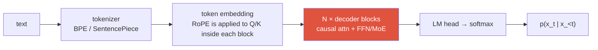
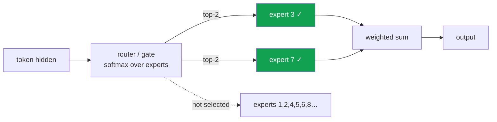

# LLM Fundamentals

<div class="tag-row"><span class="tag">decoder-only</span><span class="tag">scaling laws</span><span class="tag">RoPE</span><span class="tag">KV cache</span><span class="tag">MoE</span></div>

> [!NOTE] Goal of this chapter
> The on-ramp introduced [tokens](#/llm/tokenization), [embeddings](#/llm/embeddings), [next-token prediction](#/llm/next-token), and [decoding/sampling](#/llm/decoding-sampling). Now we assemble those pieces into **one model**. Advanced topics such as long context, inexpensive inference, and MoE all emerge when **one training objective** meets the twin constraints of **data** and **serving cost**. This chapter follows that causal chain.

## What and why

The mainstream generative LLM discussed here is a **decoder-only Transformer autoregressively pretrained on a vast token corpus and then post-trained**. Encoder-decoder, state-space, and multimodal hybrid architectures also exist, so this is not a definition of every LLM. We organize the most common family around two ingredients:

- **Ingredient 1: architecture**—one Transformer made by stacking the same block tens or hundreds of times. It is familiar attention and residual computation at scale.
- **Ingredient 2: objective**—given all preceding text, **predict the next token**. Repeating this game over internet-scale text induces grammar, facts, translation, and coding skills.

**Post-training** then turns the raw predictor into a useful assistant that answers questions and follows instructions; see [Post-Training & Alignment](#/llm/alignment). An LLM's lifecycle is therefore often described in two stages.

<figure>
<svg viewBox="0 0 640 210" xmlns="http://www.w3.org/2000/svg" font-family="Inter, sans-serif" font-size="12">
  <text x="320" y="18" text-anchor="middle" fill="#98a3b2">The two-stage lifecycle of an LLM</text>
  <!-- stage 1 -->
  <rect x="30" y="45" width="200" height="70" rx="8" fill="none" stroke="#6366f1" stroke-width="2"/>
  <text x="130" y="72" text-anchor="middle" font-weight="700" fill="#6366f1">① Pretraining</text>
  <text x="130" y="92" text-anchor="middle" fill="currentColor" font-size="11">Repeat next-token prediction</text>
  <text x="130" y="107" text-anchor="middle" fill="currentColor" font-size="11">over enormous text corpora</text>
  <!-- arrow -->
  <path d="M230 80 H270" stroke="#98a3b2" stroke-width="1.5" marker-end="url(#lc)"/>
  <!-- stage 2 -->
  <rect x="270" y="45" width="200" height="70" rx="8" fill="none" stroke="#e0533f" stroke-width="2"/>
  <text x="370" y="72" text-anchor="middle" font-weight="700" fill="#e0533f">② Post-training</text>
  <text x="370" y="92" text-anchor="middle" fill="currentColor" font-size="11">SFT + preference optimization / RLVR</text>
  <text x="370" y="107" text-anchor="middle" fill="currentColor" font-size="11">Align instruction-following behavior</text>
  <!-- arrow -->
  <path d="M470 80 H510" stroke="#98a3b2" stroke-width="1.5" marker-end="url(#lc)"/>
  <!-- result -->
  <rect x="510" y="55" width="110" height="50" rx="8" fill="#12a150"/>
  <text x="565" y="78" text-anchor="middle" fill="#fff" font-size="11">Useful chatbot</text>
  <text x="565" y="94" text-anchor="middle" fill="#fff" font-size="11">or agent</text>
  <text x="130" y="150" text-anchor="middle" fill="#98a3b2" font-size="11">Learn language/world patterns (large compute)</text>
  <text x="370" y="150" text-anchor="middle" fill="#98a3b2" font-size="11">Adjust instruction behavior (recipe-dependent cost)</text>
  <text x="320" y="185" text-anchor="middle" fill="#98a3b2">This chapter focuses on the architecture and economics of ①; the next chapter covers ②.</text>
  <defs><marker id="lc" markerWidth="8" markerHeight="8" refX="6" refY="3" orient="auto"><path d="M0 0 L6 3 L0 6" fill="#98a3b2"/></marker></defs>
</svg>
<figcaption>A representative recipe learns language and world patterns through ① autoregressive pretraining, then adjusts instruction behavior through ② SFT, preference optimization, and RLVR. Stage boundaries and cost ratios vary by model, and continued pretraining or joint training are also possible.</figcaption>
</figure>

> [!TIP] Interview one-liner
> Start with the **objective—next-token prediction—and reason outward**. From a vision background, distinguish shared primitives (attention, residuals, mixed precision) from LLM-specific concerns (autoregressive generation, subword tokenization, scaling economics, KV caches, and serving). MoE and decoder-only are common choices, not requirements in the definition of an LLM.

The complete pipeline looks like this:



## 1 · The decoder-only Transformer

A standard decoder-only model stacks the same block repeatedly and uses a causal mask so each token attends only to itself and earlier tokens. A typical text-only GPT stack has no separate encoder or cross-attention, although a VLM or conditional generator can add cross-attention or adapters.

Why hide the future? To make next-token training **possible**. If position $i$ could see the future token that is its target, the network could copy the answer without learning to predict it.

<figure>
<svg viewBox="0 0 340 260" xmlns="http://www.w3.org/2000/svg" font-family="Inter, sans-serif" font-size="12">
  <text x="170" y="18" text-anchor="middle" fill="#98a3b2">causal mask — query row i sees only key columns j≤i</text>
  <text x="20" y="150" text-anchor="middle" fill="#98a3b2" transform="rotate(-90 20 150)">query i →</text>
  <text x="180" y="248" text-anchor="middle" fill="#98a3b2">key j →</text>
  <g font-size="11">
    <!-- 5x5 grid: fill lower-triangular (allowed) -->
    <!-- row 0 -->
    <rect x="45" y="35" width="40" height="40" fill="#e0533f" opacity="0.85"/>
    <rect x="87" y="35" width="40" height="40" fill="none" stroke="#98a3b2"/>
    <rect x="129" y="35" width="40" height="40" fill="none" stroke="#98a3b2"/>
    <rect x="171" y="35" width="40" height="40" fill="none" stroke="#98a3b2"/>
    <rect x="213" y="35" width="40" height="40" fill="none" stroke="#98a3b2"/>
    <!-- row 1 -->
    <rect x="45" y="77" width="40" height="40" fill="#e0533f" opacity="0.85"/>
    <rect x="87" y="77" width="40" height="40" fill="#e0533f" opacity="0.85"/>
    <rect x="129" y="77" width="40" height="40" fill="none" stroke="#98a3b2"/>
    <rect x="171" y="77" width="40" height="40" fill="none" stroke="#98a3b2"/>
    <rect x="213" y="77" width="40" height="40" fill="none" stroke="#98a3b2"/>
    <!-- row 2 -->
    <rect x="45" y="119" width="40" height="40" fill="#e0533f" opacity="0.85"/>
    <rect x="87" y="119" width="40" height="40" fill="#e0533f" opacity="0.85"/>
    <rect x="129" y="119" width="40" height="40" fill="#e0533f" opacity="0.85"/>
    <rect x="171" y="119" width="40" height="40" fill="none" stroke="#98a3b2"/>
    <rect x="213" y="119" width="40" height="40" fill="none" stroke="#98a3b2"/>
    <!-- row 3 -->
    <rect x="45" y="161" width="40" height="40" fill="#e0533f" opacity="0.85"/>
    <rect x="87" y="161" width="40" height="40" fill="#e0533f" opacity="0.85"/>
    <rect x="129" y="161" width="40" height="40" fill="#e0533f" opacity="0.85"/>
    <rect x="171" y="161" width="40" height="40" fill="#e0533f" opacity="0.85"/>
    <rect x="213" y="161" width="40" height="40" fill="none" stroke="#98a3b2"/>
    <!-- row 4 -->
    <rect x="45" y="203" width="40" height="40" fill="#e0533f" opacity="0.85"/>
    <rect x="87" y="203" width="40" height="40" fill="#e0533f" opacity="0.85"/>
    <rect x="129" y="203" width="40" height="40" fill="#e0533f" opacity="0.85"/>
    <rect x="171" y="203" width="40" height="40" fill="#e0533f" opacity="0.85"/>
    <rect x="213" y="203" width="40" height="40" fill="#e0533f" opacity="0.85"/>
  </g>
  <text x="285" y="120" fill="#e0533f" font-size="11">■ allowed</text>
  <text x="285" y="140" fill="#98a3b2" font-size="11">□ blocked (future)</text>
</svg>
<figcaption>A causal mask permits attention only in the lower triangle (past and present) and blocks the upper triangle (future) with −∞. A prediction at position i therefore cannot use future information. The code lab below constructs this matrix directly.</figcaption>
</figure>

$$
\mathrm{Attention}(Q,K,V)=\mathrm{softmax}\!\left(\frac{QK^\top}{\sqrt{d_k}}+M\right)V,\qquad M_{ij}=\begin{cases}0 & j\le i\\ -\infty & j> i\end{cases}
$$

Read the equation this way: $QK^\top$ scores how relevant every token is to every other token. Adding $M$ pushes future scores to $-\infty$, which becomes zero after softmax. Everything else is standard attention.

<details class="concept-code">
<summary>View as concept code</summary>

> This PyTorch-like **pseudocode** shows tensor shapes and masking order. It is not a complete executable implementation.

```python
def causal_self_attention(x, pad_mask, training):
    # x: [B, T, D], pad_mask: [B, T] (True for real tokens)
    q = split_heads(x @ Wq)  # [B, H,    T, Dh]
    k = split_heads(x @ Wk)  # [B, H_kv, T, Dh]; H_kv < H for GQA
    v = split_heads(x @ Wv)
    k, v = repeat_kv_heads_if_gqa(k, v, num_query_heads=H)

    scores = (q @ k.transpose(-2, -1)) / sqrt(Dh)  # [B,H,T,T]
    causal = tril(ones(T, T, dtype=bool))[None, None, :, :]
    key_is_real = pad_mask[:, None, None, :]        # Broadcast only over key axis
    query_is_real = pad_mask[:, None, :, None]
    allowed = causal & key_is_real
    # Open one temporary key for padding queries to avoid a fully-masked softmax NaN.
    fallback = one_hot(0, T, dtype=bool)[None, None, None, :]
    safe_allowed = allowed | (~query_is_real & fallback)
    scores = scores.masked_fill(~safe_allowed, -inf)

    # fp32 accumulation makes softmax more stable even during low-precision training.
    weights = softmax(scores.float(), dim=-1).to(q.dtype)
    weights = dropout(weights) if training else weights
    out = merge_heads(weights @ v) @ Wo             # [B,T,D]

    # Zero temporary padding-query outputs and exclude them from the loss as well.
    return out * pad_mask[..., None]
```

</details>

<dl class="kv">
<dt>Why <span>$\sqrt{d_k}$</span>?</dt><dd>Dot-product variance grows with $d_k$; without scaling, softmax saturates and gradients vanish. See <a href="#/foundations/linear-algebra-calculus">Linear Algebra & Calculus</a> and <a href="#/ml-coding/attention">Implement Attention</a> for the derivation.</dd>
<dt>Pre-norm vs post-norm</dt><dd><b>Pre-norm</b> normalizes before a sublayer and generally stabilizes optimization in deep networks; it is widely used with RMSNorm. It does not eliminate the need for warmup, initialization, or residual scaling, and post-norm variants remain in use and study—see <a href="#/foundations/normalization-stability">Normalization</a>.</dd>
<dt>FFN</dt><dd>A per-token transformation. Gated activations such as SwiGLU are common but not mandatory; MoE usually replaces this FFN with multiple experts (§6).</dd>
<dt>Attention variants</dt><dd><b>MHA</b> gives each query head its own K/V heads; <b>GQA</b> shares a smaller set of K/V heads across query heads; <b>MQA</b> shares a single K/V head. These are quality–memory–kernel-efficiency choices, not a linear generational replacement. Fewer KV heads mean a smaller cache (§5).</dd>
</dl>

Contrast the three common families: **encoder-only** (BERT-like, bidirectional representation), **encoder-decoder** (T5-like, conditional sequence-to-sequence), and **decoder-only** (GPT-like, causal generation). Decoder-only is widespread for general generation because one causal interface scales and unifies many tasks, but another architecture can be more efficient for retrieval, classification, or translation. See [CNNs, RNNs & Transformers](#/foundations/architectures) and the [Transformer implementation](#/ml-coding/transformer).

> [!NOTE] Covered on the on-ramp
> **Tokenization** (text → subword IDs and the BPE vocabulary trade-off) is covered in [Tokenization & BPE](#/llm/tokenization). The **next-token objective** $-\sum_t\log p_\theta(x_t\mid x_{<t})$, teacher forcing, and perplexity are in [Next-Token Prediction](#/llm/next-token). Token selection through **temperature, top-k, and top-p** is in [Decoding & Sampling](#/llm/decoding-sampling). This chapter focuses on the architecture, economics, and inference layers above them.

## 2 · Build it yourself — causal mask

The triangular mask above becomes concrete when you construct it. For a square grid of size $n$, fill **1 when the position is allowed (past or present, $j\le i$) and 0 when blocked (future, $j>i$)**. Complete the live editor and press **▶ Run tests**. Open **Solution** if needed; the first run may pause while the Python runtime downloads.

<div class="widget" data-widget="code">
<script type="application/json" class="code-config">
{"func":"causal_mask","starter":"def causal_mask(n):\n    # Build an n x n grid: 1 if row position i may see column position j, otherwise 0.\n    # Rule: 1 when j <= i (past/present, allowed); 0 when j > i (future, blocked).\n    # Return a list of lists. Example: n=2 -> [[1,0],[1,1]]\n    mask = []\n    # TODO\n    return mask","tests":[{"args":[1],"expect":[[1]]},{"args":[2],"expect":[[1,0],[1,1]]},{"args":[3],"expect":[[1,0,0],[1,1,0],[1,1,1]]},{"args":[4],"expect":[[1,0,0,0],[1,1,0,0],[1,1,1,0],[1,1,1,1]]}],"solution":"def causal_mask(n):\n    mask = []\n    for i in range(n):\n        row = [1 if j <= i else 0 for j in range(n)]\n        mask.append(row)\n    return mask"}
</script>
</div>

If you obtained a lower-triangular matrix, it is correct: entries containing 1 are visible to attention, while 0 entries become $-\infty$ before softmax in a real model and are completely blocked.

## 3 · Scaling laws — and the 2026 pivot

**Scaling laws** are empirical fits for how loss changes over a particular range of models, data, and compute. [Kaplan et al. (2020)](https://arxiv.org/abs/2001.08361) reported power-law relationships with compute, parameters, and data. [Chinchilla/Hoffmann et al. (2022)](https://arxiv.org/abs/2203.15556) found that under their experimental range and assumptions, parameters $N$ and data $D$ should grow together under fixed compute, with a solution near $D\approx20N$. Do not memorize that ratio as a universal constant across tokenizers, data quality, architectures, retraining, and deployment objectives.

$$
L(N,D)=L_\infty + \frac{A}{N^{\alpha}} + \frac{B}{D^{\beta}}
$$

Read the fit as follows: increasing the model ($N\uparrow$) lowers the second term, and increasing data ($D\uparrow$) lowers the third; $L_\infty$ is the irreducible floor in the fit. In 2025–2026, the law itself did not disappear, but its *economics* changed.

<dl class="kv">
<dt>Data constraints</dt><dd>High-quality, deduplicated data with known rights and provenance is finite. Synthetic data also requires management of error amplification and reduced diversity. This is not the same as merely increasing token count.</dd>
<dt>Inference-aware optimality</dt><dd>The pretraining-FLOP optimum is not necessarily the lifecycle-cost optimum. At high query volume, training a smaller model for longer can reduce per-query cost, but latency, memory, quality, and training cost must be optimized jointly.</dd>
<dt>Test-time compute as a third axis</dt><dd>On some verifiable problems, more inference compute for sampling, search, and verification can beat one sample from a larger model. It is not a monotonic law and does not replace parameter scaling on every task; see <a href="#/llm/reasoning">Reasoning &amp; Test-Time Compute</a>.</dd>
</dl>

> [!QUESTION] Likely 2026 question
> "Is pretraining scaling dead?" **Answer skeleton:** distinguish a power law observed over a range from a product decision. Data quality, energy, memory, and serving cost are additional constraints, and some budget is now allocated across pretraining, post-training, retrieval, and test-time compute. The optimum depends on the task and total-cost curve.

## 4 · Context extension: RoPE, ALiBi, YaRN

This is the problem of increasing the number of tokens a model can use at once. Positions outside the training range usually extrapolate poorly, but a model trained at 4K does not necessarily fail at exactly token 4,001. RoPE and relative biases also do not automatically generalize to arbitrary lengths: scaling methods, long-sequence data, attention kernels, and real needle/retrieval evaluations must work together. See [Positional Encoding & RoPE](#/ml-coding/positional-encoding-rope).

<dl class="kv">
<dt>RoPE (rotary position embedding)</dt><dd>Rather than adding a vector to token embeddings, rotate each layer's $q,k$ by position so their dot product contains relative-position structure. It is widely used, but frequency design and training length govern extrapolation quality.</dd>
<dt>ALiBi</dt><dd>Add a head-specific, distance-proportional bias to attention scores. It is simple and targets length extrapolation, but its comparison with RoPE depends on the model, training, and evaluation.</dd>
<dt>Position interpolation / NTK-aware</dt><dd>Squeeze positions into the trained range (linear PI) or rescale RoPE frequencies (NTK-aware) so a model trained at 4K works at 32K with light fine-tuning.</dd>
<dt>YaRN</dt><dd>One context-extension method that combines frequency-dependent RoPE scaling with attention correction. Reported maximum length depends on the base model, fine-tuning data, and evaluation; an advertised context window does not guarantee effective use throughout that range.</dd>
</dl>

Context is a **three-layer problem**: *algorithm* (position encoding), *data* (fine-tune on genuinely long sequences), and *systems* (KV cache, attention kernels). A known failure even at long context is **"lost in the middle"** — retrieval accuracy sags for facts placed mid-context.

## 5 · KV cache & the inference regime

At decode step $t$ you only compute the new token's $q_t,k_t,v_t$; the past $K_{1:t-1},V_{1:t-1}$ are **cached**. This turns per-step cost from $O(t^2)$ recompute into an $O(t)$ read — but that read is the problem.

$$
\text{KV bytes} \approx 2 \cdot B \cdot L \cdot H_{kv} \cdot d_{head} \cdot T \cdot b_{dtype}
$$

Here $B$ is concurrent sequence count, $L$ layer count, $H_{kv}$ KV-head count, $T$ cached tokens per sequence, and $b_{dtype}$ bytes per element. This approximation omits tensor-parallel layout, padding, and metadata.

<figure>
<svg viewBox="0 0 640 170" xmlns="http://www.w3.org/2000/svg" font-family="Inter, sans-serif" font-size="12">
  <rect x="20" y="20" width="260" height="60" rx="6" fill="none" stroke="#0ea5e9" stroke-width="2"/>
  <text x="150" y="14" text-anchor="middle" fill="#0ea5e9">PREFILL — parallel, often compute-heavy</text>
  <text x="150" y="55" text-anchor="middle" fill="#6b7686">process whole prompt in one pass</text>
  <rect x="360" y="20" width="260" height="60" rx="6" fill="none" stroke="#e0533f" stroke-width="2"/>
  <text x="490" y="14" text-anchor="middle" fill="#e0533f">DECODE — serial, often memory-heavy</text>
  <text x="490" y="55" text-anchor="middle" fill="#6b7686">1 token/step, re-read the KV cache</text>
  <path d="M280 50 H360" stroke="#98a3b2" stroke-width="1.5" marker-end="url(#b)"/>
  <text x="320" y="110" text-anchor="middle" fill="#6b7686">bottleneck ≠ FLOPs</text>
  <text x="320" y="128" text-anchor="middle" fill="#6b7686">bottleneck = HBM bandwidth reading KV</text>
  <defs><marker id="b" markerWidth="8" markerHeight="8" refX="6" refY="3" orient="auto"><path d="M0 0 L6 3 L0 6" fill="#98a3b2"/></marker></defs>
</svg>
<figcaption>With a typical large batch and long prompt, prefill is compute-intensive while small decode steps are strongly affected by memory bandwidth for KV and weight reads. The roofline bottleneck still varies with model size, batch, sequence length, and parallelism, so profile the real workload.</figcaption>
</figure>

The optimization repertoire (know which lever fixes which phase):

| Technique | What it buys | Phase |
| --- | --- | --- |
| GQA / MQA | fewer KV heads → smaller cache | decode |
| KV quantization (INT8/FP4) | 2–4× less bandwidth | decode |
| **MLA** (low-rank latent K/V) | compress KV to a latent (DeepSeek) | decode |
| PagedAttention (vLLM) | no fragmentation, dynamic batching | serving |
| Continuous batching | higher GPU utilization | serving |
| Speculative decoding (EAGLE/Medusa) | draft-and-verify → lower latency | decode |
| FlashAttention | IO-aware exact attention; largest effect on prefill/long chunks, with decode gains depending on shape and kernel | mainly prefill |

> [!WARNING] The trap answer
> A strong answer separates prefill from decode, measures the actual shape's roofline, TTFT, TPOT, and throughput, and matches optimizations to that profile. Standard rejection-sampling speculative decoding preserves the target distribution when implemented correctly, but not every Medusa/EAGLE variant or greedy implementation has the same guarantee. It can be slower when draft acceptance is low or verification overhead is high. See [Mixed Precision & Efficiency](#/foundations/mixed-precision-efficiency).

<details class="concept-code">
<summary>View as concept code</summary>

> This **pseudocode** highlights the difference between prefill and one-token decode. Cache layout and batching APIs vary by serving engine.

```python
@no_grad()                         # Do not attach an autograd graph to inference caches.
def generate_one_request(model, prompt_ids, prompt_mask, max_new_tokens):
    model.eval()                   # Disable dropout and other training behavior.

    # Prefill: process the full prompt [B,T_prompt] in parallel and build per-layer K/V.
    logits, kv = model(prompt_ids, attention_mask=prompt_mask, use_cache=True)
    # kv[layer].key/value: approximately [B, H_kv, T_cached, Dh]

    output = []
    for _ in range(max_new_tokens):
        token = sample(logits[:, -1, :])            # [B]
        output.append(token)
        if all_sequences_finished(token):
            break

        # Decode: compute only one new token and read/append the past K/V.
        logits, kv = model(
            token[:, None], past_key_values=kv, use_cache=True
        )
        # A real server tracks request lengths/end states and releases paged blocks.

    return stack(output, dim=1)
```

</details>

## 6 · Mixture-of-Experts

**MoE (mixture-of-experts)** partially decouples model capacity from active compute per token. It replaces the FFN with $E$ expert FFNs and a **router** that sends each token to the top-$k$ experts. Active parameters can be much smaller than total parameters, but a fair dense-model comparison includes shared layers, expert size, routing, communication, and kernel efficiency.



> [!IMPORTANT] The number to memorize
> [DeepSeek-V3](https://arxiv.org/abs/2412.19437) reports about 37B active parameters per token out of 671B total. Several recent open models use MoE, while dense models also remain widespread. When quoting a model-name number, check whether embeddings and shared experts are included.

<dl class="kv">
<dt>Active vs total params</dt><dd><b>Active</b> is an important factor in theoretical FLOPs per token; <b>total</b> is an important factor in weight memory and capacity. Actual latency also depends heavily on expert placement, all-to-all communication, batch size, memory bandwidth, and kernel efficiency.</dd>
<dt>Load balancing</dt><dd>Without pressure, the router collapses onto a few experts. An <b>auxiliary load-balancing loss</b> (or DeepSeek-V3's aux-loss-free bias-adjustment) spreads tokens; a <b>capacity factor</b> caps tokens per expert (overflow is dropped or routed to a shared expert).</dd>
<dt>Shared experts</dt><dd>Some designs keep one always-on expert for common computation, reserving routed experts for specialization (DeepSeek-MoE).</dd>
<dt>Systems cost</dt><dd>Within an expert-parallel group, dispatch/combine communication sends tokens to the devices hosting their experts and back. Some routes may be local depending on expert placement. Whether communication dominates depends on batch, network, and compute; see <a href="#/foundations/distributed-training">Distributed Training</a>.</dd>
</dl>

<div class="proscons"><div><div class="pros-t">Pros</div>

- More capacity/quality per unit of inference compute
- Cheap to *serve* relative to a dense model of equal quality
- Experts can specialize

</div><div><div class="cons-t">Cons</div>

- Large memory footprint (all experts resident)
- All-to-all communication, complex parallelism
- Trickier to fine-tune, quantize, and RL-train (routing instability)

</div></div>

## 7 · Reading a model name (Instruct / Thinking / A3B / E4B …)

Open-weight model names often encode training and architecture information in suffixes, but there is **no standard specification**. Treat a name as a clue and verify the exact chat template, active parameters, context, license, and training method in the model card.

**Training-stage suffixes** — *what post-training it got* (see [Alignment](#/llm/alignment)):

| Suffix | Meaning |
| --- | --- |
| *(none)* / **Base** / **-pt** | pretrained only (next-token). Not instruction-following; meant for further tuning. |
| **Instruct / -it / Chat** | usually signals post-training for instruction following and a chat template; the exact recipe varies by model |
| **Thinking / Reasoning / -R / R1** | suggests reasoning-oriented behavior/training, but RLVR use and trace visibility vary by model |
| **-Zero** | RL with **no** SFT cold-start (DeepSeek-R1-Zero) — a research artifact, not for production. |
| **Coder / Math / VL / Omni** | domain / modality specialization (code, math, vision-language, any-to-any). |

**Size / architecture tags** — *what the compute & memory cost is*:

| Tag | Meaning | Example |
| --- | --- | --- |
| **N B** | total parameters, **dense** (all active) | `7B` |
| **N B-A K B** | **MoE**: N total, roughly K active per token | `30B-A3B`, `235B-A22B` |
| **E K B** | **effective** parameters: a nested model intended to run with memory/compute comparable to a K-B dense model (Gemma 3n MatFormer) | `E2B`, `E4B` |
| version / date | family version or data cutoff | `-2507`, `3.5` |
| quant / format | post-hoc quantization / serving format | `-AWQ`, `-FP8`, `-GGUF` |

> [!TIP] What each tag changes in practice
> `A` denotes active parameters for some MoE families, while `E` denotes effective size in Gemma 3n; meanings vary by provider. A Thinking mode may increase latency and cost by producing more tokens, but it does not improve every problem. After decoding a name, verify memory and speed in the model card and serving engine.

## Q&A

<details class="qa"><summary>Does an LLM really "understand," or does it only predict the next word?</summary>
<div class="qa-body">

**Short:** the training objective is only next-token prediction, but solving it well at internet scale requires internal representations of grammar, facts, and reasoning patterns.

**Deep:** next-token prediction is an *objective*, not a ceiling on capability. Predicting “the capital of France is ___” requires geographic knowledge, and continuing code requires syntax and logic, so optimization pressure can induce those representations. Rather than attach a philosophical label, an interview-safe formulation is: “A simple objective at scale induces broad capabilities.” See [Reasoning](#/llm/reasoning) for debates around emergence and overclaiming.
</div></details>

<details class="qa"><summary>Are more parameters—for example 671B—always better and slower?</summary>
<div class="qa-body">

**Short:** no. For MoE, **total ≠ active**; consider active FLOPs, total weight memory, and communication together.

**Deep:** a dense 7B model generally uses every FFN weight, while an MoE activates only selected experts. That does not make a 37B-active model's latency identical to a dense 37B model: shared layers, the router, expert imbalance, all-to-all communication, batch size, and weight movement remain. Memory also depends on sharding and offload, so pair model-card counts with measurements.
</div></details>

## Cheat-sheet

| Concept | One-liner |
| --- | --- |
| Identity | mainstream generative family: autoregressive decoder-only Transformer + post-training (with architectural exceptions) |
| Objective | next-token cross-entropy; teacher-forced parallel training → [details](#/llm/next-token) |
| Decoder-only | causal mask is essential; norm, activation, and MHA/GQA/MQA are model-specific choices |
| Chinchilla | under a particular experimental fit, scale $N,D$ together with a solution near $20N$ |
| Cost optimization | jointly optimize data quality, training cost, deployment volume, post-training, and test-time compute |
| RoPE / YaRN | rotate Q/K / one of several long-context scaling methods; effective length needs evaluation |
| KV cache | grows linearly with batch; profile prefill/decode bottlenecks for the actual shape and hardware |
| MoE | active ≪ total params; top-k routing; load balancing + all-to-all are the costs |
| Model name | suffixes are provider conventions; verify training, active count, and template in the model card |

## Related links

- On-ramp: [Tokenization & BPE](#/llm/tokenization) · [Embeddings](#/llm/embeddings) · [Next-Token Prediction](#/llm/next-token) · [Decoding & Sampling](#/llm/decoding-sampling)
- Implementation: [Build a Transformer Block](#/ml-coding/transformer) · [Implement Attention](#/ml-coding/attention) · [Positional Encoding & RoPE](#/ml-coding/positional-encoding-rope)
- Advanced: [Post-Training & Alignment](#/llm/alignment) · [Reasoning & Test-Time Compute](#/llm/reasoning) · [Agentic AI & Tool Use](#/llm/agents) · [VLM 101](#/vlm/vlm-101) · [Mixed Precision & Efficiency](#/foundations/mixed-precision-efficiency) · [Distributed Training](#/foundations/distributed-training)
