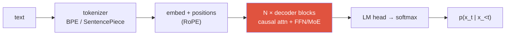
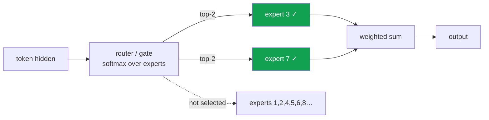

# LLM Fundamentals

decoder-onlytokenizationscaling lawsRoPEKV cacheMoE

> [!TIP] Say this first
> A modern LLM is a **decoder-only Transformer** trained by **next-token prediction** on trillions of tokens, then post-trained for alignment and reasoning. Everything an interviewer probes — long context, cheap inference, MoE — is a consequence of that one objective meeting the twin constraints of **data** and **serving cost**. Lead with the objective, then trace outward.

If you come from vision, the honest framing is: you already know attention, residual stacks, and mixed-precision efficiency. What's LLM-specific is the *autoregressive* factorization, subword tokenization, the scaling-law economics, and the inference regime (KV cache, MoE routing). This chapter makes you fluent in exactly those.

## 1 · The decoder-only Transformer

One stack of identical blocks; every token attends only to itself and the past (a **causal mask**). No encoder, no cross-attention. Per block, pre-norm is now standard (norm *before* the sublayer) because it keeps residual-stream gradients well-scaled at depth.

$$
\mathrm{Attention}(Q,K,V)=\mathrm{softmax}\!\left(\frac{QK^\top}{\sqrt{d_k}}+M\right)V,\qquad M_{ij}=\begin{cases}0 & j\le i\\ -\infty & j> i\end{cases}
$$

<dl class="kv">
<dt>Why $\sqrt{d_k}$?</dt><dd>Dot products have variance ∝ $d_k$; without the scale, softmax saturates and gradients vanish.</dd>
<dt>Pre-norm vs post-norm</dt><dd>Pre-norm (GPT-2 onward) trains stably very deep with no warmup gymnastics; post-norm (original Transformer) can reach slightly lower loss but is finicky. Frontier LLMs use pre-norm + <b>RMSNorm</b> (no mean-subtraction, cheaper).</dd>
<dt>FFN</dt><dd>$W_2\,\sigma(W_1x)$ with $\sigma=$ <b>SwiGLU</b> at the frontier; the FFN holds most parameters and is what MoE later shards into experts.</dd>
<dt>Attention variants</dt><dd><b>MHA</b> → <b>GQA</b> (few KV heads shared across query heads) → <b>MQA</b> (one KV head). Fewer KV heads = smaller KV cache; see §5.</dd>
</dl>

Contrast the three families (interviewers still ask): **encoder-only** (BERT, bidirectional, for understanding/retrieval), **encoder-decoder** (T5, cross-attention, for conditional seq2seq), **decoder-only** (GPT, causal, for general generation, prompting, tool-use). Decoder-only won at the frontier because a single causal stack scales cleanly, does in-context learning, and unifies every task as "predict the continuation." Details on the block internals: [CNNs, RNNs & Transformers](#/foundations/architectures).

## 2 · Tokenization

The model never sees characters — it sees **subword IDs**. The tokenizer is a lossless, learned compressor sitting outside the network.

| | Byte-level BPE (GPT) | SentencePiece (Unigram/BPE) |
| --- | --- | --- |
| Base unit | raw **bytes** → greedy merges by frequency | trains directly on raw text, language-agnostic |
| Whitespace | encoded via a marker (`Ġ`) | explicit `▁` meta-symbol |
| OOV | impossible (bytes cover everything) | impossible (byte fallback) |
| Used by | GPT-2/3/4, Llama (tiktoken-style) | T5, Llama tokenizer training, most multilingual |

> [!NOTE] Why tokenization is a real interview topic, not trivia
> **Vocab size is a genuine trade-off.** Too small → longer sequences → quadratic attention cost and shorter effective context. Too large → a bigger embedding/LM-head matrix and rarer, undertrained tokens. **Digit handling** is a classic gotcha: tokenizers that merge multi-digit chunks inconsistently hurt arithmetic; several 2024–2025 models switched to **single-digit tokenization** to help math. And a mismatched tokenizer is a silent multilingual tax — the same sentence can cost 2–3× more tokens in some languages.

For multimodal, this is where your vision background reconnects: image patches become "visual tokens" that either share the text vocabulary (VQ codes) or are projected into the same embedding space (continuous adapters) — the design choice at the heart of [VLM Pretraining](#/vlm/pretraining).

## 3 · The pretraining objective

Autoregressive maximum likelihood — nothing more exotic:

$$
\mathcal{L}(\theta)=-\mathbb{E}_{x\sim\mathcal D}\sum_{t=1}^{|x|}\log p_\theta(x_t\mid x_{<t})
$$

Trained with **teacher forcing** (feed the ground-truth prefix, predict all positions in parallel — one forward pass supervises the whole sequence). Why this simple objective yields reasoning, world knowledge, and in-context learning is the deep question: minimizing next-token cross-entropy over a broad corpus is a form of **lossy compression**, and good compression of human text apparently requires latent structure that resembles knowledge and skills.

Why is likelihood not enough — why do we need alignment at all?

**Short:** low perplexity ≠ helpful, honest, harmless. The objective rewards *plausible continuations*, not *useful answers*.

**Deep:** three gaps. (1) **Exposure bias** — training conditions on gold prefixes, inference conditions on the model's own (possibly wrong) tokens, so errors compound. (2) **Objective mismatch** — the corpus contains toxic, false, and unhelpful text the model faithfully learns to imitate. (3) **No notion of preference** — likelihood can't distinguish a good answer from a mediocre one that's equally probable. Fixing these is exactly the job of [Post-Training & Alignment](#/llm/alignment).

**Follow-ups:** Temperature/top-p/top-k differences? · When does greedy decoding hurt? · What's the difference between perplexity and a downstream benchmark?

## 4 · Scaling laws — and the 2026 pivot

**Kaplan et al. (2020)** found smooth power-laws: loss falls predictably with compute, parameters, and data. **Chinchilla (Hoffmann et al., 2022)** corrected the *allocation*: for a fixed compute budget $C\approx 6ND$, most large models were **undertrained** — you should scale parameters $N$ and tokens $D$ **together**, roughly $D\approx 20N$. *(verifiable)*

$$
L(N,D)=L_\infty + \frac{A}{N^{\alpha}} + \frac{B}{D^{\beta}}
$$

But 2025–2026 rewrote the *economics* around this law:

<dl class="kv">
<dt>The data wall</dt><dd>Compute-optimal training assumes tokens are free. High-quality human text is <b>not</b> — it's the binding constraint. So labs push into synthetic data and re-use, and marginal FLOPs migrate elsewhere. <i>(defensible opinion; the law didn't "break," the constraint moved)</i></dd>
<dt>Inference-aware optimality</dt><dd>Chinchilla ignores <b>deployment</b> cost. If you serve a model billions of times, it's rational to <b>overtrain a smaller model</b> (Llama-style, tokens ≫ 20N) so per-query inference is cheap. Compute-optimality is being re-derived with inference cost in the objective.</dd>
<dt>Test-time compute as a third axis</dt><dd>Snell et al. (2024): for a fixed model, spending more compute <i>at inference</i> (longer CoT, best-of-N, search) can beat spending it on more parameters. This is the bridge to <a href="#/llm/reasoning">Reasoning &amp; Test-Time Compute</a>.</dd>
</dl>

> [!QUESTION] Likely 2026 question
> "Is pretraining scaling dead? Where should the marginal FLOP go?" **Answer skeleton:** the *laws* still hold, but the binding constraint shifted from compute to **high-quality data** and **serving cost**. So the marginal FLOP increasingly buys **post-training (RLVR)** and **test-time compute**, not raw pretraining scale — while labs overtrain smaller models for cheap inference. Frame it as *reallocation*, not *collapse*, and you'll sound current.

## 5 · Context extension: RoPE, ALiBi, YaRN

Absolute position embeddings don't extrapolate past the trained length. The frontier uses **relative** schemes.

<dl class="kv">
<dt>RoPE (rotary)</dt><dd>Rotate $q,k$ by an angle proportional to position: the dot product then depends only on <b>relative</b> offset $i-j$. Now the default. Different frequencies per dimension pair encode a spectrum of distances.</dd>
<dt>ALiBi</dt><dd>Add a distance-proportional bias $-m|i-j|$ to attention scores. Dead-simple, strong length extrapolation, no learned position params — but generally edged out by RoPE + interpolation at the frontier.</dd>
<dt>Position interpolation / NTK-aware</dt><dd>Squeeze positions into the trained range (linear PI) or rescale RoPE frequencies (NTK-aware) so a model trained at 4K works at 32K with light fine-tuning.</dd>
<dt>YaRN</dt><dd>The production workhorse: a frequency-selective RoPE scaling (interpolate low frequencies, keep high ones) plus an attention-temperature tweak — extends context far with minimal fine-tuning. This is how models jump to 128K–1M.</dd>
</dl>

Context is a **three-layer problem**: *algorithm* (position encoding), *data* (fine-tune on genuinely long sequences), and *systems* (KV cache, attention kernels). A known failure even at long context is **"lost in the middle"** — retrieval accuracy sags for facts placed mid-context.

## 6 · KV cache & the inference regime

At decode step $t$ you only compute the new token's $q_t,k_t,v_t$; the past $K_{1:t-1},V_{1:t-1}$ are **cached**. This turns per-step cost from $O(t^2)$ recompute into an $O(t)$ read — but that read is the problem.

$$
\text{KV bytes} \approx 2 \cdot L \cdot H_{kv} \cdot d_{head} \cdot T \cdot b_{dtype}
$$

<figure>
<svg viewBox="0 0 640 170" xmlns="http://www.w3.org/2000/svg" font-family="Inter, sans-serif" font-size="12">
  <rect x="20" y="20" width="260" height="60" rx="6" fill="none" stroke="#0ea5e9" stroke-width="2"/>
  <text x="150" y="14" text-anchor="middle" fill="#0ea5e9">PREFILL — compute-bound, parallel</text>
  <text x="150" y="55" text-anchor="middle" fill="#6b7686">process whole prompt in one pass</text>
  <rect x="360" y="20" width="260" height="60" rx="6" fill="none" stroke="#e0533f" stroke-width="2"/>
  <text x="490" y="14" text-anchor="middle" fill="#e0533f">DECODE — memory-bound, serial</text>
  <text x="490" y="55" text-anchor="middle" fill="#6b7686">1 token/step, re-read the KV cache</text>
  <path d="M280 50 H360" stroke="#98a3b2" stroke-width="1.5" marker-end="url(#b)"/>
  <text x="320" y="110" text-anchor="middle" fill="#6b7686">bottleneck ≠ FLOPs</text>
  <text x="320" y="128" text-anchor="middle" fill="#6b7686">bottleneck = HBM bandwidth reading KV</text>
  <defs><marker id="b" markerWidth="8" markerHeight="8" refX="6" refY="3" orient="auto"><path d="M0 0 L6 3 L0 6" fill="#98a3b2"/></marker></defs>
</svg>
<figcaption>The two phases have opposite performance profiles. Prefill saturates tensor cores; decode starves them because each step is dominated by reading a large KV cache from memory.</figcaption>
</figure>

The optimization repertoire (know which lever fixes which phase):

| Technique | What it buys | Phase |
| --- | --- | --- |
| GQA / MQA | fewer KV heads → smaller cache | decode |
| KV quantization (INT8/FP4) | 2–4× less bandwidth | decode |
| **MLA** (low-rank latent K/V) | compress KV to a latent (DeepSeek) | decode |
| PagedAttention (vLLM) | no fragmentation, dynamic batching | serving |
| Continuous batching | higher GPU utilization | serving |
| Speculative decoding (EAGLE/Medusa) | draft-and-verify → lower latency | decode |
| FlashAttention | IO-aware exact attention | both |

> [!WARNING] The trap answer
> "Just use a bigger GPU." Wrong altitude. The strong answer names the **prefill (compute-bound) vs decode (memory-bound)** split and matches each optimization to the phase it helps. Speculative decoding is *lossless* — the target model verifies every drafted token, so the output distribution is unchanged; it only helps when draft acceptance is high. More on precision/kernels in [Mixed Precision & Efficiency](#/foundations/mixed-precision-efficiency).

## 7 · Mixture-of-Experts

Replace the FFN with $E$ expert FFNs and a **router** that sends each token to the top-$k$ experts (typically $k=1$ or $2$). This **decouples capacity from compute**: total parameters can be huge while per-token FLOPs stay near a small dense model's.

> [!IMPORTANT] The number to memorize
> **DeepSeek-V3 activates ~37B of 671B total parameters per token** (top-k over 256 experts → a few percent of the dense-FFN compute). Nearly every 2025–2026 frontier family — Llama 4, Qwen3, Mistral Large 3, Grok, DeepSeek — is MoE. *(verifiable)*

<dl class="kv">
<dt>Active vs total params</dt><dd><b>Active</b> governs latency/compute per token; <b>total</b> governs memory footprint and capacity. Always quote both — a "single number" for an MoE is a red flag in an interview.</dd>
<dt>Load balancing</dt><dd>Without pressure, the router collapses onto a few experts. An <b>auxiliary load-balancing loss</b> (or DeepSeek-V3's aux-loss-free bias-adjustment) spreads tokens; a <b>capacity factor</b> caps tokens per expert (overflow is dropped or routed to a shared expert).</dd>
<dt>Shared experts</dt><dd>Some designs keep one always-on expert for common computation, reserving routed experts for specialization (DeepSeek-MoE).</dd>
<dt>Systems cost</dt><dd>Experts are sharded across devices (<b>expert parallelism</b>), so every token triggers <b>all-to-all</b> communication — the dominant MoE serving cost. RL on MoE is unstable at the token level, which is why <b>GSPO</b> moves the importance ratio to the sequence level (see <a href="#/llm/alignment">Alignment</a>).</dd>
</dl>

Pros

- More capacity/quality per unit of inference compute
- Cheap to *serve* relative to a dense model of equal quality
- Experts can specialize

Cons

- Large memory footprint (all experts resident)
- All-to-all communication, complex parallelism
- Trickier to fine-tune, quantize, and RL-train (routing instability)

## Cheat-sheet

| Concept | One-liner |
| --- | --- |
| Objective | $-\sum_t \log p_\theta(x_t\mid x_{<t})$; teacher-forced, parallel training |
| Decoder-only | causal mask, pre-norm + RMSNorm + SwiGLU, GQA attention |
| BPE vs SentencePiece | byte-merges vs language-agnostic Unigram; vocab size is a real trade-off |
| Chinchilla | scale $N$ and $D$ together, $D\approx 20N$ compute-optimal |
| 2026 pivot | data wall + inference cost → overtrain small models, spend on RLVR + test-time compute |
| RoPE / ALiBi / YaRN | relative-position rotation / distance bias / freq-selective RoPE scaling for long context |
| KV cache | prefill = compute-bound, decode = memory-bound (reads KV from HBM) |
| MoE | active ≪ total params; top-k routing; load balancing + all-to-all are the costs |

## Related

[CNNs, RNNs & Transformers](#/foundations/architectures) · [Mixed Precision & Efficiency](#/foundations/mixed-precision-efficiency) · [Post-Training & Alignment](#/llm/alignment) · [Reasoning & Test-Time Compute](#/llm/reasoning) · [Agentic AI & Tool Use](#/llm/agents) · [VLM Pretraining](#/vlm/pretraining) · [The 2026 Landscape](#/start/landscape-2026)
