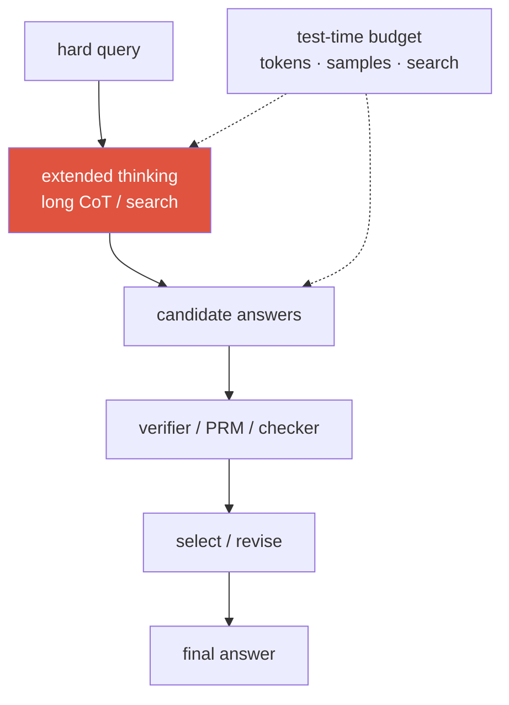
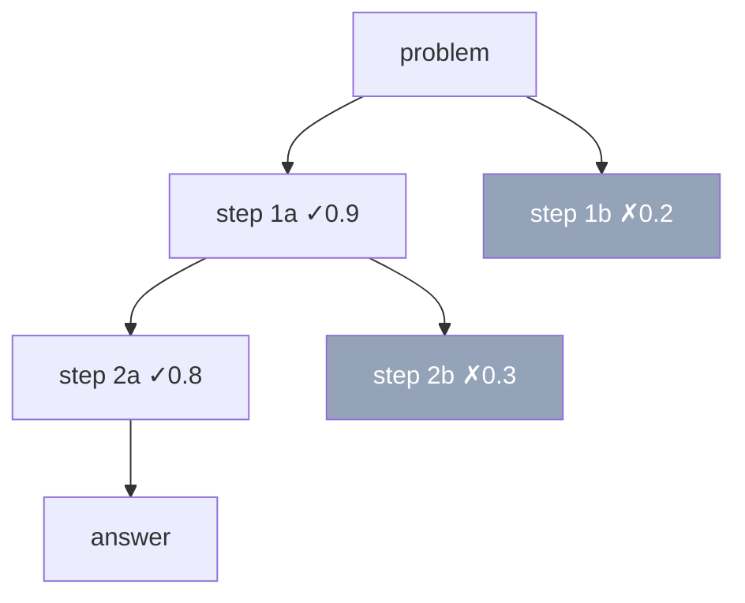
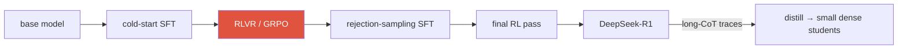

# Reasoning & Test-Time Compute 2026-current

long CoTtest-time scalingRLVRGRPOPRM vs ORMbest-of-NDeepSeek-R1

> [!TIP] 먼저 이렇게 말하라
> 이제 compute knob은 하나가 아니라 **둘**이다: *train-time*(pretraining + post-training)과 *test-time*(inference에서 모델이 얼마나 오래 생각하는가). 2025→2026 서사는, 고품질 데이터가 희소해지면서 한계 payoff가 **inference에 compute를 쓰는 쪽**으로 — 더 긴 chain-of-thought, sampling, verifier-guided search — 그리고 그 compute를 잘 쓰도록 가르치는 **RL with verifiable rewards** 쪽으로 옮겨갔다는 것이다. "search는 policy를 *증폭*하고, RL은 증폭되는 policy를 *개선*한다"고 말하면 이 장 전체를 프레이밍한 것이다.

## 1 · Long chain-of-thought

CoT = 답 이전에 중간 reasoning token을 생성한다. 세 세대: **few-shot CoT**(exemplar에 reasoning 포함), **zero-shot**("let's think step by step"), 그리고 **learned long CoT** — post-training이 모델로 하여금 backtracking을 포함한 긴 self-verifying trace를 *네이티브로* 생성하게 만든다("wait, that's wrong, let me reconsider").

왜 도움이 되는가(메커니즘, 가설로 진술): Transformer의 forward pass는 **고정된 serial depth**를 갖는다. CoT는 **serial computation을 token 스트림으로 펼치고**, 모델이 자기 중간 결과를 다시 읽게 하며, 부분적 self-correction의 여지를 만든다. 2024→2026에 바뀐 것은 *규모와 출처*다: o1 스타일 모델은 prompt된 CoT보다 몇 자릿수 긴 trace를 생성하고, prompting이 아니라 RL로 학습한다.

> [!WARNING] Faithfulness ≠ correctness
> CoT는 유창하고 자신감 있지만 답의 실제 원인이 *아닐* 수 있다. 보이는 trace가 mechanistic 설명이라고 주장하지 마라 — 그것은 계산과 상관된 *sample*이다. 이 구분(faithful vs plausible CoT)은 즐겨 파고드는 지점이다.

## 2 · Test-time compute as a scaling axis

**Snell et al. (2024)** *(verifiable)* 가 기준 인용이다: **고정된** 모델에서 inference compute를 최적으로 배분하면(더 긴 CoT, best-of-N, verifier search) 그 compute로 더 큰 모델을 학습하는 것을 이길 수 있다 — 어떤 문제에서는 큰 차이로. 이것은 inference를 *그 자체로 하나의 scaling law*로 재구성한다.

<figure>
<svg viewBox="0 0 640 220" xmlns="http://www.w3.org/2000/svg" font-family="Inter, sans-serif" font-size="12">
  <line x1="60" y1="185" x2="600" y2="185" stroke="#98a3b2" stroke-width="1.5"/>
  <line x1="60" y1="185" x2="60" y2="25" stroke="#98a3b2" stroke-width="1.5"/>
  <text x="330" y="210" text-anchor="middle" fill="#6b7686">inference compute (tokens · samples), log scale</text>
  <text x="20" y="105" text-anchor="middle" fill="#6b7686" transform="rotate(-90 20 105)">accuracy</text>
  <path d="M60 175 C 180 150, 300 90, 420 60 S 560 40, 600 38" fill="none" stroke="#e0533f" stroke-width="2.5"/>
  <text x="470" y="55" fill="#e0533f">test-time scaling</text>
  <path d="M60 175 C 200 168, 380 150, 600 130" fill="none" stroke="#6366f1" stroke-width="2" stroke-dasharray="5 4"/>
  <text x="470" y="150" fill="#6366f1">diminishing returns</text>
  <text x="150" y="120" fill="#6b7686">gains taper: base-model ceiling,</text>
  <text x="150" y="138" fill="#6b7686">verifier quality, wasted search</text>
</svg>
<figcaption>정확도는 inference compute와 함께 오르다가 평평해진다. 상한은 base 모델의 역량, verifier의 품질, 그리고 나쁜 경로를 탐색하며 낭비되는 compute의 양이 정한다.</figcaption>
</figure>

**레버, 저렴한 순서로:** (1) 더 긴 thinking; (2) **self-consistency** — $N$개 trace를 sample해 답을 majority-vote; (3) **best-of-N** — $N$개 sample 후 verifier로 top을 선택; (4) **search** — value 추정과 함께 reasoning state에 대한 tree/beam; (5) **revision loop** — draft → critique → improve. 제품은 이것을 **"thinking budget"** / **"effort"** knob으로 노출하고, 핵심 운영 통찰은 **adaptivity**다: 모든 query가 최대 thinking을 받을 자격이 있는 건 아니다 — 2026년의 뜨거운 주제는 *얼마나 오래 생각할지*를 결정하는 controller다.

> [!QUESTION] 2026년에 나올 법한 질문
> "고정된 FLOP 예산이 있다 — pretraining을 더, RLVR을 더, 아니면 test-time compute를 더?" **답변 골격:** *배포* 프로파일에 달렸다. pretraining은 상한을 올리지만 data-wall에 묶이고 모든 query에 걸쳐 분할 상환된다. test-time compute는 **query마다** 지불하므로, 정확도가 한계 지출만큼 값어치가 있고 추가 sample을 추가 정확도로 바꿔줄 verifier나 majority 신호가 있는 곳에서만 말이 된다. 2026 프레이밍(*Test-Time Scaling Makes Overtraining Compute-Optimal*, *Kinetics* 같은 AREA-10 논문)은 **inference cost를 scaling objective에 접는다**: 저렴한 serving을 위해 작은 모델을 overtrain한 뒤, 어려운 tail에서 test-time compute를 올린다. "query 난이도 분포와 serving 경제학으로 결정되는, 세 축에 걸친 portfolio 배분"이라고 말하라.

Self-consistency vs best-of-N — 각각 언제 이기나?

**짧게:** self-consistency(majority vote)는 **verifier가 필요 없고** 답이 discrete하고 추출 가능한 값일 때 빛난다. best-of-N은 **좋은 verifier/RM**이 필요하지만 open-ended 출력을 다루고 강한 scorer를 활용할 수 있다.

**깊게:** self-consistency $\hat a=\arg\max_a\sum_i \mathbf 1[\text{answer}(r_i)=a]$는 (a) vote할 정규 답이 없는 open-ended 생성과 (b) **체계적으로** 틀린 reasoning에서 실패한다 — 모델이 같은 오답에 자신 있게 vote한다("self-consistent wrong"). best-of-N은 verifier의 사각지대를 물려받고 **verifier hacking**을 부른다. 둘 다 $N$에 대해 **수확 체감**을 보이므로(대략 로그), 예산 상한 변형과 agreement/confidence 기반 early-stopping이 표준이다.

**후속 질문:** PRM은 search를 ORM과 어떻게 다르게 re-rank하나? · 왜 majority vote가 MATH에서 single greedy CoT를 이기나? · 더 긴 trace의 $N{=}1$이 짧은 것 $N$개보다 나은 때는?

## 3 · PRM vs ORM

reasoning을 어떻게 *채점*하나? 두 철학, **"Let's Verify Step by Step"** (Lightman et al., 2023) *(verifiable)* 에서 — **process** supervision이 MATH에서 **outcome** supervision을 이김을 보였고 **PRM800K**(~800K step-level human label)를 공개했다.

| | **ORM** (Outcome RM) | **PRM** (Process RM) |
| --- | --- | --- |
| 채점 대상 | 최종 답만 | 모든 reasoning **step** |
| Credit assignment | sparse(trace당 신호 하나) | dense(오류를 국소화) |
| Label 비용 | 저렴(답만 확인) | 비쌈(각 step을 label) |
| Search 사용 | 완성된 trace를 rank | search 도중 step별로 guide/prune |
| 위험 | "정답, 틀린 reasoning"을 보상 | step label이 noisy; game될 수 있음 |

> [!QUESTION] 2026년에 나올 법한 질문
> "PRM인가 ORM인가 — step-level supervision은 언제 labeling 비용을 감당할 값어치가 있나?" **답:** PRM은 하나의 outcome 신호로 실수를 국소화할 수 없고 **search를 일찍 prune**하고 싶은 **긴 multi-step** 문제에서 값어치가 있다. 하지만 label하기 비싸고 noisy하다. 많은 task에서는 **ORM + best-of-N 또는 self-consistency**가 강하고 저렴한 baseline이다. 현대 관행은 human labeling을 피하려고 process reward를 auto-label한다(예: 한 step이 정답에 *이를 수 있는지*를 추정하는 Monte-Carlo rollout). *Let's Verify Step by Step* / PRM800K를 인용하라.

### Verifier-guided search

PRM은 생성을 **guided search**로 바꾼다: 각 step에서 후보 next-step 몇 개를 확장하고, PRM으로 채점해, 유망한 frontier는 유지하고 나머지는 prune한다 — reasoning state에 대한 beam search나 MCTS. dead branch를 일찍 죽이므로 trace 전체를 sample하는 것보다 저렴하다.

관건은 **process reward의 auto-labeling**이다(human step label은 scale되지 않는다): step의 가치를 Monte-Carlo로 추정한다 — 그 step에서 여러 completion을 rollout해 얼마나 자주 정답에 도달하는지 측정한다. 이것이 PRM800K 규모의 human annotation 없이 PRM을 학습하는 방법이며, rollout compute와 label noise가 대가다.

## 4 · RLVR and GRPO — teaching a model to reason

**RLVR (RL with verifiable rewards)** — **Tülu 3** (Ai2, 2024)가 만든 용어 *(verifiable)* — 는 *학습된* reward model을 **deterministic verifier**로 바꾼다: math 답 정확 → 1, code가 test 통과 → 1, 아니면 0. reward가 프로그램적이므로 preference 모델보다 훨씬 덜 reward-hackable하다 — 하지만 정확성을 확인할 수 있는 곳(math, code, tool-use)에만 적용된다.

**GRPO**는 RLVR을 scale시킨 알고리즘이다(메커니즘 세부는 [Alignment](#/llm/alignment)에): **group** $G$개 completion을 sample하고, **group-mean reward를 critic-free baseline**으로 쓰며, normalize된 advantage $\hat A_i=(r_i-\text{mean})/\text{std}$로 업데이트한다. value 네트워크가 없어 — sparse binary reward에 더 저렴하고 안정적이다.

> [!QUESTION] 2026년에 나올 법한 질문
> "RLVR을 RLHF와 대조하라 — 왜 verifiable reward가 reasoning에서 이겼고, 어디서 무너지나?" **답:** RLHF는 human preference의 *학습된* reward model을 최적화한다 — dense 신호지만 **hackable**하고(sycophancy, length bias) PPO에서 critic이 필요하다. RLVR은 확인 가능한 도메인에서 *프로그램적 verifier*를 최적화한다 — reward를 같은 방식으로 game할 수 없고, GRPO와 함께면 critic조차 필요 없다. **무너지는** 곳: (a) **non-verifiable / open-ended** task(ground-truth 확인 없음 → rubric/generative reward model이라는 열린 문제), (b) **noisy verifier**(불안정한 test suite가 reward noise를 주입), (c) **verifier 자체의 reward gaming**(답 하드코딩, harness bug 악용). 그래서 RLVR은 math/code/tool-use를 지배하고, preference 방법은 여전히 주관적 품질을 소유한다.

## 5 · DeepSeek-R1 — the landmark demonstration

**DeepSeek-R1** (arXiv Jan 2025; 이후 *Nature* 2025) *(verifiable)* 은 가장 많이 인용되는 open reasoning 결과다:

<dl class="kv">
<dt>R1-Zero</dt><dd>base 모델에 <b>순수 RL, SFT 없이</b> 강한 reasoning을 유도했고 — 유명하게 — 모델이 스스로 re-verify하고 backtrack하는 법을 배우는 emergent "aha moment"가 나왔다. reasoning 행동이 <i>RL만으로 이끌어낼 수 있다</i>는 proof-of-concept.</dd>
<dt>R1 (출시된 레시피)</dt><dd>가독성을 위한 약간의 <b>cold-start SFT</b> → 대규모 <b>RLVR with GRPO</b> → rejection-sampling SFT → 최종 RL pass. cold-start가 R1-Zero의 language-mixing과 formatting을 고친다.</dd>
<dt>CoT distillation</dt><dd>R1의 long-CoT trace로 <b>작은 dense</b> 모델을 fine-tune. 결과: reasoning 능력의 상당 부분이 RL을 돌리지 <i>않고도</i> 7B–70B student로 전이된다 — 저렴하고, trace 자체가 신호의 대부분을 담고 있다는 강한 논거.</dd>
</dl>

## 6 · CoT distillation

teacher의 long-CoT trace로 student를 학습한다(답만이 아니라 *reasoning*에 supervise). reasoning을 저렴하게 전이하고, 작은 on-device reasoner에 힘을 주며, 모델마다 RL을 돌리는 불안정성/비용을 피한다. 단서: student는 teacher의 **실수와 unfaithful trace**를 물려받고, 보통 teacher의 상한에서 정체된다 — distillation은 이끌어낼 뿐 발견하지 않는다.

long CoT를 작은 모델로 distill할까, 아니면 작은 모델에 직접 RLVR을 돌릴까?

**짧게:** 먼저 distill하라 — 극적으로 저렴하고, DeepSeek-R1은 7B–70B dense student로의 distillation이 그 student에 직접 RL을 돌리는 것을 종종 **이김**을 보였다.

**깊게:** 작은 base에 대한 RL은 sample을 많이 먹고 불안정한데, base가 reward를 받을 정답 long trace를 좀처럼 우연히 만들지 못하기 때문이다(sparse-reward cold-start). 강한 teacher의 trace는 *좋은* reasoning에 대한 dense supervised 신호를 student에게 건네므로, SFT-on-traces가 compute의 일부로 이득의 대부분을 얻는다. RL-on-small 경로는 주로 (a) 적절한 teacher가 없거나, (b) verifiable 도메인에서 가용 teacher를 *넘어서는* 역량을 원할 때 값어치가 있다. 실전에서는: distill로 bootstrap한 뒤, 선택적으로 가벼운 RL pass로 날카롭게 한다.

**후속 질문:** 왜 student가 teacher의 상한에서 정체되나? · unfaithful trace를 distill하면 해로운가? · distillation 전에 teacher trace를 어떻게 필터링하겠나?

## 7 · The open debate — new skills vs eliciting latent ability

진정으로 *미해결*인 질문이자, 논쟁적이라고 붙들면 성숙함의 신호:

"RL elicits latent ability"

- NeurIPS 2025 계열은 RLVR이 대체로 base 모델이 *이미* 할 수 있는 것을 **날카롭게/sample**할 뿐이라고 주장한다 — 큰 k의 pass@k가 base 대비 거의 나아지지 않음 *(보고됨)*
- distillation이 그렇게 잘 되는 것은 base가 이미 reasoning을 "담고 있음"을 시사
- RL은 출력 분포를 이미 도달 가능한 좋은 trace 쪽으로 좁힘

"RL creates new capability"

- R1-Zero의 emergent self-verification은 RL 이전에 명백히 존재하지 않았음
- 어려운 verifiable task에 대한 지속적 RL은 *도달 가능한* 해법 길이를 늘리는 것으로 보임
- "new"를 어떻게 측정하느냐(pass@1 vs pass@k, in- vs out-of-distribution)에 크게 의존

> [!NOTE] 방 안에서 이렇게 말하라
> "논쟁 중입니다. 가장 강한 증거는 RLVR이 완전히 새로운 기술을 발명하기보다 latent 능력을 **이끌어내고 신뢰할 수 있게 만든다**는 것이지만, 지표에 달렸고, 확정하기 전에 pass@k 곡선과 out-of-distribution 전이를 보고 싶습니다." (어느 쪽으로든) 정리된 문제로 취급하는 것이 junior의 표시다.

## 8 · Failure modes & the vision angle

**실패:** 쉬운 query에 compute 낭비; self-consistent-but-wrong; 장황하고 unfaithful한 CoT; 나쁜 heuristic에서 오는 search 근시안; 무한정 thinking으로 인한 SLO/latency 폭발. **해법:** adaptive budget을 구동하는 difficulty estimator; escalate하는 cheap-model-first cascade; confidence/agreement/verifier-pass에서 중단.

**multimodal** reasoning에서 "think more"는 흔히 "**perceive more**"를 뜻한다 — re-crop, re-segment, specialist 호출, 여러 hypothesis 매칭 — 텍스트를 더 뱉는 게 아니라. **specialist vision tool**에 test-time compute를 쓰는 것(각 search node가 perception action)이 하나의 end-to-end VLM에서의 긴 독백보다 region grounding에 더 sample-효율적일 수 있다. 그것이 [Visual Reasoning Agents](#/vlm/visual-agents)와 [Agentic AI & Tool Use](#/llm/agents)로 가는 다리다.

## Cheat-sheet

| 질문 | 한 줄 요약 |
| --- | --- |
| Long CoT | serial computation을 token으로 펼침; 학습된 trace가 self-verify/backtrack |
| Test-time scaling | Snell 2024: 고정 모델 + 더 많은 inference compute가 더 큰 모델을 이길 수 있음 |
| Self-consistency | $N$개 sample, majority-vote; verifier 불필요; discrete 답만 |
| Best-of-N | $N$개 sample, verifier로 top 선택; 좋은 scorer 필요; verifier hacking 위험 |
| PRM vs ORM | step 채점(dense, 비쌈, search prune) vs 최종 답(sparse, 저렴) — *Let's Verify* / PRM800K |
| RLVR | deterministic verifier reward; robust하지만 정확성을 확인할 수 있는 곳에만(Tülu 3) |
| GRPO | critic-free RL; group-mean baseline; RLVR의 주력 |
| DeepSeek-R1 | 순수 RL R1-Zero "aha" → cold-start + GRPO 레시피 → 작은 모델로 CoT distillation |
| Open debate | RLVR은 새 능력을 *만들기*보다 *latent를 이끌어낼* 가능성이 높음 — 논쟁 중 |

## Related

[LLM Fundamentals](#/llm/fundamentals) · [Post-Training & Alignment](#/llm/alignment) · [Agentic AI & Tool Use](#/llm/agents) · [Visual Reasoning Agents](#/vlm/visual-agents) · [Evaluation Metrics](#/foundations/evaluation-metrics) · [The 2026 Landscape](#/start/landscape-2026)
