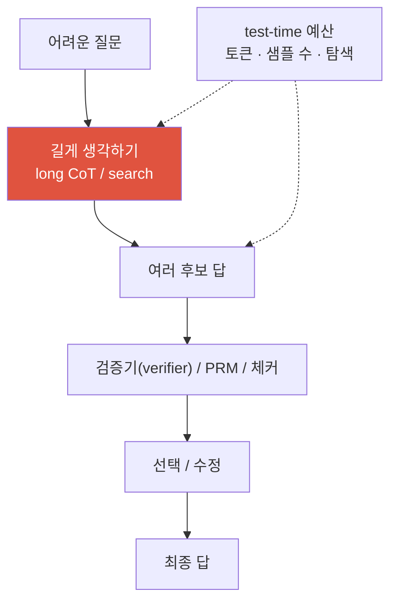
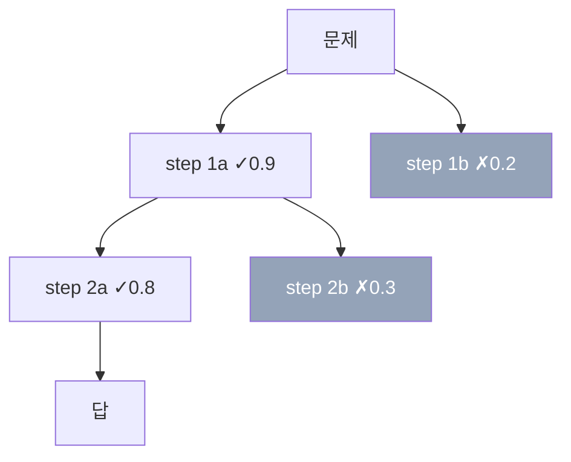
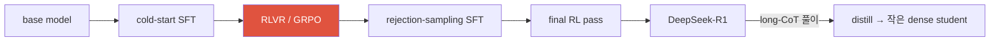

# Reasoning & Test-Time Compute <span class="badge badge-2026">2026-current</span>

<div class="tag-row"><span class="tag">long CoT</span><span class="tag">test-time scaling</span><span class="tag">RLVR</span><span class="tag">GRPO</span><span class="tag">PRM vs ORM</span><span class="tag">best-of-N</span><span class="tag">DeepSeek-R1</span></div>

> [!NOTE] 이 챕터의 목표
> "생각하는(reasoning) 모델"과 **test-time compute**를 잡습니다. 핵심은 추론 시 토큰·샘플·탐색 예산을 늘리면 일부 어려운 과제에서 정확도를 높일 수 있다는 것입니다. 더 긴 출력이 항상 더 좋은 것은 아니며, base policy·verifier·문제 난이도가 이득을 결정합니다.

## 무엇을, 왜

일반적인 autoregressive LLM도 답을 만들며 내부 hidden state와 출력 token을 통해 여러 계산 단계를 거칠 수 있습니다. 다만 별도 탐색·검증 예산 없이 한 경로를 생성하면 어려운 multi-step 문제에서 오류를 회복하기 어렵습니다.

**reasoning 모델**은 학습과 serving 단계에서 더 큰 추론 예산을 쓰도록 설계됩니다. 내부적으로 긴 reasoning trace, sampling, tool/search, 검증·수정 등을 사용할 수 있지만 API가 원시 chain-of-thought를 그대로 노출한다는 뜻은 아닙니다. 사용자에게는 보통 최종 답과 간결한 근거만 제공됩니다.

여기서 큰 전환이 하나 나옵니다. 이제 연산(compute)을 쓸 수 있는 **손잡이(knob)가 둘**입니다.

- **train-time(학습 때)**: 파라미터·데이터·연산을 늘리기 — 전통적인 scaling
- **test-time(답할 때)**: **추론하는 순간** 모델이 얼마나 오래/여러 번 생각하는지 — 더 긴 CoT, 여러 번 샘플링, 검증 기반 탐색

일부 문제·난이도 구간에서는 **고정된 작은 모델에 test-time 연산을 적절히 배분한 결과가 더 큰 모델의 단일 시도보다 좋을 수 있습니다.** 보편적 우위가 아니라 compute allocation의 선택지입니다. 어떻게 여러 풀이를 뽑는지는 [디코딩 & 샘플링](#/llm/decoding-sampling), RL 학습 세부는 [RL 기초 프라이머](#/llm/rl-primer)와 [Post-Training & Alignment](#/llm/alignment)에서 이어집니다.

> [!TIP] 면접 한 줄
> "이제 compute knob은 train-time뿐 아니라 **test-time**에도 있다. 더 긴 CoT, sampling, verifier-guided search와 이를 학습하는 RLVR 중 어디에 예산을 둘지는 task·policy·verifier·serving cost에 달렸다. Search는 현재 policy의 후보를 탐색하고, RL은 이후 policy 분포 자체를 바꾼다는 차이를 먼저 말하자."



## 1 · Long chain-of-thought (긴 사고 사슬)

**CoT(사고 사슬)** = 답 이전에 중간 reasoning 토큰을 생성하는 것. 세 세대로 발전했습니다:

- **few-shot CoT**: 예시(exemplar) 안에 풀이 과정을 넣어 흉내 내게 함
- **zero-shot CoT**: 그냥 "단계별로 생각해 보자(let's think step by step)"라고 시킴
- **learned long CoT**: post-training 뒤 모델이 backtracking처럼 보이는 더 긴 reasoning trace를 생성하는 계열 — o1/R1 스타일. 이런 언어가 실제 검증이나 faithful self-correction을 보장하지는 않습니다.

**왜 도움이 될 수 있나 (직관):** 한 forward step의 network depth는 고정되어 있지만, autoregressive token을 더 생성하면 이전 중간 결과를 다음 step의 입력으로 재사용할 수 있습니다. CoT는 이 추가 직렬 계산과 외부 scratch space를 제공해 탐색·수정의 여지를 만듭니다. 다만 trace 길이와 학습 recipe는 공개 범위가 모델마다 다르고, 더 긴 trace 자체가 더 깊거나 올바른 계산의 증거는 아닙니다.

> [!WARNING] 유창함(faithfulness) ≠ 정답(correctness)
> CoT는 유창하고 자신감 있어 보여도, 실제로 답을 만든 원인이 *아닐* 수 있습니다. 보이는 풀이가 모델 내부의 진짜 계산 설명이라고 단정하지 마세요 — 계산과 상관된 하나의 *샘플*일 뿐입니다. "faithful(충실한) vs plausible(그럴듯한) CoT"의 구분은 면접에서 즐겨 파고드는 지점입니다.

## 2 · 하나의 scaling 축이 된 test-time compute

**Snell et al. (2024)** 가 기준 인용입니다. 고정된 모델에서 inference compute를 문제 난이도에 맞게 배분하면, 연구가 평가한 일부 설정에서 더 큰 모델의 단일 시도를 이길 수 있었습니다. 이는 “같은 연산으로 더 큰 모델을 학습하는 것보다 항상 낫다”는 보편 법칙이 아니라, policy와 verifier 품질에 조건부인 결과입니다.

<figure>
<svg viewBox="0 0 640 220" xmlns="http://www.w3.org/2000/svg" font-family="Inter, sans-serif" font-size="12">
  <line x1="60" y1="185" x2="600" y2="185" stroke="#98a3b2" stroke-width="1.5"/>
  <line x1="60" y1="185" x2="60" y2="25" stroke="#98a3b2" stroke-width="1.5"/>
  <text x="330" y="210" text-anchor="middle" fill="#98a3b2">inference compute (토큰 · 샘플 수), 로그 스케일</text>
  <text x="20" y="105" text-anchor="middle" fill="#98a3b2" transform="rotate(-90 20 105)">정확도</text>
  <path d="M60 175 C 180 150, 300 90, 420 60 S 560 40, 600 38" fill="none" stroke="#e0533f" stroke-width="2.5"/>
  <text x="470" y="55" fill="#e0533f">test-time scaling</text>
  <path d="M60 175 C 200 168, 380 150, 600 130" fill="none" stroke="#6366f1" stroke-width="2" stroke-dasharray="5 4"/>
  <text x="470" y="150" fill="#6366f1">수확 체감</text>
  <text x="150" y="120" fill="#98a3b2">상한: base 모델 역량,</text>
  <text x="150" y="138" fill="#98a3b2">verifier 품질, 낭비되는 탐색</text>
</svg>
<figcaption>일부 task에서 관찰되는 수확 체감의 개념도입니다. 정확도는 compute에 단조 증가하지 않을 수 있으며, base policy·sampling/search·verifier·문제 난이도가 곡선을 결정합니다.</figcaption>
</figure>

**연산을 쓰는 대표 레버**는 다음과 같습니다. 아래 순서는 개념적 복잡도일 뿐, 실제 비용과 정확도 순위는 task·batching·verifier에 따라 달라집니다:

1. **더 길게 thinking** — CoT token budget을 늘림 (별도 verifier가 없을 수도 있음)
2. **self-consistency(자기 일관성)** — $N$개의 풀이를 샘플해 **답을 다수결(majority vote)** 로 고름 (verifier 불필요)
3. **best-of-N** — $N$개 샘플 후 **verifier(검증기)로 최고를 선택**
4. **search(탐색)** — reasoning 상태에 대한 tree/beam 탐색 + 가치 추정

거기에 **revision loop(초안 → 비평 → 개선)** 를 어느 단계에든 얹을 수 있습니다.

<figure>
<svg viewBox="0 0 640 270" xmlns="http://www.w3.org/2000/svg" font-family="Inter, sans-serif" font-size="12">
  <line x1="60" y1="235" x2="620" y2="235" stroke="#98a3b2" stroke-width="1.5"/>
  <line x1="60" y1="235" x2="60" y2="20" stroke="#98a3b2" stroke-width="1.5"/>
  <text x="340" y="258" text-anchor="middle" fill="#98a3b2">→ 더 많은 test-time 연산 (더 비쌈)</text>
  <text x="22" y="128" text-anchor="middle" fill="#98a3b2" transform="rotate(-90 22 128)">역량 ↑</text>
  <!-- rising staircase steps -->
  <g stroke-width="0">
    <rect x="80"  y="180" width="120" height="55" rx="6" fill="#12a150" opacity="0.9"/>
    <rect x="210" y="140" width="120" height="95" rx="6" fill="#0ea5e9" opacity="0.9"/>
    <rect x="340" y="95"  width="120" height="140" rx="6" fill="#6366f1" opacity="0.9"/>
    <rect x="470" y="45"  width="120" height="190" rx="6" fill="#e0533f" opacity="0.95"/>
  </g>
  <g fill="#fff" text-anchor="middle" font-size="11" font-weight="700">
    <text x="140" y="205">① 더 긴 CoT</text>
    <text x="270" y="175">② self-consistency</text>
    <text x="400" y="140">③ best-of-N</text>
    <text x="530" y="90">④ search</text>
  </g>
  <g fill="#fff" text-anchor="middle" font-size="9.5">
    <text x="140" y="222">verifier 불필요</text>
    <text x="270" y="192">다수결</text>
    <text x="400" y="157">verifier로 선택</text>
    <text x="530" y="107">tree/beam + 가치</text>
    <text x="530" y="122">prune</text>
  </g>
  <!-- dashed climb line -->
  <path d="M140 180 L270 140 L400 95 L530 45" fill="none" stroke="currentColor" stroke-width="1.6" stroke-dasharray="4 4" opacity="0.6"/>
</svg>
<figcaption>test-time compute의 대표 레버입니다. 오른쪽으로 갈수록 후보·상태 관리가 복잡해지지만, 항상 더 정확하거나 더 비싼 고정 순서는 아닙니다. ③④는 특히 verifier 품질에 민감합니다.</figcaption>
</figure>

가장 흔한 (2)번 self-consistency를 그림으로 보겠습니다. 같은 질문에 온도(temperature)를 높여 서로 다른 풀이를 여러 개 뽑고([디코딩 & 샘플링](#/llm/decoding-sampling)의 N개 샘플링 참고), 나온 **답들 중 가장 많이 나온 것**을 고릅니다.

<figure>
<svg viewBox="0 0 640 220" xmlns="http://www.w3.org/2000/svg" font-family="Inter, sans-serif" font-size="12">
  <rect x="20" y="90" width="90" height="40" rx="8" fill="#6366f1"/>
  <text x="65" y="114" text-anchor="middle" fill="#fff">질문</text>
  <!-- N sampled traces -->
  <g font-size="11">
    <path d="M110 105 C 150 40, 190 40, 230 40" fill="none" stroke="#98a3b2" stroke-width="1.3" marker-end="url(#ra)"/>
    <path d="M110 108 C 150 85, 190 85, 230 85" fill="none" stroke="#98a3b2" stroke-width="1.3" marker-end="url(#ra)"/>
    <path d="M110 112 C 150 130, 190 130, 230 130" fill="none" stroke="#98a3b2" stroke-width="1.3" marker-end="url(#ra)"/>
    <path d="M110 118 C 150 175, 190 175, 230 175" fill="none" stroke="#98a3b2" stroke-width="1.3" marker-end="url(#ra)"/>
    <rect x="232" y="26" width="150" height="26" rx="5" fill="none" stroke="#12a150" stroke-width="1.4"/><text x="240" y="43" fill="currentColor">풀이 1 → 답 = 42</text>
    <rect x="232" y="72" width="150" height="26" rx="5" fill="none" stroke="#12a150" stroke-width="1.4"/><text x="240" y="89" fill="currentColor">풀이 2 → 답 = 42</text>
    <rect x="232" y="117" width="150" height="26" rx="5" fill="none" stroke="#e0533f" stroke-width="1.4"/><text x="240" y="134" fill="currentColor">풀이 3 → 답 = 17</text>
    <rect x="232" y="162" width="150" height="26" rx="5" fill="none" stroke="#12a150" stroke-width="1.4"/><text x="240" y="179" fill="currentColor">풀이 4 → 답 = 42</text>
  </g>
  <path d="M388 100 H430" stroke="#98a3b2" stroke-width="1.5" marker-end="url(#ra)"/>
  <text x="409" y="92" text-anchor="middle" fill="#98a3b2" font-size="10">다수결</text>
  <rect x="432" y="80" width="180" height="40" rx="8" fill="#12a150"/>
  <text x="522" y="98" text-anchor="middle" fill="#fff" font-size="11">답 = 42 (4표 중 3표)</text>
  <text x="522" y="113" text-anchor="middle" fill="#fff" font-size="10">verifier 없이도 동작</text>
  <defs><marker id="ra" markerWidth="8" markerHeight="8" refX="6" refY="3" orient="auto"><path d="M0 0 L6 3 L0 6" fill="#98a3b2"/></marker></defs>
</svg>
<figcaption>self-consistency(자기 일관성): 같은 질문을 여러 번 풀게 해서 나온 답들을 다수결. 검증기(verifier) 없이도 되며, 답이 뽑아낼 수 있는 이산 값(숫자·선택지)일 때 특히 강력합니다.</figcaption>
</figure>

일부 제품/API는 이를 **"thinking budget" / "effort"** 같은 손잡이로 노출합니다. 운영상 중요한 문제는 **adaptivity**입니다. query 난이도·불확실성·SLA에 따라 예산을 배분하는 controller가 유용할 수 있지만, controller overhead와 잘못된 early exit도 함께 평가합니다.

> [!QUESTION] 2026년에 나올 법한 질문
> "고정된 FLOP 예산이 있다 — pretraining을 더, RLVR을 더, 아니면 test-time compute를 더?" **답변 골격:** *배포* 프로파일에 달렸다. pretraining은 상한을 올리지만 data-wall에 묶이고 모든 query에 분할 상환된다. test-time compute는 **query마다** 지불하므로, 추가 샘플을 정확도로 바꿔줄 verifier나 majority 신호가 있는 곳에서만 값어치가 있다. 2026 프레이밍은 **inference cost를 scaling 목표에 접는다**: 저렴한 serving을 위해 작은 모델을 overtrain한 뒤, 어려운 tail에서만 test-time compute를 올린다. "query 난이도 분포와 serving 경제학으로 결정되는, 세 축에 걸친 portfolio 배분"이라고 답하라.

<details class="qa"><summary>Self-consistency vs best-of-N — 각각 언제 이기나?</summary>
<div class="qa-body">

**짧게:** self-consistency(다수결)는 **verifier가 필요 없고** 답이 이산적이고 추출 가능할 때 빛난다. best-of-N에는 <strong>좋은 verifier/보상모델(RM)</strong>이 필요하지만 open-ended 출력을 다루고 강한 scorer를 활용할 수 있다.

**깊게:** self-consistency $\hat a=\arg\max_a\sum_i \mathbf 1[\text{answer}(r_i)=a]$는 (a) 다수결할 정규 답이 없는 open-ended 생성과 (b) **체계적으로** 틀린 reasoning에서 실패합니다. best-of-N은 verifier의 사각지대를 물려받고 반복 최적화 시 verifier gaming을 유발할 수 있습니다. $N$의 한계 이득은 task와 sample 상관에 따라 달라지므로, quality–cost curve에서 상한과 agreement/verifier 기반 early stop을 정하세요.

**후속 질문:** PRM은 search를 ORM과 어떻게 다르게 re-rank하나? · 왜 다수결이 MATH에서 single greedy CoT를 이기나? · 더 긴 trace의 $N{=}1$이 짧은 것 $N$개보다 나은 때는?
</div></details>

## 직접 돌려보기 — self-consistency 다수결

self-consistency의 심장은 사실 한 줄입니다: **여러 풀이가 내놓은 답들 중 가장 많이 나온 것(mode, 최빈값)을 고르기.** 아래 **라이브 에디터**에서 `majority_vote`를 채우고 **▶ Run tests**를 눌러 보세요. 동점이면 먼저 등장한 답을 돌려줍니다. (막히면 **Solution**을 여세요. 첫 실행은 파이썬 런타임을 내려받아 잠깐 걸립니다.)

<div class="widget" data-widget="code">
<script type="application/json" class="code-config">
{"func":"majority_vote","packages":[],"starter":"def majority_vote(answers):\n    # answers: 여러 풀이(trace)가 내놓은 최종 답들의 리스트 (숫자 또는 문자열).\n    # 가장 많이 나온 답을 반환하세요 (self-consistency 다수결 = 최빈값).\n    # 동점이면 먼저 등장한 답을 반환.\n    pass","tests":[{"args":[[42,42,17,42]],"expect":42},{"args":[["a","b","b","c","b"]],"expect":"b"},{"args":[[1,1,2,2]],"expect":1},{"args":[[7]],"expect":7}],"solution":"def majority_vote(answers):\n    counts = {}\n    order = []\n    for a in answers:\n        if a not in counts:\n            counts[a] = 0\n            order.append(a)   # 첫 등장 순서 기록 (동점 tie-break)\n        counts[a] += 1\n    # order 순서로 훑으며 최다 득표를 고르면 동점 시 먼저 나온 답이 이김\n    return max(order, key=lambda a: counts[a])"}
</script>
</div>

세 번째 테스트가 핵심입니다: `[1,1,2,2]`는 1과 2가 2표씩 동점이지만 먼저 나온 `1`을 돌려줍니다. best-of-N으로 바꾸고 싶다면 이 다수결 대신 **각 답의 verifier 점수를 비교해 최고 점수(argmax)를 고르면** 됩니다 — 필요한 건 "카운트" 대신 "점수"뿐입니다.

## 3 · PRM vs ORM (풀이를 어떻게 채점하나)

reasoning을 채점하는 두 철학입니다. 둘 다 **보상 모델(RM, reward model — 답/풀이에 점수를 매기는 모델)** 이지만 채점 지점이 다릅니다. **"Let's Verify Step by Step"** (Lightman et al., 2023) *(verifiable)* 가 — **과정(process)** 감독이 MATH에서 **결과(outcome)** 감독을 이김을 보였고 **PRM800K**(~800K개의 step-level 사람 라벨) 데이터셋을 공개했습니다.

| | **ORM** (Outcome RM, 결과 보상) | **PRM** (Process RM, 과정 보상) |
| --- | --- | --- |
| 채점 대상 | 완성된 풀이 전체를 **최종 outcome** 기준으로 채점 | 모든 reasoning **step**(단계) |
| Credit assignment(공로 배분) | sparse(풀이당 신호 하나) | dense(오류를 국소화) |
| Label 비용 | 보통 풀이당 하나의 outcome label | 각 step label이라 대체로 더 비쌈 |
| Search 사용 | 완성된 풀이를 rank | 탐색 도중 step별로 guide/prune |
| 위험 | "정답, 틀린 reasoning"을 보상 | step label이 noisy; game될 수 있음 |

> [!QUESTION] 2026년에 나올 법한 질문
> "PRM인가 ORM인가 — step-level 감독은 언제 labeling 비용을 감당할 값어치가 있나?" **답:** PRM은 하나의 outcome 신호로 실수를 국소화하기 어렵고 **탐색을 일찍 prune**하고 싶은 긴 multi-step 문제에서 값어치가 있을 수 있습니다. 단 label이 비싸고 noisy합니다. **ORM + best-of-N 또는 self-consistency**를 budget-matched baseline으로 두고, 사람 step label·자동 checker·Monte-Carlo rollout value 중 어느 신호가 task에 맞는지 비교하세요.

### Verifier-guided search (검증기 기반 탐색)

**verifier(검증기)** 란 후보 풀이·단계에 점수를 내는 채점기입니다(규칙 기반 체커일 수도, 학습된 PRM/ORM일 수도). PRM은 각 step에서 후보를 확장하고 유망한 것만 남기는 beam search나 MCTS에 사용할 수 있습니다. dead branch를 일찍 자르면 연산을 아끼지만, branching과 반복 scoring 때문에 단순한 full-solution sampling보다 **더 비쌀 수도** 있으므로 같은 token/FLOP 예산에서 비교해야 합니다.



<details class="concept-code">
<summary>개념 코드로 보기</summary>

> 아래는 PRM-guided beam search의 구조를 보이는 **의사코드**입니다. verifier 점수는 진실 판정이 아니라 탐색용 proxy입니다.

```python
@no_grad()
def verifier_guided_search(problem, beam_width, branch_factor, max_steps):
    generator.eval(); verifier.eval()
    beam = [State(text="", score=0.0, tokens_used=0)]

    for _ in range(max_steps):
        candidates = []
        for state in beam:
            next_steps = generator.sample_steps(
                problem, state.text, n=branch_factor, temperature=0.8
            )
            for step in next_steps:
                if not syntax_and_budget_valid(step, state.tokens_used):
                    continue
                new_text = state.text + step
                process_score = verifier.score(problem, new_text).detach()
                candidates.append(State(new_text, state.score + process_score,
                                        state.tokens_used + token_count(step)))

        solved = [s for s in candidates if independent_checker_accepts(problem, s.text)]
        if solved:
            return best_by_checker_then_score(solved)
        beam = topk(candidates, k=beam_width, key=lambda s: s.score)

    return abstain_or_return_best(beam)  # verifier만 통과했다고 정답이라 단정하지 않음
```

</details>

관건은 **process reward의 auto-labeling**입니다. 한 step에서 여러 completion을 rollout해 얼마나 자주 최종 정답에 도달하는지로 그 상태의 **성공 가능성(value)** 을 Monte Carlo 추정할 수 있습니다. 이는 해당 step 자체의 논리적 정당성을 보장하는 label은 아닙니다. 잘못된 step 뒤에도 우연히 회복할 수 있고 올바른 step도 후속 실패로 낮은 값을 받을 수 있어, rollout 연산과 label noise를 함께 평가해야 합니다.

## 4 · RLVR & GRPO — "생각하는 법"을 가르치기

먼저 RL의 기초 용어(policy·reward·advantage 등)가 낯설면 [RL 기초 프라이머](#/llm/rl-primer)를 먼저 보세요.

**RLVR (RL with verifiable rewards, 검증 가능한 보상 RL)** 은 수학 answer match, code test, format·constraint checker처럼 결과를 자동 확인할 수 있는 reward를 쓰는 방식입니다. binary·결정론적일 수도 있지만 partial score, 여러 test, noisy verifier의 조합일 수도 있습니다. 정의·reward-hacking·적용 도메인은 [Post-Training & Alignment](#/llm/alignment)가 정식으로 다룹니다.

**GRPO (Group Relative Policy Optimization)** 는 한 prompt에서 여러 풀이를 샘플해 group-relative reward로 advantage를 추정하고 별도 learned critic을 제거합니다. critic 메모리를 줄이지만 rollout·reference·old policy 비용은 남고, zero-variance group·difficulty weighting·length bias 같은 문제가 있습니다. 공식과 후속 변형은 [Post-Training & Alignment](#/llm/alignment)가 canonical하게 다룹니다.

> [!QUESTION] 2026년에 나올 법한 질문
> "RLVR을 RLHF와 대조하라 — 어디서 유리하고 어디서 무너지나?" **답:** learned preference reward는 open-ended 품질을 다루지만 judge bias와 reward hacking에 취약합니다. RLVR의 program/test reward는 더 직접 감사할 수 있으나 **게임 불가능한 것은 아닙니다**. sparse/noisy test, 답 하드코딩, harness bug, hidden-case 누락을 악용할 수 있습니다. 따라서 math/code/tool-use에서는 강한 선택지이고, open-ended 품질에는 preference·human evaluation을 함께 씁니다.

## 5 · DeepSeek-R1 — 대표적 시연

**DeepSeek-R1** (arXiv 2025년 1월; 이후 *Nature* 2025) *(verifiable)* 은 가장 많이 인용되는 open reasoning 결과입니다:

<dl class="kv">
<dt>R1-Zero</dt><dd>base 모델에 <b>cold-start SFT 없이 RL</b>을 적용해 self-verification·backtracking처럼 보이는 행동과 긴 trace를 보고했습니다. 이른바 "aha moment"는 관찰된 행동에 대한 저자 표현이지, 완전히 새로운 능력이 생겼다는 독립적 증명은 아닙니다.</dd>
<dt>R1 (출시 레시피)</dt><dd>소량의 <b>cold-start data</b> → reasoning-oriented RL → rejection-sampling/SFT → 후속 RL. 저자는 cold-start data가 R1-Zero에서 관찰한 가독성·language-mixing 문제를 완화하도록 설계했다고 설명합니다.</dd>
<dt>CoT distillation</dt><dd>R1의 long-CoT 풀이로 <b>작은 dense</b> 모델을 fine-tune해 강한 전이를 보였습니다. 이는 trace supervision이 유용하다는 증거지만, 풀이가 학습 신호의 "대부분"을 담는다는 일반 결론까지 증명하지는 않습니다.</dd>
</dl>



## 6 · CoT distillation (사고 사슬 증류)

teacher의 long-CoT 풀이로 student를 학습합니다(답뿐 아니라 trace token에도 감독). RL rollout 없이 behavior를 전이하는 저렴한 bootstrap이 될 수 있지만, student는 teacher의 **실수와 unfaithful 풀이**도 물려받습니다. Student가 특정 benchmark에서 teacher를 넘을 수도 있으므로 "teacher 상한"을 법칙처럼 말하지 말고, teacher filtering·student base·추가 data/RL이 만든 효과를 분리하세요.

<details class="qa"><summary>long CoT를 작은 모델로 distill할까, 작은 모델에 직접 RLVR을 돌릴까?</summary>
<div class="qa-body">

**짧게:** 강한 teacher와 깨끗한 trace가 있으면 distillation은 좋은 bootstrap입니다. teacher가 없거나 student가 on-policy 실패를 직접 고쳐야 하면 RL이 필요하며, 어느 쪽이 우세한지는 모델·도메인·예산별로 비교합니다.

**깊게:** 작은 base가 reward-positive trace를 거의 만들지 못하면 on-policy RL은 sparse reward와 높은 rollout cost에 막힐 수 있습니다. 필터링된 teacher trace SFT는 더 dense한 token-level signal을 주지만 teacher distribution과 오류에 묶입니다. 동일한 student·data·총 compute에서 direct RL, distillation, distill→RL을 비교하고, pass@1/pass@k·OOD·cost를 함께 보세요.

**후속 질문:** 왜 student가 teacher 상한에서 정체되나? · unfaithful trace를 distill하면 해로운가? · distillation 전 teacher trace를 어떻게 필터링하겠나?
</div></details>

## 7 · 열린 논쟁 — 새 능력인가, 잠재 능력의 발현인가

진짜로 *미해결*인 질문이자, 논쟁적이라고 붙들면 성숙함의 신호입니다. (여기서 **pass@k**는 "한 문제에 $k$번 시도했을 때 그 안에 정답이 하나라도 있을 확률"입니다.)

<div class="proscons"><div><div class="pros-t">"RL은 잠재 능력을 발현시킬 뿐"</div>

- 일부 2025년 연구는 큰 $k$의 pass@k와 OOD 전이를 근거로 RLVR이 base model의 기존 성공 trace를 **재가중**하는 효과가 크다고 보고했습니다. 논문·model·평가 설정별 결과가 달라 일반 법칙으로 두지 않습니다.
- distillation이 그토록 잘 되는 것은 base가 이미 reasoning을 "담고 있음"을 시사
- RL은 출력 분포를 이미 도달 가능한 좋은 trace 쪽으로 좁힘

</div><div><div class="cons-t">"RL은 새 능력을 만든다"</div>

- R1-Zero에서 self-verification처럼 보이는 행동 빈도가 RL 뒤 증가했다는 보고
- 어려운 verifiable task에 대한 지속적 RL은 *도달 가능한* 해법 길이를 늘리는 것으로 보임
- "새롭다"를 어떻게 측정하느냐(pass@1 vs pass@k, in- vs out-of-distribution)에 크게 의존

</div></div>

> [!NOTE] 방 안에서 이렇게 말하라
> "무엇을 새 능력으로 정의하는지에 따라 결론이 달라집니다. pass@1만 오르고 큰-k pass@k나 OOD frontier가 그대로라면 재가중 설명이 강하고, 새로운 task family의 reachable frontier가 이동한다면 능력 확장 증거가 됩니다. 두 곡선과 data contamination을 보기 전에는 결론을 유보하겠습니다."

## 8 · 실패 모드 & vision 관점

**실패:** 쉬운 query에 연산 낭비; self-consistent-but-wrong(같은 오답에 자신 있게 다수결); 장황하고 unfaithful한 CoT; 나쁜 heuristic에서 오는 탐색 근시안; 무한정 thinking으로 인한 SLO/latency 폭발. **해법:** adaptive budget을 구동하는 난이도 추정기; escalate하는 cheap-model-first cascade; confidence/agreement/verifier-pass에서 중단.

**multimodal reasoning**에서는 "더 생각하기"에 "더 보기"를 포함할 수 있습니다 — re-crop, re-segment, specialist 호출, 여러 가설 매칭입니다. 전문 vision tool에 compute를 쓰는 방식과 end-to-end VLM의 추가 token을 같은 task 성공률·token/tool-call·latency 예산에서 비교하세요. 이것이 [Visual Reasoning Agents](#/vlm/visual-agents), [Agentic AI & Tool Use](#/llm/agents)로 가는 다리입니다.

## Cheat-sheet

| 질문 | 한 줄 요약 |
| --- | --- |
| Long CoT | serial 계산을 토큰으로 펼침; 학습된 풀이가 self-verify/backtrack |
| Test-time scaling | Snell 2024: 고정 모델 + 더 많은 inference compute가 더 큰 모델을 이길 수 있음 |
| 레버 사다리 | 긴 CoT · self-consistency · best-of-N · search; 고정된 품질/비용 순서는 없음 |
| Self-consistency | $N$개 샘플, 다수결(최빈값); verifier 불필요; 이산 답만 |
| Best-of-N | $N$개 샘플, verifier로 top 선택; 좋은 scorer 필요; verifier hacking 위험 |
| PRM vs ORM | step 채점(dense·비쌈·탐색 prune) vs 최종 답(sparse·저렴) — *Let's Verify* / PRM800K |
| RLVR | 자동 검증 가능한 reward; partial/noisy할 수 있고 harness gaming에 취약 |
| GRPO | critic-free RL; group-평균 baseline; RLVR의 주력 |
| DeepSeek-R1 | 순수 RL R1-Zero "aha" → cold-start + GRPO → 작은 모델로 CoT distillation |
| 열린 논쟁 | pass@1·pass@k·OOD frontier로 재가중과 능력 확장을 구분 |

**다음:** [디코딩 & 샘플링](#/llm/decoding-sampling) · [RL 기초 프라이머](#/llm/rl-primer) · [Post-Training & Alignment](#/llm/alignment) · [Agentic AI & Tool Use](#/llm/agents) · [Visual Reasoning Agents](#/vlm/visual-agents) · [LLM Fundamentals](#/llm/fundamentals)
