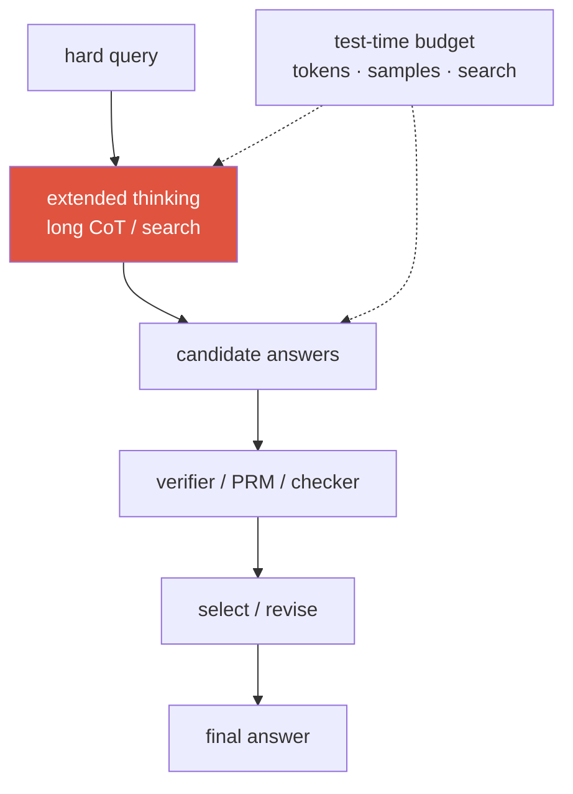
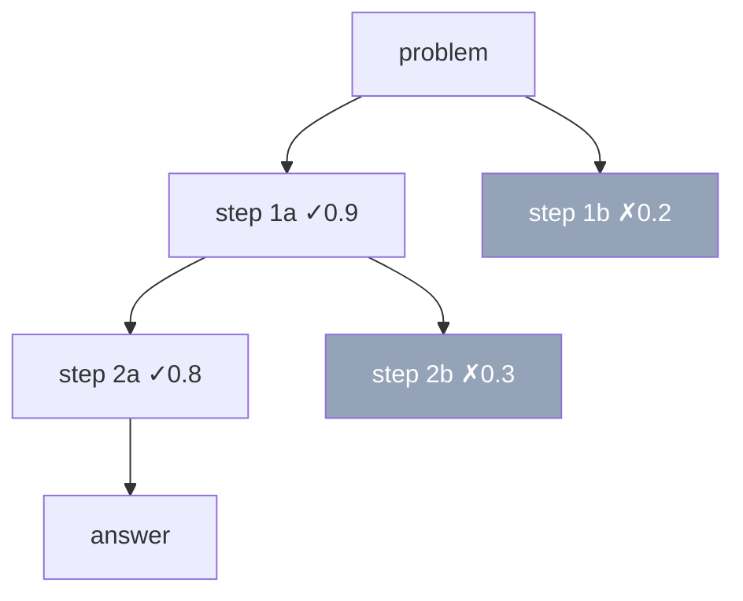

# Reasoning & Test-Time Compute 2026-current

long CoTtest-time scalingRLVRGRPOPRM vs ORMbest-of-NDeepSeek-R1

> [!TIP] Say this first
> There are now **two** compute knobs, not one: *train-time* (pretraining + post-training) and *test-time* (how long the model thinks at inference). The 2025→2026 narrative is that, with high-quality data scarce, the marginal payoff shifted toward **spending compute at inference** — longer chain-of-thought, sampling, and verifier-guided search — and toward **RL with verifiable rewards** that teaches a model to use that compute well. Say "search *amplifies* a policy; RL *improves* the policy being amplified" and you've framed the whole chapter.

## 1 · Long chain-of-thought

CoT = generate intermediate reasoning tokens before the answer. Three generations: **few-shot CoT** (exemplars contain reasoning), **zero-shot** ("let's think step by step"), and **learned long CoT** — where post-training makes the model *natively* produce extended, self-verifying traces with backtracking ("wait, that's wrong, let me reconsider").

Why it helps (mechanism, stated as hypothesis): a Transformer's forward pass has **fixed serial depth**; CoT **unrolls serial computation into the token stream**, lets the model re-read its own intermediate results, and creates room for partial self-correction. What changed in 2024→2026 is *scale and source*: o1-style models produce traces orders of magnitude longer than prompted CoT, learned via RL rather than prompting.

> [!WARNING] Faithfulness ≠ correctness
> A CoT can be fluent, confident, and *not* the actual cause of the answer. Don't claim the visible trace is a mechanistic explanation — it's a *sample* correlated with the computation. This distinction (faithful vs plausible CoT) is a favorite probe.

## 2 · Test-time compute as a scaling axis

**Snell et al. (2024)** *(verifiable)* is the anchor citation: for a **fixed** model, optimally allocating inference compute (longer CoT, best-of-N, verifier search) can beat using that compute to train a bigger model — on some problems by a lot. This reframes inference as a *scaling law of its own*.

<figure>
<svg viewBox="0 0 640 220" xmlns="http://www.w3.org/2000/svg" font-family="Inter, sans-serif" font-size="12">
  <line x1="60" y1="185" x2="600" y2="185" stroke="#98a3b2" stroke-width="1.5"/>
  <line x1="60" y1="185" x2="60" y2="25" stroke="#98a3b2" stroke-width="1.5"/>
  <text x="330" y="210" text-anchor="middle" fill="#6b7686">inference compute (tokens · samples), log scale</text>
  <text x="20" y="105" text-anchor="middle" fill="#6b7686" transform="rotate(-90 20 105)">accuracy</text>
  <path d="M60 175 C 180 150, 300 90, 420 60 S 560 40, 600 38" fill="none" stroke="#e0533f" stroke-width="2.5"/>
  <text x="470" y="55" fill="#e0533f">test-time scaling</text>
  <path d="M60 175 C 200 168, 380 150, 600 130" fill="none" stroke="#6366f1" stroke-width="2" stroke-dasharray="5 4"/>
  <text x="470" y="150" fill="#6366f1">diminishing returns</text>
  <text x="150" y="120" fill="#6b7686">gains taper: base-model ceiling,</text>
  <text x="150" y="138" fill="#6b7686">verifier quality, wasted search</text>
</svg>
<figcaption>Accuracy rises with inference compute, then flattens. The ceiling is set by the base model's competence, the verifier's quality, and how much compute is wasted exploring bad paths.</figcaption>
</figure>

**The levers, cheapest first:** (1) longer thinking; (2) **self-consistency** — sample $N$ traces, majority-vote the answer; (3) **best-of-N** — sample $N$, pick the top by a verifier; (4) **search** — tree/beam over reasoning states with a value estimate; (5) **revision loops** — draft → critique → improve. Products expose this as **"thinking budgets"** / **"effort"** knobs, and the key operational insight is **adaptivity**: not every query deserves maximum thinking — the 2026 hot theme is a controller that decides *how long to think*.

> [!QUESTION] Likely 2026 question
> "You have a fixed FLOP budget — spend it on more pretraining, more RLVR, or more test-time compute?" **Answer skeleton:** it depends on the *deployment* profile. Pretraining raises the ceiling but is data-wall-bound and amortized across all queries; test-time compute is paid **per query**, so it only makes sense where accuracy is worth the marginal spend and where a verifier or majority signal exists to convert extra samples into extra accuracy. The 2026 framing (AREA-10 papers like *Test-Time Scaling Makes Overtraining Compute-Optimal*, *Kinetics*) folds **inference cost into the scaling objective**: overtrain a smaller model for cheap serving, then dial test-time compute up on the hard tail. Say "it's a portfolio allocation across three axes, decided by query difficulty distribution and serving economics."

Self-consistency vs best-of-N — when does each win?

**Short:** self-consistency (majority vote) needs **no verifier** and shines when the answer is a discrete, extractable value; best-of-N needs a **good verifier/RM** but handles open-ended outputs and can exploit a strong scorer.

**Deep:** self-consistency $\hat a=\arg\max_a\sum_i \mathbf 1[\text{answer}(r_i)=a]$ fails on (a) open-ended generation with no canonical answer to vote on and (b) **systematically** wrong reasoning — the model votes confidently for the same wrong answer ("self-consistent wrong"). Best-of-N inherits the verifier's blind spots and invites **verifier hacking**. Both show **diminishing returns** in $N$ (roughly logarithmic), so budget-capped variants and early-stopping on agreement/confidence are standard.

**Follow-ups:** How does a PRM re-rank a search vs an ORM? · Why does majority vote beat a single greedy CoT on MATH? · When is $N{=}1$ with a longer trace better than $N$ short ones?

## 3 · PRM vs ORM

How do you *score* reasoning? Two philosophies, from **"Let's Verify Step by Step"** (Lightman et al., 2023) *(verifiable)* — which showed **process** supervision beats **outcome** supervision on MATH and released **PRM800K** (~800K step-level human labels).

| | **ORM** (Outcome RM) | **PRM** (Process RM) |
| --- | --- | --- |
| Scores | final answer only | every reasoning **step** |
| Credit assignment | sparse (one signal per trace) | dense (localizes the error) |
| Label cost | cheap (check the answer) | expensive (label each step) |
| Search use | rank complete traces | guide/prune mid-search, per-step |
| Risk | rewards "right answer, wrong reasoning" | step labels are noisy; can be gamed |

> [!QUESTION] Likely 2026 question
> "PRM or ORM — when is step-level supervision worth the labeling cost?" **Answer:** PRM pays off for **long multi-step** problems where a single outcome signal can't localize the mistake and where you want to **prune search early**. But it's expensive and noisy to label; for many tasks **ORM + best-of-N or self-consistency** is a strong, cheap baseline. Modern practice auto-labels process rewards (e.g., Monte-Carlo rollouts estimating whether a step *can* lead to a correct answer) to dodge human labeling. Cite *Let's Verify Step by Step* / PRM800K.

### Verifier-guided search

A PRM turns generation into a **guided search**: at each step, expand a few candidate next-steps, score them with the PRM, keep the promising frontier, prune the rest — beam search or MCTS over reasoning states. Cheaper than sampling whole traces because you kill dead branches early.

The catch is the **auto-labeling of process rewards** (human step labels don't scale): estimate a step's value by Monte-Carlo — roll out several completions from that step and measure how often they reach a correct answer. That's how PRMs are trained without PRM800K-scale human annotation, at the cost of rollout compute and label noise.

## 4 · RLVR and GRPO — teaching a model to reason

**RLVR (RL with verifiable rewards)** — coined by **Tülu 3** (Ai2, 2024) *(verifiable)* — swaps the *learned* reward model for a **deterministic verifier**: math answer correct → 1, code passes tests → 1, else 0. Because the reward is programmatic, it's far less reward-hackable than a preference model — but it only applies where correctness is checkable (math, code, tool-use).

**GRPO** is the algorithm that made RLVR scale (mechanics detailed in [Alignment](#/llm/alignment)): sample a **group** of $G$ completions, use the **group-mean reward as a critic-free baseline**, and update on the normalized advantage $\hat A_i=(r_i-\text{mean})/\text{std}$. No value network — cheaper and more stable for sparse binary rewards.

> [!QUESTION] Likely 2026 question
> "Contrast RLVR with RLHF — why did verifiable rewards win for reasoning, and where do they break?" **Answer:** RLHF optimizes a *learned* reward model of human preference — dense signal, but **hackable** (sycophancy, length bias) and it needs a critic in PPO. RLVR optimizes a *programmatic verifier* on checkable domains — the reward can't be gamed the same way, and with GRPO you don't even need a critic. It **breaks** on (a) **non-verifiable / open-ended** tasks (no ground-truth check → the open problem of rubric/generative reward models), (b) **noisy verifiers** (a flaky test suite injects reward noise), and (c) **reward gaming of the verifier itself** (hard-coding answers, exploiting a harness bug). So RLVR dominates math/code/tool-use; preference methods still own subjective quality.

## 5 · DeepSeek-R1 — the landmark demonstration

**DeepSeek-R1** (arXiv Jan 2025; later *Nature* 2025) *(verifiable)* is the most-cited open reasoning result:

<dl class="kv">
<dt>R1-Zero</dt><dd><b>Pure RL, no SFT</b> on a base model still induced strong reasoning and — famously — an emergent "aha moment" where the model learns to re-verify and backtrack on its own. Proof-of-concept that reasoning behavior can be <i>elicited by RL alone</i>.</dd>
<dt>R1 (the shipped recipe)</dt><dd>A little <b>cold-start SFT</b> for readability → large-scale <b>RLVR with GRPO</b> → rejection-sampling SFT → a final RL pass. Cold-start fixes R1-Zero's language-mixing and formatting.</dd>
<dt>CoT distillation</dt><dd>Fine-tune <b>small dense</b> models on R1's long-CoT traces. Result: much of the reasoning ability transfers to 7B–70B students <i>without</i> running RL on them — cheap, and a strong argument that the traces themselves carry most of the signal.</dd>
</dl>

## 6 · CoT distillation

Train a student on a teacher's long-CoT traces (supervised on the *reasoning*, not just answers). It transfers reasoning cheaply, powers small on-device reasoners, and sidesteps the instability/cost of RL per model. Caveat: the student inherits the teacher's **mistakes and unfaithful traces**, and typically plateaus at the teacher's ceiling — distillation elicits, it doesn't discover.

Distill long CoT into a small model, or run RLVR on the small model directly?

**Short:** distill first — it's dramatically cheaper and DeepSeek-R1 showed distillation into 7B–70B dense students often **beats** running RL on those students directly.

**Deep:** RL on a small base is sample-hungry and unstable because the base rarely stumbles onto correct long traces to get reward from (sparse-reward cold-start). A strong teacher's traces hand the student a dense supervised signal over *good* reasoning, so SFT-on-traces gets most of the gain for a fraction of the compute. The RL-on-small path pays off mainly when (a) no adequate teacher exists, or (b) you want capability *beyond* any available teacher on a verifiable domain. In practice: distill to bootstrap, then optionally a light RL pass to sharpen.

**Follow-ups:** Why does the student plateau at the teacher's ceiling? · Does distilling unfaithful traces hurt? · How would you filter teacher traces before distillation?

## 7 · The open debate — new skills vs eliciting latent ability

The genuinely *unresolved* question, and a maturity signal if you hold it as contested:

"RL elicits latent ability"

- A NeurIPS 2025 line argues RLVR mostly **sharpens/samples** what the base model can *already* do — pass@k for large k barely improves over base *(reported)*
- Distillation working so well suggests the base already "contains" the reasoning
- RL narrows the output distribution toward already-reachable good traces

"RL creates new capability"

- R1-Zero's emergent self-verification wasn't obviously present pre-RL
- Sustained RL on hard verifiable tasks appears to extend *reachable* solution length
- Depends heavily on how you measure "new" (pass@1 vs pass@k, in- vs out-of-distribution)

> [!NOTE] How to say it in the room
> "It's contested. The strongest evidence says RLVR primarily **elicits and makes reliable** latent ability rather than inventing wholly new skills — but it depends on your metric, and I'd want to see pass@k curves and out-of-distribution transfer before committing." Treating it as settled (either way) is the junior tell.

## 8 · Failure modes & the vision angle

**Failures:** compute waste on easy queries; self-consistent-but-wrong; verbose unfaithful CoT; search myopia from a bad heuristic; SLO/latency blowups from unbounded thinking. **Fixes:** a difficulty estimator driving an adaptive budget; cheap-model-first cascades that escalate; stop on confidence/agreement/verifier-pass.

For **multimodal** reasoning, "think more" often means "**perceive more**" — re-crop, re-segment, call a specialist, match multiple hypotheses — not just emit more text. Spending test-time compute on **specialist vision tools** (each search node a perception action) can be more sample-efficient for region grounding than a longer monologue in a single end-to-end VLM. That's the bridge to [Visual Reasoning Agents](#/vlm/visual-agents) and [Agentic AI & Tool Use](#/llm/agents).

## Cheat-sheet

| Ask | One-liner |
| --- | --- |
| Long CoT | unroll serial computation into tokens; learned traces self-verify/backtrack |
| Test-time scaling | Snell 2024: fixed model + more inference compute can beat a bigger model |
| Self-consistency | sample $N$, majority-vote; no verifier; discrete answers only |
| Best-of-N | sample $N$, pick top by verifier; needs a good scorer; risks verifier hacking |
| PRM vs ORM | score steps (dense, costly, prunes search) vs final answer (sparse, cheap) — *Let's Verify* / PRM800K |
| RLVR | deterministic verifier reward; robust, but only where correctness is checkable (Tülu 3) |
| GRPO | critic-free RL; group-mean baseline; the RLVR workhorse |
| DeepSeek-R1 | pure-RL R1-Zero "aha" → cold-start + GRPO recipe → CoT distillation to small models |
| Open debate | RLVR likely *elicits latent* ability more than it *creates* new — contested |

## Related

[LLM Fundamentals](#/llm/fundamentals) · [Post-Training & Alignment](#/llm/alignment) · [Agentic AI & Tool Use](#/llm/agents) · [Visual Reasoning Agents](#/vlm/visual-agents) · [Evaluation Metrics](#/foundations/evaluation-metrics) · [The 2026 Landscape](#/start/landscape-2026)
