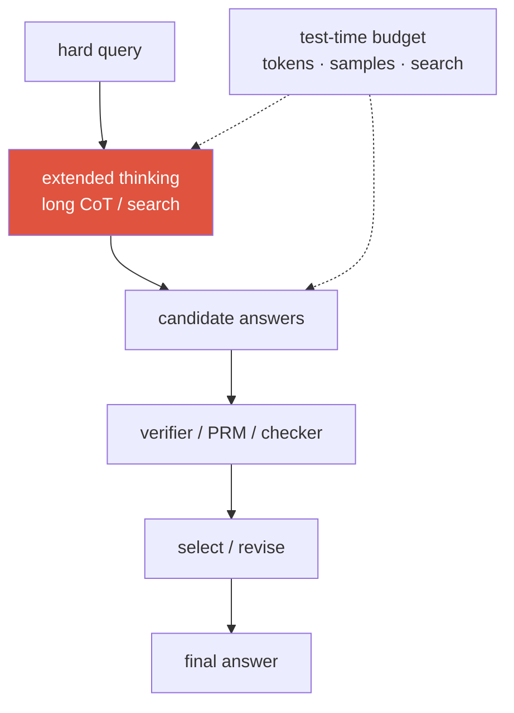
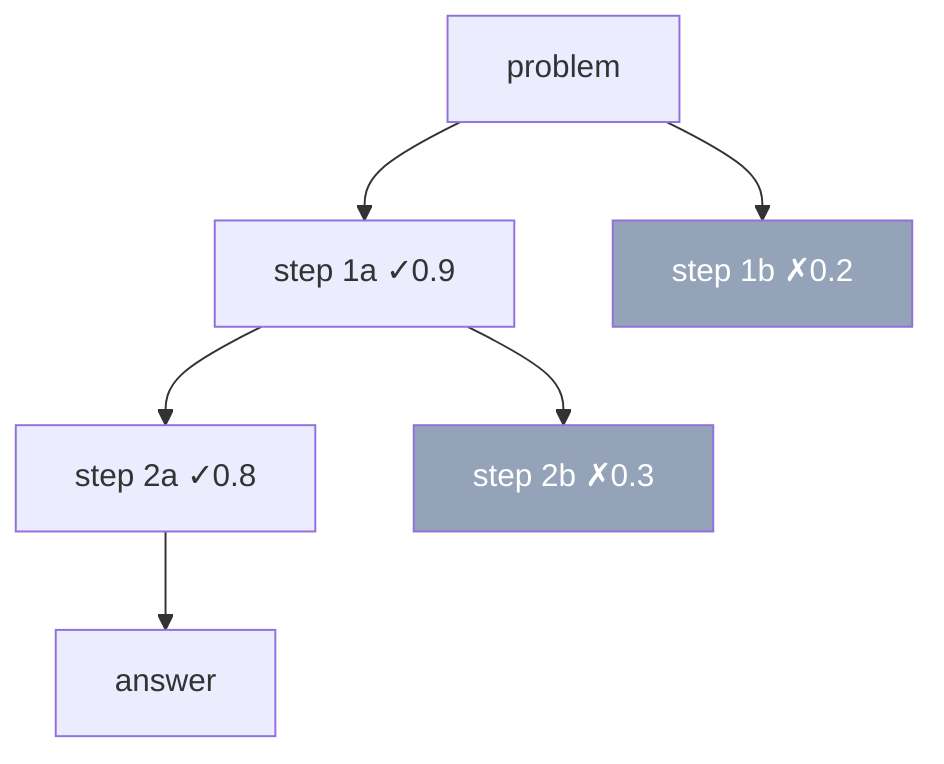
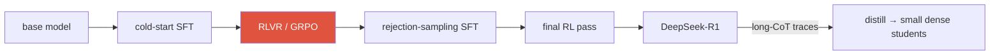

# Reasoning & Test-Time Compute <span class="badge badge-2026">2026-current</span>

<div class="tag-row"><span class="tag">long CoT</span><span class="tag">test-time scaling</span><span class="tag">RLVR</span><span class="tag">GRPO</span><span class="tag">PRM vs ORM</span><span class="tag">best-of-N</span><span class="tag">DeepSeek-R1</span></div>

> [!NOTE] Goal of this chapter
> This chapter explains “reasoning models” and **test-time compute**. More inference tokens, samples, or search can improve accuracy on some difficult tasks. Longer output is not always better: the base policy, verifier, and problem difficulty determine whether extra compute helps.

## What and why

An ordinary autoregressive LLM can perform multiple computational steps through hidden states and generated tokens. But when it generates one path without a separate search or verification budget, recovery from errors is difficult on multi-step problems.

A **reasoning model** is designed to use a larger inference budget through training and serving. It may use long reasoning traces, sampling, tools/search, verification, and revision internally, but that does not mean an API exposes raw chain-of-thought. Users typically receive a final answer and concise rationale.

This creates **two compute knobs**:

- **Train time:** scale parameters, data, and optimization compute—the traditional scaling axis.
- **Test time:** spend more compute when answering through a longer CoT, multiple samples, or verifier-guided search.

For some task/difficulty ranges, properly allocating test-time compute to a fixed smaller model can beat a single attempt from a larger model. That is a compute-allocation option, not a universal dominance result. See [Decoding & Sampling](#/llm/decoding-sampling) for candidate generation and the [RL Primer](#/llm/rl-primer) plus [Post-Training & Alignment](#/llm/alignment) for RL details.

> [!TIP] Interview one-liner
> “Compute now has a **test-time** knob as well as a train-time knob. Whether to spend the budget on longer CoT, sampling, verifier-guided search, or RLVR depends on the task, policy, verifier, and serving cost. Search explores candidates from the current policy; RL changes the policy distribution used later.”



## 1 · Long chain-of-thought

**CoT (chain-of-thought)** means generating intermediate reasoning tokens before an answer. Three generations of the technique are:

- **Few-shot CoT:** demonstrations include worked reasoning for the model to imitate.
- **Zero-shot CoT:** ask the model to “think step by step.”
- **Learned long CoT:** after post-training, the model generates longer traces that may look like backtracking—o1/R1-style behavior. That language does not guarantee real verification or faithful self-correction.

**Why it can help (intuition):** network depth within one forward step is fixed, but autoregressively generating more tokens lets the model reuse intermediate results as input to later steps. CoT provides additional serial computation and external scratch space for exploration and revision. Trace length and training recipe vary in how much models disclose, and a longer trace is not evidence by itself of deeper or correct computation.

> [!WARNING] Faithfulness ≠ correctness
> A CoT can be fluent, confident, and *not* the actual cause of the answer. Don't claim the visible trace is a mechanistic explanation — it's a *sample* correlated with the computation. This distinction (faithful vs plausible CoT) is a favorite probe.

## 2 · Test-time compute as a scaling axis

**Snell et al. (2024)** is the anchor citation. In some evaluated settings, allocating inference compute to a fixed model according to problem difficulty beat a single attempt from a larger model. This is conditional on policy and verifier quality, not a universal claim that it is always better than training a larger model with the same compute.

<figure>
<svg viewBox="0 0 640 220" xmlns="http://www.w3.org/2000/svg" font-family="Inter, sans-serif" font-size="12">
  <line x1="60" y1="185" x2="600" y2="185" stroke="#98a3b2" stroke-width="1.5"/>
  <line x1="60" y1="185" x2="60" y2="25" stroke="#98a3b2" stroke-width="1.5"/>
  <text x="330" y="210" text-anchor="middle" fill="#6b7686">inference compute (tokens · samples), log scale</text>
  <text x="20" y="105" text-anchor="middle" fill="#6b7686" transform="rotate(-90 20 105)">accuracy</text>
  <path d="M60 175 C 180 150, 300 90, 420 60 S 560 40, 600 38" fill="none" stroke="#e0533f" stroke-width="2.5"/>
  <text x="470" y="55" fill="#e0533f">test-time scaling</text>
  <path d="M60 175 C 200 168, 380 150, 600 130" fill="none" stroke="#6366f1" stroke-width="2" stroke-dasharray="5 4"/>
  <text x="470" y="150" fill="#6366f1">diminishing returns</text>
  <text x="150" y="120" fill="#6b7686">gains taper: base-model ceiling,</text>
  <text x="150" y="138" fill="#6b7686">verifier quality, wasted search</text>
</svg>
<figcaption>A conceptual diminishing-returns curve observed on some tasks. Accuracy need not increase monotonically with compute; the base policy, sampling/search procedure, verifier, and problem difficulty determine the curve.</figcaption>
</figure>

Representative levers are listed below. This ordering reflects conceptual complexity, not a fixed ranking by cost or accuracy; those depend on the task, batching, and verifier.

1. **Longer thinking**—increase the CoT token budget, possibly without a verifier.
2. **Self-consistency**—sample $N$ solutions and choose the answer by **majority vote**, with no verifier.
3. **Best-of-N**—sample $N$ candidates and use a **verifier** to select the best.
4. **Search**—tree or beam search over reasoning states with a value estimate.

A **revision loop** (draft → critique → improve) can be added at any level.

<figure>
<svg viewBox="0 0 640 270" xmlns="http://www.w3.org/2000/svg" font-family="Inter, sans-serif" font-size="12">
  <line x1="60" y1="235" x2="620" y2="235" stroke="#98a3b2" stroke-width="1.5"/>
  <line x1="60" y1="235" x2="60" y2="20" stroke="#98a3b2" stroke-width="1.5"/>
  <text x="340" y="258" text-anchor="middle" fill="#98a3b2">→ more test-time compute (higher cost)</text>
  <text x="22" y="128" text-anchor="middle" fill="#98a3b2" transform="rotate(-90 22 128)">capability ↑</text>
  <g stroke-width="0">
    <rect x="80" y="180" width="120" height="55" rx="6" fill="#12a150" opacity="0.9"/>
    <rect x="210" y="140" width="120" height="95" rx="6" fill="#0ea5e9" opacity="0.9"/>
    <rect x="340" y="95" width="120" height="140" rx="6" fill="#6366f1" opacity="0.9"/>
    <rect x="470" y="45" width="120" height="190" rx="6" fill="#e0533f" opacity="0.95"/>
  </g>
  <g fill="#fff" text-anchor="middle" font-size="11" font-weight="700">
    <text x="140" y="205">① longer CoT</text>
    <text x="270" y="175">② self-consistency</text>
    <text x="400" y="140">③ best-of-N</text>
    <text x="530" y="90">④ search</text>
  </g>
  <g fill="#fff" text-anchor="middle" font-size="9.5">
    <text x="140" y="222">no verifier required</text>
    <text x="270" y="192">majority vote</text>
    <text x="400" y="157">verifier selects</text>
    <text x="530" y="107">tree/beam + value</text>
    <text x="530" y="122">pruning</text>
  </g>
  <path d="M140 180 L270 140 L400 95 L530 45" fill="none" stroke="currentColor" stroke-width="1.6" stroke-dasharray="4 4" opacity="0.6"/>
</svg>
<figcaption>Representative test-time-compute levers. State and candidate management becomes more complex toward the right, but this is not a guaranteed ordering of accuracy or cost. Steps ③ and ④ are especially sensitive to verifier quality.</figcaption>
</figure>

The common self-consistency case is easiest to see visually. Sample different solutions to the same question at a higher temperature (see [Decoding & Sampling](#/llm/decoding-sampling)), then choose the **most frequent answer**.

<figure>
<svg viewBox="0 0 640 220" xmlns="http://www.w3.org/2000/svg" font-family="Inter, sans-serif" font-size="12">
  <rect x="20" y="90" width="90" height="40" rx="8" fill="#6366f1"/>
  <text x="65" y="114" text-anchor="middle" fill="#fff">Question</text>
  <g font-size="11">
    <path d="M110 105 C 150 40, 190 40, 230 40" fill="none" stroke="#98a3b2" stroke-width="1.3" marker-end="url(#ra)"/>
    <path d="M110 108 C 150 85, 190 85, 230 85" fill="none" stroke="#98a3b2" stroke-width="1.3" marker-end="url(#ra)"/>
    <path d="M110 112 C 150 130, 190 130, 230 130" fill="none" stroke="#98a3b2" stroke-width="1.3" marker-end="url(#ra)"/>
    <path d="M110 118 C 150 175, 190 175, 230 175" fill="none" stroke="#98a3b2" stroke-width="1.3" marker-end="url(#ra)"/>
    <rect x="232" y="26" width="150" height="26" rx="5" fill="none" stroke="#12a150" stroke-width="1.4"/><text x="240" y="43" fill="currentColor">solution 1 → answer = 42</text>
    <rect x="232" y="72" width="150" height="26" rx="5" fill="none" stroke="#12a150" stroke-width="1.4"/><text x="240" y="89" fill="currentColor">solution 2 → answer = 42</text>
    <rect x="232" y="117" width="150" height="26" rx="5" fill="none" stroke="#e0533f" stroke-width="1.4"/><text x="240" y="134" fill="currentColor">solution 3 → answer = 17</text>
    <rect x="232" y="162" width="150" height="26" rx="5" fill="none" stroke="#12a150" stroke-width="1.4"/><text x="240" y="179" fill="currentColor">solution 4 → answer = 42</text>
  </g>
  <path d="M388 100 H430" stroke="#98a3b2" stroke-width="1.5" marker-end="url(#ra)"/>
  <text x="409" y="92" text-anchor="middle" fill="#98a3b2" font-size="10">vote</text>
  <rect x="432" y="80" width="180" height="40" rx="8" fill="#12a150"/>
  <text x="522" y="98" text-anchor="middle" fill="#fff" font-size="11">answer = 42 (3 of 4 votes)</text>
  <text x="522" y="113" text-anchor="middle" fill="#fff" font-size="10">works without a verifier</text>
  <defs><marker id="ra" markerWidth="8" markerHeight="8" refX="6" refY="3" orient="auto"><path d="M0 0 L6 3 L0 6" fill="#98a3b2"/></marker></defs>
</svg>
<figcaption>Self-consistency solves the same question multiple times and majority-votes the extracted answers. It needs no verifier and is especially useful for discrete answers such as numbers and choices.</figcaption>
</figure>

Some products expose this as a **thinking budget** or **effort** control. Operationally, the key is adaptivity: a controller can allocate budget by query difficulty, uncertainty, and SLA, but controller overhead and mistaken early exits must be evaluated too.

> [!QUESTION] Likely 2026 question
> "You have a fixed FLOP budget — spend it on more pretraining, more RLVR, or more test-time compute?" **Answer skeleton:** it depends on the *deployment* profile. Pretraining raises the ceiling but is data-wall-bound and amortized across all queries; test-time compute is paid **per query**, so it only makes sense where accuracy is worth the marginal spend and where a verifier or majority signal exists to convert extra samples into extra accuracy. The 2026 framing (AREA-10 papers like *Test-Time Scaling Makes Overtraining Compute-Optimal*, *Kinetics*) folds **inference cost into the scaling objective**: overtrain a smaller model for cheap serving, then dial test-time compute up on the hard tail. Say "it's a portfolio allocation across three axes, decided by query difficulty distribution and serving economics."

<details class="qa"><summary>Self-consistency vs best-of-N — when does each win?</summary>
<div class="qa-body">

**Short:** self-consistency (majority vote) needs **no verifier** and shines when the answer is a discrete, extractable value; best-of-N needs a **good verifier/RM** but handles open-ended outputs and can exploit a strong scorer.

**Deep:** self-consistency $\hat a=\arg\max_a\sum_i \mathbf 1[\text{answer}(r_i)=a]$ fails on (a) open-ended generation with no canonical answer to vote on and (b) **systematically** wrong reasoning. Best-of-N inherits the verifier's blind spots and can invite verifier gaming under repeated optimization. The marginal gain from $N$ depends on the task and sample correlation, so determine a cap and agreement-/verifier-based early stop from the quality–cost curve.

**Follow-ups:** How does a PRM re-rank a search vs an ORM? · Why does majority vote beat a single greedy CoT on MATH? · When is $N{=}1$ with a longer trace better than $N$ short ones?
</div></details>

## Build it yourself — self-consistency majority vote

The heart of self-consistency is one operation: choose the **mode**, the answer produced by the most traces. Complete `majority_vote` and press **▶ Run tests**. On a tie, return the answer that appeared first. Open **Solution** if needed; the first run may pause while the Python runtime downloads.

<div class="widget" data-widget="code">
<script type="application/json" class="code-config">
{"func":"majority_vote","packages":[],"starter":"def majority_vote(answers):\n    # answers: final answers produced by several traces (numbers or strings).\n    # Return the most frequent answer (self-consistency majority vote = mode).\n    # On a tie, return the answer that appeared first.\n    pass","tests":[{"args":[[42,42,17,42]],"expect":42},{"args":[["a","b","b","c","b"]],"expect":"b"},{"args":[[1,1,2,2]],"expect":1},{"args":[[7]],"expect":7}],"solution":"def majority_vote(answers):\n    counts = {}\n    order = []\n    for a in answers:\n        if a not in counts:\n            counts[a] = 0\n            order.append(a)   # Record first-seen order for tie-breaking\n        counts[a] += 1\n    # Scan in first-seen order so the earlier answer wins a tie.\n    return max(order, key=lambda a: counts[a])"}
</script>
</div>

The third test is the key: `[1,1,2,2]` is tied at two votes each, so the function returns the first-seen `1`. To turn this into best-of-N, replace vote counts with verifier scores and select their argmax.

## 3 · PRM vs ORM

These are two ways to score reasoning. Both are **reward models (RMs)**, but they assign scores at different points. **"Let's Verify Step by Step"** (Lightman et al., 2023) found process supervision stronger than outcome supervision on MATH in its setting and released **PRM800K**, about 800K human step-level labels.

| | **ORM** (Outcome RM) | **PRM** (Process RM) |
| --- | --- | --- |
| Scores | final answer only | every reasoning **step** |
| Credit assignment | sparse (one signal per trace) | dense (localizes the error) |
| Label cost | typically one outcome label per solution | generally higher because each step is labeled |
| Search use | rank complete traces | guide/prune mid-search, per-step |
| Risk | rewards "right answer, wrong reasoning" | step labels are noisy; can be gamed |

> [!QUESTION] Likely 2026 question
> "PRM or ORM—when is step-level supervision worth the labeling cost?" **Answer:** PRM may be worthwhile on long multi-step problems where one outcome signal cannot localize errors and search should prune early. But labels are expensive and noisy. Use budget-matched **ORM + best-of-N or self-consistency** as baselines, then compare human step labels, automatic checkers, and Monte-Carlo rollout values for the task.

### Verifier-guided search

A **verifier** scores a candidate solution or step; it can be a rule-based checker or a learned PRM/ORM. A PRM can guide beam search or MCTS by expanding candidates and pruning weak branches at each step. Early pruning can save compute, but branching and repeated scoring can also make search **more expensive** than sampling complete solutions, so compare under the same token/FLOP budget.



<details class="concept-code">
<summary>View as concept code</summary>

> This **pseudocode** shows the structure of PRM-guided beam search. A verifier score is a search proxy, not a truth judgment.

```python
@no_grad()
def verifier_guided_search(problem, beam_width, branch_factor, max_steps):
    generator.eval(); verifier.eval()
    beam = [State(text="", score=0.0, tokens_used=0)]

    for _ in range(max_steps):
        candidates = []
        for state in beam:
            next_steps = generator.sample_steps(
                problem, state.text, n=branch_factor, temperature=0.8
            )
            for step in next_steps:
                if not syntax_and_budget_valid(step, state.tokens_used):
                    continue
                new_text = state.text + step
                process_score = verifier.score(problem, new_text).detach()
                candidates.append(State(new_text, state.score + process_score,
                                        state.tokens_used + token_count(step)))

        solved = [s for s in candidates if independent_checker_accepts(problem, s.text)]
        if solved:
            return best_by_checker_then_score(solved)
        beam = topk(candidates, k=beam_width, key=lambda s: s.score)

    return abstain_or_return_best(beam)  # Never call verifier approval proof of correctness.
```

</details>

The challenge is **automatic labeling of process rewards**. One can estimate a state's chance of success by rolling out many completions and measuring how often they reach a correct final answer. That value is not a guarantee that the step itself is logically valid: a bad step can recover by chance, and a good step can receive a low value after downstream failures. Evaluate both rollout cost and label noise.

## 4 · RLVR and GRPO — teaching a model to reason

If policy, reward, or advantage terminology is unfamiliar, start with the [RL Primer](#/llm/rl-primer).

**RLVR (RL with verifiable rewards)** uses rewards that can be checked automatically, such as math-answer matching, code tests, or format and constraint checkers. The reward may be binary and deterministic, but can also combine partial scores, multiple tests, or noisy verifiers. [Post-Training & Alignment](#/llm/alignment) is the canonical treatment of its definition, domains, and reward-hacking risks.

**GRPO** samples multiple solutions for one prompt, estimates advantages from group-relative rewards, and removes a separate learned critic. This saves critic memory, but rollout, reference, and old-policy costs remain, along with zero-variance groups, difficulty weighting, and length bias. Formulas and later variants are treated in [Post-Training & Alignment](#/llm/alignment).

> [!QUESTION] Likely 2026 question
> "Contrast RLVR with RLHF—where is each useful, and where does it fail?" **Answer:** a learned preference reward handles open-ended quality but inherits judge bias and reward hacking. An RLVR program/test reward is more directly auditable, but **not impossible to game**: a policy can exploit sparse or noisy tests, hard-code answers, trigger harness bugs, or miss hidden cases. RLVR is a strong choice for math, code, and tool use; open-ended quality still needs preferences and human evaluation.

## 5 · DeepSeek-R1 — the landmark demonstration

**DeepSeek-R1** (arXiv Jan 2025; later *Nature* 2025) *(verifiable)* is the most-cited open reasoning result:

<dl class="kv">
<dt>R1-Zero</dt><dd>Applying <b>RL without cold-start SFT</b> to a base model produced longer traces and behavior described as self-verification and backtracking. The “aha moment” is the authors' description of observed behavior, not independent proof that a wholly new capability appeared.</dd>
<dt>R1 (release recipe)</dt><dd>A small amount of <b>cold-start data</b> → reasoning-oriented RL → rejection-sampling/SFT → further RL. The authors say cold-start data was designed to reduce readability and language-mixing problems seen in R1-Zero.</dd>
<dt>CoT distillation</dt><dd>Fine-tuning <b>small dense</b> models on R1's long-CoT solutions transferred strong behavior. This supports trace supervision as useful, but does not prove a general conclusion that the trace contains “most” of the learning signal.</dd>
</dl>



## 6 · CoT distillation

Train a student on a teacher's long-CoT solutions, supervising trace tokens as well as answers. This can bootstrap behavior without a rollout-heavy RL stage, but the student also inherits the teacher's **mistakes and unfaithful traces**. A student can exceed its teacher on a particular benchmark, so do not treat the “teacher ceiling” as a law; separate the effects of trace filtering, student base, additional data, and RL.

<details class="qa"><summary>Distill long CoT into a small model, or run RLVR on the small model directly?</summary>
<div class="qa-body">

**Short:** with a strong teacher and clean traces, distillation is a useful bootstrap. If no teacher exists or the student must repair its own on-policy failures, RL may be needed. Which wins depends on model, domain, and budget.

**Deep:** when a small base rarely produces reward-positive traces, on-policy RL can be blocked by sparse reward and expensive rollouts. Filtered teacher-trace SFT supplies a denser token-level signal, but stays tied to the teacher distribution and its errors. Under the same student, data, and total compute, compare direct RL, distillation, and distill → RL using pass@1, pass@k, OOD results, and cost.

**Follow-ups:** Why does the student plateau at the teacher's ceiling? · Does distilling unfaithful traces hurt? · How would you filter teacher traces before distillation?
</div></details>

## 7 · The open debate — new skills vs eliciting latent ability

This is genuinely unresolved. Here **pass@k** means the probability that at least one of $k$ attempts on a problem is correct.

<div class="proscons"><div><div class="pros-t">"RL elicits latent ability"</div>

- Some 2025 studies use large-$k$ pass@k and OOD transfer to argue that a major effect of RLVR is **reweighting** successful traces already reachable by the base model. Results vary by paper, model, and evaluation, so this is not a general law.
- Distillation working so well suggests the base already "contains" the reasoning
- RL narrows the output distribution toward already-reachable good traces

</div><div><div class="cons-t">"RL creates new capability"</div>

- R1-Zero's emergent self-verification wasn't obviously present pre-RL
- Sustained RL on hard verifiable tasks appears to extend *reachable* solution length
- Depends heavily on how you measure "new" (pass@1 vs pass@k, in- vs out-of-distribution)

</div></div>

> [!NOTE] How to say it in the room
> “The conclusion depends on what counts as a new capability. If pass@1 rises while large-k pass@k and the OOD frontier remain fixed, reweighting is the stronger explanation. If the reachable frontier moves on new task families, that is evidence of capability expansion. I would withhold judgment until seeing both curves and checking data contamination.”

## 8 · Failure modes & the vision angle

**Failures:** compute waste on easy queries; self-consistent-but-wrong; verbose unfaithful CoT; search myopia from a bad heuristic; SLO/latency blowups from unbounded thinking. **Fixes:** a difficulty estimator driving an adaptive budget; cheap-model-first cascades that escalate; stop on confidence/agreement/verifier-pass.

For **multimodal** reasoning, "think more" often means "**perceive more**" — re-crop, re-segment, call a specialist, match multiple hypotheses — not just emit more text. Spending test-time compute on **specialist vision tools** (each search node a perception action) can be more sample-efficient for region grounding than a longer monologue in a single end-to-end VLM. That's the bridge to [Visual Reasoning Agents](#/vlm/visual-agents) and [Agentic AI & Tool Use](#/llm/agents).

## Cheat-sheet

| Ask | One-liner |
| --- | --- |
| Long CoT | unroll serial computation into tokens; learned traces may show self-verification/backtracking behavior |
| Test-time scaling | Snell 2024: a fixed model with more inference compute can beat a larger model in some settings |
| Lever ladder | longer CoT · self-consistency · best-of-N · search; no fixed ordering by quality or cost |
| Self-consistency | sample $N$, majority-vote; no verifier; discrete answers only |
| Best-of-N | sample $N$, pick top by verifier; needs a good scorer; risks verifier hacking |
| PRM vs ORM | score steps (dense, costly, prunes search) vs final answer (sparse, cheap) — *Let's Verify* / PRM800K |
| RLVR | automatically verifiable reward; may be partial/noisy and vulnerable to harness gaming |
| GRPO | critic-free RL with a group-mean baseline; widely used for RLVR |
| DeepSeek-R1 | RL-only R1-Zero “aha” → cold-start + GRPO → CoT distillation into smaller models |
| Open debate | distinguish reweighting from capability expansion with pass@1, pass@k, and the OOD frontier |

**Next:** [Decoding & Sampling](#/llm/decoding-sampling) · [RL Primer](#/llm/rl-primer) · [Post-Training & Alignment](#/llm/alignment) · [Agentic AI & Tool Use](#/llm/agents) · [Visual Reasoning Agents](#/vlm/visual-agents) · [LLM Fundamentals](#/llm/fundamentals)
