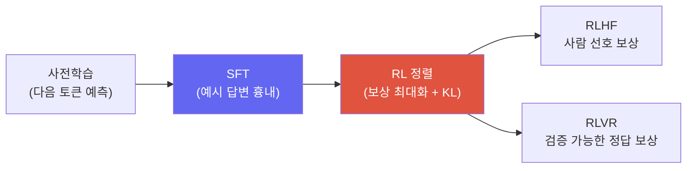

# RL 기초 프라이머 (LLM을 위한)

> [!NOTE] 이 챕터의 목표
> [Alignment](#/llm/alignment)와 [Reasoning](#/llm/reasoning) 챕터는 RLHF·PPO·GRPO 같은 강화학습(RL, Reinforcement Learning) 용어를 이미 안다고 가정합니다. 이 프라이머는 그 챕터들을 읽는 데 **딱 필요한 만큼의 RL 어휘**만, 수식보다 직관으로 잡아 줍니다. 목표는 RL 전문가가 되는 게 아니라 **"RLHF/GRPO 설명을 막힘없이 읽는 것"** 하나입니다. PPO/DPO/GRPO의 구체적 레시피는 [Alignment](#/llm/alignment)에서 이어집니다.

## 무엇을, 왜

지금까지 배운 학습은 대부분 **지도학습**이었습니다 — 정답이 있고, 예측이 정답에서 틀린 정도(손실)를 줄였죠([머신러닝이란?](#/foundations/what-is-ml)). 하지만 "좋은 답변"에는 정해진 하나의 정답이 없습니다. "친절한가?", "안전한가?", "이 수학 문제를 맞혔는가?"에는 모범 답안 문장이 딱 하나로 존재하지 않죠. 대신 **얼마나 좋았는지 점수(보상, reward)** 는 매길 수 있습니다.

**강화학습(RL)** 은 정답 대신 **보상 신호**로 배우는 방식입니다. 한 줄 루프로 줄이면 이렇습니다:

> 행동을 해본다 → 보상을 받는다 → **보상이 커지는 쪽으로 행동을 조금씩 바꾼다.**

LLM 후반 학습(RLHF, RLVR)이 바로 이 틀을 씁니다: "사람이 선호하는 답", "검증 가능한 정답을 맞힌 답"에 높은 보상을 주고, 모델이 그런 답을 더 자주 내도록 미는 것입니다.

## RL의 등장인물 — 상호작용 루프

RL의 세계는 두 주인공, **에이전트(agent)** 와 **환경(environment)** 이 한 step씩 상호작용하는 과정입니다. 유한 episode는 종료 상태나 최대 horizon에서 끝나고, continuing task만 상호작용이 계속됩니다.

<figure>
<svg viewBox="0 0 640 250" xmlns="http://www.w3.org/2000/svg" font-family="Inter, sans-serif" font-size="13">
  <defs>
    <marker id="rlar" markerWidth="9" markerHeight="9" refX="7" refY="3" orient="auto"><path d="M0 0 L7 3 L0 6" fill="#98a3b2"/></marker>
  </defs>
  <!-- agent -->
  <rect x="40" y="90" width="180" height="70" rx="10" fill="#e0533f"/>
  <text x="130" y="120" text-anchor="middle" fill="#fff" font-weight="700">에이전트 (agent)</text>
  <text x="130" y="142" text-anchor="middle" fill="#fff" font-size="12">= 우리 모델 = 정책 π</text>
  <!-- environment -->
  <rect x="420" y="90" width="180" height="70" rx="10" fill="#6366f1"/>
  <text x="510" y="120" text-anchor="middle" fill="#fff" font-weight="700">환경 (environment)</text>
  <text x="510" y="142" text-anchor="middle" fill="#fff" font-size="12">= 대화 / 문제 상황</text>
  <!-- top arrow: action -->
  <path d="M220 108 C 300 70, 340 70, 420 108" fill="none" stroke="#98a3b2" stroke-width="2" marker-end="url(#rlar)"/>
  <text x="320" y="66" text-anchor="middle" fill="#e0533f" font-weight="700">행동 action</text>
  <text x="320" y="82" text-anchor="middle" fill="#98a3b2" font-size="11">(다음 토큰 / 답변)</text>
  <!-- bottom arrow: reward + next state -->
  <path d="M420 150 C 340 190, 300 190, 220 150" fill="none" stroke="#98a3b2" stroke-width="2" marker-end="url(#rlar)"/>
  <text x="320" y="205" text-anchor="middle" fill="#0ea5e9" font-weight="700">보상 reward + 다음 상태 state</text>
  <text x="320" y="222" text-anchor="middle" fill="#98a3b2" font-size="11">(점수 + 지금까지의 문맥)</text>
</svg>
<figcaption>RL의 심장 = 이 루프. 에이전트가 <b>상태(state)</b>를 보고 <b>행동(action)</b>을 하면, 환경이 <b>보상(reward)</b>과 <b>새 상태</b>를 돌려줍니다. 이걸 반복하며 보상이 커지도록 행동 규칙을 다듬습니다.</figcaption>
</figure>

<dl class="kv">
<dt>에이전트(agent)</dt><dd>행동을 결정하는 주체 — LLM에서는 <b>모델 자신</b>.</dd>
<dt>환경(environment)</dt><dd>에이전트가 상호작용하는 세계 — LLM에서는 대화/문제 상황.</dd>
<dt>상태(state)</dt><dd>지금까지의 상황 — LLM에서는 지금까지의 프롬프트 + 이미 생성한 토큰.</dd>
<dt>행동(action)</dt><dd>에이전트가 하는 선택 — LLM에서는 <b>다음 토큰</b>(또는 답변 전체를 한 번의 행동으로 보기도 함).</dd>
<dt>보상(reward, r)</dt><dd>행동이 얼마나 좋았는지 알려주는 숫자 — 예: 사람 선호도, 정답 여부. 클수록 좋음.</dd>
<dt>정책(policy, π)</dt><dd>상태를 보고 어떤 행동을 할지 정하는 규칙 — LLM에서는 <b>모델 그 자체</b>(다음 토큰의 확률분포 $\pi(a\mid s)$).</dd>
</dl>

> [!NOTE] LLM = RL로 어떻게 매핑되나
> 헷갈리기 쉬운데, 한 문장이면 됩니다: **정책 = 모델, 행동 = 토큰 생성, 상태 = 지금까지의 문맥, 보상 = 답변에 매긴 점수.** LLM에서 "환경"은 게임처럼 복잡하지 않습니다 — 대개 프롬프트를 주고, 모델이 답을 다 쓰면, 그 답 하나에 보상 하나를 주는 단순한 형태입니다.

## 리턴(return) — 보상을 미래까지 더하기

한 번의 보상만 보면 근시안적입니다. RL이 진짜 최대화하려는 건 **앞으로 받을 보상의 총합**, 즉 **리턴(return)** 입니다. 보통 미래의 보상은 **할인율(discount, $\gamma$)** 로 살짝 깎아서 더합니다:

$$G_t = r_t + \gamma\, r_{t+1} + \gamma^2 r_{t+2} + \cdots = \sum_{k\ge 0}\gamma^k\, r_{t+k}\qquad (0\le\gamma\le 1)$$

<dl class="kv">
<dt>$\gamma \to 1$</dt><dd>먼 미래까지 거의 그대로 챙김 → "멀리 보는" 에이전트.</dd>
<dt>$\gamma \to 0$</dt><dd>당장의 보상만 신경 씀 → "근시안적" 에이전트.</dd>
</dl>

LLM에서는 답변 하나 끝에 보상 하나가 나오는 경우가 많아 $\gamma$가 크게 중요하지 않을 때도 있지만, 리턴이라는 개념 자체("지금 행동의 가치는 그것이 불러올 미래 보상까지 합친 것")는 아래 value/advantage를 이해하는 토대가 됩니다.

## 핵심 아이디어 — 좋은 행동의 확률을 높여라

RL 학습의 직관은 놀랍도록 단순합니다:

> **높은 보상으로 이어진 행동은 다음에 더 자주 하고(확률↑), 낮은 보상으로 이어진 행동은 덜 하도록(확률↓) 정책을 민다.**

이걸 gradient로 옮긴 것이 **정책 경사(policy gradient)** 입니다. 지도학습이 "정답 토큰의 확률을 높여라"였다면, 정책 경사는 "**보상이 높았던** 토큰의 확률을 높여라"입니다. 개념적으로:

$$\nabla_\theta J \;\approx\; \mathbb{E}\big[\,\underbrace{A}_{\text{얼마나 좋았나}}\;\cdot\;\underbrace{\nabla_\theta \log \pi_\theta(a\mid s)}_{\text{이 행동의 확률을 올리는 방향}}\big]$$

읽는 법: $\nabla\log\pi$는 "그 행동의 확률을 높이는 방향"이고, 앞의 $A$(어드밴티지, 아래 설명)는 그 방향으로 **얼마나 세게, 어느 부호로** 밀지를 정하는 가중치입니다. $A>0$이면 확률을 올리고, $A<0$이면 내립니다. 나머지는 익숙한 경사 기반 갱신([Optimization](#/foundations/optimization))과 똑같습니다.

## 가치(value)와 어드밴티지(advantage)

보상 $r$을 그대로 가중치로 쓰면 문제가 생깁니다. 모든 답이 보통 +8~+10점을 받는 상황이라면, +9는 "좋은" 걸까요 "나쁜" 걸까요? **기준선(baseline)** 이 필요합니다.

<dl class="kv">
<dt>가치/비평자(value / critic, V)</dt><dd>"이 상태에서 <b>평균적으로</b> 앞으로 받을 리턴이 얼마쯤일까?"를 추정하는 보조 모델. 보상의 <b>기준선</b> 역할을 합니다.</dd>
<dt>어드밴티지(advantage, A)</dt><dd><b>"이 행동이 평균보다 얼마나 나았나"</b>의 정의는 $A(s,a)=Q(s,a)-V(s)$입니다. 실제 학습에서는 sample return 또는 GAE에서 $V$를 뺀 값을 estimator로 씁니다. 양수면 확률을 높이고, 음수면 낮추는 정책 경사의 핵심 가중치입니다.</dd>
</dl>

기준선을 빼는 이유는 두 가지입니다. (1) 부호가 **상대적**이 됩니다 — +9가 평균 +8보다 나은지 아닌지가 드러납니다. (2) 학습이 훨씬 **안정**됩니다. 보상 절댓값은 들쭉날쭉해서 gradient의 분산(variance)이 큰데, 평균을 빼주면 분산이 확 줄어 흔들림 없이 학습됩니다.

<figure>
<svg viewBox="0 0 640 170" xmlns="http://www.w3.org/2000/svg" font-family="Inter, sans-serif" font-size="12">
  <!-- baseline -->
  <line x1="60" y1="90" x2="580" y2="90" stroke="#98a3b2" stroke-width="1.6" stroke-dasharray="5 4"/>
  <text x="590" y="94" fill="#98a3b2">기준선 V (평균)</text>
  <!-- bars -->
  <g>
    <rect x="110" y="50" width="46" height="40" fill="#12a150"/>
    <text x="133" y="42" text-anchor="middle" fill="#12a150" font-weight="700">A&gt;0</text>
    <text x="133" y="118" text-anchor="middle" fill="currentColor">확률 ↑</text>
  </g>
  <g>
    <rect x="250" y="90" width="46" height="34" fill="#e0533f"/>
    <text x="273" y="140" text-anchor="middle" fill="#e0533f" font-weight="700">A&lt;0</text>
    <text x="273" y="42" text-anchor="middle" fill="currentColor">확률 ↓</text>
  </g>
  <g>
    <rect x="390" y="62" width="46" height="28" fill="#12a150"/>
    <text x="413" y="54" text-anchor="middle" fill="#12a150" font-weight="700">A&gt;0</text>
  </g>
  <g>
    <rect x="500" y="90" width="46" height="18" fill="#e0533f"/>
    <text x="523" y="124" text-anchor="middle" fill="#e0533f" font-weight="700">A&lt;0</text>
  </g>
</svg>
<figcaption>어드밴티지는 기준선(평균) 대비 위/아래를 잽니다. 기준선 위 행동(초록)은 확률을 올리고, 아래 행동(빨강)은 내립니다. 보상 절댓값 대신 "평균 대비 얼마나"를 쓰는 것이 안정적 학습의 비결입니다.</figcaption>
</figure>

## 직접 돌려보기 — 리턴(return) 계산

RL이 최대화하려는 **할인된 리턴** $G=\sum_k \gamma^k r_k$을 직접 구현해 봅시다. 아래 **라이브 에디터**에 채워 넣고 **▶ Run tests**를 누르면 실제로 채점됩니다. (막히면 **Solution**을 여세요. 첫 실행은 파이썬 런타임을 내려받아 잠깐 걸립니다.)

<div class="widget" data-widget="code">
<script type="application/json" class="code-config">
{"func":"discounted_return","packages":[],"approx":true,"starter":"def discounted_return(rewards, gamma):\n    # rewards: 시간 순서의 보상 리스트 [r0, r1, r2, ...]\n    # 반환값: r0 + gamma*r1 + gamma^2*r2 + ... (하나의 float)\n    total = 0.0\n    # TODO\n    return total","tests":[{"args":[[1.0,1.0,1.0],0.5],"expect":1.75,"tol":0.0001},{"args":[[0.0,0.0,10.0],1.0],"expect":10.0,"tol":0.0001},{"args":[[1.0,2.0,3.0],0.9],"expect":5.23,"tol":0.0001},{"args":[[5.0],0.99],"expect":5.0,"tol":0.0001},{"args":[[1.0,100.0],0.0],"expect":1.0,"tol":0.0001}],"solution":"def discounted_return(rewards, gamma):\n    total = 0.0\n    for i, r in enumerate(rewards):\n        total += (gamma ** i) * r\n    return total"}
</script>
</div>

마지막 테스트($\gamma=0$)를 보세요: 미래 보상 100을 통째로 무시하고 당장의 1만 셉니다. $\gamma$가 "얼마나 멀리 보는가"를 조절한다는 걸 코드로 확인할 수 있습니다.

## PPO가 더하는 것 — 안정성(clip)과 비평자(critic)

순수 정책 경사에는 실전 문제가 둘 있습니다: (1) 한 번에 너무 크게 갱신하면 정책이 **망가질 수** 있고, (2) 보상만으로 만든 gradient는 **분산이 너무 큽니다**. **PPO(Proximal Policy Optimization)** 는 RLHF의 오랜 기본 알고리즘으로, 이 둘을 각각 막습니다.

**① clipped surrogate — 안정성.** 새 정책과 예전 정책의 확률 비율 $r=\dfrac{\pi_\text{new}(a\mid s)}{\pi_\text{old}(a\mid s)}$를 사용해

$$L^{\text{CLIP}}=\mathbb E\left[\min\big(rA,\operatorname{clip}(r,1-\epsilon,1+\epsilon)A\big)\right]$$

를 최적화합니다. 중요한 점은 **ratio 자체를 구간 안에 강제로 가두는 것이 아니라**, advantage 부호에 따라 이득이 커지는 방향의 목적함수를 평탄화한다는 것입니다. 따라서 PPO clip은 유용한 보수적 heuristic이지, 정책 변화에 대한 하드한 trust-region 보장은 아닙니다.

<figure>
<svg viewBox="0 0 640 150" xmlns="http://www.w3.org/2000/svg" font-family="Inter, sans-serif" font-size="12">
  <line x1="60" y1="100" x2="600" y2="100" stroke="#98a3b2" stroke-width="1.4"/>
  <!-- clip window -->
  <rect x="230" y="40" width="200" height="60" fill="#12a150" opacity="0.14"/>
  <line x1="230" y1="30" x2="230" y2="110" stroke="#12a150" stroke-width="1.6" stroke-dasharray="4 3"/>
  <line x1="430" y1="30" x2="430" y2="110" stroke="#12a150" stroke-width="1.6" stroke-dasharray="4 3"/>
  <text x="230" y="24" text-anchor="middle" fill="#12a150">1−ε</text>
  <text x="430" y="24" text-anchor="middle" fill="#12a150">1+ε</text>
  <text x="330" y="130" text-anchor="middle" fill="#12a150" font-weight="700">clip 기준 구간</text>
  <text x="140" y="130" text-anchor="middle" fill="#e0533f">A&lt;0 이득 평탄화</text>
  <text x="520" y="130" text-anchor="middle" fill="#e0533f">A&gt;0 이득 평탄화</text>
  <circle cx="330" cy="100" r="5" fill="#6366f1"/>
  <text x="330" y="90" text-anchor="middle" fill="#6366f1">r=1 (변화 없음)</text>
</svg>
<figcaption>PPO는 ratio 자체를 강제로 자르지 않고 clipped surrogate의 개선 이득을 advantage 부호에 따라 평탄화합니다. 큰 update를 억제하는 경험적 장치이며, 하드한 거리 보장은 아닙니다.</figcaption>
</figure>

**② 비평자(critic) — 분산 감소.** PPO는 정책(actor) 옆에 **가치를 추정하는 critic** 을 함께 학습시켜, 그 추정을 기준선으로 어드밴티지 $A=$ 리턴 $-\,V$를 계산합니다. 앞서 봤듯 기준선을 빼면 gradient 분산이 줄어 학습이 안정됩니다. (그래서 PPO를 "actor-critic" 계열이라 부릅니다.)

<details class="concept-code">
<summary>개념 코드로 보기</summary>

> 아래는 한 PPO minibatch의 핵심만 남긴 PyTorch식 **의사코드**입니다. rollout 수집·GAE·분산 학습 세부는 생략했습니다.

```python
def ppo_update(batch):
    policy.train(); critic.train()
    old_policy.eval(); reference.eval()
    valid = batch.response_mask.bool()  # prompt와 padding token은 loss에서 제외

    with no_grad():
        old_logp = old_policy.logp(batch.tokens).detach()
        ref_logp = reference.logp(batch.tokens).detach()
        old_value = critic(batch.tokens).detach()
        advantage, returns = compute_gae(batch.rewards, old_value, valid)
        advantage = normalize_over_valid(advantage, valid).detach()

    new_logp = policy.logp(batch.tokens)
    value = critic(batch.tokens)
    ratio = exp(new_logp - old_logp)    # old 쪽으로 gradient가 흐르면 안 된다.
    unclipped = ratio * advantage
    clipped = clamp(ratio, 1-eps, 1+eps) * advantage

    policy_loss = -masked_mean(min(unclipped, clipped), valid)
    value_loss = masked_mean((value - returns.detach()) ** 2, valid)
    sampled_kl = masked_mean(new_logp - ref_logp, valid)
    loss = policy_loss + c_v * value_loss + beta * sampled_kl

    optimizer.zero_grad(); loss.backward()
    clip_grad_norm_(trainable_parameters, max_norm)
    optimizer.step()
```

</details>

> [!TIP] 면접 한 줄
> "PPO = 정책 경사에 **clipped surrogate(과도한 개선 이득 억제)** 와 **critic(분산 줄이는 기준선)** 을 더한 것"이라고 말하면 정확합니다. clip은 hard constraint가 아닙니다. GRPO는 별도 critic 대신 같은 prompt의 group-relative reward를 baseline으로 사용합니다 — 세부 변형과 한계는 [Alignment](#/llm/alignment) 참고.

## KL 페널티 — 원본에서 너무 멀어지지 마라

보상만 무작정 좇으면 모델이 원래의 언어 능력을 잃거나, 보상 모델의 허점을 파고드는 이상한 답으로 폭주할 수 있습니다 — 이를 **reward hacking(보상 해킹)** 이라 합니다. 그래서 학습 중인 정책이 **원본(reference) 모델**에서 얼마나 멀어졌는지를 **KL divergence**로 재서, 너무 멀어지면 벌점을 줍니다.

$$\text{총 목표}=\underbrace{\mathbb{E}[\,r\,]}_{\text{보상 최대화}}\;-\;\beta\cdot\underbrace{\mathrm{KL}\big(\pi_\theta \,\|\, \pi_\text{ref}\big)}_{\text{원본에서 멀어진 정도}}$$

$\beta$가 목줄의 세기입니다. 크면 원본에 딱 붙어 안전하지만 덜 변하고, 작으면 자유롭게 최적화하지만 폭주 위험이 커집니다. KL divergence는 "두 확률분포가 얼마나 다른가"의 척도로, [확률 & 통계](#/foundations/probability-statistics)의 entropy·CE·KL 맥락과 같은 개념입니다.

> [!WARNING] 흔한 오해
> KL 페널티는 "정답에 가깝게"가 아니라 **"원래 모델의 말투/지식에서 급격히 벗어나지 않게"** 붙잡는 장치입니다. 보상을 올리는 것과 원본에 머무는 것 사이의 줄다리기 — 이 균형이 RLHF 튜닝의 핵심 긴장입니다.

## 왜 LLM에 RL을 쓰나

다음 토큰 예측(지도학습)만으로는 "그럴듯한 말"은 배우지만 "유용하고 안전하며 정답인 말"은 보장되지 않습니다([LLM Fundamentals](#/llm/fundamentals)의 alignment gap). RL은 **정답이 하나로 정해지지 않은 목표**(사람 선호, 안전성, 문제 정답)를 보상으로 표현해 모델을 그쪽으로 정렬합니다.



- **RLHF**: 사람 선호로 학습한 보상 모델을 최대화 → [Alignment](#/llm/alignment)
- **RLVR**: 검증 가능한 정답(수학·코드 실행 결과)을 보상으로 → [Reasoning](#/llm/reasoning)

## Q&A

<details class="qa"><summary>지도학습(SFT)으로 "좋은 답"을 직접 학습하면 되지 왜 RL인가요?</summary>
<div class="qa-body">

**짧게:** SFT도 경쟁 token의 확률을 낮춥니다. RL을 쓰는 핵심 이유는 sequence-level·비미분·on-policy 목표를 직접 최적화하고 현재 policy의 실패를 탐색할 수 있기 때문입니다.

**깊게:** SFT의 softmax cross-entropy도 정답 token 확률을 올리면서 경쟁 token 확률을 낮춥니다. 차이는 학습 신호입니다. SFT는 주어진 target sequence의 token likelihood를 최적화하지만, RL은 최종 정답·실행 성공·사람 선호처럼 sequence 전체에 걸친 비미분 보상을 최적화하고 현재 policy의 rollout에서 배웁니다. 선호 label이 완성 답안보다 쌀 때도 있지만, 전문가 판단·안전 평가처럼 더 비쌀 수도 있습니다. 실제 pipeline은 목표와 데이터에 따라 SFT, offline preference optimization, online RL을 조합합니다.
</div></details>

<details class="qa"><summary>advantage와 reward는 어떻게 다른가요?</summary>
<div class="qa-body">

**짧게:** reward는 "절대 점수", advantage는 "평균 대비 얼마나 나았나"(reward − 기준선)입니다.

**깊게:** reward 절댓값을 그대로 gradient 가중치로 쓰면, 모든 답이 +9쯤 받는 상황에서 모든 행동을 다 강화하게 되어 방향성이 흐려지고 분산이 큽니다. 기준선(critic이 추정한 평균, 또는 GRPO처럼 같은 프롬프트 답들의 그룹 평균)을 빼면 "평균보다 나은 답만 +, 못한 답은 −"가 되어 신호가 선명해지고 학습이 안정됩니다. advantage는 "그래서 이 행동을 강화할까 억제할까"를 직접 말해주는 최종 신호입니다.
</div></details>

## Cheat-sheet

| 개념 | 한 줄 |
| --- | --- |
| RL | 정답 대신 보상(reward)으로 학습, 보상 최대화 |
| 정책(policy, π) | 상태→행동 규칙 = LLM 그 자체(토큰 확률분포) |
| 리턴(return) | 미래 보상의 할인 합 $\sum\gamma^k r_k$; $\gamma$=멀리 보는 정도 |
| 보상 vs 손실 | 최대화 ↑ vs 최소화 ↓ (부호만 반대) |
| 정책 경사 | 보상 높았던 행동의 확률을 올리는 방향으로 밀기 |
| advantage (A) | 리턴 − 기준선; "평균보다 얼마나 나았나" (음수면 확률↓) |
| critic / value | 기준선(평균 리턴) 추정 보조 모델 → 분산 감소 |
| PPO | 정책 경사 + clip(폭주 방지) + critic(분산 감소) |
| KL 페널티 | 원본(reference) 모델에서 너무 멀어지지 않게 붙잡기 |
| 왜 LLM에 RL | 정답이 하나가 아닌 목표(선호·안전·정답)를 정렬 |

**다음:** [Post-Training & Alignment](#/llm/alignment) · [Reasoning & Test-Time Compute](#/llm/reasoning)
