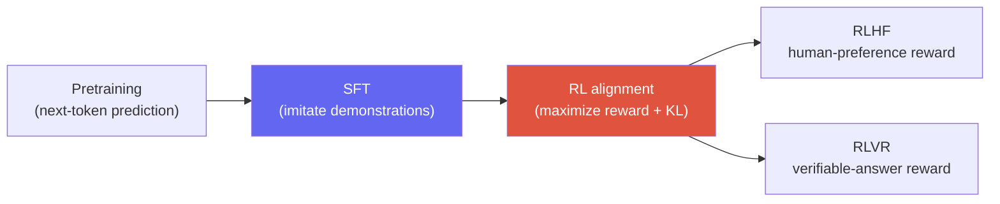

# RL Fundamentals Primer for LLMs

> [!NOTE] Goal of this chapter
> The [Alignment](#/llm/alignment) and [Reasoning](#/llm/reasoning) chapters assume familiarity with reinforcement-learning terms such as RLHF, PPO, and GRPO. This primer supplies **exactly the RL vocabulary needed to read those chapters**, emphasizing intuition over equations. The goal is not to become an RL specialist, but to read an explanation of RLHF or GRPO without getting stuck. [Alignment](#/llm/alignment) continues with concrete PPO, DPO, and GRPO recipes.

## What and why

Most learning covered so far has been **supervised learning**: there is a correct target, and training reduces the loss that measures how far a prediction is from it; see [What Is Machine Learning?](#/foundations/what-is-ml). But a "good answer" rarely has one uniquely correct sentence. Helpful, safe, or mathematically correct responses can have many surface forms. What we can often assign instead is a **score describing how good the result was—a reward**.

**Reinforcement learning (RL)** learns from a **reward signal** rather than a fixed target. In one loop:

> Try an action → receive a reward → **shift behavior slightly toward actions that earn more reward.**

Late-stage LLM training such as RLHF and RLVR uses this framework: give high reward to answers that people prefer or that satisfy a verifiable checker, then make the model produce such answers more often.

## The participants in RL — the interaction loop

RL involves two central participants, an **agent** and an **environment**, interacting one step at a time. A finite episode ends at a terminal state or maximum horizon; only a continuing task interacts indefinitely.

<figure>
<svg viewBox="0 0 640 250" xmlns="http://www.w3.org/2000/svg" font-family="Inter, sans-serif" font-size="13">
  <defs>
    <marker id="rlar" markerWidth="9" markerHeight="9" refX="7" refY="3" orient="auto"><path d="M0 0 L7 3 L0 6" fill="#98a3b2"/></marker>
  </defs>
  <!-- agent -->
  <rect x="40" y="90" width="180" height="70" rx="10" fill="#e0533f"/>
  <text x="130" y="120" text-anchor="middle" fill="#fff" font-weight="700">Agent</text>
  <text x="130" y="142" text-anchor="middle" fill="#fff" font-size="12">our model = policy π</text>
  <!-- environment -->
  <rect x="420" y="90" width="180" height="70" rx="10" fill="#6366f1"/>
  <text x="510" y="120" text-anchor="middle" fill="#fff" font-weight="700">Environment</text>
  <text x="510" y="142" text-anchor="middle" fill="#fff" font-size="12">conversation / task</text>
  <!-- top arrow: action -->
  <path d="M220 108 C 300 70, 340 70, 420 108" fill="none" stroke="#98a3b2" stroke-width="2" marker-end="url(#rlar)"/>
  <text x="320" y="66" text-anchor="middle" fill="#e0533f" font-weight="700">action</text>
  <text x="320" y="82" text-anchor="middle" fill="#98a3b2" font-size="11">next token / response</text>
  <!-- bottom arrow: reward + next state -->
  <path d="M420 150 C 340 190, 300 190, 220 150" fill="none" stroke="#98a3b2" stroke-width="2" marker-end="url(#rlar)"/>
  <text x="320" y="205" text-anchor="middle" fill="#0ea5e9" font-weight="700">reward + next state</text>
  <text x="320" y="222" text-anchor="middle" fill="#98a3b2" font-size="11">score + context so far</text>
</svg>
<figcaption>The heart of RL is this loop. The agent observes a <b>state</b> and takes an <b>action</b>; the environment returns a <b>reward</b> and a new state. Repeating the loop refines the action rule toward higher reward.</figcaption>
</figure>

<dl class="kv">
<dt>Agent</dt><dd>The entity that chooses actions—in an LLM setting, <b>the model itself</b>.</dd>
<dt>Environment</dt><dd>The world with which the agent interacts—in an LLM setting, the conversation or task.</dd>
<dt>State</dt><dd>The situation so far—in an LLM setting, the prompt plus tokens already generated.</dd>
<dt>Action</dt><dd>The agent's choice—in an LLM setting, the <b>next token</b>, although an entire response may also be modeled as one action.</dd>
<dt>Reward, r</dt><dd>A number describing how good the action was, such as human preference or answer correctness. Larger is better.</dd>
<dt>Policy, π</dt><dd>The rule that maps a state to actions—in an LLM, <b>the model itself</b>, represented by the next-token distribution $\pi(a\mid s)$.</dd>
</dl>

> [!NOTE] Mapping an LLM onto RL
> One sentence is enough: **policy = model, action = token generation, state = context so far, reward = score assigned to the response.** An LLM environment is often simpler than a game: provide a prompt, let the model finish one answer, then assign one reward to that answer.

## Return — accumulate rewards into the future

Looking at only the immediate reward is myopic. RL aims to maximize the **return**, the total reward expected from now on. Future rewards are commonly discounted by a factor $\gamma$:

$$G_t = r_t + \gamma\, r_{t+1} + \gamma^2 r_{t+2} + \cdots = \sum_{k\ge 0}\gamma^k\, r_{t+k}\qquad (0\le\gamma\le 1)$$

<dl class="kv">
<dt>$\gamma \to 1$</dt><dd>Preserves rewards far into the future: a long-horizon agent.</dd>
<dt>$\gamma \to 0$</dt><dd>Cares almost entirely about immediate reward: a myopic agent.</dd>
</dl>

Many LLM setups provide a single reward only when the response ends, so $\gamma$ may not be a major practical knob. The return concept itself—an action's value includes the future rewards it causes—is still the basis for understanding value and advantage.

## The central idea — increase the probability of good actions

The intuition behind RL training is simple:

> **Make actions that led to high reward more likely next time, and actions that led to low reward less likely.**

A **policy gradient** turns that intuition into a gradient. Supervised learning says "increase the probability of the correct token"; a policy gradient says "increase the probability of a token that received **high reward**." Conceptually:

$$\nabla_\theta J \;\approx\; \mathbb{E}\big[\,\underbrace{A}_{\text{how good}}\;\cdot\;\underbrace{\nabla_\theta \log \pi_\theta(a\mid s)}_{\text{direction that raises this action's probability}}\big]$$

Read $\nabla\log\pi$ as the direction that raises the action's probability. The advantage $A$, explained next, controls how strongly and with which sign to move. If $A>0$, raise the probability; if $A<0$, lower it. The remaining update is the familiar gradient-based [optimization](#/foundations/optimization).

## Value and advantage

Using reward $r$ directly as the weight creates a problem. If every answer typically receives +8 to +10, is +9 good or bad? We need a **baseline**.

<dl class="kv">
<dt>Value / critic, V</dt><dd>An auxiliary model that estimates "how much return should I expect from this state on average?" It serves as a reward <b>baseline</b>.</dd>
<dt>Advantage, A</dt><dd><b>How much better was this action than average?</b> Formally, $A(s,a)=Q(s,a)-V(s)$. Training uses estimators such as a sampled return minus $V$ or GAE. A positive value raises the action's probability; a negative value lowers it.</dd>
</dl>

Subtracting a baseline does two things. First, it makes the sign **relative**: we can tell whether +9 is better than an average of +8. Second, it makes learning much **more stable**. Absolute reward can vary wildly and produce high-variance gradients; centering around a baseline reduces that variance.

<figure>
<svg viewBox="0 0 640 170" xmlns="http://www.w3.org/2000/svg" font-family="Inter, sans-serif" font-size="12">
  <!-- baseline -->
  <line x1="60" y1="90" x2="580" y2="90" stroke="#98a3b2" stroke-width="1.6" stroke-dasharray="5 4"/>
  <text x="590" y="94" fill="#98a3b2">baseline V (average)</text>
  <!-- bars -->
  <g>
    <rect x="110" y="50" width="46" height="40" fill="#12a150"/>
    <text x="133" y="42" text-anchor="middle" fill="#12a150" font-weight="700">A&gt;0</text>
    <text x="133" y="118" text-anchor="middle" fill="currentColor">probability ↑</text>
  </g>
  <g>
    <rect x="250" y="90" width="46" height="34" fill="#e0533f"/>
    <text x="273" y="140" text-anchor="middle" fill="#e0533f" font-weight="700">A&lt;0</text>
    <text x="273" y="42" text-anchor="middle" fill="currentColor">probability ↓</text>
  </g>
  <g>
    <rect x="390" y="62" width="46" height="28" fill="#12a150"/>
    <text x="413" y="54" text-anchor="middle" fill="#12a150" font-weight="700">A&gt;0</text>
  </g>
  <g>
    <rect x="500" y="90" width="46" height="18" fill="#e0533f"/>
    <text x="523" y="124" text-anchor="middle" fill="#e0533f" font-weight="700">A&lt;0</text>
  </g>
</svg>
<figcaption>Advantage measures above or below the baseline average. Actions above it, in green, become more probable; actions below it, in red, become less probable. Using "how much better than average" instead of absolute reward is a key variance-reduction device.</figcaption>
</figure>

## Try it yourself — compute a return

Implement the discounted return that RL maximizes, $G=\sum_k \gamma^k r_k$. Fill in the **live editor** and select **▶ Run tests**. Open **Solution** if needed; the first run can take a moment while the Python runtime downloads.

<div class="widget" data-widget="code">
<script type="application/json" class="code-config">
{"func":"discounted_return","packages":[],"approx":true,"starter":"def discounted_return(rewards, gamma):\n    # rewards: rewards in temporal order [r0, r1, r2, ...]\n    # Return r0 + gamma*r1 + gamma^2*r2 + ... as one float.\n    total = 0.0\n    # TODO\n    return total","tests":[{"args":[[1.0,1.0,1.0],0.5],"expect":1.75,"tol":0.0001},{"args":[[0.0,0.0,10.0],1.0],"expect":10.0,"tol":0.0001},{"args":[[1.0,2.0,3.0],0.9],"expect":5.23,"tol":0.0001},{"args":[[5.0],0.99],"expect":5.0,"tol":0.0001},{"args":[[1.0,100.0],0.0],"expect":1.0,"tol":0.0001}],"solution":"def discounted_return(rewards, gamma):\n    total = 0.0\n    for i, r in enumerate(rewards):\n        total += (gamma ** i) * r\n    return total"}
</script>
</div>

The final test, $\gamma=0$, ignores the future reward of 100 and counts only the immediate reward of 1. The code makes clear how $\gamma$ controls the planning horizon.

## What PPO adds — clipping and a critic

Pure policy gradients have two practical problems: a very large update can **damage the policy**, and a reward-only gradient can have **extremely high variance**. **Proximal Policy Optimization (PPO)**, a long-standing baseline for RLHF, addresses both.

**① Clipped surrogate — stability.** Define the probability ratio between the new and old policies as $r=\dfrac{\pi_\text{new}(a\mid s)}{\pi_\text{old}(a\mid s)}$ and optimize

$$L^{\text{CLIP}}=\mathbb E\left[\min\big(rA,\operatorname{clip}(r,1-\epsilon,1+\epsilon)A\big)\right].$$

The key is that PPO does **not forcibly constrain the ratio itself to the interval**. Instead, it flattens objective improvement in the direction determined by the advantage sign. PPO clipping is a useful conservative heuristic, not a hard trust-region guarantee on policy change.

<figure>
<svg viewBox="0 0 640 150" xmlns="http://www.w3.org/2000/svg" font-family="Inter, sans-serif" font-size="12">
  <line x1="60" y1="100" x2="600" y2="100" stroke="#98a3b2" stroke-width="1.4"/>
  <!-- clip window -->
  <rect x="230" y="40" width="200" height="60" fill="#12a150" opacity="0.14"/>
  <line x1="230" y1="30" x2="230" y2="110" stroke="#12a150" stroke-width="1.6" stroke-dasharray="4 3"/>
  <line x1="430" y1="30" x2="430" y2="110" stroke="#12a150" stroke-width="1.6" stroke-dasharray="4 3"/>
  <text x="230" y="24" text-anchor="middle" fill="#12a150">1−ε</text>
  <text x="430" y="24" text-anchor="middle" fill="#12a150">1+ε</text>
  <text x="330" y="130" text-anchor="middle" fill="#12a150" font-weight="700">clip reference interval</text>
  <text x="140" y="130" text-anchor="middle" fill="#e0533f">A&lt;0 gain flattens</text>
  <text x="520" y="130" text-anchor="middle" fill="#e0533f">A&gt;0 gain flattens</text>
  <circle cx="330" cy="100" r="5" fill="#6366f1"/>
  <text x="330" y="90" text-anchor="middle" fill="#6366f1">r=1 (no change)</text>
</svg>
<figcaption>PPO does not forcibly clip the ratio itself; the clipped surrogate flattens improvement according to the sign of the advantage. It is an empirical device that discourages large updates, not a hard distance guarantee.</figcaption>
</figure>

**② Critic — variance reduction.** PPO trains a **value-estimating critic** alongside the policy, or actor, and uses that estimate as a baseline to compute advantage $A=$ return $-\,V$. Subtracting the baseline reduces gradient variance and stabilizes learning, which is why PPO belongs to the actor-critic family.

<details class="concept-code">
<summary>View conceptual code</summary>

> The following PyTorch-style **pseudocode** retains only the core of one PPO minibatch. Rollout collection, GAE, and distributed-training details are omitted.

```python
def ppo_update(batch):
    policy.train(); critic.train()
    old_policy.eval(); reference.eval()
    valid = batch.response_mask.bool()  # Exclude prompt and padding tokens from loss.

    with no_grad():
        old_logp = old_policy.logp(batch.tokens).detach()
        ref_logp = reference.logp(batch.tokens).detach()
        old_value = critic(batch.tokens).detach()
        advantage, returns = compute_gae(batch.rewards, old_value, valid)
        advantage = normalize_over_valid(advantage, valid).detach()

    new_logp = policy.logp(batch.tokens)
    value = critic(batch.tokens)
    ratio = exp(new_logp - old_logp)    # Do not backpropagate into the old policy.
    unclipped = ratio * advantage
    clipped = clamp(ratio, 1-eps, 1+eps) * advantage

    policy_loss = -masked_mean(min(unclipped, clipped), valid)
    value_loss = masked_mean((value - returns.detach()) ** 2, valid)
    sampled_kl = masked_mean(new_logp - ref_logp, valid)
    loss = policy_loss + c_v * value_loss + beta * sampled_kl

    optimizer.zero_grad(); loss.backward()
    clip_grad_norm_(trainable_parameters, max_norm)
    optimizer.step()
```

</details>

> [!TIP] Interview one-liner
> "PPO adds a **clipped surrogate**, which suppresses excessive improvement incentives, and a **critic**, which provides a variance-reducing baseline, to the policy gradient." Clipping is not a hard constraint. GRPO replaces the learned critic with a group-relative reward baseline from completions of the same prompt; see [Alignment](#/llm/alignment) for variants and limitations.

## KL penalty — do not move too far from the reference

Optimizing reward without restraint can erode the model's language ability or drive it toward strange outputs that exploit a reward-model weakness. This is **reward hacking**. Training therefore measures how far the policy has moved from a **reference model** with KL divergence and penalizes large departures:

$$\text{total objective}=\underbrace{\mathbb{E}[\,r\,]}_{\text{maximize reward}}\;-\;\beta\cdot\underbrace{\mathrm{KL}\big(\pi_\theta \,\|\, \pi_\text{ref}\big)}_{\text{distance from reference}}$$

$\beta$ controls the strength of the tether. A large value keeps the policy close to the reference and limits change; a small value permits more optimization but raises the risk of runaway behavior. KL divergence measures how different two probability distributions are; it is the same entropy, cross-entropy, and KL context covered in [Probability & Statistics](#/foundations/probability-statistics).

> [!WARNING] Common misconception
> A KL penalty does not pull the model "toward the correct answer." It prevents an abrupt departure from the **reference model's behavior and knowledge**. The tension between raising reward and staying near the reference is central to RLHF tuning.

## Why use RL for LLMs?

Next-token prediction can learn plausible language, but it does not guarantee a helpful, safe, or correct answer—the alignment gap in [LLM Fundamentals](#/llm/fundamentals). RL expresses objectives without one fixed target sentence—human preference, safety, or answer correctness—as rewards and aligns the model toward them.



- **RLHF**: maximize a reward model trained from human preferences → [Alignment](#/llm/alignment)
- **RLVR**: reward verifiable results such as math answers or code execution → [Reasoning](#/llm/reasoning)

## Q&A

<details class="qa"><summary>Why use RL instead of directly teaching good answers with supervised fine-tuning?</summary>
<div class="qa-body">

**Short:** SFT also lowers the probability of competing tokens. RL's distinguishing value is direct optimization of sequence-level, non-differentiable, on-policy objectives while exploring the current policy's failures.

**Deep:** SFT's softmax cross-entropy raises the target token's probability while lowering competitors. The learning signal differs: SFT optimizes token likelihood for a provided target sequence, whereas RL optimizes a non-differentiable reward over the entire response—final correctness, execution success, or human preference—and learns from rollouts of the current policy. Preference labels can be cheaper than complete ideal answers, but expert judgment or safety review can also be more expensive. Real pipelines combine SFT, offline preference optimization, and online RL according to the objective and available data.
</div></details>

<details class="qa"><summary>How are advantage and reward different?</summary>
<div class="qa-body">

**Short:** Reward is an absolute score; advantage says how much better the action was than average—reward relative to a baseline.

**Deep:** If every response receives around +9, weighting gradients by the raw reward reinforces everything, obscures direction, and produces high variance. Subtract a baseline—an average estimated by a critic, or the group mean of same-prompt completions in GRPO—and only above-average responses receive positive signal while below-average responses receive negative signal. Advantage is the final signal that directly says whether to reinforce or suppress an action.
</div></details>

## Cheat-sheet

| Concept | One line |
| --- | --- |
| RL | Learn from reward rather than a target; maximize reward |
| Policy, π | State→action rule = the LLM itself, a token probability distribution |
| Return | Discounted future reward $\sum\gamma^k r_k$; $\gamma$ controls horizon |
| Reward vs loss | Maximize ↑ versus minimize ↓; opposite signs |
| Policy gradient | Move in the direction that increases probability of high-reward actions |
| Advantage, A | Return − baseline: how much better than average; negative means probability ↓ |
| Critic / value | Auxiliary model estimating average return as a baseline, reducing variance |
| PPO | Policy gradient + clipping to limit incentives for large updates + critic for variance reduction |
| KL penalty | Tether the policy so it does not move too far from a reference model |
| Why RL for LLMs | Align objectives without one target sentence: preference, safety, correctness |

**Next:** [Post-Training & Alignment](#/llm/alignment) · [Reasoning & Test-Time Compute](#/llm/reasoning)
