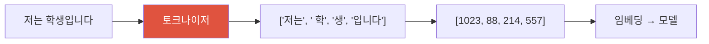

# 토크나이제이션 & BPE

> [!NOTE] 이 챕터의 목표
> LLM은 글자를 눈으로 읽지 않습니다 — 텍스트를 **토큰(token)** 이라는 조각으로 쪼갠 뒤, 각 토큰을 **숫자 ID**로 바꿔서 봅니다. 이 챕터는 "텍스트가 어떻게 숫자가 되는가"를 그림과 짧은 코드로 잡습니다. 수식이 처음이어도 괜찮게, 직관부터 갑니다. 다음 챕터 [임베딩](#/llm/embeddings)에서 이 ID가 의미를 담은 벡터로 바뀝니다.

## 무엇을, 왜

신경망은 숫자만 계산합니다. `"안녕"` 같은 글자를 그대로 넣을 수는 없습니다. 그래서 모델에 넣기 전에 두 단계를 거칩니다.

1. **쪼개기**: 문장을 정해진 사전(vocabulary, 어휘 사전)에 있는 **토큰** 단위로 나눕니다.
2. **번호 매기기**: 각 토큰을 사전에서의 **정수 ID**로 바꿉니다.

이 전체 과정을 **토크나이제이션(tokenization, 토큰화)** 이라 하고, 그 일을 하는 도구를 **토크나이저(tokenizer)** 라고 합니다.

<figure>
<svg viewBox="0 0 640 210" xmlns="http://www.w3.org/2000/svg" font-family="Inter, sans-serif" font-size="12">
  <!-- stage labels -->
  <text x="95"  y="24" text-anchor="middle" font-weight="700" fill="#0ea5e9">① 원문 텍스트</text>
  <text x="320" y="24" text-anchor="middle" font-weight="700" fill="#e0533f">② 토큰(조각)</text>
  <text x="560" y="24" text-anchor="middle" font-weight="700" fill="#6366f1">③ 정수 ID</text>
  <!-- raw text -->
  <rect x="25" y="80" width="140" height="46" rx="8" fill="none" stroke="#0ea5e9" stroke-width="1.6"/>
  <text x="95" y="108" text-anchor="middle" fill="currentColor" font-family="JetBrains Mono, monospace">"학습하기"</text>
  <!-- arrow -->
  <path d="M170 103 H210" stroke="#98a3b2" stroke-width="1.5" marker-end="url(#tk)"/>
  <!-- tokens -->
  <g font-family="JetBrains Mono, monospace" font-size="12">
    <rect x="218" y="72" width="58" height="26" rx="6" fill="rgba(224,83,63,.15)" stroke="#e0533f" stroke-width="1.3"/>
    <text x="247" y="90" text-anchor="middle" fill="currentColor">학습</text>
    <rect x="218" y="108" width="58" height="26" rx="6" fill="rgba(224,83,63,.15)" stroke="#e0533f" stroke-width="1.3"/>
    <text x="247" y="126" text-anchor="middle" fill="currentColor">하기</text>
    <rect x="286" y="90" width="70" height="26" rx="6" fill="rgba(224,83,63,.15)" stroke="#e0533f" stroke-width="1.3"/>
    <text x="321" y="108" text-anchor="middle" fill="currentColor" font-size="10">(예시)</text>
  </g>
  <!-- arrow -->
  <path d="M362 103 H418" stroke="#98a3b2" stroke-width="1.5" marker-end="url(#tk)"/>
  <text x="390" y="94" text-anchor="middle" fill="#98a3b2" font-size="10">사전 조회</text>
  <!-- ids -->
  <g font-family="JetBrains Mono, monospace" font-size="13">
    <rect x="500" y="72" width="90" height="26" rx="6" fill="rgba(99,102,241,.15)" stroke="#6366f1" stroke-width="1.3"/>
    <text x="545" y="90" text-anchor="middle" fill="currentColor">8402</text>
    <rect x="500" y="108" width="90" height="26" rx="6" fill="rgba(99,102,241,.15)" stroke="#6366f1" stroke-width="1.3"/>
    <text x="545" y="126" text-anchor="middle" fill="currentColor">311</text>
  </g>
  <text x="320" y="182" text-anchor="middle" fill="#98a3b2" font-size="11">→ ③의 ID 리스트가 신경망의 실제 입력이 됩니다 (다음은 [임베딩])</text>
  <defs><marker id="tk" markerWidth="8" markerHeight="8" refX="6" refY="3" orient="auto"><path d="M0 0 L6 3 L0 6" fill="#98a3b2"/></marker></defs>
</svg>
<figcaption>텍스트 → 토큰 → 정수 ID. 토크나이저는 이 왼쪽 두 단계를 담당합니다. ID는 사전에서의 "몇 번째 칸"일 뿐, 크기 자체엔 의미가 없습니다(그 의미는 다음 챕터의 임베딩이 채웁니다).</figcaption>
</figure>

정리하면 파이프라인은 이렇습니다.

## 쪼개는 단위를 무엇으로? — 세 가지 선택

가장 중요한 설계 질문은 "**얼마나 잘게 쪼갤 것인가**"입니다. 극단 두 개와 그 절충을 봅시다.

| 방식 | 쪼개는 단위 | 예: `"unhappiness"` | 문제 |
| --- | --- | --- | --- |
| **단어(word)** | 띄어쓰기 단위 | `["unhappiness"]` | 사전이 폭발; 오탈자·신조어를 못 다룸(OOV) |
| **문자(char)** | 글자 하나하나 | `["u","n","h",...]` (11개) | 사전은 작지만 시퀀스가 너무 길어짐 |
| **서브워드(subword)** | 자주 쓰는 조각 | `["un","happ","iness"]` | ✅ 둘의 절충 — 현대 LLM의 표준 |

**왜 단어 단위가 안 되나?** 세상의 단어는 사실상 무한합니다(이름, 신조어, 오타, 합성어…). 사전을 아무리 크게 잡아도 학습 때 못 본 단어가 반드시 등장하는데, 이를 **OOV(Out-Of-Vocabulary, 사전에 없는 단어)** 라고 합니다. 단어 단위 토크나이저는 OOV를 만나면 `[UNK]`(unknown) 같은 미아 토큰으로 뭉개 버려 정보를 잃습니다.

**왜 문자 단위가 안 되나?** 반대 극단입니다. 문자 집합을 완전히 덮는다면 사전이 작고 OOV도 줄지만, 결합 문자·이모지·정규화 규칙까지 다루려면 설계가 복잡합니다. 또한 `"hello"` 한 단어가 5토큰이 되어 **시퀀스가 몇 배로 길어집니다**. 표준 full-attention Transformer의 attention 연산·attention map 메모리는 길이의 **제곱**($O(n^2)$)으로 늘기 때문에 긴 시퀀스가 비싸집니다(선형·희소 attention은 다른 복잡도를 가질 수 있습니다).

**그래서 서브워드.** 자주 나오는 덩어리(`ing`, `▁the`, `학생`)는 통째로 한 토큰, 드문 단어는 여러 조각으로 쪼갭니다. 그러면 흔한 말은 짧고 드문 말은 더 작은 조각으로 표현됩니다. 단, **서브워드라는 사실만으로 OOV가 사라지는 것은 아닙니다**. byte-level 기반이나 byte/character fallback처럼 모든 입력을 덮는 기본 단위가 있어야 합니다. 이 절충을 자동으로 찾는 대표 알고리즘이 **BPE**입니다.

> [!TIP] 면접 한 줄
> "vocab size는 진짜 trade-off다 — 너무 작으면 시퀀스가 길어져 attention 비용(제곱)이 커지고, 너무 크면 embedding/LM-head 행렬이 커지고 희귀 토큰이 덜 학습된다. 서브워드는 char의 짧은 사전과 word의 짧은 시퀀스 사이 절충이며, byte 수준에서 시작하면 OOV가 원천적으로 없다." 여기에 "숫자·다국어 토큰화가 산수·비영어 성능에 세금을 매긴다"를 덧붙이면 감각 있는 답이 됩니다.

## BPE — 자주 붙어 나오는 쌍을 합친다

**BPE(Byte-Pair Encoding, 바이트 쌍 부호화)** 의 아이디어는 놀랄 만큼 단순합니다.

1. 처음엔 모든 텍스트를 **글자(또는 바이트) 낱개**로 둡니다.
2. 지금 **가장 자주 인접해 등장하는 쌍**을 찾아 하나의 새 토큰으로 **합칩니다(merge)**.
3. 원하는 사전 크기가 될 때까지 2번을 반복합니다.

자주 붙어 다니는 조각일수록 먼저 하나의 토큰으로 "승격"됩니다. 작은 예로 `low low lower`를 봅시다(공백은 무시, 글자 단위 시작).

<figure>
<svg viewBox="0 0 620 210" xmlns="http://www.w3.org/2000/svg" font-family="JetBrains Mono, monospace" font-size="13">
  <text x="10" y="30" font-family="Inter" fill="#98a3b2">시작:</text>
  <text x="110" y="30" fill="currentColor">l o w · l o w · l o w e r</text>
  <text x="10" y="74" font-family="Inter" fill="#e0533f">1단계:</text>
  <text x="110" y="74" font-family="Inter" font-size="11" fill="#98a3b2">가장 잦은 쌍 (l, o) × 3 → 합쳐서 "lo"</text>
  <text x="110" y="96" fill="currentColor"><tspan fill="#e0533f">lo</tspan> w · <tspan fill="#e0533f">lo</tspan> w · <tspan fill="#e0533f">lo</tspan> w e r</text>
  <text x="10" y="140" font-family="Inter" fill="#6366f1">2단계:</text>
  <text x="110" y="140" font-family="Inter" font-size="11" fill="#98a3b2">가장 잦은 쌍 (lo, w) × 3 → 합쳐서 "low"</text>
  <text x="110" y="162" fill="currentColor"><tspan fill="#6366f1">low</tspan> · <tspan fill="#6366f1">low</tspan> · <tspan fill="#6366f1">low</tspan> e r</text>
  <text x="10" y="200" font-family="Inter" fill="#12a150">결과 사전:</text>
  <text x="130" y="200" fill="currentColor">l, o, w, e, r, lo, low</text>
</svg>
<figcaption>BPE 병합 과정. 자주 붙어 나오는 쌍부터 하나의 토큰으로 승격됩니다. 몇 번 병합하느냐(= 목표 vocab 크기)가 hyperparameter입니다. 흔한 <code>low</code>는 통째로 한 토큰이 되고, 드문 <code>lower</code>는 <code>low</code>+<code>e</code>+<code>r</code>로 남습니다 — 흔한 건 짧게, 드문 건 조각으로.</figcaption>
</figure>

핵심은 병합 규칙 목록(`(l,o)→lo`, `(lo,w)→low`, …)이 곧 토크나이저라는 점입니다. 새 텍스트가 들어오면 이 규칙을 순서대로 적용해 토큰으로 쪼갭니다.

### 실전 토크나이저 두 계열

- **Byte-level BPE 계열** (GPT-2류, GPT용 tiktoken 등): 글자가 아니라 원시 **바이트(0~255)** 를 덮는 기본 사전에서 시작합니다. 어떤 바이트열도 표현할 수 있어 `[UNK]`가 필요 없지만, 표시 방식은 구현마다 다릅니다. 예를 들어 GPT-2식 시각화는 앞 공백을 `Ġ`처럼 보입니다.
- **SentencePiece** (T5, Llama 1/2 등): 텍스트를 미리 단어로 나누지 않고 원문에 가까운 문자열에서 직접 학습하며 BPE 또는 unigram 방식을 씁니다. 공백을 `▁` 메타심볼로 다룰 수 있고 byte fallback도 선택할 수 있습니다. 정규화 설정에 따라 원문이 바뀔 수 있으므로 항상 완벽한 왕복 복원을 보장하지는 않습니다. 참고로 Llama 3은 SentencePiece가 아니라 tiktoken에서 파생된 토크나이저를 사용합니다.

## 직접 돌려보기 — 병합할 쌍 찾기

BPE 한 스텝의 심장은 "지금 가장 자주 인접한 쌍"을 찾는 것입니다. 토큰 리스트를 받아 **가장 빈번한 인접 쌍**을 반환하는 함수를 구현하세요. (동점이면 먼저 등장한 쌍을 고릅니다.) 아래 에디터에 채워 넣고 **▶ Run tests**를 누르면 채점됩니다. 막히면 **Solution**을 열어 보세요.

`max`에 `key`만 주고 `order`(처음 등장 순서) 위로 순회하면, 파이썬 `max`는 첫 최댓값을 반환하므로 동점 시 먼저 등장한 쌍이 뽑힙니다. 실제 BPE는 여기서 찾은 쌍을 하나로 합치고(`l`,`o` → `lo`) 이 과정을 목표 vocab 크기까지 반복할 뿐입니다.

## vocab 크기라는 진짜 trade-off

병합을 몇 번 하느냐가 곧 사전 크기입니다. 이건 공짜 선택이 아니라 양쪽에 비용이 있는 **저울질**입니다.

작은 vocab (병합 적게)

- embedding/출력 행렬이 작아 파라미터·메모리 절약
- 하지만 문장이 **더 많은 토큰**으로 쪼개짐 → 시퀀스 길어짐 → attention 비용(제곱↑)·유효 context 압박

큰 vocab (병합 많이)

- 문장이 **적은 토큰**으로 → 짧은 시퀀스, 빠른 추론
- 하지만 embedding/LM-head 행렬이 커지고, 희귀 토큰은 등장이 드물어 학습이 덜 됨

실전 LLM은 보통 3만~15만 사이에 자리 잡습니다(예: GPT-2 계열 약 5만, 최근 다국어 모델은 10만+). "정답"은 없고, 지원 언어 수와 배포 제약에 따라 정하는 hyperparameter입니다.

> [!WARNING] 조용한 함정: 숫자와 다국어
> **숫자:** 여러 자릿수를 불규칙하게 묶으면 `1234`가 문맥에 따라 다른 경계로 갈라져 자릿값 학습이 어려워질 수 있습니다. 일부 수학 지향 설계는 한 자리 또는 고정 길이 숫자 분할을 택하지만, 이것이 모든 모델의 표준은 아닙니다. **다국어:** 영어 위주 코퍼스로 학습한 tokenizer는 같은 의미의 한국어 문장을 더 많은 토큰으로 표현할 수 있습니다. 배율은 tokenizer와 텍스트에 따라 달라지며, 토큰 과금·context 한도에서 비영어 사용자에게 "토큰 세금"이 됩니다.

## Q&A

왜 문자 단위나 단어 단위가 아니라 서브워드인가요?

**짧게:** 사전 크기와 시퀀스 길이의 실용적 절충입니다. byte/character fallback까지 갖추면 OOV도 피할 수 있습니다.

**깊게:** 단어 단위는 사전이 수백만으로 폭발하고 신조어·오탈자를 처리 못 합니다(OOV → `[UNK]`로 정보 손실). 문자 단위는 사전은 작지만 `"hello"`가 5토큰이 되어 시퀀스가 길어지고 attention 비용($O(n^2)$)이 커집니다. 서브워드는 자주 쓰는 덩어리는 한 토큰, 드문 것은 몇 조각으로 나눠 둘을 절충합니다. 특히 바이트 수준에서 시작하면 이론상 어떤 입력도 표현 가능해 OOV가 사라집니다.

토크나이저는 모델과 함께 학습되나요?

**짧게:** 보통 언어 모델 학습 **전에** 코퍼스로 따로 학습해 고정하지만, 그 자체를 항상 손실 없는 압축기라고 부를 수는 없습니다.

**깊게:** 전형적인 파이프라인에서는 BPE 병합 규칙(또는 SentencePiece 사전)을 먼저 정하고 언어 모델 학습 중에는 고정합니다. 다만 정규화·공백 처리 설정은 원문을 바꿀 수 있고, differentiable/joint tokenization 연구도 있어 절대 법칙은 아닙니다. 학습 뒤 tokenizer를 바꾸면 ID 의미와 embedding/LM-head가 어긋나므로 vocabulary 확장·행렬 초기화와 추가 학습이 필요합니다.

같은 단어가 문장 안 위치에 따라 다른 토큰이 되기도 하나요?

**짧게:** 네. 특히 **앞 공백**이 토큰의 일부라서 그렇습니다.

**깊게:** byte-level BPE에서 `"dog"`(문장 첫머리)와 `" dog"`(공백 포함)는 서로 다른 토큰입니다 — 후자는 흔히 `Ġdog`처럼 표현됩니다. 그래서 프롬프트 끝에 공백을 두느냐 마느냐가 미묘하게 결과를 바꾸기도 합니다. 대소문자(`Dog` vs `dog`)도 보통 다른 토큰입니다.

## Cheat-sheet

| 개념 | 한 줄 |
| --- | --- |
| 토크나이제이션 | 텍스트 → 토큰 → 정수 ID (신경망의 실제 입력) |
| 단어 단위 | 사전 폭발 + OOV → ✗ |
| 문자 단위 | 사전 작지만 시퀀스 너무 김 → ✗ |
| 서브워드 | 자주 쓰는 조각 단위의 절충; byte/character fallback이 있으면 OOV 방지 |
| BPE | 가장 잦은 인접 쌍을 반복 병합해 사전 구성 |
| Byte-level BPE vs SentencePiece | 전자는 모든 byte를 기본 단위로 포함, 후자는 raw-text 학습 도구(BPE/unigram·선택적 fallback) |
| vocab trade-off | 작으면 시퀀스↑, 크면 행렬↑·희귀토큰 학습↓ |
| 함정 | 숫자(산수)·다국어(토큰 세금)·앞 공백 |

**다음:** [임베딩](#/llm/embeddings) · [다음 토큰 예측](#/llm/next-token)
