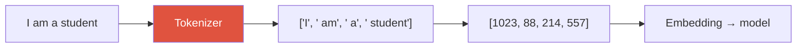

# Tokenization & BPE

> [!NOTE] Goal of this chapter
> An LLM does not read characters with its eyes. It splits text into pieces called **tokens**, then converts each token into a **numeric ID**. This chapter builds an intuitive, visual, and code-level understanding of how text becomes numbers. No prior comfort with equations is required. In the next chapter, [Embeddings](#/llm/embeddings), these IDs become vectors that carry learned information.

## What and why

Neural networks compute only on numbers; they cannot directly accept a string such as `"hello"`. Before a model sees text, two steps occur:

1. **Split**: divide the sentence into **tokens** found in a fixed vocabulary.
2. **Number**: replace each token with its integer **ID** in that vocabulary.

The complete process is **tokenization**, and the component that performs it is a **tokenizer**.

<figure>
<svg viewBox="0 0 640 210" xmlns="http://www.w3.org/2000/svg" font-family="Inter, sans-serif" font-size="12">
  <!-- stage labels -->
  <text x="95"  y="24" text-anchor="middle" font-weight="700" fill="#0ea5e9">① Raw text</text>
  <text x="320" y="24" text-anchor="middle" font-weight="700" fill="#e0533f">② Tokens (pieces)</text>
  <text x="560" y="24" text-anchor="middle" font-weight="700" fill="#6366f1">③ Integer IDs</text>
  <!-- raw text -->
  <rect x="25" y="80" width="140" height="46" rx="8" fill="none" stroke="#0ea5e9" stroke-width="1.6"/>
  <text x="95" y="108" text-anchor="middle" fill="currentColor" font-family="JetBrains Mono, monospace">"learning"</text>
  <!-- arrow -->
  <path d="M170 103 H210" stroke="#98a3b2" stroke-width="1.5" marker-end="url(#tk)"/>
  <!-- tokens -->
  <g font-family="JetBrains Mono, monospace" font-size="12">
    <rect x="218" y="72" width="58" height="26" rx="6" fill="rgba(224,83,63,.15)" stroke="#e0533f" stroke-width="1.3"/>
    <text x="247" y="90" text-anchor="middle" fill="currentColor">learn</text>
    <rect x="218" y="108" width="58" height="26" rx="6" fill="rgba(224,83,63,.15)" stroke="#e0533f" stroke-width="1.3"/>
    <text x="247" y="126" text-anchor="middle" fill="currentColor">ing</text>
    <rect x="286" y="90" width="70" height="26" rx="6" fill="rgba(224,83,63,.15)" stroke="#e0533f" stroke-width="1.3"/>
    <text x="321" y="108" text-anchor="middle" fill="currentColor" font-size="10">(example)</text>
  </g>
  <!-- arrow -->
  <path d="M362 103 H418" stroke="#98a3b2" stroke-width="1.5" marker-end="url(#tk)"/>
  <text x="390" y="94" text-anchor="middle" fill="#98a3b2" font-size="10">vocab lookup</text>
  <!-- ids -->
  <g font-family="JetBrains Mono, monospace" font-size="13">
    <rect x="500" y="72" width="90" height="26" rx="6" fill="rgba(99,102,241,.15)" stroke="#6366f1" stroke-width="1.3"/>
    <text x="545" y="90" text-anchor="middle" fill="currentColor">8402</text>
    <rect x="500" y="108" width="90" height="26" rx="6" fill="rgba(99,102,241,.15)" stroke="#6366f1" stroke-width="1.3"/>
    <text x="545" y="126" text-anchor="middle" fill="currentColor">311</text>
  </g>
  <text x="320" y="182" text-anchor="middle" fill="#98a3b2" font-size="11">→ The ID list in ③ is the neural network's actual input; next comes embedding</text>
  <defs><marker id="tk" markerWidth="8" markerHeight="8" refX="6" refY="3" orient="auto"><path d="M0 0 L6 3 L0 6" fill="#98a3b2"/></marker></defs>
</svg>
<figcaption>Text → tokens → integer IDs. The tokenizer handles these first two transformations. An ID is merely a position in the vocabulary; its numeric magnitude has no meaning. The embedding in the next chapter supplies a learned representation.</figcaption>
</figure>

In summary, the pipeline is:

## What should the splitting unit be? Three choices

The most important design question is **how finely to split text**. Consider two extremes and their compromise.

| Method | Unit | Example: `"unhappiness"` | Problem |
| --- | --- | --- | --- |
| **Word** | Whitespace-delimited word | `["unhappiness"]` | Vocabulary explodes; cannot handle typos or new words (OOV) |
| **Character** | One character at a time | `["u","n","h",...]` (11 tokens) | Small vocabulary, but sequences become too long |
| **Subword** | Frequently occurring pieces | `["un","happ","iness"]` | ✅ Practical compromise used by modern LLMs |

**Why not words?** The set of possible words is effectively unbounded because of names, neologisms, misspellings, and compounds. Any finite vocabulary eventually encounters an **out-of-vocabulary (OOV)** word. A word tokenizer collapses it into an orphan token such as `[UNK]` and loses information.

**Why not characters?** This is the opposite extreme. A character set can be small and reduce OOV if it covers every symbol, but combining marks, emoji, and normalization rules complicate the design. In addition, `"hello"` becomes five tokens and **sequences grow several times longer**. In a standard full-attention Transformer, attention computation and attention-map memory grow quadratically with length, $O(n^2)$, so long sequences are expensive. Linear and sparse attention variants can have different complexity.

**Therefore, subwords.** Frequent pieces such as `ing`, `▁the`, or common morphemes become one token; rare words split into smaller pieces. Common text stays short while unusual text remains representable. But **subwords alone do not eliminate OOV**. The tokenizer needs a base unit that covers all input, such as byte-level tokenization or byte/character fallback. **BPE** is a representative algorithm that discovers this compromise automatically.

> [!TIP] Interview one-liner
> "Vocabulary size is a real trade-off: too small and sequences grow, increasing quadratic attention cost; too large and the embedding and LM-head matrices grow while rare tokens are poorly trained. Subwords balance a character-level vocabulary with word-level sequence length, and starting from bytes eliminates OOV at the base level." Add that number and multilingual tokenization can impose a performance and cost tax on arithmetic and non-English text.

## BPE — merge frequently adjacent pairs

The idea behind **Byte-Pair Encoding (BPE)** is surprisingly simple:

1. Begin with every text represented as individual **characters or bytes**.
2. Find the **most frequent adjacent pair** and **merge** it into a new token.
3. Repeat step 2 until the target vocabulary size is reached.

Pieces that frequently occur together are promoted to single tokens first. Consider the tiny corpus `low low lower`, ignoring spaces and starting from characters.

<figure>
<svg viewBox="0 0 620 210" xmlns="http://www.w3.org/2000/svg" font-family="JetBrains Mono, monospace" font-size="13">
  <text x="10" y="30" font-family="Inter" fill="#98a3b2">Start:</text>
  <text x="110" y="30" fill="currentColor">l o w · l o w · l o w e r</text>
  <text x="10" y="74" font-family="Inter" fill="#e0533f">Step 1:</text>
  <text x="110" y="74" font-family="Inter" font-size="11" fill="#98a3b2">Most frequent pair (l, o) × 3 → merge into "lo"</text>
  <text x="110" y="96" fill="currentColor"><tspan fill="#e0533f">lo</tspan> w · <tspan fill="#e0533f">lo</tspan> w · <tspan fill="#e0533f">lo</tspan> w e r</text>
  <text x="10" y="140" font-family="Inter" fill="#6366f1">Step 2:</text>
  <text x="110" y="140" font-family="Inter" font-size="11" fill="#98a3b2">Most frequent pair (lo, w) × 3 → merge into "low"</text>
  <text x="110" y="162" fill="currentColor"><tspan fill="#6366f1">low</tspan> · <tspan fill="#6366f1">low</tspan> · <tspan fill="#6366f1">low</tspan> e r</text>
  <text x="10" y="200" font-family="Inter" fill="#12a150">Resulting vocabulary:</text>
  <text x="130" y="200" fill="currentColor">l, o, w, e, r, lo, low</text>
</svg>
<figcaption>The BPE merge process. Frequently adjacent pairs are promoted to one token first. The number of merges—the target vocabulary size—is a hyperparameter. Frequent <code>low</code> becomes one token, while rarer <code>lower</code> remains <code>low</code>+<code>e</code>+<code>r</code>: common text is short, rare text is represented in pieces.</figcaption>
</figure>

The key is that the ordered list of merge rules—`(l,o)→lo`, `(lo,w)→low`, and so on—is the tokenizer. For new text, apply those rules in order to segment it into tokens.

### Two tokenizer families in practice

- **Byte-level BPE family** (GPT-2 and GPT-oriented tiktoken): starts from a base vocabulary that covers raw **bytes 0–255**, rather than characters. Any byte sequence is representable without `[UNK]`, although display conventions differ. GPT-2-style visualizations, for example, show a leading space as `Ġ`.
- **SentencePiece** (T5, Llama 1/2, and others): trains directly from a string close to the raw text without first splitting it into words, using either BPE or a unigram model. It can represent spaces with the `▁` metasymbol and optionally use byte fallback. Normalization settings can alter the original text, so exact round-trip reconstruction is not always guaranteed. Llama 3 uses a tokenizer derived from tiktoken rather than SentencePiece.

## Try it yourself — find the pair to merge

The core of one BPE step is finding the most frequent adjacent pair. Implement a function that receives a token list and returns the **most frequent adjacent pair**. Break ties by choosing the pair that appears first. Fill in the editor and select **▶ Run tests**; open **Solution** if needed.

When `max` receives only a `key` function and iterates over `order`, Python returns the first maximum, so ties resolve to the earliest pair. Real BPE simply merges that pair—`l`,`o` → `lo`—and repeats until the target vocabulary size is reached.

## The real trade-off: vocabulary size

The number of merges determines vocabulary size. This is not a free choice; each side has a cost.

Small vocabulary (fewer merges)

- Smaller embedding and output matrices save parameters and memory
- But sentences split into **more tokens** → longer sequences → higher quadratic attention cost and pressure on usable context

Large vocabulary (more merges)

- Sentences use **fewer tokens** → shorter sequences and faster inference
- But embedding and LM-head matrices grow, and rare tokens receive fewer training examples

Production LLM vocabularies often fall roughly between 30,000 and 150,000 tokens: GPT-2-family tokenizers are around 50,000, while recent multilingual models often exceed 100,000. There is no universal answer; vocabulary size is a hyperparameter chosen for the supported languages and deployment constraints.

> [!WARNING] Quiet traps: numbers and multilingual text
> **Numbers:** irregular grouping of multiple digits can split `1234` at different boundaries by context and make place-value learning harder. Some math-oriented designs use one digit or fixed-length digit groups, but this is not a universal standard. **Multilingual text:** a tokenizer trained primarily on English can require more tokens to express an equivalent sentence in another language. The multiplier depends on the tokenizer and text, but it creates a "token tax" through billing and context limits for non-English users.

## Q&A

Why subwords rather than characters or words?

**Short:** They provide a practical compromise between vocabulary size and sequence length. Byte or character fallback also avoids OOV.

**Deep:** Word tokenization explodes to millions of entries and cannot handle new words or misspellings, losing information through `[UNK]`. Character tokenization keeps the vocabulary small but turns `"hello"` into five tokens, making sequences longer and attention more expensive at $O(n^2)$. Subwords keep frequent chunks as one token and split rare items into pieces. Starting at the byte level makes any input representable in principle and eliminates OOV.

Is the tokenizer trained together with the model?

**Short:** Usually it is trained separately on a corpus **before** language-model training and then frozen, but it is not always a lossless compressor.

**Deep:** In a typical pipeline, BPE merge rules or a SentencePiece vocabulary are fixed before LM training. Normalization and whitespace settings can still change the source text, and differentiable or joint tokenization research means this is not an absolute law. Changing the tokenizer after training misaligns ID meanings with the embedding and LM head, requiring vocabulary expansion, matrix initialization, and additional training.

Can the same word become different tokens depending on its position?

**Short:** Yes, especially because a **leading space** can be part of the token.

**Deep:** In byte-level BPE, `"dog"` at the beginning of a sentence and `" dog"` with a leading space are different tokens; the latter is often displayed as `Ġdog`. A trailing space in a prompt can therefore subtly alter results. Capitalization such as `Dog` versus `dog` usually changes tokens as well.

## Cheat-sheet

| Concept | One line |
| --- | --- |
| Tokenization | Text → tokens → integer IDs, the neural network's actual input |
| Word level | Vocabulary explosion + OOV → impractical |
| Character level | Small vocabulary, but sequences become too long |
| Subword | Compromise built from frequent pieces; byte/character fallback prevents OOV |
| BPE | Repeatedly merge the most frequent adjacent pair to build a vocabulary |
| Byte-level BPE vs SentencePiece | The former includes every byte as a base unit; the latter is a raw-text training toolkit supporting BPE, unigram, and optional fallback |
| Vocabulary trade-off | Smaller means longer sequences; larger means larger matrices and weaker training of rare tokens |
| Traps | Numbers and arithmetic, multilingual token tax, and leading spaces |

**Next:** [Embeddings](#/llm/embeddings) · [Next-Token Prediction](#/llm/next-token)
